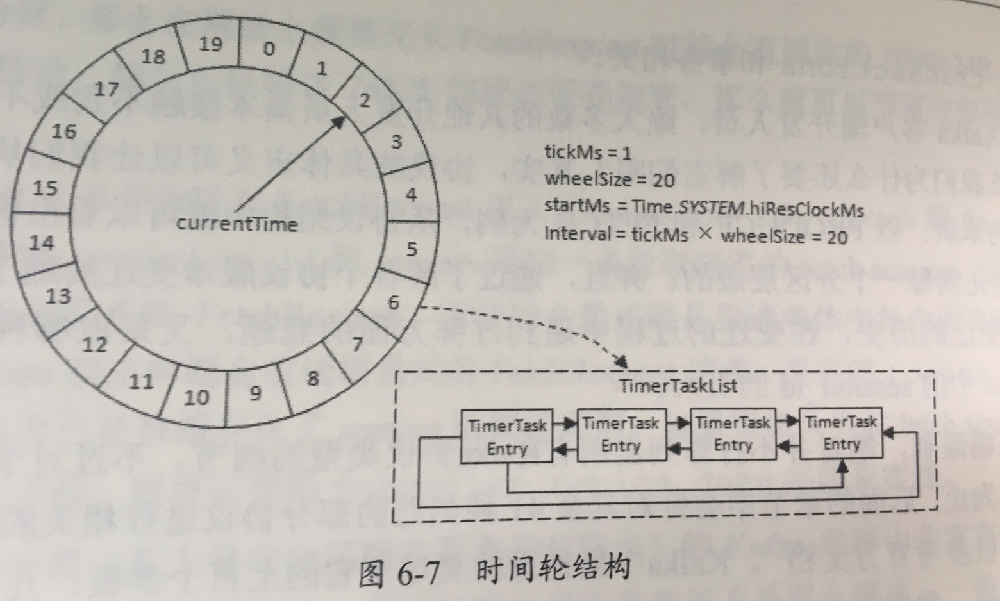

## 1.Kafka架构


Producer: 生产者，负责创建消息

Consumer: 消费者。

broker：服务代理节点。

zookeeper：管理元数据、选举leader、在consumer group变化时进行rebalance(现在都是用--consumer-offsets)。


Topic：kafka对消息进行归类，发送到集群的每一条消息都要指定一个topic。

Partition：物理上的概念，每个topic包含一个或多个partition，一个partition对应一个文件夹，这个文件夹下存储partition的数据和索引文件，每个partition内部是有序的。

ConsumerGroup：每个consumer属于一个特定的consumer group，可为每个consumer指定group name，若不指定，则属于默认的group，一条消息可以发送到不同的consumer group，但一个consumer group中只能有一个consumer能消费这条消息。


**多副本架构**

一主多从，主写副本同步。

主故障，重新选举。

副本消息相对leader会有一些滞后。


容灾：consumer从服务端pull消息时，会保存消费的具体位置，消费者宕机后恢复上线，可以根据之前保存的消费位置重新拉取需要的消息。

### 1.1 Kafka如何保证消息不丢失

```text
1.生产者 --> kafka
ack机制，同步选用acks = -1，需要等待ISR中所有副本都成功写入消息才返回响应
2.kafka内部
ISR集合，通过HW/LEO保证一定程度上的同步，这样即使leader副本宕机，可以从follower副本中选取出新的leader副本
3.kafka --> 消费者
先消费完数据再提交offset
```


### 1.2 Kafka如何保证消息不重复消费

```text
幂等+ack=-1+事务，一般都能保证exactly once。
如果还出现重复消费，一般都是消费者消费了一部分数据还没提交offset，就出现了宕机。

这个一般从消费者角度去思考问题：
1.如果是数据库操作，检查数据是否存在，如果有就做update操作
2.如果是redis操作，天然幂等
3.其他场景，可以生成一个全局唯一ID做幂等。也可以自己做去重，去重手段：分组、按照 id 开窗只取第一个值。
```


### 1.3 Kafka如何保证消息顺序性

```text
分情况讨论：
1.1topic,1partition，1consumer
内部单线程消费即可
2.1topic，多个partition
解决方案1：单partition数据写入总是有序的，所有写入数据指定key，保证相同key的数据最后写入同一个partition，consumer采用单线程消费
解决方案2：consumer采用内存队列+多线程
采用根据key值hash后再将数据分发到不同的内存队列，再多线程处理（hash值相同的key分发到同一个内
存队列，hash值不同的key分发到不同的内存队列）
```


### 1.4 Kafka如何解决消息积压

```text
1. Kafka 消费能力不足，则可以考虑增加 Topic 的分区数，并且同时提升消费组的消费者数量，消费者数=分区数。（两者缺一不可） 

2.如果是下游的数据处理不及时：提高每批次拉取的数量。批次拉取数据过少（拉取 数据/处理时间<生产速度），使处理的数据小于生产的数据，也会造成数据积压。也可以提交处理消息模块的并发。
```


### 1.5 Kafka选举算法

```text
1.Kafka中动态维护者一个ISR集合，处于ISR集合内的节点保持与leader相同的高水位，只有位列其中的副本(unclean.leader.election.enable=false)才有资格被选为新的leader
2.位于ISR中的任何副本节点都有资格成为leader，选举过程采用的策略是：OfflinePartitionLeaderElectionStrategy
3.按照AR集合中副本的顺序查找第一个存活的副本，并且这个副本在ISR集合中。(AR集合汇总的副本顺序在分配时就被指定，ISR集合中副本的顺序可能会发生改变)
```


### 1.6 Kafka与RocketMQ的异同点

相同点：

```text
1.QPS能10万级别，时效性好，都是分布式架构
2.为了追求性能都做了一些优化：
1）顺序读写
2）引入操作系统页缓存
3）引入零拷贝技术，不过Kafka用的是sendfile，RocketMQ用的是mmap技术
3.单topic分区有序
```

不同点：

```text
1.存储方式
Kafka采用partition，每个topic的每个partition对应一个文件。顺序写入，定时刷盘。但一旦单个broker的partition过多，则顺序写将退化为随机写，Page Cache脏页过多，频繁触发缺页中断，性能大幅下降。

RocketMQ采用CommitLog+ConsumeQueue，单个broker所有topic在CommitLog中顺序写，Page Cache只需保持最新的页面即可。同时每个topic下的每个queue都有一个对应的ConsumeQueue文件作为索引。ConsumeQueue占用Page Cache极少，刷盘影响较小。

2.服务发现
Kafka依靠的是Zookeeper
RocketMQ有自己的NameServer

3.高可用
Kafka控制高可用的粒度是放在分区上。每个topic的leader分区和replica分区都可以在所有broker上负载均衡的存储
RocketMQ在高可用设计上粒度只控制在Broker。其保证高可用是通过master-slave主从复制来解决的。

Kafka的这种设计相比RocketMQ这种主从复制的设计有以下好处：
1）Kafka中不需要设置从broker，所有的broker都可以收发消息。负载均衡也做的更好。
2）Kafka的分区选举是自动做的，RocketMQ需要自己指定主从关系。
3）Kafka分区的复制份数指定为N，则可以容忍N-1个节点的故障。发生故障只需要分区leader选举下即可，效率很高。

4.延时队列 & 死信队列
RocketMQ 默认支持
Kafka需要第三方扩展开发
```


### 1.7 Kafka网络模型

没有使用`Java NIO`

```text
1.Channel: 连接，如FileChannel、SocketChannel等，表示连接通道，阻塞和非阻塞(FileChannel不支持)模式
2.Buffer: 缓存，可在读写两种模式中切换
3.Selector：选择器，可实现一个线程处理多个连接
```

`Kafka`实现网络模型主要涉及3个类：

```text
1.SocketServer: 实现监听listeners，并构建Acceptor、Processor、ConnectionQuotas等类，用于接受、处理、解析request和response。

2.KafkaApis：负责处理broker支持的各种通信协议，如：
PRODUCE/FETCH/LIST_OFFSET/LEADER_AND_ISR/HEARTBEAT等

3.KafkaRequestHandlerPool: 负责接受消息，处理SocketServer接受的请求，并构建response返回给SocketServer。
```


`Kafka`接受消息、处理并返回，主要有以下步骤：

1.`Acceptor`：监听`OP_ACCEPT`，将连接的`channel`以`round-robin`的方式选择`processor`进行处理

2.`Processor`：监听连接的`OP_READ`和`OP_WRITE`，主要负责读写和解析数据（是`Broker`中默认存在的线程）

- 读取客户端消息解析后放入`requestQueue`，解析头部信息
- 将`responseQueue`中的消息发送回客户端

3.`KafkaRequestHandler`：从`requestQueue`中获取连接，根据头部信息获取对应的`KafkaApi`协议进行相关处理，线程池默认是8个，并通过回调，将处理后的结果通过`RequestChannel`写到对应`Processor`的`responseQueue`中，等待`Processor`线程处理，一般会从`Response`中读取响应数据，然后再返回给客户端。


```text
1.客户端发送请求全部会先发送给一个 Acceptor，Acceptor 不会对客户端的请求做任何的处理，直接封装成一个个 socketChannel 发送给这些 Processor 形成一个队列，发送方式是轮询。

2.Processor指的是Broker里面存在的线程(默认是3个) 。

3.消费者线程去消费这些 socketChannel 时，会获取一个个 Request请求，这些 Request 请求中就会伴随着数据。线程池里面默认有 8 个线程，这些线程是用来处理 Request的解析请求，如果 Request 是写请求，就写到磁盘里。读的话返回结果。
Processor 会从 Response 中读取响应数据，然后再返回给客户端。

优化手段：
1）增加 Processor (默认3个)
2）增加线程池里面的处理线程(默认8个)
```


### 1.8 Kafka分区分配策略

**生产者的分区分配**

```text
producer.send(record)
消息在发往broker之前需要确定它所发往的分区，如果指定了partition号，不需要分区器。如果没有指定，默认是使用DefaultPartitioner分区器。分区逻辑如下：
1）如果消息的key不为null，那么默认的分区器会对key进行哈希（采用MurmurHash2算法，具备高运算性能及低碰撞率）最终根据得到的哈希值来计算分区号，拥有相同key的消息会被写入同一个分区。

2）如果key为null，那么消息将会以轮询的方式发往主题内的各个可用分区。
```

**消费者的分区分配**


```text
如图所示，某个主题中共有4个分区（Partition）：P0、P1、P2、P3。

有两个消费组A和B都订阅了这个主题，消费组A中有4个消费者（C0、C1、C2和C3），消费组B中有2个消费者（C4和C5）。

按照Kafka默认的规则，最后的分配结果是消费组A中的每一个消费者分配到1个分区，消费组B中的每一个消费者分配到2个分区，两个消费组之间互不影响。每个消费者只能消费所分配到的分区中的消息。
```

对于消费者的分区分配而言，Kafka自身提供了三种策略，分别为**RangeAssignor、RoundRobinAssignor**以及**StickyAssignor**

1.RangeAssignor

按照消费者总数和分区总数进行整除运算来获得一个跨度，然后将分区按照跨度进行平均分配，以保证分区尽可能均匀地分配给所有的消费者。

假设n=分区数/消费者数量，m=分区数%消费者数量，那么前m个消费者每个分配n+1个分区，后面的（消费者数量-m）个消费者每个分配n个分区。

例如：

```text
2 topic 2 consumer 3 topic  t0p0、t0p1、t0p2、t1p0、t1p1、t1p2
n = 1 m = 1
消费者c1 2个分区：t0p0、t0p1、t1p0、t1p1
消费者c2 1个分区：t0p2、t1p2
```

2.RoundRobinAssignor

将消费组内所有消费者以及消费者所订阅的所有topic的partition按照字典序排序，然后通过轮询方式逐个将分区以此分配给每个消费者。

`org.apache.kafka.clients.consumer.RoundRobinAssignor`

假设消费组内有3个消费者C0、C1和C2，它们共订阅了3个主题：t0、t1、t2，这3个主题分别有1、2、3个分区，即整个消费组订阅了t0p0、t1p0、t1p1、t2p0、t2p1、t2p2这6个分区。具体而言，消费者C0订阅的是主题t0，消费者C1订阅的是主题t0和t1，消费者C2订阅的是主题t0、t1和t2，那么最终的分配结果为：

```
消费者C0：t0p0
消费者C1：t1p0
消费者C2：t1p1、t2p0、t2p1、t2p2
```

3.StickyAssignor(粘性分配)

kafka 0.11.x之后开始引入这种分配策略，主要目的是：

1. 分区的分配要尽可能的均匀；
2. 分区的分配尽可能的与上次分配的保持相同。

假设消费组内有3个消费者：C0、C1和C2，它们都订阅了4个主题：t0、t1、t2、t3，并且每个主题有2个分区，也就是说整个消费组订阅了t0p0、t0p1、t1p0、t1p1、t2p0、t2p1、t3p0、t3p1这8个分区。最终的分配结果如下：

```text
消费者C0：t0p0、t1p1、t3p0
消费者C1：t0p1、t2p0、t3p1
消费者C2：t1p0、t2p1
```

这样初看上去似乎与采用RoundRobinAssignor策略所分配的结果相同，但事实是否真的如此呢？再假设此时消费者C1脱离了消费组，那么消费组就会执行再平衡操作，进而消费分区会重新分配。如果采用RoundRobinAssignor策略，那么此时的分配结果如下：

```text
消费者C0：t0p0、t1p0、t2p0、t3p0
消费者C2：t0p1、t1p1、t2p1、t3p1
```

如分配结果所示，RoundRobinAssignor策略会按照消费者C0和C2进行重新轮询分配。而如果此时使用的是StickyAssignor策略，那么分配结果为：

```text
消费者C0：t0p0、t1p1、t3p0、t2p0
消费者C2：t1p0、t2p1、t0p1、t3p1
```

**broker端的分区分配**

创建`topic`时候分区。

```text
使用kafka-topics.sh脚本创建主题时的内部分配逻辑按照机架信息划分成两种策略：未指定机架信息和指定机架信息。

如果集群中所有的broker节点都没有配置broker.rack参数，或者使用disable-rack-aware参数来创建主题，那么采用的就是未指定机架信息的分配策略，否则采用的就是指定机架信息的分配策略。
```

## 2.Kafka的用途有哪些？使用场景如何？

消息系统：作为中间件，具备解耦、流量削峰、异步等作用。服务中间加kafka.

存储系统：kafka具有消息持久化功能和多副本机制，可以将消息持久化到磁盘，有效降低了数据丢失的风险。

流式平台：为每个流行的流式处理框架提供了可靠的数据来源，也能提供一个完整的流式处理类库。

## 3.Kafka中的ISR、AR又代表什么？ISR的伸缩又指什么

**ISR**

In-Sync Relicas：所有与leader副本保持一定程度同步的副本（包括leader副本在内）组成ISR。

**AR**

Assigned Replicas 分区中的所有副本。

**ISR的伸缩**

leader副本负责维护和跟踪所有follwer副本的状态，一定程度同步的副本集合叫ISR，与leader副本同步滞后过多的副本（不包括leader）组成OSR（Out-of-Sync Replicas）。

ISR的伸缩指的是：当follwer副本落后太多或失效时，leader副本会把它从ISR集合中剔除。如果OSR中有follwer副本追上了leader副本，则会转移到ISR中，这就是ISR的伸缩。

判定标准是HW和LEO。


## 4.Kafka中的HW、LEO、LSO、LW等分别代表什么？

**HW**

High Watermark高水位，消费者只能拉取到这个offset之前的消息。

**LEO** 

Log End Offset

日志文件下一条待写入消息的offset。


follower副本从leader副本拉数据是异步的。

HW/LEO机制能有效避免如果follwer副本还没从leader副本同步完数据，leader副本宕机造成的数据丢失的情况。

**LSO**

LastStableOffset。它具体与kafka的事务有关。

`isolation.level`用来配置消费者事务级别。`read_uncommited`读未提交可以读到HW，`read_commited`读已提交只能读到LastStableOffset位置。


Lag: kafka中的消息滞后量，读未提交的时候： Lag = HW - ConsumerOffset；读已提交的时候需要引入LSO。

LSO<=HW<=LEO。

对于分区中有未完成的事务，并且消费者客户端的 isolation.level 参数配置为“read_committed”的情况，它对应的 Lag 等于 LSO – ConsumerOffset 的值。没有未完成事务还是HW - ConsumerOffset。

**LW**

Low Watermark

俗称“低水位”，代表AR集合中最小的logStartOffset值，副本的拉取请求（FetchRequest，它有可能触发新建日志分段而旧的的被清理，进而导致logStartoffset的增加）和删除请求（DeleteRecordRequest）都可能促使LW的增长。


## 5.Kafka中是怎么体现消息顺序性的？

producer顺序写入partition，consumer消费broker中信息会保留相应的offset信息，下次消费会接着offset进行读取。


如果是多`partition`，可以保证`key`相同的被`hash`到同一个`partition`，`consumer`端采用单线程消费。

或者`consumer`端采用队列加多线程。


## 6.Kafka中的分区器、序列化器、拦截器是否了解？它们之间的处理顺序是什么？

分区器：如果ProduceRecord对象没有指定partition字段，就需要依赖分区器，根据key这个字段来计算partition的值。分区器的作用就是为消息分配分区。

```java
public ProduceRecord(String topic,Integer partition,Long timestamp,K key,V value,Iterable<Header> headers)
```

可以自己定义分区器，默认分区器`DefaultPartitioner`对key进行hash，默认是`MurmurHash2`算法。具备高运算性能及低碰撞率。

序列化器：生产者把对象转换成字节数组，通过网络发给kafka。

拦截器：生产者拦截器和消费者拦截器。可以在消息发送前做一些过滤，也可以在发送回调逻辑的做一些定制化的工作，比如统计工作。


顺序：拦截器 --> 序列化器 --> 分区器 --> 拦截器。


## 7.Kafka生产者客户端的整体结构是什么样子的？

生产者客户端架构：

```text
1.配置生产者客户端参数及创建相应的生产者实例。

2.构建待发送的消息。

3.发送消息。

4.关闭生产实例。
```


```text
两个线程：主线程、Sender线程。
主线程：
KafkaProducer创建消息，通过拦截器、序列化器、分区器作用之后缓存到消息累加器。
RecordAccumulator消息累加器，主要用于缓存消息以便于Sender线程可以批量发送，进而减少网络传输的资源消耗以提升性能。
缓存大小(buffer.memory) 32MB 

生产者发送速率超过发送到服务器的速率。导致生产者空间不足，这时候send()方法调用要么被阻塞，要么抛出异常。
可以用max.block.ms的配置。默认是60s。

RecordAccumulator 双端Deque，队列中内容是ProducerBatch。消息写入追加到双端队列的尾部，Sender读取消息时，从双端队列的头部读取。

ProducerBatch 是ProducerRecord的集合。

消息累加器中为了避免buffer的频繁创建和释放，使用BufferPool实现Buffer的复用。参数batch.size:16k。
消息大小不超过16k，使用16k创建ProducerBatch，可以被BufferPool来管理进行复用。如果超过，根据实际大小创建ProducerBatch。

Sender从ProducerAccumulator中获取缓存消息之后，会进一步将原本<分区，Deque<ProducerBatch>>的保存形式转变成<Node,List<ProducerBatch>>。其中Node表示kafka集群的broker节点，之后会进一步封装成<Node,Request>的形式，这样就可以将Request请求发往各个Node了。


Sender线程发往Kafka之前还会保存到InFlightRequests中，InFlightRequests保存对象的具体形式为Map<NodeId,Deque<Request>>，它的主要作用是缓存了已经发出去但还没收到响应的请求。
max.in.flight.requets.per.connection 默认5s
```

## 8.Kafka acks

acks:1，默认。leader副本成功写入消息，生产者会收到服务端的成功响应。

```text
如果leader副本崩溃，重新选举了新的leader副本，消息重发时如果leader副本成功写入返回成功响应给生产者，但是其他follower副本拉取leader副本时leader副本崩溃，此时消息会丢失。因为新选举的leader副本汇总并没有这条对应的消息。
```

acks:0，生产者发送消息之后不需要等待任何服务端的响应，吞吐量最大

acks：-1/all，必须等待ISR中的所有副本都成功写入消息。当ISR只有leader副本时，退化成acks=0

## 9.消费组中的消费者个数如果超过topic的分区，那么就会有消费者消费不到数据

正确


## 10.kafka broker .id

Kafka集群中的每个broker都不同。

Kafka在启动时会在zookeeper中/brokers/ids路径下创建一个与当前broker的id为名称的虚节点，Kafka的健康状态检查就依赖于此节点。当broker下线时，该虚节点会自动删除，其他broker或者客户端通过判断/brokers/ids路径下是否有此broker的id来确定该broker的健康状态。

`config/server.properties`或`meta.properties`进行相关修改。


## 11.消费者提交消费位移时提交的是当前消费到的最新消息的offset还是offset+1?

offset+1 表示下一条需要拉取的消息的位置。


## 12.有哪些情形会造成重复消费或漏消费？

消费位移offset

```text
旧消费者客户端，消费位移是存储在zookeeper中的
新消费者客户端，存储在kafka内部的主体__consumer_offsets中。
```

把消费位移持久化的动作称为提交，消费者在消费完消息之后需要执行消费位移的提交。


kafka中默认的消费位移的提交方式是自动提交。

```shell
enable.auto.commit: true
auto.commit.interval.ms: 5000 # 定期提交时间间隔 5s	
```

重复消费的场景：就是自动提交，这种延时提交。

消息丢失的场景：

拉取线程A不断地拉取消息存入本地缓存，比如BlockingQueue中，另一个处理线程B从缓存中读取消息并进行相应的逻辑处理。

目前在y+1次拉取，m次位移提交，x+6之前的位移已经确认提交了，处理线程B却还在消费x+3的消息。

此时如果线程B发生了异常，待其恢复之后会从m次提交处拉取消息。那[x+3,x+6]之间的消息就没有得到相应的处理，这样便发生了消息丢失。


改成手动提交。

```shell
enable.auto.commit: false
```

分为同步、异步提交。`commitSync`、`commitAsync`。

同步：

拉取消息存入缓存buffer，等达到一定batch之后又，再做相应的批量处理，之后再批量提交。如果此时程序崩溃，会出现重复消费。

异步：

一次异步提交位移x失败，同时一次异步提交位移x+y成功，此时重试之后，y间隔的消息会被重复消费。

## 13.KafkaConsumer是非线程安全的，那么怎么样实现多线程消费？

KafkaProducer是线程安全的，synchronized或final关键字控制

KafkaConsumer是非线程安全的。

用的是CAS策略（Compare and Swap），KafkaConsumer中的每个公用方法在执行所要执行的动作之前都会调用这个acquire()方法，用完之后再调用release()方法。

```java
// acquire方法
private final AtomicLong currentThread = new AtomicLong(NO_CURRENT_THREAD)；

private void acquire() {
	long threadID = Thread.currentThread().getId();
	if (threadId != currentThread.get()&& ！currentThread.compareAndSet(NO_CURRENT_THREAD,threadID));
		throw new ConcurrentModificationException("KafkaConsumer os not safe for multi-threaded access");
	refcount.incrementAndGet();


//release方法
private void releadse() {
	if (refcount.decrementAndGet() == 0)
		currentThread.set(NO_CURRENT_THREAD);
}
```

多线程实现方式：

1.线程封闭，为每个线程实例化一个KafkaConsumer对象，即消费线程。


2.consumer poll消息拉取消息的速度很快，一般处理模块耗时一些，将处理消息模块改成多线程。


## 14.简述消费者与消费组之间的关系

消费者负责订阅Kafka中的主题(Topic)，并且从订阅的主题上拉取消息。

消费组是一个逻辑上的概念，每个消费者只隶属于一个消费组。

消息发布到topic，只会投递给消费组中的一个消费者。

消息中间件的消息投递方式

```text
1.点对点模式(Point-to-Point)
基于队列，生产消息到队列，消息消费者从队列里拉。单播
2.发布订阅(Pub/Sub)
创建topic，消息发布者将消息发布到某个主体，而消息订阅者从主体中订阅消息。广播
```

kafka中既有广播又有单播：所有消息被均衡投放给不同消费组，这是广播，每条消息能被消费组中的消费者消费，这是单播。


## 15.当你使用kafka-topics.sh创建（删除）了一个topic之后，Kafka背后会执行什么逻辑？

```shell
bin/kafka-topics.sh --zookeeper <hosts> -create --topic [topic] -- partitions <Integer: # of partitions> -replication-factor <Integer: replicationfactor>
```

逻辑：

```text
1.会在zookeeper中的/brokers/topics节点下创建一个新的topic节点，如/brokers/topics/first
2.触发Controller的监听程序
3.kafka Controller负责topic的创建工作，并更新metadata cache。
```


## 16.topic的分区数是否可以增加或减少

topic可以增加。

```shell
bin/kafka-topics.sh --zookeeper localhost:2181/kafka --alter --topic topic-config --partitions 


partition为1，不管消息的key为何值，消息都会发往这一个分区中
partition增加到3，就会根据消息的key来计算分区号，原本发往1分区的可能会发给2分区、3分区，需要慎重。
```

**增加分区数的执行策略**

```text
1.修改topic的分区数
./bin/kafka-topics.sh --zookeeper 10.0.210.152:2181 --alter --topic test --partitions 5

2.迁移数据
创建topic.json
{
    "topics": [
        {"topic": "test"}
        ],
    "version": 1
}

./bin/kafka-reassign-partitions.sh --zookeeper 10.0.210.152:2181 --topics-to-move-json-file topic.json --broker-list "0,1,2,3,4" --generate
生成reassignment.json
执行：
./bin/kafka-reassign-partitions.sh --zookeeper 10.0.210.152:2181 --reassignment-json-file reassignment.json --execute

3.验证
./bin/kafka-reassign-partitions.sh --zookeeper 10.0.210.152:2181 --reassignment-json-file reassignment.json --verify
```


topic不能减少。

```text
删除分区：删除分区中的消息不好处理，存储在现有分区尾部，时间戳不会递增。如果复制数据，此主题的可用性无法保障。
```


## 17.创建topic时如何选择合适的分区数？

压测看qps吧。

一个分区的topic，然后测试这个topic的producer吞吐量和consumer吞吐量。假设它们的值分别是Tp和Tc，单位可以是MB/s。然后假设总的目标吞吐量是Tt，那么分区数 = Tt / max(Tp, Tc)。

`kafka-produce-perf-test.sh`工具

```shell
bin/kafka-producer-perf-test.sh --topic topic-1 --num-records 1000000 --record-size 1024 --throught 100 --producer-props bootstrap-servers=localhost:9092 acks=1
```


## 18.Kafka目前有那些内部topic，它们都有什么特征？各自的作用又是什么？

```text
1.__consumer_offsets：记录消费者offset，分区数默认是50
Math.abs("aaa".hashCode()) % 50
查看__consumer_offsets数据

// 0.11.x以后
kafka-simple-consumer-shell.sh --topic __consumer_offsets --partition 25 --broker-list localhost:9092 --formatter "kafka.coordinator.group.GroupMetadataManager\$OffsetsMessageFormatter"

2.__transaction__state：
所有事务状态信息都会持久化到这个这个topic中，TransactionCoordinator 在做故障恢复也是从这个 topic 中恢复数据。
```


## 19.优先副本是什么？它有什么特殊的作用？

AR集合列表中的第一个副本。ISR:[1,2,0]分区的优先副本即为1。

理想状态就是该分区的leader副本，可以称为preferred leader。Kafka确保所有主题的优先副本在kafka集群中均匀分布，这样就保证了所有分区的leader均衡分布。


## 20.Kafka有哪几处地方有分区分配的概念？简述大致的过程及原理

**topic**

 分区


**消费者**

1.RangeAssignor

按照消费者总数和分区总数进行整除运算来获得一个跨度，然后将分区按照跨度进行平均分配，以保证分区尽可能均匀地分配给所有的消费者。

假设n=分区数/消费者数量，m=分区数%消费者数量，那么前m个消费者每个分配n+1个分区，后面的（消费者数量-m）个消费者每个分配n个分区。

例如：

```text
2 topic 2 consumer 3 topic  t0p0、t0p1、t0p2、t1p0、t1p1、t1p2
n = 1 m = 1
消费者c1 2个分区：t0p0、t0p1、t1p0、t1p1
消费者c2 1个分区：t0p2、t1p2
```

2.RoundRobinAssignor

将消费组内所有消费者以及消费者所订阅的所有topic的partition按照字典序排序，然后通过轮询方式逐个将分区以此分配给每个消费者。

`org.apache.kafka.clients.consumer.RoundRobinAssignor`

假设消费组内有3个消费者C0、C1和C2，它们共订阅了3个主题：t0、t1、t2，这3个主题分别有1、2、3个分区，即整个消费组订阅了t0p0、t1p0、t1p1、t2p0、t2p1、t2p2这6个分区。具体而言，消费者C0订阅的是主题t0，消费者C1订阅的是主题t0和t1，消费者C2订阅的是主题t0、t1和t2，那么最终的分配结果为：

```
消费者C0：t0p0
消费者C1：t1p0
消费者C2：t1p1、t2p0、t2p1、t2p2
```

3.StickyAssignor(粘性分配)

kafka 0.11.x之后开始引入这种分配策略，主要目的是：

1. 分区的分配要尽可能的均匀；
2. 分区的分配尽可能的与上次分配的保持相同。

假设消费组内有3个消费者：C0、C1和C2，它们都订阅了4个主题：t0、t1、t2、t3，并且每个主题有2个分区，也就是说整个消费组订阅了t0p0、t0p1、t1p0、t1p1、t2p0、t2p1、t3p0、t3p1这8个分区。最终的分配结果如下：

```text
消费者C0：t0p0、t1p1、t3p0
消费者C1：t0p1、t2p0、t3p1
消费者C2：t1p0、t2p1
```

这样初看上去似乎与采用RoundRobinAssignor策略所分配的结果相同，但事实是否真的如此呢？再假设此时消费者C1脱离了消费组，那么消费组就会执行再平衡操作，进而消费分区会重新分配。如果采用RoundRobinAssignor策略，那么此时的分配结果如下：

```text
消费者C0：t0p0、t1p0、t2p0、t3p0
消费者C2：t0p1、t1p1、t2p1、t3p1
```

如分配结果所示，RoundRobinAssignor策略会按照消费者C0和C2进行重新轮询分配。而如果此时使用的是StickyAssignor策略，那么分配结果为：

```text
消费者C0：t0p0、t1p1、t3p0、t2p0
消费者C2：t1p0、t2p1、t0p1、t3p1
```


## 21.简述Kafka的日志目录结构


一个副本一个Log，日志分段，将Log切分成多个LogSegment，便于消息的维护和清理。


## Kafka中有那些索引文件？

`.index`：偏移量索引文件

用来建立消息偏移量offset到物理地址之间的映射关系，方便快速定位消息所在的物理文件位置。


`.timeindex`：时间戳索引文件

根据指定的时间戳来查找对应的偏移量信息。

## 如果我指定了一个offset，Kafka怎么查找到对应的消息？


relativeOffset：相对偏移量，表示消息相对于baseOffset的偏移量，占用4个字节，当前索引文件的文件名即为baseOffset的值。

position：物理地址，也就是消息在日志分段文件中对应的物理位置。

查找步骤（假定偏移量268）：

```text
1.kafka中采用ConcurrentSkipListMap来保存各个日志分段，每个日志分段的baseOffset作为key，这样可以根据指定偏移量来快速定位到消息所在的日志分段。
2.relativeOffset = 268 - 251 = 17，之后再到对应的索引文件中找到不大于17的索引项，最后根据索引项中的position定位到具体的日志分段文件位置开始查找目标消息。
```


## 如果我指定了一个timestamp，Kafka怎么查找到对应的消息？


## 聊一聊你对Kafka的Log Retention的理解

日志删除：

1.基于时间

阈值`retentionMs`，根据日志分段中最大的时间戳`largestTimeStamp`来计算。

```text
log.retention.ms  # 优先级最高 
log.retention.minutes  # 优先级次之
log.retention.hours # 优先级最低 默认168h 7天
```

2.基于日志大小

阈值`retentionSize`，根据`log.retention.bytes`（Log中所有日志文件的总大小）来配置，默认`-1`表示无穷大。单个日志分段大小有broker端参数`log.segment.bytes`来限制，默认值是1GB。

3.基于日志起始偏移量

一般`logStartOffset=baseOffset`，但是`logStartPffset`的值可以通过`DeleteRecordRequest`请求方法、使用`kafka-delete-records.sh`脚本删除。

根据某日志分段的下一个日志分段的起始偏移量baseOffset是否<=logStartOffset。如果是，就可删除这个日志。


## 聊一聊你对Kafka的Log Compaction的理解
日志压缩：

对于有相同key的不同value值，只保留最后一个版本。


`log.cleaner.cleanable.ratio` 用来限定清理操作的最小污浊率。


## 聊一聊你对Kafka底层存储的理解（页缓存、内核层、块层、设备层）

页缓存：

页缓存是操作系统实现的一种主要的磁盘缓存，用来减少对磁盘I/O的操作。

```text
读数据先查看页缓存里面是否有，如果命中直接返回数据，没有再从磁盘中查。
写数据，如果不命中会先在页缓存中添加相应的页，这些就是脏页，操作系统会适时将脏页数据写入磁盘，保证数据一致性。

vm.dirty_background_ratio  设置成< 10 ，linux用pdflush/flush/kdmflush来处理脏页。
```

kafka中使用了大量页缓存，实现高吞吐。

内核层、块层、设备层主要是零拷贝。


## 聊一聊Kafka的延时操作的原理



时间轮：存储定时任务的环形队列，底层采用数组实现，数组中的每个元素可以存放一个定时任务列表（TimeTaskList）。TimerTaskList是一个环形的双向链表，链表中的每一项表示的都是定时任务项（TimerTaskEntry），其中封装了真正的定时任务（TimerTask）。

`tickMs`代表当前时间轮的基本时间跨度。

`wheelSize`代表时间轮的时间格的个数。

上图表示延时的时间跨度是20ms，如果延时10000ms的话，不能无限扩张时间格，采用的是类似时分秒的多层时间轮结构。

kafka中的`TimingWheel`专门用来执行插入和删除`TimerTaskEntry`的操作，而用`DelayQueue`来负责时间推进的任务（跳跃式）。


延时操作：

延时操作需要返回响应结果，因此需要设置超时时间(`delayMs`)，如果在超时时间内没有结果返回，就需要强制执行。

延迟操作创建之后会被加入延时操作管理器`DelayedOperationPurgatory`来做专门的处理。

1.生产延时（acks = -1）


2.拉取延时


follower副本已经更新到leader副本最新了，leader副本没有新消息写入，此时会创建一个延时拉取操作以等待拉取到足够数量的消息。`fetch.min.bytes`，默认是1。

触发条件：超时触发或外部事件触发（HW更新/事务级别是read_commited时用LSO）


## 聊一聊Kafka控制器的作用

一个被选举出来的broker，负责整个集群中所有分区和副本的状态。

```text
1.某分区leader副本出现故障，由控制器负责为该分区选举新的leader副本
2.当检测到某个分区的ISR集合发生变化时，由控制器负责通知所有broker更新其元数据。
3.分区重新分配
```


## Kafka中的幂等是怎么实现的

幂等：对接口的多次调用所产生的的结果和调用一次是一致的。重试之后可能会重复写入消息，kafka策略：


引入`producer id`和`first sequence`。

生产者实例在初始化的时候都会分配一个PID，消息发送到每一个分区都有对应的序列号，这些序列号从0开始单调递增。broker端会在内存中为每一对<PID，分区>维护一个序列号。`SN_new`必须必`SN_old`大1，broker才会接受这条消息。

注意：引入序列号来实现幂等只是针对<PID，分区>。即kafka的幂等只能保证单个生产者会话中单分区的幂等。


## Kafka中的事务是怎么实现的

参数配置：

```text
transactional.id: 'xxxx'   # 创建事务唯一id
enable.idempotence: true   # 开启幂等
```

用事务协调器（`TransactionCooredinator`）来处理事务，每个生产者都会被指派一个特定的事务协调器，协调器会将事务状态持久化到内部topic `__transaction_state`

具体步骤：

1.查找事务协调器

2.获取PID

3.开启事务（生产者发送第一条消息之后）

4.进行事务的数据处理，`ProduceRequest`等请求方法

5.提交或中止事务，一旦数据被写入成功，可以调用`KafkaProducer`的`commitTrnasaction()`方法或`abortTransaction()`方法来结束当前的事务。

6.事务协调器会将最终的`COMPLETE_COMMIT`或`COMPLETE_ABORT`信息写入主题`__transaction_state`以表明当前事务已经结束，此时可以删除主题中关于该事务的消息，由于`__transaction_state`采用的日志清理策略是日志压缩，所以删除只需将相应的消息设置成墓碑消息即可。


## 为什么Kafka不支持读写分离？

kafka中生产者写入消息、消费者读取消息的操作都是与leader副本交互的，是一种主写主读的生产消费模型。

主写从读（读写分离）缺点：

```text
1.数据一致性问题
2.延时问题
kafka主从同步需要经历 网络 --> 主节点内存 --> 主节点磁盘 --> 网络 --> 从节点内存  --> 从节点磁盘
很耗时。
```

kafka的每个broker都有消息从生产者流入，也都有消息流出到消费者。

kafka不支持读写分离的优点：

```text
1.可以简化代码的实现逻辑，减少出错可能；
2.将负载粒度细化均摊，与主写从读相比，不仅负载能更好，而且对用户可控；
3.没有延时的影响；
4.副本稳定时，不会出现数据不一致的问题。
```


## 失效副本是指什么？有那些应对措施？

ISR集合之外处于同步失效或功能失效的副本统称为失效副本。

```text
1.follower副本进程卡住，在一段时间根本没有向leader副本发起同步请求，比如频繁的FullGC
2.followe副本进程同步过慢，在一段时间内都无法追赶上leader副本，比如I/O开销过大。
```


## Kafka的那些设计让它有如此高的性能？

生产、消费者batch操作、页缓存、顺序读写(LogAppend)、零拷贝（内核直接从read buffer到socker buffer，sendfile()方法）


## kafka怎么保证三种消费状态（at most once、at least once、at exactly once）

```text
at most once:至多一次，消息可能会丢失，但绝对不会重复传输
场景：消费者拉完消息，如果先提交消费位移后进行消息处理，在消息处理完之前消费者宕机，重新上限会从已经提交的位移处开始重新消费。

at least once:至少一次，消息绝不会丢失，但可能会重复传输。
场景：
1.生产者发送消息到kafka之后，遇到了网络问题而造成通信中断，生产者不知道是否发送成功，可能会多次重试来确保已经写入kafka。
2.消费者先处理后提交，如果宕机会从上次提交处接着消费，会出现重复消费。

exactly once:精确一次处理。
幂等+事务。
```


## kafka rebalance

`GroupCoordinator`：Kafka服务端中用于管理消费组的组件。

`ConsumerCoordinator`:消费者客户端中的组件，负责与`GroupCoordinator`进行交互。


触发再均衡的操作：

```text
1.新的消费者进入消费组
2.消费者宕机下线：长时间GC、网络延迟
3.有消费者主动退出消费组(发送LeaveGroupRequest请求)
客户端调用了unsubscrible()方法取消对某些主题的订阅。
4.消费者对应的GroupCoordinator节点发生变更
5.消费组内所订阅的任一主题或主题的分区数量发生改变。
```


具体步骤：

```text
1.查找GroupCoordinator(GC)
消费者需要确定它所属的消费组对应的GroupCoordinator所在的broker，并创建与该broker相互通信的网络连接。

如果没有连接，就需要发送FindCoordinatorRequest请求来查找对应的GC

2.加入Group
1)找到GC后，消费者会向GroupCoordinator发送JoinGroupRequest请求加组。

(如果是原有消费者重新加入消费组，可能需要进行的操作：
如果enable.auto.commit设置成true，开启了自动唯一提交，在请求加入消费组之前需要向GC提交消费位移。)

2）消费者发送请求后会阻塞等待kafka服务端响应，GC会对请求进行合法性校验、生成member_id

3）选举消费组的leader，算法就是：第一个或者随机在hashmap中选取一个key。

4）选举分区分配策略
将各个消费者所支持的分区分配策略收集，形成候选集，在集合内选取票数最多的分区策略。参数在partition.assignment.strategy中设置。
# RangeAssignor:根据消费者总数和分区总数进行整除运算
n = 分区数/消费者数量；m = 分区数%消费者数量
前m个消费者每个分配n+1个分区，后面(消费者数量-m)个消费者每个分配n个分区。

# RoundRobinAssignor 消费者及订阅主题按照字典排序，通过轮询逐个将分区一次分配给每个消费者。

# StickyAssignor:粘性分区
分区要尽可能均匀；分区的分配尽可能与上次分配的保持相同。

5）kafka服务端发送JoinGroupResponse响应给各个消费者。
普通消费者是空，只有leader消费者包含有效数据。

3.leader消费者根据上一阶段选举出来的分区分配策略实施具体的分区分配。
通过向GC发送SyncGroupRequest请求来向其他消费者同步分配方案。

4.心跳
消费组中的所有消费组都处于正常工作状态，消费之前会在__consumer_offset主题中获取上次提交的消费位移并从此处开始消费。

消费者通过向GC发送心跳来维持它们与消费者的从属关系。
```


## kafka简单实例

```shell
1.docker 启动
# zookeeper
docker run --name zookeeper -p 2181:2181 -t -d wurstmeister/zookeeper
# kafka
docker run -p 9092:9092 -p 8083:8083 -v ~/services/kafka/source.txt:/opt/kafka_2.12-2.1.0/source.txt -v ~/services/kafka/plugins/:/opt/kafka_2.12-2.1.0/plugins/ --name kafka -d -e KAFKA_BROKER_ID=0 -e KAFKA_ZOOKEEPER_CONNECT=192.168.0.102:2181 -e KAFKA_ADVERTISED_LISTENERS=PLAINTEXT://192.168.0.102:9092 -e KAFKA_LISTENERS=PLAINTEXT://0.0.0.0:9092 wurstmeister/kafka:latest

2.创建topic
bin/kafka-topics.sh --create --zookeeper 192.168.0.102:2181 --replication-factor 1 --partitions 1 --topic test

3.创建生产者、消费者
bin/kafka-console-producer.sh --broker-list localhost:9092 --topic mongo
bin/kafka-console-consumer.sh --bootstrap-server localhost:9092 --topic mongo
```


**python-kafka-mongo**

```text
埋点数据只写mongo，存在两个问题，一是数据保存在内存中，一旦服务宕机，这部分数据就会丢失，二是mongodb如果出了问题，写入数据失败，之后不好回滚。因此引入消息中间件kafka.
```

1.python部分

```python
# pip install kafka
from kafka import KafkaProducer
import json

producer_new = KafkaProducer(bootstrap_servers='localhost:9092',value_serializer=lambda v: json.dumps(v).encode('utf-8'))

producer_new.send('mongo', {'foo': 'bar'})
```


2.kafka部分

数据正确的可以保存到指定mongo中，脏数据会保存到死信队列中。

[参考](<https://blog.csdn.net/u013411339/article/details/90625583>)

```text
引入mongo-connect-kafka插件 mongodb-kafka-connect-mongodb-1.0.1
配置sink properties

例如：sink-mongo.properties
name=sink-mongo
connector.class=com.mongodb.kafka.connect.MongoSinkConnector
topics=mongo
connection.uri=mongodb://192.168.0.102:27017  # mongo uri
database=kafka_db
collection=data0
key.converter=org.apache.kafka.connect.json.JsonConverter
key.converter.schemas.enable=false
value.converter=org.apache.kafka.connect.json.JsonConverter
value.converter.schemas.enable=false
errors.tolerance=all # 忽略所有错误
errors.deadletterqueue.topic.name=dead_message # 将异常数据保存到死信队列里
errors.deadletterqueue.topic.replication.factor=1	
errors.deadletterqueue.context.headers.enable=true
errors.retry.delay.max.ms=60000
errors.retry.timeout=300000	
```


**kafka-structured streaming**

基础配置

```text
–num-executors 12 –executor-cores 6 –executor-memory 12G
```


```python
lines = spark\
    .readStream\
    .format("kafka") \
    .option("kafka.bootstrap.servers", "192.168.0.102:9092") \
    .option("subscribe", "mongo") \
    .load()

lines.selectExpr("CAST(key AS STRING)", "CAST(value AS STRING)")

# 参数调整
maxOffsetsPerTrigger # Rate limit on maximum number of offsets processed per trigger interval. The specified total number of offsets will be proportionally split across topicPartitions of different volume.
考虑内存，设置成1000

spark.steaming.backpressure.enabled: true 
# 背压参数，可以让
```


