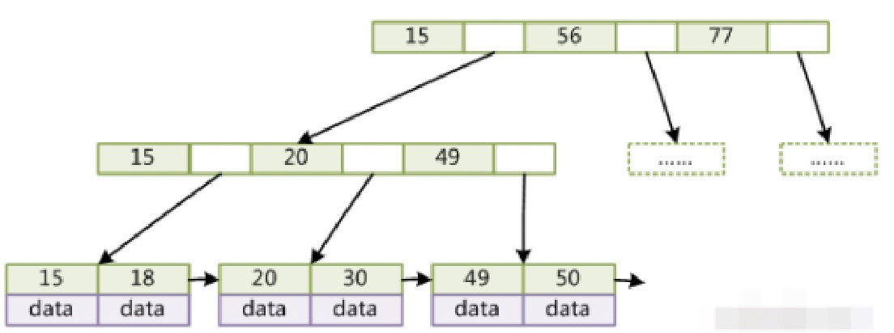
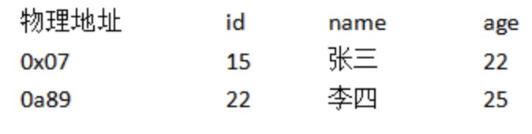
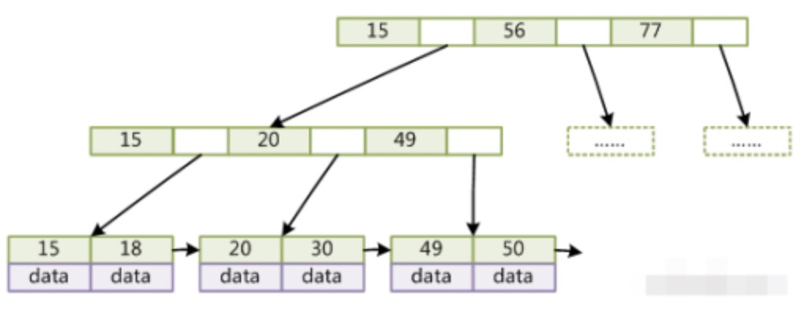
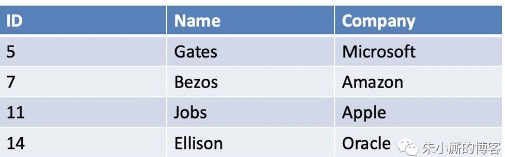
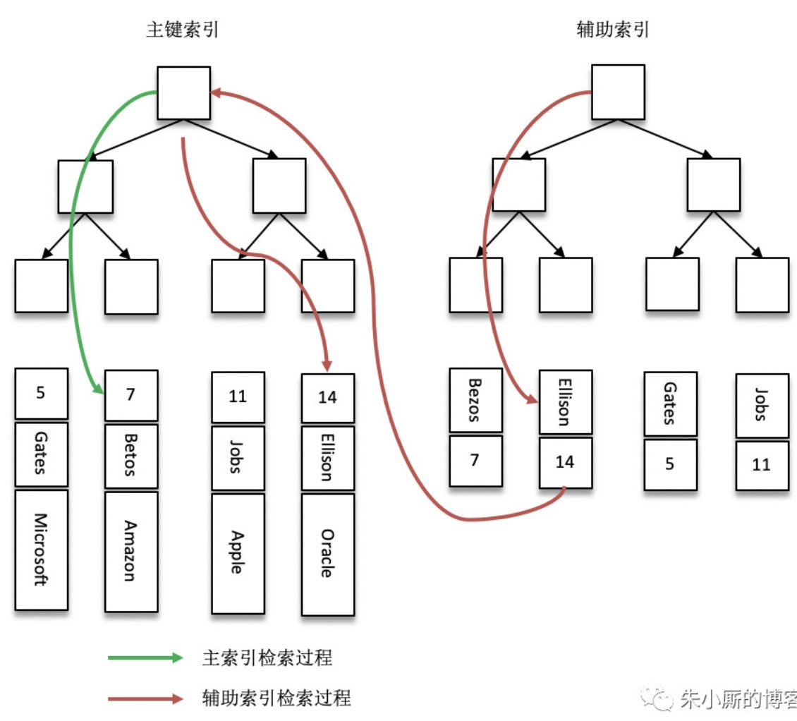
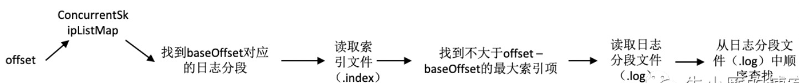

## 1.为什么用自增作为主键

```text
1、如果我们定义了主键(PRIMARY KEY)，那么InnoDB会选择主键作为聚集索引。

如果没有显式定义主键，则InnoDB会选择第一个不包含有NULL值的唯一索引作为主键索引。

如果也没有这样的唯一索引，则InnoDB会选择内置6字节长的ROWID作为隐含的聚集索引(ROWID随着行记录的写入而主键递增，这个ROWID不像ORACLE的ROWID那样可引用，是隐含的)。

2、数据记录本身被存于主索引（一颗B+Tree）的叶子节点上，这就要求同一个叶子节点内（大小为一个内存页或磁盘页）的各条数据记录按主键顺序存放

因此每当有一条新的记录插入时，MySQL会根据其主键将其插入适当的节点和位置，如果页面达到装载因子（InnoDB默认为15/16），则开辟一个新的页（节点）

3、如果表使用自增主键，那么每次插入新的记录，记录就会顺序添加到当前索引节点的后续位置，当一页写满，就会自动开辟一个新的页

4、如果使用非自增主键（如果身份证号或学号等），由于每次插入主键的值近似于随机，因此每次新纪录都要被插到现有索引页得中间某个位置

此时MySQL不得不为了将新记录插到合适位置而移动数据，甚至目标页面可能已经被回写到磁盘上而从缓存中清掉，此时又要从磁盘上读回来，这增加了很多开销

同时频繁的移动、分页操作造成了大量的碎片，得到了不够紧凑的索引结构，后续不得不通过OPTIMIZE TABLE来重建表并优化填充页面。
```


## 2.为什么使用数据索引能提高索引

```text
数据索引的存储是有序的，在有序的情况下，通过索引查询一个数据是无需遍历索引记录的。极端情况下，索引查找效率为二分法查询效率，趋近于log2(N)。
```

**什么时候应不建或少建索引**

```text
1、表记录太少

2、经常插入、删除、修改的表

3、数据重复且分布平均的表字段，假如一个表有10万行记录，有一个字段A只有T和F两种值，且每个值的分布概率大约为50%，那么对这种表A字段建索引一般不会提高数据库的查询速度。

4、经常和主字段一块查询但主字段索引值比较多的表字段
```


## 3.什么是表分区？表分区与分表的区别？表分区有什么好处？分区表的限制因素？如何判断当前MySQL是否支持分区？分区的类型？

```text
表分区，是指根据一定规则，将数据库中的一张表分解成多个更小的，容易管理的部分。从逻辑上看，只有一张表，但是底层却是由多个物理分区组成。

表分区与分表的区别：
1）分区从逻辑上来讲只有一张表
2）分表是将一张表分解成多张表

表分区的好处：
1、存储更多数据。分区表的数据可以分布在不同的物理设备上，从而高效地利用多个硬件设备。和单个磁盘或者文件系统相比，可以存储更多数据

2、优化查询。在where语句中包含分区条件时，可以只扫描一个或多个分区表来提高查询效率；涉及sum和count语句时，也可以在多个分区上并行处理，最后汇总结果。

3、分区表更容易维护。例如：想批量删除大量数据可以清除整个分区。

4、避免某些特殊的瓶颈，例如InnoDB的单个索引的互斥访问，ext3问价你系统的inode锁竞争等。

分区的限制因素：
1）一个表最多只能有1024个分区

2）MySQL5.1中，分区表达式必须是整数，或者返回整数的表达式。在MySQL5.5中提供了非整数表达式分区的支持。

3）如果分区字段中有主键或者唯一索引的列，那么多有主键列和唯一索引列都必须包含进来。即：分区字段要么不包含主键或者索引列，要么包含全部主键和索引列。

4）分区表中无法使用外键约束

5）MySQL的分区适用于一个表的所有数据和索引，不能只对表数据分区而不对索引分区，也不能只对索引分区而不对表分区，也不能只对表的一部分数据分区。

如何判断当前MySQL是否支持分区？
show variables like '%partition%'
have_partitioning 值为yes，表示支持分区

分区的类型
1）RANGE分区： 这种模式允许将数据划分不同范围。例如可以将一个表通过年份划分成若干个分区

2）LIST分区： 这种模式允许系统通过预定义的列表的值来对数据进行分割。按照List中的值分区，与RANGE的区别是，range分区的区间范围值是连续的。

3）HASH分区 ：这中模式允许通过对表的一个或多个列的Hash Key进行计算，最后通过这个Hash码不同数值对应的数据区域进行分区。例如可以建立一个对表主键进行分区的表。

4）KEY分区 ：上面Hash模式的一种延伸，这里的Hash Key是MySQL系统产生的。
```


## 4.行级锁定的优缺点

```text
优点：
1、当在许多线程中访问不同的行时只存在少量锁定冲突。

2、回滚时只有少量的更改

3、可以长时间锁定单一的行。

缺点：
1、比页级或表级锁定占用更多的内存。

2、当在表的大部分中使用时，比页级或表级锁定速度慢，因为你必须获取更多的锁。

3、如果你在大部分数据上经常进行GROUP BY操作或者必须经常扫描整个表，比其它锁定明显慢很多。

4、用高级别锁定，通过支持不同的类型锁定，你也可以很容易地调节应用程序，因为其锁成本小于行级锁定。
```


## 5.MySQL优化

**软优化：**

```text
1、explain你的select查询，这可以帮你分析你的查询语句或是表结构的性能瓶颈。EXPLAIN 的查询结果还会告诉你你的索引主键被如何利用的，你的数据表是如何被搜索和排序的

2、当只要一行数据时使用limit 1，MySQL数据库引擎会在找到一条数据后停止搜索，而不是继续往后查少下一条符合记录的数据

3、为搜索字段建索引
注意：
1）LIKE关键字匹配'%'开头的字符串,不会使用索引.
2）OR关键字的两个字段必须都是用了索引,该查询才会使用索引.
3）使用多列索引必须满足最左匹配.

4、使用 ENUM 而不是 VARCHAR。如果你有一个字段，比如“性别”，“国家”，“民族”，“状态”或“部门”，你知道这些字段的取值是有限而且固定的，那么，你应该使用 ENUM 而不是VARCHAR

5、优化子查询
尽量不要使用子查询，子查询时会建立一张临时表,临时表的建立和删除都会有较大的系统开销。
考虑使用JOIN查询

6、分解表
字段冷热分离

7、增加冗余字段
类似于创建中间表,增加冗余也是为了减少连接查询
```

**硬优化：**

1.硬件3件套

```text
1.配置多核心和频率高的cpu,多核心可以执行多个线程.
2.配置大内存,提高内存,即可提高缓存区容量,因此能减少磁盘I/O时间,从而提高响应速度.
3.配置高速磁盘或合理分布磁盘:高速磁盘提高I/O,分布磁盘能提高并行操作的能力.
```

2.优化数据库参数

```text
key_buffer_size:索引缓冲区大小
table_cache:能同时打开表的个数
query_cache_size和query_cache_type:前者是查询缓冲区大小,后者是前面参数的开关,0表示不使用缓冲区,1表示使用缓冲区,但可以在查询中使用SQL_NO_CACHE表示不要使用缓冲区,2表示在查询中明确指出使用缓冲区才用缓冲区,即SQL_CACHE.
sort_buffer_size:排序缓冲区
```

3.分表分库+读写分离

4.缓存集群

读并发比较高，考虑创建缓存集群。

写数据库的时候同时写一份数据到缓存集群里，然后用缓存集群来承载大部分的读请求。


### 5.2 MySQL中的索引优化

1.`Multi-Range Read(MRR)`优化

```text
工作方式：
1）将查询得到的辅助索引键存放于一个缓存中，这时缓存中的数据是根据辅助索引键值排序的
2）将缓存中的键值根据RowID排序
3）根据RowID的排序顺序来访问实际的数据文件。

好处：
1）先得到查询结果，按照主键进行排序，并按照主键排序的顺序进行书签查找，修正了之前辅助索引按照主键查询时随机读磁盘的问题
2）减少缓冲池中页被替换的次数
3）批量处理对键值查询的操作

启动方式：
SET @@optimizer_switch='mrr=on,mrr_cost_based=off'

查看方式：
执行计划中Extra列可以看到Using MRR
```


2.`Index Condition Pushdown(ICP)`优化

```text
取出索引的同时判断是否可以进行where条件的过滤，也就是where的部分过滤操作放在存储引擎层。
ICP优化支持range、ref、eq_ref、ref_or_null类型的查询。

查看方式：
执行计划中查看可以看到Using index condition
```


## 6. 聚簇索引/非聚簇索引，mysql索引底层实现，为什么不用B-tree，为什么不用hash，叶子结点存放的是数据还是指向数据的内存地址，使用索引需要注意的几个地方

```text
聚簇索引：将数据存储与索引放到了一块，找到索引就找到了数据。B+树叶子节点上的data就是数据本身。(Innodb)

非聚簇索引：将数据存储于索引分开结构，B+树叶子节点存放的是数据存放的地址。(MyISAM)

辅助索引(Secondary Index)：叶子节点并不包含行记录的全部数据(其实也可以认为是非聚簇索引)，包含一个书签，该书签用来告诉Innodb引擎哪里可以找到与索引相对应的行数据。
先通过页级别的指针获得指向主键索引的主键，再通过主键索引找到一个完整的行记录。

注：判断用辅助索引还是聚簇索引(组合索引)，如果要求访问的数据量很小，优化器会优先选择辅助索引，如果访问的数据占整个表中蛮大一部分时(20%)，优先选择聚簇索引。

联合索引：对表上的多个列进行索引，键值数量大于等于2。
1)需要满足最左匹配原则。
(a,b)联合索引，where a = xxx可以，where b = xxx不行
2）对第二个键值进行了排序处理，做了一点优化
select * from buy_log where user_id = 1 order by buy_date desc limit 3;
查看执行计划，possible_keys有两个索引，Extra中显示Using index说明优化器优先使用了组合索引，否则会有Using filesort选项
注意(a,b,c)这种组合索引，不能跳过：select * from table1 where a = xxx order by c，这时候c还需要做一次filesort排序，因为索引(a,c)并未排序。

覆盖索引：从辅助索引中就可以查询到记录，不需要再做一次回表操作，可以减少大量的IO操作
一般select id(主键) from table1 where id = xx和select count(*) from table1都可以。
查看select count(*) from buy_log的执行计划，possible_keys列为null，但是Extra列使用了Using index就代表了优化器进行了覆盖索引操作

自适应哈希索引：对于字典类型的查找非常迅速。select * from table1 where index_col = xxx
这个是由Innodb存储引擎自己控制，可以使用innodb_adaptive_hash_index来禁用或启动特性。默认是开启。

全文检索：select * from table where content like 'xxx%'
使用倒排索引

不使用索引：范围查找，Join链路操作
```

为什么不用`B-Tree`，为什么不用`hash`?

```text
B树每个索引都有data域，每次节点数目非常多，层数很少，减少了磁盘IO次数。但是由于每个节点上都有数据，这样导致在非叶子节点中能保存的指针数量变少，指针少的情况下要保存大量数据，只能增加树的高度，导致IO操作变多，查询性能变低。

相比较而言B+树遍历直接遍历叶子节点，同时一般还会进行一个优化，将所有叶子节点用指针串起来，可以进行区间访问。

B+树的优点：
1）B+的内部节点并没有执行关键字具体信息的指针，因此其内部节点相对于B树更小。盘中能容纳的关键字数量也越多，一次性读入内存中的需要查找的关键字也越多，相对来说IO读写次数也就降低了
2）B+树的查询性能更稳定，任何关键字的查找都必须走一条从根节点到叶子节点的路，所有关键字查询的路径长度相同，导致每个数据的查询效率相当。

不用hash的原因：
1）不支持范围查询
2）hash索引存放的是经过hash计算之后的hash值，并不一定与hash运算前的键值一样，排序会存在问题
3）hash不能避免表扫描
4）hash索引遇到大量的hash值相等的情况性能比较差，存在hash冲突。
```

使用索引需要注意的地方：

```text
1.满足最左前缀原则，组合索引(A,B,C)，相当于创建了(A),(A,B),(A,B,C)三个索引
1）不能跳过索引中的列，例如：where A = '1' and C = '2'，只有A能使用索引，C不能使用索引
2）MySQL能在索引中做最左前缀匹配的like比较，但是如果开头是通配符的like比较，就不能使用索引
like 'name%'可以，like '%name'

2.如果查询中有某个列的范围查询，则其右边所有列都无法使用索引优化查找
where A='name' and B like 'name%' and C = 'name'，只有A、B能使用索引，C不能使用索引

3.where条件中包含表达式或函数的参数不能使用索引
while A='name' and 函数(B)='name'

4.创建索引的时候，需要考虑字段值distinct的占比，如果太低，建议不用这个字段作为索引。
比如：status = 0/1 这种，你用where status = 1去查找100行的数据，能查出50行，这已经类似全表扫描了
用select count(distinct(col)) / count(*)在创建索引之前进行检测

可以用：show index from table1查看Caedinality的值，接近1就比较合适用他做索引

5.前缀索引
某个字段是字符串，很长，如果你要建立索引，最好就对这个字符串的前缀来创建，比如前10个字符这样子，要用前多少位的字符串创建前缀索引，就对不同长度的前缀看看选择性就好了，一般前缀长度越长选择性的值越高。
```

### 6.1 MyIsm存储引擎的索引

非聚簇索引，叶子节点存放的是数据的地址。



```text
id=15，data：0x07，0a89，数据行的物理地址
数据文件单独放一个文件

sql执行流程：
select * from table where id = 15 -> 0x07物理地址 -> 15，张三，22
```




### 6.2 Innodb存储引擎的索引

聚簇索引，叶子节点存放的就是数据。



```text
innodb存储引擎，要求必须有主键，会根据主键建立一个默认索引，叫做聚簇索引，innodb的数据文件本身同时也是个索引文件，索引存储结构大致如下：
15，data：0x07，完整的一行数据，（15,张三,22）
22，data：完整的一行数据，（22,李四,30）

回表
可以用主键的值到聚簇索引里根据主键值再次查找到数据
sql:select * from table where name = ‘张三’
步骤：
1）先到name的索引里去找，找到张三对应的叶子节点，叶子节点的data就是那一行的主键，id=15，
2）然后再根据id=15，到数据文件里面的聚簇索引（根据主键组织的索引）根据id=15去定位出来id=15这一行的完整的数据

Innodb不用UUID生成的超长字符串作为主键。因为这样会导致所有的索引的data都是那个主键值，最终导致索引会变得过大，浪费很多磁盘空间。
```


## 7. mysql默认的事务隔离级别，mvcc，rr怎么实现的，rc如何实现的

事务隔离级别

```text
1.读未提交
Read Uncommitted：这个很坑爹，就是说某个事务还没提交的时候，修改的数据，就让别的事务给读到了，这就恶心了，很容易导致出错的。这个也叫做脏读。

2.读已提交
Read Committed（不可重复读）
事务A在跑的时候， 先查询了一个数据是值1，然后过了段时间，事务B把那个数据给修改了一下还提交了，此时事务A再次查询这个数据就成了值2了，这是读了人家事务提交的数据啊，所以是读已提交。
又叫不可重复读，所谓的一个事务内对一个数据两次读，可能会读到不一样的值。

3.可重复读
Read Repeatable：这个比上面那个再好点儿，就是说事务A在执行过程中，对某个数据的值，无论读多少次都是值1；哪怕这个过程中事务B修改了数据的值还提交了，但是事务A读到的还是自己事务开始时这个数据的值。

4.串行化
不可重复读和可重复读都是针对两个事务同时对某条数据在修改，但是幻读针对的是插入。

事务1要插入一条数据，我先查询一下有没有相同的数据，但是这时事务2添加了这条数据，这就会导致事务1插入失败，并且它就算再一次查询，也无法查询到与其插入相冲突的数据，同时自身死活都插入不了，这就不是尴尬，而是囧了。

解决幻读，就需要使用串行化级别的隔离界别，所有事务都串行起来，不允许多个事务并行操作。
```

mysql的默认隔离级别是**可重复读**。每个事务都会开启一个自己要操作的某个数据的快照，事务期间，读到的都是这个数据的快照罢了，对一个数据的多次读都是一样的。

实现过程(MVCC multi-version concurrency control多版本并发控制)：

innodb存储引擎，会在每行数据的最后加两个隐藏列，一个保存行的创建时间，一个保存行的删除时间，但是这里存放的不是时间，而是事务id，事务id是mysql自己维护的自增的，全局唯一。

增删改查中对版本号的作用如下：

```text
select：
读取创建版本小于或等于当前事务版本号，并且删除版本为空或大于当前事务版本的记录。这样可以保证在读取之前记录都是存在的

insert：
将当前事务的版本号保存至行的创建版本号

update
新插入一行，并以当前事务版本号作为新行的创建版本号，同时将原记录行的删除版本号设置为当前事务版本号

delete
将当前事务版本号保存至行的删除版本号
```

`RR`与`RC`基于`MVCC`实现，都是基于`Readview`表来实现的，记录了未提交事务的表，事务会依据该表选择合适的行版本号进行快照读操作，具体选择版本号的方法是挑选除`Readview`版本号外的最新版本号。

`RC`级别下的`ReadView`表会随着其他未提交事务的提交而发生变动，快照读可能读取到不同的值，会有不可重复度问题。

`RR`级别下，事务执行一条语句时才会产生`ReadView`，且之后不会再变动，克服了不可重复读的问题。

**mvcc读操作分类哪几类**

```text
1.快照读 (snapshot read)：读取的是记录的可见版本 (有可能是历史版本)，不用加锁（共享读锁s锁也不加，所以不会阻塞其他事务的写）
select 快照读

2.当前读 (current read)：读取的是记录的最新版本，并且，当前读返回的记录，都会加上锁，保证其他事务不会再并发修改这条记录
update delete insert select ... LOCK In SHARE MODE,SELECT ... for update 当前读
```


## 8. mysql间隙锁有没有了解，死锁有没有了解，写一段会造成死锁的sql语句，死锁发生了如何解决，mysql有没有提供什么机制去解决死锁？

正常`RR`不能避免幻读，但是加上间隙锁可以。

间隙锁（`Gap Lock`）：锁定索引记录间隙，确保索引记录的间隙不变。锁定可能插入位置之前、之间、之后的间隙。

例如：


控制`number=5`之前、之中、之后不能有新的记录插入，则锁定区间是(4,11)

`InnoDB`工作在`Repeatable Read`隔离级别下，并且以`Next-Key Lock`的方式对数据行进行加锁，这样可以有效防止幻读的发生。

`Next-Key Lock`是行锁与间隙锁的组合，当对数据进行条件，范围检索时，对其范围内也许并存在的值进行加锁！

1.当查询的索引含有唯一属性（唯一索引，主键索引）时，`Innodb`存储引擎会对`next-key lock`进行优化，将其降为`record lock`(行锁),即仅锁住索引本身，而不是范围！

2.若是普通辅助索引，则会使用传统的`next-key lock`进行范围锁定！

**死锁**

指两个或两个以上的线程在执行过程中，由于竞争资源或由于彼此通信造成的一种阻塞现象。

```text
事务A
select * from table2 where id=1 for update;
事务B
select * from table2 where id=2 for update;
事务A 
select * from table2 where id=2 for update;
事务B
select * from table2 where id=1 for update;
```

一般的解决思路是：

```text
1.超时
innodb_lock_wait_timeout 设置超时时间

2.wait-for-graph(等待图)
数据库需要保存以下两种信息：
1）锁的信息链表
2）事务等待链表
采用深度优先搜索方式主动检查图，如果图存在回路就代表存在死锁。
```


### 8.2 表锁 行锁

```text
表锁：锁一整张表，在表被锁定期间，其他事务不能对该表进行操作，必须等当前表的锁被释放后才能进行操作。表锁响应的是非索引字段，即全表扫描。索引失效的时候会升级成表锁。

行锁：锁一行或多行数据，行锁是基于索引加载的，所以行锁是要加在索引响应的行上，即命中索引。
```

## 9. 对mysql索引的理解、对组合索引的理解、索引的最佳实践

索引的目的是快速找出某一列中有一特定值的行。对于`Innodb`存储引擎来说，就是`B+`树的聚簇索引。

组合索引：可以针对多个列建立组合索引，例如(`A`,`B`,`C`)，但是注意需要满足最左匹配原则，即遇到范围查询后其右边的列无法使用索引了。


## 10. explain 可以看到哪些信息，什么信息说明什么，explain的结果列讲一下

查看执行计划

```text
explain select * from table
table|type|possilbe_keys|key|key len|ref|rows|Extra
table:哪个表

type：这个很重要，是说类型，all（全表扫描），const（读常量，最多一条记录匹配），eq_ref（走主键，一般就最多一条记录匹配），index（扫描全部索引），range（扫描部分索引）

possible_keys：显示可能使用的索引

key：实际使用的索引

key_len：使用索引的长度

ref：联合索引的哪一列被用了

rows：一共扫描和返回了多少行

extra：using filesort（需要额外进行排序），using temporary（mysql构建了临时表，比如排序的时候），using where（就是对索引扫出来的数据再次根据where来过滤出了结果）
```


## 11.为什么 MySQL 的索引不采用 Kafka 的索引机制?

1.`MySQL`索引

```text
1）B/B+树索引：最常见的索引类型，大部分引擎都支持B树索引。
为了减少磁盘IO，采用B+树索引，仅叶子节点存储数据，且用双向链表连接，支持范围查询。
2）HASH 索引：只有Memory引擎支持，使用场景简单。
3）R-Tree 索引(空间数据索引)：空间索引是MyISAM的一种特殊索引类型，主要用于地理空间数据类型。
4）Full-text (全文索引)：全文索引也是MyISAM的一种特殊索引类型，主要用于全文索引，InnoDB从MYSQL5.6版本提供对全文索引的支持。
```

`Innodb`采用的是聚簇索引（数据就存在叶子节点上）。

模拟搜索过程：



1）按主键搜索，例如：`where id = 14`，直接按照`B+`树的检索算法即可查找到对应的叶节点，之后获得行数据。

2）按`Name`列搜索，例如：`where Name = Ellison`，分为两步：

```text
第一步在辅助索引B+树中检索Name，到达其叶子节点获取对应的主键。
第二步使用主键在主索引B+树种再执行一次B+树检索操作，最终到达叶子节点即可获取整行数据。
```



2.`Kafka`索引

每个日志分段文件都对应了两个索引文件——偏移量索引文件和时间戳索引文件。

```text
1.偏移量索引文件用来建立消息偏移量(offset)到物理地址之间的映射关系，方便快速定位消息所在的物理文件位置；
偏移量单调递增的，查询指定偏移量时，使用二分查找法来快速定位偏移量的位置，如果指定的偏移量不在索引文件中，则会返回小于指定偏移量的最大偏移量。

2.时间戳索引文件则根据指定的时间戳(timestamp)来查找对应的偏移量信息。
时间戳单调递增，查询指定时间戳时，也根据二分查找法来查找不大于该时间戳的最大偏移量，至于要找到对应的物理文件位置还需要根据偏移量索引文件来进行再次定位。

可以类比于MySQL中的辅助索引过程
```




3.为什么 MySQL 的索引不采用 Kafka 的索引机制

应用场景决定的。

```text
MySQL需要频繁地执行CRUD的操作，CRUD是MySQL的主要工作内容，而为了支撑这个操作需要使用维护量大很多的B+树去支撑。

Kafka中的消息一般都是顺序写入磁盘，再到从磁盘顺序读出（不深入探讨page cache等），他的主要工作内容就是：写入+读取，很少有检索查询的操作。
```


## 12.MySQL优化实例

场景描述：

```text
1.之前有个搜索引擎项目，把请求数据都写到数据库，前端做了一个小页面查询统计请求数据。当时页面分页是坐在后端的，用户去查看数据：select * from request_table limit 100,20

2.一开始我接手那个项目的时候，自己在那查询数据的时候很慢
select * from request_table where request_args=AI limit 10000,50; 大概有个2-3s
当时就想看下到底是什么问题，request_args是非唯一索引，讲道理先用辅助索引再到主键索引应该不至于这么慢。

3.当时想到这种sql的处理逻辑应该是查询10050次聚簇索引的数据，最后再将结果过滤掉前10000条，取出最后50条。
这种全量取出数据行存在buffer pool的情况可能导致buffer pool中的数据页太多。
用sql查看buffer pool数据页：
select index_name,count(*) from information_schema.INNODB_BUFFER_PAGE where INDEX_NAME in('request_args','primary') and TABLE_NAME like '%request_table%' group by index_name;

查看到数据页有上百个

当时想的优化是，先取出删选的id，这样数据页可能很少，再做一次内部join。
sql:
select * from request_table a inner join (select id from request_table where request_args = AI limit 10000,50) b on a.id=b.id;
搜索能大概在100多ms就返回了。

用sql查看buffer pool数据页：
select index_name,count(*) from information_schema.INNODB_BUFFER_PAGE where INDEX_NAME in('request_args','primary') and TABLE_NAME like '%request_table%' group by index_name;
发现就2个数据页。

因此这种优化是有效的！！！
```


## 项目篇

## 1.1 聊一聊对分库分表的理解

分库分表的原因：

```text
分库(水平扩展，加机器)
1.写并发单机(1000多QPS)扛不住
2.磁盘容量扛不住

分表
1.单表数据量太大，sql语句查询太慢
```

**分库：**

水平分库：

采用多个数据库，每个库中的表和表结构都是一样的。插入时根据主键hash写入不同的数据库

每个库中还可以拆分成多张表，表结构都是一样的。

```text
range分发：根据时间划分。
好处：容易扩容，比如给每个月都增加一个库就可以了。
缺点：用户大部分都是操作最新数据，所以当天的请求最终都是打到一个数据库了。无法分发请求压力。使用range
分发要看具体的场景，比如用户一般都是均匀访问现在和历史的数据。

hash分发：根据唯一id进行hash。（常用）
好处：平均分配了每个库的请求压力。
缺点：扩容比较麻烦，需要将原来数据库的数据导入到新的数据库，涉及数据迁移的过程。
```

垂直分库：

其实就是业务不同，直连的数据库不同。

**分表：**

```text
某张表的数据量达到千万甚至上亿，同时日增数据量在2%以上。
```

水平分表：

数据库中表可以拆分成多张表，表结构是一样的。

垂直分表：

将一张表的多个字段进行拆分。表1（id + 5个常用字段），表2（id + 10个不常用字段）等等

```text
为什么要垂直拆分?
1.数据库本身也是有缓存的，高频数据的行字段越少，就能缓存更多的数据(缓存页)；
2.行字段太多会导致数据单表的数据量很大，SQL性能变差。
```


## 1.2 数据库迁移

1.停机迁移

发布公告，“今天0点到6点系统维护，不能访问”。

然后将数据读取，在通过数据库中间件，写入新的数据库。修改新代码的数据库配置。ok。

```text
缺点：
1.必须停机
2.如果5点还没搞定，先回滚。第二天再搞
```

2.不停机双写迁移方案

```text
1.双写数据库。修改系统A的代码，将所有增删改的操作，都加上对新库的增删改。(部分字段的更新操作，需要从老库读
取整行，写入新库)
2.后台数据迁移。比较老库和新库的数据更新时间戳或者新库没有，就写入数据库中间件，导入新库。（不能将老库的旧
数据覆盖掉新库的新数据）
3.数据检查。理论上，操作结束后，老库和新库的数据应该是一样的。如果有不同的，需要再确认是否导入新库。
迁移+检查，可能整个过程需要跑好几天。
```


## 1.3 分库分表的动态扩容方案

```text
为什么需要扩容？
1.写并发不够。每台数据库服务器的写并发最多2000/s，4台就是8000/s.
2.数据库磁盘容量不够了。
```

一般32库*32表就可以。1024张表，假设每个表放入500万数据，那`MySQL`能存50亿条数据。

部署4台机器，每台机器上8个库，每个库32张表。

现在需要扩容一倍。（也可以加到32台服务器，每台服务器1个库32张表）

```text
方案：
1.再申请4台机器，将原来ABCD服务器上的数据库，每台都迁移4个库到A1、B1、C1、D1服务器上。
2.现在8台机器，每台4个库32张表。写并发提升一倍，磁盘使用减少一半。
3.服务端修改下配置就好了。
优点：
不用自己做数据迁移。直接由dba做库和表的迁移工作。
只有修改数据库服务器的数量，不用修改库和表的数目。
路由规则也不用改变。库num = id % 32，表num = id / 32 % 32
```


## 1.4 mysql读写分离

```text
为什么要读写分离？
1.mysql是半双工的，同一时刻只能读或者写
2.即使采用了缓存，读请求还是有一些无法命中缓存，加上写请求。数据库还是可能处理很高的请求。
```


注意：IO线程从库拉取binlog日志，以前是单线程，5.6.x之后可以多线程。但是从库的sql线程执行relay日志还是单线程。它是性能瓶颈。（写并发1000/s 从库延时几ms，写并发2000/s 从库延时几十ms，写并发4000/s从库延迟可能有几秒）


`binlog vs redo log`

```text
1.binlog 归档日志，里面记录偏向于逻辑性的日志，类似于：对users表中的id=10的一行数据做了更新操作，更新以后的值是什么
redo log记录的是偏向物理性质的重做日志，类似于：对哪个数据页中的什么记录，做了个什么修改

2.binlog不是InnoDB存储引擎特有的日志文件，是属于mysql server自己的日志文件
redo log是属于InnoDB存储引擎特有的一个东西
```


## 1.5 MySQL主从延时问题

```text
1.写并发太高，导致读库同步数据慢。（写完就查这条）
2.写少，读太多了。（从库一直在被范围查询）
```

`show status` -- > `seconds_behind_master`，可以查看延时。

解决方案：

```text
1.分库。
将主库拆分为4个库，原来2000/s的写并发几十ms的延时，现在每个库500/s的写并发就几ms的延时了
2.打开mysql的并行复制。
但是：意义不是很大。因为并行复制是库级别的多线程，往往出现这种情况就是由于
某个库写并发太高
3.重写代码逻辑。
比如上述案例step2的查询时没有必要的，插入后直接更新就可以避免。
4.设置直连主库。
对于数据实时性要求较高的根本做法还是去读主库,因为主库的数据才会没有延迟的问题。
```

## 1.6 MySQL主从复制数据丢失问题，以及半同步复制的原理

一般的主从复制，如果主库宕机，数据还没同步到从库，此时就会有数据丢失。

解决方案，一般是用半同步复制：

```text
1.主库写入binlog，强制立即将binlog同步到从库
2.从库将日志写入本地的relay日志后，会给主库返回一个ack
3.主库至少收到一个从库的ack，才认为写操作完成了
```


## 1.7 并行复制

从库开启读个线程，并行从relay日志读取不同库的日志，并行地执行数据库的更新操作。

注意：这个库级别的并行，不同的库不同的线程，同一个库还是一个线程。

