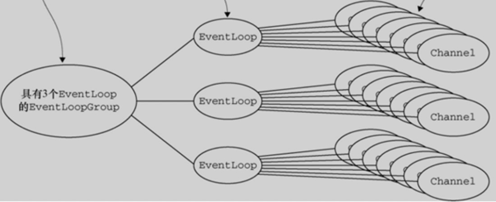
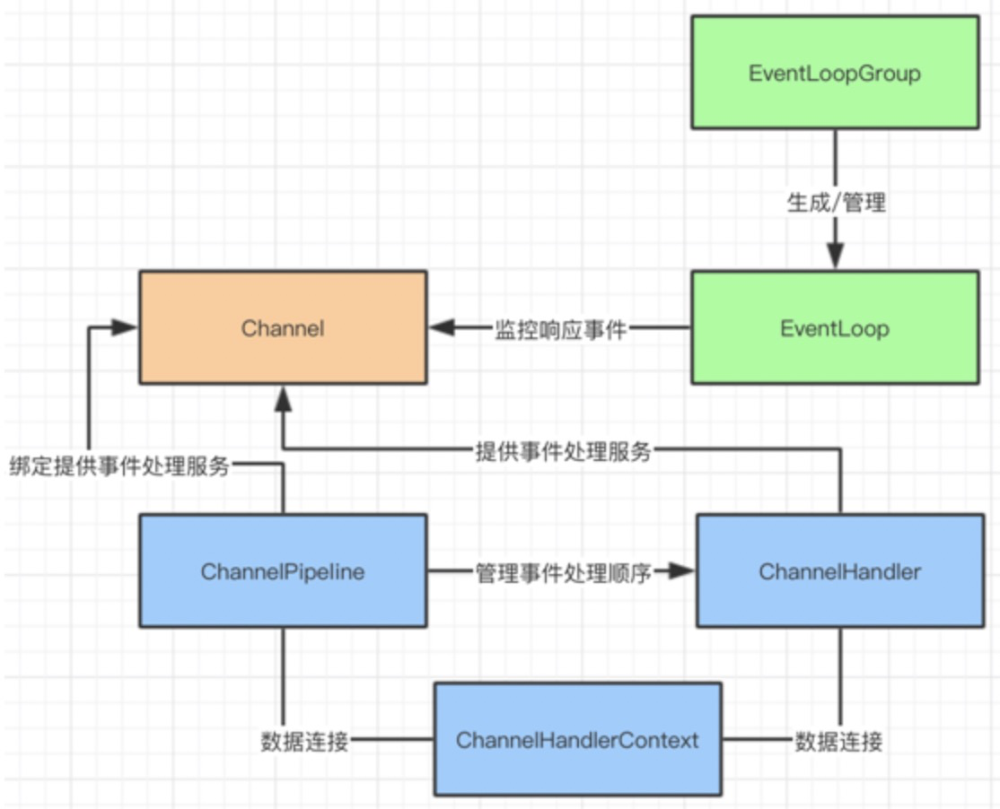
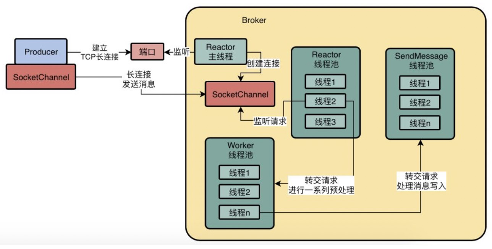

## 1.Netty定义

`Netty`是一个基于`Java NIO`类库的异步通信框架。特点是：异步非阻塞、基于事件驱动、高性能、高可靠性和高可定制性。

`Netty`特点：

```text
1.对 NIO 进行封装，开发者不需要关注 NIO 的底层原理，只需要调用 Netty 组件就能够完成工作。
2.对网络调用透明，从 Socket 建立 TCP 连接到网络异常的处理都做了包装。
3.对数据处理灵活， Netty 支持多种序列化框架，通过“ChannelHandler”机制，可以自定义“编/解码器”。
4.对性能调优友好，Netty 提供了线程池模式以及 Buffer 的重用机制（对象池化），不需要构建复杂的多线程模型和操作队列。
```

`Netty`简单执行流程：

```text
1.当每次客户端请求时，会创建一个 Socket Channel，并将其注册到 Selector 上（多路复用器）。

2.然后，Selector 关注服务端 IO 读写事件，此时客户端并不用等待 IO 事件完成，可以继续做接下来的工作。

3.一旦，服务端完成了 IO 读写操作，Selector 会接到通知，同时告诉客户端 IO 操作已经完成。

4.接到通知的客户端，就可以通过 SocketChannel 获取需要的数据了。

# 注意：
并不能算纯异步IO框架，因为处理数据的过程，需要先读取数据，处理，再返回的，这是个同步的过程。
```


## 2.应用

`Dubbo、RocketMQ、Hadoop、Elasticsearch`等。


## 3.Netty核心组件

①Channel

当客户端和服务端连接的时候会建立一个 Channel。

这个 Channel 我们可以理解为 Socket 连接，它负责基本的 IO 操作，例如：bind（），connect（），read（），write（） 等等。

简单的说，Channel 就是代表连接，实体之间的连接，程序之间的连接，文件之间的连接，设备之间的连接。同时它也是数据入站和出站的载体。


②EventLoop 和 EventLoopGroup

如果服务发出的消息称作“出站”消息，服务接受的消息称作“入站”消息。那么消息的“出站”/“入站”就会产生事件（Event）。

在 Netty 中每个 Channel 都会被分配到一个 EventLoop。一个 EventLoop 可以服务于多个 Channel。事件通知者。

每个 EventLoop 会占用一个 Thread，同时这个 Thread 会处理 EventLoop 上面发生的所有 IO 操作和事件（Netty 4.0）。

EventLoopGroup 是用来生成 EventLoop 的。



③ChannelHandler，ChannelPipeline 和 ChannelHandlerContext

ChannelHandler 是事件的处理者。可进行数据转换，逻辑运算等操作。

ChannelPipeline 是负责“排队”的。这里的“排队”是处理事件的顺序。

ChannelHandlerContext 的主要功能是管理 ChannelHandler 和 ChannelPipeline 的交互。




## 4.Netty 通信中的粘包、拆包，你能聊聊吗？

```text
粘包拆包问题：
TCP是个“流”协议，没有界限的一串数据。TCP底层并不了解上层业务数据的具体含义，它会根据TCP缓冲区的实际情况进行包的划分，所以在业务上认为，一个完整的包可能会被TCP拆分成多个包进行发送，也有可能把多个小的包封装成一个大的数据包发送，这就是所谓的TCP粘包和拆包问题。

粘包拆包原因：
1）要发送的数据大于TCP发送缓冲区剩余空间大小，将会发生拆包。
2）待发送数据大于MSS（最大报文长度），TCP在传输前将进行拆包。
3）要发送的数据小于TCP发送缓冲区的大小，TCP将多次写入缓冲区的数据一次发送出去，将会发生粘包。
4）接收数据端的应用层没有及时读取接收缓冲区中的数据，将发生粘包。

粘包拆包解决方案：只能通过上层的应用协议栈设计来解决
1）消息定长：发送端将每个数据包封装为固定长度（不够的可以通过补0填充），这样接收端每次接收缓冲区中读取固定长度的数据就自然而然的把每个数据包拆分开来。

2）设置消息边界：服务端从网络流中按消息边界分离出消息内容。在包尾增加回车换行符进行分割，例如FTP协议。

3）将消息分为消息头和消息体：消息头中包含表示消息总长度（或者消息体长度）的字段。
```

**Netty的拆包解决方案**

制造了拆包器。

```text
1.固定长度的拆包器 FixedLengthFrameDecoder

每个应用层数据包的都拆分成都是固定长度的大小，比如 1024字节。

对于使用固定长度的粘包和拆包场景，可以使用FixedLengthFrameDecoder，该解码一器会每次读取固定长度的消息，如果当前读取到的消息不足指定长度，那么就会等待下一个消息到达后进行补足。其使用也比较简单，只需要在构造函数中指定每个消息的长度即可。这里需要注意的是，FixedLengthFrameDecoder只是一个解码一器，Netty也只提供了一个解码一器，这是因为对于解码是需要等待下一个包的进行补全的，代码相对复杂，而对于编码器，用户可以自行编写，因为编码时只需要将不足指定长度的部分进行补全即可。

数据在编码发送的时候，也会以固定长度作为一调完整的消息。

2.行拆包器 LineBasedFrameDecoder

每个应用层数据包，都以换行符作为分隔符，进行分割拆分。

数据在编码发送的时候，会以换行符作为一条完整的消息。

3.分隔符拆包器 DelimiterBasedFrameDecoder

每个应用层数据包，都通过自定义的分隔符，进行分割拆分。这个版本，是LineBasedFrameDecoder 的通用版本，本质上是一样的。

数据在编码发送的时候，会以一个自定义的分隔符作为一条完整的消息。

4.基于数据包长度的拆包器 LengthFieldBasedFrameDecoder

将应用层数据包的长度，作为接收端应用层数据包的拆分依据。按照应用层数据包的大小，拆包。这个拆包器，有一个要求，就是应用层协议中包含数据包的长度。

LengthFieldBasedFrameDecoder与LengthFieldPrepender需要配合起来使用，其实本质上来讲，这两者一个是解码，一个是编码的关系。它们处理粘拆包的主要思想是在生成的数据包中添加一个长度字段，用于记录当前数据包的长度。LengthFieldBasedFrameDecoder会按照参数指定的包长度偏移量数据对接收到的数据进行解码，从而得到目标消息体数据；而LengthFieldPrepender则会在响应的数据前面添加指定的字节数据，这个字节数据中保存了当前消息体的整体字节数据长度。

数据在编码发送的时候，会指定当前这条消息的长度。
```

**UDP是否会发生粘包或拆包的现象呢？**

```text
不会
UDP是基于报文发送的，从UDP的帧结构可以看出，在UDP首部采用了16bit来指示UDP数据报文的长度，因此在应用层能很好的将不同的数据报文区分开，从而避免粘包和拆包的问题。

而TCP是基于字节流的，虽然应用层和TCP传输层之间的数据交互是大小不等的数据块，但是TCP把这些数据块仅仅看成一连串无结构的字节流，没有边界；
另外从TCP的帧结构也可以看出，在TCP的首部没有表示数据长度的字段，基于上面两点，在使用TCP传输数据时，才有粘包或者拆包现象发生的可能。
```


## 5.RocketMQ 是如何基于 Netty 扩展高性能网络通信架构的？



```text
1.Broker有一个Reactor线程，Producer与Broker之间是TCP长连接，用SocketChannel表示
2.SocketChannel只是长连接，Reactor需要监听连接获取消息，因此创建了Reactor线程池，默认是3个
Producer发送请求，发送一个消息过来到达Broker里的SocketChannel，此时Reactor线程池里的一个线程会监听到这个SocketChannel中有请求到达了！
3.接着Reactor线程从SocketChannel中读取出来一个请求，这个请求在正式进行处理之前，必须就先要进行一些准备工作和预处理，比如SSL加密验证、编码解码、连接空闲检查、网络连接管理。这时候需要Worker线程池，他默认有8个线程，此时Reactor线程收到的这个请求会交给Worker线程池中的一个线程进行处理，会完成上述一系列的准备工作。
4.完成准备工作之后需要基于业务线程池完成请求的处理：肯定是要写入CommitLog文件的，后续还有一些ConsumeQueue之类的事情需要处理，类似这种操作，就是业务处理逻辑。
比如对于处理发送消息请求而言，就会把请求转交给SendMessage线程池，SendMessage线程是可以配置的，你配置的越多，自然处理消息的吞吐量越高。
```

**为什么这套网络通信框架会是高性能以及高并发的？**

```text
1.分配一个Reactor主线程出来，就是专门负责跟各种Producer、Consumer之类的建立长连接，之后大量的长连接均匀的分配给Reactor线程池里的多个线程。
每个Reactor线程负责监听一部分连接的请求，通过多线程并发的监听不同连接的请求，可以有效的提升大量并发请求过来时候的处理能力，可以提升网络框架的并发能力。

2.利用不同的线程池并发执行不同事情，任何一个环节在执行的时候，都不会影响其他线程池在其他环节进行请求的处理：
1）Reactor线程池并发的监听多个连接的请求是否到达
2）Worker请求并发的对多个请求进行预处理
3）业务线程池并发的对多个请求进行磁盘读写业务操作
可以根据机器配置增加这几种线程池的配置。
```

