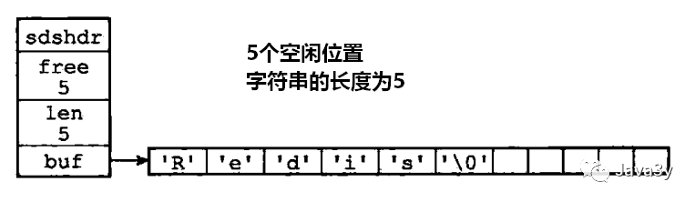
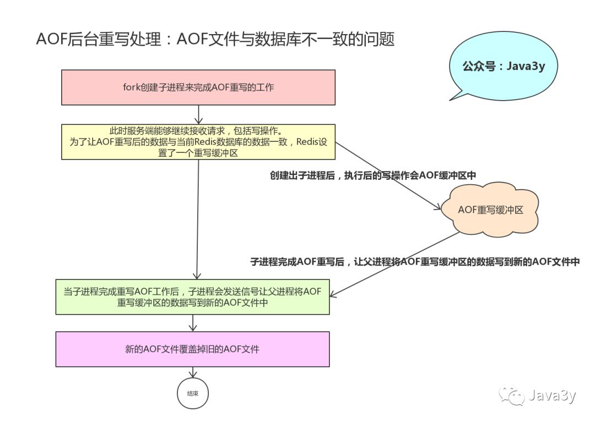

## 1.redis作用

### 1.1 服务发现


解决方案：

使用`zset`来保存单个服务列表，多个服务列表就使用多个`zset`来存储。

zset 的 value 和 score 分别存储服务的地址和心跳的时间。

```text
# 服务提供者需要使用心跳来汇报自己的存活，每隔几秒调用一次zadd。服务提供者停止服务时，使用zrem来移除自己。
zadd service_key heartbeat_ts addr
zrem service_key addr

# 服务可能是异常终止，根本没机会执行钩子，所以需要使用一个额外线程来清理服务列表中的过期项
zremrangebyscore service_key 0 now_ts - 30  # 30s 都没来心跳

# 通知消费者服务列表发生变更，同样使用版本号轮询机制。当服务列表变更时，递增版本号。消费者通过轮询版本号来重加载服务列表。
if zadd() > 0 || zrem() > 0 || zremrangebyscore() > 0:
  incr service_version_key
  
# 如果消费者依赖了很多的服务列表，那么它就需要轮询很多的版本号，这样的IO效率比较低下。
# 可以增加一个全局版本号，当任意服务列表版本号发生变更时，递增全局版本号。
# 正常情况下消费者只需要轮询全局版本号即可。
```

## 2.redis通讯协议

采用的是文本协议，`RESP(Redis Serialization Protocol)`协议通信。

客户端的命令格式：

```text
1.简单字符串 Simple Strings，以 "+"加号开头。

2.错误 Errors，以"-"减号开头。

3.整数型 Integer，以 ":" 冒号开头。

4.大字符串类型 Bulk Strings，以 "$"美元符号开头。

5.数组类型 Arrays，以 "*"星号开头。
```


## 3.redis有没有ACID事务

1.原子性：要么一起成功要么一起失败

`redis`不支持回滚，因为完成操作之后才会进行`AOF`日志记录，`AOF`日志的定位只是记录操作的指令记录。

2.一致性：数据在执行前后都具备一致性

执行错误数据具有一致性；宕机由于数据库计划，也具有一致性

3.隔离性：多事务并发执行，各个事务之间不会相互影响，并且并发下执行的事务和串行执行的事务产生的结果是完全相同的

`redis`是单线程操作，所以在隔离性上有天生的隔离机制

4.持久性：当一个事务执行完毕，执行这个事务所得到的的结果被保存在持久化存储中，即使服务器在事务执行完成后停机了，执行的事务的结果也不会被丢失。

`redis`是否具备持久化，取决于`redis`的持久化模式：

```text
1.纯内存运行，不具备持久化，服务一旦停机，所有数据将丢失。

2.RDB 模式，取决于 RDB 策略，只有在满足策略才会执行 Bgsave，异步执行并不能保证 Redis 具备持久化。
宕机可能有5分钟数据丢失
3.AOF 模式，只有将 appendfsync 设置为 always，程序才会在执行命令同步保存到磁盘，这个模式下，Redis 具备持久化。(将 appendfsync 设置为 always，只是在理论上持久化可行，但一般不会这么操作)
```


## 4.redis在内存上如何开源节流？

纯内存数据库，如果不对内存加以控制，可能会因为数据量过大导致系统崩溃。

1.Ziplist

Ziplist 是一个紧凑的数据结构，每一个元素之间都是连续的内存，如果在 Redis 中，Redis 启用的数据结构数据量很小时，Redis 就会切换到使用紧凑存储的形式来进行压缩存储。

如果使用的数据量很小，使用二维结构反而有些浪费了空间，在时间的性能上也没有得到太大的提升，不如直接使用一维结构进行存储。

如果对象的元素不断的增加，或者某个`Value`的值过大，这种小对象存储也会升级为标准结构

```text
hash-max-ziplist-entries 512 # hash元素个数超过512就必须用标准结构存储
hash-max-ziplist-value 64 # hash的任意元素的key/value的长度超过64就必须用标准结构存储
list-max-ziplist-entries 512
lias-max-ziplist-value 64
zset-max-ziplist-entries 128
zset-max-ziplist-value 64
set-max-intset-entries 512
```

2.Quicklist

双向链表，每个数据节点是一个`Ziplist`，`Ziplist`本身就是一个紧凑列表。


Quicklist 的结构设计简单总结起来，是一个空间和时间的折中方案：

- 双向链表可以在两端进行 Push 和 Pop 操作，但是它在每一个节点除了保存自身的数据外，还要保存两个指针，增加额外的内存开销。

其次是由于每个节点都是独立的，在内存地址上并不连续，节点多了容易产生内存碎片。

- Ziplist 本身是一块连续的内存，存储和查询效率很高，但是，它不利于修改操作，每次数据变动时都会引发内存 Realloc，如果 Ziplist 长度很长时，一次 Realloc 会导致大批量数据拷贝。

3.对象共享

Redis 在自己的对象系统中构建了一个引用计数方法，通过这个方法程序可以跟踪对象的引用计数信息，除了可以在适当的时候进行对象释放，还可以用来作为对象共享。

举个例子，假使键 A 创建了一个整数值 100 的字符串作为值对象，这个时候键 B 也创建保存同样整数值 100 的字符串对象作为值对象。

那么在 Redis 的操作时：

- 将数据库键的指针指向一个现有的值对象。
- 将被共享的值对象引用计数加一。

假使，我们的数据库中指向整数值 100 的键不止键 A 和键 B，而是有几百个，那么 Redis 服务器中只需要一个字符串对象的内存就可以保存原本需要几百个字符串对象的内存才能保存的数据。


## 0.选redis还是memcached

1.集群

redis和memcached都支持集群

2.数据类型

redis支持string、list、hash、set、sortedset5种形式，memcached仅支持简单的数据形式

3.分布式存储

redis采用master-slave复制模式

memcached可以使用一致性hash做分布式

4.持久化

redis采用RDB、AOF两种形式支持持久化，memcached不支持持久化。

5.数据一致性不同

redis只是用单核，而Memcached可以使用多核，所以平均每一个核上Redis在存储小数据时比Memcached性能更高。而在100k以上的数据中，Memcached性能要高于Redis，虽然Redis最近也在存储大数据的性能上进行优化，但是比起Memcached，还是稍有逊色。 

redis使用的是单线程模型，保证了数据按顺序提交。

memcache需要使用cas保证数据一致性。CAS（Check and Set）是一个确保并发一致性的机制，属于“乐观锁”范畴；原理很简单：拿版本号，操作，对比版本号，如果一致就操作，不一致就放弃任何操作 


## 1.redis

基于内存的数据结构存储，可以作为数据库、缓存、消息中间件。

为什么用redis而不用map做缓存？

```text
1.map是本地缓存，不具有一致性
2.map不是专业做缓存的，jvm内存太大容易挂掉。一般被当做容器来存储临时数据，缓存的数据随着jvm销毁而结束。
```

redis的key一定是字符串，value可以是string、list、hash、set、sortset。

对应的场景：

```text
1.string: 缓存用户信息、计数器、共享用户session
2.list: 常用作异步队列(rpush,lpop)，记录帖子的相关文章ID
3.hash: 值只能是字符串，可以用来存储用户信息，hash可以对用户结构的每个字段单独存储
4.set: 自带去重功能，可以用来存储某活动中中奖的用户ID
5.zset: 给value赋予了一个score，可以进行排序。可以用作热榜，例如微博热搜榜。
```


redis并没有直接使用这些数据结构来实现key-value数据库，而是基于这些数据结构来创建一个对象系统。key和value都是对象。

```text
typedef struct redisObject{

    // 对象的类型
    unsigned type 4:;

    // 对象的编码格式
    unsigned encoding:4;

    // 指向底层实现数据结构的指针
    void * ptr;

    //.....

}robj;
```


## 2.redis的数据结构

1.SDS简单动态字符串

```text
struct sdshdr{

    // 字节数组，用于保存字符串
    char buf[];

    // 记录buf数组中已使用的字节数量，也是字符串的长度
    int len;

    // 记录buf数组未使用的字节数量
    int free;
}
```



**好处**

* 记录len，获取len时间复杂度只需要o(1)
* 内部空间实现了动态扩展机制
* 扩展空间时，除了分配修改时所必要的空间，还会分配额外的空闲空间，这是空间预分配机制，减少内存分配的次数。
* SDS是二进制安全的。所有SDS API都会以处理二进制方式来处理SDS存放在buf数组里的数据。

2.链表

使用listNode可以组成链表

```text
typedef struct list{

    //表头结点
    listNode  *head;

    //表尾节点
    listNode  *tail;

    //链表长度
    unsigned long len;

    //节点值复制函数
    void *(*dup) (viod *ptr);

    //节点值释放函数
    void  (*free) (viod *ptr);

    //节点值对比函数
    int (*match) (void *ptr,void *key);

}list
```


特性：

* 无环双向链表
* 获取表头指针、表尾指针，链表节点长度的时间复杂度均为o(1)
* 链表使用`void *`指针来保存节点值，可以保存各个不同类型的值。


3.哈希表

哈希表 = 数组+链表

```text
 typedef struct dictht{

        //哈希表数组
        dictEntry **table;  

        //哈希表大小
        unsigned long size;    

        //哈希表大小掩码，用于计算索引值
        //总是等于size-1
        unsigned long sizemark;     

        //哈希表已有节点数量
        unsigned long used;

    }dictht
```


哈希表节点是怎样实现：

```text
  typedef struct dictEntry {

        //键
        void *key;

        //值
        union {
            void *value;
            uint64_tu64;
            int64_ts64;
        }v;    

        //指向下个哈希节点，组成链表
        struct dictEntry *next;

    }dictEntry;
```


Redis实现的哈希表和Java中实现的是**类似**的。只不过Redis多了几个属性来记录常用的值：sizemark(掩码)、used(已有的节点数量)、size(大小)。

Redis为了更好的操作，对哈希表往上再封装一层，使用dict结构来表示：

```text
typedef struct dict {

    //类型特定函数
    dictType *type;

    //私有数据
    void *privdata;

    //哈希表
    dictht ht[2];

    //rehash索引
    //当rehash不进行时，值为-1
    int rehashidx;  

}dict;
```


Redis中有两个哈希表（链地址法）：

* ht[0]：用于存放真实的key-value数据
* ht[1]：用于扩容（refresh)

Redis中哈希算法和哈希冲突跟Java实现差不多，差异就是：

* Redis哈希冲突时：是最新节点添加在链表的表头
* JDK1.8后，Java在哈希冲突时：是将新的节点添加到链表的表尾。

```text
1.拉链法(链地址法)
使用链表来保存发生hash冲突的key，即不同的key有一样的hash值，将这些发生冲突的value组成一个单项链表(只有next指针、没有pre指针)

2.开放地址法
即使key产生hash冲突，也不会形成链表，而是将所有元素都存入哈希表里。

发生hash冲突时，就以当前地址为基准，进行再寻址的方法去寻址下一个地址，直到找到一个为空的地址为止。

实现方式：线性探查、二次探查、伪随机探测。
```

**rehash**

* Redis 专门使用一个哈希表来做rehash。属于渐进式哈希（为了追求高性能，不堵塞服务）。
* Java hashmap很大时rehash阻塞服务。


4.跳跃表（skiplist）zset

Redis的跳跃表 实现由zskiplist和zskiplistNode两个结构组成。

其中zskiplist保存跳跃表的信息（表头、表尾节点、长度），zskiplistNode则表示跳跃表的节点。

```text
typeof struct zskiplistNode {
        // 后退指针
        struct zskiplistNode *backward;
        // 分值
        double score;
        // 成员对象
        robj *obj;
        // 层
        struct zskiplistLevel {
                // 前进指针
                struct zskiplistNode *forward;
                // 跨度
                unsigned int span;
        } level[];
} zskiplistNode;
```


核心思想：

```text
1.zskiplistNode 是跳跃表的节点，其 ele 是保持的元素值，score 是分值，节点按照其 score 值进行有序排列，而 level 数组就是其所谓的层次化链表的体现。

2.每个 node 的 level 数组大小都不同， level 数组中的值是指向下一个 node 的指针和 跨度值 (span)，跨度值是两个节点的score的差值。越高层的 level 数组值的跨度值就越大，底层的 level 数组值的跨度值越小。

3.level 数组就像是不同刻度的尺子。度量长度时，先用大刻度估计范围，再不断地用缩小刻度，进行精确逼近。

4.当在跳跃表中查询一个元素值时，都先从第一个节点的最顶层的 level 开始。比如说，在上图的跳表中查询 o2 元素时，先从o1 的节点开始，因为 zskiplist 的 header 指针指向它。

5.先从其 level[3] 开始查询，发现其跨度是 2，o1 节点的 score 是1.0，所以加起来为 3.0，大于 o2 的 score 值2.0。所以，我们可以知道 o2 节点在 o1 和 o3 节点之间。这时，就改用小刻度的尺子了。就用level[1]的指针，顺利找到 o2 节点
```


5.整数集合（intset）set

当一个set(集合)**只包含整数值元素**，并且**元素的数量不多**时，Redis就会采用整数集合(intset)作为set(集合)的底层实现。

整数集合(intset)保证了元素是**不会出现重复**的，并且是**有序**的(从小到大排序)，intset的结构是这样子的：

```text
typeof struct intset {
        // 编码方式
        unit32_t encoding;
        // 集合包含的元素数量
        unit32_t lenght;
        // 保存元素的数组
        int8_t contents[];
} intset;
```


6.压缩列表（ziplist）

压缩列表是list的底层实现，是Redis为了节约内存而开发的，由一系列的特殊编码的连续内存块组成的顺序性数据结构。


## 3.Redis数据库的原理

用redisServer结构体来表示，其中redisDb是一个数组，用来保存所有的数据库，dbnum代表数据库的数量（默认是16）

```text
struct redisServer{  

    //redisDb数组,表示服务器中所有的数据库
    redisDb *db;  

    //服务器中数据库的数量
    int dbnum;  

}; 
```

Redis是C/S结构 Redis客户端通过redisClient结构体来表示。

```text
typedef struct redisClient{  

    //客户端当前所选数据库
    redisDb *db;  

}redisClient;
```

Redis客户端连接Redis服务端示意图：


每个数据库用redisDb结构体来表示：

```text
typedef struct redisDb { 
    int id;         // 数据库ID标识
    dict *dict;     // 键空间，存放着所有的键值对              
    dict *expires;  // 过期哈希表，保存着键的过期时间                          
    dict *watched_keys; // 被watch命令监控的key和相应client    
    long long avg_ttl;  // 数据库内所有键的平均TTL（生存时间）     
} redisDb;
```

注意：

在数据库中所有的键值对的存储结构是哈希表。

```shell
> get message
"hello world"
```


## 4.Redis过期策略

```shell
> PEXPIREAT message 124556790900
(integer) 1
```

过期策略：

* 定时删除（对内存友好、对CPU不友好）

  到时间点就把所有过期的键删除了。

* 惰性删除（对CPU极度友好，对内存极度不友好）

  每次从键空间取键时，判断一下改键是否过期，过期就删除。

* 定期删除（折中）

  每隔一段时间去删除过期键，限制删除的执行时长和频率。

  Redis采用的是**惰性删除+定期删除**


## 5.内存淘汰策略

Redis设置内存最大使用量，当内存使用量超过时，会施行数据淘汰策略。


实现LRU缓存机制（双链表）：

```python
class ListNode:
    def __init__(self, key=None, value=None):
        self.key = key
        self.value = value
        self.prev = None
        self.next = None

class LRUCache:
    def __init__(self, capacity):
        self.capacity = capacity
        self.hashmap = {}
        # 新建两个节点 head 和 tail
        self.head = ListNode()
        self.tail = ListNode()
        # 初始化链表为 head <-> tail
        self.head.next = self.tail
        self.tail.prev = self.head

    def move_node_to_tail(self, key):
        # prev <-> node <->  next 先将node摘出来
        node = self.hashmap[key]
        node.next.prev = node.prev
        node.prev.next = node.next
        # 在next ... tail中间加上node
        node.prev = self.tail.prev
        self.tail.prev.next = node
        node.next = self.tail
        self.tail.prev = node

    def get(self, key: int) -> int:
        if key in self.hashmap:
            self.move_node_to_tail(key)
        res = self.hashmap.get(key,-1)
        if res == -1:
            return res
        else:
            return res.value
        
    def put(self, key: int, value: int) -> None:
        if key in self.hashmap:
            self.hashmap[key].value = value
            self.move_node_to_tail(key)
        else:
            if len(self.hashmap) == self.capacity:
                # 去掉哈希表对应项
                self.hashmap.pop(self.head.next.key)
                # 去掉最久没有被访问过的节点，即头节点之后的节点
                self.head.next = self.head.next.next
                self.head.next.prev = self.head
            new = ListNode(key, value)
            self.hashmap[key] = new
            new.prev = self.tail.prev
            self.tail.prev.next = new
            new.next = self.tail
            self.tail.prev = new
```

上面这个太复杂了，使用`collections.OrderedDict`来做简单些：

```python
from collections import OrderedDict
 
 
class LRUCache(OrderedDict):
    '''不能存储可变类型对象，不能并发访问set()''' 

    def __init__(self,capacity):
        self.capacity = capacity
        self.cache = OrderedDict()
     

    def get(self,key):
        if self.cache.has_key(key):
            value = self.cache.pop(key)
            self.cache[key] = value
        else:
            value = None
         
        return value
     

    def set(self,key,value):
        if self.cache.has_key(key):
            value = self.cache.pop(key)
            self.cache[key] = value
        else:
            if len(self.cache) == self.capacity:
                self.cache.popitem(last = False)    #pop出第一个item
                self.cache[key] = value
            else:
                self.cache[key] = value
```


## 6.Redis持久化

Redis基于内存的，需要做持久化。

1.RDB 快照持久化（全量备份）

将某一时刻的所有数据保存到一个RDB文件中(压缩的二进制文件)。

以下两个命令可以生产RDB文件：

```text
SAVE
阻塞Redis服务器进程，服务器不能接收任何请求，直到RDB文件创建完毕

BGSAVE
创建一个子进程，由子进程负责创建RDB文件，服务器进程可以继续接收请求。
```

```shell
> save 
# 定时执行策略  redis.conf
save 900 1  # 在900s之后，至少有一个key发生变化
save 300 100 # 在300s之后，至少有10个key发生变化
save 60 10000 # 在60s之后，至少有10000个key发生变化
stop-writes-on-bgsave-error yes  
# 设置成yes，当备份进程出错时，主进程就停止进行接收新的写入操作，保证持久化数据的一致性问题。
```

原理：

```text
struct redisServer{
    // 修改计数器
    long long dirty;

    // 上一次执行保存的时间
    time_t lastsave;

    // 参数的配置
    struct saveparam *saveparams;
};
```

遍历参数数组，判断修改次数和时间是否符合，如果符合则调用besave()来生成RDB文件。


2.AOF(append-only-file)（增量备份）

当Redis服务器执行写命令时，将执行的写命令保存到AOF文件中。


写数据，按照Redis的命令请求协议格式保存。Redis协议规范RESP。

AOF持久化功能的实现：

```text
1.命令追加
命令写入aof_buf缓冲区

2.文件写入
调用flushAppendOnlyFile函数，考虑是否要将aof_buf缓冲区写入AOF文件中

3.文件同步
考虑是否将内存缓冲区的数据真正写入到磁盘中
```


`flushAppendOnlyFile`函数的行为由服务器配置的appendfsyn选项决定：

```text
appendfsync always     # 每次有数据修改发生时都会写入AOF文件。
appendfsync everysec   # 每秒钟同步一次，该策略为AOF的默认策略。
appendfsync no         # 从不同步。高效但是数据不会被持久化。
```


AOF后台重写

将多条命令合并成一条命令，使AOF文件的体积变得更小。

Redis AOF后台重写，不会阻塞主进程，可能会导致当前数据库和重写后的AOF文件的数据不一致。

解决方案：AOF重写缓冲区



## 6.RDB和AOF对过期键的策略

1.RDB持久化对过期键的策略：

已过期的键不会保存在RDB文件中。


2.AOF持久化对过期键的策略：

键过期但是还没删除，AOF文件不会对这个过期键产生任何影响，当过期的键被删除了之后，会追加一条DEL命令来显示记录该键被删除了。


## 7.RDB和AOF的优缺点

```text
RDB:
优点：载入时恢复数据快、文件体积小
缺点：默认5分钟或更久生成一次，会一定程度上丢失数据(在持久化之前出现宕机)
AOF:
优点：丢失数据少(默认配置只丢失一秒的数据)
缺点：恢复数据相对较慢，文件体积大

如果同时开启了RDB和AOF持久化，服务器会有限使用AOF文件来还原数据(AOF更新频率快)
```

涉及RDB和AOF的配置：

```shell
redis持久化，两种方式
1、rdb快照方式
2、aof日志方式

----------rdb快照------------
save 900 1
save 300 10
save 60 10000

stop-writes-on-bgsave-error yes
rdbcompression yes
rdbchecksum yes
dbfilename dump.rdb
dir /var/rdb/

-----------Aof的配置-----------
appendonly no # 是否打开 aof日志功能

appendfsync always #每一个命令都立即同步到aof，安全速度慢
appendfsync everysec
appendfsync no 写入工作交给操作系统，由操作系统判断缓冲区大小，统一写入到aof  同步频率低，速度快


no-appendfsync-on-rewrite yes 正在导出rdb快照的时候不要写aof
auto-aof-rewrite-percentage 100
auto-aof-rewrite-min-size 64mb 


./bin/redis-benchmark -n 20000
```


## 8.IO多路复用

字符读取、写出。字节读取、写出。

文件IO、网络IO


```text
IO是面向流的处理（字节），NIO是面向块(缓冲区)的处理（块）。

NIO核心部分：
1.buffer缓冲区
put()/get() 操作数据

2.channel管道
传输数据
1）使用FileChannel配合缓冲区实现文件复制的功能
2）使用内存映射文件方式实现文件复制的功能(直接操作缓冲区)
3）通道之间通过transfer()实现数据数据的传输(直接操作缓冲区)

3.Selector选择器
```

常用I/O模型

1.阻塞I/O模型

其系统调用直到数据包到达且被复制到应用进程的缓冲区中或者发生错误时才返回，在此期间一直等待。


2.非阻塞I/O模型

内核没数据直接返回`EWOULDBLOCK`错误，一般都对非阻塞I/O模型进行轮询检查这个状态，看内核是不是有数据到来。


3.I/O复用模型

linux对文件操作是利用文件描述符`file descriptor`来实现的。

linux实现I/O复用模型：

- 调用`select/poll/epoll/pselect`其中一个函数，**传入多个文件描述符**，如果有一个文件描述符**就绪，则返回**，否则阻塞直到超时。


步骤：

```text
1.当用户进程调用了select，那个整个进程会被block
2.同时kernel会监事所有select负责的socket
3.当任何一个socket中的数据准备好了，select就会返回
4.这个时候用户进程再调用read操作，将数据从kernel拷贝到用户进程(空间)。
```

I/O多路复用的特点是通过一种机制一个进程同时等待多个文件描述符。优势在于能处理更多的链接。


## 9.Redis线程模型及事件

Redis内部使用文件事件处理器`file event handler`，这个文件事件处理器是单线程的，所以Redis才叫做单线程的模型。它采用IO多路复用机制同时监听多个Socket，根据Socket上的事件来选择对应的事件处理器进行处理。


* 文件事件：对Socket操作的抽象，Redis服务器与Redis客户端的通信会产生文件事件，服务器通过监听并处理这些事件来完成一系列的网络操作。
* 时间事件：时间事件其实是对定时操作的抽象，RDB、AOF等。


```text
I/O多路复用程序来同时监听多个Socket。当被监听的Socket准备好执行连接应答(accept)、读取(read)等等操作时，与操作相对应的文件事件就会产生，根据文件事件来为Socket关联对应的事件处理器，从而实现功能。

I/O多路复用程序是将所有产生的Socket放到一个队列里边，队列有序、同步、每次一个socket非方式向文件事件分派器传送套接字。
```

客户端和服务器的通信过程：

```text
1.客户端向服务器发送连接请求，服务器执行连接应答处理器。
2.客户端向服务器发送命令请求服务器执行命令请求处理器。
3.服务器向客户端发送命令回复服务器执行命令恢复处理器。
```


## 10.Redis单线程为什么快？

```text
1.纯内存操作
单进程单线程模型的KV数据库，每秒10w+ QPS

2.数据结构简单，对数据操作也简单，Redis中的数据结构是专门进行设计的

3.核心是基于非阻塞的IO多路复用机制

4.单线程避免了多线程的频繁上下文切换的问题，也不用去考虑加锁释放锁的操作，没有因为可能出现死锁而导致的性能消耗。
```

Redis是单线程的，但是可以在单机开多个Redis实例。

如果单机有瓶颈，解决方案：

**Redis cluster**，并且是主从同步读写分离，类似**Mysql**的主从同步，**Redis cluster** 支撑 N 个 **Redis master node**，每个**master node**都可以挂载多个 **slave node**。


## 11.Redis主从架构

```text
主服务器负责接收写请求
从服务器负责接收读请求
从服务器的数据由主服务器复制过去。主从服务器数据是一致的。
(可以设置salveof选项，从服务器可以从主服务器拉数据)

主从架构的好处：
1.读写分离，主写从读
2.高可用
3.处理更多的并发量
```

复制功能：

```text
1.同步
将从服务器的数据库状态更新至主服务器的数据库状态
2.命令传播
主服务器的数据库状态被修改，导致主从服务器的数据库状态不一致，让主从服务器的数据库状态重新回到一致状态。
```

复制前准备工作：

```text
1.从服务器设置主服务器的IP和端口
2.建立与主服务器的Socket连接
3.发送ping命令
4.身份验证
5.从服务器给主服务器发送端口的信息，主服务器记录监听的端口。
```

## 12.同步策略

1.完整重同步

```text
1.从服务器向主服务器发送PSYNC命令
2.收到PYSNC命令的主服务器执行BGSAVE命令，在后台生成一个RDB文件。并用一个缓冲区来记录从现在开始执行的所有写命令。
3.主服务器将RDB文件传给从服务器，从服务器将自己的数据库状态更新至与主服务器执行BGSAVE命令时的状态。
4.主服务器将所有缓冲区的写命令发送给从服务器，从服务器会执行这些写命令。
```

2.部分重同步

断线重连后只需要同步缺失的数据。

要点：

```text
主从服务器维持一个复制偏移量。
服务器执行完整重同步或部分重同步，交给复制积压缓冲区。
服务器运行的ID(run ID)实际是用来比对ID是否相同，不相同会进行完整重同步。
```

 

3.命令传播

完成同步滞后，主从服务器会进入命令传播阶段。从服务器执行主服务器的写命令。保证主从服务器一直保持数据源一致。

从服务器默认会以每秒一次的频率向服务器发送命令`REPLCONFACK<replication_offset>`，其中`replication_offset`是从服务器当前的复制偏移量。

作用:

```text
1.监测主从服务器的网络状态
2.辅助实现min-slaves选项
3.监测命令丢失
```

## 13.哨兵机制（Sentinel）

主服务器挂掉重新选举，主备切换（故障转移）。

```text
功能：
1.不停监控Redis主从服务器是否正常工作。
2.如果某个redis实例有故障，那么哨兵负责发送消息通知管理员。
3.主备切换
4.可以作为配置中心，能够提供当前主服务器的信息。
```

步骤：

1.启动和初始化Sentinel

本质上是运行在特殊模式下的Redis服务器（不会加载AOF/RDB文件）。初始化Sentinel的状态，根据给定的配置文件初始化Sentinel监视的主服务器列表。


Sentinel会创建两个连向主服务器的网络连接：

* 命令连接（发送和接受命令）
* 订阅连接（订阅主服务器的sentinel:hello频道）

2.获取和更新信息

Sentinel通过主服务器发送INFO命令来获取主服务器属下所有从服务器的地址信息，并为这些从服务器创建相应的实例结构、创建命令连接和订阅连接。


通过命令连接会以每两秒一次的频率向监视的主从服务器`_sentinel_:hello`频道发送命令，并通过订阅连接频道信息。

3.判断主服务器是否下线：

```text
1.主观下线
down-after-milliseconds 毫秒内主服务器无应答，Sentinel主观认为该主服务器下线

2.客观下线
Sentinel 节点会通过 sentinel 
is-master-down-by-addr 命令，向其它 Sentinel 节点询问对该节点的状态判断。如果超过 <quorum> 个数的节点判定 主节点 不可达，则该 Sentinel 节点会判断 主节点为客观下线。
```

4.选举领头Sentinel和故障转移

主服务器客观下线，监视这个下线的主服务器的各种Sentinel会进行协商，选举出一个领头的Sentinel，对主服务器进行故障转移。

故障转移就是挑选一台从服务器将其复制成新的主服务器。策略：

```text
1.跟master断开连接的时长
2.slave优先级
3.复制offset
4.run id
```

**redis哨兵与redis集群的区别**

```text
1.Redis Sentinal着眼于高可用，在master宕机时会自动将slave提升为master，继续提供服务

2.Redis Cluster着眼于扩展性，在单个redis内存不足时，使用Cluster进行分片存储。
```


## 14.Redis数据丢失

* 1.异步复制导致数据丢失

  部分数据还没复制到从服务器，主服务器宕机

* 2.脑裂导致的数据丢失

  某个master所在机器突然脱离了正常的网络，跟其他slave机器不能连接，但是实际上master还运行着此时哨兵可能就会认为master宕机了，然后开启选举，将其他slave切换成了master。这个时候，集群里就会有两个master，也就是所谓的脑裂。此时虽然某个slave被切换成了master，但是可能client还没来得及切换到新的master，还继续写向旧master的数据可能也丢失了因此旧master再次恢复的时候，会被作为一个slave挂到新的master上去，自己的数据会清空，重新从新的master复制数据。

设置参数：

```shell
min-slaves-to-write 1   # slave数
min-slaves-max-lag 10  # 数据复制、同步的时延
# 至少有1个slave，数据复制和同步的延迟不能超过10秒
```


## 15.如何解决缓存雪崩？

为什么使用缓存？

```text
1.提高性能：内存查询快
2.提高并发能力：缓存分担了部分请求，支持更高的并发
```

缓存雪崩就是缓存失效，请求全部走数据库，把数据库打挂。

对于Redis来说，对缓存数据设置了过期时间，如果时间是相同的，会导致这段时间内这些缓存同时失效，全部请求到数据库中。

解决方案：

```在缓存的时候给过期时间加上一个随机值```

"Redis挂掉，请求全部走数据库"，有如下思路：

```text
1.事发前：实现Redis的高可用（主从架构+Sentinel/Redis Cluster）尽量避免Redis挂掉

2.事发中：万一Redis真的挂掉了，可以设置本地缓存（ehcache）和限流（hystrix），尽量避免我们的数据库被干掉。

3.事发后：redis持久化，重启后自动从磁盘上加载数据，快速恢复缓存数据。
```


## 16.如何解决缓存穿透？

查询一个一定不存在的数据。由于缓存不命中，并且出于容错考虑，缓存查不到会去请求数据库。

解决方案：

```text
1.过滤(用布隆过滤器过滤)
2.数据库找不到，也会将这个空对象设置到缓存里边去。
这时一般将空对象设置一个较短的过期时间。
```

高并发情况下存在大量不命中的情况，这时候的解决方案：

```text
利用Mysql数据的Binlog日志异步去刷新缓存
```


## 17.缓存与数据库双写不一致

读操作没问题

更新操作：更新缓存、删除缓存，一般都是删除缓存。

两种策略：

1.先更新数据库，再删除缓存。

```text
原子性被破坏：
1.更新数据库成功，删除缓存失败，数据不一致
可以使用数据库的binlog来异步淘汰key，以mysql为例，可以使用canal将binlog日志采集发送到MQ队列里，然后通过ACK机制确认处理这条消息，删除缓存，保证数据缓存一致性。
可能主从数据库同步有延迟，删除缓存，数据同步到备库之前已经有请求过来时，会从备库中读到脏数据。这时MQ需要采集主备所有库的binlog，收到最后一台binlog数据才删除缓存。

2.更新数据库失败，直接返回错误(Exception)，不会出现数据不一致。
```

解决方案：

`Cache Aside Pattern`


高并发下可能出现不一致的场景：

```text
缓存刚好失效 --> 线程A查询数据库，得一个旧值 --> 线程B将新值写入数据库 --> 线程B删除缓存 --> 线程A将查到的旧值写入缓存。
```

**删除缓存失败的解决思路**：

```text
1.将需要删除的key发送到消息队列中
2.自己消费消息，获取需要删除的key
3.不断重试删除操作，直到成功
```

2.先删除缓存，再更新数据库

```text
原子性被破坏：
1.删除缓存成功，更新数据库失败，数据一致
2.删除缓存失败，直接返回错误(Exception)，数据库和缓存的数据还是一致的。
```

高并发下可能出现不一致的场景：

```text
线程A删除了缓存 --> 线程B查询，发现缓存已不存在 --> 线程B去数据库查询得到旧值 --> 线程B将旧值写入缓存 --> 线程A将新值写入数据库
```

**解决思路**

将删除缓存、修改数据库、读取缓存等操作积压到队列里边，实现串行化。

对比：

* 先更新数据库，再更新缓存（`Cache Aside Pattern`）

  在高并发下表现优异，在原子性被破坏时表现不如意

* 先删除缓存，再更新数据库

  在高并发下表现不如意，在原子性被破坏时表现优异


## 17.redis 分布式锁

分布式CAP原则：Consistency（一致性）、Availability（可用性）、Partition tolerance(分区容错性)，三者不可得兼。

分布式锁最好要满足以下几点：

```text
1.同一方法在同一时间只能被一台机器上的一个线程执行
2.锁是可重入锁(避免死锁)、阻塞锁
3.有高可用的获取锁和释放锁的功能
4.锁性能要好
```

分布式锁特点：

```text
1.互斥性：同一时刻只能有一个线程持有锁
2.可重入性：可以多次获取锁
3.锁超时
4.高性能和高可用
5.具备阻塞和非阻塞性
```

1.使用代码设置无法保证原子性(不会被线程调度打断的操作)。

2.使用lua脚本

redis-cli模式：

```shell
# 加锁
> set lock 123456 EX 40 NX   // 直接使用set nx模式
# 解锁 结合lua脚本
> eval "if redis.call('get','lock') == ARGV[1] then return  redis.call('del','lock') else return 0 end" 0 123456

# 获得锁
> get lock
(nil)

# lua脚本的含义
if redis.call('get','lock') == ARGV[1]
then
    return redis.call('del','lock')
else
    return 0
end

# value值必须要具有唯一性，可以用UUID来做
线程1获取锁，阻塞锁自动释放
线程2获取同一资源的锁
线程1从阻塞中恢复过来，因为value值一样，执行锁释放操作就会释放掉线程2所有的锁。

# 用set key value EX PX NX模式也可能存在问题
客户端1从master拿到锁，但是这个加锁key还没同步到slave节点，master故障，发生故障转移，某个slave节点升级为master节点，客户端2也可以获取同一个key的锁。导致多个客户端都拿到锁。
```

**锁异常处理**

```text
1.直接抛出异常，通知用户稍后重试
2.sleep，重试
3.将请求转移至延时队列，过一会重试。(异步)
```


## 18.redis Bloom Filter

布隆过滤器：

```text
本质上布隆过滤器是一种数据结构，比较巧妙的概率型数据结构（probabilistic data structure），特点是高效地插入和查询，可以用来告诉你 “某样东西一定不存在或者可能存在”。

redis 布隆过滤器的数据结构是大型的位数组和几个不一样的无偏hash函数。
```

使用场景：

* 1.数据库防止穿库（NOSQL：HBase、Cassandra），比如黑客使用不存在的id不断查询数据库，造成缓存穿透直接访问数据库。
* 2.web拦截器，相同请求拦截防止被攻击。用户第一次请求，将请求参数放入BloomFilter中，当第二次请求时，先判断请求参数是否被BloomFilter命中。可以提高缓存命中率。
* 3.爬虫系统有成千上万个url，维持这样一个url的集合非常浪费空间，所以已经被爬过的url就不爬了。
* 4.垃圾邮件。


布隆过滤器的使用步骤：

布隆过滤器是一个bit向量或bit数组。


1.针对值 “baidu” 和三个不同的哈希函数分别生成了哈希值 1、4、7，则上图转变为：


2.再存一个值 “tencent”，如果哈希函数返回 3、4、8 的话，图继续变为：


4 这个 bit 位由于两个值的哈希函数都返回了这个 bit 位，因此它被覆盖了。

3.再存一个值”dianping"，哈希函数返回了 1、5、8三个值，结果我们发现 5 这个 bit 位上的值为 0，说明没有任何一个值映射到这个 bit 位上，因此我们可以很确定地说 “dianping” 这个值不存在。

但是查询"baidu"值，虽然1、4、7都为1，但是只能说明这个值可能存在。

**归纳**

```text
1.添加key:会通过几个无偏hash函数对key hash，算的一个整数索引值，取模得到几个位置，将位数组这些位置置为1，完成add。
2.查询key:key hash算得的几个位置在位数组中找，如果存在0，说明这个key一定不存在，都是1的话，位数组稀疏的话存在的概率大一些。
```

空间占用估计公式：

```text
k=0.7*(1/n)  # n 预计元素的数量 k hash函数最佳数量
f=0.6185^(1/n)  # f 错误率
```


## 19.缓存热点key解决方案

[https://mp.weixin.qq.com/s/sP2Glseiz7Y5jE4Im2BZwg](https://mp.weixin.qq.com/s/sP2Glseiz7Y5jE4Im2BZwg)

**Hash索引和热点问题**


冲突的链表越长，需要访问得内存次数就越多。o(n)


如果热点数据接近链表尾部，访问内存的次数就越高，性能就会越差。

**一般的套路**

1.cpu缓存加速访问热点数据块。但是cpu缓存比较小，满足不了需求。

2.rehash，通过rehash减少冲突链表的长度。冲突链表长度越短，热点数据访问的代价就越小，性能就会越高。

但是hash表很大的时候不建议rehash，只能减少链表长度，但是影响性能。


**解决方案**

1.使用有序冲突环（避免死锁）代替冲突链表。

2.热点数据转移识别：

热点key分布在bucket中，在bucket可能一般只有一个热点key。

方法有随机移动策略(5次请求刚好是热点访问不需要移动Head指针)，统计采样策略。

3.并发操作，lock-free下比较复杂。

```text
1.Head指针可能被多个线程并发执行移动操作。因为要考虑Head指针的并发情况，防止Head指针移动到无效的KEY上。
2.当我们删除或者更新KEY时，我们需要检查Head指针是否在这些KEY上。
```

一般也会使用一个flag控制相应操作，类似于CAS。

4.无锁rehash

一方面，Head指针可能被多个线程并发执行移动操作。因为要考虑Head指针的并发情况，防止Head指针移动到无效的KEY上。另一方面，当我们删除或者更新KEY时，我们需要检查Head指针是否在这些KEY上。


## 20、redis集群模式下，redis的key是如何寻址的？

redis cluster 有固定的 `16384` 个 hash slot，对每个 `key` 计算 `CRC16` 值，然后对 `16384` 取模，可以获取 key 对应的 hash slot。

**寻址算法**

```text
1.hash算法
来了一个 key，首先计算 hash 值，然后对节点数取模。然后打在不同的 master 节点上。
存在问题：一旦一个master挂掉，会对剩余节点数取模，此时如果请求过来是无法找到缓存数据，导致大量数据打到数据库。

2.一致性hash算法
将整个 hash 值空间组织成一个虚拟的圆环，整个空间按顺时针方向组织，下一步将各个 master 节点（使用服务器的 ip 或主机名）进行 hash。这样就能确定每个节点在其哈希环上的位置。
来了一个key，首先计算 hash 值，并确定此数据在环上的位置，从此位置沿环顺时针“行走”，遇到的第一个 master 节点就是 key 所在位置。

增加或删除节点，只会影响到节点逆时针向的第一个节点。

避免数据倾斜，一般会进行虚拟节点操作

3.hash slot算法
固定hash slot，每个节点取一部分即可。
```


## 21、Redis 哨兵和集群模式

目的都是保证高可用。

```text
1.哨兵
由一个或多个哨兵去监听任意多个主服务以及主服务器下的所有从服务器，并在被监视的主服务器进行下线状态时，自动将下线主服务器属下的某个从服务器升级为主服务器。
下线：
1）主观下线
down-after-milliseconds 毫秒内主服务器无应答，Sentinel主观认为该主服务器下线

2）客观下线
Sentinel 节点会通过 sentinel 
is-master-down-by-addr 命令，向其它 Sentinel 节点询问对该节点的状态判断。如果超过 <quorum> 个数的节点判定 主节点 不可达，则该 Sentinel 节点会判断 主节点为客观下线。


2.集群
集群将所有数据划分为16384个槽位，每个节点负责其中一部分槽位，槽位的信息存储于每个节点中。

```


## 22、Redis附近的人

`Redis`基于`geohash`和有序集合（`zset`）提供了地理位置相关功能。包含6个命令：

```text
GEOADD: 将给定的位置对象（纬度、经度、名字）添加到指定的key;
GEOPOS: 从key里面返回所有给定位置对象的位置（经度和纬度）;
GEODIST: 返回两个给定位置之间的距离;
GEOHASH: 返回一个或多个位置对象的Geohash表示;
GEORADIUS: 以给定的经纬度为中心，返回目标集合中与中心的距离不超过给定最大距离的所有位置对象;
GEORADIUSBYMEMBER: 以给定的位置对象为中心，返回与其距离不超过给定最大距离的所有位置对象。
其中：
GEORADIUSBYMEMBER = GEOPOS + GEORADIUS，即先查找用户位置再通过该位置搜索附件满足位置相互距离条件的其他用户对象
```

附近的人实现是：

```text
1.GEOADD
1）参数提取和校验
2）将入参经纬度转换为52位的geohash值(score)
3）调用ZADD命令将member及其对应的score存入集合key中

2.GEORADIUS
1）参数提取和校验
2）利用中心点和输入半径计算待查区域范围。这个范围参数包括满足条件的最高的geohash网格等级(精度) 以及 对应的能够覆盖目标区域的九宫格位置；
3）对九宫格进行遍历，根据每个geohash网格的范围框选出位置对象。进一步找出与中心点距离小于输入半径的对象，进行返回。
```


在多层geohash网格中，每个低等级的geohash网格都是由4个高一级的网格拼接而成。