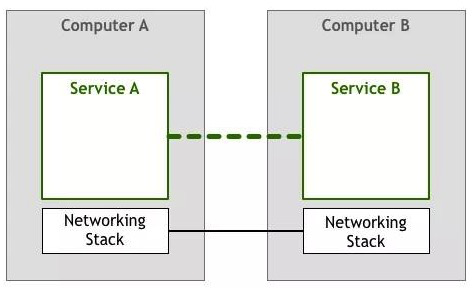
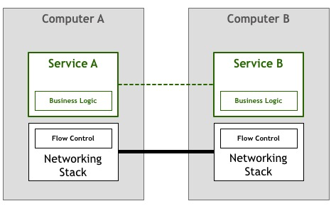
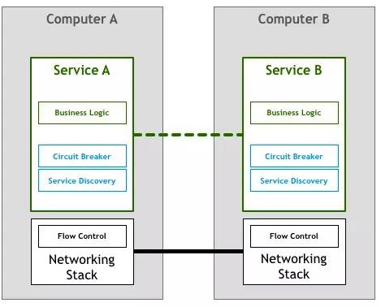
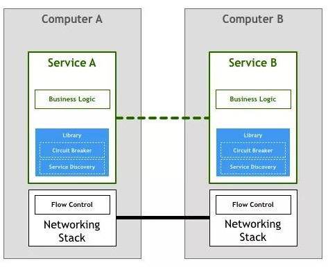
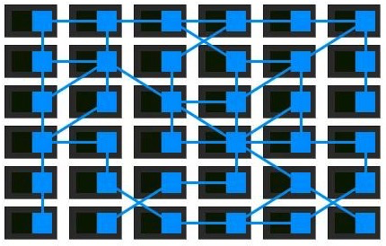
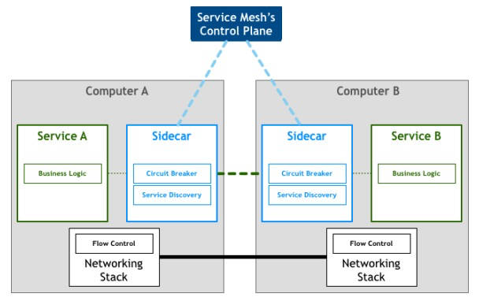
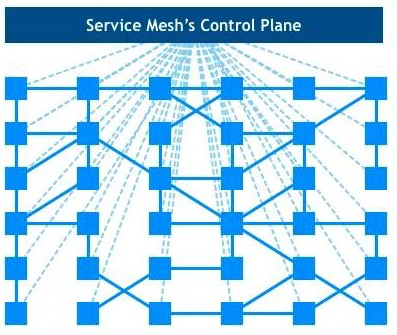

## Service Mesh

[详谈什么是Service Mesh技术](https://developer.51cto.com/art/202003/611816.htm?utm_source=tuicool&utm_medium=referral&from=timeline&isappinstalled=0)

**微服务**

是一种软件架构风格，它是以专注于单一责任与功能的小型功能块为基础，利用模块化的方式组合出复杂的大型应用程序，各功能块使用与语言无关的API集相互通信。

**Service Mesh**

`Service Mesh`是微服务·的`TCP`协议。

**微服务架构演变**

* 1.原始通信时代



服务需要自己处理网络通信所面临的丢包、乱序、重试等一系列问题。

* 2.TCP时代

解决了网络传输中通用的流量控制问题，将技术栈下移，从服务的实现中抽离出来，成为操作系统网络层的一部分。



* 3.第一代微服务

分布式系统发展，分布式系统特有的通信语义出现了，如熔断策略、负载均衡、服务发现、认证和授权、trace和监控等。根据服务需求来实现一部分所需的通信语义。



* 4.第二代微服务

为了避免每个服务自己实现一套分布式系统通信的语义功能。出现了一些面向微服务架构的开发框架。

如：`Twitter`的`Finagle`、`Facebook`的`Proxygen`以及`Spring Cloud`。



* 5.第一代Service Mesh

第二代微服务模式看似完美，却存在一些本质问题：

```text
1.开发者需要花更多精力去掌握和管理复杂的框架本身，追踪和解决框架出现的问题也绝非易事。
2.开发框架通常只支持一种或几种特定的语言，这也违背了微服务的特性：与语言无关。
3.框架以lib库形式和服务联编，复杂项目依赖和库版本兼容问题会非常棘手。
框架的升级也无法对服务透明，服务会因为和业务无关的lib库升级而被迫升级。
```

因此出现了`Linkerd，Envoy，Ngixmesh`为代表的代理模式(`SideCar`模式)。将分布式服务的通信抽象为单独一层，在这一层实现负载均衡、服务发现、认证授权、监控追踪、流量控制等分布式系统所需要的功能。

代理服务和服务对等，和服务部署在一起。


略去服务，只看`Service Mesh`的单机组件组成的网络：



这就是服务网格。

* 6.第二代Service Mesh

第一代Service Mesh由一系列独立运行的单机代理服务构成，为了提供统一的上层运维入口，演化出了集中式的控制面板，所有的单机代理组件通过和控制面板交互进行网络拓扑策略的更新和单机数据的汇报。这就是以Istio为代表的第二代Service Mesh。



只看单机代理组件(数据面板)和控制面板的Service Mesh全局部署视图如下：



**Service Mesh的优点**：

```text
1.屏蔽分布式系统通信的复杂性(负载均衡、服务发现、认证授权、监控追踪、流量控制等等)，服务只用关注业务逻辑;
2.真正的语言无关，服务可以用任何语言编写，只需和Service Mesh通信即可;
3.对应用透明，Service Mesh组件可以单独升级。
```

**挑战**

```text
1.Service Mesh组件以代理模式计算并转发请求，一定程度上会降低通信系统性能，并增加系统资源开销(小公司负担不起);
2.Service Mesh组件接管了网络流量，因此服务的整体稳定性依赖于Service Mesh，同时额外引入的大量Service Mesh服务实例的运维和管理也是一个挑战。
```

l