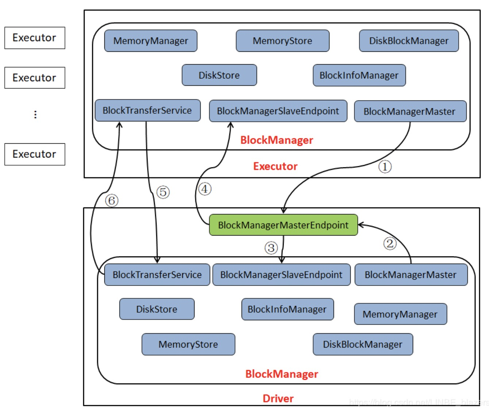

#  spark

## 1.Spark为什么快，Spark SQL 一定比 Hive 快吗

```text
1.消除了冗余的 HDFS 读写: Hadoop 每次 shuffle 操作后，必须写到磁盘，而 Spark 在 shuffle 后不一定落盘，可以 persist 到内存中，以便迭代时使用。如果操作复杂，很多的 shufle 操作，那么 Hadoop 的读写 IO 时间会大大增加，也是 Hive 更慢的主要原因了。

2.消除了冗余的 MapReduce 阶段: Hadoop 的 shuffle 操作一定连着完整的 MapReduce 操作，冗余繁琐。而 Spark 基于 RDD 提供了丰富的算子操作，且 reduce 操作产生 shuffle 数据，可以缓存在内存中。

3.JVM 的优化: Hadoop 每次 MapReduce 操作，启动一个 Task 便会启动一次 JVM，基于进程的操作。而 Spark 每次 MapReduce 操作是基于线程的，只在启动 Executor 是启动一次 JVM，内存的 Task 操作是在线程复用的。每次启动 JVM 的时间可能就需要几秒甚至十几秒，那么当 Task 多了，这个时间 Hadoop 不知道比 Spark 慢了多少。
```


## 2.hadoop shuffle、spark shuffle

**hadoop shuffle**


```text
map端 shuffle操作
1.input split数据到map任务
2.partitions，每个map task都有一个内存缓冲区，存储着map的输出结果;
3.spill，当缓冲区快满的时候需要将缓冲区的数据以临时文件的方式存放到磁盘;
4.merge，当整个map task结束后再对磁盘中这个map task产生的所有临时文件做合并，生成最终的正式输出文件，然后等待reduce task来拉数据。

reduce端 shuffle操作
reduce task在执行之前的工作就是不断地拉取当前job里每个map task的最终结果，然后对从不同地方拉取过来的数据不断地做merge，也最终形成一个文件作为reduce task的输入文件。
1.copy过程，拉取数据
2.merge过程，合并拉取来的小文件
3.reduce计算
4.output输出计算结果。
```


**spark shuffle**

包括：  `Shuffle Write `和 `Shuffle Read`


```text
窄依赖：父RDD中，每个分区内的数据，都只会被子RDD中特定的分区所消费，为窄依赖：

宽依赖：父RDD中，分区内的数据，会被子RDD内多个分区消费，则为宽依赖，宽依赖的时候会触发shuffle操作。
触发shuffle操作：
1.repartition相关： repartition、coalesce
2.ByKey操作：groupByKey、reduceByKey、combineByKey、aggregateByKey等
3.join操作：cogroup、join操作。

RDD作为数据结构，本质上是一个只读的分区记录集合，一个 RDD 可以包含多个分区，每个分区就是一个 dataset 片段。RDD 可以相互依赖。

失败恢复：窄依赖会更好一些，只需要恢复parent rdd.
```


**shuffle技术演进**

1.Hash Shuffle v1


按照hash方式重组partition数据，不进行排序，map task为每个reduce task都生成一个文件。会生成大量的文件，伴随大量的随机磁盘I/O操作与大量的内存开销。

严重问题：

```text
1.生成大量文件，占用文件描述符，同时引入 DiskObjectWriter 带来的 Writer Handler 的缓存也非常消耗内存；
2.如果在 Reduce Task 时需要合并操作的话，会把数据放在一个 HashMap 中进行合并，如果数据量较大，很容易引发 OOM。
```


2.Hash Shuffle v2

Spark 做了改进，引入了 File Consolidation 机制。

一个 Executor 上所有的 Map Task 生成的分区文件只有一份，即将所有的 Map Task 相同的分区文件合并，这样每个 Executor 上最多只生成 N 个分区文件。


3.Sort Shuffle v1

借鉴hadoop shuffle操作，引入基于排序的 shuffle 写操作机制。

1.task结果写入同一个文件，按partition id排序，每个 Partition 内部再按照 Key 进行排序，Map Task 运行期间会顺序写每个 Partition 的数据，同时生成一个索引文件记录每个 Partition 的大小和偏移量。

2.在 Reduce 阶段，Reduce Task 拉取数据做 Combine 时不再是采用 HashMap，而是采用ExternalAppendOnlyMap，该数据结构在做 Combine 时，如果内存不足，会刷写磁盘，很大程度的保证了鲁棒性，避免大数据情况下的 OOM。


4.Tungsten-Sort Based Shuffle（钨丝）

1.将数据记录用二进制的方式存储，直接在序列化的二进制数据上 Sort 而不是在 Java 对象上，这样一方面可以减少内存的使用和 GC 的开销，另一方面避免 Shuffle 过程中频繁的序列化以及反序列化。

2.在排序过程中，它提供 cache-efficient sorter，使用一个 8 bytes 的指针，把排序转化成了一个指针数组的排序，极大的优化了排序性能。

注意：

Shuffle 阶段不能有 aggregate 操作，分区数不能超过一定大小（2^24-1，这是可编码的最大 Parition Id），所以像 reduceByKey 这类有 aggregate 操作的算子是不能使用 Tungsten-Sort Based Shuffle，它会退化采用 Sort Shuffle。


5.Sort Shuffle v2

从 Spark-1.6.0 开始，把 Sort Shuffle 和 Tungsten-Sort Based Shuffle 全部统一到 Sort Shuffle 中，如果检测到满足 Tungsten-Sort Based Shuffle 条件会自动采用 Tungsten-Sort Based Shuffle，否则采用 Sort Shuffle。从Spark-2.0.0开始，Spark 把 Hash Shuffle 移除，可以说目前 Spark-2.0 中只有一种 Shuffle，即为 Sort Shuffle。


```text
1.Parent Stage需要等ShuffleMapTasks都执行完才能fetch
2.获取的数据存放：
刚获取来的 FileSegment 存放在 softBuffer 缓冲区，经过处理后的数据放在内存 + 磁盘上。

内存使用的是AppendOnlyMap ，类似 Java 的HashMap

内存＋磁盘使用的是ExternalAppendOnlyMap，如果内存空间不足时，ExternalAppendOnlyMap可以将 records 进行 sort 后 spill（溢出）到磁盘上，等到需要它们的时候再进行归并。

3.怎么获得数据的存放位置？
通过请求 Driver 端的 MapOutputTrackerMaster 询问 ShuffleMapTask 输出的数据位置。
```


**Shuffle优化**

shuffle涉及CPU(序列化反序列化)、网络 I/O（跨节点数据传输）以及磁盘 I/O（shuffle中间结果落地）的操作。

```scala
1.减少shuffle次数

// 两次shuffle
rdd.map(...).repartition(1000).reduceByKey(_ + _, 3000)
 
// 一次shuffle
rdd.map(...).repartition(3000).reduceByKey(_ + _)

2.必要时主动 Shuffle，通常用于改变并行度，提高后续分布式运行速度
rdd.repartiton(largerNumPartition).map(...)...

3.使用 treeReduce & treeAggregate 替换 reduce & aggregate。数据量较大时，reduce & aggregate 一次性聚合，Shuffle 量太大，而 treeReduce & treeAggregate 是分批聚合，更为保险。
```


## 3.spark session 与spark context


SparkSession内部封装了SparkContext，是SparkContext、StreamingContext、SqlContext、HiveContext

```text
1.创建和操作RDD时，使用SparkContext
2.使用Streaming时，使用StreamingContext
3.使用SQL时，使用SqlContext
4.使用Hive时，使用HiveContext
```


所以计算实际上是由SparkContext完成的。

Spark集群采用主从架构，Driver节点负责中央协调，调度各个分布式工作节点。

工作节点称为Executor节点，驱动器节点可以和大量的执行器节点通信，它们都作为独立进程运行。


**SparkContext是Spark中Driver程序的一部分**，向资源管理器cluster manager（可以是mesos、yarn、standalone）申请spark应用所需的资源executor，资源管理器在各个worker上分配一定的executor。


## 4.spark运行流程

```text
1.用户通过spark-submit脚本提交应用
2.spark-submit脚本启动Driver，调用用户定义的main()方法
3.Driver与Cluster Manager通信，申请资源启动Executor节点
4.Cluster Manager为Driver启动Executor节点
5.Driver执行用户应用中的操作，根据程序定义中对RDD的转换操作和行动操作，Driver把工作以Task的形式发送到Executor中执行；
6.任务在Executor中进行计算并保存结果
7.如果Driver中的main()方法退出、或者调用了SparkConetxt.stop()，那么Driver会终止Executor进程，通过Cluster Manager 释放资源。
```


## 5.spark rdd dataframe dataset

```text
都有惰性机制。

RDD是分布在集群中许多机器上的数据元素的分布式集合。 RDD是一组表示数据的Java或Scala对象。

DataFrame是命名列构成的分布式数据集合。 它在概念上类似于关系数据库中的表。
除了数据之外，还记录数据的结构信息，即schema。
性能比RDD性能更高。查询机会通过spark catalyst optimiser优化。
例如：
rdd版
rdd1.join(rdd2).filter(lambda x: x==1)
df版
df1.filter(df1.num==1).join(df2.filter(df2.num==1))

DataSet是DataFrame API的扩展，提供RDD API的类型安全，面向对象的编程接口以及Catalyst查询优化器的性能优势和DataFrame API的堆外存储机制的功能。
```

RDD+schema=DataFrame+类、对象 = DataSet


rdd dataframe 互转：

```python
将RDD转换成dataframe的方法：
spark.createDataFrame(rdds,colname_list)

将dataFrame转换成RDD的方法
df.rdd
```

  

## 6.spark常说的Repartition 有什么作用

```text
1.避免小文件
2.减少 Task 个数
3.但是会增加每个 Task 处理的数据量，Task 运行时间可能会增加
```


## 7.Spark Streaming

使用离散流（Discretized Stream）Dstream。

Dstream支持两种操作：

```text
一种是转换（Transformation）操作，会生成一个新的Dstream，算子如：map、filter。惰性，只记住了这些应用到基础数据集上的转换动作，只有当发生一个要求返回结果给 Driver 的 Action 时，这些 Transformation 才会真正运行。

一种是输出(Action)操作，把数据写入外部系统。算子如：count、first
```


## 8.spark 数据倾斜

指shuffle过程中，必须将各个节点上相同key拉取到某个节点上的一个task来进行处理，此时如果某个key对应的数据特别大的话，就会发生数据倾斜。


解决方案：

```text
1.过滤少数导致倾斜的key 单拎出来或者直接过滤掉
2.提高shuffle read task并行度，让每个task处理数据比原来少
```


```text
3.两阶段聚合(局部聚合+全部聚合)
使用场景：对RDD执行reduceByKey等聚合类shuffle算子或者在Spark SQL中使用group by语句进行分组聚合时，比较适用这种方案。如果是join类的shuffle操作，还得用其他的解决方案。

实现方法:将原本相同的key通过附加随机前缀的方式，变成多个不同的key，就可以让原本被一个task处理的数据分散到多个task上去做局部聚合，进而解决单个task处理数据量过多的问题。接着去除掉随机前缀，再次进行全局聚合，就可以得到最终的结果。
```


```text
4.将reduce join转为map join
  使用场景：join类操作，存在小表join大表,可以将小表进行广播从而避免shuffle

5.采样倾斜key并分拆join操作
  使用场景：适用于join类操作中，由于相同key过大占内存，不能使用广播方案，但倾斜key的种数不是很多的场景。
  过滤倾斜key生成RDD --> key打上n以内的随机数作为前缀 --> 取出需要join的RDD，这个RDD扩充n倍 --> 之后正常join即可。
```


## 9.RDD术语

DAGScheduler：实现将Spark作业分解成一到多个Stage，每个Stage根据RDD的Partition个数决定Task的个数，然后生成相应的Task set放到TaskScheduler中。


TaskScheduler：实现Task分配到Executor上执行。


Task：运行在Executor上的工作单元。


Job：SparkContext提交的具体Action操作，常和Action对应。


Stage：每个Job会被拆分很多组任务(task)，每组任务被称为Stage，也称TaskSet。


RDD：Resilient Distributed Datasets的简称，弹性分布式数据集，是Spark最核心的模块和类。


Transformation/Action：SparkAPI的两种类型;Transformation返回值还是一个RDD，Action返回值不少一个RDD，而是一个Scala的集合;所有的Transformation都是采用的懒策略，如果只是将Transformation提交是不会执行计算的，计算只有在Action被提交时才会被触发。


## 10.kafka与spark streaming的整合

1.利用接收器Receiver的方式接受数据

`KafkaUtils.createStream()`方法创建一个DStream对象，不关注消费位移的处理。开启WAL(Write Ahead Logs)保证数据可靠性。只有收到的数据被持久化到WAL之后才会更新Kafka中的消费位移。

可能会出现重复消费的问题：保存到WAL中但是还没消费完。


2.直接从kafka中读取数据

`KafkaUtils.createDirectStream()`方法创建一个DStream对象，RDD分区与Kafka分区对应。

通过定期扫描所订阅的Kafka每个主题的每个分区的最新偏移量以确定当前批量批处理数据便宜范围。

通过检查点机制处理消费位移，可以保证Kafka中的数据会被Spark拉取一次。


## 11.RDD 如何通过记录更新的方式容错

RDD 的容错机制实现分布式数据集容错方法有两种: 1. 数据检查点 2. 记录更新。

RDD 采用记录更新的方式：记录所有更新点的成本很高。所以，RDD只支持粗颗粒变换，即只记录单个块（分区）上执行的单个操作，然后创建某个 RDD 的变换序列（血统 lineage）存储下来；变换序列指，每个 RDD 都包含了它是如何由其他 RDD 变换过来的以及如何重建某一块数据的信息。因此 RDD 的容错机制又称“血统”容错。


## 12.MapReduce与Spark区别

```text
1.基本原理上：（1） MapReduce：基于磁盘的大数据批量处理系统 （2）Spark：基于RDD(弹性分布式数据集)数据处理，显示将RDD数据存储到磁盘和内存中。

2.模型上：（1） MapReduce可以处理超大规模的数据，适合日志分析挖掘等较少的迭代的长任务需求，结合了数据的分布式的计算。（2） Spark：适合数据的挖掘，机器学习等多轮迭代式计算任务。
```


## 13.checkpoint机制

spark加checkoutpoint的原因：

```text
1.DAG中的Lineage过长，如果重算，则开销太大（如在PageRank中）。
2.在宽依赖上做Checkpoint获得的收益更大。
```


## 14.解释一下 groupByKey, reduceByKey 还有 reduceByKeyLocally

```text
1.groupByKey
def groupByKey(): RDD[(K, Iterable[V])]
def groupByKey(numPartitions: Int): RDD[(K, Iterable[V])]
def groupByKey(partitioner: Partitioner): RDD[(K, Iterable[V])]
该函数用于将RDD[K,V]中每个K对应的V值，合并到一个集合Iterable[V]中。
是按照key进行分组，直接进行shuffle。

2.reduceByKey
def reduceByKey(func: (V, V) => V): RDD[(K, V)]
def reduceByKey(func: (V, V) => V, numPartitions: Int): RDD[(K, V)]
def reduceByKey(partitioner: Partitioner, func: (V, V) => V): RDD[(K, V)]
该函数用于将RDD[K,V]中每个K对应的V值根据映射函数来运算。在shuffle之前有combine(预聚合)操作，返回结果是RDD[k,v]

3.reduceByKeyLocally
def reduceByKeyLocally(func: (V, V) => V): Map[K, V]
该函数将RDD[K,V]中每个K对应的V值根据映射函数来运算，运算结果映射到一个Map[K,V]中，而不是RDD[K,V]。
```


## 15.cache和persist的区别

存储级别：

```text
MEMORY_ONLY : 将 RDD 以反序列化 Java 对象的形式存储在 JVM 中。如果内存空间不够，部分数据分区将不再缓存，在每次需要用到这些数据时重新进行计算。这是默认的级别。
MEMORY_AND_DISK : 将 RDD 以反序列化 Java 对象的形式存储在 JVM 中。如果内存空间不够，将未缓存的数据分区存储到磁盘，在需要使用这些分区时从磁盘读取。
```

1.RDD中cache和persist

```scala
/**
 * Persist this RDD with the default storage level (`MEMORY_ONLY`).
 */
def cache(): this.type = persist()

/**
 * Persist this RDD with the default storage level (`MEMORY_ONLY`).
*/
def persist(): this.type = persist(StorageLevel.MEMORY_ONLY)
```

cache()是persist()的简化方式，调用persist的无参版本，也就是调用persist(StorageLevel.MEMORY_ONLY)，cache只有一个默认的缓存级别MEMORY_ONLY，即将数据持久化到内存中，而persist可以通过传递一个 StorageLevel 对象来设置缓存的存储级别。


2.DataFrame中cache和persist

```scala
/**
 * Persist this Dataset with the default storage level (`MEMORY_AND_DISK`).
 *
 * @group basic
 * @since 1.6.0
 */
def cache(): this.type = persist()

/**
 * Persist this Dataset with the default storage level (`MEMORY_AND_DISK`).
 *
 * @group basic
 * @since 1.6.0
 */
def persist(): this.type = {
  sparkSession.sharedState.cacheManager.cacheQuery(this)
  this
}

/**
 * Persist this Dataset with the given storage level.
 * @param newLevel One of: `MEMORY_ONLY`, `MEMORY_AND_DISK`, `MEMORY_ONLY_SER`,
 *                 `MEMORY_AND_DISK_SER`, `DISK_ONLY`, `MEMORY_ONLY_2`,
 *                 `MEMORY_AND_DISK_2`, etc.
 *
 * @group basic
 * @since 1.6.0
 */
def persist(newLevel: StorageLevel): this.type = {
  sparkSession.sharedState.cacheManager.cacheQuery(this, None, newLevel)
  this
}

def cacheQuery(
    query: Dataset[_],
    tableName: Option[String] = None,
    storageLevel: StorageLevel = MEMORY_AND_DISK): Unit = writeLock
```

可以到cache()依然调用的persist()，但是persist调用cacheQuery，而cacheQuery的默认存储级别为MEMORY_AND_DISK。


必须在transformation或者textfile等创建一个rdd之后，直接连续调用cache()或者persist()才可以，如果先创建一个rdd,再单独另起一行执行cache()或者persist()，是没有用的，而且会报错，大量的文件会丢失。


## 16.Spark提供的两种变量

```text
1.广播变量，是一个只读对象，在所有节点上都有一份缓存，创建方法是 SparkContext.broadcast()。创建之后再更新它的值是没有意义的，一般用 val 来修改定义。

2.计数器，只能增加，可以用计数或求和，支持自定义类型。创建方法是 SparkContext.accumulator(V, name)。只有 Driver 程序可以读这个计算器的变量，RDD 操作中读取计数器变量是无意义的。
```


## 17.Spark的高可用和容错

集群环境的高可用

容错

```text
1.Driver进程宕机
重启服务，SparkStreaming中重启spark应用后，可用checkoutDir进行job数据恢复

2.Executor进程宕机
Worker节点重启Executor进程，Driver重新分配任务

3.Task执行失败
spark.task.maxFailuers(default:4) 进行重试
RDD容错机制，Leneage(血统)机制，记录Transformation行为
如果RDD Leneage过长，可以用checkpoint检查点或cache缓存将数据冗余的保存下来。
```


## 18.spark存储体系




## 19.spark一些常见操作

1.wordcount

```python
from pyspark import SparkContext
import time

sc = SparkContext('local', 'test')

rdd1 = sc.textFile('./data/data.txt') \
      .flatMap(lambda x:x.split(" ")) \
      .map(lambda x:(x,1)) \
      .reduceByKey(lambda a,b:a+b)

rdd2 = sc.parallelize(['crazy','is','smart'])
rdd2_set = sc.parallelize(['crazy','is','smart']).map(lambda x:(x,1))

# 比较两个rdd相同的部分
# cogroup形式
start1 = time.time()
print(rdd1.cogroup(rdd2_set).filter(lambda x:x[1][0] and x[1][1]).map(lambda x:(x[0], list(x[1][0])[0])).collect())
print('time costs:',time.time()-start1)
# broadcast形式
start2 = time.time()
bcast = sc.broadcast(rdd2.collect())
print(rdd1.filter(lambda fields: fields[0] in bcast.value).collect())
print('time costs:',time.time()-start2)
# join形式
start3 = time.time()
print(rdd1.join(rdd2_set).map(lambda x:(x[0],x[1][0])).collect())
print('time costs:',time.time()-start3)

# output
[('crazy', 3), ('is', 3), ('smart', 2)]
time costs: 1.150989055633545
    
[('crazy', 3), ('is', 3), ('smart', 2)]
time costs: 0.13089585304260254
    
[('crazy', 3), ('is', 3), ('smart', 2)]
time costs: 0.11601901054382324
```


2.top-n问题

```python
from pyspark import SparkContext

sc = SparkContext('local','test')

nums = [10, 1, 2, 9, 3, 4, 5, 6, 7]
kv = [(10,"z1"), (1,"z2"), (2,"z3"), (9,"z4"), (3,"z5"), (4,"z6"), (5,"z7"), (6,"z8"), (7,"z9")]

#  top 3 min
print(sc.parallelize(nums).takeOrdered(3))
print(sc.parallelize(kv).takeOrdered(3))

# top 3 max
print(sc.parallelize(nums).takeOrdered(3,key=lambda x:-x))
print(sc.parallelize(kv).takeOrdered(3,key=lambda x:-x[0]))

#output
[1, 2, 3]
[(1, 'z2'), (2, 'z3'), (3, 'z5')]
[10, 9, 7]
[(10, 'z1'), (9, 'z4'), (7, 'z9')]
```


3.sum

```python
from pyspark import SparkContext

sc = SparkContext('local', 'test')
rdd = sc.parallelize(range(100))

# sum方法
print(rdd.sum())

# fold方法
print(rdd.fold(0, (lambda x, y: x + y)))
```


4.average

```python
from pyspark import SparkContext
from pyspark.sql import SparkSession
from pyspark.sql.functions import *


sc = SparkContext('local','test')
nums = sc.parallelize([1, 2, 2, 3, 4, 5, 6, 7, 8, 20])

# fold方法
sumAndCount = nums.map(lambda x: (x, 1)).fold((0, 0), (lambda x, y: (x[0] + y[0], x[1] + y[1])))
print('avrage:',float(sumAndCount[0]) / float(sumAndCount[1]))

# df
spark = SparkSession.builder \
    .master("local") \
    .appName("Word Count") \
    .config("spark.some.config.option", "some-value") \
    .getOrCreate()


rdd = nums.map(lambda x:(x,1))
df = spark.createDataFrame(rdd,["age","id"]).agg({"age":"avg"}).collect()
print(df)
```

