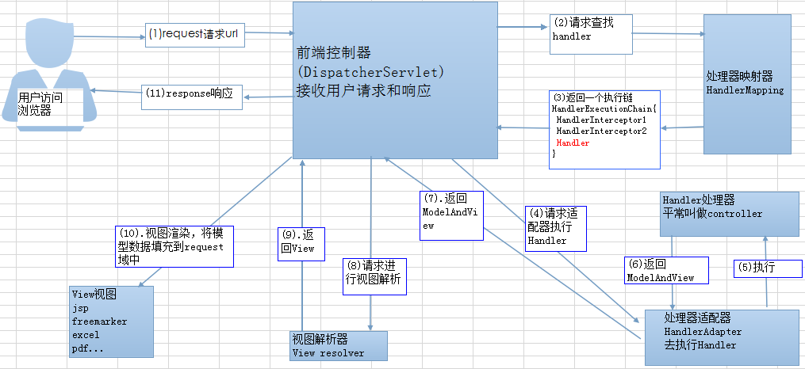
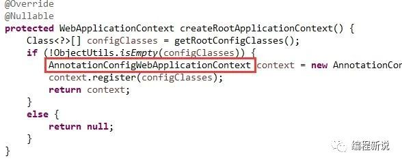
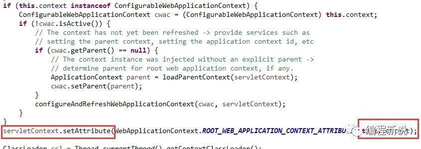
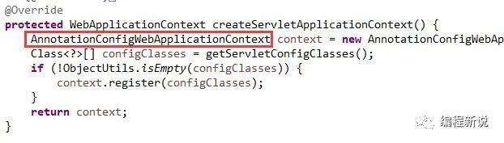
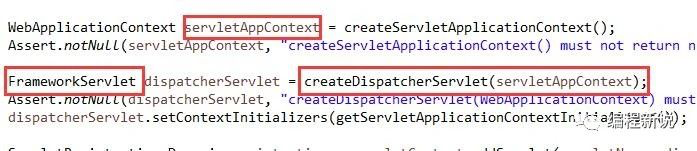
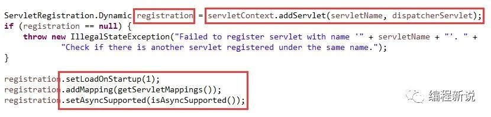
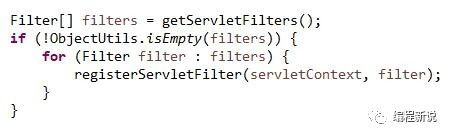
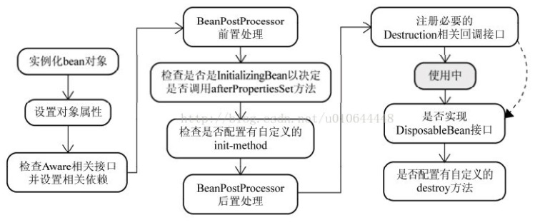
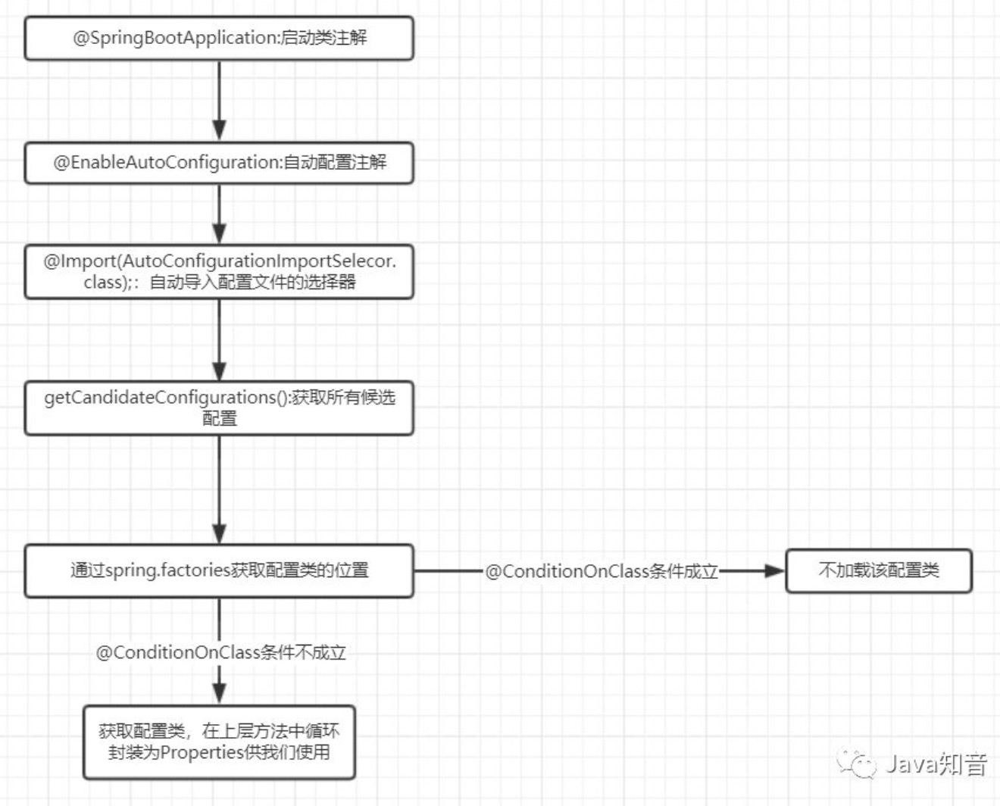

## 1、Spring

Spring是一种轻量级开发框架，由很多模块的集合。主要模块包括：核心容器、AOP、Web等。

核心容器是提供IOC依赖注入的基础；AOP是提供面向切面编程的实现。

`BeanPostProcessor`接口：

```text
Factory hook that allows for custom modification of new bean instances, e.g. checking for marker interfaces or wrapping them with proxies.   

一个工厂钩子，允许对工厂中的bean实例进行自定义修改，比如标记接口或使用代理类包装bean。

# 接口方法
public interface BeanPostProcessor {
  
    public Object postProcessBeforeInitialization(Object bean, String beanName) throws BeansException;
    
    public Object postProcessAfterInitialization(Object bean, String beanName) throws BeansException;
  
}
```


## 2、谈谈自己对于Spring IOC和AOP的理解

IOC：Inverse of Control，控制反转，就是将原本在程序中手动创建对象的控制权，交由Spring框架来管理。

在没有Spring IOC的时候，最开始： tomcat --> servlet，可能几十个地方都调用了具体实现类，各种类耦合在一起，如果不想用这个实现类，改动、测试代码成本太高。

现在引入IOC容器之后，只需要配置好配置文件/注解即可，完全不用考虑对象是如何被创建出来的。`Resource`。

**Bean工厂**

```text
BeanFactory
ApplicationContext
```

**Bean生命周期**

```text
1.BeanDefinitionReader读取Resource所指向的配置文件资源，然后解析配置文件

2.配置文件中每一个<bean>解析成一个BeanDefinition对象，保存到BeanDefinitionRegistry中
(注解也是类似的)

3.容器扫描BeanDefinitionRegistry中的BeanDefinition

4.调用InstantiationStrategy进行Bean实例化的工作

5.使用BeanWrapper完成Bean属性的设置工作
```

生命周期简要版：

```text
1.实例化 Instantiation
2.属性赋值 Populate
3.初始化 Initialization
4.销毁 Destruction
```

AOP：面向切面编程。能够将那些与业务无关，却为业务模块所共同调用的逻辑或责任（例如事务处理、日志管理、权限控制等）封装起来，便于减少系统的重复代码，降低模块间的耦合度，并有利于未来的可扩展性和可维护性。

Spring AOP基于动态代理。

```text
1.如果要代理的对象，实现了某个接口，这时候可以用JDK Proxy.

2.如果要代理的对象，没有实现接口，这时候需要CGLibL.CGLib采用了非常底层的字节码技术，其原理是通过字节码技术为一个类创建子类，并在子类中采用方法拦截的技术拦截所有父类方法的调用，顺势织入横切逻辑。
```

## 3、Spring AOP 和 AspectJ AOP 有什么区别？

**Spring AOP 属于运行时增强，而 AspectJ 是编译时增强。**

`Spring`对`AOP`的支持

```text
1.基于代理的经典SpringAOP:需要实现接口，手动创建代理
2.纯POJO切面：使用XML配置，AOP命名空间
3.@AspectJ注解驱动的切面：使用注解的方式，最简洁、方便
```


## 4、Spring 中的 bean 的作用域有哪些?

- singleton : 唯一 bean 实例，Spring 中的 bean 默认都是单例的。
- prototype : 每次请求都会创建一个新的 bean 实例。
- request : 每一次HTTP请求都会产生一个新的bean，该bean仅在当前HTTP request内有效。
- session : 每一次HTTP请求都会产生一个新的bean，该bean仅在当前 HTTP session 内有效。
- global-session：全局session作用域，仅仅在基于portlet的web应用中才有意义，Spring5已经没有了。Portlet是能够生成语义代码(例如：HTML)片段的小型Java Web插件。它们基于portlet容器，可以像servlet一样处理HTTP请求。但是，与 servlet 不同，每个 portlet 都有不同的会话


## 5、Spring中的单例bean的线程安全问题

单例 bean 存在线程问题，主要是因为当多个线程操作同一个对象的时候，对这个对象的非静态成员变量的写操作会存在线程安全问题。

常见解决方案：

```text
1.在Bean对象中尽量避免定义可变的成员变量(不太现实)

2.在类中定义一个ThreadLocal成员变量，将需要的可变成员变量保存在ThreadLocal中(推荐的一种方式)
```


## 6、说说自己对于Spring MVC了解？

之前没有Spring MVC时候，开发Java WEB使用的是`Java Bean(Model) + JSP(View)+Servlet(Controller)`这种开发模式。

Model:系统涉及的数据，也就是 dao 和 bean。View：展示模型中的数据，只是用来展示。Controller：处理用户请求都发送给 ，返回数据给 JSP 并展示给用户。

这种模式下抽象和封装程度还远远不够，可能会重复造轮子，降低了程序的可维护性和复用性。

MVC是一种设计模式，一般把后端项目分为:

```text
Service层(处理业务)、Dao层(数据库操作)、Entity实体类(实体类)、Controller层(控制层，返回数据给前台页面)。
```

原理：



步骤：

```text
1.客户端发送请求，直接请求到DispatcherServlet,DispatcherServlet的作用是接受请求，响应请求。

2.DispatcherServlet 根据请求信息调用 HandlerMapping，解析请求对应的 Handler。

3.HandlerAdapter 会根据 Handler来调用真正的处理器来处理请求，并处理相应的业务逻辑。

4.处理器处理完业务后，会返回一个 ModelAndView 对象，Model 是返回的数据对象，View 是个逻辑上的 View。

5.ViewResolver 会根据逻辑 View 查找实际的 View。

6.DispaterServlet 把返回的 Model 传给 View（视图渲染）。

7.把 View 返回给请求者（浏览器）
```

**优缺点**

```text
优点：
1.分层各不干扰
2.有利于开发分工
3.有利于组件的重用

缺点：
1.增加了系统结构和实现的复杂性。简单模型不需要
2.视图与控制器之间过于紧密的联系，妨碍各自的独立重用(现在可以直接返回json了，实现前后端分离)
```


### 6.1 Spring MVC 启动过程

1.创建根容器

基于注解的容器类



2.将根容器放入`ServletContext`中，`ServletContext`在应用期间一直存在



3.创建`Servlet`容器，容器类也是基于注解的



4.使用`Servlet`容器创建核心`Servlet:DispatcherServlet`



5.把核心`Servlet`注册到`ServletContext`中



6.注册一些过滤器




## 7、Spring框架中用到了哪些设计模式？

- **工厂设计模式** : Spring使用工厂模式通过 `BeanFactory`、`ApplicationContext` 创建 bean 对象。
- **代理设计模式** : Spring AOP 功能的实现。
- **单例设计模式** : Spring 中的 Bean 默认都是单例的。
- **模板方法模式** : Spring 中 `jdbcTemplate`、`hibernateTemplate` 等以 Template 结尾的对数据库操作的类，它们就使用到了模板模式。
- **包装器设计模式** : 我们的项目需要连接多个数据库，而且不同的客户在每次访问中根据需要会去访问不同的数据库。这种模式让我们可以根据客户的需求能够动态切换不同的数据源。
- **观察者模式:** Spring 事件驱动模型就是观察者模式很经典的一个应用。
- **适配器模式** :Spring AOP 的增强或通知(Advice)使用到了适配器模式、spring MVC 中也是用到了适配器模式适配`Controller`。


## 8、@Component 和 @Bean 的区别是什么？

```text
1.作用对象不同: @Component 注解作用于类，而@Bean注解作用于方法。

2.@Component通常是通过类路径扫描来自动侦测以及自动装配到Spring容器中（我们可以使用 @ComponentScan 注解定义要扫描的路径从中找出标识了需要装配的类自动装配到 Spring 的 bean 容器中）。@Bean 注解通常是我们在标有该注解的方法中定义产生这个 bean,@Bean告诉了Spring这是某个类的示例，当我需要用它的时候还给我。

3.@Bean 注解比 Component 注解的自定义性更强，而且很多地方我们只能通过 @Bean 注解来注册bean。比如当我们引用第三方库中的类需要装配到 Spring容器时，则只能通过 @Bean来实现。
```

@Bean

```java
@Configuration
public class AppConfig {
    @Bean
    public TransferService transferService() {
        return new TransferServiceImpl();
    }

}

相当于xml配置：
<beans>
    <bean id="transferService" class="com.acme.TransferServiceImpl"/>
</beans>

下面这个不能通过@Component无法实现。
@Bean
public OneService getService(status) {
    case (status)  {
        when 1:
                return new serviceImpl1();
        when 2:
                return new serviceImpl2();
        when 3:
                return new serviceImpl3();
    }
}
```


## 9、将一个类声明为Spring的 bean 的注解有哪些?

我们一般使用 `@Autowired` 注解自动装配 bean，要想把类标识成可用于 `@Autowired` 注解自动装配的 bean 的类,采用以下注解可实现：

```text
@Component ：通用的注解，可标注任意类为 Spring 组件。如果一个Bean不知道属于哪个层，可以使用@Component 注解标注。

@Repository : 对应持久层即 Dao 层，主要用于数据库相关操作。

@Service : 对应服务层，主要涉及一些复杂的逻辑，需要用到 Dao层。

@Controller : 对应 Spring MVC 控制层，主要用户接受用户请求并调用 Service 层返回数据给前端页面。
```

**@Autowired注解原理分析**

```text
1.调用AutowiredAnnotationBeanPostProcessor，实现后置处理器的作用，来创建属性的实例
1）实现InstantiationAwareBeanPostProcessor，就具备了实例化前后(而不是初始化前后)管理对象的能力
2）实现了BeanPostProcessor，具有初始化前后管理对象的能力
3）实现BeanFactoryAware，具备随时拿到BeanFactory的能力

2.再利用反射机制，将实例化好的属性，赋值给对象上
```

## 10、Spring 管理事务的方式有几种？

```text
1.编程式事务，在代码中硬编码。(不推荐使用)

2.声明式事务，在配置文件中配置（推荐使用）
基于xml或注解的声明式事务
```


## 11、Spring 事务中的隔离级别有哪几种?

- **TransactionDefinition.ISOLATION_DEFAULT:** 使用后端数据库默认的隔离级别，Mysql 默认采用的 REPEATABLE_READ隔离级别 Oracle 默认采用的 READ_COMMITTED隔离级别.
- **TransactionDefinition.ISOLATION_READ_UNCOMMITTED:** 最低的隔离级别，允许读取尚未提交的数据变更，**可能会导致脏读、幻读或不可重复读**
- **TransactionDefinition.ISOLATION_READ_COMMITTED:** 允许读取并发事务已经提交的数据，**可以阻止脏读，但是幻读或不可重复读仍有可能发生**
- **TransactionDefinition.ISOLATION_REPEATABLE_READ:** 对同一字段的多次读取结果都是一致的，除非数据是被本身事务自己所修改，**可以阻止脏读和不可重复读，但幻读仍有可能发生。**
- **TransactionDefinition.ISOLATION_SERIALIZABLE:** 最高的隔离级别，完全服从ACID的隔离级别。所有的事务依次逐个执行，这样事务之间就完全不可能产生干扰，也就是说，**该级别可以防止脏读、不可重复读以及幻读**。但是这将严重影响程序的性能。通常情况下也不会用到该级别


## 12、Spring 事务中哪几种事务传播行为?

事务原理：

动态代理对所有需要事务管理的Bean进行加载，并根据配置在invoke方法中对当前调用的方法名进行判定，并在method.invoke方法前后为其加上合适的事务管理代码，这样就实现了Spring式的事务管理。

```text
1.事务拦截的对象是TransactionInterceptor，可以看出它继承了TransactionAspectSupport. TransactionAspectSupport内部是真正的操作部分。

2.Spring事务中有几个对象：
1）PlatformTransactionManager 事务管理器，它只包含三个方法。获取事务，回顾事务，提交事务
2）TransactionDefinition 定义事务的类型，事务包含很多属性，是否可读，事务隔离级别,事务传播级别。通过事务的定义，我们根据定义获取特定的事务。
3）TransactionStatus 代表一个事务运行的状态，事务管理器通过状态可以知道事务的状态信息，然后进行事务的控制。事务是否完成，是否是新的事务，是不是只能回滚等。
```

**事务处理逻辑：**

```text
1.首先获取我们定义的事务属性，可能是定义在XML中，也可能是定义在注解上，总之我们是能获取到定义的事务属性的。
2.根据定义的事务属性获取PlatformTransactionManager，然后获取加入点的标识
3.事务处理逻辑：
1）判断要不要新建事务
2）执行事务内的代码，一般是程序代码
3）失败了执行回滚事务
4）如果没抛出异常提交事务，创建事务后返回的对象是TransactionInfo对象,包含：事务管理器、定义的事务属性、切入点标识、事务状态、上一个事务状态。
```

**支持当前事务的情况：**

- **TransactionDefinition.PROPAGATION_REQUIRED：** 如果当前存在事务，则加入该事务；如果当前没有事务，则创建一个新的事务。
- **TransactionDefinition.PROPAGATION_SUPPORTS：** 如果当前存在事务，则加入该事务；如果当前没有事务，则以非事务的方式继续运行。
- **TransactionDefinition.PROPAGATION_MANDATORY：** 如果当前存在事务，则加入该事务；如果当前没有事务，则抛出异常。（mandatory：强制性）

**不支持当前事务的情况：**

- **TransactionDefinition.PROPAGATION_REQUIRES_NEW：** 创建一个新的事务，如果当前存在事务，则把当前事务挂起。
- **TransactionDefinition.PROPAGATION_NOT_SUPPORTED：** 以非事务方式运行，如果当前存在事务，则把当前事务挂起。
- **TransactionDefinition.PROPAGATION_NEVER：** 以非事务方式运行，如果当前存在事务，则抛出异常。

**其他情况：**

- **TransactionDefinition.PROPAGATION_NESTED：** 如果当前存在事务，则创建一个事务作为当前事务的嵌套事务来运行；如果当前没有事务，则该取值等价于TransactionDefinition.PROPAGATION_REQUIRED。


## 13、@Transactional(rollbackFor = Exception.class)注解了解吗？

在`@Transactional`注解中如果不配置`rollbackFor`属性,那么事物只会在遇到`RuntimeException`的时候才会回滚,加上`rollbackFor=Exception.class`,可以让事物在遇到非运行时异常时也回滚。


## 14、如何使用JPA在数据库中非持久化一个字段？

```java
Entity(name="USER")
public class User {

    @Id
    @GeneratedValue(strategy = GenerationType.AUTO)
    @Column(name = "ID")
    private Long id;

    @Column(name="USER_NAME")
    private String userName;

    @Column(name="PASSWORD")
    private String password;

    private String secrect;

}

# secret这个字段不被持久化，也就是不被数据库存储，可以有的方案：

static String transient1; // not persistent because of static
final String transient2 = “Satish”; // not persistent because of final
transient String transient3; // not persistent because of transient
@Transient
String transient4; // not persistent because of @Transient
```


## 15、Spring bean生命周期

```text
1.实例化 
2.属性赋值
3.初始化
4.销毁
```


## 16、Spring循环依赖

2个或以上`bean`互相持有对方，最会形成闭环。

在`Spring`中，对象的实例化是通过反射实现的，而对象的属性则是在对象实例化之后通过一定的方式设置的。

```java
@Component
public class A {
    private B b;
    public void setB(B b) {
        this.b = b;
    }
}

@Component
public class B {
    private A a;
    public void setA(A a) {
        this.a = a;
    }
}

// 1.首先Spring尝试通过ApplicationContext.getBean()方法获取A对象的实例，容器中还没有A对象实例，因而其会创建一个A对象
// 2.发现其依赖B对象，则会尝试递归的通过ApplicationContext.getBean()方法获取B对象实例，容器没有则创建
// 3.此时A对象的属性a和B对象的属性b还没有设置进去
// 4.创建B对象之后，Spring发现B对象依赖了属性A，尝试递归获取A对象实例，此时可以返回(虽然属性b还没初始化)
// 5.B对象属性a设置进去了
// 6.然后A中尝试获取B对象实例，此时属性b也可以被设置进去
```


解决方案：

1.不要用构造器依赖

```text
<bean id="a" class="com.zfx.student.A">  
    <constructor-arg index="0" ref="b"></constructor-arg>  
</bean>  
<bean id="b" class="com.zfx.student.B">  
    <constructor-arg index="0" ref="a"></constructor-arg>  
</bean>  

```

对象还在创建中，没有实例返回。

2.可以用字段/setter注入，这种方式都是先初始化了实例再填充字段。

字段注入：

```text
@Autowired (在使用了@ComponentScan之后简化的注入方式，本质上还是setter)
@Resource
```

`setter`注入

```text
<bean id="a" class="com.zfx.student.A" scope="singleton"> 
 <property name="studentB" ref="b"></property> 
</bean> 
<bean id="b" class="com.zfx.student.B" scope="singleton"> 
 <property name="studentA" ref="a"></property> 
</bean> 
```



单例对象实例化存储在一个`Map`中，并且`Spring`提供了获取这个未设置属性的实例化对象引用的方法。


## 17、SpringBoot自动装配原理

`SpringBoot`特点：

```text
1.基本不用配置xml，这种零配置的做法减轻了开发人员很多的工作量，可以让开发人员一心扑在业务逻辑的设计上，使项目的逻辑更加完善。

2.采用了JavaConfig的配置风格，导入组件的方式也由原来的直接配置改为@EnableXXXX，这种纯Java代码的配置和导入组件的方式，使代码看上去更加的优雅
```

之所以能简化配置：两种设计策略：**开箱即用和约定大于配置**。

```text
1.开箱即用：在开发过程中，通过maven项目的pom文件中添加相关依赖包，然后通过相应的注解来代替繁琐的XML配置以管理对象的生命周期。

2.约定大于配置：由SpringBoot本身来配置目标结构，由开发者在结构中添加信息的软件设计范式。
```

1.开箱即用

```java
//@SpringBootApplication 标注，是一个SpringBoot应用
@SpringBootApplication
public class SpringbootdemoApplication {
    public static void main(String[] args) {
        SpringApplication.run(SpringbootdemoApplication.class, args);
    }
}

// @SpringBootApplication是一个组合注解
@SpringBootConfiguration//核心
@EnableAutoConfiguration//核心
@ComponentScan(excludeFilters = { @Filter(type = FilterType.CUSTOM, classes = TypeExcludeFilter.class),
        @Filter(type = FilterType.CUSTOM, classes = AutoConfigurationExcludeFilter.class) })


// 1.@SpringBootConfiguration，核心是Configuration，是Spring的配置类
@Target(ElementType.TYPE)
@Retention(RetentionPolicy.RUNTIME)
@Documented
@Configuration
public @interface SpringBootConfiguration {
}

// 2.@EnableAutoConfiguration，目的是为了将启动类所需的所有资源导入
@AutoConfigurationPackage //自动配置包
@Import(AutoConfigurationImportSelector.class)//自动配置导入选择

```



2.约定大于配置

```text
我们的配置文件（.yml）应该放在哪个目录下，配置文件的命名规范，项目启动时扫描的Bean，组件的默认配置是什么样的（比如SpringMVC的视图解析器）等等等等这一系列的东西，都可以被称为约定

# SpringBoot约定的maven目录结构，从上到下存在优先级
/config
/(根目录)
resource/config/
resource/

# SpringBoot默认配置文件的约定
application.yml
application.yaml
application.properties

# SpringBoot项目启动时扫描包范围的约定
SpringBoot的注解扫描的默认规则是SpringBoot的入口类所在包及其子包。

## SpringBoot自动配置类如何读取yml文件中的配置？
用的@ConfigurationProperties注解
```


## 18.Mybatis

Mybatis是一种ORM的框架，本质上还是对JDBC的封装。它通过XML描述符或注解把对象与存储过程或SQL语句关联起来。

**JDBC**

```text
规范，自己定义了标准接口

用Connection代表和数据库的连接，用Statement执行SQL，用ResultSet表示SQL返回的结果，提供了对数据的便利。从Connection可以创建Statement，Statement执行查询得到ResultSet。

v1 DriverManager: 
String url= "jdbc:mysql://127.0.0.1:3306/mi_user";
Connection con=DriverManager.getConnection(url,userName,pwd)

v2 DataSource:
包含了连接池的概念。
```

**为什么用mybatis不用jdbc？**

操作数据库的步骤：

```text
1.注册驱动；
2.获取数据库连接；
3.拼接sql语句，设置sql参数；
4.执行sql语句；
5.sql返回结果；
6.执行语句和数据库连接；
```

使用`jdbc`需要更多的代码来提取结果并将它们映射到对象实例中。而`mybatis`避免了几乎所有的 JDBC 代码和手动设置参数以及获取结果集。

一般spring中集成mybatis步骤如下：

```text
1.引入依赖
2.创建 PO 层，存放我们的数据持久化对象
3.创建 DAO 层，存放数据库的增删改查方法
4.创建 mapper.xml 层, 对应增删改查语句
5.在启动类上配置 @MapperScan
```

一般springboot中集成mybatis有两种方法[参考](<https://juejin.im/post/5da286bfe51d4577f9285c5e#heading-33>)：

```text
1.Mybatis Generate Config
配置一个mybatis-generate-config.xml文件，再用mybatis-generator plugin一键生成。
可以直接生成PO DAO层、mapper.xml文件，但是generator只能生成基本的CRUD(一般使用Mybatis3进行配置)
因为只有一些基本的方法，很多还得自己写sql不是特别友好.

2.tk.mybatis
1) 也使用mybatis-generate-config.xml文件，不过将 targetRuntime 的值改为 MyBatis3Simple，defaultModelType 设置为 fla。添加tk.mybatis插件。

2）运行mybatis-generator插件，生成的PO层会多几个注解：
@Table(name = "user")：意思是该po对应数据库的user表
@Id：表示该属性对应user表的主键
@Column(name = "user_name")：表示该属性对应user表的 user_name 字段

3）DAO层继承了tk.mybatis.mapper.common.Mapper的很多方法。
```

Mybatis工作流程：

```text
1.通过Reader对象读取Mybatis映射文件
2.通过SqlSessionFactoryBuilder对象创建SqlSessionFactory对象
3.获取当前线程的SQLSession
4.事务默认开启
5.通过SQLSession读取映射文件中的操作编号，从而读取SQL语句
6.提交事务
7.关闭资源
```

### 18.1 MyBatis多数据源管理

1.采用spring配置文件直接配置多个数据源

```xml
 <bean name="dataSourc1" class="com.alibaba.druid.pool.DruidDataSource" init-method="init" destroy-method="close">
        <property name="url" value="${jdbc_url}" />
        <property name="username" value="${jdbc_username}" />
        <property name="password" value="${jdbc_password}" />

     
 <bean name="dataSource2" class="com.alibaba.druid.pool.DruidDataSource" init-method="init" destroy-method="close">
        <property name="url" value="${jdbc_url_2}" />
        <property name="username" value="${jdbc_username_2}" />
        <property name="password" value="${jdbc_password_2}" />
```


2.基于 AbstractRoutingDataSource 和 AOP 的多数据源的配置

基本原理是，我们自己定义一个DataSource类ThreadLocalRountingDataSource，来继承AbstractRoutingDataSource，然后在配置文件中向ThreadLocalRountingDataSource注入 master 和 slave 的数据源，然后通过 AOP 来灵活配置，在哪些地方选择  master 数据源，在哪些地方需要选择 slave数据源。下面看代码实现：

```java
// 1.定义一个enum来表示不同的数据源
/**
 * 数据源的类别：master/slave
 */
public enum DataSources {
    MASTER, SLAVE
}

// 2.通过 TheadLocal 来保存每个线程选择哪个数据源的标志(key)
import net.aazj.enums.DataSources;

public class DataSourceTypeManager {
    private static final ThreadLocal<DataSources> dataSourceTypes = new ThreadLocal<DataSources>(){
        @Override
        protected DataSources initialValue(){
            return DataSources.MASTER;
        }
    };
    
    public static DataSources get(){
        return dataSourceTypes.get();
    }
    
    public static void set(DataSources dataSourceType){
        dataSourceTypes.set(dataSourceType);
    }
    
    public static void reset(){
        dataSourceTypes.set(DataSources.MASTER0);
    }
}

// 3.定义 ThreadLocalRountingDataSource，继承AbstractRoutingDataSource
import org.springframework.jdbc.datasource.lookup.AbstractRoutingDataSource;

public class ThreadLocalRountingDataSource extends AbstractRoutingDataSource {
    @Override
    protected Object determineCurrentLookupKey() {
        return DataSourceTypeManager.get();
    }
}

// 4.在配置文件中向 ThreadLocalRountingDataSource 注入 master 和 slave 的数据源
...
<bean id="dataSource" class="net.aazj.util.ThreadLocalRountingDataSource">
        <property name="defaultTargetDataSource" ref="dataSourceMaster" />
        <property name="targetDataSources">
            <map key-type="net.aazj.enums.DataSources">
                <entry key="MASTER" value-ref="dataSourceMaster"/>
                <entry key="SLAVE" value-ref="dataSourceSlave"/>
                <!-- 这里还可以加多个dataSource -->
            </map>
        </property>
</bean>  

// 5.用Spring AOP 来指定 dataSource 的 key ，从而dataSource会根据key选择 dataSourceMaster 和 dataSourceSlave
import net.aazj.enums.DataSources;
import net.aazj.util.DataSourceTypeManager;

import org.aspectj.lang.JoinPoint;
import org.aspectj.lang.annotation.Aspect;
import org.aspectj.lang.annotation.Before;
import org.aspectj.lang.annotation.Pointcut;
import org.springframework.stereotype.Component;

@Aspect    // for aop
@Component // for auto scan
@Order(0)  // execute before @Transactional
public class DataSourceInterceptor {    
    @Pointcut("execution(public * net.aazj.service..*.getUser(..))")
    public void dataSourceSlave(){};
    
    @Before("dataSourceSlave()")
    public void before(JoinPoint jp) {
        DataSourceTypeManager.set(DataSources.SLAVE);
    }
    // ... ...
}
// 定义了一个 Aspect 类，我们使用 @Before 来在符合 @Pointcut("execution(public * net.aazj.service..*.getUser(..))") 中的方法被调用之前，调用 DataSourceTypeManager.set(DataSources.SLAVE) 设置了 key 的类型为 DataSources.SLAVE，所以 dataSource 会根据key=DataSources.SLAVE 选择 dataSourceSlave 这个dataSource。
```


### 18.2 Mybatis为什么用接口就能执行SQL?

在生产`mapper`的时候实质上是生成的一个代理，然后通过`mapper`调用接口方法的时候直接被`MapperProxy`的`invoke`截断了，直接去调用了`mybatis`为我们制定的实现。


## lombok

```text
@Data
注在类上，提供类的get、set、equals、hashCode、canEqual、toString方法

public class Person {
    private String name;
    private String address;
    private Integer age;
    private String hobbit;
    private String phone;

    public Person() {  # 无参构造
    }

    public Person(String name, String address, Integer age, String hobbit, String phone) {
        # 有参构造
        this.name = name;
        this.address = address;
        this.age = age;
        this.hobbit = hobbit;
        this.phone = phone;
    }

    public String getName() {
        return name;
    }

    public void setName(String name) {
        this.name = name;
    }

    public String getAddress() {
        return address;
    }

    public void setAddress(String address) {
        this.address = address;
    }

    public Integer getAge() {
        return age;
    }

    public void setAge(Integer age) {
        this.age = age;
    }

    public String getHobbit() {
        return hobbit;
    }

    public void setHobbit(String hobbit) {
        this.hobbit = hobbit;
    }

    public String getPhone() {
        return phone;
    }

    public void setPhone(String phone) {
        this.phone = phone;
    }

    @Override
    public String toString() {
        return "Person{" +
                "name='" + name + '\'' +
                ", address='" + address + '\'' +
                ", age=" + age +
                ", hobbit='" + hobbit + '\'' +
                ", phone='" + phone + '\'' +
                '}';
    }
}

可以直接写成
@Data
@AllArgsConstructor
@NoArgsConstructor
public class Person {
    private String name;
    private String address;
    private Integer age;
    private String hobbit;
    private String phone;
}

# 常用注解说明：
@Data ： 注在类上，提供类的get、set、equals、hashCode、canEqual、toString方法
@AllArgsConstructor ： 注在类上，提供类的全参构造
@NoArgsConstructor ： 注在类上，提供类的无参构造
@Setter ： 注在属性上，提供 set 方法
@Getter ： 注在属性上，提供 get 方法
@EqualsAndHashCode ： 注在类上，提供对应的 equals 和 hashCode 方法
@Log4j/@Slf4j ： 注在类上，提供对应的 Logger 对象，变量名为 log

# 优缺点
优点：
1.能通过注解的形式自动生成构造器、getter/setter、equals、hashcode、toString等方法，提高了一定的开发效率
2.让代码变得简洁，不用过多的去关注相应的方法
3.属性做修改时，也简化了维护为这些属性所生成的getter/setter方法等

缺点：
1.不支持多种参数构造器的重载
2.虽然省去了手动创建getter/setter方法的麻烦，但大大降低了源代码的可读性和完整性，降低了阅读源代码的舒适度
```

