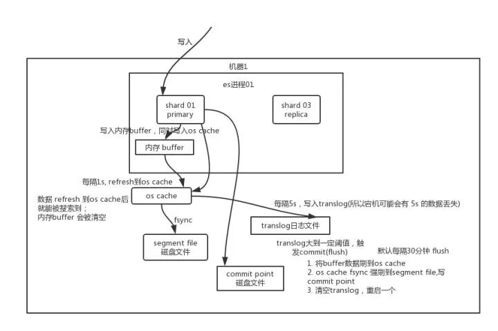
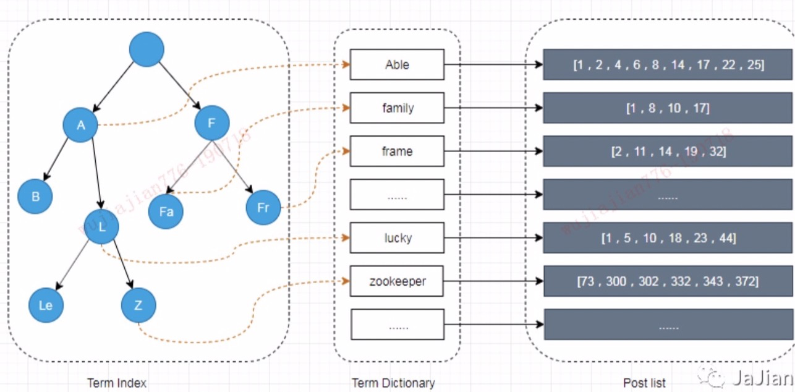

## 1、什么是elasticsearch

```text
1.分布式的搜索引擎和数据分析引擎
2.分布式的文档存储引擎
3.分布式，支持PB数据
```

底层是基于lucene的，lucene是一个jar包，里面包含了封装好的各种建立倒排索引，以及进行搜索的代码。

lucene能够很好的利用操作系统内存来缓存索引数据，以提供快速的查询性能。

lucene的索引文件segements是存储在单文件中的，并且不可变，对于OS来说，能够很友好地将索引文件保持在cache中，以便快速访问；因此，我们很有必要将一半的物理内存留给lucene ; 另一半的物理内存留给ES（JVM heap )。

倒排索引：以字段（term）为key，文档为value，由属性值来确定记录的位置的结构。


分布式体现在：（CAP）

```text
C (一致性):对某个指定的客户端来说，读操作能返回最新的写操作。对于数据分布在不同节点上的数据上来说，如果在某个节点更新了数据，那么在其他节点如果都能读取到这个最新的数据，那么就称为强一致，如果有某个节点没有读取到，那就是分布式不一致。

A (可用性)：非故障的节点在合理的时间内返回合理的响应(不是错误和超时的响应)。可用性的两个关键一个是合理的时间，一个是合理的响应。合理的时间指的是请求不能无限被阻塞，应该在合理的时间给出返回。合理的响应指的是系统应该明确返回结果并且结果是正确的，这里的正确指的是比如应该返回50，而不是返回40。

P (分区容错性):当出现网络分区后，系统能够继续工作。打个比方，这里个集群有多台机器，有台机器网络出现了问题，但是这个集群仍然可以正常工作。
```

**elasticsearch CAP**

```text
1.一致性
es在修改数据时，引入了乐观锁，每个文档都有一个 _version （版本）号，当文档被修改时版本号递增。一旦所有的副本分片都报告写成功才会向协调节点报告成功，协调节点向客户端报告成功。

es在写入数据时，使用了translog机制，保证数据不丢失。

读数据的时候可以选择preference:_primary/_primary_first等

2.可用性
es中有多shard多replica，shard是lucene单元，易于水平扩展，可以提升吞吐量和写入性能
多replica保证了高可用，replica可以出来读请求，提升了搜索请求的吞吐量和性能。

防脑裂：
设置discovery.zen.minimum_master_nodes参数，避免脑裂。
默认值是master_eligibel_nodes/2+1。这个master_eligibel_nodes是候选主节点数量。

服务一直可用：master选举	
读请求可以由协调节点轮询分配到shard和replica所在的任意节点上。
丢失primary shard的replica可以提升为primary shard

3.分区容错性
一般都能保证
```

一般分布式都是保证分区容错性的前提下，保证可用性，数据达到最终一致性。

elasticsearch这里也可以有一种折中。

```text
读数据的时候可以选择preference：
_primary: 只读主分片，保证数据一致性，可用性较差
_primary_first: 优先主分片，保证数据一致性，可用性也能得到一定程度保障。
```

### 1.1 elasticsearch在数据量很大的情况下如何提高查询效率？

1.给`Filesystem Cache`更多空间，一般要给机器总内存的一半以上

2.数据预热，刷到`Filesystem Cache`中

3.冷热分离，热数据放一个索引，冷数据放一个索引

4.`elasticsearch`中尽量避免关联查询，可以将相关逻辑写在`Java`系统里，将关联数据直接写入`elasticsearch`

5.`Document`模型设计要做好

6.分页性能优化，不允许深度分页

## 2、elasticsearch 核心概念

```text
1.NRT(近实时)，延迟大概1s，refresh时间
2.Cluster:集群
3.Node:节点
4.Document:文档，es中的最小数据单元，一条客户数据，通常用json表示
_id: document唯一标识，_index:document放在哪个索引里面
5.Index:索引，可以包含很多Document
6.Shard:一个index分成很多个shard
shard是lucene实例，具有完整的创建索引和处理请求的能力。
好处：横向扩展、数据分布在多个shard，都会在多台服务器上并行分布式执行，提升吞吐量和性能。Primary Shard
7.Replica:Replica Shard，高可用、提升搜索请求(可以把请求发送到replica)的吞吐量和性能。
```


## 3、elasticsearch 写原理

* 客户端选择一个 node 发送请求过去，这个 node 就是 `coordinating node`（协调节点）。
* `coordinating node` 对 document 进行路由，将请求转发给对应的 node（有 primary shard）。
* 实际的 node 上的 `primary shard` 处理请求，然后将数据同步到 `replica node`。
* `coordinating node` 如果发现 `primary node` 和所有 `replica node` 都搞定之后，就返回响应结果给客户端。



更底层：

```text
1.先写入内存buffer，同时将数据写入translog日志文件，此时数据搜索不到。
2.等buffer满了或到一定时间将buffer数据refresh到os cache中，translog日志也会刷入os cache，此时数据写入了segment file，segment file是lucene的最小单元，此时数据是可以搜索到的。refresh默认是1s，这就是es数据是近实时的原因。
3.translog日志每5s刷入磁盘，当translog日志达到一定阈值，就会触发commit(flush)
此时会将buffer显存数据刷到os cache，新写入数据重新保存在一个segment file中，os cache中的数据fysnc到磁盘文件中去，最后清空translog日志文件，重启一个translog。
```

translog日志跟mysql中的binlog、hbase中的hlog都是类似的。

写一致性：`index.write.wait_for_active_shards`可以指定为1（default）、2、…all等。


## 4、elasticsearch删除、更新底层原理

```text
1.删除操作：
commit的时候会生成一个.del文件，里面将某个doc标识为deleted状态，那么搜索的时候根据.del文件就知道这个doc是否被删除了

2.更新操作：
将原来的doc标识为deleted状态，然后新写入一条数据。
```

buffer 每 refresh 一次，就会产生一个 `segment file`，所以默认情况下是 1 秒钟一个 `segment file`，这样下来 `segment file` 会越来越多

此时会定期执行 merge。每次 merge 的时候，会将多个 `segment file` 合并成一个

同时这里会将标识为 `deleted` 的 doc 给物理删除掉，然后将新的 `segment file` 写入磁盘，这里会写一个 `commit point`，标识所有新的 `segment file`，然后打开 `segment file` 供搜索使用，同时删除旧的 `segment file`。


## 5、elasticsearch查询内部原理

```text
1、客户端发送请求到任意一个node，成为coordinate node
2、coordinate node对document进行路由，将请求转发到对应的node，此时会使用round-robin随机轮询算法，在primary shard以及其所有replica中随机选择一个，让读请求负载均衡
3、接收请求的node返回document给coordinate node
4、coordinate node返回document给客户端
```


## 6、elasticsearch 锁设计

一般采用乐观锁进行并发控制，修改或删除都会给数据加上版本号。

版本号可以自己用`external version`来维护。

elasticsearch可以设置全局锁：

```text
PUT /fs/lock/global/_create
{}

# 将整个index上锁，对index中所有的doc操作，都会block住，导致整个系统的并发能力很低。
```

elasticsearch可以对document设置悲观锁：

```text
POST /fs/lock/1/_update
{
  "upsert": { "process_id": 123 },
  "script": "if ( ctx._source.process_id != process_id ) { assert false }; ctx.op = 'noop';"
  "params": {
    "process_id": 123
  }
}

# 解释
process_id很重要，会在lock中，设置对对应的doc加锁的进程的id，这样其他进程过来的时候，才知道，这条数据已经被别人给锁了。
assert false，不是当前进程加锁的话，则抛出异常
ctx.op='noop'，不做任何修改

# 注意：一般会用groovy去保存script的内容。
```

elasticsearch也可以设置共享锁和排他锁：

- 共享锁：这份数据是共享的，然后多个线程过来，都可以获取同一个数据的共享锁，然后对这个数据执行读操作
- 排他锁：排他操作，只能有一个线程获取排他锁，然后执行增删改操作。

```text
共享锁：
judge-lock-2.groovy: if (ctx._source.lock_type == 'exclusive') { assert false }; ctx._source.lock_count++

POST /fs/lock/1/_update 
{
  "upsert": { 
    "lock_type":  "shared",
    "lock_count": 1
  },
  "script": {
  	"lang": "groovy",
  	"file": "judge-lock-2"
  }
}


排他锁：
PUT /fs/lock/1/_create
{ "lock_type": "exclusive" }

排他锁用的不是upsert语法，create语法，要求lock必须不能存在，直接自己是第一个上锁的人，上的是排他锁。

# 排他锁不能跟共享锁同时存在。
```


## 7、elasticsearch中的doc_value

doc value表示的是正排索引。聚合分析时必须是倒排索引（`index:true`）和正排索引（`doc_value:true`）结果起来用。

```text
倒排索引结构：
Term      Doc_1   Doc_2   Doc_3
------------------------------------
brown   |   X   |   X   |
dog     |   X   |       |   X
dogs    |       |   X   |   X
fox     |   X   |       |   X
foxes   |       |   X   |
in      |       |   X   |
jumped  |   X   |       |   X
lazy    |   X   |   X   |
leap    |       |   X   |
over    |   X   |   X   |   X
quick   |   X   |   X   |   X
summer  |       |   X   |
the     |   X   |       |   X
如果想查brown在哪些doc中，这个很好确定，但是如果想找到doc_1中的哪些单词？如果用倒排索引需要将doc_1的列数据都遍历一遍。这个很耗时，所以需要建立正排索引：
Doc      Terms
-----------------------------------------------------------------
Doc_1 | brown, dog, fox, jumped, lazy, over, quick, the
Doc_2 | brown, dogs, foxes, in, lazy, leap, over, quick, summer
Doc_3 | dog, dogs, fox, jumped, over, quick, the
-----------------------------------------------------------------
此时结果一目了然。
```

doc_value在es中的应用包括：

- 对某个字段排序；
- 某个字段聚合查询（ max/min/count ）；
- 部分过滤器 （ 地理位置过滤器 ）；
- 某个字段的脚本执行。等等。


## 8、elasticsearch索引优化



Elasticsearch为了能快速找到某个term，先将所有的term排个序，然后根据二分法查找term，时间复杂度为logN，就像通过字典查找一样，这就是Term Dictionary。现在再看起来，似乎和传统数据库通过B-Tree的方式类似。

但是如果term太多，term dictionary也会很大，放内存不现实，于是有了Term Index，就像字典里的索引页一样，A开头的有哪些term，分别在哪页，可以理解term index是一颗树。这棵树不会包含所有的term，它包含的是term的一些前缀。通过term index可以快速地定位到term dictionary的某个offset，然后从这个位置再往后顺序查找。

在内存中用FST（Finite-State Transducer）方式压缩term index，FST以字节的方式存储所有的term，这种压缩方式可以有效的缩减存储空间，使得term index足以放进内存，但这种方式也会导致查找时需要更多的CPU资源。

FST是一种key,value形式，这里是字典树中的单词对应具体的term


## 9、elasticsearch如何转成时序数据库（TSDB）?

TSDB 是以时间作为索引的，其数据结构越简单越好，层次最好就一层，字段固定且单一，大致包含了`<id,timestamp,metric>`这几个参数，对硬盘的占用也需要做优化，系统高可用性比强一致性要重要一些，对 PB 级别的数据的处理有极低的延迟等等。

- 禁用 `_source` ，TSDB 并不需要存储指标原文，更不需要对指标本身做全文检索；
- 启用`doc_value`字段，提供聚合查询的支持，后续会做详细介绍；
- 字段类型能用 float 就不用 double；
- 
- 长期来看，为了合理的优化存储，我们可以周期性执行 `/_forcemerge` 方法合并碎片，优化存储空间。


## 10、elasticsearch做过哪些优化？

### 10.1 常见措施

1.SSD存储
SSD会比机械硬盘查询快5-10倍


2.给JVM配置一半内存，不超过16G
ES非常依赖文件系统缓存（Filesystem Cache），快速搜索。一般来说，应该至少确保物理上有一半的可用内存分配到文件系统缓存。


3.禁用不需要的功能

```text
聚合：doc_values: false 正排索引 
搜索：index: false 倒排索引
评分：norms: false
近似匹配：index_options(freqs)
```


4.控制分片和副本数在合理值。

一般单节点shard数控制在1000以内。
因为内部是日志系统是按服务建索引。后期给logstash设置白名单。日志量大的服务单独建索引，剩下的会放一起。


5.减少映射字段，精确匹配的采用keyword类型。
避免分词。


6.提高refresh间隔。
`index.refresh_interval: 30s`


7.提高translog.sync_interval时长
`"translog": { "sync_interval": "15s" }`
控制数据从内存到硬盘的操作频率，以减少硬盘IO。


8.定期关闭旧索引
`http://${ip}:9200/${index_name}/_close`


9.避免超大的document

超大的document 会消耗大量内存、cpu，可能是document的几倍。

我采取的策略：

```text
1.避免对message分词索引
2.统计es内部单条document的大小，做成报表，每天输出到后端开发群，催促整改。 
```

生产es出现类似的bug：

```text
算法爬取百度百科的相关介绍保存到es中，document太大，没做过滤筛选，导致es负载过高。
```


## 10.2 写入部分

1.用bulk写入时，可以适当增加batch的大小

2.给filesystem cache更多内存


## 10.3 搜索部分

1.给filesystem cache更多内存。

```text
标准：机器留下的filesystem cache至少是数据总容量的一半。
比如说1T数据，给filesystem cache的内存至少要有512G.(这就是es集群性能不行的原因吧...)
```

elasticsearch中尽量只存用来搜索的数据，其他可以放mysql、hadoop、habase中。


2.预热filesystem cache

如果我们重启了es，那么filesystem cache是空壳的，就需要不断的查询才能重新让filesystem cache热起来，我们可以先说动对一些数据进行查询。

比如说，你本来一个查询，要用户点击以后才执行，才能从磁盘加载到filesystem cache里，第一次执行要10s，以后每次就几百毫秒

你完全可以，自己早上的时候，就程序执行那个查询，预热，数据就加载到filesystem cahce，程序执行的时候是10s，以后用户真的来看的时候就才几百毫秒。


## 11、说说自己对felk日志中存在的问题及具体调整策略

```text
系统在跑起来后出现了消息丢失、重复消费、消费延迟等常见问题：
1）消息丢失：因为没有引入kafka作为消息中间件，日志系统在升级过程中，每次停机维护时保存在内存中的event信息就有可能丢失。所以我对logstash中的event做了持久化，也部署了相关的监控，将其保存到磁盘中，重启后还会接续上次的offset继续消费。

同时，也更改了logstash相关的yaml配置，对其conf文件可支持热更新。

2）重复消费：由于filebeat中消息发送机制是at least once，如果网络出现问题或者logstash重启，可能会导致重复消费，我采用的解决方案是在logstash中针对日志source、日志timestamp、日志消费offset这三个参数生成了一个MD5值，将这个参数作为es中document id，可以保证消费端仅消费一次，这样在数据回滚时，也会有好处。

3）消息延迟：一般都是系统达到瓶颈，需要动态扩容，查看各服务cpu、memory消耗情况，会发现瓶颈一般出在logstash或elasticsearch中。

出现在logstash中，主要是解析相关字段、处理字段信息。这个没有特别好的优化点，只能加节点。由于一开始logatsh支持持久化event信息，同时部署在k8s上，podname每次重启都会改变，，动态扩容不好，后来我使用了statefulset形式重新部署了logstash、持久化event信息也用不同文件夹名保存，上游filebeat做一个负载均衡，就解决了logstash动态扩容广德问题

出现在elasticsearch中，比较复杂：
1.日志系统写多读少，性能瓶颈一般出在写性能上，我开始用elasticsearch官方的压测工具rally，自己生成了一套适配内部的日志格式进行相关压测。测出来极限写入性能大概在2w qps。针对内部es现状，发现问题；
shard数过多（1node 800-1000shard比较合适），主要是一个服务一天一个索引，后期按月建索引，随着服务越来越多还是会出现这个问题，（索引过多，shard数太多消耗了大量es的cpu、memory资源。）最后的解决方案是建立了白名单机制
对服务每月的document count进行统计，超过count阈值的服务放在白名单里面，按月建索引，没达到阈值的统计创建一个总索引。

对es本身也做了一些优化：
包括大数据字段不进行搜索，控制text字段聚合(doc_values:false)。详细的见10小节。
```

