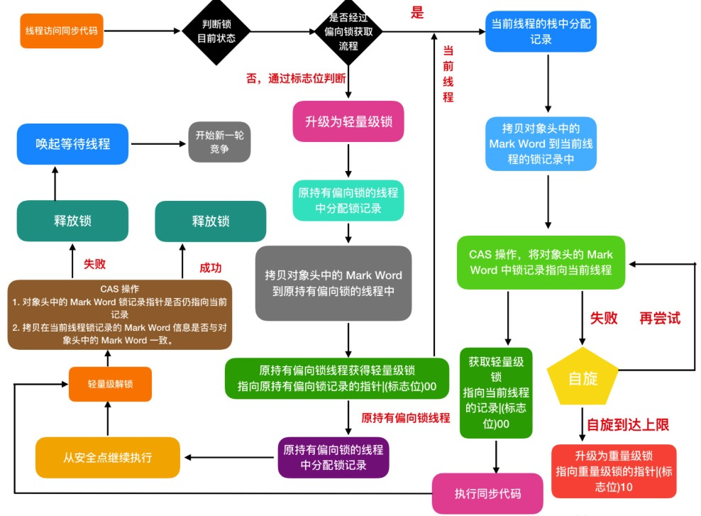

## 1.JMM

Java内存模型`Java Memory Model`，简称`JMM`。

是一种抽象概念并不真实存在，它描述的是一组规则或规范，通过这组规范定义了程序中各个变量（包括实例字段，静态字段和构成数组对象的元素）的访问方式。

是`Java`并发编程的核心和基础，用来屏蔽各种硬件和操作系统的内存访问差异。

**JMM关于同步的规定**

```text
1.线程解锁之前，必须把共享内存的值刷到主内存。
2.线程加锁前，必须读取主内存的最新值到自己的工作内存。
3.加锁解锁是同一把锁。
```

**JMM定义了线程与主内存之间的关系**

```text
1.共享变量存储在主内存中，每个线程都可以访问，每个线程都有自己的工作内存（本地内存）
2.工作内存只存储该线程对共享变量的副本
3.线程不能直接操作主内存，只有先操作工作内存才能写入主内存。
```


线程间通信必须经过主内存。

### 1.1 线程的工作内存在主存还是缓存?

`JMM`中定义的每个线程私有的工作内存是抽象的规范，实际工作内存和真实的`CPU`内存架构如下：


**真实内存架构没有区分堆和栈，只是JVM中做了一些划分**

**线程私有的本地内存线程栈可能包括CPU寄存器、缓存和主存，堆亦如此。**


### 1.2 主内存和工作内存交互操作

```text
1.lock（锁定）：作用于主内存的变量，把一个变量标识为一条线程独占状态。

2.unlock（解锁）：作用于主内存变量，把一个处于锁定状态的变量解除锁定，解除锁定后的变量才可以被其他线程锁定。

3.read（读取）：作用于主内存变量，把一个变量值从主内存传输到线程的工作内存中，以便随后的load动作使用

4.load（载入）：作用于工作内存的变量，它把read操作从主内存中得到的变量值放入工作内存的变量副本中。

5.use（使用）：作用于工作内存的变量，把工作内存中的一个变量值传递给执行引擎，每当虚拟机遇到一个需要使用变量的值的字节码指令时将会执行这个操作。

6.assign（赋值）：作用于工作内存的变量，它把一个从执行引擎接收到的值赋值给工作内存的变量，每当虚拟机遇到一个给变量赋值的字节码指令时执行这个操作。

7.store（有的指令是save/存储）：作用于工作内存的变量，把工作内存中的一个变量的值传送到主内存中，以便随后的write的操作。

8.write（写入）：作用于主内存的变量，它把store操作从工作内存中一个变量的值传送到主内存的变量中。
```

代码和字节码指令分别为:


执行上述八种基本操作，必须满足如下规则：

```text
1.如果要把一个变量从主内存中复制到工作内存，需要顺序执行read 和load 操作， 如果把变量从工作内存中同步回主内存中，就要按顺序地执行store 和write 操作。但Java内存模型只要求上述操作必须按顺序执行，而没有保证必须是连续执行，也就是操作不是原子的，一组操作可以中断。

2.不允许read和load、store和write操作之一单独出现，必须成对出现。

3.不允许一个线程丢弃它的最近assign的操作，即变量在工作内存中改变了之后必须同步到主内存中。

4.不允许一个线程无原因地（没有发生过任何assign操作）把数据从工作内存同步回主内存中。

5.一个新的变量只能在主内存中诞生，不允许在工作内存中直接使用一个未被初始化（load或assign）的变量。即就是对一个变量实施use和store操作之前，必须先执行过了assign和load操作。

6.一个变量在同一时刻只允许一条线程对其进行lock操作，但lock操作可以被同一条线程重复执行多次，多次执行lock后，只有执行相同次数的unlock操作，变量才会被解锁。lock和unlock必须成对出现

7.如果对一个变量执行lock操作，将会清空工作内存中此变量的值，在执行引擎使用这个变量前需要重新执行load或assign操作初始化变量的值

8.如果一个变量事先没有被lock操作锁定，则不允许对它执行unlock操作；也不允许去unlock一个被其他线程锁定的变量。

9.对一个变量执行unlock操作之前，必须先把此变量同步到主内存中（执行store和write操作）。
```


### 1.3 volatile

1.可见性：

当多个线程访问同一个共享变量时，一个线程修改了这个变量的值，其他线程能够立即看到修改后的值。

```java
class MyData {
    int num = 0;
//    volatile int num = 0;

    public synchronized void addToSixty() {
        this.num = 60;
    }

}

public class VolatileDemo {

    public static void main(String[] args) {
        MyData myData = new MyData();

        //第一个线程
        new Thread(() -> {
            System.out.println(Thread.currentThread().getName() + "\t come in");
            try {
                //线程暂停3s
                TimeUnit.SECONDS.sleep(3);
                myData.addToSixty();
                System.out.println(Thread.currentThread().getName() + "\t update value:" + myData.num);
            } catch (Exception e) {
                // TODO Auto-generated catch block
                e.printStackTrace();
            }
        }, "thread1").start();
        //第二个线程是main线程
        while (myData.num == 0) {
            //如果myData的num一直为零，main线程一直在这里循环
        }
        System.out.println(Thread.currentThread().getName() + "\t mission is over, num value is " + myData.num);

    }
}

// 不加volatile,thread1修改num值，main线程不会读到修改后的值，main线程会一直在while循环处等待
// 加上volatile后，工作内存修改，主内存可见，所以不会走while循环，3s后输出答案
```


2.原子性

```java
public class VolatileDemo {

    public static void main(String[] args) {
        atomicByVolatile();//验证volatile不保证原子性
    }

    /**
     * volatile不保证原子性
     * 以及使用Atomic保证原子性
     */
    public static void atomicByVolatile(){
        MyData myData = new MyData();
        for(int i = 1; i <= 20; i++){
            new Thread(() ->{
                for(int j = 1; j <= 1000; j++){
                    myData.addSelf();
                    myData.addSelflock();
                    myData.atomicAddSelf();
                }
            },"Thread "+i).start();
        }
        //等待上面的线程都计算完成后，再用main线程取得最终结果值，很重要!!!不用设置时间等待了。
        while (Thread.activeCount()>2){
            Thread.yield();
        }
        System.out.println(Thread.currentThread().getName()+"\t finally num value is "+myData.num);
        System.out.println(Thread.currentThread().getName()+"\t finally synchronized num value is "+myData.num_lock);
        System.out.println(Thread.currentThread().getName()+"\t finally atomicnum value is "+myData.atomicInteger);
    }
}

class MyData {
    int num = 0;
    int num_lock = 0;

//    volatile int num = 0;

    public synchronized void addToSixty() {
        this.num = 60;
    }

    public void addSelf(){
        num++;
    }

    public synchronized void addSelflock(){
        num_lock++;
    }

    AtomicInteger atomicInteger = new AtomicInteger();
    public void atomicAddSelf(){
        atomicInteger.getAndIncrement();
    }
}

# output
main	 finally num value is 19704
main	 finally synchronized num value is 20000
main	 finally atomicnum value is 20000
    
# 结论：volatile不具有原子性，可以通过给方法加synchronized或使用原子类来累加实现原子性。
```


`num++`没有原子性的原因


3.指令重排

指令重排的3种形式：

 

单线程环境里面确保程序最终执行结果和代码顺序执行的结果一致。

处理器在进行重排序时必须要考虑指令之间的**数据依赖性**。

```java
public void mySort() {
    int x = 10; // 语句1
    int y = 12; // 语句2
    x = x + 5; // 语句3
    y = x * x; // 语句4
}
// 可执行顺序：
1234 / 2134 / 1324
```

多线程环境中线程交替执行，由于编译器优化重排的存在，两个线程中使用的变量能否保证一致性是无法确定的，结果无法预测。

```java
int a,b,x,y = 0;

线程1  线程2
x=a;  y=b;
b=1;  a=2;
output:
x=0,y=0

线程1  线程2
b=1;  a=2;
x=a;  y=b;
x=2,y=1
```


```java
public class ReSortSeqDemo {
    int a = 0;
    boolean flag = false;
    
    public void method1() {
        a = 1; // 语句1
        flag = true;  // 语句2
    }
    
    public void method2() {
        if(flag) {
            a = a +5; // 语句3
            System.out.println("return value:"+a);
        }
    }
}

// 单线程可以顺序执行
// 多线程可能会先执行语句2，然后进入method2，导致输出a=5
```

volatile实现禁止指令重排优化。

内存屏障`Memory Barrier`，是一个`CPU`指令，作用：

```text
1.保证特定操作的执行顺序
2.保证某些变量的内存可见性(利用该特性实现volatile的内存可见性)
```


**使用volatile的场景**

1.`DCL(Double Check Lock双端检锁机制)`

```java
 public class SingletonDemo {
    private static volatile SingletonDemo instance = null;

    private SingletonDemo() {
        System.out.println(Thread.currentThread().getName() + "\t 构造方法SingletonDemo（）");
    }

    public static SingletonDemo getInstance() { // 锁方法也可以，但是高并发影响性能

        if (instance == null) {  // check 1
            synchronized (SingletonDemo.class) {
                if (instance == null) {
                    instance = new SingletonDemo();  // check 2
                }
            }
        }
        return instance;
    }

    public static void main(String[] args) {
        //构造方法只会被执行一次
//        System.out.println(getInstance() == getInstance());
//        System.out.println(getInstance() == getInstance());
//        System.out.println(getInstance() == getInstance());

        //构造方法会在一些情况下执行多次
        for (int i = 0; i < 10; i++) {
            new Thread(() -> {
                SingletonDemo.getInstance();
            }, "Thread " + i).start();
        }
    }
}

// DCL双端检锁机制不一定线程安全，原因是有指令重排序的存在，加入volatile可以禁止指令重排
// 原因在于某一个线程执行第一次检测，读取到的instance不为null时，instance的引用对象可能没有完成初始化。
instance = new SingletonDemo(); 可以分为以下3步完成(伪代码)
    
memory = allocate(); // 1.分配对象内存空间
instance(memory); // 2.初始化对象
instance=memory; //3.设置instance指向刚分配的内存地址,此时instance!=null

// 执行顺序123，但是指令重排的话可能是132
// 指令重排只会保证串行语义的一致性(单线程)，但并不会关心多线程间的语义一致性
// 所以当一条线程访问instance不为null时，由于instance实例未必已完成初始化，也就造成了线程安全问题
## 解决方案：
private static volatile SingletonDemo instance = null; // 禁止这个对象指令重排
```


## 2.CAS

```java
import java.util.concurrent.atomic.AtomicInteger;

/**
 * 1.CAS是什么？
 * 1.1比较并交换
 */
public class CASDemo {
    public static void main(String[] args) {
       checkCAS();
    }

    public static void checkCAS(){
        AtomicInteger atomicInteger = new AtomicInteger(5);
        System.out.println(atomicInteger.compareAndSet(5, 2019) + "\t current data is " + atomicInteger.get()); // 值已变成2019，并通知其他线程值已改变
        System.out.println(atomicInteger.compareAndSet(5, 2014) + "\t current data is " + atomicInteger.get());
    }
}
# output
true	 current data is 2019
false	 current data is 2019
```

**CAS底层原理**

`Compare-And-Swap`是一条CPU并发原语。

`Unsafe`类+自旋锁

`Unsafe`类是`CAS`的核心类，通过这个后门，可以直接操作特定内存的数据。

```java
public class AtomicInteger extends Number implements java.io.Serializable {
    private static final long serialVersionUID = 6214790243416807050L;

    // setup to use Unsafe.compareAndSwapInt for updates
    private static final Unsafe unsafe = Unsafe.getUnsafe();
    private static final long valueOffset;  // 表示变量在内存中的偏移地址，可以由这个读取数据

    static {
        try {
            valueOffset = unsafe.objectFieldOffset
                (AtomicInteger.class.getDeclaredField("value"));
        } catch (Exception ex) { throw new Error(ex); }
    }

    private volatile int value;  // value用volative修饰，保证了多线程之间的内存可见性。
    
    ...
}
```

`Unsafe`类中的所有方法都是`native`修饰，说明这些类中的方法都可以直接调用操作系统底层资源执行相应的任务。 


```java
public final int getAndIncrement() {
        return unsafe.getAndAddInt(this, valueOffset, 1); // this 内存地址，valueOffset偏移
    }

// unsafe
public final int getAndAddInt(Object var1, long var2, int var4) {
        int var5;
        do {
            var5 = this.getIntVolatile(var1, var2);
        } while(!this.compareAndSwapInt(var1, var2, var5, var5 + var4)); // 1.比较var2和var5的值，如果相等，var5+var4，比较成功跳出循环；2.如果不等，无法修改，重新获取这个对象的偏移量（var5值），进行比较。 这就是自旋！！！
        return var5;
    }

// var1 AtomicInteger对象
// var2 对象引用地址
// var4 需变动的数量
// var5 是用过var1 var2 找出的主内存中真实的值
// 用该对象当前的值与var5比较：如果相等，更新var5+var4并且返回true，如果不同，继续取值然后再比较，直至更新完成。

# 例子：线程A和线程B同时执行getAndAddInt操作(不同CPU)
1.AtomicInteger初始值为3，线程A和线程B各自持有一份值为3的value的副本分别到各自的工作内存；
2.线程A通过getIntVolatile(var1,var2)获取value值为3，这时线程A被挂起
3.线程B通过getIntVolatile(var1,var2)获取value值为3，并没有被挂起，执行compareAndSwapInt方法，比较内存值也为3，成功修改内存值为4，线程B结束
4.线程A恢复，根据compareAndSwapInt方法比较，发现自己手里的数字3和主内存的数字4不一致，说明该值已经被其他线程修改过，线程A本次修改失败，只能重新读取重新来一遍
5.线程A重新获取value值，因为变量value被volatile修饰，所以其它线程对它的修改，线程A总能够看到，线程A继续执行compareAndSwapInt进行比较替换，直到成功。

底层汇编：
Atomic:::cmpxchg(x,addr,e) 其中参数x是即将更新的值，参数e是原内存的值。
```


**CAS缺点**

```text
1.CAS失败，会一直尝试自旋，如果长时间一直不成功，可能会给CPU带来很大的开销；
2.只能保证一个共享变量的原子操作
3.ABA
线程1从内存位置V中取出A，此时另一个线程2也从内存中取出A，并且线程2进行了一些操作值变成了B，接着又将V位置的数据变成A,这时候线程1进行CAS操作发现内存中仍然是A，线程1操作成功。
```

**AtomicRefrence**

```java
import lombok.AllArgsConstructor;
import lombok.Getter;
import lombok.ToString;

import java.util.concurrent.atomic.AtomicReference;

public class AtomicRefrenceDemo {
    public static void main(String[] args) {
        User z3 = new User("张三", 22);
        User l4 = new User("李四", 23);
        AtomicReference<User> atomicReference = new AtomicReference<>();
        atomicReference.set(z3);
        System.out.println(atomicReference.compareAndSet(z3, l4) + "\t" + atomicReference.get().toString());
        System.out.println(atomicReference.compareAndSet(z3, l4) + "\t" + atomicReference.get().toString());
    }
}

@Getter
@ToString
@AllArgsConstructor
class User {
    String userName;
    int age;
}
```

**解决ABA问题**

改的时候加时间

```java
import java.util.concurrent.TimeUnit;
import java.util.concurrent.atomic.AtomicReference;
import java.util.concurrent.atomic.AtomicStampedReference;

/**
 * ABA问题解决
 * AtomicStampedReference
 */
public class ABADemo {
    static AtomicReference<Integer> atomicReference = new AtomicReference<>(100);
    static AtomicStampedReference<Integer> atomicStampedReference = new AtomicStampedReference<>(100, 1);

    public static void main(String[] args) {
        System.out.println("=====以下时ABA问题的产生=====");
        new Thread(() -> {
            atomicReference.compareAndSet(100, 101);
            atomicReference.compareAndSet(101, 100);
        }, "Thread 1").start();

        new Thread(() -> {
            try {
                //保证线程1完成一次ABA操作
                TimeUnit.SECONDS.sleep(1);
            } catch (InterruptedException e) {
                e.printStackTrace();
            }
            System.out.println(atomicReference.compareAndSet(100, 2019) + "\t" + atomicReference.get());
        }, "Thread 2").start();
        try {
            TimeUnit.SECONDS.sleep(2);
        } catch (InterruptedException e) {
            e.printStackTrace();
        }
        System.out.println("=====以下时ABA问题的解决=====");

        new Thread(() -> {
            int stamp = atomicStampedReference.getStamp();
            System.out.println(Thread.currentThread().getName() + "\t第1次版本号" + stamp);
            try {
                TimeUnit.SECONDS.sleep(2);
            } catch (InterruptedException e) {
                e.printStackTrace();
            }
            atomicStampedReference.compareAndSet(100, 101, atomicStampedReference.getStamp(), atomicStampedReference.getStamp() + 1);
            System.out.println(Thread.currentThread().getName() + "\t第2次版本号" + atomicStampedReference.getStamp());
            atomicStampedReference.compareAndSet(101, 100, atomicStampedReference.getStamp(), atomicStampedReference.getStamp() + 1);
            System.out.println(Thread.currentThread().getName() + "\t第3次版本号" + atomicStampedReference.getStamp());
        }, "Thread 3").start();

        new Thread(() -> {
            int stamp = atomicStampedReference.getStamp();
            System.out.println(Thread.currentThread().getName() + "\t第1次版本号" + stamp);
            try {
                TimeUnit.SECONDS.sleep(4);
            } catch (InterruptedException e) {
                e.printStackTrace();
            }
            boolean result = atomicStampedReference.compareAndSet(100, 2019, stamp, stamp + 1); // t3获取的版本号是3，t4获取的版本号是2，无法修改。

            System.out.println(Thread.currentThread().getName() + "\t修改是否成功" + result + "\t当前最新实际版本号：" + atomicStampedReference.getStamp());
            System.out.println(Thread.currentThread().getName() + "\t当前最新实际值：" + atomicStampedReference.getReference());
        }, "Thread 4").start();
    }
}

# output
=====以下时ABA问题的产生=====
true	2019
=====以下时ABA问题的解决=====
Thread 3	第1次版本号1
Thread 4	第1次版本号1
Thread 3	第2次版本号2
Thread 3	第3次版本号3
Thread 4	修改是否成功false	当前最新实际版本号：3
Thread 4	当前最新实际值：100
```

**Java 8对CAS机制的优化**

```text
CAS存在问题：大量的线程同时并发修改一个AtomicInteger，可能有很多线程会不停的自旋，进入一个无限重复的循环中。
```

`Java 8`推出了一个新的类，`LongAdder`，尝试使用分段`CAS`以及自动分段迁移的方式


```text
1.在LongAdder的底层实现中，首先有一个base值，刚开始多线程来不停的累加数值，都是对base进行累加的，比如刚开始累加成了base = 5。

2.接着如果发现并发更新的线程数量过多，就会开始施行分段CAS的机制，也就是内部会搞一个Cell数组，每个数组是一个数值分段。

3.这时，让大量的线程分别去对不同Cell内部的value值进行CAS累加操作，这样就把CAS计算压力分散到了不同的Cell分段数值中了！

这样就可以大幅度的降低多线程并发更新同一个数值时出现的无限循环的问题，大幅度提升了多线程并发更新数值的性能和效率！

4.内部实现了自动分段迁移的机制，也就是如果某个Cell的value执行CAS失败了，那么就会自动去找另外一个Cell分段内的value值进行CAS操作。

这样也解决了线程空旋转、自旋不停等待执行CAS操作的问题，让一个线程过来执行CAS时可以尽快的完成这个操作。

5.如果你要从LongAdder中获取当前累加的总值，就会把base值和所有Cell分段数值加起来返回给你。
```

高并发中的分段处理机制是很常见的并发优化手段。


## 3.ArrayList安全问题

### 3.1 ArrayList线程安全问题

```java
new ArrayList<Integer>(); // 初始值是10，超过的话扩容
```

线程不安全，add方法没有加锁。

```java
import java.util.*;

class ContainerNotSafeDemo {
    public static void main(String[] args) {
        notSafe();
    }

    /**
     * 故障现象
     * java.util.ConcurrentModificationException
     */
    public static void notSafe() {
        List<String> list = new ArrayList<>();
        for (int i = 1; i <= 5; i++) {
            new Thread(() -> {
                list.add(UUID.randomUUID().toString().substring(0, 8));
                System.out.println(list);
            }, "Thread " + i).start();
        }
    }
}

# output
[null, ebce9ee9, bdcfa4e3, bd0c9165]
[null, ebce9ee9, bdcfa4e3, bd0c9165]
[null, ebce9ee9, bdcfa4e3, bd0c9165]
[null, ebce9ee9, bdcfa4e3, bd0c9165]
[null, ebce9ee9, bdcfa4e3, bd0c9165]
线程不安全
```

**解决方案**

```java
/**
 * 解决方案1：使用Vector  add方法加锁了，并发性下降
 */
public static void vectorTest(){
    List<String> list = new Vector<>();
    for (int i = 1; i <= 30; i++) {
        new Thread(() -> {
            list.add(UUID.randomUUID().toString().substring(0, 8));
            System.out.println(list);
        }, "Thread " + i).start();
    }
}

/**
 * 解决方案2
 * 使用Collections辅助类
 */
public static void collectionsTest(){
    List<String> list = Collections.synchronizedList(new ArrayList<>());
    for (int i = 1; i <= 30; i++) {
        new Thread(() -> {
            list.add(UUID.randomUUID().toString().substring(0, 8));
            System.out.println(list);
        }, "Thread " + i).start();
    }
}

/**
 * 解决方案3
 * CopyOnWriteArrayList
 */
public static void copyOnWriteArrayListTest(){
    List<String> list = new CopyOnWriteArrayList<>();
    for (int i = 1; i <= 3; i++) {
        new Thread(() -> {
            list.add(UUID.randomUUID().toString().substring(0, 8));
            System.out.println(list);
        }, "Thread " + i).start();
    }
}
// CopyOnWriteArrayList 写时复制，读写分离
public boolean add(E e) {
    final ReentrantLock lock = this.lock;
    lock.lock();
    try {
        Object[] elements = getArray();
        int len = elements.length;
        Object[] newElements = Arrays.copyOf(elements, len + 1); // copy一份，长度+1
        newElements[len] = e;
        setArray(newElements);
        return true;
    } finally {
        lock.unlock();
    }
}
```

`Set`与`List`类似。

### 3.2 CopyOnWrite思想在Kafka源码中的运用

`Kafka`中，客户端在向`Kafka`写数据的时候，会把消息先写入客户端本地的内存缓冲，然后在内存缓冲里形成一个`Batch`之后再一次性发送到`Kafka`服务器上去，这样有助于提升吞吐量这就是消息累器`RecordAccumulter`。

```java
// RecordAccumulter.class L78
this.batches = new CopyOnWriteMap();

// 典型的volatile修饰普通Map
private volatile Map map;

// CopyOnWriteMap put方法 
public synchronized V put(K k, V v) {
    Map<K, V> copy = new HashMap(this.map);
    V prev = copy.put(k, v);
    this.map = Collections.unmodifiableMap(copy);
    return prev;
}
// get 方法
public V get(Object k) {
    return this.map.get(k);
}

// get操作是高频操作，会高频读取出来一个TopicPartition对应的Deque结构，来对这个队列进行入队出队等操作
// 此时就可以利用CopyOnWrite思想来实现这个Map，避免更新key-value的时候阻塞住高频的读操作，实现无锁效果，优化线程并发的性能。
```

### 3.3 Map线程安全问题

**Map**

`HashMap`不安全：

```text
情况1：多线程扩容，头插法引起链表死循环（通过ConcurrentHashMap解决了）
情况2：多线程put时，导致元素丢失。或者put非null元素，但get出来却是null流程。
```

```java
import java.util.HashMap;
import java.util.Map;
import java.util.UUID;

public class MapSafe {
    public static void main(String[] args) {
        notSafe();
    }

    public static void notSafe() {
        Map<String, String> map = new HashMap<>();

        for (int i = 1; i <= 30; i++) {
            new Thread(() -> {
                map.put(Thread.currentThread().getName(), UUID.randomUUID().toString());
                System.out.println(map);
            }, "Thread " + i).start();
        }
    }
}

// 会报：ConcurrentModificationException异常，

解决方案：
1.Map<String, String> map = new ConcurrentHashMap<>();
2.Map<String, String> map = Collections.synchronizedMap(new HashMap<>());
```

**测试**


```text
output:
age----20 // 栈中，main中age值复制给changeValue1方法，自身值未改变
personName----xxx // 堆中，将person的内存地址换成xxx，所以值为xxx
String----abc  // String没有就新建xxx，main指向abc，changValue3执行xxx，不冲突
```


## 4.Java锁

1.公平锁、非公平锁

```text
公平锁：排队获取锁
非公平锁：先插队如果失败的话就排队
new ReentrantLock(true) # 公平
new ReentrantLock(false)  # 非公平，默认是false 

非公平的优点在于吞吐量比公平锁大
synchronized也是一种非公平锁
```

2.可重入锁（递归锁）

```text
线程可以进入任何一个它已经拥有的锁所同步着的代码块。
避免死锁。
ReentrantLock/Synchronized都是可重入锁！！！
```

**Synchronized和ReenTrantLock的对比**

应用场景：

```text
Synchronized: HashTable中，锁非静态方法，ConcurrentHashMap jdk1.8之后 CAS+Synchronized
ReentrantLock: ConcurrentHashMap 1.7的时候Segment集成了ReentrantLock，锁绑定多个condition时s
```

区别

```text
1.实现方式
Synchronized是基于JVM实现的，monitorenter,monitorexit
ReenTrantLock是基于JDK(java.util.concurrent.locks.Lock)实现的

2.使用方法
Synchronized 不需要手动释放锁，执行完代码系统自动会让线程释放对锁的占用
ReenTrantLock 需要用户去手动释放锁，若没有主动释放锁，就有可能导致出现死锁现象
需要lock()和unlock()方法配合try/finally语句块来完成

3.等待是否可中断
Synchronized不可中断，除非抛出异常或正常运行完成
ReenTrantLock可中断，
1.设置超时方法 tryLock(long timeout,TimeUnit unit)
2.lockInterruptibly()放代码块，调用interrupt()方法可中断

4.公平性
Synchronized 非公平锁
ReenTrantLock( )非公平锁， ReenTrantLock(True)是公平锁

5.锁绑定多个条件condition
Synchronized 不能多重唤醒，要么随机唤醒一个线程要么唤醒全部线程
ReenTrantLock 可以精确唤醒
例如：A 打印5次， B 打印10次，C打印 15次
private Lock lock = new ReentrantLock();
private Condition c1 = lock.newCondition(); // A锁
private Condition c2 = lock.newCondition(); // B锁
private Condition c3 = lock.newCondition(); // C锁
```


代码：

```java
import java.util.concurrent.locks.Lock;
import java.util.concurrent.locks.ReentrantLock;

public class ReentrantLockDemo {
    public static void main(String[] args) {
        Mobile mobile = new Mobile();
        new Thread(mobile).start();
        new Thread(mobile).start();
    }
}
class Mobile implements Runnable{
    Lock lock = new ReentrantLock();
    @Override
    public void run() {
        get();
    }

    public void get() {
        lock.lock();
        try {
            System.out.println(Thread.currentThread().getName()+"\t invoked get()");
            set();
        }finally {
            lock.unlock();
        }
    }
    public void set(){
        lock.lock();
        try{
            System.out.println(Thread.currentThread().getName()+"\t invoked set()");
        }finally {
            lock.unlock();
        }
    }
}

# output
Thread-0	 invoked get()
Thread-0	 invoked set()
Thread-1	 invoked get()
Thread-1	 invoked set()
```

3.自旋锁（spinlock）

尝试获取锁的线程不会立即阻塞，采用循环方式去尝试获取锁，这样的好处就是减少线程上下文切换的消耗，缺点是循环会消耗CPU。

```java
import java.util.concurrent.TimeUnit;
import java.util.concurrent.atomic.AtomicReference;

/**
 * 实现自旋锁
 * 自旋锁好处，循环比较获取知道成功位置，没有类似wait的阻塞
 *
 * 通过CAS操作完成自旋锁，A线程先进来调用mylock方法自己持有锁5秒钟，B随后进来发现当前有线程持有锁，不是null，所以只能通过自旋等待，知道A释放锁后B随后抢到
 */
public class SpinLockDemo {
    public static void main(String[] args) {
        SpinLockDemo spinLockDemo = new SpinLockDemo();
        new Thread(() -> {
            spinLockDemo.mylock();
            try {
                TimeUnit.SECONDS.sleep(3);
            }catch (Exception e){
                e.printStackTrace();
            }
            spinLockDemo.myUnlock();
        }, "Thread 1").start();

        try {
            TimeUnit.SECONDS.sleep(3);
        }catch (Exception e){
            e.printStackTrace();
        }

        new Thread(() -> {
            spinLockDemo.mylock();
            spinLockDemo.myUnlock();
        }, "Thread 2").start();
    }

    //原子引用线程
    AtomicReference<Thread> atomicReference = new AtomicReference<>();

    public void mylock() {
        Thread thread = Thread.currentThread();
        System.out.println(Thread.currentThread().getName() + "\t come in");
        while (!atomicReference.compareAndSet(null, thread)) {

        }
    }

    public void myUnlock() {
        Thread thread = Thread.currentThread();
        atomicReference.compareAndSet(thread, null);
        System.out.println(Thread.currentThread().getName()+"\t invoked myunlock()");
    }
}
#output
Thread 1	 come in 
Thread 1	 invoked myunlock() //等3s线程1解锁之后thread2获得锁
Thread 2	 come in
Thread 2	 invoked myunlock()
    
// 可能会造成某些线程一直都未获取锁造成线程饥饿，可以使用排队自旋锁，TicketLock、MCSLock、CLHLock。
```

4.独占锁（写锁）、共享锁（读锁）、互斥锁

```text
独占锁：该锁一次只能被一个线程所持有
共享锁：该锁可以被多个线程拥有
ReentrantReadWriteLock其读锁是共享锁，其写锁是独占锁
```

读写锁：

```java
import java.util.HashMap;
import java.util.Map;
import java.util.concurrent.TimeUnit;
import java.util.concurrent.locks.ReentrantReadWriteLock;

/**
 * 多个线程同时读一个资源类没有任何问题，所以为了满足并发量，读取共享资源应该可以同时进行。
 * 但是
 * 如果有一个线程象取写共享资源来，就不应该自由其他线程可以对资源进行读或写
 * 总结
 * 读读能共存
 * 读写不能共存
 * 写写不能共存
 */
public class ReadWriteLockDemo {
    public static void main(String[] args) {
        MyCache myCache = new MyCache();
        for (int i = 1; i <= 5; i++) {
            final int tempInt = i;
            new Thread(() -> {
                myCache.put(tempInt + "", tempInt + "");
            }, "Thread " + i).start();
        }
        for (int i = 1; i <= 5; i++) {
            final int tempInt = i;
            new Thread(() -> {
                myCache.get(tempInt + "");
            }, "Thread " + i).start();
        }
        for (int i = 1; i <= 5; i++) {
            final int tempInt = i;
            new Thread(() -> {
                myCache.put(tempInt + "", tempInt * 2);
            }, "Thread====" + i).start();
        }
    }
}

class MyCache {
    private volatile Map<String, Object> map = new HashMap<>(); // 缓存的东西必须加上volatile
    private ReentrantReadWriteLock rwLock = new ReentrantReadWriteLock();

    /**
     * 写操作：原子+独占
     * 整个过程必须是一个完整的统一体，中间不许被分割，不许被打断
     *
     * @param key
     * @param value
     */
    public void put(String key, Object value) {
        rwLock.writeLock().lock();
        try {
            System.out.println(Thread.currentThread().getName() + "\t正在写入：" + key);
            TimeUnit.MILLISECONDS.sleep(300);
            map.put(key, value);
            System.out.println(Thread.currentThread().getName() + "\t写入完成");
        } catch (Exception e) {
            e.printStackTrace();
        } finally {
            rwLock.writeLock().unlock();
        }

    }

    public void get(String key) {
        rwLock.readLock().lock();
        try {
            System.out.println(Thread.currentThread().getName() + "\t正在读取：" + key);
            TimeUnit.MILLISECONDS.sleep(3000);
            Object result = map.get(key);
            System.out.println(Thread.currentThread().getName() + "\t读取完成: " + result);
        } catch (Exception e) {
            e.printStackTrace();
        } finally {
            rwLock.readLock().unlock();
        }

    }

    public void clear() {
        map.clear();
    }
}

# output
Thread 1	正在写入：1
Thread 1	写入完成
Thread 2	正在写入：2
Thread 2	写入完成
Thread 3	正在写入：3
Thread 3	写入完成
Thread 4	正在写入：4
Thread 4	写入完成
Thread 5	正在写入：5
Thread 5	写入完成
Thread 1	正在读取：1
Thread 2	正在读取：2
Thread 3	正在读取：3
Thread 4	正在读取：4
Thread 5	正在读取：5
Thread 3	读取完成: 3
Thread 1	读取完成: 1
Thread 2	读取完成: 2
Thread 5	读取完成: 5
Thread 4	读取完成: 4
Thread====1	正在写入：1
Thread====1	写入完成
Thread====2	正在写入：2
Thread====2	写入完成
Thread====3	正在写入：3
Thread====3	写入完成
Thread====5	正在写入：5
Thread====5	写入完成
Thread====4	正在写入：4
Thread====4	写入完成
```


## 5.CountDownLatch

倒计时计数器。

让一些线程阻塞知道另一些线程完成一系列操作后才被唤醒。

当一个或多个线程调用`await`方法时，调用线程会被阻塞。其他线程调用`countDown`方法会将计数器减1（调用`countDown`方法的线程不会阻塞），当计数器的值变为零时，因调用`await`方法被阻塞的线程会被唤醒，继续执行。

**底层**

基于`AQS`的`Share`模式来做的。`tryAcquireShared-tryReleaseShared`，共享方式获取、释放资源。

具体步骤：

```text
1.任务分为N个子线程去执行，state初始化为N
2.这N个子线程是并行执行的，每个子线程执行完后countDown()一次，state会减1
3.等待所有子线程都执行完后即state=0，会unpark()主调用线程
4.主调用线程就会从await()函数返回，继续如下动作
```

code:

```java
public class CountDownLatchDemo {

    public static void main(String[] args) throws InterruptedException {
//        general();
        countDownLatchTest();
    }

    public static void general(){
        for (int i = 1; i <= 6; i++) {
            new Thread(() -> {
                System.out.println(Thread.currentThread().getName()+"\t上完自习，离开教室");
            }, "Thread-->"+i).start();
        }
        while (Thread.activeCount()>2){
            try { TimeUnit.SECONDS.sleep(2); } catch (InterruptedException e) { e.printStackTrace(); }
        }
        System.out.println(Thread.currentThread().getName()+"\t=====班长最后关门走人");
    }

    public static void countDownLatchTest() throws InterruptedException {
        CountDownLatch countDownLatch = new CountDownLatch(6);
        for (int i = 1; i <= 6; i++) {
            new Thread(() -> {
                System.out.println(Thread.currentThread().getName()+"\t被灭");
                countDownLatch.countDown();
            }, CountryEnum.forEach_CountryEnum(i).getRetMessage()).start();
        }
        countDownLatch.await();
        System.out.println(Thread.currentThread().getName()+"\t=====秦统一");
    }
}
```


## 6.CyclicBarrier

集齐7颗龙珠就能召唤神龙。

可循环使用的屏障，他要做的事是：让一组线程达到一个屏障（也可以叫同步点）时被阻塞，直到最后一个线程达到屏障时，屏障才会开门，所有被屏障拦截的线程才会继续干活，线程进入屏障通过`CyclicBarrier`的`await()`方法。


**底层**

```java
内部使用了重入锁ReentrantLock和Condition
1.核心是await()方法，内部调用doawait()方法，大概的处理逻辑是：
1）内部维护一个count，初始值跟用户设置的parties值是一样的，每次调用dowait()方法都会将count减一，减完之后判断是否等于0，如果是就执行barrierAction任务，执行完再调用nextGeneration方法将栅栏转到下一代，在该方法中会将所有线程唤醒，将计数器的值设为parties，重新设置栅栏代次
2）如果计数器此时还不等于0，进入for循环，根据参数调用trip.waitNanos(nanos)和trip.await()定时和非定时方法
3）如果在等待过程中当前线程被终端就会执行breakBarrier方法，该方法叫打破栅栏，意味着游戏中途被掐断，设置generation的brokern状态为true并唤醒所有线程
4）线程唤醒后会执行下面三个判断：
a.是否因为调用breakerBarrier方法被唤醒，如果是则抛出异常
b.是否是正常的换代操作被唤醒，如果是则返回计数器的值
c.看看是否超时而被唤醒，如果是的话就调用breakBarrier打破栅栏并抛出异常
5）如果一个线程因为等待超时而退出，则整盘游戏结束，其他线程都会被唤醒

// await()方法
public int await() throws InterruptedException, BrokenBarrierException {
    try {
         return dowait(false, 0L);//不超时等待
    } catch (TimeoutException toe) {
         throw new Error(toe); // cannot happen
    }
}
// dowait()方法
private int dowait(boolean timed, long nanos)
            throws InterruptedException, BrokenBarrierException,
            TimeoutException {
        //获取锁
        final ReentrantLock lock = this.lock;
        lock.lock();
        try {
            //分代
            final Generation g = generation;

            //当前generation“已损坏”，抛出BrokenBarrierException异常
            //抛出该异常一般都是某个线程在等待某个处于“断开”状态的CyclicBarrier
            if (g.broken)
            //当某个线程试图等待处于断开状态的 barrier 时，或者 barrier 进入断开状态而线程处于等待状态时，抛出该异常
                throw new BrokenBarrierException();

            //如果线程中断，终止CyclicBarrier
            if (Thread.interrupted()) {
                breakBarrier();
                throw new InterruptedException();
            }

            //进来一个线程 count - 1
            int index = --count;
            //count == 0 表示所有线程均已到位，触发Runnable任务
            if (index == 0) {  // tripped
                boolean ranAction = false;
                try {
                    final Runnable command = barrierCommand;
                    //触发任务
                    if (command != null)
                        command.run();
                    ranAction = true;
                    //唤醒所有等待线程，并更新generation
                    nextGeneration();
                    return 0;
                } finally {
                    if (!ranAction)
                        breakBarrier();
                }
            }


            for (;;) {
                try {
                    //如果不是超时等待，则调用Condition.await()方法等待
                    if (!timed)
                        trip.await();
                    else if (nanos > 0L)
                        //超时等待，调用Condition.awaitNanos()方法等待
                        nanos = trip.awaitNanos(nanos);
                } catch (InterruptedException ie) {
                    if (g == generation && ! g.broken) {
                        breakBarrier();
                        throw ie;
                    } else {
                        // We're about to finish waiting even if we had not
                        // been interrupted, so this interrupt is deemed to
                        // "belong" to subsequent execution.
                        Thread.currentThread().interrupt();
                    }
                }

                if (g.broken)
                    throw new BrokenBarrierException();

                //generation已经更新，返回index
                if (g != generation)
                    return index;

                //“超时等待”，并且时间已到,终止CyclicBarrier，并抛出异常
                if (timed && nanos <= 0L) {
                    breakBarrier();
                    throw new TimeoutException();
                }
            }
        } finally {
            //释放锁
            lock.unlock();
        }
    }

// nextGeneration()方法 --> 切换栅栏到下一代
private void nextGeneration() {
  //唤醒条件队列所有线程
  trip.signalAll();
  //设置计数器的值为需要拦截的线程数
  count = parties;
  //重新设置栅栏代次
  generation = new Generation();
}

// breakBarrier()方法 --> 打翻当前栅栏
private void breakBarrier() {
    // 将当前栅栏状态设置为打翻
    generation.broken = true;
    // 设置计数器的值为需要拦截的线程数
    count = parties;
    // 唤醒所有线程
    trip.signalAll();
}
```


code:

```java
import java.util.concurrent.BrokenBarrierException;
import java.util.concurrent.CyclicBarrier;

public class CyclicBarrierDemo {
    public static void main(String[] args) {
        cyclicBarrierTest();
    }

    public static void cyclicBarrierTest() {
        // CyclicBarrier(int parties, Runnable barrierAction) barrierAction为CycliBarrier接收的Runnable命令，用于线程到达屏障时，优先执行barrierAction，用于处理更复杂的业务场景。
        CyclicBarrier cyclicBarrier = new CyclicBarrier(7, () -> {
            System.out.println("====召唤神龙=====");
        });
        for (int i = 1; i <= 7; i++) {
            final int tempInt = i;
            new Thread(() -> {
                System.out.println(Thread.currentThread().getName() + "\t收集到第" + tempInt + "颗龙珠");
                try {
                    cyclicBarrier.await();
                } catch (InterruptedException e) {
                    e.printStackTrace();
                } catch (BrokenBarrierException e) {
                    e.printStackTrace();
                }
            }, "" + i).start();
        }
    }
}

# output
1	收集到第1颗龙珠
2	收集到第2颗龙珠
3	收集到第3颗龙珠
4	收集到第4颗龙珠
5	收集到第5颗龙珠
6	收集到第6颗龙珠
7	收集到第7颗龙珠
====召唤神龙=====
```

### 6.1 CountDownLatch与CycliccBarrier区别

```text
1.CountDownLatch只能拦截一轮，CycliBarrier可以循环拦截
2.CountDownLatch计数器由使用者控制，调用await方法只会讲自己阻塞并不会减少计数器的值
CyclicBarrier计数器由自己控制，调用await方法不仅会将自己阻塞还会将计数器减1
```


## 7.Semaphore

信号量，可复用

底层原理：

```text
1.设置许可数量，使用AQS提供的setState()方法来初始化共享变量state
当信号量Semphore = 1时，可以当作互斥锁使用，其中0、1代表它的状态，1表示其他线程可以获取，0表示其他线程要等待。

2.acquire方法
底层都是调用AQS基类的acquireSharedInterruptibly方法，而acquireSharedInterruptibly方法调用了其子类的tryAcquireShared方法，分别对应公平方式和非公平方式。
1）公平方式
先调用AQS的hasQueuedPredecessors()方法，判断是否有线程等待，如果已经有线程在等待了，那么直接返回-1代表获取许可失败，否则再去获取。获取许可方式是通过compareAndSetState()方法来更新state的值。
2）非公平方式
会直接调用compareAndSetState()方法来更新state的值

3.release方法
底层调用的是tryReleaseShared方法，增加state
```

Code:

```java
import java.util.concurrent.Semaphore;
import java.util.concurrent.TimeUnit;

public class SemaphoreDemo {
    public static void main(String[] args) {
        Semaphore semaphore = new Semaphore(3);//模拟三个停车位
        for (int i = 1; i <= 6; i++) {//模拟6部汽车
            new Thread(() -> {
                try {
                    semaphore.acquire();
                    System.out.println(Thread.currentThread().getName() + "\t抢到车位");
                    try {
                        TimeUnit.SECONDS.sleep(3);//停车3s
                    } catch (InterruptedException e) {
                        e.printStackTrace();
                    }
                    System.out.println(Thread.currentThread().getName() + "\t停车3s后离开车位");
                } catch (InterruptedException e) {
                    e.printStackTrace();
                } finally {
                    semaphore.release();
                }
            }, "Car " + i).start();
        }
    }
}

# output
Car 1	抢到车位
Car 2	抢到车位
Car 3	抢到车位
Car 1	停车3s后离开车位
Car 2	停车3s后离开车位
Car 3	停车3s后离开车位
Car 4	抢到车位
Car 6	抢到车位
Car 5	抢到车位
Car 6	停车3s后离开车位
Car 5	停车3s后离开车位
Car 4	停车3s后离开车位
```


## 8.阻塞队列

```text
ArrayBlockingQueue ：一个由数组结构组成的有界阻塞队列，此队列按FIFO原则对元素进行排序

LinkedBlockingQueue ：一个由链表结构组成的有界阻塞队列，此队列按FIFO原则进行排序，吞吐量要高于ArrayBlockingQueue

PriorityBlockingQueue ：一个支持优先级排序的无界阻塞队列。

DelayQueue：一个使用优先级队列实现的无界阻塞队列。

SynchronousQueue：一个不存储元素的阻塞队列，每次插入操作必须等待另一个线程调用移除操作，一个put操作配一个get操作，否则插入操作会一直处于阻塞状态，吞吐量要高于ArrayBlockingQueue、LinkedBlockingQueue 

LinkedTransferQueue：一个由链表结构组成的无界阻塞队列。

LinkedBlockingDeque：一个由链表结构组成的双向阻塞队列。
```

**为什么用BlockingQueue?**

```text
不需要关心什么时候需要阻塞队列，什么时候需要唤醒线程，因为这一切BlockingQueue都给你一手包办了。 
```


code：

```java
import java.util.concurrent.BlockingQueue;
import java.util.concurrent.SynchronousQueue;
import java.util.concurrent.TimeUnit;

public class SynchronousQueueDemo {
    public static void main(String[] args) throws InterruptedException {

        BlockingQueue<String> blockingQueue = new SynchronousQueue<>();
        new Thread(() -> {
            try {
                System.out.println(Thread.currentThread().getName()+"\t put 1");
                blockingQueue.put("1");
                System.out.println(Thread.currentThread().getName()+"\t put 2");
                blockingQueue.put("2");
                System.out.println(Thread.currentThread().getName()+"\t put 3");
                blockingQueue.put("3");
            } catch (InterruptedException e) {
                e.printStackTrace();
            }

        },"AAA").start();

        new Thread(() -> {
            try {
                try { TimeUnit.SECONDS.sleep(5); } catch (InterruptedException e) { e.printStackTrace(); }
                System.out.println(Thread.currentThread().getName()+"\t"+blockingQueue.take());
                try { TimeUnit.SECONDS.sleep(5); } catch (InterruptedException e) { e.printStackTrace(); }
                System.out.println(Thread.currentThread().getName()+"\t"+blockingQueue.take());
                try { TimeUnit.SECONDS.sleep(5); } catch (InterruptedException e) { e.printStackTrace(); }
                System.out.println(Thread.currentThread().getName()+"\t"+blockingQueue.take());
            } catch (InterruptedException e) {
                e.printStackTrace();
            }

        },"BBB" ).start();
    }
}

# output
AAA	 put 1 //隔5s
BBB	1
AAA	 put 2 //隔5s
BBB	2
AAA	 put 3 //隔5s
BBB	3
```


**传统生产消费**

```java
import java.util.concurrent.locks.Condition;
import java.util.concurrent.locks.Lock;
import java.util.concurrent.locks.ReentrantLock;

/**
 * 一个初始值为零的变量，两个线程对其交替操作，一个加1一个减1，来5轮
 * 1. 线程  操作  资源类
 * 2. 判断  干活  通知
 * 3. 防止虚假唤起机制
 */
public class ProdConsumer_TraditionDemo {
    public static void main(String[] args) {
        ShareData shareData = new ShareData();
        for (int i = 1; i <= 5; i++) {
            new Thread(() -> {
                try {
                    shareData.increment();
                } catch (Exception e) {
                    e.printStackTrace();
                }
            }, "ProductorA " + i).start();
        }
        for (int i = 1; i <= 5; i++) {
            new Thread(() -> {
                try {
                    shareData.decrement();
                } catch (Exception e) {
                    e.printStackTrace();
                }
            }, "ConsumerA  " + i).start();
        }
    }
}

class ShareData {//资源类
    private int number = 0;
    private Lock lock = new ReentrantLock();
    private Condition condition = lock.newCondition();

    public void increment() throws Exception {
        lock.lock();
        try {
            //1.判断
            while (number != 0) {
                //等待不能生产
                condition.await();
            }
            //2.干活
            number++;
            System.out.println(Thread.currentThread().getName() + "\t" + number);
            //3.通知
            condition.signalAll();
        } catch (Exception e) {
            e.printStackTrace();
        } finally {
            lock.unlock();
        }
    }

    public void decrement() throws Exception {
        lock.lock();
        try {
            //1.判断
            while (number == 0) {
                //等待不能消费
                condition.await();
            }
            //2.消费
            number--;
            System.out.println(Thread.currentThread().getName() + "\t" + number);
            //3.通知
            condition.signalAll();
        } catch (Exception e) {
            e.printStackTrace();
        } finally {
            lock.unlock();
        }
    }
}

# output
ProductorA 1	1
ConsumerA  1	0
ProductorA 2	1
ConsumerA  2	0
ProductorA 3	1
ConsumerA  3	0
ProductorA 4	1
ConsumerA  4	0
ProductorA 5	1
ConsumerA  5	0
```

**Synchronized和ReenTrantLock的对比**

```text
1.实现方式
Synchronized是基于JVM实现的，monitorenter,monitorexit
ReenTrantLock是基于JDK(java.util.concurrent.locks.Lock)实现的

2.使用方法
Synchronized 不需要手动释放锁，执行完代码系统自动会让线程释放对锁的占用
ReenTrantLock 需要用户去手动释放锁，若没有主动释放锁，就有可能导致出现死锁现象
需要lock()和unlock()方法配合try/finally语句块来完成

3.等待是否可中断
Synchronized不可中断，除非抛出异常或正常运行完成
ReenTrantLock可中断，
1.设置超时方法 tryLock(long timeout,TimeUnit unit)
2.lockInterruptibly()放代码块，调用interrupt()方法可中断

4.公平性
Synchronized 非公平锁
ReenTrantLock( )非公平锁， ReenTrantLock(True)是公平锁

5.锁绑定多个条件condition
Synchronized 不能多重唤醒，要么随机唤醒一个线程要么唤醒全部线程
ReenTrantLock 可以精确唤醒
例如：A 打印5次， B 打印10次，C打印 15次
private Lock lock = new ReentrantLock();
private Condition c1 = lock.newCondition(); // A锁
private Condition c2 = lock.newCondition(); // B锁
private Condition c3 = lock.newCondition(); // C锁
```


**阻塞队列**

```java
package org.tlf.test.queue;

import java.util.concurrent.ArrayBlockingQueue;
import java.util.concurrent.BlockingQueue;
import java.util.concurrent.TimeUnit;
import java.util.concurrent.atomic.AtomicInteger;

public class ProdConsumer_BlockQueueDemo {
    public static void main(String[] args) {
        MyResource myResource = new MyResource(new ArrayBlockingQueue<>(10));
        new Thread(() -> {
            System.out.println(Thread.currentThread().getName() + "\t生产线程启动");
            try {
                myResource.myProd();
            } catch (Exception e) {
                e.printStackTrace();
            }
        }, "Prod").start();
        new Thread(() -> {
            System.out.println(Thread.currentThread().getName() + "\t消费线程启动");
            try {
                myResource.myConsumer();
            } catch (Exception e) {
                e.printStackTrace();
            }
        }, "Consumer").start();

        try { TimeUnit.SECONDS.sleep(5); } catch (InterruptedException e) { e.printStackTrace(); }
        System.out.println("5s后main叫停，线程结束");
        try {
            myResource.stop();
        } catch (Exception e) {
            e.printStackTrace();
        }
    }
}

class MyResource {
    private volatile boolean flag = true;//默认开启，进行生产+消费
    private AtomicInteger atomicInteger = new AtomicInteger();

    BlockingQueue<String> blockingQueue = null;
    // 接口 可以传入7个阻塞队列
    public MyResource(BlockingQueue<String> blockingQueue) {
        this.blockingQueue = blockingQueue;
        System.out.println(blockingQueue.getClass().getName());
    }

    public void myProd() throws Exception {
        String data = null;
        boolean retValue;
        while (flag) {
            data = atomicInteger.incrementAndGet() + "";
            retValue = blockingQueue.offer(data, 2, TimeUnit.SECONDS);
            if (retValue) {
                System.out.println(Thread.currentThread().getName() + "\t插入队列" + data + "成功");
            } else {
                System.out.println(Thread.currentThread().getName() + "\t插入队列" + data + "失败");
            }
            TimeUnit.SECONDS.sleep(1);
        }
        System.out.println(Thread.currentThread().getName() + "\t大老板叫停了，flag=false，生产结束");
    }

    public void myConsumer() throws Exception {
        String result = null;
        while (flag) {
            result = blockingQueue.poll(2, TimeUnit.SECONDS);
            if (null == result || result.equalsIgnoreCase("")) {   // 这种判断形式要会。。。
                flag = false;
                System.out.println(Thread.currentThread().getName() + "\t超过2s没有取到蛋糕，消费退出");
                System.out.println(); 
                return;
            }
            System.out.println(Thread.currentThread().getName() + "\t消费队列" + result + "成功");
        }
    }

    public void stop() throws Exception {
        flag = false;
    }
}

# output
java.util.concurrent.ArrayBlockingQueue
Prod	生产线程启动
Prod	插入队列1成功
Consumer	消费线程启动
Consumer	消费队列1成功
Prod	插入队列2成功
Consumer	消费队列2成功
Prod	插入队列3成功
Consumer	消费队列3成功
Prod	插入队列4成功
Consumer	消费队列4成功
Prod	插入队列5成功
Consumer	消费队列5成功
5s后main叫停，线程结束
Prod	大老板叫停了，flag=false，生产结束
Consumer	超过2s没有取到蛋糕，消费退出
```


## 9.Runnable&Callable

找到沟通两者的中间件`FutureTask`

code：

```java
package org.tlf.test.thread;

import java.util.concurrent.Callable;
import java.util.concurrent.ExecutionException;
import java.util.concurrent.FutureTask;
import java.util.concurrent.TimeUnit;

/**
 * 多线程中，第三种获得多线程的方式
 */
public class CallableDemo {
    public static void main(String[] args) throws ExecutionException, InterruptedException {
        //FutureTask(Callable<V> callable)
        FutureTask<Integer> futureTask = new FutureTask<Integer>(new MyThread2());

        new Thread(futureTask, "AAA").start();
//        new Thread(futureTask, "BBB").start();//复用，直接取值，不要重启两个线程
        int a = 100;
        int b = 0;
        //b = futureTask.get();//要求获得Callable线程的计算结果，如果没有计算完成就要去强求，会导致堵塞，直到计算完成，这种方式无法确定异步任务何时执行完毕
        // 提前get了，就还是阻塞，get晚了，可能会漏掉执行结果，写个死循环，不停去轮询是否执行完毕，又浪费资源。
        while (!futureTask.isDone()) {//当futureTask完成后取值
            b = futureTask.get();
        }
        System.out.println("*******Result" + (a + b));
    }
}

class MyThread implements Runnable {
    @Override
    public void run() {
    }
}

class MyThread2 implements Callable<Integer> {
    @Override
    public Integer call() throws Exception {
        System.out.println("Callable come in");
        try {
            TimeUnit.SECONDS.sleep(5);
        } catch (InterruptedException e) {
            e.printStackTrace();
        }
        return 1024; // 有些多线程需要返回值去判断是否异常
    }
}

# output
Callable come in  // 隔5s
*******Result1124
```


## 10.线程池及优势

```text
1.线程复用
降低资源消耗
2.控制最大并发数
提高响应速度
3.管理线程
提高线程的可管理性，使用线程池可以进行统一的分配，调优和监控
```

 `Executor/Executors/ThreadPoolExecutor`

常用的3种方式：

```text
1.Executors.newFixedThreadPool(int)
一池固定线程
2.Executors.newSingleThreadExecutor()
一池一线程
3.Executors.newCachedThreadPool()
一池可扩容线程

上述3个底层都是调动了ThreadPoolExecutor
```

线程池状态:

```text
1.RUNNING 自然是运行状态，指可以接受任务执行队列里的任务

2.SHUTDOWN 指调用了 shutdown() 方法，不再接受新任务了，但是队列里的任务得执行完毕。

3.STOP 指调用了 shutdownNow() 方法，不再接受新任务，同时抛弃阻塞队列里的所有任务并中断所有正在执行任务。

4.TIDYING 所有任务都执行完毕，在调用 shutdown()/shutdownNow() 中都会尝试更新为这个状态。

5.TERMINATED 终止状态，当执行 terminated() 后会更新为这个状态。
```

`Spring Cloud`使用线程池:

```java
@Configuration
public class TreadPoolConfig {


    /**
     * 消费队列线程
     * @return
     */
    @Bean(value = "consumerQueueThreadPool")
    public ExecutorService buildConsumerQueueThreadPool(){
        ThreadFactory namedThreadFactory = new ThreadFactoryBuilder()
                .setNameFormat("consumer-queue-thread-%d").build();

        ExecutorService pool = new ThreadPoolExecutor(5, 5, 0L, TimeUnit.MILLISECONDS,
                new ArrayBlockingQueue(5),namedThreadFactory,new ThreadPoolExecutor.AbortPolicy());

        return pool ;
    }
}

// 使用时
@Resource(name = "consumerQueueThreadPool")
private ExecutorService consumerQueueThreadPool;


@Override
public void execute() {

    //消费队列
    for (int i = 0; i < 5; i++) {
        consumerQueueThreadPool.execute(new ConsumerQueueThread());
    }

}
```

### 10.1 ThreadPoolExecutor源码

```java
public ThreadPoolExecutor(int corePoolSize,
                              int maximumPoolSize,
                              long keepAliveTime,
                              TimeUnit unit,
                              BlockingQueue<Runnable> workQueue,
                              ThreadFactory threadFactory,
                              RejectedExecutionHandler handler) {
        if (corePoolSize < 0 ||
            maximumPoolSize <= 0 ||
            maximumPoolSize < corePoolSize ||
            keepAliveTime < 0)
            throw new IllegalArgumentException();
        if (workQueue == null || threadFactory == null || handler == null)
            throw new NullPointerException();
        this.acc = System.getSecurityManager() == null ?
                null :
                AccessController.getContext();
        this.corePoolSize = corePoolSize;
        this.maximumPoolSize = maximumPoolSize;
        this.workQueue = workQueue;
        this.keepAliveTime = unit.toNanos(keepAliveTime);
        this.threadFactory = threadFactory;
        this.handler = handler;
    }

# 七大参数
corePoolSize: 线程池中的常驻核心线程数
maximumPoolSize: 线程池能够容纳同时执行的最大线程数
keepAliveTime: 多余的空闲线程的存活时间，当前线程池数量超过corePoolSize时，空闲时间达到keepAliveTime值时，多余空闲线程会被销毁直到只剩下corePoolSize个线程为止。
unit:keepAliveTime单位
workQueue: 任务队列，被提交但尚未被执行的任务
threadFactory: 表示生成线程池中工作线程的线程工厂，用于创建线程一般用默认即可
handler: 拒绝策略，表示当队列满了并且工作线程大于等于线程池的最大线程数时，如果来拒绝请求执行的runnable策略。

# 拒绝策略
1.AbortPolicy(默认)
直接抛出RejectedExecutionException异常组织系统正常运行
2.CallerRunPolicy
调用者运行一种调节机制，该策略既不会抛弃任务，也不会抛出异常，而是将某些任务回退给调用者，降低流量
谁让你来找我的就退回让你再去找谁
3.DiscardOldestPolicy
抛弃队列中等待最久的任务，然后把当前任务加入队列中尝试再次提交当前任务
4.DiscardPolicy
直接丢弃任务，不予任何处理也不抛出异常。如果允许任务丢失，这是最好的一种方案

都集成了RejectedExecutionHandler 接口
```

**工作中用不用？**

阿里开发手册：


自己实现线程池：

```java
import java.util.concurrent.*;

/**
 * 第四种获得java多线程的方式--线程池
 */
public class MyThreadPoolDemo {
    public static void main(String[] args) {
        ExecutorService threadPool = new ThreadPoolExecutor(3, 5, 1L,
                TimeUnit.SECONDS,
                new LinkedBlockingDeque<>(3),
                Executors.defaultThreadFactory(),
                new ThreadPoolExecutor.DiscardPolicy());
//new ThreadPoolExecutor.AbortPolicy();
//new ThreadPoolExecutor.CallerRunsPolicy();
//new ThreadPoolExecutor.DiscardOldestPolicy();
//new ThreadPoolExecutor.DiscardPolicy();
        try {
            for (int i = 1; i <= 10; i++) {
                threadPool.execute(() -> {
                    System.out.println(Thread.currentThread().getName() + "\t办理业务");
                });
            }
        } catch (Exception e) {
            e.printStackTrace();
        } finally {
            threadPool.shutdown();
        }
    }
}
```

### 10.2 怎么合理配置线程池的参数？

```text
1.CPU密集型
计算密集型，如视频编解码等，CPU爆满
线程数量：CPU核数+1个线程的线程池

2.IO密集型
磁盘内存操作,存在大量的阻塞
a) CPU核数 * 2  IO
b) CPU核数/(1-阻塞系数)，阻塞系数在0.8-0.9之间
```

### 10.3 线程池隔离

```text
很多业务都依赖于同一个线程池,当其中一个业务因为各种不可控的原因消耗了所有的线程，导致线程池全部占满。
这样其他的业务也就不能正常运转了，这对系统的打击是巨大的。

因此需要线程隔离，通常做法是按照业务划分。
```

可以使用`hystrix`来做线程隔离。原理是用一个`Map`来存放不同业务对应的线程池。


### 10.4 线程池实现细节

往一个线程池中丢一个任务:


```text
1.第一步是生产者，也就是任务提供者他执行了一个 execute() 方法，本质上就是往这个内部队列里放了一个任务。

2.之前已经创建好了的 Worker 线程会执行一个 while 循环 ---> 不停的从这个 内部队列里获取任务。(这一步是竞争的关系，都会抢着从队列里获取任务，由这个队列内部实现了线程安全)

3.获取得到一个任务后，其实也就是拿到了一个 Runnable 对象(也就是 execute(Runnabletask) 这里所提交的任务)，接着执行这个 Runnable 的 run() 方法，而不是 start()。这点需要注意。
```

**为什是 run() 而不是 start() ？**

两者区别：

```text
start() 方法会让操作系统给我们创建一个独立的线程来运行
run() 方法只是一个普通的方法调用。
```

线程池的场恰好是利用他是一个普通方法的调用。

```text
假设这里是调用的 Runnable 的 start 方法，那会发生什么事情？

如果我们往一个核心、最大线程数为 2 的线程池里丢了 1000 个任务，那么它会额外的创建 1000 个线程，同时每个任务都是异步执行的，一下子就执行完毕了。

这样就没法做到由这两个 Worker 线程来调度这 1000 个任务，而只有当做一个同步阻塞的 run() 方法调用时才能满足这个要求。
```


## 11.死锁

死锁是两个或两个以上的进程在执行过程中，因争夺资源而造成的一种互相等待的现象，若无外力干涉它们都将无法推进下去。如果系统资源充足，进程的资源请求都能够得到满足，死锁出现的可能性就很低，否则就会因针对国有限的资源而进入死锁。

怎么查看：

```text
1.jps -l 查看java进程

2.jstack pid
例如：
Java stack information for the threads listed above:
===================================================
"Thread-BBB":
	at org.tlf.test.lock.HoldThread.run(DeadLockDemo.java:42)
	- waiting to lock <0x000000079569c808> (a java.lang.String)
	- locked <0x000000079569c840> (a java.lang.String)
	at java.lang.Thread.run(Thread.java:748)
"Thread-AAA":
	at org.tlf.test.lock.HoldThread.run(DeadLockDemo.java:42)
	- waiting to lock <0x000000079569c840> (a java.lang.String)
	- locked <0x000000079569c808> (a java.lang.String)
	at java.lang.Thread.run(Thread.java:748)

Found 1 deadlock.
```


## 12.JVM

垃圾：内存中已经不再被使用过的空间。

**如何判断一个对象是否可以被回收？**

```text
1.引用计数
给每个对象添加一个引用计数器，但是难以解决循环引用的问题

2.可达性分析
确定GC Roots集合(局部变量、常量、静态属性)，从这个被称为GC Roots的对象开始向下搜索，如果一个对象到GC Roots没有任何引用链相连时，则说明此对象不可用。
```

**JVM参数**

```text
1.Boolean参数
打印GC细节：-XX:+PrintGCDetails
jps -l
jinfo -flag PrintGCDetails

2.kv参数
-XX:MetaspaceSize=1024M
查看： jps-l / jinfo -flag MetaspaceSize

-XX:MaxTenuringThresholds=15  年轻代升老年代需要活过15次

-Xms 等价于 -XX:InitialHeapSize
-Xmx 等价于 -XX:MaxHeapSize  
都是-XX参数
```


**JVM查看参数**

```text
1.查看jvm初始值
java -XX:+PrintFlagsInitial
```

```java
public class HelloGC {
    public static void main(String[] args) {
        long totalMemory = Runtime.getRuntime().totalMemory();
        long maxMemory = Runtime.getRuntime().maxMemory();

        System.out.println(totalMemory+"\t"+(totalMemory/(double)1024/1024));
        System.out.println(maxMemory+"\t"+(maxMemory/(double)1024/1024));
    }
}

# output
128974848	123.0  // totalMemory * 64 = 电脑内存
1908932608	1820.5 // maxMemory * 4 = 电脑内存
```

**常用参数**

```text
1.-Xms 初始大小内存，默认为物理内存1/64
等价于-XX:InitialHeapSize

2.-Xmx 最大分配内存，默认为物理内存1/4
等价于-XX:MaxHeapSize

3.-Xss 设置单个线程栈的大小 一般是512k-1024k
等价于-XX:ThreadStackSize
注意：
jinfo -flag ThreadStackSize ${pid}  
-XX:ThreadStackSize=1024 // k

4.-Xmn 设置年轻代大小 一般采用默认

5.-XX:MetaspaceSize 设置元空间大小
元空间并不在虚拟机中，而是使用本地内存。因此默认情况下，元空间的大小仅受本地内存限制
-Xms10m -Xmx10m --XX:MetaspaceSize=1024m --XX:+PrintFlagsFinal

java启动配置：-XX:+PrintCommandLineFlags
可以打印出默认配置：
-XX:InitialHeapSize=134217728 
-XX:MaxHeapSize=2147483648 
-XX:+PrintCommandLineFlags 
-XX:+UseCompressedClassPointers 
-XX:+UseCompressedOops 
-XX:+UseParallelGC  # 并行垃圾回收器  与之对应的是 UseSerialGC

6.-XX:+PrintGCDetails
打印出：
Heap
 PSYoungGen      total 38400K, used 12903K [0x0000000795580000, 0x0000000798000000, 0x00000007c0000000)
  eden space 33280K, 38% used [0x0000000795580000,0x0000000796219c00,0x0000000797600000)
  from space 5120K, 0% used [0x0000000797b00000,0x0000000797b00000,0x0000000798000000)
  to   space 5120K, 0% used [0x0000000797600000,0x0000000797600000,0x0000000797b00000)
 ParOldGen       total 87552K, used 0K [0x0000000740000000, 0x0000000745580000, 0x0000000795580000)
  object space 87552K, 0% used [0x0000000740000000,0x0000000740000000,0x0000000745580000)
 Metaspace       used 3091K, capacity 4496K, committed 4864K, reserved 1056768K
  class space    used 340K, capacity 388K, committed 512K, reserved 1048576K
  
 7.-XX:SurvivorRatio
 -XX:SuvivorRatio=8   eden:s1:s2 = 8:1:1
 
 8.-XX:NewRatio
 新生代比例
 
 9.-XX:MaxTenuringThreshold
 新生代进入老年代的次数
```


## 13.强引用、软引用、弱引用、虚引用


```text
强引用： Reference，即对象实例化（Object o = new Object()）只要强引用存在，垃圾收集器不会回收被引用对象。

软引用： SoftReference ，一些还有用但是暂时没用到又不是必须的对象，在系统将要发生内存溢出前，这
些对象会放进回收名单进行第二次回收，如果回收了这部分内存还是内存不足，则抛出异常。
一句话：内存充足不回收，内存不足会回收

场景：
假如一个应用需要读取大量的本地图片：如果每次读取图片都从磁盘读取则会严重影响性能；如果一次性全部加载到内存中又可能造成内存溢出。

此时可以用一个HashMap来保存图片的路径和相应图片对象关联的软引用之间的映射关系，在内存不足时，JVM会自动回收这些缓存图片对象所占用的空间，从而有效地避免了OOM的问题。
Map<String,SoftReference<BitMap>> imageCache = new HashMap<String,SoftReference<Bitmap>>();

弱引用： WeakReference ，GC时无论当前内存是否足够，都会回收被弱引用的对象。WeakHashMap 和
ThreadLocal 类中都用了弱引用。

虚引用： PhantomReference，设置虚引用的唯一目的就是能在这个对象被收集前收到一个系统通知。
```


```java
// 强引用
public class StrongReferenceDemo {
    public static void main(String[] args) {
        Object obj1 = new Object(); // 强引用
        Object obj2 = obj1;  // obj2引用赋值
        obj1 = null;
        System.gc();
        System.out.println(obj2);
    }
}
# output
java.lang.Object@6e0be858

// 软引用
import java.lang.ref.SoftReference;

public class SoftReferenceDemo {
    public static void softRef_Memory_Enough() {
        Object o1 = new Object();
        SoftReference<Object> softReference = new SoftReference<>(o1);
        System.out.println(o1);
        System.out.println(softReference.get());

        o1 = null;
        System.gc();
        System.out.println(o1);
        System.out.println(softReference.get());

    }

    public static void softRef_Memory_NotEnough() {
        Object o1 = new Object();
        SoftReference<Object> softReference = new SoftReference<>(o1);
        System.out.println(o1);
        System.out.println(softReference.get());

        o1 = null;
        System.gc();
        try {
            byte[] bytes = new byte[30*1024*1024]; //配置：-Xms10m -Xmx10m
        } catch (Exception e) {
            e.printStackTrace();
        } finally {
            System.out.println(o1);
            System.out.println(softReference.get());
        }

    }

    public static void main(String[] args) {
        softRef_Memory_Enough();
        softRef_Memory_NotEnough();
    }
}

# output
java.lang.Object@6e0be858
java.lang.Object@6e0be858
null
java.lang.Object@6e0be858


java.lang.Object@61bbe9ba
java.lang.Object@61bbe9ba
null
null  // 内存不够也会被回收

// 弱引用
import java.lang.ref.WeakReference;

public class WeakReferenceDemo {
    public static void main(String[] args) {
        Object o1 = new Object();
        WeakReference<Object> weakReference = new WeakReference<>(o1);

        System.out.println(o1);
        System.out.println(weakReference.get());

        o1 = null;
        System.gc();
        System.out.println("=======");
        System.out.println(o1);
        System.out.println(weakReference.get());
    }
}

# output
java.lang.Object@6e0be858
java.lang.Object@6e0be858
=======
null
null // 弱引用也会被回收

//  虚引用
import java.lang.ref.PhantomReference;
import java.lang.ref.ReferenceQueue;

public class PhantomReferenceDemo {
    public static void main(String[] args) throws InterruptedException {
        Object o1 = new Object();
        ReferenceQueue<Object> referenceQueue = new ReferenceQueue<>();
        PhantomReference<Object> phantomReference = new PhantomReference<>(o1,referenceQueue);
        System.out.println(o1);
        System.out.println(phantomReference.get());
        System.out.println(referenceQueue.poll());
        System.out.println("=======");
        o1 = null;
        System.gc();
        Thread.sleep(500);
        System.out.println(o1);
        System.out.println(phantomReference.get());
        System.out.println(referenceQueue.poll());

    }
}

# output
java.lang.Object@6e0be858
null
null
=======
null
null
java.lang.ref.PhantomReference@61bbe9ba// 虚引用 类似AOP的后置通知 死之前做点通知
```

总结:


## 14.ThreadLocal

用在多线程场景

**用途**

* 保存线程上下文信息，在任意需要的地方可以获取

1.每个请求怎么把一串后续关联起来，就可以用ThreadLocal进行set，在后续的任意需要记录日志的方法里面进行get获取到请求id，从而把整个请求串起来。

2.比如Spring的事务管理，用ThreadLocal存储Connection，从而各个DAO可以获取同一Connection，可以进行事务回滚，提交等操作。

* 线程安全的，避免某些情况需要考虑线程安全必须同步带来的性能损失

阿里规范：Threadlocal无法解决共享对象的更新问题，Threadlocal对象建议使用static修饰。

```java
package org.tlf.test.thread;

public class ThreadLocalDemo {
    private static ThreadLocal<Integer> threadLocal = new ThreadLocal<>();

    public static void main(String[] args) {
        new Thread(() -> {
            try {
                for (int i = 0; i < 100 ; i++) {
                    threadLocal.set(i);
                    System.out.println(Thread.currentThread().getName()+"===="+threadLocal.get());
                    try {
                        Thread.sleep(200);
                    } catch (Exception e) {
                        e.printStackTrace();
                    }
                }

            } catch (Exception e) {
                e.printStackTrace();
            } finally {
                // 避免OOM
                threadLocal.remove();
            }
        },"threadlocal1" ).start();

        new Thread(() -> {
            try {
                for (int i = 0; i < 100; i++) {
                    System.out.println(Thread.currentThread().getName()+"===="+threadLocal.get());
                }
                try {
                    Thread.sleep(200);
                } catch (Exception e) {
                    e.printStackTrace();
                }
            } catch (Exception e) {
                e.printStackTrace();
            } finally {
            //  避免OOM
                threadLocal.remove();
            }
        }, "threadlocal2").start();
    }
}

# output threadlocal1赋值对threadlocal2没什么影响
threadlocal1====0
threadlocal2====null
```


```text
1.每个线程往这个ThreadLocal中读写隔离的，并且互相不会影响。
2.一个ThreadLocal只能存储一个Object对象，如果需要存储多个Object对象，就需要多个Threadlocal
3.key指向ThreadLocal是虚线，表示虚引用。GC时无论内存是否充足，都会被回收。
ThreadLocal被垃圾回收后，在ThreadLocalMap里对应的Entry的键值会变为null，但是Entry是强引用，那么Entry里面存储的Object是不能回收的，如果这个Object对象很大，就有可能出现OOM
可以加上
finally {
    threadLocal.remove();
}
在不使用的时候，主动调用remove方法进行清理。
```

**内存泄露问题**

```text
如果当前线程的生命周期很长，一直存在，那么其内部的ThreadLocalMap对象也一直生存下来，这些null key就存在一条强引用链的关系一直存在：Thread --> ThreadLocalMap–>Entry–>Value，这条强引用链会导致Entry不会回收，Value也不会回收，但Entry中的Key却已经被回收的情况，造成内存泄漏。

比如在for循环中大量创建threadlocal变量。

# 解决方案：
使用完调用remove方法，底层会调用getEntryAfterMiss方法，清除掉线程ThreadLocalMap中所有Entry中Key为null的Value，并将整个Entry设置为null，利于下次内存回收。
```

**扩展**

`Netty`的源码中还有`FastThreadLocal`，是对`ThreadLocal`的一个升级，本地测试是发现`FastThreadLocal`吞吐量是`ThreadLocal`的3倍左右。


## 15.OOM

1.`java.lang.StackOverflowError`

栈溢出，方法存在栈中，递归调用即可导致栈溢出。是错误。

2.`java.lang.OutofMemoryError:Java Heap space`

`String`放在堆中，循环加，可能导致堆空间不足。

3.`java.lang.OutofMemoryError:GC overhead limit exceeded`

 多次GC但是只能回收很少的堆内存。

4.`java.lang.OutofMemoryError:Direct buffer memory`

主要是`NIO`程序经常使用`ByteBuffer`来读取或写入数据，这是一种基于通道（`Channel`）与缓冲区（`Buffer`）的I/O方式。

它可以使用`Native`函数库直接分配堆外内存，然后通过一个存储在`Java`堆里面的`DirectByteBuffer`对象作为这块内存的引用进行操作。如果不断分配本地内存，堆内存很少使用，那么JVM不会执行GC，`DirectByteBuffer`对象们就不会被回收。

5.`java.lang.OutofMemoryError: uable to create new native thread`

高并发请求服务器

导致原因：

```text
1.应用创建了太多线程，超过了系统承载极限
2.服务器并不允许你的应用创建这么多线程，linux系统默认允许单个进程可以创建的线程数是1024个
```

解决方案：

```text
1.降低应用程序创建线程的数量
2.如果有的应用确实需要创建很多线程，远超过linux系统默认发的1024个线程的限制，可以通过修改linux服务器配置，扩大 linux默认配置。
```

6.`java.lang.OutofMemoryError: Metaspace`

 

 Java 8之后的版本使用Metaspace来替代永久代。

Metaspace是方法区在Hotspot中的实现，它与持久代最大的区别在于：Metaspace并不在虚拟机内存中而是使用本地内存。

存储了以下信息：

```text
虚拟机加载的类信息
常量池
静态变量
即时编译后的代码
```

类保存在metaspace中，一直往metaspace中加类，就会出现metaspace空间溢出。

## 16.垃圾回收器

```Serial Parallel CMS G1```

```text
1.Serial 串行垃圾回收器
为单线程环境设计且只使用一个线程进行垃圾回收，会暂停所有的用户线程(Stop The World)

2.Parallel 并行垃圾回收器
多个垃圾收集线程并行工作，此时用户线程是暂停的，适用于科学计算/大数据处理

3.CMS 并发垃圾回收器(Concurrent Mark Sweep)
用户线程和垃圾回收线程同时执行(不一定是并行，可能交替执行)，不需要停顿用户线程
 
4.G1 垃圾回收器
G1垃圾回收器将堆内存分割成不同的区域然后并发的对其进行回收
```


**新生代**

```text
1.-XX:+UseSerialGC  
新生代 Serial 老年代 Serial Old

2.-XX:+UseParNewGC
新生代 ParNew(许多Java虚拟机运行在Server模式下新生代的默认垃圾回收器) 复制算法
老年代 Serial Old 标记-整理算法
可以设置线程数：-XX:ParallelGCThreads，默认开启和CPU数量相同的线程数

3.-XX:+UseParallelGC
新生代和老年代都并行
可控制吞吐量(用户运行代码时间/(用户运行代码时间+垃圾收集时间))
新生代 Parallel Scavenge 
老年代 Parallel Old
```

**老年代**

```text
1.-XX:+UseParallelOldGC
与新生代配置-XX:+UseParallelGC可以互相激活

2.-XX:+UseConcMarkSweepGC
开启该参数后会自动将-XX:+UseParNewGC打开，使用ParNew(Young区用)+CMS(Old区用)+Serial Old(CMS出错备用)
CMS(Concurrent Mark Sweep:并发标记清除) 一种以获取最短回收停顿时间为目标的收集器。
适合内存大，CPU数量多的服务端应用 
```

**组合选择**

* 单CPU或小内存，单机程序

  `-XX:+UseSerialGC`

* 多CPU，需要最大吞吐量，如后台结算行应用

  `-XX:+UseParallelGC` 或者`-XX:+UseParallelOldGC`

* 多CPU，追求低停顿时间，需快速响应如互联网应用

  `-XX:+UseConcMarkSweepGC`

  `-XX:+ParNewGC`


## 17.CMS


**步骤：**

* 1.初始标记：只是标记一些GC Roots能直接关联的对象，速度很快，需暂停所有工作线程
* 2.并发标记：和用户线程一起工作，不需暂停工作线程。主要标记过程，标记全部对象
* 3.重新标记：修正在并发标记起见，因用户程序继续运行而导致标记变动的那部分对象的标记记录，仍需暂停所有的工作线程
* 4.并发清除：和用户线程一起工作，清除GC Roots不可达对象，不需要暂停工作线程，基于标记接活，直接清理对象。

**优缺点：**

* 优点：并发收集低停顿
* 缺点：并发执行，对cpu资源压力大；采用的标记清除算法会导致大量碎片


## 18.G1

 G1是一种服务器端的垃圾回收器，应用在多处理器和大容量内存环境中，在实现高吞吐量的同时，尽可能满足垃圾收集暂停时间的要求。具有如下特点：

* 像CMS收集器一样，能与应用程序线程并发执行
* 整理空闲空间更快
* 需要更多的时间来预测GC停顿时间
* 不希望牺牲大量的吞吐性能
* 不需要更大的Java Heap

**G1收集器的设计目标是取代CMS收集器，它同CMS相比的优势：**

* 有整理内存过程的垃圾收集器，不会产生很多内存碎片
* STW更可控，G1在停顿时间上添加了预测机制，用户可以指定期望停顿时间

重大改变：

`Eden、Survivor、Old`等内存区域不再是连续，变成一个个大小一样的region。每个region从1M到32M不等。

**要点**

```text
1.能充分利用多CPU，多核环境硬件优势，尽量缩短STW
2.整体上采用标记-整理算法，局部是通过复制算法，不会产生内存碎片
3.不存在物理上的年轻代与老年代，只有逻辑分代概念，把内存划分成多个独立的子区域(region)，小范围有分代
```


**底层原理**


`HUmongous`巨大区域，存储大对象，一个不够，可以连续放一起。


**过程**


## 19.JVM GC+SpringBoot 调参优化

```text
java -server jvm各种参数 -jar war包
```


## 20.进程、线程、协程

1.进程是资源分配的最小单位，是一个独立的内存体，这个内存体有自己的堆。

进程间通信的方式：

```text
1.管道Pipe fork子进程
2.命名管道 FIFO
3.消息队列 Message Queue
4.信号量 Semaphore
5.共享内存 Shared Memory
6.套接字 Socket
```

2.线程是CPU调度的最小单位

线程间通信的方式：

```text
1.volatile关键字 内存可见
2.wait/notify
3.ReentrantLock 结合 Condition
4.CountDownLatch 倒计时
5.CyclicBarrier 集齐等待
```

3.协程是一种比线程更轻量级，协程不是被操作系统内核所管理，而完全是由程序所控制（也就是在用户态执行）。避免频繁切换线程带来的资源开销。

只有一个线程，不存在同时写变量冲突，不需要加锁。


## 21.HashMap

`JDK1.8`

数组+链表/红黑树


```text
节点数小于6 --> 链表
节点数大于8且数组大小>=64 --> 红黑树
```


### 21.1 HashMap数据插入与get原理


```text
1.判断数组是否为空，为空进行初始化
2.不为空，计算k的hash值，通过(n-1)&hash计算应该存放在数组中的下标index
3.查看table[index]是否存在数据，没有数据就构造一个Node节点存放在 table[index] 中；
4.存在数据，说明发生了hash冲突, 继续判断key是否相等，相等，用新的value替换原数据(onlyIfAbsent为false)；
5.如果不相等，判断当前节点类型是不是树型节点，如果是树型节点，创建树型节点插入红黑树中；
6.如果不是树型节点，创建普通Node加入链表中；判断链表长度是否大于 8， 大于的话链表转换为红黑树；
7.插入完成之后判断当前节点数是否大于阈值，如果大于开始扩容为原数组的二倍。
```

**get原理**

```text
1.首先根据key的hash值及与运算取得所定位的桶
2.如果桶是空则直接返回null
3.否则判断桶的第一个位置(有可能是链表、红黑树)的 key 是否为查询的 key，是就直接返回 value。
4.如果第一个不匹配，则判断它的下一个是红黑树还是链表。
5.红黑树就按照树的查找方式返回值。
6.不然就按照链表的方式遍历匹配返回值。
```

### 21.1-1 ConcurrentHashMap put、get原理

**1.7**

```text
# put原理
1.将当前 Segment 中的 table 通过 key 的 hashcode 定位到 HashEntry。

2.遍历该 HashEntry，如果不为空则判断传入的 key 和当前遍历的 key 是否相等，相等则覆盖旧的 value。

3.为空则需要新建一个 HashEntry 并加入到 Segment 中，同时会先判断是否需要扩容。

4.最后会解除在1中所获取当前 Segment 的锁。

# get原理
只需要将 Key 通过 Hash 之后定位到具体的 Segment ，再通过一次 Hash 定位到具体的元素上。

由于 HashEntry 中的 value 属性是用 volatile 关键词修饰的，保证了内存可见性，所以每次获取时都是最新值。
```

**1.8**

```text
# put原理
1.根据 key 计算出 hashcode 。

2.判断是否需要进行初始化。

3.f 即为当前 key 定位出的 Node，如果为空表示当前位置可以写入数据，利用 CAS 尝试写入，失败则自旋保证成功。

4.如果当前位置的 hashcode == MOVED == -1,则需要进行扩容。

5.如果都不满足，则利用 synchronized 锁写入数据。

6.如果数量大于 TREEIFY_THRESHOLD 则要转换为红黑树。

# get原理
1.根据计算出来的 hashcode 寻址，如果就在桶上那么直接返回值。

2.如果是红黑树那就按照树的方式获取值。

3.就不满足那就按照链表的方式遍历获取值。
```


### 21.2 HashMap的哈希函数怎么设计的？

```java
 static final int hash(Object key) {
        int h;
        return (key == null) ? 0 : (h = key.hashCode()) ^ (h >>> 16);
  }

// key hash成32位的int值，再将hashcode的高16位和低16位进行异或运算
// 这么设计的原因：扰动函数
// 1.一定要尽可能降低hash碰撞，越分散越好；
// 2.算法一定要尽可能高效，因为这是高频操作, 因此采用位运算；

// 高低位同时参加异或运算的原因:
// 为了混合原始哈希码的高位和低位，以此来加大低位的随机性。而且混合后的低位掺杂了高位的部分特征，这样高位的信息也被变相保留下来。
```


### 21.3 1.8之后的优化有哪些？

1. 数组+链表改成了数组+链表或红黑树；

   目的：防止发生hash冲突，链表长度过长，将时间复杂度由`O(n)`降为`O(logn)`;

2. 1.7 `hash`函数使用4次位运算+5次异或，1.8使用1次位运算+1次异或。

```java
# 1.7
static int hash(int h) {
    h ^= (h >>> 20) ^ (h >>> 12);
    return h ^ (h >>> 7) ^ (h >>> 4);
}

# 1.8
static final int hash(Object key) {
    int h;
    return (key == null) ? 0 : (h = key.hashCode()) ^ (h >>> 16);
}
```

3. 链表的插入方式从头插法改成了尾插法，简单说就是插入时，如果数组位置上已经有元素，1.7将新元素放到数组中，原始节点作为新节点的后继节点，1.8遍历链表，将元素放置到链表的最后；

​	目的：头插法多线程可能会形成环造成死循环。


4. 扩容的时候1.7需要对原数组中的元素进行重新hash定位在新数组的位置，1.8采用更简单的判断逻辑，位置不变或索引+旧容量大小；

目的：这是由于扩容是扩大为原数组大小的2倍，用于计算数组位置的掩码仅仅只是高位多了一个1，举个例子：

```text
扩容前长度为16，用于计算 (n-1) & hash 的二进制n - 1为0000 1111，  

扩容后为32后的二进制就高位多了1，-------->为0001 1111。
```

5. 在插入时，1.7先判断是否需要扩容，再插入，1.8先进行插入，插入完成再判断是否需要扩容；

因为是& 运算，1和任何数 & 都是它本身，那就分二种情况，如下图：原数据hashcode高位第4位为0和高位为1的情况；

第四位高位为0，重新hash数值不变，第四位为1，重新hash数值比原来大16（旧数组的容量）


### 21.4 HashMap是否线程安全？

不是，在多线程环境下，1.7 会产生死循环、数据丢失、数据覆盖的问题，1.8 中会有数据覆盖的问题。

1.8数据覆盖问题，当A线程执行到下面代码第6行判断index位置为空后正好挂起，B线程开始执行第7 行，往index位置的写入节点数据，这时A线程恢复现场，执行赋值操作，就把A线程的数据给覆盖了；

```text
更好的解释：
1）如果线程A和线程B同时进行put操作，刚好这两条不同的数据hash值一样，并且该位置数据为null，所以这线程A、B都会进入第6行代码中。

3）假设一种情况，线程A进入后还未进行数据插入时挂起，而线程B正常执行，从而正常插入数据，然后线程A获取CPU时间片，此时线程A不用再进行hash判断了，问题出现：线程A会把线程B插入的数据给覆盖，发生线程不安全。
```


还有第38行++size这个地方也会造成多线程同时扩容等问题。

```java

final V putVal(int hash, K key, V value, boolean onlyIfAbsent,
               boolean evict) {
  Node<K,V>[] tab; Node<K,V> p; int n, i;
  if ((tab = table) == null || (n = tab.length) == 0)
    n = (tab = resize()).length;
  if ((p = tab[i = (n - 1) & hash]) == null)  //多线程执行到这里
    tab[i] = newNode(hash, key, value, null);
  else {
    Node<K,V> e; K k;
    if (p.hash == hash &&
        ((k = p.key) == key || (key != null && key.equals(k))))
      e = p;
    else if (p instanceof TreeNode)
      e = ((TreeNode<K,V>)p).putTreeVal(this, tab, hash, key, value);
    else {
      for (int binCount = 0; ; ++binCount) {
        if ((e = p.next) == null) {
          p.next = newNode(hash, key, value, null);
          if (binCount >= TREEIFY_THRESHOLD - 1) // -1 for 1st
            treeifyBin(tab, hash);
          break;
        }
        if (e.hash == hash &&
            ((k = e.key) == key || (key != null && key.equals(k))))
          break;
        p = e;
      }
    }
    if (e != null) { // existing mapping for key
      V oldValue = e.value;
      if (!onlyIfAbsent || oldValue == null)
        e.value = value;
      afterNodeAccess(e);
      return oldValue;
    }
  }
  ++modCount;
  if (++size > threshold) // 多个线程走到这，可能重复resize()
    resize();
  afterNodeInsertion(evict);
  return null;
}
```


平时怎么解决？

```text
1.HashTable
HashTable是直接在操作方法上加synchronized关键字，锁住整个数组，粒度比较大；

2.Collections.synchronizedMap
使用Collections集合工具的内部类，通过传入Map封装出一个SynchronizedMap对象，内部定义了一个对象锁，方法内通过对象锁实现；

3.ConcurrentHashMap
使用分段锁，降低了锁粒度，让并发度大大提高。
(1.8以前是分段锁，1.8之后是CAS+synchorized)
```


### 21.5 HashMap是否有序？怎么实现有序Map？

`HashMap`是无序的，根据hash值随机插入。

实现有序的`Map`:

`LinkedHashMap` 和 `TreeMap`

`LinkedHashMap`怎么实现有序？

```text
LinkedHashMap内部维护了一个单链表，有头尾节点，同时LinkedHashMap节点Entry内部除了继承HashMap的Node属性，还有before 和 after用于标识前置节点和后置节点。可以实现按插入的顺序或访问顺序排序。
```

`TreeMap`怎么实现有序？

```text
TreeMap是按照Key的自然顺序或者Comprator的顺序进行排序，内部是通过红黑树来实现。

所以要么key所属的类实现Comparable接口，或者自定义一个实现了Comparator接口的比较器，传给TreeMap用户key的比较。
```


## 22.synchronized

用到`synchronized`的原因：

多线程访问共享资源，当一个资源有可能被多个线程同时访问并修改的话，需要用到**锁**。

```java
public class SynchorizedTest {
    private static int money = 0;
    private static Object monitor = new Object();
    private static void increMoney(int n) { // 可以加synchronized关键字修饰静态方法
        money += n;
    }
    public static void main(String[] args) throws InterruptedException {
        Thread a = new Thread(()->{
            synchronized (monitor) { // synchronized关键字修饰代码块
                for (int i = 0; i < 1000; i++) {
                    increMoney(1);
                }
            }
        });
        Thread b = new Thread(()->{
            synchronized (monitor) {
                for (int i = 0; i < 1000; i++) {
                    increMoney(1);
                }
            }
        });

        a.start();
        b.start();
        a.join();
        b.join();

        System.out.println("money:"+money);
    }
}
```

**synchronized作用区域**

```text
1.在静态方法上加锁；
2.在非静态方法上加锁；
3.在代码块上加锁。
```


这三种作用范围加锁的方式有什么区别。

首先，都是锁都是加载对象上的，作用范围的区别：


### 22.1 JVM 是怎么通过synchronized 在对象上实现加锁，保证多线程访问竞态资源安全的？

1.`JDK6`以前`synchronized`那时还属于重量级锁，每次加锁都依赖操作系统`Mutex Lock`实现，涉及到操作系统让线程从用户态切换到内核态，切换成本很高；

预备知识：

①` Java` 对象头，锁的类型和状态和对象头的`Mark Word`息息相关。


对象存储在堆中，主要分为三部分内容，对象头、对象实例数据和对齐填充（数组对象多一个区域：记录数组长度），下面简单说一下三部分内容，虽然 `synchronized `只与对象头中的 `Mark Word`相关。


②要了解 `Monitor` ，每个对象都有一个与之关联的`Monitor `对象；`Monitor`对象属性如下所示( Hospot 1.7 代码)  。


对象关联的 `ObjectMonitor` 对象有一个线程内部竞争锁的机制，如下图所示：


**JDK1.6之前synchronized对象的实现**

```text
1.线程A/线程B同时去竞争锁，A线程抢先拿到锁的步骤：
1）将MonitorObject中的_owner设置成A线程
2）将Mark Word设置成Monitor对象地址，锁标志位改成10
3）将B线程放在ContentionList队列中

2.JVM每次从Waiting Queue 的尾部取出一个线程放到OnDeck作为候选者，但是如果并发比较高，Waiting Queue会被大量线程执行CAS操作，为了降低对尾部元素的竞争，将Waiting Queue 拆分成ContentionList 和 EntryList 二个队列, JVM将一部分线程移到EntryList 作为准备进OnDeck的预备线程。
需要说明的点：
1）所有请求锁的线程首先被放在ContentionList这个竞争队列中
2）ContentionList中那些有资格成为候选资源的线程被移动到EntryList中
3）任意时刻，最多只有一个线程正在竞争锁资源，该线程被成为OnDeck
4）当前已经获取到锁资源的线程被称为Owner
5）处于ContentionList、EntryList、WaitSet中的线程都处于阻塞状态，该阻塞是由操作系统来完成的(Linux内核下采用pthread_mutex_lock 内核函数实现的)

3.作为Owner的A线程执行过程中，可能调用wait释放锁，这个时候A线程进入Wait Set , 等待被唤醒。此时使用notify/notifyAll可以唤醒B线程
```


### 22.2 synchronized是公平锁还是非公平锁?

非公平锁

```text
1.Synchronized 在线程竞争锁时，首先做的不是直接进ContentionList 队列排队，而是尝试自旋获取锁（可能ContentionList 有别的线程在等锁），如果获取不到才进入 ContentionList，这明显对于已经进入队列的线程是不公平的；

2.另一个不公平的是自旋获取锁的线程还可能直接抢占 OnDeck 线程的锁资源。
```


### 22.3 JDK 6 之后synchronized 做了优化，跟我讲讲？

锁优化：


无锁 -> 偏向锁 -> 轻量级锁 -> 自旋锁 ->重量级锁


标志位说明:

```text
00代表轻量级锁
01代表无锁（或偏向锁）
10代表重量级锁
11则跟垃圾回收算法的标记有关。
```

1.无锁

无锁即没有对资源进行锁定，所有的线程都可以对同一个资源进行访问，但是只有一个线程能够成功修改资源。


```text
特点：
在循环内进行修改操作，线程会不断的尝试修改共享资源，直到能够成功修改资源并退出，在此过程中没有出现冲突的发生。CAS的原理和应用就是无锁的实现
```


2.偏向锁

解决只有在一个线程执行同步时提高性能。


`JVM -XX:+UseBiasedLocking `: 开启偏向锁


**偏向锁加锁过程:**

```text
1.首先线程访问同步代码块，会通过检查对象头Mark Word的锁标志位判断目前锁的状态，如果是 01，说明就是无锁或者偏向锁，然后再根据是否偏向锁 的标示判断是无锁还是偏向锁，如果是无锁情况下，执行下一步

2.线程使用 CAS 操作来尝试对对象加锁，如果使用 CAS 替换 ThreadID 成功，就说明是第一次上锁，那么当前线程就会获得对象的偏向锁，此时会在对象头的 Mark Word 中记录当前线程 ID 和获取锁的时间 epoch 等信息，然后执行同步代码块。

3.等下次线程在进入和退出同步代码块时就不需要进行CAS操作进行加锁和解锁，只需要简单判断一下对象头的Mark Word是否存储着指向当前线程的线程ID。
```


3.轻量级锁

`轻量级锁`是指当前锁是偏向锁的时候，资源被另外的线程所访问，那么偏向锁就会升级为`轻量级锁`，其他线程会通过`自旋`的形式尝试获取锁，不会阻塞，从而提高性能。

**升级轻量锁的逻辑：**

- 线程在自己的栈桢中创建锁记录` Lock Record`。
- 线程A 将 `Mark Word` 拷贝到线程栈的 `Lock Record`中，这个位置叫 `displaced hdr`，如下图所示：


* 将锁记录中的`Owner`指针指向加锁的对象（存放对象地址）。
* 将锁对象的对象头的`Mark Word`替换为指向锁记录的指针。这二步如下图所示：


* 这时锁标志位变成 `00` ，表示轻量级锁

**轻量锁加锁过程**

```text
1.如果CAS操作替换ThreadID没有获取成功，执行下一步
2.如果使用CAS操作替换ThreadID失败(这时候就切换到另外一个线程的角度)说明该资源已被同步访问过，这时候就会执行锁的撤销操作，撤销偏向锁，然后等原持有偏向锁的线程到达全局安全点（SafePoint）时，会暂停原持有偏向锁的线程，然后会检查原持有偏向锁的状态，如果未退出同步，就升级为轻量级锁，如果已经退出同步，就会唤醒持有偏向锁的线程，执行下一步
3.检查对象头中的 Mark Word 记录的是否是当前线程 ID，如果是，执行同步代码，如果不是，执行偏向锁获取流程 的第2步。
```

4.重量级锁

当锁升级为轻量级锁之后，如果依然有新线程过来竞争锁，首先新线程会自旋尝试获取锁，尝试到一定次数（默认10次）依然没有拿到，锁就会升级成重量级锁。

一般来说，同步代码块内的代码应该很快就执行结束，这时候线程B 自旋一段时间是很容易拿到锁的，但是如果不巧，没拿到，自旋其实就是死循环，很耗CPU的，因此就直接转成重量级锁，这样就不用了线程一直自旋了。

**重量级锁的获取流程**

```text
1.偏向锁升级为轻量级锁后，执行下一步
2.会在原持有偏向锁的线程的栈中分配锁记录，将对象头中的 Mark Word 拷贝到原持有偏向锁线程的记录中，然后原持有偏向锁的线程获得轻量级锁，然后唤醒原持有偏向锁的线程，从安全点处继续执行，执行完毕后，执行下一步，当前线程执行第4步
3.执行完毕后，开始轻量级解锁操作，解锁需要判断两个条件。
如果上面两个判断条件都符合的话，就进行锁释放，如果其中一个条件不符合，就会释放锁，并唤起等待的线程，进行新一轮的锁竞争。
拷贝在当前线程锁记录的 Mark Word 信息是否与对象头中的 Mark Word 一致。
判断对象头中的 Mark Word 中锁记录指针是否指向当前栈中记录的指针
```


```text
4.在当前线程的栈中分配锁记录，拷贝对象头中的 MarkWord 到当前线程的锁记录中，执行 CAS 加锁操作，会把对象头 Mark Word 中锁记录指针指向当前线程锁记录，如果成功，获取轻量级锁，执行同步代码，然后执行第3步，如果不成功，执行下一步
5. 当前线程没有使用 CAS 成功获取锁，就会自旋一会儿，再次尝试获取，如果在多次自旋到达上限后还没有获取到锁，那么轻量级锁就会升级为 重量级锁
```




注意:

如果确定竞态资源会被高并发的访问，建议通过`-XX:-UseBiasedLocking` 参数关闭偏向锁.

偏向锁的好处:

```text
1.并发度很低的情况下，同一个线程获取锁不需要内存拷贝的操作，免去了轻量级锁的在线程栈中建Lock Record，拷贝Mark Word的内容

2.也免了重量级锁的底层操作系统用户态到内核态的切换，因为前面说了，需要使用系统指令。
```


### 22.4 synchorized底层源码


```java
public class SynchorizedSample {
    private final Object lock = new Object();
    private static int money = 0;
//    非静态方法
    public synchronized void noStaticMethod() {
        money++;
    }

//    静态方法
    public static synchronized void staticMethod() {
        money++;
    }

//    代码块
    public void coreBlock() {
        synchronized (lock) {
            money++;
        }
    }

}

// 1.编译成class文件： javac SynchronizedSample.java  -->SynchronizedSample.class
// 2.查看底层实现： javap -v SynchronizedSample.class
```


说明:

```text
1.synchronized 在代码块上是通过 monitorenter 和 monitorexit指令实现，

2.在静态方法和非静态方法上加锁是在方法的flags中加入ACC_SYNCHRONIZED 。
JVM运行方法时检查方法的flags，遇到同步标识开始启动前面的加锁流程，在方法内部遇到monitorenter指令开始加锁。
```

`monitorenter`指令函数源代码在`InterpreterRuntime::monitorenter`中：

```c++
IRT_ENTRY_NO_ASYNC(void, InterpreterRuntime::monitorenter(JavaThread* thread, BasicObjectLock* elem))
#ifdef ASSERT
  thread->last_frame().interpreter_frame_verify_monitor(elem);
#endif
  if (PrintBiasedLockingStatistics) {
    Atomic::inc(BiasedLocking::slow_path_entry_count_addr());
  }
  Handle h_obj(thread, elem->obj());
  assert(Universe::heap()->is_in_reserved_or_null(h_obj()),
         "must be NULL or an object");
 //是否开启了偏向锁
  if (UseBiasedLocking) {
    // 尝试偏向锁
    ObjectSynchronizer::fast_enter(h_obj, elem->lock(), true, CHECK);
  } else {
    // 轻量锁逻辑
    ObjectSynchronizer::slow_enter(h_obj, elem->lock(), CHECK);
  }
  assert(Universe::heap()->is_in_reserved_or_null(elem->obj()),
         "must be NULL or an object");
#ifdef ASSERT
  thread->last_frame().interpreter_frame_verify_monitor(elem);
#endif
IRT_END
```

偏向锁代码：

```c++
// -----------------------------------------------------------------------------
//  Fast Monitor Enter/Exit
// This the fast monitor enter. The interpreter and compiler use
// some assembly copies of this code. Make sure update those code
// if the following function is changed. The implementation is
// extremely sensitive to race condition. Be careful.

void ObjectSynchronizer::fast_enter(Handle obj, BasicLock* lock, bool attempt_rebias, TRAPS) {
//是否使用偏向锁
 if (UseBiasedLocking) {
    // 如果不在全局安全点
    if (!SafepointSynchronize::is_at_safepoint()) {
      // 获取偏向锁
      BiasedLocking::Condition cond = BiasedLocking::revoke_and_rebias(obj, attempt_rebias, THREAD);
      if (cond == BiasedLocking::BIAS_REVOKED_AND_REBIASED) {
        return;
      }
    } else {
      assert(!attempt_rebias, "can not rebias toward VM thread");
      // 在全局安全点，撤销偏向锁
      BiasedLocking::revoke_at_safepoint(obj);
    }
    assert(!obj->mark()->has_bias_pattern(), "biases should be revoked by now");
 }
// 进轻量级锁流程
 slow_enter (obj, lock, THREAD) ;
}
```

轻量级锁代码：

```c++
void ObjectSynchronizer::slow_enter(Handle obj, BasicLock* lock, TRAPS) {
//获取对象的markOop数据mark
  markOop mark = obj->mark();
  assert(!mark->has_bias_pattern(), "should not see bias pattern here");

//判断mark是否为无锁状态 & 不可偏向（锁标识为01，偏向锁标志位为0） 
  if (mark->is_neutral()) {
    // Anticipate successful CAS -- the ST of the displaced mark must
    // be visible <= the ST performed by the CAS.
    // 保存Mark 到 线程栈 Lock Record 的displaced_header中
    lock->set_displaced_header(mark);
    // CAS 将  Mark Word 更新为 指向 lock 对象的指针，成功则获取到锁  
    if (mark == (markOop) Atomic::cmpxchg_ptr(lock, obj()->mark_addr(), mark)) {
      TEVENT (slow_enter: release stacklock) ;
      return ;
    }
    // Fall through to inflate() ...
  } else
  // 根据对象mark 判断已经有锁  & mark 中指针指的当前线程的Lock Record（当前线程已经获取到了，不必重试获取）
  if (mark->has_locker() && THREAD->is_lock_owned((address)mark->locker())) {
    assert(lock != mark->locker(), "must not re-lock the same lock");
    assert(lock != (BasicLock*)obj->mark(), "don't relock with same BasicLock");
    lock->set_displaced_header(NULL);
    return;
  }

 lock->set_displaced_header(markOopDesc::unused_mark());
   // 锁膨胀
  ObjectSynchronizer::inflate(THREAD, obj())->enter(THREAD);
```

现在线程A和线程B同时执行到临界区`if (mark->is_neutral)`:

```text
1.线程A和线程B都把Mark Word复制到各自的_displaced_headers字段，该数据保存在线程的栈帧上，是线程私有的；
2.Atomic::cmpxchg_ptr属于原子操作，保障了只有一个线程可以把Mark Word中替换成指向自己线程栈_displaced_headers中的，假设A线程执行成功，相当于A获取了锁，开始继续执行同步代码块；
3.线程B执行失败，退出临界区，通过ObjectSynchronizer::inflate方法开始膨胀锁(自旋操作)
```


## 23.JUC


### 23.1 在Java 中怎么创建一个线程呢？

线程的创建有2 种方式，如下，很多网上的文章还写了通过线程池的方式创建，其本质也是这二种中的一种：

```text
1.继承Thread类

2.实现Runnable接口
```


**start与run的区别**

```text
start() 方法是native 方法，JVM 会另起一个线程执行，而直接执行run() 方法是本地线程执行

new Thread() 创建Thread 对象时，JVM 还没有实际创造线程，调用start() 方法后JVM 才会通过 pthread_create 方法(Linux系统)创建线程。
```


### 23.2 Java中线程的生命周期


```java
public static enum State {
  NEW,
  RUNNABLE,
  BLOCKED,
  WAITING,
  TIMED_WAITING,
  TERMINATED;
}
```

- New: 刚创建而未启动的线程就是这个状态。由于一个线程只能被启动一次，因此一个线程只可能有一次在这个状态。
- Runnable：如上图，这个状态实际是个复合状态，包含二个子状态：Ready 和 Running。Ready是就绪状态，可以被JVM 线程调度器(Scheduler) 进行调度，如果是单核CPU，同一时刻只有一个线程处于Running 状态，可能有多个线程处于 Ready 状态，Running 表示当前线程正在被CPU 执行，在Java 中就是Thread 对象中 run() 方法正在被执行。当 yield() 方法被调用，或者线程时间片被用完，线程就会从 Running 状态转为 Ready 状态。另外有个小姿势点，CPU 的一个时间片时间是多久呢？这个展开来讲又可以单独写篇文章，这里只说一个结论：CPU时间片和主机时钟频率有关系，一般是10 ~ 20 ms。
- Blocked：一个线程发生一个阻塞式I/0 （文件读写I/O, 网络读写I/O）时，或者试图获取其他线程持有的锁时，线程会进入此状态，例如：获取别的线程已经持有的 synchronized 修饰的对象锁。在Blocked 状态的线程不会占用CPU 资源，但是程序如果出现大量处于这个状态的线程，需要警惕了，可以考虑优化一下程序性能。
- Waiting: 一个线程执行了Object.wait( )、 Thread.join( ) 、LockSupport.park( ) 后会进入这个状态，这个状态是处于无限等待状态，没有指定等待时间，可以和Timed_Waiting 对比，Timed_Waiting是有等待时间的。这个状态的线程如果要恢复到Runnable 状态需要通过别的线程调用Object.notify( )、Object.notifyAll( )、LockSupport.unpark( thread )。
- Timed_Waiting:   带时间限制的Waiting。
- Terminated：已经执行结束的线程处于此状态。Thread 的 run( ) 方法执行结束，或者由于异常而提前终止都会让线程处于这个状态。

### 23.3 线程控制方法：wait( )、sleep( )、join( )、yield( ) 、notify()、notifyAll( ) 

1.`wait`

线程等待，调用该方法会让线程进入 Waiting 状态，同时很重要的一点，线程会释放对象锁，所以wait 方法一般用在同步方法或同步代码块中；


2.`sleep`

线程休眠，调用该方法会让线程进入Time_Waiting 状态，调sleep 方法需要传入一个参数标识线程需要休眠的时间；


3.`yeild`

线程让步，yield 会使当前线程让出 CPU 执行时间片，与其他线程一起重新竞争CPU 时间片，一般来说，优先级高的线程有更大的可能性成功竞争到CPU 时间片，但不是绝对的，有的系统对优先级不敏感。


4.`join`

在当前线程中调用另一个线程的join 方法，则当前线程转为阻塞状态，等到另一线程执行结束，当前线程才会从阻塞状态变为就绪状态，等待CPU 的调度。


输出:

```text
主线程main 开始运行...
子线程Thread-0 开始运行...
子线程Thread-0 准备结束运行...
主线程main 运行结束...
```

**原理**


```text
1.两线程：主线程、ThreadA线程
2.主线程创建ThreadA并启动ThreadA线程，然后调用threadA.join() 会导致主线程阻塞
3.直到ThreadA线程执行结束isActive变为false，主线程恢复继续执行
```

`interrupt`：线程中断，调用interrupt 方法中断一个线程，是希望给这个线程一个通知信号，会改变线程内部的一个中断标识位，线程本身并不会因为中断而改变状态(如阻塞、终止等)。调用interrupt 方法有二种情况：

```text
1.如果当前线程正处于Running状态，interrupt() 只会改变中断标识位，不会真的中断正在运行的线程；

2.如果线程当前处于Timed_Waiting状态，interrupt()会让线程抛出InterruptedException。
```

一般比较好的处理方案:


5.`notify`

notify方法和wait方法一样，也是Object 类中的方法，notify方法用于唤醒在此对象监视器上等待的单个线程，如果有多个线程在此对象监视器上等待，选择其中一个进行唤醒。

另外要注意一点的是，当前线程唤醒等待线程后不会立即释放锁，而是当前线程执行结束才会释放锁，因此被唤醒的线程不是说唤醒之后立即就可以开始执行，而是要等到唤醒的线程执行结束，获得对象锁之后开始执行。


输出:

```text
 Thread-A 进入状态 running...
 Thread-A 进入状态 waiting...
 Thread-B 进入状态 running...
 Thread-B 进入状态 time_waiting...
 Thread-B 进入状态 running...
 Thread-B 进入状态 time_waiting...
 Thread-B 进入状态 running...
 Thread-B 执行完毕, 进入状态 terminated...
 Thread-A 进入状态 running...
 Thread-A 执行完毕, 进入状态 terminated...
```

可以看到B 线程调用 `lock.notify()` 之后A 线程没有立即开始执行，而是等到B 线程执行结束后才开始执行，所以`lock.notify()` 唤醒 A 线程只是让 A 线程进入预备执行的状态，而不是直接进 Running 状态，B 线程调 notify 没有立即释放对象锁。


### 23.3.2 wait、notify和await、signal之间的区别

区别：

```text
wait notify: Object方法，需要搭配Synchronized关键字使用，属于Java底层级别，配合对象监视器（Monitor）完成。


await signal: 接口Condition的方法，属于语言级级别，配合Lock完成等待通知机制，具有更高的可控制性和可拓展性
```

**wait notify需要配合synchronized的原因**

```text
wait(), notify() 操作的目的是基于某种条件，协调多个线程间的运行状态， 由于涉及到多个线程间基于共享变量的相互通信，必然需要引入某种同步机制，以确保wait(), notify() 操作在线程层面的原子性
```


### 23.4 关闭线程的方式有哪几种？哪种方式最可取？

1.使用退出标识位

```java
public class ThreadSafe extends Thread { 
	public volatile boolean exit = false;
	public void run() { 
		while (!exit){
         //do something 
	   }
    }
}
```

2.调用`interrupt`方法

3.`stop`方法强行终止，调用`thread.stop()`方法时，会释放子线程持有的所有锁，这种突然的释放可能会导致数据不一致，因此不推荐使用这种方式终止线程。


### 23.5 wait 和sleep 的区别

主要有以下3点:

```text
1.sleep 方法让线程进入 Timed_Waiting 状态，sleep 方法必须传入时间参数，会让当前线程挂起一段时间，过了这个时间会恢复到runnable 状态（取决于系统计时器和调度程序的精度和准确性）。而wait 方法会让当前线程进入Waiting 状态，会一直阻塞，直到别的线程调用 notify 或者 notifyAll 方法唤醒。

2.wait 是Object 类中的方法，sleep 是Thread 类中的方法，理解这点很重要，wait方法跟对象绑定的，调用wait方法会释放wait 关联的对象锁；

3.如果在同步代码块，当前线程持有锁，执行到wait 方法会释放对象锁，sleep 只是单纯休眠，不会释放锁；
```


### 23.6 手写一个死锁的例子

死锁定义：两个或两个以上的线程在执行过程中，由于竞争资源或者由于彼此通信而造成的一种阻塞现象。


### 23.7 写一个通过线程wait / notify通信的生产者消费者代码


## 24.单例模式引出volatile

1饿汉式单例模式，`double-chcek`模式。

```java
public class Singleton {
    // 单例引用使用volatile修饰
    // 1.禁止指令重排 2.保证变量可见性
    private static volatile Singleton singleton = null;
    
    public static Singleton getInstance() {
        if(singleton == null) {     // 1.第一次检查
            synchronized(Singleton.class) { // 2.在Singleton类对象上加锁
                if (singleton == null) { // 3.第二次判空
                    singleton = new SIngleton(); // 4.实例化
                }
            }
        }
        return singleton;
    }
    // 构造函数私有化
    private Singlton(){}
}
```

1.为什么使用`volatile`修饰了`singleton`引用还用`synchronized`锁?

```text
volatile 只保证了共享变量 singleton 的可见性，但是 singleton = new Singleton(); 这个操作不是原子的，可以分为三步：
步骤1：在堆内存申请一块内存空间；
步骤2：初始化申请好的内存空间；
步骤3：将内存空间的地址赋值给 singleton；

所以singleton = new Singleton(); 是一个由三步操作组成的复合操作，多线程环境下A 线程执行了第一步、第二步之后发生线程切换，B 线程开始执行第一步、第二步、第三步（因为A 线程singleton 是还没有赋值的），所以为了保障这三个步骤不可中断，可以使用synchronized 在这段代码块上加锁。
```

2.第一次检查`singleton`为空后为什么内部还进行第二次检查？

```text
1.A线程进行判空检查后开始执行synchronized代码块时发生过线程切换(线程切换可能发生在任何时候)；
2.B线程也进行判空操作，检查singleton == null，结果为true，也开始执行synchronized代码块；
3.synchronized能让两个线程串行执行，如果synchronized代码块内部不进行二次判空检查，singleton可能会初始化二次。
```

3.`volatile`除了内存可见性，还有别的作用吗？

```text
volatile 修饰的变量除了可见性，还能防止指令重排序。

指令重排序是编译器和处理器为了优化程序执行的性能而对指令序列进行重排的一种手段。现象就是CPU 执行指令的顺序可能和程序代码的顺序不一致，例如 a = 1; b = 2; 可能 CPU 先执行b=2; 后执行a=1;

singleton = new Singleton(); 由三步操作组合而成，如果不使用volatile 修饰，可能发生指令重排序。步骤3 在步骤2 之前执行，singleton 引用的是还没有被初始化的内存空间，别的线程调用单例的方法就会引发未被初始化的错误。
```

**指令重排遵循的原则**

```java
// 1.重排序不会对存在依赖关系的操作进行重排

public class InstructionReorder {
    public void noReorder() {
        int a = 1; // 1
        int b = a + 1; // 2因为依赖1指令的结果，因此1和2不会指令重排
    }
    
    public void reorder() {
        int a = 0; // 1
        int b = 1; // 2不存在依赖，可以重排序
    }
}

// 2.重排序目的是优化性能，不管怎样重排，单线程下的程序执行结果不会变
public class Reorder {
    int a;
    int b;
    
    public void reorderResult() {
        a = 1; // 1
        b = 2; // 2
        int c = a + b; // 3 单线程下无论运行多少次，3的结果都是一样的
    }
}
```


### 24.1 volatile底层原理

内存屏障。

```text
线程1：
Release屏障
isRunning = false;
Store屏障 

线程2：
Load屏障
while(isRunning) {
    Acquire屏障
    // 代码逻辑
}

在volatile变量写操作的前面会加入一个release屏障，然后在之后会加入一个Store屏障，这样就可以保证volatile的任何读写操作都不会指令重排。
Store屏障保证了写完数据之后，立马会执行flush处理器缓存的操作。

在volatile变量读操作的前面会加入一个Load屏障，这样就可以保证对这个变量的读取时，如果被别的处理器修改过了，必须得从其他处理器的高速缓存(或者主内存)中加载自己本地高速缓存里，保证读到的是最新数据。
```

**主流的多核CPU架构**


现在操作系统一般会有多级缓存，`L1/L2/L3`缓存。

**程序运行时，数组怎么在主存、缓存、CPU寄存器之间流转**

```text
i = i +1;

1.先从主存中读取i的值，然后复制一份到缓存中
2.CPU读取缓存数据(取数指令)，进行i+1操作(中间数据放在寄存器)
3.把结果写入缓存
4.最后将缓存中i最新的值刷新到主存当中(写回时间不确定)

# 单线程运行没问题，多线程会出现缓存一致性问题。
```


**CPU如何解决缓存一致性问题？**

早期采用锁总线(总线访问加`Lock#`锁)。


`CPU`通过总线来读取主存中的数据，因此对总线`Lock#`锁的话，其他`CPU`访问主存就被阻塞了，这样防止了对共享变量的竞争。但是锁总线对`CPU`的性能损耗非常大，把多核`CPU`并行的优势直接干没了。


后期采用缓存一致性协议。**MESI**协议。主要规范了`CPU`读写主存、管理缓存数据的一系列规范。


`MESI`协议的核心思想：

```text
1.定义了缓存中的数据状态只有4种，MESI是四种状态的首字母
2.当CPU写数据的时候，如果写的变量是共享变量，即在其他CPU中也存在该变量副本，会发出信号通知其他CPU将该变量的缓存行为置为无效状态
3.当CPU读取共享变量时，发现自己缓存的该变量的缓存行是无效的，那么它就会从内存中重新读取。
```


**工作原理**

```text
1.处理器0读取某个变量的数据时，首先会根据index，tag和offset从高速缓存的拉链链表中读取数据，如果发现状态为I，也就是无效的，此时就会发送read消息到总线
2.主内存会返回对应的数据给处理器0，处理器0就会把数据放到高速缓存里，同时cache entry的flag状态是S
3.处理器0对一个数据进行更新的时候，如果数据状态是S，则此时就需要发送一个invalidate消息到总线，尝试让其他的处理器的高速缓存的cache entry全部变为I，以获得数据的独占锁
4.其他的处理器1从总线嗅探到invalidate消息，此时就会把自己的cache entry设置为I，也就是过期掉自己本地的缓存，然后就是返回invalidate ack消息到总线，传递回处理器0，处理器0必须受到所有处理器返回的ack消息
5.处理器0就会将cache entry先设置为E，独占这条消息，在独占期间，别的处理器不能修改数据
6.处理器0修改这条数据，接着将数据设置为M，也有可能把数据强制写回主内存，具体看底层硬件的实现。
7.然后其他处理器此时这条数据的状态都是I了，那如果要读的话，那如果要读的话，全部都需要重新发送read消息，从主内存（或者是其他处理器）来加载，这个具体怎么实现要看底层的硬件了。
```

`volatile`与`MESI`中间差了好几层抽象，中间会经历`java`编译器，`java`虚拟机和`JIT`，操作系统，`CPU`核心。


## 25.AQS

简要描述：

```text
1. 维护了一个volatile int state(代表共享资源) 和一个FIFO线程等待队列(多线程争用资源被阻塞时会进入此队列)
2.volatile保证多线程下可见性，state=1则代表当前对象锁已经被占有，其他线程来加锁则会失败，加锁失败的线程会被放入一个FIFO的等待队列中，队列会被UNSAFE.park()操作挂起，等待其他获取线程释放锁才能够被唤醒
3.state操作都是通过CAS来保证其并发修改的安全性
```


模拟场景:线程1、2、3同时去获取锁

### 25.1 非公平锁

1.线程1尝试加锁，加锁成功

```text
state: compareAndSetState(0,1)
thread: exclusiveOwnerThread = thread1 // 独占线程设置为当前线程
```


```java
// 非公平锁
static final class NonfairSync extends Sync {
    
    final void lock() {
        if (compareAndSetState(0, 1))  // 直接使用CAS尝试抢占锁，抢占成功设置独占线程为当前线程
            setExclusiveOwnerThread(Thread.currentThread());
        else
            acquire(1);
    }

    protected final boolean tryAcquire(int acquires) {
        return nonfairTryAcquire(acquires);
    }
}

protected final boolean compareAndSetState(int expect, int update) {
    return unsafe.compareAndSwapInt(this, stateOffset, expect, update);
}

protected final void setExclusiveOwnerThread(Thread thread) {
    exclusiveOwnerThread = thread;
}
```

2.线程2通过`CAS`修改`state`变量必然会失败，此时将线程2放入`FIFO`队列


```java
public final void acquire(int arg) {
    if (!tryAcquire(arg) && // 先执行tryAcquire方法，如果失败接着执行addWaiter方法，放入等待队列中
        acquireQueued(addWaiter(Node.EXCLUSIVE), arg))
        selfInterrupt();
}

final boolean nonfairTryAcquire(int acquires) {
    final Thread current = Thread.currentThread();
    int c = getState();
    if (c == 0) { // state为0 执行CAS操作，尝试更新state值为1，更新成功则代表当前线程加锁成功
        if (compareAndSetState(0, acquires)) {
            setExclusiveOwnerThread(current);
            return true;
        }
    }
    else if (current == getExclusiveOwnerThread()) { // state不为0，说明当前对象的锁已经被其他线程所占用，判断是不是当前线程，如果是则累加state，这就是可重入锁的体现。
        int nextc = c + acquires;
        if (nextc < 0)
            throw new Error("Maximum lock count exceeded");
        setState(nextc);
        return true;
    }
    return false;
}

private Node addWaiter(Node mode) {    
    Node node = new Node(Thread.currentThread(), mode);
    Node pred = tail;
    if (pred != null) {
        node.prev = pred;
        if (compareAndSetTail(pred, node)) {
            pred.next = node; // 创建一个和当前线程绑定的node节点，Node是双向链表
            return node;
        }
    }
    enq(node);  // 队列中tail指针为空，直接调用enq(node)方法将当前线程加入等待队列尾部
    return node;
}

private Node enq(final Node node) {
    for (;;) {
        Node t = tail;
        if (t == null) {
            if (compareAndSetHead(new Node())) // 第一遍循环，使用CAS操作设置head指针，将head指向一个新创建的Node节点
                tail = head; 
        } else {
            node.prev = t;
            if (compareAndSetTail(t, node)) { // 第二遍循环，有了head节点，这里要操作的是将线程2对应的Node节点挂到head节点后面。
                t.next = node;
                return t;
            }
        }
    }
}

// addWaiter()方法执行完之后，会返回当前线程创建的节点信息，继续往后执行acquireQueued(addWaiter(Node.EXCLUSIVE),args)逻辑，此时传入的参数时线程2对应的Node节点信息
final boolean acquireQueued(final Node node, int arg) {
    boolean failed = true;
    try {
        boolean interrupted = false;
        for (;;) {
            final Node p = node.predecessor();
            if (p == head && tryAcquire(arg)) { // 先判断当前传入的Node对应的前置节点是否是head,如果是则尝试加锁，加锁成功则将当前节点设置为head节点，然后空置之前的head节点，方便GC
                setHead(node);
                p.next = null; // help GC
                failed = false;
                return interrupted;
            }
            if (shouldParkAfterFailedAcquire(p, node) &&
                parkAndChecknIterrupt())
                interrupted = true;
        }
    } finally {
        if (failed)
            cancelAcquire(node);
    }
}

// 加锁失败或者Node的前置节点不是head节点，就会通过shouldParkAfterFailuredAcquire方法将head节点的waitStatus变为SIGNAL=-1
private static boolean shouldParkAfterFailedAcquire(Node pred, Node node) {
    int ws = pred.waitStatus;
    if (ws == Node.SIGNAL)
        return true;
    if (ws > 0) {
        do {
            node.prev = pred = pred.prev;
        } while (pred.waitStatus > 0);
        pred.next = node;
    } else {
        compareAndSetWaitStatus(pred, ws, Node.SIGNAL);
    }
    return false;
}

// 调用LockSupport.park()挂起当前线程
private final boolean parkAndCheckInterrupt() {
    LockSupport.park(this);
    return Thread.interrupted();
}

```


3.线程3抢占锁失败，和上面线程2执行方式一致，也会被挂起


4.线程1释放锁，会唤醒head节点的后置节点，也就是线程2


```java
public final boolean release(int arg) {
    if (tryRelease(arg)) { // 执行tryRelease成功
        Node h = head;
        if (h != null && h.waitStatus != 0) // 之前将head节点的waitStatus设置成-1，这里可以进入unparkSuccessor方法
            unparkSuccessor(h); 
        return true;
    }
    return false;
}

protected final boolean tryRelease(int releases) {
    int c = getState() - releases;
    if (Thread.currentThread() != getExclusiveOwnerThread())
        throw new IllegalMonitorStateException();
    boolean free = false;
    if (c == 0) { // state设置成0，Lock对象的独占锁被设置为null
        free = true;
        setExclusiveOwnerThread(null);
    }
    setState(c);
    return free;
}

// 执行方法唤醒head的后置节点，主要是将head节点的waitStatus设置为0，然后接触head节点next的指向，使head节点空置，等待着被垃圾回收。
private void unparkSuccessor(Node node) {
    int ws = node.waitStatus;
    if (ws < 0)
        compareAndSetWaitStatus(node, ws, 0);
    Node s = node.next; // 线程2 node head.next
    if (s == null || s.waitStatus > 0) {
        s = null;
        for (Node t = tail; t != null && t != node; t = t.prev)
            if (t.waitStatus <= 0)
                s = t;
    }
    if (s != null)
        LockSupport.unpark(s.thread); // 线程2被唤醒，接着之前的被park的地方继续执行，继续执行acquireQueued()方法
}

// 线程2唤醒继续加锁
final boolean acquireQueued(final Node node, int arg) {
    boolean failed = true;
    try {
        boolean interrupted = false;
        for (;;) { // 执行循环，跟前面线程1加锁过程是一样的
            final Node p = node.predecessor();
            if (p == head && tryAcquire(arg)) {
                setHead(node);
                p.next = null; // help GC
                failed = false;
                return interrupted;
            }
            if (shouldParkAfterFailedAcquire(p, node) &&
                parkAndCheckInterrupt())
                interrupted = true;
        }
    } finally {
        if (failed)
            cancelAcquire(node);
    }
}
```

以上是非公平锁的实现，线程1释放锁，线程2、线程3都会执行`tryAcquire`方法，出现竞争，线程3可能会先获取锁，这就是不公平的体现。

总结:

```text
1.线程1、2、3尝试加锁，线程1加锁成功，state=1，exclusiveOwnerThread=thread1
2.线程2加锁失败，会执行addWaiter方法，创建一个和当前线程绑定的Node节点，Node为双向链表，直接将当前线程加入到队列尾部
3.addwaiter()方法执行完，会返回当前线程创建的节点信息，继续往后执行acquireQueued(addwaiter(Node.EXCLUSIVE),arg)逻辑，加锁失败或Node的前置节点不是head节点，会将head节点的waitStatus变为SIGNAL=-1，最后调用LockSupport.park()挂起当前线程，线程2躺在队列中
4.线程3加锁失败，接下来执行逻辑跟线程2是一致的，修改线程2对应的Node中的waitStatus=SIGNAL（-1），线程3也被挂起
5.线程1释放锁，释放锁会使用unparkSuccessor()方法唤醒head的后置节点（线程2），head的waitStatus置为0，空置head，等待GC。此时重新将head指针指向线程2对应的Node节点，且使用LockSupport.unpark方法来唤醒线程2
6.线程2加锁过程跟线程1是一样的，如果线程2加锁成功，线程3会继续等待，当然线程3也可以尝试加锁。
```


### 25.2 公平锁

执行流程：


公平锁在加锁的时候，还会先判断`AQS`等待队列中是否存在节点，如果存在节点则会直接入队等待。

```java
public final void acquire(int arg) {
    if (!tryAcquire(arg) &&
        acquireQueued(addWaiter(Node.EXCLUSIVE), arg))
        selfInterrupt();
}

// 执行ReentrantLock中公平锁的tryAcquire方法
static final class FairSync extends Sync {
    protected final boolean tryAcquire(int acquires) {
        final Thread current = Thread.currentThread();
        int c = getState();
        if (c == 0) { // 先判断state，是0表示此时没有现成持有锁，执行hasQueuedProcessors()判断AQS等待队列中是否有元素存在，如果存在其他等待现成，那么自己也会加入到等待队列尾部，做到真正的先来后到，有虚加锁。
            if (!hasQueuedPredecessors() &&
                compareAndSetState(0, acquires)) {
                setExclusiveOwnerThread(current);
                return true;
            }
        }
        else if (current == getExclusiveOwnerThread()) {  // 如果是当前线程，可重入加锁
            int nextc = c + acquires;
            if (nextc < 0)
                throw new Error("Maximum lock count exceeded");
            setState(nextc);
            return true;
        }
        return false; // 不为0且获取锁的线程不是当前线程，直接返回false代表获取锁失败，被加入等待队列
    }
}

public final boolean hasQueuedPredecessors() {
    Node t = tail;
    Node h = head;
    Node s;
    // 返回false代表队列中没有节点或者仅有一个节点是当前线程创建的节点，返回true代表队列中存在等待节点，当前线程需要入队等待
    return h != t &&
        ((s = h.next) == null || s.thread != Thread.currentThread());
}
```

总结:

```text
1.线程1、2、3尝试加锁，会先判断state值，如果是0，代表此时没有线程持有锁
2.执行hasQueuedPredecessors()方法，判断AQS等待队列中是否有元素存在
1）返回true，表示存在其他等待线程，那么自己也会加入到等待队列尾部，有序加锁
2）返回false，表示队列中没有节点或者仅有一个节点是当前线程创建的节点，此时可以直接加锁
```


## 26.Condition

`java 1.5`出现，代替传统的`Object`的`wait()、notify()`实现线程间的协作，相比使用`Object`的`wait()、nofity()`，使用`Condition`中d1`await()、signal()`这种方式实现线程间协作更加安全高效。

其中`AbstractQueueSynchronizer`中实现了`Condition`中的方法。

```java
/**
 * ReentrantLock 实现源码学习
 */
public class ReentrantLockDemo {
    static ReentrantLock lock = new ReentrantLock();

    public static void main(String[] args) {
        Condition condition = lock.newCondition();

        new Thread(() -> {
            lock.lock();
            try {
                System.out.println("线程一加锁成功");
                System.out.println("线程一执行await被挂起");
                condition.await();
                System.out.println("线程一被唤醒成功");
            } catch (Exception e) {
                e.printStackTrace();
            } finally {
                lock.unlock();
                System.out.println("线程一释放锁成功");
            }
        }).start();

        new Thread(() -> {
            lock.lock();
            try {
                System.out.println("线程二加锁成功");
                condition.signal();
                System.out.println("线程二唤醒线程一");
            } finally {
                lock.unlock();
                System.out.println("线程二释放锁成功");
            }
        }).start();
    }
}

# output
线程一加锁成功
线程一执行await被挂起
线程二加锁成功
线程二唤醒线程一
线程二释放锁成功 // 必须等到线程二释放锁才可以
线程一被唤醒成功
线程一释放锁成功
```

1.线程1执行`await()`方法


```java
 public final void await() throws InterruptedException {
    if (Thread.interrupted())
        throw new InterruptedException();
    Node node = addConditionWaiter(); // 把当前线程加入到Condition队列中
    int savedState = fullyRelease(node); 
    int interruptMode = 0;
    while (!isOnSyncQueue(node)) { 
        LockSupport.park(this); // 线程1挂起，线程2获取锁
        if ((interruptMode = checkInterruptWhileWaiting(node)) != 0)
            break;
    }
    if (acquireQueued(node, savedState) && interruptMode != THROW_IE) // 重新获取锁
        interruptMode = REINTERRUPT;
    if (node.nextWaiter != null) // clean up if cancelled
        unlinkCancelledWaiters();
    if (interruptMode != 0)
        reportInterruptAfterWait(interruptMode);
}

/
private Node addConditionWaiter() {
    Node t = lastWaiter;
    if (t != null && t.waitStatus != Node.CONDITION) {
        unlinkCancelledWaiters();
        t = lastWaiter;
    }
    // 给当前线程创建一个Node节点，waitStatus=CONDITION	
    Node node = new Node(Thread.currentThread(), Node.CONDITION);
    if (t == null)
        firstWaiter = node;
    else
        t.nextWaiter = node;
    lastWaiter = node;
    return node;
}

final boolean isOnSyncQueue(Node node) {
    if (node.waitStatus == Node.CONDITION || node.prev == null) // 置于Condition队列中状态显示是Node.CONDITION 返回
        return false;
    if (node.next != null) // If has successor, it must be on queue
        return true;

    return findNodeFromTail(node);
}

```


2.线程2执行`signal()`方法

```java
public final void signal() {
    if (!isHeldExclusively()) // 先判断当前线程是否为获取锁的线程，如果不是则直接抛出异常
        throw new IllegalMonitorStateException();
    Node first = firstWaiter;
    if (first != null)
        doSignal(first); // 唤醒线程
}

private void doSignal(Node first) {
    do {
        if ( (firstWaiter = first.nextWaiter) == null)
            lastWaiter = null;
        first.nextWaiter = null;
    } while (!transferForSignal(first) &&
             (first = firstWaiter) != null);
}

final boolean transferForSignal(Node node) {
    if (!compareAndSetWaitStatus(node, Node.CONDITION, 0)) // 修改当前节点waitStatus=0
        return false;

    Node p = enq(node);  // 执行enq方法将当前线程加入等待队列，并返回当前线程前置节点
    int ws = p.waitStatus;
    if (ws > 0 || !compareAndSetWaitStatus(p, ws, Node.SIGNAL)) // 修改当前节点waitStatus为SIGNAL，并且唤醒当前线程
        LockSupport.unpark(node.thread); // 线程1被唤醒，接着执行await()方法中的while循环，此时线程1的node.next!=null，isOnSyncQueue()方法会返回false，跳出while循环
    // 接着执行acquireQueued()方法，尝试重新获取锁，如果获取锁失败继续被挂起
    return true;
}

/**
 * Inserts node into queue, initializing if necessary. See picture above.
 * @param node the node to insert
 * @return node's predecessor
 */
private Node enq(final Node node) {
    for (;;) {
        Node t = tail;
        if (t == null) { // Must initialize
            if (compareAndSetHead(new Node()))
                tail = head;
        } else {
            node.prev = t;
            if (compareAndSetTail(t, node)) {
                t.next = node;
                return t;
            }
        }
    }
}
```

**总结:**

```text
1.线程1、2执行代码逻辑，线程1加锁成功，线程2被挂起，线程1触发await()方法
2.先调用addConditionWaiter()方法，把当前线程加入到Condition队列中，waitStatus = CONDITION
3.接着会释放该节点的锁，调用release()方法，释放锁后会唤醒被挂起的线程2
4.调用isOnSyncQueue()方法，由于waitStatus=CONDITION，执行LockSupport.park(this)挂起Condition中当前线程，线程2获取锁
5.线程2执行signal()方法，执行doSignal()方法来唤醒线程
6.先执行transferForSignal()方法：
1）通过CAS修改当前节点waitStatus=0，执行enq()方法将当前线程的前置节点返回，并将当前线程加入到等待队列
2）通过CAS修改当前节点的前置节点waitStatus=SIGNAL，并唤醒当前线程
7.接着执行线程1的await方法，由于返回的是head节点，head.next!=null，所以isOnSyncQueue返回true，跳出while循环
8.执行acquieQueued()方法，尝试重新获取锁，如果获取锁失败继续会被挂起，知道另外线程释放锁才会被唤醒
```


**Condition总结**：

```text
1.Condition 可以精准的对多个不同条件进行控制，wait/notify 只能和 synchronized 关键字一起使用，并且只能唤醒一个或者全部的等待队列；

2.Condition 需要使用 Lock 进行控制，使用的时候要注意 lock() 后及时的 unlock()，Condition 有类似于 await 的机制，因此不会产生加锁方式而产生的死锁出现，同时底层实现的是 park/unpark 的机制，因此也不会产生先唤醒再挂起的死锁，一句话就是不会产生死锁，但是 wait/notify 会产生先唤醒再挂起的死锁。
```

