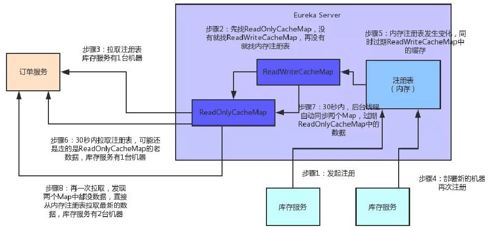

## 1.分布式存储

可以参考`HDFS`

要点：

```text
1.master slave集群部署
可以master存slave元数据，负责路由转发，slave存具体数据
2.保证高可用
数据需要设置多副本 es kafka都是这样做的
3.master与slave之间要设置心跳机制，slave宕机，副本不能访问的消息需要通知master，避免master将请求路由到这台slave机器上
4.副本数量维持动态统一
服务宕机，存在该机器上的数据丢失，此时副本需要复制，保证副本数统一
服务恢复，副本数量多了，此时要删除副本
```


## 2.Spring Cloud底层原理

`Spring Cloud`是微服务架构领域的全家桶式的技术栈。

主要组件包括`Eureka、Ribbon、Feign、Hystrix、Zuul`等组件。

### 2.1 Eureka

注册中心，专门负责服务的注册与发现。


库存服务、仓储服务、积分服务都有一个`Eureka Client`组件，这个组件专门负责把这个服务的信息注册到`Eureka Server`中。`Eureka Server`是一个注册中心，里面有一个注册表，保存了各服务所在的机器和端口号。

`Eureka`核心是服务注册表。涉及到两级缓存：`ReadOnly`缓存、`ReadWrite`缓存


步骤：

```text
1.服务注册进服务表，立马同步到ReadWrite缓存
2.ReadWrite缓存定时同步到ReadOnly缓存，同时会有一个后台线程定时检查两个缓存的数据，如果不一致需要做一些处理。
3.服务每隔30s会去ReadOnly缓存中拉取一次服务信息
```

**服务挂掉之后的处理方式：**


```text
1.删除服务注册表的服务B的ip，然后立刻清空ReadWrite缓存
2.但此时ReadOnly缓存还没更新，服务消费者还是能拿到服务B的机器(已经挂了)，所以每次请求都失败了
3.当线程定时任务查看到ReadOnly缓存、ReadWrite缓存有差异，立马清空ReadOnly缓存
4.服务消费者拉取注册表，发现ReadOnly缓存和ReadWrite缓存都是空的，会将注册表信息(此时只有一个服务A存活)同步到两个缓存中。
```

**eureka集群服务**


```text
eureka，peer-to-peer部署一个集群，但是集群里的每个机器地位是对等的，各个服务可以向任何一个eureka实例服务注册和服务发现，集群里任何一个eureka实例接收到写请求之后，会自动同步给其他所有的eureka实例。
```

**eureka自我保护机制**

```text
自我保护机制的工作机制是：如果在15分钟内超过85%的客户端节点都没有正常的心跳，那么Eureka就认为客户端与注册中心出现了网络故障，Eureka Server自动进入自我保护机制，此时会出现以下几种情况：
1.Eureka Server不再从注册列表中移除因为长时间没收到心跳而应该过期的服务。
2.Eureka Server仍然能够接受新服务的注册和查询请求，但是不会被同步到其它节点上，保证当前节点依然可用。
3.当网络稳定时，当前Eureka Server新的注册信息会被同步到其它节点中。

因此Eureka Server可以很好的应对因网络故障导致部分节点失联的情况，而不会像ZK那样如果有一半不可用的情况会导致整个集群不可用而变成瘫痪。

通过配置eureka.server.enableSelfPreservation来配置
```

#### 2.1.1 注册中心如何承载大型系统的千万级访问？

核心注册表结构：

```java
public abstract class AbstractInstanceRegistry implements InstanceRegistry {
    private final ConcurrentHashMap<String,Map<String,Lease<InstanceInfo>>> registry = new  ConcurrentHashMap<String,Map<String,Lease<InstanceInfo>>>();
}

1.map key是服务名称，比如说"inventory-service"
2.value代表一个服务的多个实例，这个map的key是服务实例的id，value是一个Lease类，泛型是InstanceInfo
InstanceInfo代表服务实例的具体信息，比如说机器ip地址、hostname以及端口号。
Lease，会维护每个服务最近一次发送心跳的时间
```

**多级缓存机制**

```text
避免同时读写内存数据结构造成的并发冲突问题，同时可以进一步提升服务请求的响应速度(纯内存操作，性能极高)

1.拉取注册表
1）首先从ReadOnly缓存中查缓存的注册表
2）若没有，就找Readwrite缓存中的注册表
3）若还没有，就从内存中获取实际的注册表数据

2.注册表表更
1）会在内存中更新变更的注册表数据，同时过期掉(清空)ReadWrite缓存，此过程不会影响ReadOnly缓存提供注册表
2）一段时间内(默认30s)，各服务拉取注册表会直接读ReadOnly缓存
3）30s过后，Eureka Server的后台线程发现ReadWrite缓存清空了，也会将ReadOnly缓存清空
4）下次有服务拉取注册表，又会从内存中获取最新的数据，同时填充各个缓存
```



承载方案：

```text
1.根据服务请求量优化拉取注册表时间间隔，发送心跳间隔
1）服务注册者发送心跳的时间间隔
eureka.leaseRenewIntervalInSeconds = 3 (设置成3s)

2）服务消费者从ReadOnly缓存中拉取注册表的时间间隔
eureka.client.registryFetchIntervalSeconds = 3 (设置成3s)

3）注册中心将ReadWrite缓存同步到ReadOnly缓存的时间间隔
eureka.server.responseCacheUpdateIntervalMs = 3000 (设置成3s)

4）注册中心检查注册表内服务提供者心跳的时间间隔
eureka.server.evictionintervalTimerInMs = 6000 (设置成6s)

5）注册中心检测到服务提供者多久没有心跳后，删除该服务提供者的时间间隔
eureka.instance.leaseExpirationDurationInSeconds = 9 (设置成9s)

6）关闭自我保护机制参数
eureka.server.enableSelfPreservation = false
2.注册表是纯内存的，保证了所有的请求都可以在内存处理，确保了极高的性能
3.多级缓存机制，确保不会针对内存数据结构发生频繁的读写并发冲突操作，进一步提升性能。
```

#### 2.1.2 读写锁在Eureka中的应用

多级缓存`ReadOnly`和`WriteOnly`。服务注册的`Java`代码类似：

```java
// 服务注册表
public class ServiceRegistry {
    // map key是服务名称，比如说"inventory-service" value代表一个服务的多个实例，这个map的key是服务实例的id，value是一个Lease类，泛型是InstanceInfo InstanceInfo代表服务实例的具体信息，比如说机器ip地址、hostname以及端口号。Lease，会维护每个服务最近一次发送心跳的时间
    private final ConcurrentHashMap<String,Map<String,Lease<InstanceInfo>>> registry = new  ConcurrentHashMap<String,Map<String,Lease<InstanceInfo>>>();
    // 针对注册表数据准备的读写锁
    private ReentrantReadWriteLock lock = new ReentrantReadWriteLock();
    private WriteLock writeLock = lock.writeLock();
    private ReadLock readLock = lock.readLock();
    
    //服务注册
    public void register() {
        writeLock.lock();
        // 将服务实例加入内存map registry中
        writeLock.unlock();
    }
	// 读取服务注册表
    public ConcurrentHashMap<String,Map<String,Lease<InstanceInfo>>> getRegistry() {
        readLock.lock();
        // 返回服务注册表数据
        readLock.unlock();
    }

}
```


### 2.1-2 Consul


```text
1.每个服务所在的机器上部署一个Consul Agent，作为一个服务所在机器的代理
2.多台机器上部署Consul Server，这就是核心的服务注册中心
3.Consul Agent收集服务信息发送给Consul Server，还会对你的服务不停的发送请求检查他是否健康
4.想发现别的服务，Consul Agent也会帮你转发请求给Consul Server，查询其他服务所在机器
```

**Consul Leader Server与Follower Server**

```text
基于Raft协议保障数据一致性。
1.服务注册到Leader Server的时候，会采取Raft协议，要求必须让Leader Server把这条注册数据复制给大部分的Follower Server才算成功。

2.如果你认为自己注册成功了，那么必然是多台Consul Server都有这条注册数据了。
如果你刚发送给Leader Server他自己就宕机了，那么这次注册会认为失败。
此时，Consul Server集群会重新选举一个Leader Server出来，你需要再次重新注册。
```

**服务健康检查**

```text
用的是每台机器上的Consul Agent，Consul Agent会不断发送请求检查服务是否健康，是否宕机，如果服务宕机，就会通知Consul Server。可以大幅度减小Server端压力。
```


### 2.2 Feign

基于`Feign`的动态代理机制，根据注解和选择的机器，拼接请求`URL`地址，发起请求。

```java
@FeignClient("inventory-service")
public class InventoryService {
    @RequestMapping(value = "/reduceStock/{goodsSkuId}")
    ...
}

// 原理
1.首先，如果你对某个接口定义了@FeignClient注解，Feign就会针对这个接口创建一个动态代理

2.接着你要是调用那个接口，本质就是会调用 Feign创建的动态代理，这是核心中的核心

3.Feign的动态代理会根据你在接口上的@RequestMapping等注解，来动态构造出你要请求的服务的地址

4.最后针对这个地址，发起请求、解析响应
```


### 2.3 Ribbon

负载均衡，每次请求时选择一台机器，均匀的把请求分发到各个机器上。

默认用的是`Round Robin`轮询算法。


### 2.4 Hystrix

线程隔离、服务降级、服务熔断。

原理：

```text
1.通过HystrixCommand或者HystrixObservableCommand来封装对外部依赖的访问请求，这个访问请求一般会运行在独立的线程中，资源隔离
2.对于超出我们设定阈值的服务调用，直接进行超时，不允许其耗时过长时间阻塞住，这个超时时间默认是99.5%的访问时间，但是一般我们可以自己设置一下
3.为每一个依赖服务维护一个独立的线程池，或者是semaphore，当线程池已满时，直接拒绝对这个服务的调用
4.对依赖服务的调用的成功次数、失败次数、拒绝次数、超时次数进行统计，如果对一个依赖服务的调用次数超过一定的阈值，自动进行熔断，在一定时间内对该服务的调用直接降级，一段时间后再自动尝试恢复
5.当一个服务调用出现失败，被拒绝，超时，短路等异常情况，自动调用fallback降级机制
6.对属性和配置的修改提供近实时的支持。
```


### 2.5 Zuul

网关，网络路由、统一的降级、限流、认证授权、安全等。


### 2.6 每秒上万并发下的Spring Cloud参数优化实战

低并发下架构


存在问题：

```text
1.单表数据量太大，几百万条
2.个别服务存在一大堆多表关联，没建好索引，写了上百行的大SQL
3.请求量大了之后，hystrix线程池可能对接单个服务就几十个线程，请求量大了可能每个服务都要好几秒才能返回
```

解决方案：

```text
1.数据库主从架构，分表分库
2.不要用上百行的大SQL，多表关联。数据库就执行简单的单表查询和更新，复杂的业务逻辑放在java系统里面
3.ribbon和hystrix超时时间(一般hystrix设置大一些)不能因为服务性能差就设置几秒甚至几十秒，一般超时定义在1s以内
4.要考虑网络偶尔抖动，在ribbon里面配合超时时间设置自动重试，这台机器重试不行，就考虑换一台
5.只要涉及重试，就必须做幂等：
1）数据库幂等建唯一索引，插入数据时如果唯一索引冲突就不能插入
2）redis存放唯一id值，每次插入通过redis判断一下
3）可以调用分布式id生成器，生成一个全局唯一id，保证幂等。
mongodb中就是这样设置唯一索引的。
```


### 2.7 微服务架构如何保证双11狂欢下的99.99%高可用？

最核心保证高可用的措施：

```text
1.基于Hystrix做资源隔离以及熔断
合理设置线程数：30请求  200ms --> 10个线程(30*0.2+4(buffer)，系统性能下降的时候留点线程可以hold住)
设置合理的超时时间：如果设置1s、2s，卡死的话需要更长时间来恢复，考虑请求平均200ms返回的话，可以设置超时时间为300ms，比较合理。
2.做备用降级方案
如果某个服务挂了，可以用hystrix走熔断器，走降级，需要考虑到各个服务的降级逻辑。
常见的降级例子：
1）如果查询数据的服务挂了，可以查本地的缓存
2）如果写入数据的服务挂了，可以先把这个写入操作记录日志到mysql或者MQ，后面再慢慢恢复
3）如果redis挂了，可以查mysql
4）如果mysql挂了，可以把操作日志记录到es里去，后面再慢慢恢复
```


### 2.8 电商系统TCC分布式事务的实现原理


可能存在订单已支付，但是扣减库存失败，此时需要引入`TCC`分布式事务。

```text
1.Try阶段
业务的主流程以及各个接口的业务含义是完成一个Try操作，一般是锁定某个资源，设置一个预备类的状态，冻结部分数据

2.Confirm阶段
Try阶段都成功以后可以执行Confirm阶段

3.Cancel阶段
如果Try阶段出现执行出错，就会执行Cancel逻辑，撤销之前执行的各种操作。
```

`TCC`分布式事务框架是如何保证之前没执行完的分布式事务继续执行的呢？

```text
TCC事务框架都是要记录一些分布式事务的活动日志的，可以在磁盘上的日志文件里记录，也可以在数据库里记录。保存下来分布式事务运行的各个阶段和状态。
```

万一某个服务的`Cancel`或者`Confirm`逻辑执行一直失败怎么办呢？

```text
TCC事务框架会通过活动日志记录各个服务的状态
如果Cancel或Confirm一直失败会不停的重试调用逻辑，务必要他成功！
```


### 2.9 最终一致性分布式事务如何保障实际生产中99.99%高可用？


核心流程：

```text
1.上游服务投递消息
自己可以写一个可靠消息服务，实现一些业务逻辑：
1）上游服务需要发送一条消息给可靠服务
2）可靠消息服务就得把这条消息存储到自己的数据库里去，状态为待确认
3）上游服务可以执行自己本地的数据库操作，根据自己的执行结果，再次调用可靠消息服务的接口，如果本地成功，找可靠消息服务确认消息，如果本地数据库操作失败，找可靠消息服务删除那条消息
4）如果是确认消息，那么可靠消息服务就把数据库的消息状态更新为已发送，同时将消息发给MQ(这俩操作必须是本地事务的)

保证100%投递成功：
1）上游服务给可靠消息服务发送待确认消息过程失败，上游服务可以感知到调用异常，不再执行下面的流程，没问题
2）没通知成功、没执行成功、可靠消息服务没成功的投递消息到MQ，那条消息在可靠服务的数据库里的状态会一直是待确认，可以在后台起一个定时运行的线程，不停的检查各个消息的状态，如果是待确认，会去回调相关接口找到问题，使消息务必处理成功

2.下游服务接受消息
一直等着从MQ中消费消息即可，如果消费到了消息，就操作本地数据库，操作成功就反过来通知可靠消息服务，说自己成功了，然后可靠消息就会把消息的状态设置为已完成。

保证下游服务对消息的100%可靠接受：
1）在可靠消息服务开发一个后台线程，不断检查消息状态
如果消息状态是已发送，没有变成已完成，说明下游服务始终没有处理成功，此时可靠消息服务就可以再次尝试重新投递消息到MQ，让下游服务来再次处理。
只要下游服务的接口实现幂等性，保证多次处理一个消息，不会插入重复数据即可。

3.MQ服务不宕机
一般MQ可以保证99.9999%的可用，但是一旦完全不可用，就会导致业务系统整体故障

此时可以做高可用降级！
```


```text
1.自行封装MQ客户端组件与故障感知
2.基于kv存储队列的降级方案
如果MQ挂掉之后，要么希望继续投递消息，那么必须得找一个MQ的替代品
可以基于redis的队列(list数据结构)来替代，但是要注意：
1）任何kv存储的集合类数据结构，建议不要往里面写入数据量过大，否则会导致大value的情况发生，引发严重的后果。
2）绝对不能往少数key对应的数据结构中持续写入数据，那样会导致热key的产生，也就是某几个key特别热。
所以设计方案：
1）在kv存储中固定划分上百个队列，有上百个key对应。
2）这样保证每个key对应的数据结构中不会写入过多的消息，而且不会频繁的写少数几个key。
3）一旦发生了MQ故障，可靠消息服务可以对每个消息通过hash算法，均匀的写入固定好的上百个key对应的kv存储的队列中。
3.下游服务消费MQ的降级感知
自行封装组件来处理，组件从zk感知到降级开关打开
1）首先判断自己是否还能继续从MQ消费到数据，
2）如果不能，就开启多个线程并发的从kv存储的各个预设好的上百个队列中不断获取数据
4.故障的自动恢复
降级开关打开，自行封装的组件需要开启一个线程，每隔一段时间尝试给MQ投递一个消息看看是否恢复了
如果MQ已经恢复可以正常投递消息，此时zk关闭降级开关，然后可靠消息服务继续投递消息到MQ
下游服务在确认kv存储的各个队列中已经没有数据之后，重新切回MQ消费消息
```

### 2.10  Redis Redission分布式锁原理

```text
1.比如说苹果这个商品的id是1
redisson.lock("product_1_stock")
key的业务语义，就是针对product_id=1的商品的库存，也就是苹果的库存进行加锁

在redis中存的内容大概是：
product_1_stock: {
    "xxxxx":1  # xxx redis客户端生成的id  1表示当前已经有人加过一次锁了
}
过期时间是30s

2.加锁成功，redis客户端会启动一个watchdog，每隔10s去检查一下这个锁是否还被当前客户端持有，如果是的话，重新刷新一下key的存活时间为30s

3.其他客户端尝试加锁，这个时候发现"product_1_lock"这个key已经存在，里面显示被别的客户端加锁了，此时他就会陷入一个无限循环，阻塞住自己，不能干任何事，必须在这里等待

4.第一个客户端加锁成功了，此时有两种情况：
1）这个客户端操作完毕之后，主动释放锁
2）如果这个客户端宕机了，那么这个客户端的redisson框架之前启动的后台watchdog线程就没了，此时最多30s，key-value消失，自动释放了宕机客户端之前持有的锁。

5.锁释放掉了，其他客户端可以继续尝试加锁，此时有一个客户端加锁成功
product_1_stock: {
    "yyyyy": 1 # id与之前的不同
}
```

从`lua`脚本来分析：

```text
"if (redis.call('exists',KEYS[1]) == 0) then" +
	"redis.call('hset',KEYS[1],ARGV[2],1);" +
	"redis.call('pexpire',KEYS[1],ARGV[1]);" +
	"return nil;" +
	"end; " +
"if (redis.call('hexists',KEYS[1],ARGV[2]) == 1) then " +
    "redis.call('hincrby',KEYS[1],ARGV[2],1);" +
    "redis.call('pexpire',KEYS[1],ARGV[1]);" +
    "return nil;" +
 "end; " +
 "return redis.call('pttl',KEYS[1]);"

# 参数说明
KEYS[1]代表的是你加锁的那个key，比如说：
RLock lock = redisson.getLock("myLock");
这里你自己设置了加锁的那个锁key就是“myLock”。

ARGV[1]代表的就是锁key的默认生存时间，默认30秒。

ARGV[2]代表的是加锁的客户端的ID，类似于下面这样：
8743c9c0-0795-4907-87fd-6c719a6b4586:1

1.加锁
先判断存不存在锁“myLock”，如果不存在，hset myLock 8743c9c0-0795-4907-87fd-6c719a6b4586:1加锁，pexpire myLock 30000 设置生存时间30s

2.锁互斥
客户端2来加锁，第一个if判断，“myLock”锁存在，走第二个if，判断一下myLock锁中的key的hash结构是否包含客户端2的ID，明显不是，客户端2会获取pttl myLock key的剩余时间，比如说还剩15000ms，此时客户端2会进入一个while循环，不停的尝试加锁

3.watch dog自动延期机制
只要客户端1一旦加锁成功，就会启动一个watch dog看门狗，他是一个后台线程，会每隔10秒检查一下，如果客户端1还持有锁key，那么就会不断的延长锁key的生存时间。

4.可重入加锁机制
第一个if判断不成立，锁key已经存在；第二个if判断会成立，因为myLock的hash数据结构包含的ID是一样的，此时可以执行可重入加锁逻辑 incrby myLock 8743c9c0-0795-4907-87fd-6c71a6b4586:1 1，锁次数累加

5.释放锁机制
调用lock.unlock()，myLock加锁次数减一，如果发现加锁次数是0，客户端不再持有锁，此时就会执行del myLock，从redis里删除这个key
客户端2可以尝试加锁
```

存在问题：

```text
比如采用的单个master的redis，一个slave节点，配置了哨兵机制。由于redis同步数据是异步的，此时如果master挂了，而slave节点并没有该锁信息。所以：这种方案在redis的master节点挂了后，slave节点变成master节点，客户端发送请求过来此时也可以加锁成功，导致出现同一把锁被两个客户端同时持有。

解决方案：redis master slave都需要加锁成功才可以。需要源码级的修改。
```

**zookeeper**

```text
一般采用curator来实现分布式锁，原理：
1）向zk发起请求，在一个目录(/locks/pd_1_stock)下，创建一个临时节点，也是带有自己客户端的id；
2）如果目录是空的，自己创建出来的节点就是第一个节点，那么加锁成功。
3）第二个客户端请求锁时，也创建一个节点，如果不是第一节点，那么向上一节点加一个watcher监听器。如果上一个节点被删除立马会感知到，然后在判断自己是不是第一节点，如果不是再监听上一级(公平锁实现)。完事后陷入等待，直到获取锁。
4）如果宕机，基于zk的心跳机制，临时节点也会被删除。
```

**分布式锁对比**

```text
redis锁：
其实需要自己不断尝试获取锁，比较耗费性能。而且依赖redis cluster，算法本身争议比较大。

zookeeper锁：
1.获取不到锁，就加个监听器，不需要不断主动尝试获取锁，性能开销小
2.因为zk创建的是临时节点，如果zk挂了，znode就没了，锁自动释放了。但是redis如果获取锁的那个客户端挂了，只能等待超时时间之后才能释放锁。 
```


### 2.11  每秒上千订单场景下的分布式锁高并发优化实践

超卖情况，多线程并发扣减库存，导致库存出现负数。

用分布式锁解决库存超卖问题：

同一个锁key，同一时间只能有一个客户端拿到锁，其他客户端会陷入无限的等待来尝试获取那个锁，只有获取到锁的客户端才能执行下面的业务逻辑：

```java
Rlock lock = redisson.getLock("iphone_stock");
// 只有一个客户端可以成功加锁，继续往下运行
lock.lock();

// 执行数据库业务逻辑，先查出来iphone的库存，跟购买数量比较下，如果库存充足就下单扣减库存
Long goodStock = stockDAO.getByGoodsId(iphoneGoodsId);

if(goodsStock > purchaseCount) {
    orderDAO.create(order);
    stockDAO.reduceStock(iphoneGoodsId,purchaseCount);
}

// 释放锁，其他客户端可以尝试加锁
lock.unlock();
```

存在问题：

分布式锁串行化处理，导致没法同时处理同一个商品的大量下单请求。

分段加锁+优化合并。


## 3 亿级流量系统架构

### 3.1 如何支撑百亿级数据的存储与计算


数据库`binlog`采集中间件（`canel`）将数据同步到数据平台自己的`MySQL`库里。

存在问题：`MySQL`单表涌入数据太多，数据量会迅速膨胀，导致数据平台卡死。

优化1：将离线计算与实时计算进行拆分


离线计算链路

实时计算链路：本地存储可以只保留当天一天的数据，大幅度降低要在`MySQL`中存储的数据量

**优化2**：数据平台核心系统压力过大，必须要自己定制开发自己的一套平台系统架构

**优化3**：单台数据库服务器存储不下当天的数据，需要进行分表分库

**优化4**：如果对每个数据库服务器又是读又是写，会导致数据库服务器的`CPU`负载和`IO`负载非常的高。需要对`MySQL`做读写分离


**优化5**：离线计算链路数据清洗只清洗增量数据


### 3.2 如何设计高容错分布式计算系统

避免单点故障。


1.可以基于`Zookeeper`做`active-standby`架构

2.可以设计`Master-Slave`架构

```text
将任务调度与任务计算两个职责进行分离，有一个专门的Master节点负责读取切分好的数据分片（也就是所谓的时间窗口，一个窗口就是一个数据分片），然后将各个数据分片的计算任务分发给多个Slave节点。

Master防止单点故障，可以采用上面的Active-Standby架构
```

3.弹性计算资源调度机制，对资源进行均衡利用

`Slave`机器可能会积压大量的计算任务一直得不到处理，主要是：

```text
1.系统高峰和低谷数据差异
2.几百行到上千行的复杂SQL落地到MySQL从库中执行计算，高峰期导致服务器CPU负载、IO负载都很高
3.不同的SQL执行效率不同
```

可以在`Master`节点中加入计算任务`metrics`上报、计算任务耗时预估、任务执行状态机天空、机器资源管理、弹性资源调度等机制。

效果：

```text
1.Master节点会实时感知到各个机器的计算任务执行情况、排队负载压力、资源使用等情况。
2.同时还会收集各个机器的计算任务的历史metrics
3.接着会根据计算任务的历史metrics、预估当前计算任务的耗时、综合考虑当前各Slave机器的负载，来将任务分发给负载较低的Slave机器
```

4.高容错机制


系统在线上运行可能产生的问题：

```text
1.某个Slave节点在执行过程中突然宕机
2.某个计算任务执行时间过长
3.某个计算任务执行失败
```

`Master`节点针对`Slave`节点计算任务调度的容错机制：

```text
1.Master节点会监控各个计算任务的执行状态，同时也会监控各个Slave节点的运行状态

2.如果说某个Slave宕机了，那么此时Master就会将那个Slave没执行完的计算任务重新分配给其他的Slave节点

3.如果说某个Slave的计算任务执行失败了，同时重试几次之后还是失败，那么Master会将这个计算任务重新分配给其他的Slave节点来执行

4.如果说某个计算任务在多个Slave中无法成功计算的话，此时会将这个计算任务储存在一个延时内存队列中，间隔一段时间过后，比如说等待高峰期过去，然后再重新尝试执行这个计算任务

5.如果某个计算任务等待很长时间都没成功执行，可能是hang死了，那么Master节点会更新这个计算任务的版本号，然后分配计算任务给其他的Slave节点来执行。

之所以要更新版本号，是为了避免说，新分配的Slave执行完毕写入结果之后，之前的那个Slave hang死了一段时间恢复了，接着将计算结果写入存储覆盖正确的结果。用版本号机制可以避免这种情况的发生。
```


### 3.3 如何设计承载百亿流量的高性能架构


1.计算与存储分开

存在`MySQL`库中，表中数据很大，但是每次计算其实只需要很小一部分数据计算即可。

思路：

```text
1.数据直接写入一个存储，仅仅只是简单的写入即可

2.然后在计算的时候从数据存储中提取你需要的那个数据分片里的可能就一两千条数据，写入另外一个专用于计算的临时表中，那个临时表内就这一两千条数据

3.然后运行你的各种复杂SQL即可。
```

存储可以用分布式`KV`存储系统（`hbase`）。设计一些简单的`kv`操作，大量的依托于内存缓存热数据来支持高并发的写入和读取。同等的机器资源条件下，`kv`存储对高并发的支撑能力至少是`MySQL`的数倍甚至数十倍。

2.自研纯内存的`SQL`计算引擎，彻底消除对`MySQL`的依赖

3.`MQ`削峰以及流量控制

高并发非实时响应的写入请求，完全可以使用`MQ`中间件先抗住海量的请求，接着做一个中间的流量分发系统，将流量异步转发到kv存储中去，同时这个流量分发系统可以对高并发流量进行控制。

4.数据动静分离

`Slave`节点都是对一个数据分片提取相关联的各种数据出来然后进行计算，其实是没必要的！

例如：如果你的`SQL`要对一些表进行关联计算，里面涉及到了一些大部分时候静态不变的数据，那些表的数据一般很少改变，因此没必要每次都走网络请求从`kv`存储里提取那部分数据。

可以：在`Slave`节点对这种静态数据做个轻量级的`cache`，然后只有数据分片里对应的动态改变的数据才从`kv`存储来提取数据。


### 3.4 如何设计每秒十万查询的高并发架构

1.分表分库+读写分离

```text
1.分库后，每台主库可以承载部分写入压力，单库的写并发会降低；其次就是单个主库的磁盘空间可以降低负载的数据量，不至于很快就满了；
2.分表后，单个数据表的数据量可以降低到百万级别，这个是支撑海量数据以及保证高性能的最佳实践，基本两三百万的单表数据量级还是合理的；
3.读写分离之后，就可以将单库的读写负载压力分离到主库和从库多台机器上去，主库就承载写负载，从库就承载读负载，这样避免单库所在机器的读写负载过高，导致CPU负载、IO负载、网络负载过高，最后搞得数据库机器宕机。
```

2.数据的冷热分离

将今日实时计算出来的热数据放在一个MySQL集群里，将离线计算出来的冷数据放在另外一个MySQL集群里。

3.查询的话可以自研Elasticsearch+HBase+纯内存的查询引擎

将冷数据全部采用ES+HBase来进行存储，ES中主要存放要对冷数据进行筛选的各种条件索引，比如日期以及各种维度的数据，然后HBase中会存放全量的数据字段。

```text
先决条件：如果要做到对冷数据全部是单表类的数据集查询，必须要在冷数据进入NoSQL存储的时候，全部基于ES和HBase的特性做到多表入库关联，进数据存储就全部做成大宽表的状态，将数据关联全部上推到入库时完成，而不是在查询时进行。

步骤：
1.对冷数据的查询，我们自研的SQL引擎首先会根据各种where条件先走ES的分布式高性能索引查询，ES可以针对海量数据高性能的检索出来需要的那部分数据，这个过程用ES做是最合适的。
2.接着就是将检索出来的数据对应的完整的各个数据字段，从HBase里提取出来，拼接成完成的数据。
3.然后就是将这份数据集放在内存里，进行复杂的函数计算、分组聚合以及排序等操作。
```

4.实时数据存储引入缓存架构

引入了一个缓存集群，实时数据每次更新后写入的时候，都是写数据库集群同时还写缓存集群的，是双写的方式。

然后查询的时候是优先从缓存集群来走，此时基本上90%以上的高并发查询都走缓存集群了，然后只有10%的查询会落地到数据库集群。


总结：

```text
1.热数据基于缓存集群+数据库集群来承载高并发的每秒十万级别的查询
2.冷数据基于ES+HBase+内存计算的自研查询引擎来支撑海量数据存储以及高性能查询
```


### 3.5 如何设计全链路99.99%高可用架构？

1.MQ集群的高可用保障方案

异步转同步+限流算法+限制性丢弃流量

```text
多次数据无法写入MQ集群 --> 触发降级策略，数据发送到流控集群 --> 流控集群加了限流算法，一旦超过阈值直接采取丢弃的策略
```

2.KV集群高可用保障方案

临时扩容Slave集群 + 小时级数据粒度 + 内存级分片存储。

```text
一旦kv集群故障立即报警 --> 手动扩容N倍的Slave计算集群，同时会手动打开流控集群的一个降级开关，然后流控集群会直接按照预设的hash算法分发数据到各个Slave计算节点，不走kv集群

数据量太大，降级可以将Slave集群只保存最近一小时的数据
```

3.实时计算链路高可用保障方案

计算任务分配+主备切换机制

4.热数据高可用保障方案

自研缓存集群查询引擎 + JVM本地缓存 + 限流机制

```text
MySQL集群故障：实时计算结果直接写入缓存数据，但是缓存数据量远没有MySQL集群大，可能导致部分用户看不到数据
缓存集群故障：可以使用本地ehcache缓存
```

5.冷数据高可用保障方案

收集查询日志+离线日志分析+缓存高频查询

冷数据存`ES/Hbase`，这个高可用保障不在这里做，复杂度太高。这里采用的方案：

```text
1.对最近一段时间用户发起的离线查询的请求日志进行收集，
2.然后对请求日志在每天凌晨进行分析，分析出来那种每个用户会经常、多次、高频发起的冷数据查询请求，
3.然后对这个特定的查询（比如特殊的一组条件，时间范围，维度组合）对应的结果，进行缓存。
```


### 3.6 如何在上万并发场景下设计可扩展架构？


两个不同系统之间，通过同一套数据存储（数据库集群+缓存集群）进行耦合。


```text
1.系统A高并发导致数据库CPU、IO负载很高，系统B跟他共用一个数据库集群，被动高并发
2.数据库运维操作导致线上系统性能的剧烈抖动
3.承担不同任务的同学需要排查不属于自己业务范围的bug
```

1.引入消息中间件解耦、削峰填谷，支持多系统同时订阅消息

2.手动流量开关配合数据库运维操作


### 3.7 如何保证百亿流量下的数据一致性？

数据不一致的场景：

```text
1.数据链路上某个环节出错，比如说电商系统扣减库存失败，但是前面的订单状态显示已支付
2.分布式系统数据多副本机制，某个副本跟其他副本不一致
```

解决场景1方案：

**1.核心数据的监控链路、数据链路追踪、自动化数据链路分析**

比如在这种数据类的系统里，很可能对数据指标A的监控逻辑是如下这样的：

```text
数据指标A = 数据指标B + 数据指标C - 数据指标D * 24
```

每个核心指标都是有自己的一个监控公式的，这个监控公式，就是负责开发实时计算平台的同学，他们写的数据计算逻辑，是知道数据指标之间的逻辑关系的。

此时有个非常简单的思路：

```text
1.首先，这个数据监控系统从MQ里消费到每一个最新计算出来的核心数据指标
2.然后根据预先定义好的监控公式，从数据查询平台里调用接口获取出来公式需要的其他数据指标
3.接着，按照公式进行监控计算。
```

电商系统中库存数据也可以采用类似监控。

库存逻辑：虚拟库存+预售库存+冻结库存+可销售库存=总可用库存数

可以采用`MySQL binlog`采集的技术，直接用`MySQL binlog`同步中间件来监控数据库中库存数据涉及到的表和字段。


百亿流量下的数据链路追踪，用`elasticsearch`技术来做这种数据链路的存储。

```text
1.数据计算过程中涉及到的各个服务，都需要对核心数据的处理发送一条计算链路日志到数据链路追踪系统。

2.然后，数据链路追踪系统就可以把计算链路日志落地到存储里去，按照一定的规则建立好对应的索引字段。

举个例子，索引字段：核心数据名称，核心数据id，本次请求id，计算节点序号，本次监控结果，子系统名称，服务名称，计算数据内容，等等。
```


## 4.系统架构引入消息中间件有什么缺点？

1.系统可用性降低

多了一个组件，多了一个依赖，就会导致系统的可用性降低

复杂的高可用的场景下，你还要考虑如果`MQ`一旦挂了以后，你的系统有没有备用兜底的技术方案，可以保证系统继续运行下去。

2.系统稳定性降低

消息丢失，消息重复消费，消息积压

3.分布式一致性问题

系统A处理本地数据库成功，发送一个消息给MQ，系统B确实消费到了，但是系统B操作本地数据库失败，导致系统争议数据不一致。此时需要使用可靠消息最终一致性分布式方案来保障。


### 4.1 消息中间件宕机的解决方案

一般的降级方案：

```text
一旦MQ中间件故障，系统立马就会把核心数据写入本地磁盘文件
(数据埋点也采用的这种方案)
```

高并发情况下，接收到数据就写本地磁盘性能极其差。

采用：内存双缓冲+批量刷磁盘

```text
系统接收到一条消息就会立马写内存缓冲，然后开启一个后台线程把内存缓冲的数据刷新到磁盘上去。
内存缓冲设计时，分为两个区域：
1）current区域，用来供系统写入数据
2）ready区域，用来供后台线程刷新数据到磁盘里去
每块内存区域设置的缓存大小尽量大一点，比如说10MB，避免因为缓冲区不够大导致线程卡死。
```


### 4.2 如何保证消息中间件全链路数据100%不丢失

```text
1.生产者 ack机制，数据写入leader follower副本之后再返回ack
丢失的原因：
1）消息在网络传输到一半的时候因为网络故障丢了
2）消息投递到MQ的内存时，MQ突发故障导致消息就丢失了

采用轻量级的confirm机制。
1）kv存储未ack消息
2）投递消息之后等待ack的过程必须是异步的，针对每个消息的异步回调，是通过在channel注册一个confirm监听器实现的。


2.MQ数据持久化
3.消费者先消费再提交offset，消息重复可使用幂等
```


### 4.3 百万并发中间件系统的内核设计看Java并发性能优化

双缓冲机制

```text
1.先写一块缓冲区，写满之后，交换两块缓冲区(1块满数据，1块空的)
2.开启一个线程将写满的缓冲区数据刷写到磁盘文件
```

代码：

```java
// 任何一个线程，想要写内存缓冲，必须先加锁才可以
// 但是可以从一个内存缓冲分片中随机挑选一个，自动负载均衡
DoubleBuffer doubleBufferSlice = doubleBuffers.chooseRandom();

// 这里加锁，仅仅对一个内存缓冲分片加锁，这样就可以大幅度提升锁的数量
// 同时大幅度降低线程对同一把锁的争用
synchronized(doubleBufferSlice) {
    // 对双段缓冲写入数据，此时会写入缓冲区1中
    doubleBufferSlice.write(data);
    
    // 判断一下加入一块缓冲区是否写满了，每块缓冲区大小都是限定好的，比如说只能放20MB的数据
    if(doubleBufferSlice.isFull()) {
        // 交换一下两块缓冲区，让缓冲区2提供写入服务
        doubleBufferSlice.exchange();
    }
}
// 下面的代码就是将缓冲区1的数据刷写到磁盘文件里去，操作比较耗时，不能占用锁
doubleBufferSlice.flush();
```


### 4.4 如何设计一个消息中间件？

核心要点：高可用、高并发、海量消息、可伸缩

```text
1.注册中心、Producer、Consumer都是集群化部署，挂一台没关系
2.broker可以有选举机制实现slave到master自动切换，影响也不太大
3.数据集合topic可以分布式存储到多个partition，存储海量数据
4.broker可以伸缩，能抗更高的并发。
```

对照`kafka`

```text
1.注册中心zookeeper，里面注册了kafka的broker节点信息
2.选举
1）控制器的选举，选举一个broker称为控制器(Kafka Controller)，它负责管理整个集群中所有分区和副本的状态等工作。选举leader副本、ISR集合发生变化，由控制器负责所有broker更新其元数据信息。
2）分区leader的选举，由控制器执行，按照AR集合中副本的顺序查找第一个存活的副本，并且这个副本在ISR集合中。
3）消费者相关的选举，组协调器GroupCoordinator需要为消费组内的消费者选举出一个消费组的leader，算法：
如果没有，就用第一个加入消费组的消费者作为leader，如果leader宕机，随机找一个
3.topic分成多个partition
这样可以横跨多个broker，提高并发能力。同时数据存储，用的是磁盘存储，但是用了页缓存和顺序读写。
4.broker可以伸缩
一般就是加机器，把broker信息注册进zookeeper中即可。
注意：zookeeper里面的broker信息只有主节点有。
5.支持数据不丢失的ack机制：生产者和消费者都必须要有
```

### 4.5 kafka producer发送流程


```text
1.初始化以及真正发送消息的 kafka-producer-network-thread IO 线程。
2.将消息序列化。
3.得到需要发送的分区。
4.写入内部的一个缓存区中。
5.初始化的 IO 线程不断的消费这个缓存来发送消息。
```

源码分析流程：

```java
// 一、初始化
Properties props = new Properties();
props.put("bootstrap.servers", "120.27.71.78:9092,120.27.71.78:9093,120.27.71.78:9094");//xxx服务器ip
props.put("acks", "all");//所有follower都响应了才认为消息提交成功，即"committed"
props.put("retries", 0);//retries = MAX 无限重试，直到你意识到出现了问题:)
// 对构造方法初始化
producer = new KafkaProducer<String, String>(props);

// KafkaProducer.class L183 启动一个Sender线程进行缓冲区消费
// acks retries都需要    
this.sender = new Sender(logContext, (KafkaClient)client, this.metadata, this.accumulator, maxInflightRequests == 1, config.getInt("max.request.size"), acks, retries, metricsRegistry.senderMetrics, Time.SYSTEM, this.requestTimeoutMs, config.getLong("retry.backoff.ms"), this.transactionManager, this.apiVersions);
String ioThreadName = "kafka-producer-network-thread | " + clientId;
this.ioThread = new KafkaThread(ioThreadName, this.sender, true);
this.ioThread.start();

// 二、序列化消息
// KafkaProducer.class L341 序列化消息
private Future<RecordMetadata> doSend(ProducerRecord<K, V> record, Callback callback) {
    ...
 	byte[] serializedValue;
    try {
        // 是一个接口，需要初始化时候指定序列化实现类 类似：org.apache.kafka.common.serialization.IntegerSerializer
        serializedValue = this.valueSerializer.serialize(record.topic(), record.headers(), record.value());
    } catch (ClassCastException var17) {
        throw new SerializationException("Can't convert value of class " + record.value().getClass().getName() + " to class " + this.producerConfig.getClass("value.serializer").getName() + " specified in value.serializer", var17);
   ...
            }   
}

// 三、路由分区
// 1.指定分区
public ProducerRecord(String topic, Integer partition, Long timestamp, K key, V value, Iterable<Header> headers) {
    if (topic == null) {
        throw new IllegalArgumentException("Topic cannot be null.");
    } else if (timestamp != null && timestamp < 0L) {
        throw new IllegalArgumentException(String.format("Invalid timestamp: %d. Timestamp should always be non-negative or null.", timestamp));
    } else if (partition != null && partition < 0) {
        throw new IllegalArgumentException(String.format("Invalid partition: %d. Partition number should always be non-negative or null.", partition));
    } else {
        this.topic = topic;
        this.partition = partition;  // 指定分区
        this.key = key;
        this.value = value;
        this.timestamp = timestamp;
        this.headers = new RecordHeaders(headers);
    }
}

// 在路由时会判断是否有指定，有就直接使用该分区
private int partition(ProducerRecord<K, V> record, byte[] serializedKey, byte[] serializedValue, Cluster cluster) {
        Integer partition = record.partition();
        return partition != null ? partition : this.partitioner.partition(record.topic(), record.key(), serializedKey, record.value(), serializedValue, cluster);
    }

// 2.自定义路由策略
// 实现 this.partitioner.partition中的Partitioner接口
public interface Partitioner extends Configurable, Closeable {
    int partition(String var1, Object var2, byte[] var3, Object var4, byte[] var5, Cluster var6);

    void close();
}

// 3.默认策略，典型的轮询算法
// 1)获取Topic分区数 2)将内部维护的一个线程计数器+1 3）与分区取模得到分区编号
public class DefaultPartitioner implements Partitioner {
    private final ConcurrentMap<String, AtomicInteger> topicCounterMap = new ConcurrentHashMap();

    public DefaultPartitioner() {
    }

    public void configure(Map<String, ?> configs) {
    }

    public int partition(String topic, Object key, byte[] keyBytes, Object value, byte[] valueBytes, Cluster cluster) {
        List<PartitionInfo> partitions = cluster.partitionsForTopic(topic);
        int numPartitions = partitions.size();
        if (keyBytes == null) {
            int nextValue = this.nextValue(topic);
            List<PartitionInfo> availablePartitions = cluster.availablePartitionsForTopic(topic);
            if (availablePartitions.size() > 0) {
                int part = Utils.toPositive(nextValue) % availablePartitions.size();
                return ((PartitionInfo)availablePartitions.get(part)).partition();
            } else {
                return Utils.toPositive(nextValue) % numPartitions; // 轮询算法
            }
        } else {
            return Utils.toPositive(Utils.murmur2(keyBytes)) % numPartitions;
        }
    }

    private int nextValue(String topic) {
        AtomicInteger counter = (AtomicInteger)this.topicCounterMap.get(topic);
        if (null == counter) {
            counter = new AtomicInteger(ThreadLocalRandom.current().nextInt());
            AtomicInteger currentCounter = (AtomicInteger)this.topicCounterMap.putIfAbsent(topic, counter);
            if (currentCounter != null) {
                counter = currentCounter;
            }
        }

        return counter.getAndIncrement();
    }

    public void close() {
    }
}

// 四、写入内部缓存
// KafkaProducer.class L388
RecordAppendResult result = this.accumulator.append(tp, timestamp, serializedKey, serializedValue, headers, interceptCallback, remainingWaitMs);
if (result.batchIsFull || result.newBatchCreated) {
    this.log.trace("Waking up the sender since topic {} partition {} is either full or getting a new batch", record.topic(), partition);
    this.sender.wakeup();
}

// append方法里面有getOrCreateDeque方法，写入到一个内部缓存
private Deque<ProducerBatch> getOrCreateDeque(TopicPartition tp) {
    Deque<ProducerBatch> d = (Deque)this.batches.get(tp);
    if (d != null) {
        return d;
    } else {
        Deque<ProducerBatch> d = new ArrayDeque();
        Deque<ProducerBatch> previous = (Deque)this.batches.putIfAbsent(tp, d);
        return (Deque)(previous == null ? d : previous);
    }
}

// 五、消费缓存
// 初始化线程是后台线程，发送数据 sendProduceRequest方法
// handleProduceResponse方法
```

**Kafka中缓冲池机制**

当一个Batch被发送到了kafka服务器，这个Batch的数据不再需要了，就意味着这个Batch的内存空间不再使用了。

正常处理逻辑是触发`JVM GC`不断去回收这些垃圾，但是`GC`需要`Stop the World`，因此应尽量避免`GC`。

`Kafka`中使用了缓冲池的概念，`Batch(default:16kb)`用完就放在缓冲池（`BufferPool`）里面，下次需要就再取出来。


## 5.缓存架构

### 5.1 缓存热点数据

比如说：20万请求同时访问一个热点缓存。

解决方案：

1.热点数据提前发现，加载到本地缓存

```text
1.基于流式计算技术的缓存热点自动发现
基于大数据领域的流式计算技术来进行实时数据访问次数的统计，比如storm、spark streaming、flink等，一旦在实时数据访问次数统计的过程中，比如发现一秒之内，某条数据突然访问次数超过1000，就直接立马把这条数据判定为热点数据，可以将这个发现出来的热点数据写入比如zookeeper中

2.热点缓存自动加载为JVM本地缓存
zookeeper指定的热点缓存对应的znode进行监听，如果有变化他立马就可以感知到了。
系统层可以将相关的缓存数据从数据库加载出来，直接放在自己系统内部的本地缓存：ehcache、hashmap等
让热点请求数据直接请求到机器
```


2.限流熔断保护

保护后面的缓存集群、数据库集群之类的不被打死。


### 5.2 高并发场景下缓存处理的一些思路

#### 1.Cache Aside

**缓存命中**

当查询的时候发现缓存存在，那么直接从缓存中提取。

**缓存失效：**

当缓存没有数据的时候，则从database里面读取源数据，再加入到cache里面去。


**缓存更新：**

当有新的写操作去修改database里面的数据时，需要在写操作完成之后，让cache里面对应的数据失效。


缺点：

高并发下可能出现不一致的场景：

```text
缓存刚好失效 --> 线程A查询数据库，得一个旧值 --> 线程B将新值写入数据库 --> 线程B删除缓存 --> 线程A将查到的旧值写入缓存。
```

**删除缓存失败的解决思路**：

```text
1.将需要删除的key发送到消息队列中
2.自己消费消息，获取需要删除的key
3.不断重试删除操作，直到成功
```

#### 2.Read Through

指应用程序始终从缓存中请求数据。如果缓存没有数据，则它负责使用底层提供程序插件从数据库中检索数据。检索数据后，缓存会自行更新并将数据返回给调用应用程序。

```text
好处：
我们总是使用key从缓存中检索数据, 调用的应用程序不知道数据库， 由存储方来负责自己的缓存处理，这使代码更具可读性， 代码更清晰。
坏处：
开发人员需要给编写相关的程序插件，增加了开发的难度性。
```

#### 3.Write Through

当数据发生更新的时候，先去Cache里面进行更新，如果命中了，则先更新缓存再由Cache方来更新database。如果没有命中的话，就直接更新Cache里面的数据。


#### 4.Write Behind Caching模式

Write Behind Caching 这种模式通常是先将数据写入到缓存里面，然后再异步的写入到database中进行数据同步

```text
好处：
1）可以直接的减少我们对于数据的database里面的直接访问，降低压力，
2）对于database的多次修改可以进行合并操作，极大的提升了系统的承载能力。
坏处：
有一定风险，当cache机器出现宕机时，数据会有丢失的可能。
```


### 5.3 Redis发生高延迟，到底发生了什么？

`Redis`一条命令执行过程：


常见造成延迟的原因：

```text
网络连接限制、网络传输速率、CPU性能(所有服务端都可能产生的性能问题)
```

`Redis`独有的可能造成高延迟的原因：

```text
命令、数据结构误用、持久化阻塞、内存交换

而且，Redis采用单线程和事件驱动的机制来处理网路请求，分别有对应的连接应答处理器、命令请求处理器、命令恢复处理器来处理客户端的网络请求事件，处理完一个事件就继续处理队列中的下一个。
一条命令处理出现了高延迟会影响接下来处于排毒状态的其他命令。
```

1.`Redis`慢查询

```text
# 超过slowlog-log-slower-than 阈值的命令都会被记录到慢查询队列中
# 队列最大长度为slowlog-max-len
slowlog-log-slower-than 10000
slowlog-max-len 128
```

执行 slowlog get {n} 命令可以获取最近的 n 条慢查询命令，默认对于执行超过10毫秒(可配置)

```shell
> slowlog get
1) 1) (integer) 26 # 序号
   2) (integer) 1450253133 # date
   3) (integer) 43097 # us
   4) 1) "flushdb"  # redis操作
```

2.不合理的命令或数据结构

```text
# redis 发现大对象的工具，会使用scan从指定的redis DB中持续采样，实时输出当时得出的value占用空间最大的key值
redis-cli-h {ip} -p {port} bigkeys
```

3.持续性阻塞

1） `fork`

Redis 主线程调用 fork 操作产生共享内存的子进程，由子进程完成对应的持久化工作。

```shell
> redis-cli -c -p 7000 info | grep -w latest_fork_usec
latest_fork_usec:315  # us，若超过1s则需要做优化调整
```

2）`AOF`刷盘阻塞

当我们开启AOF持久化功能时，文件刷盘的方式一般采用每秒一次，后 台线程每秒对AOF文件做 fsync 操作。当硬盘压力过大时，fsync 操作需要等待，直到写入完成。

如果主线程发现距离上一次的 fsync 成功超过2秒，为了数据安全性它会阻塞直到后台线程执行 fsync 操作完成。

这种阻塞行为主要是硬盘压力引起。可以查看日志，也可以 info persistence 统计中的 aofdelayedfsync 指标，每次发生 fdatasync 阻塞主线程时会累加。

```shell
> info persistence
loading:0
aof_pending_bio_fsync:0
aof_delayed_fsync:0
```

4.内存交换

内存交换（swap）对于 Redis 来说是非常致命的，Redis 保证高性能的一个重要前提是所有的数据在内存中。如果操作系统把 Redis 使用的部分内存换出到硬盘，由于内存与硬盘读写速度差几个数量级，会导致发生交换后的 Redis 性能急剧下降。识别 Redis 内存交换的检查方法如下：

```shell
>redis-cli -p 6378 info server | grep process_id # 查询redis进程号
>cat /proc/4476/smaps | grep Swap # 查询内存交换大小
Swap: 0kb
Swap: 4kb
Swap: 0kb
Swap: 0kb # 比较正常的结果

# 避免发生内存交换
# 1.保证机器充足的可用内存 2.确保所有redis实例设置最大可用内存(maxmemory)
# 3.降低系统使用swap优先级 echo 10 > /proc/sys/vm/swappiness
```


## 其他

### x.1 如何判断一个元素在亿级数据中是否存在？

布隆过滤器


```text
1.首先需要初始化一个二进制的数组，长度设为 L（图中为 8），同时初始值全为 0 。

2.当写入一个 A1=1000 的数据时，需要进行 H 次 hash 函数的运算（这里为 2 次）；与 HashMap 有点类似，通过算出的 HashCode 与 L 取模后定位到 0、2 处，将该处的值设为 1。
A2=2000 也是同理计算后将 4、7 位置设为 1。

3.当有一个 B1=1000 需要判断是否存在时，也是做两次 Hash 运算，定位到 0、2 处，此时他们的值都为 1 ，所以认为 B1=1000 存在于集合中。

4.当有一个 B2=3000 时，也是同理。第一次 Hash 定位到 index=4 时，数组中的值为 1，所以再进行第二次 Hash 运算，结果定位到 index=5 的值为 0，所以认为 B2=3000 不存在于集合中。
```

布隆过滤器特点：

```text
1.只要返回数据不存在，则肯定不存在
2.返回数据存在，但只能大概率存在
类似HashMap,hash算法肯定会有冲突，但是key值不一定共享等
3.同时不能清除其中的数据
```


### x.2 如何干掉Spring Boot中大片if else?

业务场景：假设有一个订单系统，里面的一个功能是根据订单的不同类型作出不同的处理。

```java
public class OrderDTO {
    private String code;
    private BigDecimal price;
    
   // 订单类型：1.普通订单；2.团购订单；3.促销订单
    pritave String type;
    ....
}

// service接口
public interface IOrderService {
    // 根据订单不同类型作出不同的处理
    String handle(OrderDTO dto);
}

// 传统实现：写一大堆if-else
public class OrderServiceImpl implements IorderService {
    public String handle(OrderDTO dto) {
        String type = dto.getType();
        if ("1".equals(type)) {
            return "处理普通订单";
        } else if ("2".equals(type)) {
            return "处理团购订单";
        } else if ("3".equals(type)) {
            return "处理促销订单";
        }
        return null;
    }
}
```

**策略模式实现**

```java
@Service
public class OrderServiceV2Impl implements IOrderService {
    @Autowried
    private HandlerContext handlerContext; // 注入HandlerContext，从中获取一个抽象的处理器AbstractHandler，调用其方法实现业务逻辑
    
    @Override
    public String handle(OrderDTO dto) {
        AbstractHandler handler = handlerContext.getInstance(dto.getType());
        return handler.handle(dto);
    }
    
}
// 业务处理器的做法
@Component // 每个处理器都必须田间道spring容器内
@HandlerType("1") // 自定义注解，用于标识该处理器对应哪个订单类型
public class NormalHandler extends AbstractHandler {
    @Overrride
    public String handle(Orderdto dto) {
        return "处理普通订单";
    }
}

//自定义注解器
@Target(ElementType.TYPE)
@Retention(RetentionPolicy.RUNTIME)
@Document
@Inherited
public @interface HandlerType {
    String value();
}

// 抽象处理器
public abstract class AbstarctHandler {
    abstarct public String handle(OrderDTO dto);
}

// 将处理器注册到spring容器：
// 1.扫描指定包中标有@HandlerType的类；
// 2.将注解中类型值作为key，对应的类作为value，将其注册到spring容器中；
// 3.以上面的map作为构造函数参数，初始化HandlerContext，将其注册到spring容器内。
//  如果我们想在Spring容器中完成bean实例化、配置以及其他初始化方法前后要添加一些自己逻辑处理。我们需要定义一个或多个BeanPostProcessor接口实现类，然后注册到Spring IoC容器中。
@Component
@SuppressWarning("unchecked")
public class HandlerProcessor implements BeanFactoryPostProcessor {
    private static final String HANDLER_PACKAGE = "com.xxx";
    // 扫描@HandlerType 初始化HandlerConetxt 将其注册到spring容器
    @Override
    public void postProcessBeadFactory(ConfigurableListableBeanFactory beanFactory) throws BeanException {
        Map<String,Class> handlerMap = Maps.newHashMapWithExpectedSize(3);
        ClassScaner.scan(HANDLER_PACKAGE,HandlerType.class)(clazz -> {
            // 获取注解中的类型值
            String type = clazz.getAnnotation(HandlerType.class).value();
            // 将注解中的类型值作为key，对应的类作为value，保存在Map中
            handlerMap.put(type,clazz);
        });
        // 初始化HandlerContext，将其注册到spring容器中
        HandlerContext context = new HandlerContext(handlerMap);
        beanFactory.registerSingleton(HandlerContext.class.getName(),context);      
    }
}

// HandlerContext获取对应的处理器
public class HandlerContext {
    private Map<String,Class> handlerMap;
    public HandlerContext(Map<String,Class> handlerMap) {
        this.handlerMap = handlerMap;
    }
    public AbstractHandler getInstance(Stirng type) {
        Class clazz = handlerMap.get(type);
        if (clazz == null) {
            throw new IllegalArgumentException("not found handler for type:"+type);
        }
        return (AbstractHandler) BeanTool.getBean(clazz); // BeanTool获取bean工具类
    }
}
```


### x.3 一个TCP连接可以发多少个HTTP请求？

#### 1.浏览器请求www.baidu.com的全过程大概是怎样的？

 1.打开浏览器，请求www.baidu.com地址，这个时候找**DNS服务器** ，DNS服务器解析域名之后，会返回一个ip地址，比如：172.194.26.108

2.会判断两个ip地址是不是一个子网的，用子网掩码255.255.255.0对两个ip地址做与运算，不在一个子网就得发送一个数据包给**网关**（可以理解是路由器），192.168.31.1,可以拿到网关ip地址、mac地址。

两个ip地址不在同一个子网内，所以此时只能将其数据先通过以太网协议广播到网关上去，通过网关再给他发送出去。

3.浏览器请求一个地址，先按照应用层的http协议，封装一个**应用层数据包**，数据包里就放了http请求报文。将请求报文打包成一个数据包，仅仅是数据包的数据部分，没有头

接着跑到**传输层**，这个层是tcp协议，tcp协议会让你设置端口，发送方的端口随机选一个，接收方的端口一般是默认的80端口，将应用层的数据包封装到tcp数据包中去，而且会加一个tcp头，这个tcp数据包是对应一个tcp头的，这个tcp头里面放开了端口号信息（发送方、接收方）

跑到**网络层**，走ip协议，这个时候会把tcp头和tco数据包放到ip数据包里去，然后再搞一个ip头，ip头里面本机和目标机器的ip地址。

接着是**数据链路层**，这块走以太网协议，将ip头和ip数据包封到以太网数据包里去，然后再加一个以太网数据包的头，头里面放了本机网卡mac地址（发送者），和网关mac地址（接受者）。

以太网数据包的限制是1500字节，如果ip数据包都5000字节，需要将ip数据包切割一下。

每个数据包都包含以太网头、ip头和切割后的up数据包，4个数据包的大小分别是1500、1500、1500、500。ip头里面包含了每个数据的序号。

4.以太网数据包通过交换机发到你的网关上，然后通过路由器将数据转发到别的子网中，可以是N多个网关转发，转发到百度的某台服务器接收到4个以太网数据包。


5.百度服务器会根据以太网数据包，层层解包，获取http请求报文。将响应、以太网数据包返回给浏览器。 


#### 2.现代浏览器在与服务器建立了一个 TCP 连接后是否会在一个 HTTP 请求完成后断开？什么情况下会断开？

默认情况下建立` TCP`连接不会断开（`Connection: keep-alive`），只有在请求报头中声明`Connection: close`才会在请求完成后关闭连接。


#### 3.一个TCP连接可以对应几个HTTP请求？

如果默认不断开的话，可以对应很多个`HTTP`请求。


#### 4.一个 TCP 连接中 HTTP 请求发送可以一起发送么（比如一起发三个请求，再三个响应一起接收）？

`HTTP2 `提供了 `Multiplexing`多路传输特性，可以在一个` TCP`连接中同时完成多个` HTTP`请求。


#### 5.浏览器对同一 Host 建立 TCP 连接到数量有没有限制？

有。`Chrome`最多允许对同一个` Host `建立六个 `TCP `连接。不同的浏览器有一些区别。


### x.4 Mybatis事务

`Mybatis`在`xml`中进行事务配置：

```xml
<transactionmanager type="JDBC" />
```

```text
常见的事务概念：
create、begin、commit、rollback、close、suspend
其中 create、begin、close、suspend都是虚幻的，是业务层或数据库底层应用语意，而非JDBC事务的真实命令
只有commit rollback是实际存在的

事务中真实存在的方法：
conn.setAutoCommit()、conn.commit()、conn.rollback()
```

**Mybaits中的事务接口Transaction**

```java
public interface Transaction {
    Connection getConnection() throws SQLException;
    void commit() throws SQLException;
    void rollback() throws SQLException;
    void close() throws SQLException;
}

// 子类有JdbcTransaction/ManagedTransaction
1）JdbcTransaction：单独使用Mybatis时，默认的事务管理实现类，就和它的名字一样，它就是我们常说的JDBC事务的极简封装，和编程使用mysql-connector-java-5.1.38-bin.jar事务驱动没啥差别。其极简封装，仅是让connection支持连接池而已。
2）ManagedTransaction：含义为托管事务，空壳事务管理器，皮包公司。仅是提醒用户，在其它环境中应用时，把事务托管给其它框架，比如托管给Spring，让Spring去管理事务。

// JdbcTransaction close方法
@Override
public void close() throws SQLException {
	if (connection != null) {
      resetAutoCommit(); // 重置autoCommit属性，因为conn close掉，并不是直接销毁，而是放在线程池里面
      if (log.isDebugEnabled()) {
        log.debug("Closing JDBC Connection [" + connection + "]");
      }
      connection.close();
    }
}
```

**Transaction的用法**

无论是SqlSession，还是Executor，它们的事务方法，最终都指向了Transaction的事务方法，即都是由Transaction来完成事务提交、回滚的。


```java
// 样例代码
public static void main(String[] args) {
    SqlSession sqlSession = MybatisSqlSessionFactory.openSession();
    try {
        StudentMapper studentMapper = sqlSession.getMapper(StudentMapper.class);

        Student student = new Student();
        student.setName("yy");
        student.setEmail("email@email.com");
        student.setDob(new Date());
        student.setPhone(new PhoneNumber("123-2568-8947"));

        studentMapper.insertStudent(student);
        sqlSession.commit();
    } catch (Exception e) {
        sqlSession.rollback();
    } finally {
        sqlSession.close();
    }
}
```

#### 1.一个conn生命周期内，可以存在无数多个事务。

```java
// 执行了connection.setAutoCommit(false)，并返回
SqlSession sqlSession = MybatisSqlSessionFactory.openSession();
try {
    StudentMapper studentMapper = sqlSession.getMapper(StudentMapper.class);

    Student student = new Student();
    student.setName("yy");
    student.setEmail("email@email.com");
    student.setDob(new Date());
    student.setPhone(new PhoneNumber("123-2568-8947"));

    studentMapper.insertStudent(student);
    // 提交
    sqlSession.commit();

    studentMapper.insertStudent(student);
    // 多次提交
    sqlSession.commit();
} catch (Exception e) {
    // 回滚，只能回滚当前未提交的事务
    sqlSession.rollback();
} finally {
    sqlSession.close();
}
// 以上代码一个连接开启了2次事务
```


#### 2. autoCommit=false，没有执行commit()，仅执行close()，会发生什么？

```java
try {
    studentMapper.insertStudent(student);
} finally {
    sqlSession.close();
}

// 查看org.apache.ibatis.session.defaults.DefaultSqlSession.java中的close()方法
 @Override
public void close() {
    try {
        executor.close(isCommitOrRollbackRequired(false));
        dirty = false;
    } finally {
        ErrorContext.instance().reset();
    }
}

// 事务回滚依靠isCommitOrRollbackRequired()方法来判断
private boolean isCommitOrRollbackRequired(boolean force) {
    return (!autoCommit && dirty) || force; // !autoCommit=true，force=false，最终是否回滚事务，只有dirty参数了，dirty含义为是否是脏数据。
}

// 只要执行update方法 dirty=true，insert delete最终也是执行update操作
@Override
public int insert(String statement, Object parameter) {
    return update(statement, parameter);
}

@Override
public int update(String statement, Object parameter) {
    try {
        dirty = true;
        MappedStatement ms = configuration.getMappedStatement(statement);
        return executor.update(ms, wrapCollection(parameter));
    } catch (Exception e) {
        throw ExceptionFactory.wrapException("Error updating database.  Cause: " + e, e);
    } finally {
        ErrorContext.instance().reset();
    }
}
```

**得出结论：**

autoCommit=false，但是没有手动commit，在sqlSession.close()时，Mybatis会将事务进行rollback()操作，然后才执行conn.close()关闭连接，当然数据最终也就没能持久化到数据库中了。

#### 3. autoCommit=false，没有commit，也没有close，会发生什么？

```text
insert后，jvm结束前，如果事务隔离级别是read uncommitted，我们可以查到该条记录。jvm结束后，事务被rollback()，记录消失。通过断点debug方式，你可以看到效果。
```


### x.5 Nginx

基于 REST 架构风格，以统一资源描述符（Uniform Resources Identifier）URI 或者统一资源定位符（Uniform Resources Locator）URL 作为沟通依据，通过 HTTP 协议提供各种网络服务。

代理：

```text
1.正向代理
1）客户端代理，翻墙设置代理服务器
2）可以做缓存，加速访问资源
3）对客户端访问授权，上网进行验证
4）代理可以记录用户访问记录（上网行为管理），对外隐藏用户信息

2.反向代理
服务端代理，分布式部署避免单点故障
作用：
1）保证内网的安全，通常将反向代理作为公网访问地址，Web 服务器是内网。
2）负载均衡，通过反向代理服务器来优化网站的负载。
负载均衡分为：
硬负载均衡，例如F5负载均衡，造价昂贵，但是性能好
软负载均衡，利用现有的技术结合主机硬件实现的一种消息队列分发机制。

Nginx负载均衡算法：
1）weight轮询
2）ip_hash
3）fair 智能调整调度算法，动态的根据后端服务器的请求处理到响应的时间进行均衡分配。
4）url_hash：按照访问的 URL 的 hash 结果分配请求，每个请求的 URL 会指向后端固定的某个服务器，可以在 Nginx 作为静态服务器的情况下提高缓存效率。
```

