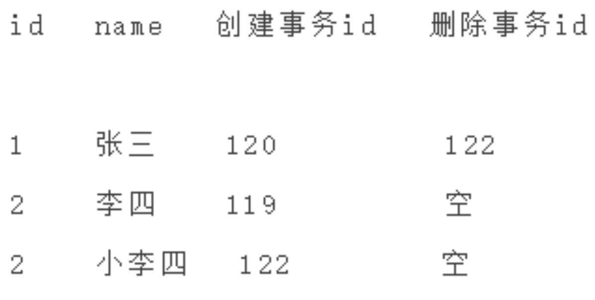
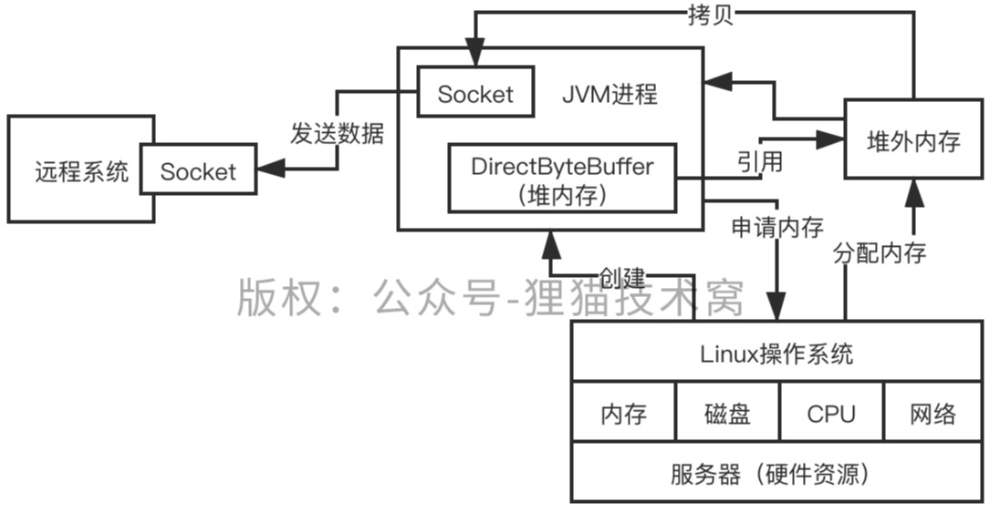
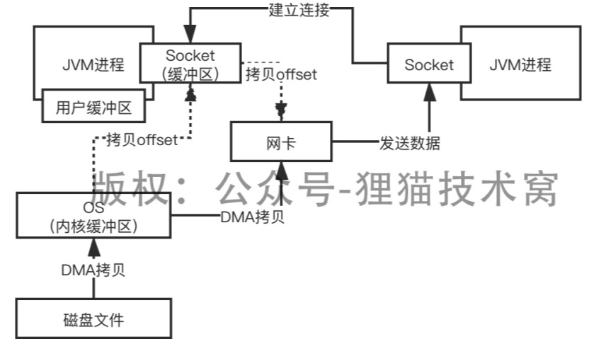

# 石杉笔记

## 01.面试真题

redis、mq、dubbo、分布式、Java并发

mysql、网络、JDK、jvm、spring、tomcat、linux、系统设计

生产实践。


## 06.为什么在Java面试中一定会深入考察HashMap?

底层是有哈希表实现，无序，允许为null。

jdk1.7 HashMap主要是由数组+链表组成

jdk1.8 HashMap主要是数组+链表+红黑树实现，当链表长度超过8（数组长度大于64），就将链表变成红黑树。

HashMap扩容，由容量capacity、负载因子load factor决定。

这两个因素相乘形成了threshold，当entry数量超过threshold，容器将自动扩容并rehash。rehash会对每个元素重新寻址，index_new = index +oldCap(16)

Jdk1.7 头插法，改变链表的顺序，可能会造成死循环。

Jdk1.8 尾插法，可以避免死循环。

HashMap 数组+链表

Hash 取模

```java
// JDK 1.8以后的HashMap源码
static final int hash(Object key) {
    int h;
    return (key == null) ? 0:(h = key.hashCode())^(h >>> 16)
}
```


eg:

```text
1111 1111 1111 1111 1111 1010 0111 1100
右移16位  
0000 0000 0000 0000 1111 1111 1111 1111
异或(int 32位)
1111 1111 1111 1111 0000 0101 1000 0011

寻址算法
[n个元素]，如果取16
(n-1) & hash 

1.没有经过优化
1111 1111 1111 1111 1111 1010 0111 1100  # 没经过优化的hash值
0000 0000 0000 0000 0000 0000 0000 1111  # 15
0000 0000 0000 0000 0000 0000 1000 1100  # 高16位没有参与计算。

（取模运算，性能比较差，优化数组寻址的过程，效果是一样的，但是与运算性能更好一些。）

1111 1111 1111 1111 1111 1010 0111 1100
0000 0000 0000 0000 0000 0000 0000 1111
0000 0000 0000 0000 0000 0000 0000 1100

1111 1111 1111 1110 1111 1010 0111 1100
0000 0000 0000 0000 0000 0000 0000 1111
0000 0000 0000 0000 0000 0000 0000 1100

& 低16位是一致的，增加hash冲突的可能性。但其实高16位是不同的，这里忽略了高16位的特性。

2.优化后
上面异或结果
1111 1111 1111 1111 0000 0101 1000 0011
高16位右移16位，与低16位异或，使低16位同时保持高低16位的特征，尽量避免一些hash值后续出现冲突，大家可能会进入数组的同一个位置。
```


## 09.你知道HashMap是如何解决hash碰撞问题的吗？

hash冲突：

两个key算出来的hash值是一样的，定位出来的数组位置还是一样的。


解决办法：

会在这个位置挂一个链表。

假设链表很长，可能会导致遍历链表，性能比较差。O(n)。

优化，如果链表的长度达到一定得长度，其实会把链表转换成红黑树，遍历一颗红黑树找一个元素，O(nLogn)。


## 10.说说HashMap是如何扩容的？

底层是一个数组，当这个数组满了之后，它会自动进行扩容，变成一个更大的数组，让你在里面可以放更多元素。


数组扩容会重新对每个hash值进行寻址。

```text
0000 0000 0000 0000 0000 0000 0001 1111 # n-1
1111 1111 1111 1111 0000 1111 0000 0101 # hash1
0000 0000 0000 0000 0000 0000 0000 0101 # & =5 即index为5

0000 0000 0000 0000 0000 0000 0001 1111 # n-1
1111 1111 1111 1111 0000 1111 0001 0101 # hash2
0000 0000 0000 0000 0000 0000 0001 0101 # & =21 即index为21

重新寻址：index + oldCap(16)
```


判断二进制结果中是否多出一个bit的1，如果没多，那么就是原来的index，如果多了出来，那么就是index + oldCap（16），通过这个方式，就避免了rehash的时候，用每个hash对新数组.length取模，取模性能不高，位运算的性能比较高。


## 11.HashMap和HashTable的区别

```text
1.hashmap是线程不安全的，hashtable是线程安全的
hashtable对数据操作的时候都加锁，虽然线程安全但是效率低

2.hashmap键值都可以为null，hashtable键或值不允许为null
hashtable在put空值时就直接抛出空指针异常，使用的是安全失败机制(fail-fast)
hashmap做了特殊处理：
key==null ? 0:xx

3.实现方式不同：
hashtable继承了Dictionary类，而HashMap继承得是AbstractMap类

4.初始化容量不同：
HashMap的初始容量为16，HashTable初始容量为：11，负载因子都是0.75

5.扩容机制不同：
当现有容量大于总容量*负载因子时，HashMap扩容规则为当前容量翻倍，HashTable扩容规则为当前容量翻倍+1

6.迭代器不同：
hashmap中的iterator的迭代器是fail-fast的，而hashtable的enumerator不是fail-fast的
```


**fail-fast(快速失败)与fail-safe(安全失败)**

```text
1.fail-fast

在使用迭代器对集合对象进行遍历的时候，如果 A 线程正在对集合进行遍历，此时 B 线程对集合进行修改（增加、删除、修改），或者 A 线程在遍历过程中对集合进行修改，都会导致 A 线程抛出ConcurrentModificationException 异常。

原因：
迭代器在遍历时直接访问集合中的内容，并且在遍历过程中使用一个 modCount 变量。集合在被遍历期间如果内容发生变化，就会改变 modCount 的值。

每当迭代器使用 hashNext()/next() 遍历下一个元素之前，都会检测 modCount 变量是否为 expectedModCount 值，是的话就返回遍历；否则抛出异常，终止遍历。

2.fail-safe

采用安全失败机制的集合容器，在遍历时不是直接在集合内容上访问的，而是先复制原有集合内容，在拷贝的集合上进行遍历。
由于迭代时是对原集合的拷贝进行遍历，所以在遍历过程中对原集合所作的修改并不能被迭代器检测到，故不会抛 ConcurrentModificationException 异常。

java.util.concurrent包下的容器都是安全失败，可以在多线程下并发使用，并发修改。
```


## 12.说说synchronized关键字的底层原理是什么？

```java
synchronized(myobject) {
    // code
    synchronized(myobject) {
        // code
    }
}
```

底层：jvm指令：monitorenter  monitorexit

monitor可以重复对一个对象加锁，计数器加1

释放锁，计数器减1，计数器成0后，别的线程可以对该对象进行加锁。


**synchronized锁升级**

synchrnoized锁性能不咋地，但是jdk1.8升级之后反而多了一些synchronized。

因为现在一般是采用锁升级的优化方案：

```text
1.先使用偏向锁(确认锁标志位是可偏向的状态，再测试线程ID是否指向当前线程)
2.如果获取失败，升级为CAS轻量级锁
3.如果获取CAS轻量级锁失败，会短暂自旋(自旋消耗CPU资源，需要控制自旋次数)，防止线程挂起
4.如果上述都失败，升级为重量级锁
```


## 13.能聊聊你对CAS的原理以及其底层实现原理可以吗？

取值、询问、修改

```java
public class MyObject {
    int i=0;
    // 在一个兑=对象实例的方法上加synchronized，同一时间只有一个线程可以进入这个方法
    public synchronized void increment() {
        i ++;
    }
}

// 多个线程都同时基于myObject这一个对象，来执行increment()方法
MyObject myObject = new MyObject();
myobject.increment();
```

只有一个线程可以成功的对myObject加锁，可以对他关联的monitor的计数器去加1，加锁，一旦多个线程并发的去进行synchronized加锁，串行化，效率并不是太高，很多线程，都需要排队去执行。

此时可以使用CAS compare and set

```java
public class MyObject {
    AtomicInteger i = new AtomicInteger(0);
    // 多个线程此时来执行这段代码
    // 不需要synchronized加锁，也是线程安全的
    public void increment() {
        i.incrementAndGet();
    }
}
```

CAS在底层的硬件级别给你保证一定是原子的，同一时间只有一个线程可以执行CAS，先比较再设置，其他的线程的CAS同时间去执行此时会失败。


CAS缺点

1.cpu开销大，在高并发下，许多线程，更新一变量，多次更新不成功，循环往复，给cpu带来大量压力。

2.只是一个变量的原子性操作，不能保证代码块的原子性。

3.aba问题

因为CAS需要在操作值的时候检查下值有没有发生变化，如果没有发生变化则更新，但是如果一个值原来是A，变成了B，又变成了A，那么使用CAS进行检查时会发现它的值没有发生变化，但是实际上却变化了。ABA问题的解决思路就是使用版本号。在变量前面追加上版本号，每次变量更新的时候把版本号加一，那么A－B－A 就会变成1A-2B－3A。


## 14.ConcurrentHashMap实现线程安全的底层原理到底是什么？

HashMap 底层是一个大的数组，对其加synchronized没有必要。

```java
HashMap map = new HashMap();
// 多个线程过来 put key值不一样，没必要加锁
synchronized(map) {
    map.put(xxx,xxxx)
}
```

JDK并发包里推出了一个ConcurrentHashMap，他默认实现了线程安全性。

* 1.在JDK1.7及之前的版本，分段。

[数组1]，[数组2]，[数组3]  --> 每个数组都对应一个锁

* 2.JDK1.8以及之后，做了一些优化和改进，锁粒度的细化（同一个元素，CAS）。

对同一元素同时执行put，需要执行CAS:

 同一个时间，只有一个线程能成功执行这个CAS，就是说他刚开始先获取一下数组[5]这个位置的值，null，然后执行CAS，线程1，比较一下，put进去我的这条数据，同时间，其他的线程执行CAS，都会失败。

不同元素执行put，可以并发执行：

通过对数组每个元素执行CAS的策略，如果是很多线程对数组里不同的元素执行put，大家是没有关系的，如果其他人失败了，其他人此时会发现说，数组[5]这位置，已经给刚才有人放进去值了。就需要在这个位置基于链表+红黑树来进行处理，synchronized（数组）（分段加锁！）。


**注意**：

如果你是对数组里同一个位置的元素进行操作，才会加锁串行化处理；如果是对数组不同位置的元素操作，此时大家可以并发执行的。


## 15.你对JDK中的AQS理解吗？AQS的实现原理是什么?

Abstract Queue Synchronizer，抽象队列同步器

```java
ReentrantLock lock = new ReentrantLock();  --> 非公平锁
lock.lock();
//code
lock.unlock();
```

图示：


步骤：

1.AQS中初始state=0，线程1、2会去尝试更新state= 1，采用的是CAS策略，只有一个线程（线程1）能更新state=1，加锁成功，更新加锁线程为线程1，

2.此时线程2加锁失败，线程2进入等待队列，挂起。

3.线程1执行完代码，会将state=0，加锁线程为null，释放锁。同时会去唤醒等待队列中的头线程。

4.线程2会去更新state=1,加锁成功，执行相应代码。

非公平锁：

如果在线程1释放锁唤醒线程2加锁之前，线程3立即执行CAS策略，更新state=1，加锁成功。线程2进去之后加锁依旧失败。

公平锁：

线程3进入队列进行排队，先执行线程2。


## 16.说说线程池的底层工作原理可以吗？

线程池：

基本思想还是一种对象池的思想，开辟一块内存空间，里面存放了众多(未死亡)的线程，池中线程执行调度由池管理器来处理。当有线程任务时，从池中取一个，执行完成后线程对象归池，这样可以避免反复创建线程对象所带来的性能开销，节省了系统的资源。

```java
ExecutorService threadPool = Executors.newFixedThreadPool(3) -> 3: corePoolSize


threadPool.submit(new Callable() {

       public void run() {}

})
```


步骤：

1.提交任务，先看一下线程池里的线程数量是否小于corePoolSize，也就是3，如果小于，直接创建一个线程出来执行你的任务

 2.如果执行完你的任务之后，这个线程是不会死掉的，他会尝试从一个无界的LinkedBlockingQueue里获取新的任务，如果没有新的任务，此时就会阻塞住，等待新的任务到来。

3.再次提交任务，发现线程数量已经跟corePoolSize一样大了，此时就直接把任务放入等待队列中就可以了，线程会争抢获取任务执行的，如果所有的线程此时都在执行任务，那么无界队列里的任务就可能会越来越多。


## 17.那你再说说线程池的核心配置参数都是干什么的？平时我们应该怎么用？

```java
return new ThreadPoolExecutor(nThreads,nThreads,0L,TimeUint.MILLISECONDS,
                   new LinkedBlockingQueue<Runnable>())
```

代表线程池的类是ThreadPoolExecutor。

核心点：corePoolSize,maximumPoolSize,keepAliveTime,queue

```text
自己设计线程池：
corePoolSize：3

maximumPoolSize：20

keepAliveTime：60s

queue: new ArrayBlockingQueue<Runnable>(200)


如果queue满了，可以创建一些额外的线程。最多到maxmumPoolSize个。

如果queue空了，额外的线程会空闲一段时间，达到keepAliveTime后会被释放掉。

如果queue、额外线程都满了， 新任务过来后会直接reject掉，reject策略：
1）AbortPolicy 2)DiscardPolicy 3)DiscardOlddestPolicy 4)callerRunsPolicy  ...自定义

一般常用的是fixed线程，队列无限，不会创建额外线程、也不会出现reject策略。

或设置maximumPoolSize值为Integer.MAX_VALUE
```


## 18.如果在线程池中使用无界阻塞队列会发生什么问题？


线程调用远程线程卡住，线程池中任务很难处理掉，无界阻塞队列中的任务积压的越来越多，导致内存飙升，甚至出现OOM。


## 19.你知道如果线程池的队列满了之后，会发生什么事情吗？

有界队列。

如果maximunPoolSize 设置成MAX_VALUE

如果可以无限制的创建额外的线程出来，一台机器上可能有几千个线程，每个线程都有自己的栈内存。占用一定得内存资源，会使内存耗尽。

如果maximunPoolSize 设置成具体值，超过了队列存储值、额外线程值后会拒绝接下来的任务，也有问题。


## 20.如果线上机器突然宕机，线程池的阻塞队列中的请求怎么办？

必然会导致线程池中积压的任务会丢失。

**数据库备份：**

如果说你要提交一个任务到线程池里去，在提交之前，需要将服务信息插入数据库，更新他的状态：未提交、已提交、已完成。提交成功之后，更新他的状态是已提交状态。

系统重启，后台线程去扫描数据库里的未提交和已提交状态的任务，可以把任务的信息读取出来，重新提交到线程池里去，继续进行执行。


## 21.Java内存模型

Java内存模型`Java Memory Model`，简称`JMM`。

是一种抽象概念并不真实存在，它描述的是一组规则或规范，通过这组规范定义了程序中各个变量（包括实例字段，静态字段和构成数组对象的元素）的访问方式。

是`Java`并发编程的核心和基础，用来屏蔽各种硬件和操作系统的内存访问差异。

**JMM关于同步的规定**

```text
1.线程解锁之前，必须把共享内存的值刷到主内存。
2.线程加锁前，必须读取主内存的最新值到自己的工作内存。
3.加锁解锁是同一把锁。
```

**JMM定义了线程与主内存之间的关系**

```text
1.共享变量存储在主内存中，每个线程都可以访问，每个线程都有自己的工作内存（本地内存）
2.工作内存只存储该线程对共享变量的副本
3.线程不能直接操作主内存，只有先操作工作内存才能写入主内存。
```


多线程存在缓存一致性问题：

```text
int i= 0；
i = i + 1;
线程1、2都从主内存拉取i=0到工作线程，分别执行i=i+1，
一个线程执行完刷回主内存i=1，另外一个线程执行完也会刷回主内存i还是1，期待值是2
```


采用缓存一致性协议。**MESI**协议。主要规范了`CPU`读写主存、管理缓存数据的一系列规范。


`MESI`协议的核心思想：

```text
1.定义了缓存中的数据状态只有4种，MESI是四种状态的首字母
2.当CPU写数据的时候，如果写的变量是共享变量，即在其他CPU中也存在该变量副本，会发出信号通知其他CPU将该变量的缓存行为置为无效状态
3.当CPU读取共享变量时，发现自己缓存的该变量的缓存行是无效的，那么它就会从内存中重新读取。
```


## 22.你知道Java内存模型中的原子性、有序性、可见性是什么吗？

```text
1.可见性
可见性是指当多个线程访问同一个共享变量时，一个线程修改了这个变量的值，其他线程能够立即看到修改后的值。

2.原子性
原子性指的一个操作或一组操作要么全部执行，要么全部不执行。

3.有序性
有序性是指程序执行的顺序按照代码的先后顺序执行。
```


## 23.能聊聊volatile关键字的原理吗？

1.可见性

```java
private volatile int data = 0;

new Thread() {
    public void run() {
        data++; // 刷入主存 data=1
    }
}.start();

new Thread() {
    public void run() {
        while(data == 0) { // 跳出循环
            Thread.sleep(1000);
        }
    }
}
```

开源中间件系统都会大量使用`volatile`。

```java
public class Kafka {
    privaet volatile boolean running = true;
    
    public void shutdown() {
        // 关闭这个系统，shutdown.sh 脚本 来调用这个shutdown接口
        running = false;
    }
    
    public static void main() {
        // 启动kafka 会运行一大堆的代码，不能直接让他退出
        Kafka kafka = new Kafka();
        
        while(kafka.running) {
            Thread.sleep(1000);
        }
    }
}
```


## 24.你知道指令重排以及happens-before原则吗？

指令重排的3种形式：

 

单线程环境里面确保程序最终执行结果和代码顺序执行的结果一致。

多线程环境中线程交替执行，由于编译器优化重排的存在，两个线程中使用的变量能否保证一致性是无法确定的，结果无法预测。`volatile`使用内存屏障来禁止指令重排。

**happens-before原则**

指定了在一些特殊情况下，不允许编译器、指令器对你写的代码进行指令重排，必须保证你的代码的有序性。

```text
1.程序次序规则：一个线程内，按照代码顺序，书写在前面的操作先行发生于书写在后面的操作；

2.锁定规则：一个unLock操作先行发生于后面对同一个锁额lock操作；

3.volatile变量规则：对一个变量的写操作先行发生于后面对这个变量的读操作；

4.传递规则：如果操作A先行发生于操作B，而操作B又先行发生于操作C，则可以得出操作A先行发生于操作C；

5.线程启动规则：Thread对象的start()方法先行发生于此线程的每个一个动作；

6.线程中断规则：对线程interrupt()方法的调用先行发生于被中断线程的代码检测到中断事件的发生；

7.线程终结规则：线程中所有的操作都先行发生于线程的终止检测，我们可以通过Thread.join()方法结束、Thread.isAlive()的返回值手段检测到线程已经终止执行；

8.对象终结规则：一个对象的初始化完成先行发生于他的finalize()方法的开始；
```

有序性和`happens-before`原则实现的底层原理：

```text
Java编译器在生成指令序列的适当位置会插入内存屏障指令来禁止特定类型的处理器重排序，保证共享变量操作的有序性。

内存屏障指令：写操作的会让线程本地的共享内存变量写完强制刷新到主存。读操作让本地线程变量无效，强制从主内存读取，保证了共享内存变量的可见性。
```

`JVM`提供了四类内存屏障指令：


## 25.volatile底层是如何基于内存屏障保证可见性和有序性？

**可见性**

`lock`前缀指令+`MESI`缓存一致性协议

```text
1.对volatile修饰的变量，执行写操作的话，JVM会发送一条lock前缀指令给CPU，CPU在计算完之后会立即将这个值写回主内存，同时因为有MESI缓存一致性协议，所以各个CPU都会对总线进行嗅探，自己本地缓存中的数据是否被别人修改

2.如果发现别人修改了某个缓存的数据，那么CPU就会将自己本地缓存的数据过期掉，然后这个CPU上执行的线程在读取那个变量的时候，就会从主内存重新加载最新的数据了
```

**有序性**

内存屏障说明：

```text
Load1:
int localVar = this.variable
LoadLoad屏障
Load2:
int localVar = this.variable2
# LoadLoad屏障：Load1;LoadLoad;Load2 确保Load1数据的装载先于Load2后所有装载指令，保证不能指令重排

Store1:
this.variable = 1
StoreStore屏障
Stroe2：
this.variable = 2
# StoreStore屏障：Store1;StoreStore;Store2，确保Store1的数据一定刷回主存，对其他cpu可见，先于Store2以及后续指令

# LoadStore屏障：Load1；LoadStore；Store2，确保Load1指令的数据装载，先于Store2以及后续指令
# StoreLoad屏障：Store1；StoreLoad；Load2，确保Store1指令的数据一定刷回主存，对其他cpu可见，先于Load2以及后续指令的数据装载
```

`volatile`内存屏障的应用：

```text
volatile variable = 1
this.variable = 2 => store操作
int localVariable = this.variable => load操作

1.每个volatile写操作前面，加StoreStore屏障，禁止上面的普通写和他重排；每个volatile写操作后面，加StoreLoad屏障，禁止跟下面的volatile读/写重排
2.每个volatile读操作后面，加LoadLoad屏障，禁止下面的普通读和voaltile读重排；每个volatile读操作后面，加LoadStore屏障，禁止下面的普通写和volatile读重排
```

## 26.说说你对Spring的IOC机制的理解可以吗？

IOC 控制反转


最开始： tomcat --> servlet，可能几十个地方都调用了MyServiceImpl，各种类耦合在一起，如果不想用这个实现类，改动、测试代码成本太高。

Spring IOC 控制反转
xml文件配置(旧) --> 注解注入(新)

```java
@Controller  // Bean，引用实现类。
public class MyController {
    @Resource  // 找到实现类注入到这个变量中。
    private MyService myService;
    
    public void doRequest(HttpServletRequest request) {
        // 对请求一同处理
        // 调用自己的业务逻辑组件，去执行一些业务逻辑
        myService.doService(request);
    }
}

public class MyServiceImpl implements MyService() {}

@Service // 归Controller管理。
public class NewServiceManagerImpl implements MyServie {}
```


总结：

```text
1.spring ioc 根据xml配置或者注解去实例化一些bean对象，再根据xml配置或注解去对bean对象之间的引用关系，去进行依赖注入，某个bean依赖另外一个bean。

2.底层的核心技术：反射，通过反射技术，直接根据你的类去自己构建对应的对象出来，用的就是反射技术。

3.spring ioc 系统的类与类之间彻底的解耦合。
```


## 27.说说你对Spring的AOP机制的理解可以吗？

```java
@Controller/@Component
public class MyController {
    @Resource/@Autowired // 取得bean
    private MyServiceA myServiceA; // 注入的是动态代理的对象实例 ProxyMyServiceA
    
    public void doRequest() {
        myServiceA.doServiceA();  // 直接调用到动态代理的对象实例的方法中去。
    }
}

@Service
public class MyServiceAImpl implements MyServiceA {
    publice void doServiceA {
        // 开启事务
        // insert语句
        // update语句
        // ...
        // 如果有失败，回滚事务，如果成功，提交事务
    }
}

@Service
public class MyServiceBImpl implements MyServiceB {
    publice void doServiceB {
        // 开启事务
        // update语句
        // delete语句
        // ...
        // 事务回滚、提交事务
    }
}

// 不同服务都需要开启事务。
// 不同服务有重复代码，可以开启AOP机制。
// 切面，在类方法的所有方法中，都去织入一些代码，方法开始结束都会去执行切面方法。
// 我觉得有点像拦截器的概念。
public class ProxyMyServiceA implements MyServiceA {
    private MyServiceA myServiceA;
    
    public void doServiceA() {
        // 开启事务
        // 直接调用我依赖的MyServiceA对象的方法
        myServiceA.doServiceA()
        // 根据他是否抛出异常，回滚事务或者提交事务。
    }
}
```

事务保证数据一致性。 

AOP技术的核心是动态代理。


## 28.了解过cglib动态代理吗？他跟jdk动态代理的区别是什么？

就是动态创建一个类出来，创建这个类的实例对象，在这个里面引用你真正自己写的类，所有的方法的调用都是先走代理类的对象，他负责一些代码上的增强，再去调用你写的那个类。

```text
jdk动态代理：被代理类实现了某个接口

cglib动态代理：被代理类没有实现接口，比如对Controller层配置切面。代理类是当前类的一个子类。
```


```java
public class HelloService {
    
	public HelloService() {
		System.out.println("HelloService构造");
	}
    /**
    * 该方法不能被子类覆盖,Cglib是无法代理final修饰的方法的
    */
    final public String sayOthers(String name) {
        System.out.println("HelloService:sayOthers>>" + name);
        return null;
    }
    public void sayHello() {
    	System.out.println("HelloService:sayHello");
    }
    
/**
* 自定义MethodInterceptor
*/
public class MyMethodInterceptor implements MethodInterceptor {
    /**
    * sub：cglib生成的代理对象
    * method：被代理对象方法
    * objects：方法入参
    * methodProxy: 代理方法
    */
    @Override
    public Object intercept(Object sub,
                            Method method,
                            Object[] objects,
                                MethodProxy methodProxy) throws Throwable {
        System.out.println("======插入前置通知======");
        Object object = methodProxy.invokeSuper(sub, objects);
        System.out.println("======插入后者通知======");
        return object;
    }
}

    
public static void main(String[] args) {
    // 代理类class文件存入本地磁盘方便我们反编译查看源码
    System.setProperty(DebuggingClassWriter.DEBUG_LOCATION_PROPERTY, "D:\\code");
    // 通过CGLIB动态代理获取代理对象的过程
    Enhancer enhancer = new Enhancer();
    // 设置enhancer对象的父类
    enhancer.setSuperclass(HelloService.class);
    // 设置enhancer的回调对象
    enhancer.setCallback(new MyMethodInterceptor());
    // 创建代理对象
    HelloService proxy= (HelloService)enhancer.create();
    // 通过代理对象调用目标方法
    proxy.sayHello();
}
```


## 29.能说说Spring中的Bean是线程安全的吗？

spring的bean作用域：

* Singleton[默认]：每个容器中，只有一个bean实例。 （线程不安全）
* prototype：为每次bean请求都提供一个实例  
* request、session、global-session：为每一个网络请求创建一个实例，在请求完成以后，bean会失效并被垃圾回收器回收

```java
@Service // 一个实例对象
public class MyServiceImpl implements MyService {
    
}

@Controller // 一个实例对象
public class MyController {
    @Resource
    private MyService myService;
    
    private int data;
    
    public void doRequest() {
        myService.doService();
        data++; //线程不安全的...
    }
}
```

不是线程安全的。

```text
Spring中bean是默认(Singleton)是线程不安全的。

比如在Service设置了一个实例变量，由于tomcat内部是多线程模型，同一时间并发访问的时候，可能是不同的线程请求Controller，然后访问同一个bean实例对MyServiceImpl，此时进行data++之类的操作，肯定引发线程安全问题。

但是：一般来说，很少在spring bean里面放一下实例变量，而是通过多个组件互相调用，最终去访问数据库的，并不会多个线程去访问内存里面的一些共享变量。

因此：虽然spring bean是线程不安全的，但是由于多个线程并没有访问内存的共享变量，每次执行都是一个无状态的。(重点！！！)

此时并不会引发线程安全问题。
```


## 30.Spring的事务实现原理是什么？能聊聊你对事务传播机制的理解吗？

原理是使用了`AOP`思想：

动态代理对所有需要事务管理的Bean进行加载，并根据配置在invoke方法中对当前调用的方法名进行判定，并在method.invoke方法前后为其加上合适的事务管理代码，这样就实现了Spring式的事务管理。

```text
1.事务拦截的对象是TransactionInterceptor，可以看出它继承了TransactionAspectSupport. TransactionAspectSupport内部是真正的操作部分。

2.Spring事务中有几个对象：
1）PlatformTransactionManager 事务管理器，它只包含三个方法。获取事务，回顾事务，提交事务
2）TransactionDefinition 定义事务的类型，事务包含很多属性，是否可读，事务隔离级别,事务传播级别。通过事务的定义，我们根据定义获取特定的事务。
3）TransactionStatus 代表一个事务运行的状态，事务管理器通过状态可以知道事务的状态信息，然后进行事务的控制。事务是否完成，是否是新的事务，是不是只能回滚等。
```

**事务处理逻辑：**

```text
1.首先获取我们定义的事务属性，可能是定义在XML中，也可能是定义在注解上，总之我们是能获取到定义的事务属性的。
2.根据定义的事务属性获取PlatformTransactionManager，然后获取加入点的标识
3.事务处理逻辑：
1）判断要不要新建事务
2）执行事务内的代码，一般是程序代码
3）失败了执行回滚事务
4）如果没抛出异常提交事务，创建事务后返回的对象是TransactionInfo对象,包含：事务管理器、定义的事务属性、切入点标识、事务状态、上一个事务状态。
```


```java
@Transactional(propagation=Propagation.REQUIRED) 
// 加上注解，使用AOP思想，在方法执行前先去开启事务，执行完毕之后，根据方法是否报错，来决定回滚还是提交事务。
public void methodA() {
    doSomethingPre();
    methodB();
    doSomethingPost();
}

@Transactional(propagatin=Propagation.NESTED)
// 如果当前存在事务，则在嵌套事务内执行。如果当前没有事务，则按REQUIRED属性执行。
public void methodB() {
    // do something
}

```

事务传播机制：多个事务方法之间怎么调用。

事务类型：

```text
1.PROPAGATION_REQUIRED：如果当前没有事务，就创建一个新事务，如果当前存在事务，就加入该事务，该设置是最常用的设置。

2.PROPAGATION_SUPPORTS：支持当前事务，如果当前存在事务，就加入该事务，如果当前不存在事务，就以非事务执行。

3.PROPAGATION_MANDATORY：支持当前事务，如果当前存在事务，就加入该事务，如果当前不存在事务，就抛出异常。

4.PROPAGATION_REQUIRES_NEW：创建新事务，无论当前存不存在事务，都创建新事务。

5.PROPAGATION_NOT_SUPPORTED：以非事务方式执行操作，如果当前存在事务，就把当前事务挂起。

6.PROPAGATION_NEVER：以非事务方式执行，如果当前存在事务，则抛出异常。

7.PROPAGATION_NESTED：如果当前存在事务，则在嵌套事务内执行。如果当前没有事务，则按REQUIRED属性执行。
```

常见事务场景：

```text
1.方法A调用方法B，我希望的是如果说方法A出错了，此时仅仅回滚方法A，不能回滚方法B，必须得用REQUIRES_NEW，传播机制，让他们俩的事务是不同的。

2.方法A调用方法B，如果出错，方法B只能回滚他自己，方法A可以带着方法B一起回滚，NESTED嵌套事务。
```


## 31.能画一张图说说Spring Boot的核心架构吗？

 ```text
spring框架：
程序打包到线程的tomcat里去，tomcat启动可以接受http请求，转发到spring mvc框架，调用controller --> service --> dao --> mybatis(sql语句)

spring boot框架：
1.内嵌一个tomcat 直接运行一个main方法。
2.自动装配mybatis。
3.只要引入一个starter，几乎就不用你做太多的其他额外配置，会自动生成bean，自动注入到dao。
 ```

 

简单步骤：

```text
1.调用main方法，直接启动内嵌的web服务器
2.tomcat启动起来，将spring mvc(核心Servlet Filter)注册到tomcat中
3.spring容器启动起来，会扫描代码，根据注解实例化bean，自动完成bean的装配和定义
4.tomcat会监听端口号，用于接受请求
5.请求进来，由spring mvc进行相关的请求转发，进入bean实例(Controller -> MyserviceImpl -> MyDaoImpl -> 引用Mybatis核心组件(自动注入bean中)) 
6.Mybatis执行sql语句，进行相关增删改查。
```


## 33.能说说Spring中都使用了哪些设计模式吗？

* 1.工厂模式

  spring ioc核心的设计模式就是工厂，把所有的bean实例都给放到了spring容器中（大工厂），如果你要使用bean，就找spring容器就可以了，自己不用创建对象。

  ```java
  public class MyController {
      private MyService myService = MyServiceFactory.getMyService();
  } 
  
  public class MyServiceFactory {
      public static MyService getMyService() {
          return new MyServiceImpl();
      }
  }
  ```


* 2.单例模式

  spring默认来说，对每个bean走的都是一个单例模式，确保说你的一个类在系统运行只有一个实例对象，只有一个bean。

  ```java
  public class MyService {
      private volatie static MyService myService; // 前后不会出现指令重排
      public static MyService getInstance() {
          if (myService == null) {
              synchronized(MyService.class) {  // 加锁，只允许创建一个实例
                  if (myService == null) {
                      myService = new MyService();
                  }
              }
          }
      }
      return myService;
  }
  ```

  ```python
  python单例：
  1.类对象单例(装饰器)
  import threading
  def singleton(cls):
      instances = {}
      lock = threading.Lock()
  
      @functools.wraps(cls)
      def getinstance(*args):
          _id = cls
          if _id not in instances:
              with lock:
                  if _id not in instances:
                      instances[_id] = cls(*args)
          return instances[_id]
      return getinstance
  
  2.类实例对象单例(装饰器)
  def singleton(cls):
      instances = {}
      lock = threading.Lock()
  
      @functools.wraps(cls)
      def getinstance(*args):
          _id = args
          if _id not in instances:
              with lock:
                  if _id not in instances:
                      instances[_id] = cls(*args)
          return instances[_id]
      return getinstance
  
  3.类对象单例(非装饰器模式)
  import threading
  class Singleton(object):
      _instance_lock = threading.Lock()
  
      def __init__(self, *args, **kwargs):
          pass
  
      def __new__(cls, *args, **kwargs):
          if not hasattr(cls, '_instance'):
              with Singleton._instance_lock:
                  if not hasattr(cls, '_instance'):
                      Singleton._instance = super().__new__(cls)
  
              return Singleton._instance
  ```

* 3.代理模式（比较有含金量）

  如果说你要对一些类的方法切入一些增强的代码，会创建一些动态代理的对象，让你对那些目标对象的访问，先经过动态代理对象，动态代理对象先做一些增强的代码，调用你的目标对象。

  在设计模式里，就是一个代理模式的体现和运用，让动态代理的对象，去代理了你的目标对象，在这个过程中做一些增强的访问，你可以把面试突击的内容作为一个抛砖引玉的作用，去更加深入的学习一些技术。


## 34.能画一张图说说Spring Web MVC的核心架构吗？

步骤：

```text
1.tomcat的工作线程将请求转交给spring mvc框架的DispatcherServlet。

2.DispatcherServlet查找@Controller注解的controller，我们一般会给controller加上你@RequestMapping的注解，标注说哪些controller用来处理哪些请求，此时根据请求的uri，去定位到哪个controller来进行处理。

3.根据@RequestMapping去查找，使用这个controller内的哪个方法来进行请求的处理，对每个方法一般也会加@RequestMapping的注解。(类似于flask中的app.index('/'))

4.他会直接调用我们的controller里面的某个方法来进行请求的处理。

5.我们的controller的方法会有一个返回值，以前会把前端页面放在后端的工程里面，返回一个页面模板的名字，spring mvc的框架使用模板技术，对html页面做一个渲染。

6.再把渲染以后的html页面返回给浏览器去进行显示；前端负责把html页面渲染给浏览器就可以了。
```


## 35.能画一张图说说spring cloud的核心架构吗？

spring cloud开发分布式系统，让你把系统拆分为很多子系统，子系统互相之间进行请求和调用。

服务注册中心 eureka

网关系统 zuul

熔断管理工具 hystrix


## 36.JVM中有哪几块内存区域？Java 8之后对内存分代做了什么改进？

cpu和计算机内存交互最为频繁，内存的读写速度赶不上cpu，所以cpu上加了高速缓存。

在多核cpu中，每个处理器都有各自的高速缓存（L1,L2,L3），而主内存只有一个

缓存一致性协议，保证多线程场景下数据一致性。


JVM内存区域（核心区域）


java8以后的内存分代改进：

永久代放了一些常量池+类信息。

永久代变成metaspace。

## 37.JVM是如何运行起来的？我们的对象是如何分配的？

比如说我们有一个类里面包含了一个main方法，你去执行这个main方法，此时会自动一个jvm进程，他会默认就会有一个main线程，这个main线程就负责执行这个main方法的代码，进而创建各种对象


tomcat，类都会加载到jvm里去，spring容器而言都会对我们的类进行实例化成bean，有工作线程会来执行我们的bean实例对象里的方法和代码，进而也会创建其他的各种对象，实现业务逻辑。


1.加载类

2.spring创建bean实例对象、放在堆内存中

3.tomcat起线程引用bean实例对象执行对象中的一些方法

4.线程有独享内存空间，方法会在栈内存中创建栈帧，产生局部变量，实例化对象会放在堆内存里面

5.方法执行完之后会将相关的栈帧弹出去，局部变量会销毁掉。


## 38.说说JVM在哪些情况下会出发垃圾回收？

JVM资源有限，4核8G，堆内存可能就4G


eden和2个s区域比例是8：1

如果eden满了，必然会触发垃圾回收，young gc ygc,没人引用的对象会被回收

方法正在执行，静态变量引用，这两种情况不会被回收，其余情况基本上都会被回收。


## 39.说说JVM年轻代垃圾回收算法？对象什么时候转移到老年代？

如果说你让代码一边运行，一边有变动，一边判断哪些对象是可以回收的，这个是不现实的。

垃圾回收的时候有一个概念，叫做stop the world，停止你的jvm里的工作线程的运行，然后扫描所有的对象，判断哪些可以回收，哪些不可以回收的。

年轻代分为eden区域、s区域原因：大部分年轻代对象生存周期都很短，垃圾回收时存活的对象放到s区域（survive区域）

**垃圾回收算法：**

复制算法，把eden存活的对象复制到s1区域，其他对象全部干掉。

下一次又会把eden、s1区域的存活对象复制到s2区域。再下一次会将eden、s2区域的存活对象复制到s1区域。以此往复。

**对象转移到老年代**

1.有的对象在年轻代中熬过了很多次垃圾回收，此时会认为这个对象是要长期存活的对象。spring中bean实例对象，需要长期存活，一直被引用。

2.存活对象s区放不下。

3.大对象直接放置到老年代。大对象ygc每次都需要复制，消耗性能没必要。


## 40.说说老年代的垃圾回收算法，常用的垃圾回收器有什么？

老年代中长期存活对象比较多，复制算法不合适。

对老年代而言，他里面垃圾对象可能是没有那么多。

内存碎片需要连续。

标记-整理

把老年代里的存活对象标记出来，移动到一起，存活对象压缩到一片内存空间去。剩余的都是连续的可用的内存空间，解决了内存碎片的问题。


常见算法：

**parnew+cms组合**

Jdk8之前

分为好几个阶段，初始标记，并发标记，并发清理，老年代垃圾回收是比较慢的，一般起码比年轻代垃圾回收慢个10倍以上，cms的垃圾回收算法，刚开始用标记-清理，标记出来垃圾对象，清理掉一些垃圾对象，整理，整理，把一些存活的对象压缩到一起，避免内存碎片的产生。

执行一个比较慢的垃圾回收，还要stop the world，需要100mb，此时就会让系统停顿100ms，不能处理任何请求，尽可能的让垃圾回收GC线程和工作线程的运行，并发着来执行。

CMS收集器之所以能够做到并发，根本原因在于**采用基于“标记-清除”的算法并对算法过程进行了细粒度的分解**。

步骤如下：

* 初始标记：STW，标记GC Roots能关联到的对象，速度很快

* 并发标记：GC Roots Tracing过程。耗时。和用户线程一起执行（并行）

* 重新标记：STW，标记并发标记过程中程序运行导致标记变化的对象，时间比初始标记长，远比并发标记短

* 并发清除：耗时。和用户线程一起执行（并行）


**g1组合**

jdk9以后都是。

G1打破了新生代和老年代的物理隔离。

G1重新定义了堆空间，打破了原有的分代模型，将堆划分为一个个区域。这么做的目的是在进行收集时不必在全堆范围内进行，这是它最显著的特点。区域划分的好处就是带来了停顿时间可预测的收集模型：用户可以指定收集操作在多长时间内完成。即G1提供了接近实时的收集特性。

G1特点：

- **并行与并发**：G1能充分利用多CPU、多核环境下的硬件优势，使用多个CPU来缩短Stop-the-world停顿的时间，部分其他收集器原来需要停顿Java线程执行的GC操作，G1收集器仍然可以通过**并发**的方式让Java程序继续运行。
- 分代收集
- 空间整合：与CMS的标记-清除算法不同，G1从整体来看是基于**标记-整理算法**实现的收集器，从局部（两个Region之间）上来看是基于“**复制**”算法实现的。但无论如何，这两种算法都意味着G1运作期间不会产生内存空间碎片，收集后能提供规整的可用内存。**这种特性有利于程序长时间运行，分配大对象时不会因为无法找到连续内存空间而提前触发下一次GC**。
- 可预测的停顿：这是G1相对于CMS的一个优势，降低停顿时间是G1和CMS共同的关注点。

在G1之前的其他收集器进行收集的范围都是整个新生代或者老年代，而G1不再是这样。在堆的结构设计时，G1打破了以往将收集范围固定在新生代或老年代的模式，G1将堆分成许多相同大小的区域单元，每个单元称为Region。Region是一块地址连续的内存空间，G1模块的组成如下图所示：


## 41.生产环境中的Tomcat是如何设置JVM参数的？如何检查JVM运行情况？

jstat -gc port

```text
elasticsearch fullgc事故
日志采集系统刚刚上线的时候，某次用户针对message字段去做了相关聚合操作，导致elasticsearch jvm内存使用激增，出现fullgc，服务长时间无法访问。

做出优化：
1.重新创建elasticsearch template,将message字段doc_values设置成false。避免进行相关聚合操作。
2.后期出于服务量考量，对elasticsearch内存进行升配，JVM占据比例提高到16G。
```

预估、压测做一份生产环境的jvm参数。


## 43.你知道发生OOM之后，应该如何排查和处理线上系统的OOM问题？

oom 对象占用内存无法释放掉

找到内存快照，找到当时占用内存最大的对象。


## 44.你能聊聊TCP/IP四层网络模型吗？OSI七层网络模型也说一下（上）


OSI七层网络模型：

应用层、表示层、会话层、传输层、网络层、数据链路层、物理层。

TCP/IP四层模型：

数据链路层、网络层、传输层、应用层

```text
1)物理层
电缆、网线、负责传输0、1的电脑信号
```

```text
2)数据链路层
物理层能传输0、1信号，但是还得定义协议将这些信号分组。

以太网协议。一组电信号是一个数据包，叫帧(frame)。
由标头(head) + 数据(data)。
电脑1 ----------------------> 电脑2
一堆0/1信号封装成数据包、包含头和数据，头里面包含了从哪来到哪去，必须从一台电脑的网卡发送到另外一台电脑的网卡。

mac地址，网卡唯一标识，12位16进制数字。

广播：局域网内电脑，可以使用广播将数据发送到子网内的电脑，电脑再比对mac地址，看看是不是发给自己的。
```


```text
3)网络层
基于ip协议，进行主机和主机间的寻址和通信的。
ip协议，ip协议定义的地址叫做ip地址。有ipv4和ipv6
目前广泛使用的是ipv4，是32个二进制数字组成的。但一般用4个十进制数字表示，范围是0.0.0.0到255.255.255.255之间。

虚拟机：
192.168.0.182  192.168.0.125 192.168.0.106
前面3个十进制数字都是192.168.0 表示大家都是在一个子网内。

判断哪些机器是一个子网的，需要通过ip地址的二进制来判断，子网掩码。
255.255.255.0
判断ip地址是不是一个子网的，将ip地址与子网掩码(11111111.11111111.11111111.00000000)做与运算。

有了网络层的ip地址之后，两台在子网内的电脑终于可以通过广播+mac地址来传输数据包进行通信了。但是如果发现接受数据包的计算机不在子网内，那么就不能通过广播来发送数据包，需要通过路由来发送数据包。

路由：
负责将多个子网进行连接。
 
每台电脑可以有多个网卡：以太网卡、wifi网卡。发送数据包的时候再决定走哪个网卡。

路由器的ip可以认为是网关，路由器每个网卡都有mac地址+ip地址，必须通过ip地址寻址。路由器是工作在网络层的设备。

网络交换机是通过mac地址寻址和传输数据包的。所以一般用作局域网（mac地址寻址不能广播）。

路由器兼顾交换机和路由两个功能。局域网连接到LAN(Local Area Network)，如果连接到英特网，就把网线插到WAN(Wide Area Network)
而WLAN(Wireless Local Area Network)表示的是无线局域网。

ARP协议 ip地址与mac地址的对应关系
```


**两个局域网之间，如何通过一个路由器进行通信**

路由器配置了两块网卡，每个网卡可以连接到一个局域网内。

* 1.局域网1电脑要发送数据包到局域网2内的电脑，在数据包里写上自己的ip地址和对方的ip地址。但是他们俩不在一个局域网内，于是局域网1内的电脑，先通过交换机将数据包发送给路由器，这个过程需要将路由器的一块网卡的ip地址对应的mac地址写到数据包的头部，然后才能通过交换机广播出去，路由器接收到之后比较自己一块网卡的mac地址，就知道是来找自己的。
* 2.路由器接收到数据包之后，就会在局域网2内，将目标机器的ip地址对应的mac地址写入头部，接着再次通过交换机发送广播通知，发送给局域网2内的电脑。


```text
4)传输层
在子网内部怎么通过mac地址广播通信；跨子网的时候，怎么通过ip地址 -> mac地址 -> 交换机 -> 路由器 -> ip地址 -> mac地址 -> 交换机的方式来通过路由器进行通信。

很多程序用一个网卡进行网络通信。所以需要使用端口号。端口号0-65536范围内，0-1023被系统占用。

网络层是基于ip协议，进行主机和主机间的寻址和通信的
传输层是建立某个主机的某个端口，到另外一个主机的某个端口的连接和通信。

通信是通过socket实现的，通过socket就可以基于tcp/ip协议完成上述的ip地址和mac地址转换和寻址，通过路由器通信，也会建立一个端口到另外一个端口的连接。

udp、tcp都是传输层的协议，作用就是在数据包里加入端口号，可以通过端口号进行点对点的通信。
udp协议是不可靠的，发出去人家收到没有就不知道了。
tcp协议是可靠的，要求三次握手，而且要求人家接受到数据必须回复你。

传输层的tcp协议，仅仅只是规定了一套基于端口的点对点的通信协议，包括如何建立连接，如何发送和读取消息，但是实际上如果你要基于tcp协议来开发，你一般是用socket，java socket网络编程
```


```text
5)应用层
 7层协议的会话层、表示层、应用层，3层合成1层。
 应用层是拿到数据具体干嘛
 
示例:
1.电脑1走tcp协议发送一段东西过来，发送到电脑2的20386端口
 GET http://localhost:8080/ http/1.1
 
key:valuel
key:value
 
2.电脑2走tcp协议读取到了属于自己这个20386端口 的一段数据
 
GET http://localhost:8080/ http/1.1
 
key:valuel 
key:value
 
3.发送了一段响应
 
200
 
key;value
key:value

最常见的，应用层的协议是http协议，进行网络通信。
 
4.又通过底层的tcp发了出去，电脑1的30987端口，ip
 
电脑1，网卡，走以太网协议收到一个数据包
 
200
 
key;value
key:value

最常见的协议是http协议。
```


```text
总结：
1.4层
数据链路层(以太网协议)、网络层(ip协议)、传输层(tcp协议)、应用层(http协议)

2.7层
物理层(网线、海底光缆、传递0/1电路信号)，会话层、表示层、应用层 -->应用层

3.网络设置
ip地址、子网掩码划分子网的。
网关地址，可以认为是路由器上的那个网卡的ip地址。
DNS地址(Domain Name System)，一般定位是通过ip地址+mac地址+端口号来定位一个通信目标的。

如果在浏览器上输入一个www.baidu.com，先把www.baidu.com发给DNS服务器，然后DNS服务器告诉你www.baidu.com对应的ip地址。
```


**HTTP请求调用与RPC调用对比**

```text
HTTP
优点：
HTTP协议是以restful规范为代表，可读性好，且可以得到防火墙的支持、跨语言的支持。

缺点：
有用信息占比少，效率低，毕竟HTTP工作处在第7层
可读性似乎没有必要，可以引入网关增加可读性

RPC
与HTTP互补，优缺点互换
Remote Procddure Call 远程过程调用，远程方法调用。
```

实现RPC调用的过程：

1.调用方调用的是接口，必须为接口构造一个假的实现，可以使用动态代理。

让调用者和实现者之间解耦。

```text
JDK动态代理（基于接口）：基于Java的反射机制实现，主要涉及java.lang.reflect包中的Proxy和InvocationHandler
InvocationHandler是一个接口，通过实现这个接口定义一个横切的逻辑！然后通过反射机制调用目标类的方法，这样就能动态的把非业务逻辑和业务逻辑动态的拼接在一起！
Proxy则利用InvacationHandler创建代理示例，来间接的调用代理的方法。

**Java反射机制**
在运行状态中，对于任意一个类，都能够知道这个类的所有属性和方法；对于任意一个对象，都能够调用它的任意方法和属性；这种动态获取调用对象方法的功能称为Java语言的反射机制。

Cglib代理
利用底层字节码技术，为代理类创建一个子类来代理它。
Cglib性能是JDK的10倍以上
```

2.动态代理接收到调用后，应该想办法调用远程的实际实现。

* 识别具体要调动的远程方法的IP、端口
* 将调用方法的入参进行序列化
* 通过通信将请求发送到远程的方法中

3.远程服务就接受到了调用方的请求

* 反序列化各个调用参数
* 定位到实际要调用的翻倍广发，然后输入参数，执行方法
* 按照调用的路径返回可调用的结果。


## 47.浏览器请求www.baidu.com的全过程大概是怎样的？

 1.打开浏览器，请求www.baidu.com地址，这个时候找DNS服务器 ，DNS服务器解析域名之后，会返回一个ip地址，比如：172.194.26.108

2.会判断两个ip地址是不是一个子网的，用子网掩码255.255.255.0对两个ip地址做与运算，不在一个子网就得发送一个数据包给网关（可以理解是路由器），192.168.31.1,可以拿到网关ip地址、mac地址。

两个ip地址不在同一个子网内，所以此时只能将其数据先通过以太网协议广播到网关上去，通过网关再给他发送出去。

3.浏览器请求一个地址，先按照应用层的http协议，封装一个应用层数据包，数据包里就放了http请求报文。将请求报文打包成一个数据包，仅仅是数据包的数据部分，没有头

接着跑到传输层，这个层是tcp协议，tcp协议会让你设置端口，发送方的端口随机选一个，接收方的端口一般是默认的80端口，将应用层的数据包封装到tcp数据包中去，而且会加一个tcp头，这个tcp数据包是对应一个tcp头的，这个tcp头里面放开了端口号信息（发送方、接收方）

跑到网络层，走ip协议，这个时候会把tcp头和tco数据包放到ip数据包里去，然后再搞一个ip头，ip头里面本机和目标机器的ip地址。

接着是数据链路层，这块走以太网协议，将ip头和ip数据包封到以太网数据包里去，然后再加一个以太网数据包的头，头里面放了本机网卡mac地址（发送者），和网关mac地址（接受者）。

以太网数据包的限制是1500字节，如果ip数据包都5000字节，需要将ip数据包切割一下。

每个数据包都包含以太网头、ip头和切割后的up数据包，4个数据包的大小分别是1500、1500、1500、500。ip头里面包含了每个数据的序号。

4.以太网数据包通过交换机发到你的网关上，然后通过路由器将数据转发到别的子网中，可以是N多个网关转发，转发到百度的某台服务器接收到4个以太网数据包。


5.百度服务器会根据以太网数据包，层层解包，获取http请求报文。将响应、以太网数据包返回给浏览器。 


## 49.画一下TCP三次握手流程图？为啥是三次而不是二次或者四次呢？

**三次握手**

 

 步骤：

```text
第一次握手，客户端发送连接请求报文，此时SYN=1、ACK=0，这就是说这是个连接请求，seq = x，接着客户端处于SYN_SENT状态，等待服务器响应。

 

第二次握手，服务端收到SYN=1的请求报文，需要返回一个确认报文，ack = x + 1，SYN=1，ACK = 1，seq = y，发送给客户端，自己处于SYN_RECV状态。


第三次握手，客户端收到了报文，将ack = y + 1，ACK = 1，seq = x + 1，发送给服务端。
```

两次握手，如果客户端发送请求卡在半路上，过一段时间又发送到服务端，服务端开辟资源准备通信，但此时客户端没有响应，浪费资源。

四次、五次有些浪费资源。


**四次挥手**


步骤：

```text
第一次挥手，客户端发送报文，FIN=1，seq=u，此时进入FIN-WAIT-1状态

 

第二次挥手，服务端收到报文，这时候进入CLOSE_WAIT状态，返回一个报文，ACK=1，ack=u+1，seq=v。客户端收到这个报文之后，直接进入FIN-WAIT-2状态，此时客户端到服务端的连接就释放了。

 

第三次挥手，服务端传输完数据，发送连接释放报文，FIN=1，ack=u+1，seq=w，服务端进入LAST-ACK状态

 

第四次挥手，客户端收到连接释放报文之后，发应答报文，ACK=1，ack=w+1，seq=u+1，进入TIME_WAIT状态，等待一会儿客户端进入CLOSED状态，服务端收到报文之后就进入CLOSED状态。
```

**四次挥手后主动方为什么等待2倍最大生命周期？**

```text
MSL(Maximum Segment Lifetime)，最长报文段寿命，是任何报文在网络上存在的最长时间。

1.为了保证客户端发送的最后一个ACK报文字段能够到达服务器。因为这个ACK有可能丢失，从而导致处在LAST_ACK状态的服务器收不到对FIN-ACK的确认报文。服务器会超时重传这个FIN-ACK，接着客户端会重传一遍确认，重新启动2MSL计时器，最后客户端和服务端都进入到CLOSED状态，若客户端在TIME-WAIT状态不等待一段时间，而是发送完ACK报文段后立即释放连接，则无法收到服务按重传的FIN+ACK报文段。服务端无法正常进入到CLOSED状态

2.防止已失效的连接请求报文段出现在本连接中。 客户端在发送完最后一个ACK报文段后，再经过2MSL，就可以使本连接持续的时间内所产生的所有报文段都从网络中消失，使下一个新的连接中不会出现这种旧的连接请求报文段。
```

**如何保证可靠性**

1.校验和

在数据传输的过程中，将发送的数据段都当做一个16位的整数。将这些整数加起来。并且前面的进位不能丢弃，补在后面，最后取反，得到校验和。

发送方：在发送数据之前计算检验和，并进行校验和的填充。
接收方：收到数据后，对数据以同样的方式进行计算，求出校验和，与发送方的进行比对。


2.确认应答与序列号

序列号：TCP传输时将每个字节的数据都进行了编号，这就是序列号。
确认应答：TCP传输的过程中，每次接收方收到数据后，都会对传输方进行确认应答。也就是发送ACK报文。这个ACK报文当中带有对应的确认序列号，告诉发送方，接收到了哪些数据，下一次的数据从哪里发。


序列号的作用不仅仅是应答的作用，有了序列号能够将接收到的数据根据序列号排序，并且去掉重复序列号的数据。这也是TCP传输可靠性的保证之一。

3.超时重传

首先，发送方没有介绍到响应的ACK报文原因可能有两点：

1. 数据在传输过程中由于网络原因等直接全体丢包，接收方根本没有接收到。
2. 接收方接收到了响应的数据，但是发送的ACK报文响应却由于网络原因丢包了

TCP在解决这个问题的时候引入了一个新的机制，叫做超时重传机制。简单理解就是发送方在发送完数据后等待一个时间，时间到达没有接收到ACK报文，那么对刚才发送的数据进行重新发送。如果是刚才第一个原因，接收方收到二次重发的数据后，便进行ACK应答。如果是第二个原因，接收方发现接收的数据已存在（判断存在的根据就是序列号，所以上面说序列号还有去除重复数据的作用），那么直接丢弃，仍旧发送ACK应答。
4.连接管理

就是三次握手和四次挥手，保证可靠的链接

5.流量控制

TCP根据接收端对数据的处理能力，决定发送端的发送速度，这个机制就是流量控制。

6.拥塞控制

TCP传输的过程中，发送端开始发送数据的时候，如果刚开始就发送大量的数据，那么就可能造成一些问题。网络可能在开始的时候就很拥堵，如果给网络中在扔出大量数据，那么这个拥堵就会加剧。拥堵的加剧就会产生大量的丢包，就对大量的超时重传，严重影响传输。

所以TCP引入了慢启动的机制，在开始发送数据时，先发送少量的数据探路。探清当前的网络状态如何，再决定多大的速度进行传输。这时候就引入一个叫做拥塞窗口的概念。发送刚开始定义拥塞窗口为 1，每次收到ACK应答，拥塞窗口加 1。在发送数据之前，首先将拥塞窗口与接收端反馈的窗口大小比对，取较小的值作为实际发送的窗口。


## 50.聊聊HTTP协议的工作原理

http请求封装到应用层数据包，封装在tcp数据包，封装在ip数据包，封装在以太网数据包，如果过大，可能会拆成几个包，走以太网协议+交换机 -> 广播 ->网关 -> 多个网关 -> 目标的机器 -> 一层一层拆包 -> http请求报文 -> 服务端http协议。

http协议：

```text
1.http 1.0
指定keep-alive来开启持久连接，默认是短连接，就是浏览器每次请求都要重新建立一次tcp连接，完事之后就释放tcp连接。
但是现在网页一打开之后，还要加载大量的图片、css、js，这就坑爹了，需要发送多次请求。

2.http 1.1
默认是持久连接，浏览器打开一个网页之后，底层的tcp链接就保持着，不会立马断开，之后加载css/js之类的请求，都会基于这个tcp连接来走。等加载css、js、图片大量的请求全部走完之后，才去释放一个tcp连接。大幅度的提升复杂网页的打开速度、性能。

http1.1还支持host头，也就可以支持虚拟主机，而且对断点续传有支持。

3.http 2.0
支持多路复用，基于一个tcp连接并行发送多个请求以及接受响应，解决了http1.1对于同一时间同一域名的请求有限制的问题。
二进制分帧，将传输数据拆封成更小的帧，提高了性能，实现低延迟高吞吐。
```


## 51.聊聊HTTPS的工作原理？为啥用HTTPS就可以加密通信？

https的工作原理：

```text
1.浏览器把自己支持的加密规则发送给网站。

2.网站从这套加密规则里选出来一套加密算法和hash算法，然后把自己的身份信息用证书的方式发回给浏览器，证书里有网站地址、加密公钥、证书颁发机构。

3.浏览器验证证书的合法性，然后浏览器地址栏上会出现一把小锁，浏览器接着生成一串随机密码，然后用证书里的公钥进行加密，这块走的非对称加密（公钥加密、私钥解密），用约定好的hash算法生成握手消息的hash值，然后用密码对消息进行加密，然后把所有东西都发给网站，这块走的是对称加密（算法加密、解密）。

4.网站，从消息里面可以取出来公钥加密后的随机密码，用本地的私钥对消息解密取出来密码，然后用密码解密浏览器发来的握手消息，计算消息的hash值，并验证与浏览器发送过来的hash值是否一致，最后用密码加密一段握手消息，发给浏览器

5.浏览器解密握手消息，然后计算消息的hash值，如果跟网站发来的hash一样，握手就结束，之后所有的数据都会由之前浏览器生成的随机密码，然后用对称加密来进行进行加密。
```


```text
Q：HTTPS 为什么安全？

A：因为 HTTPS 保证了传输安全，防止传输过程被监听、防止数据被窃取，可以确认网站的真实性。

Q：HTTPS 的传输过程是怎样的？

A：客户端发起 HTTPS 请求，服务端返回证书，客户端对证书进行验证，验证通过后本地生成用于改造对称加密算法的随机数。

通过证书中的公钥对随机数进行加密传输到服务端，服务端接收后通过私钥解密得到随机数，之后的数据交互通过对称加密算法进行加解密。

Q：为什么需要证书？

A：防止“中间人”攻击，同时可以为网站提供身份证明。

Q：使用 HTTPS 会被抓包吗？

A：会被抓包，HTTPS 只防止用户在不知情的情况下通信被监听，如果用户主动授信，是可以构建“中间人”网络，代理软件可以对传输内容进行解密。
```


## 52.聊聊http的长连接的工作原理到底是啥？

底层都是tcp连接，长连接就是三次握手之后建立连接不立即关闭，允许发送n个请求。


## 53.Mysql MyISAM和InnoDB存储引擎的区别是啥？

`myisam`

不支持事务，不支持外键约束，索引文件和数据文件分开，这样在内存里可以缓存更多的索引，对查询的性能会更好，适用于少量插入、大量查询的场景。

mysql单表500w以内的数据量。

`innodb`

支持事务、有主键、支持外键约束、高并发、大数据量、高可用。

mysql5.5之后默认采用innodb。


## 54.Mysql事务的几个特性是啥？有哪几种隔离级别？

`ACID`

```text
1.Atomic:原子性，就是一堆SQL要么一起成功要么一起失败。
2.Consistency:一致性，数据具有一致性。
执行前后数据必须是对的。
3.Isolation:隔离性，多事务在跑的时候不能干扰。
4.Durability:事务成功，必须永久对数据的修改是有效的。
```

事务隔离级别

```text
1.读未提交
Read Uncommitted：这个很坑爹，就是说某个事务还没提交的时候，修改的数据，就让别的事务给读到了，这就恶心了，很容易导致出错的。这个也叫做脏读。

2.读已提交
Read Committed（不可重复读）
事务A在跑的时候， 先查询了一个数据是值1，然后过了段时间，事务B把那个数据给修改了一下还提交了，此时事务A再次查询这个数据就成了值2了，这是读了人家事务提交的数据啊，所以是读已提交。
又叫不可重复读，所谓的一个事务内对一个数据两次读，可能会读到不一样的值。

3.可重复读
Read Repeatable：这个比上面那个再好点儿，就是说事务A在执行过程中，对某个数据的值，无论读多少次都是值1；哪怕这个过程中事务B修改了数据的值还提交了，但是事务A读到的还是自己事务开始时这个数据的值。

4.串行化
不可重复读和可重复读都是针对两个事务同时对某条数据在修改，但是幻读针对的是插入。

事务1要插入一条数据，我先查询一下有没有相同的数据，但是这时事务2添加了这条数据，这就会导致事务1插入失败，并且它就算再一次查询，也无法查询到与其插入相冲突的数据，同时自身死活都插入不了，这就不是尴尬，而是囧了。

解决幻读，就需要使用串行化级别的隔离界别，所有事务都串行起来，不允许多个事务并行操作。
```


mysql的默认隔离级别是可重复读。每个事务都会开启一个自己要操作的某个数据的快照，事务期间，读到的都是这个数据的快照罢了，对一个数据的多次读都是一样的。

实现过程(MVCC multi-version concurrency control多版本并发控制)：

innodb存储引擎，会在每行数据的最后加两个隐藏列，一个保存行的创建时间，一个保存行的删除时间，但是这里存放的不是时间，而是事务id，事务id是mysql自己维护的自增的，全局唯一。




事务id=121的事务，查询id=1的这一行的时候，一定会找到创建事务id <= 当前事务id的那一行

select * from table where id=1，就可以查到上面那一行

事务id=122的事务，将id=1的这一行给删除了，此时就会将id=1的行的删除事务id设置成122

 事务id=121的事务，再次查询id=1的那一行，能查到吗？

能查到，要求创建事务id <= 当前事务id，当前事务id < 删除事务id

事务id=121的事务，查询id=2的那一行，查到name=李四

事务id=122的事务，将id=2的那一行的name修改成name=小李四

事务id=121的事务，查询id=2的那一行，答案是：李四，创建事务id <= 当前事务id，当前事务id < 删除事务id。


## 59.你能说说mysql数据库锁的实现原理吗？如果死锁怎么办？

myisam表锁

innodb行锁有共享锁（S）和排他锁（X）。

```text
1.共享锁
多个事务可以共享锁读同一行数据，但是别的事务不能写这行数据。
select * from table1 lock in share mode;
select 可以查询 update 不能更新
2.排他锁
一个事务获取了一个数据行的排他锁，其他事务就不能再获取该行的其他锁，包括共享锁和排它锁，其他事务不能操作该行。
select * from table2 for update;
select 查询会被阻塞 update 写操作会阻塞

3.悲观锁 
for update，我先锁住，别的人不能改
4.乐观锁
加version  
先select id,version from table where id=1;
执行各种业务逻辑之后再修改，update table set name='new value',version=version+1。每次修改比较一下这条数据的当前版本号跟我之前查出来的版本号是不是一样的，如果一直就修改然后把版本号加1，否则就不会更新任何一行数据，此时就重新查询后再次更新。
5.死锁
事务A
select * from table2 where id=1 for update;
事务B
select * from table2 where id=2 for update;
事务A 
select * from table2 where id=2 for update;
事务B
select * from table2 where id=1 for update;
```


## 60.mysql的sql调优一般都有哪些手段？你们一般怎么做？

有没有索引。

查看执行计划

```text
explain select * from table
table|type|possilbe_keys|key|key len|ref|rows|Extra
table:哪个表

type：这个很重要，是说类型，all（全表扫描），const（读常量，最多一条记录匹配），eq_ref（走主键，一般就最多一条记录匹配），index（扫描全部索引），range（扫描部分索引）

possible_keys：显示可能使用的索引

key：实际使用的索引

key_len：使用索引的长度

ref：联合索引的哪一列被用了

rows：一共扫描和返回了多少行

extra：using filesort（需要额外进行排序），using temporary（mysql构建了临时表，比如排序的时候），using where（就是对索引扫出来的数据再次根据where来过滤出了结果）
```


## 60.1.mysql索引用的是什么树？为什么用？

用的B+树。

```text
1.mysql加索引目的是提高查询速率，因此大概率是要用平衡二叉树的。
如果用常见的平衡二叉树的话，树层级会很高，导致磁盘IO次数过多，影响查询速率
此时就可以尝试使用B树或者B+树了。
```

**B树**


B树相对于平衡二叉树来说，每个节点包含的关键字增多了，树的层级变少了，搜索变快。但是还是有优化空间的


**B+树**


B树的升级版，更矮更胖。

只有叶节点存储数据，树的层级更低，搜索更快。

```text
1.B+树用在mysql中
B+数的一个节点为一页或页的倍数最为合适。

2.B树一般用在mongodb、elasticsearch中。
mongodb中用B树，因为他本身就是非关系型数据库，以json格式存储的nosql。所有节点都有data域，可以快速根据索引就能访问。
```


## 60.2.mysql回表和覆盖索引

回表：通过索引搜索找到主键ID，再根据主键ID找到数据块中相应的数据

```text
SELECT c1,c2,c3  FROM TEST_TABLE WHERE c1=1  

如果c1列建立了索引。首先会从索引里面根据c1=1 查找出c1的rowid，然后根据rowid去找到数据块中对应的数据，将c1，c2,c3 查出来。

如果c1没有建立索引，那就需要进行全表扫描。到数据块中扫描一番，这样性能不好。
```

覆盖索引：

MySQL可以利用索引返回SELECT 列表中的字段。而不必根据索引再次读取数据文件。包含所有满足查询需要的数据的索引成为覆盖索引(Covering Index)。也就是平时所说的不需要回表操作。

```text
select id from test_table where c1=1  # 只查询到id那，不需要回表 Extra中显示Using index

select id,name,sex from table1 where name = 'aaa' # (name,sex)建立联合索引，此时Extra中也显示Using index。

这是一个较大的优化点，要注意。
```

**判断标准**：

 在查询前面使用explain，可以通过输出的extra列来判断，对于一个索引覆盖查询，显示为`using index`。

`MySQL`查询优化器在执行查询前会决定是否有索引覆盖查询。也就是说当前查询所需要的数据直接就可以在索引里面查得到。

有时候根据业务，建立多列索引，使用覆盖索引，可以取得相当好的性能优化。


## 60.3.最左匹配原则

**最左匹配原则**：

- 索引可以简单如一个列 (a)，也可以复杂如多个列 (a,b,c,d)，即联合索引。
- 如果是联合索引，那么key也由多个列组成，同时，索引只能用于查找key是否**存在（相等）**，遇到范围查询 (>、<、between、like左匹配)等就**不能进一步匹配**了，后续退化为线性查找。
- 因此，**列的排列顺序决定了可命中索引的列数**。

```text
如有索引 (a,b,c,d)，查询条件 a=1 and b=2 and c>3 and d=4，则会在每个节点依次命中a、b、c，无法命中d。(c已经是范围查询了，d肯定是排不了序了)
```


## 61.聊聊Socket的工作原理？Socket跟TCP IP之间是啥关系？

`Socket`属于传输层的一个编程规范。


## 62.进程间是如何通信的？线程之间又如何切换？

进程通信的方式：管道（pipe）、命名管道（fifo）、消息队列、共享内存（System V）

1.管道

unix操作系统，有一个fork操作，可以创建进程的子进程。

linux操作系统里，管道用来缓存要在进程间传输的数据，管道是一个固定大小的缓冲区，是4kb。管道中的数据一旦被读取出来，就不在管道里了。

linux里面对管道的实现，是用了两个文件，指向了一个VFS（虚拟文件系统）的索引节点inode，然后VFS索引节点指向一个物理页面，接着一个进程通过自己关联的那个文件写数据，另外一个进程通过自己关联的那个文件读数据。

2.命名管道

管道的通信，要求必须是父子关系的进程间通信，就受到了限制。

没有血缘关系的进程多可以通过这个命名管道来通信，名字在文件系统上，数据在内存里。其他的跟管道一样，一个进程写，一个进程读，也是半双工的，数据只能单向流动。

3.消息队列

linux的消息队列可以认为是个链表结构，linux内核有一个msgque链表，这个链表里每个指针指向一个msgid_ds结构，这个结构就描述了一个消息队列。然后进程之间就通过这个消息队列通信就可以，一样是写入数据和消费数据。消息队列的好处就是对每个消息可以指定类型，消费的时候就消费指定类型的消息就行了，功能更多一些。这种方式其实用的不多的。

4.共享内存

一块物理内存被映射到两个进程的进程地址空间，所以进程之间互相都可以立即看到对方在共享内存里做出的修改，但是因为是共享内存，所以需要锁来保证同步。

**线程之间如何切换？**

时间片算法，cpu给每个线程一个时间片来执行，时间片结束之后，就保存这个线程的状态，然后切换到下一个线程去执行，这就是所谓多线程并发执行的原理。


## 63.你能聊聊BIO、NIO、AIO分别都是啥？有什么区别？

1.BIO

同步阻塞式IO，服务端创建一个ServerSocket，然后客户端用一个Socket去连接ServerSocket，然后ServerSocket接收到一个Socket的连接请求就创建一个Socket和一个线程去跟那个Socket进行通信。

坑：每次一个客户端接入，都是要在服务端创建一个线程来服务这个客户端的，这会导致大量的客户端的时候，服务端的线程数量可能达到几千甚至几万，几十万，这会导致服务器端程序的负载过高，最后崩溃死掉。

要么你就是搞一个线程池，固定线程数量来处理请求，但是高并发请求的时候，还是可能会导致各种排队和延时，因为没那么多线程来处理。


2.NIO

同步非阻塞IO，基于Reactor模型。

```text
1.Buffer
数据都是写入Buffer，然后从Buffer中读取数据，有IntBuffer、LongBuffer、CharBuffer等很多种针对基础数据类型的Buffer.
2.Channel
NIO中都是通过Channel来进行数据读写的。
3.Selector
多路复用器，selector会不断轮询注册channel，如果某个channel上发生了读写事件，selector就会将这些channel获取出来，我们通过SelectionKey获取有读写事件的channel，就可以进行IO操作。一个Selector就通过一个线程，就可以轮询成千上万的channel，这就意味着你的服务端可以接入成千上万的客户端。
```

核心是非阻塞，`selector`一个线程可以不断轮询`channel`，所有客户端请求都不会阻塞，直接会进来，大不了就是等待一下排着队而已。

**非阻塞**

客户端接入并不会耗费一个线程，只会创建一个连接然后注册到`selector`上去罢了。

**同步**

selector线程不断的轮询所有的socket连接，发现有事件了就通知你，然后你就启动一个线程处理一个请求即可。处理数据的过程，需要先读取数据，处理，再返回的，这是个同步的过程。


3.AIO

异步非阻塞模型，基于Proactor模型。

写的时候也是给操作系统一个buffer，让操作系统自己获取数据去完成写操作，写完以后再回来通知你。

工作线程，读取数据的时候，是说，你提供给操作系统一个buffer，空的，然后你就可以干别的事儿了，你就把读数据的事儿，交给操作系统去干，操作系统内核，读数据将数据放入buffer中，完事儿了，来回调你的一个接口，告诉你说，ok，buffer交给你了，这个数据我给你读好了

**同步阻塞、同步非阻塞、异步非阻塞**

```text
1.BIO
同步阻塞，针对文件IO操作来说的，用BIO的流读写文件，是说你发起个IO请求直接hang死，必须等着搞完了这次IO才能返回。

2.NIO
同步非阻塞，通过NIO的FileChannel发起个文件IO操作，发起之后就返回了，可以干别的事，这就是非阻塞。但是自己还得不断去轮询操作系统，看IO操作完事没有。

3.AIO
异步非阻塞，通过AIO发起个文件IO操作之后，你立马返回可以干别的事儿，接下来你也不用关了，操作系统自己干完了IO之后，告诉你说ok了。

同步是自己还得主动去轮询操作系统状态
异步就是操作系统反过来通知你
```

## 65.cpu 100%排查

```text
1.top命令 找到cpu占比最高进程
2.ps -ef | grep pid 或 jps -l 是哪个后台程序给我们惹事
3.top -Hp pid 找到具体线程
4.将线程id转换成16进制格式小写英文 tid(printf "%x\n" pid)
5.打印堆栈信息
jstack pid |grep tid -A 30  # A 30表示打印30行数据
```


## 66.线上机器的一个进程用kill命令杀不死该怎么办？磁盘空间快满了又该怎么处理？

`kill`不掉一般是有僵尸进程。

```text
1.ps aux 看看STAT那一栏 如果是Z，那么就是zombie状态的僵尸进程
2.ps aux | grep 僵尸进程id 可以找到父进程id
3.直接kill掉父进程id即可
```

磁盘空间快满了怎么处理？

```text
df -h 查看磁盘使用情况
1.可以到系统部署的文件夹中删除一些日志，可以用crontab脚本定时删除

2.用 find / -size +100M |xargs ls -lh 查找大于100M的文件，但是如果有大量的小文件，那么这样是不行的

3.用 du -h >fs_du.log，看看各个目录占用的磁盘空间大小，看看是不是哪个目录有大量的小文件
```


## 67.再谈原子性：Java规范规定所有变量写操作都是原子的

```java
int i = 0;
boolean flag = true;
Apps apps = loadApps;  // 引用类型也是原子的
```


## 68.32位Java虚拟机中的long和double变量写操作为何不是原子的？

```java
long i = 30;
double c = 45.0;  # 32位虚拟机不是原子性的 因为long、double是64位的

0000 0000 0000 0000 0000 0000 0000 0000 0000 0000 0000 0000 0000 0000 0000 0000
如果多个线程同时并发的执行long i = 30，long是64位的，就会导致有的线程在修改i的高32位，有的线程在修改i的低32位，多线程并发给long类型的变量进行赋值操作，在32位的虚拟机下，是有问题的。
```


## 69.volatile原来还可以保证long和double变量写操作的原子性

32位的java虚拟机里面，对long/double变量的赋值写是不原子的，此时如果对变量加上了volatile，就可以保证在32位java虚拟机里面，对long/double变量的赋值写是原子的了。

```text
volatile long i;
# 多个线程执行：i = 30，此时就不要紧了，因为volatile修饰了，就可以保证这个赋值操作是原子的了
```


## 70.到底有哪些操作在Java规范中是不保证原子性的呢？

```text
volaitle int x = 1;
volatile int y = 2;
volatile int i  = x * y;

不是原子的：
x/y从主内存加载到工作内存 --> 在工作内存中加载出来执行计算，计算结果写回工作内存 --> 从工作内存将i的最新值刷回主内存。

FSDirectort dir = ...;
dir.add();
dir.remove();
dir.insert();

也不是原子的
```


## 71&72.可见性涉及的底层硬件概念：寄存器、高速缓存、写缓冲器


```text
可见性出现问题的场景：
1.多个处理器各自运行一个线程时，可能导致某个变量放到寄存器里了，导致其他线程没法看到其他寄存器修改了某个变量的值
2.一个处理器运行的线程对写变量的操作是针对写缓存来的，并不会直接更新主内存
3.一个线程更新了写缓存，也同步到高速缓存或主内存，其他线程收到更新通知放在无效队列里面，并没有更新他的高速缓存
```

**专业机制（MESI协议的前提）**

```text
1.fresh处理器缓存
自己更新的值刷新到高速缓存或主内存
2.refresh处理器缓存
处理器的线程在读取一个变量的值的时候，如果发现其他处理器的线程更新了变量的值，必须从其他处理器的高速缓存或主内存里读取这个变量的最新值，更新到自己的高速缓存里。
```

内存屏障的使用，在底层硬件级别的原理，其实就是在执行`flush`和`refresh`。

```java
volatile boolean isRunning = true;
// isRunning = false --> 写volatile变量，就会执行一个内存屏障，在底层会触发flush处理器缓存的操作
// while(isRunning) {} --> 读volatile变量，也会执行一个内存屏障，在底层会触发refresh操作
```


## 73.深入探秘有序性：Java程序运行过程中发生指令重排的几个地方

`java`两种编译器。

```text
1.javac编译器
.java文件编译成.class文件的字节码文件，一般是程序写好之后进行编译的。
2.JIT动态编译器
JIT负责把.class文件中的字节码编译为JVM所在操作系统支持的机器码，一般在程序运行过程中进行编译。

编译器是很有可能调整代码的执行顺序的，为了提高代码的执行效率，很可能会调整代码的执行顺序，JIT编译器对指令重排的还是挺多的
```


指令重排的地方：

```text
 1、指令重排有好几个层面都可能发生，从静态编译，JIT编译，再到处理器运算完后的结果输出等等。 
 2、指令重排也会遵守一些规则，例如两条互不相关的赋值语句，还有happen-before等等。
 3、指令重排在单线程运行的情况下没有什么影响，但是在多线程的场景下会存在一些问题。
```


## 74.JIT编译器对创建对象的指令重排以及double check单例实践

`JIT`动态编译时指令重排。

```java
public class MyObject {

    private Resource resource;

    public MyObject() {
        // 从配置文件里加载数据构造Resource对象
        this.resource = loadResource(); 
    }

    public void execute() {
   		this.resource.execute();
    }
}

// 线程1实例化对象
MyObject myObj = new MyObject(); => 这个是我们自己写的一行代码
// 有如下3个步骤：
// 步骤1：以MyObject类作为原型，
// 给他的对象实例分配一块内存空间，
//objRef就是指向了分配好的内存空间的地址的引用，指针
objRef = allocate(MyObject.class);

// 步骤2：就是针对分配好内存空间的一个对象实例，执行他的构造函数，对这个对象实例进行初始化的操作，执行我们自己写的构造函数里的一些代码，对各个实例变量赋值，初始化的逻辑
invokeConstructor(objRef);

// 步骤3：上两个步骤搞定之后，一个对象实例就搞定了，此时就是把objRef指针指向的内存地址，赋值给我们自己的引用类型的变量，myObj就可以作为一个类似指针的概念指向了MyObject对象实例的内存地址
myObj = objRef;
// 有可能JIT动态编译为了加速程序的执行速度，因为步骤2是在初始化一个对象实例，这个步骤是有可能很耗时的，比如说你可能会在里面执行一些网络的通信，磁盘文件的读写，都有可能。JIT动态编译，指令重排，为了加速程序的执行性能和效率，可能会重排为，步骤1 -> 步骤3 -> 步骤2

// 线程1，刚刚执行完了步骤1和步骤3，步骤2还没执行，此时myObj已经不是null了，但是MyObject对象实例内部的resource是null
// 线程2，直接调用myObj.execute()方法， 此时内部会调用resource.execute()方法，但是此时resource是null，直接导致空指针

```


## 75.现代处理器为了提升性能的指令乱序和猜测执行的机制！

指令乱序：


把编译好的指令一条一条读取到处理器里，但是哪个指令先就绪可以执行，就先执行，不是按照代码顺序来的。每个指令的结果放到一个重排序处理器中，重排序处理器把各个指令的结果按照代码顺序应用到主内存或者写缓冲器里。

猜测执行：

```java
int sum = 0;
// 可能先将if中语句先执行，最后再判断是否执行if
if(flag) {
    for(int i = 0; i < 10; i++) {
		...
    }
}
```


## 76.高速缓存和写缓冲器的内存重排序造成的视觉假象

处理器会将数据写入写缓冲器，这个过程是store；从高速缓存里读数据，这个过程是load。写缓冲器和高速缓存执行load和store的过程，都是按照处理器指示的顺序来的，处理器的重排处理器也是按照程序顺序来load和store的。

其他的处理器看到的一个视觉假象而言，有可能会出现看到的load和store是重排序的，也就是内存重排序。

内存重排序有4种可能：

```text
（1）LoadLoad重排序：一个处理器先执行一个L1读操作，再执行一个L2读操作；但是另外一个处理器看到的是先L2再L1
（2）StoreStore重排序：一个处理器先执行一个W1写操作，再执行一个W2写操作；但是另外一个处理器看到的是先W2再W1
（3）LoadStore重排序：一个处理器先执行一个L1读操作，再执行一个W2写操作；但是另外一个处理器看到的是先W2再L1
（4）StoreLoad重排序：一个处理器先执行一个W1写操作，再执行一个L2读操作；但是另外一个处理器看到的是先L2再W1
```

例子：

```java
共享变量：

Resource resource = null;

Boolean resourceLoaded = false;

处理器0：
// 先写resource 再确定resourceLoaded值

resource = loadResoureFromDisk();

resourceLoaded = true;

处理器1：
// 先查看到resourceLoaded的值为true，执行了excute方法，此时resource还是null，出现空指针
while(!resourceLoaded) {
		
        try {

            Thread.sleep(1000);

        } catch(Exception) {

        }

}
resource.execute();
```


## 77.synchronized锁同时对原子性、可见性以及有序性的保证

原子性：基本的赋值操作都是可以保证原子性的，复杂的操作是无法保证原子性的。

可见性：MESI协议，flush，refresh配合起来，才可以解决可见性。

有序性，三个层次，最后一个层次有4种重排（LoadLoad、StoreStore、LoadStore、StoreLoad）


synchronized关键字，同时可以保证原子性、可见性及有序性。

```text
原子性：有个加锁和释放锁的机制，加锁以后，同一段代码只有他可以执行了。
可见性：在同步代码块对变量做的写操作，都会在释放锁的时候，全部强制执行flush操作，在进入同步代码块的时候，对变量的读操作，全部会强制执行refresh的操作。更新的数据，别的线程只要进入代码块，就一定可以读到。
有序性：可以通过加各种各样的内存屏障，来保证解决LoadLoad、StoreStore等等重排序。
```


## 78.深入分析synchronized是如何通过加锁保证原子性的？


```text
简单流程：
1.进入加锁代码块的时候加一个monitorenter的指令，然后针对锁对象关联的monitor累加加锁计数器，同时标识自己这个线程加了锁。
2.通过monitor里的加锁计数器可以实现可重入的加锁。
3.在出锁代码块的时候，加一个monitorexit的指令，然后递减锁计数器，如果锁计数为0，就会标志当前线程不持有锁，释放锁。

==============
java对象分为对象头和实例变量块，实例变量就是变量数据。
对象头包含了两块东西，一个是Mark Word（包含hashCode、锁数据、GC数据，等等），另一个是Class Metadata Address（包含了指向类的元数据的指针）。

在Mark Word中有指向这个对象实例关联的monitor地址，这个monitor实际上是c++实现的一个ObjectMonitor对象，里面包含了一个_owner指针，指向了持有锁的线程。

ObjectMonitor里还有一个entrylist，想要加锁的线程全部先进入这个entrylist等待获取机会尝试加锁，实际有机会加锁的线程，就会设置_owner指针指向自己，然后对_count计数器累加1次。

各个线程尝试竞争进行加锁，此时竞争加锁是在JDK 1.6以后优化成了基于CAS来进行加锁，理解为跟之前的Lock API的加锁机制是类似的，CAS操作，操作_count计数器，比如说将_count值尝试从0变为1
如果成功了就加锁成功了，如果失败了就加锁失败了。

释放锁，先对_count计数器递减1，如果为0就设置_owner为null，不再指向自己，代表自己彻底释放锁。

如果获取锁的线程执行wait，就会将计数器递减，同时_owner设置为null，然后自己进入waitset中等待唤醒，别人获取了锁执行notify的时候就会唤醒waitset中的线程竞争尝试获取锁

synchronized ObjectMonitor  ==  ReentrantLock AQS
```

关于wait和notify的说明：

```text
Object.wait():挂起一个线程
Object.notify():唤醒线程

调用wait()方法，会强制当前线程等待，直到某个其他线程在同一个对象上调用notify()或notifyAll()。
当前线程必须拥有对象的监视器。可能发生在：
1.给定对象执行了同步实例方法；
2.给定对象上执行了synchronized的主体
3.通过为Class类型的对象执行同步静态方法。

wait和notify关键字的实现也是依托于monitor实现的，有线程执行wait之后，自己会加入一个waitset中等待唤醒获取锁，notifyall操作会从monitor的waitset中唤醒所有的线程，让他们竞争获取锁。
```


## 79.synchronized是如何使用内存屏障保证可见性和有序性的？

```text
int b=0;
int c=0;

synchronized(this) {  -> monitorenter
	Load 内存屏障(可见性)
	Acquire内存屏障：读(有序性)
	int a = b;   -->值加载到写缓存、高速缓存
	c = 1;   --> 指令快内部还可能发生指令重排，不能跟外面进行指令重排。
	Release 内存屏障(有序性)
    
}  -> monitorexit

Store 内存屏障(可见性)
```


```text
synchronized:
1.原子性：加锁和释放锁，ObjectMonitor
2.可见性：加了Load屏障和Store屏障，释放锁flush数据，加锁会refresh数据。
3.有序性：Acquire屏障和Release屏障，保证同步代码块内部的指令可以重排，但是同步代码块内部的执行和外部的指令是不能重排的。
```


## 80.再看volatile关键字对原子性、可见性以及有序性的保证

```text
线程1：(写)
Release屏障(StoreLoad+StoreStore)
isRunning = false;
Store屏障 

线程2：(读)
Load屏障
while(isRunning) {
    Acquire屏障(LoadLoad + LoadStore)
    // 代码逻辑
}

在volatile变量写操作的前面会加入一个Release屏障，然后在之后会加入一个Store屏障，这样就可以保证volatile的写操作跟Release屏障之前的任何读写操作都不会发生指令重排。Store屏障保证了写完数据之后，立马会执行flush处理器缓存的操作。

在volatile变量读操作的前面会加入一个Load屏障，这样就可以保证对这个变量的读取时，如果被别的处理器修改过了，必须得从其他处理器的高速缓存(或者主内存)中加载自己本地高速缓存里，保证读到的是最新数据。
在之后加上Acquire屏障，禁止volatile读操作之后的任何读写操作跟volatile读操作指令重排。
```

总结：

volatile读写前后会加屏障，避免跟前后的读写操作发生指令重排。

volatile和synchronized保证可见性和有序性，原来都是通过各种内存屏障来实现的，因为加了内存屏障，就会有一些特殊的指令和实现，就可以保证可见性和有序性了。


## 81&82.高速缓存的数据结构：拉链散列表、缓存条目以及地址解码


```text
处理器高速缓存底层：拉链散列表，组成：bucket+cache entry(tag+cache line+flag)
tag：这个缓存数据在主内存中的数据的地址
cache line：缓存数据
flag：标识了缓存行的状态

处理器会操作一些变量，怎么在高速缓存里定位到这个变量呢？
1.处理器在读写高速缓存的时候，实际上会根据变量名执行一个内存地址解码的操作，解析出来3个东西，index、tag和offset。index用于定位到拉链散列表中的某个bucket，tag是用于定位cache entry，offset是用于定位一个变量在cache line中的位置

2.如果说可以成功定位到一个高速缓存中的数据，而且flag还标志着有效，则缓存命中；否则不满足上述条件，就是缓存未命中。如果是读数据未命中的话，会从主内存重新加载数据到高速缓存中

tips:
现在处理器一般都有三级高速缓存，L1、L2、L3，越靠前面的缓存读写速度越快
```


## 83.结合硬件界别的缓存数据结构深入分析缓存一致性协议

因为有高速缓存的存在，所以就导致各个处理器可能对一个变量会在自己的高速缓存里有自己的副本，这样一个处理器修改了变量值，别的处理器是看不到的，所以就是为了这个问题引入了缓存一致性协议（MESI协议）

 

MESI协议规定：对一个共享变量的读操作可以是多个处理器并发执行的，但是如果是对一个共享变量的写操作，只有一个处理器可以执行，其实也会通过排他锁的机制保证就一个处理器能写。

之前说过那个cache entry的flag代表了缓存数据的状态，MESI协议中划分为：

 ```text
（1）invalid：无效的，标记为I，这个意思就是当前cache entry无效，里面的数据不能使用

（2）shared：共享的，标记为S，这个意思是当前cache entry有效，而且里面的数据在各个处理器中都有各自的副本，但是这些副本的值跟主内存的值是一样的，各个处理器就是并发的在读而已

（3）exclusive：独占的，标记为E，这个意思就是当前处理器对这个数据独占了，只有他可以有这个副本，其他的处理器都不能包含这个副本

（4）modified：修改过的，标记为M，只能有一个处理器对共享数据更新，所以只有更新数据的处理器的cache entry，才是exclusive状态，表明当前线程更新了这个数据，这个副本的数据跟主内存是不一样的
 ```

MESI协议规定了一组消息，就说各个处理器在操作内存数据的时候，都会往总线发送消息，而且各个处理器还会不停的从总线嗅探最新的消息，通过这个总线的消息传递来保证各个处理器的协作。


**工作原理**

```text
1.处理器0读取某个变量的数据时，首先会根据index，tag和offset从高速缓存的拉链链表中读取数据，如果发现状态为I，也就是无效的，此时就会发送read消息到总线
2.主内存会返回对应的数据给处理器0，处理器0就会把数据放到高速缓存里，同时cache entry的flag状态是S
3.处理器0对一个数据进行更新的时候，如果数据状态是S，则此时就需要发送一个invalidate消息到总线，尝试让其他的处理器的高速缓存的cache entry全部变为I，以获得数据的独占锁
4.其他的处理器1从总线嗅探到invalidate消息，此时就会把自己的cache entry设置为I，也就是过期掉自己本地的缓存，然后就是返回invalidate ack消息到总线，传递回处理器0，处理器0必须收到所有处理器返回的ack消息
5.处理器0就会将cache entry先设置为E，独占这条消息，在独占期间，别的处理器不能修改数据
6.处理器0修改这条数据，接着将数据设置为M，也有可能把数据强制写回主内存，具体看底层硬件的实现。
7.然后其他处理器此时这条数据的状态都是I了，那如果要读的话，那如果要读的话，全部都需要重新发送read消息，从主内存（或者是其他处理器）来加载，这个具体怎么实现要看底层的硬件了。
```


## 85.采用写缓冲器和无效队列优化MESI协议的实现性能

```text
一般的MESI协议存在的问题：
MESI协议如果每次写数据的时候都要发送invalidate消息等待所有处理器返回ack，然后获取独占锁后才能写数据，那可能就会导致性能很差了，因为这个对共享变量的写操作，实际上在硬件级别变成串行的了。

引入写缓冲器和无效队列两个组件去提高MESI的执行效率。 
 
1）写缓冲器：为了减少失效确认的同步等待时间，处理器在对一个变量进行失效->独占->修改的同步阻塞操作会变成：将修改的后的值直接写到写缓冲器，然后向主线发送失效消息，就认为写成功了。在写缓存器收到全部的invalidate ack后，处理器再去对高速缓存进行独占和修改的操作。 
 
2）无效队列：同样是为了提高处理器的利用率，将收到的失效请求先放进一个无效队列，收到后就直接返回ack，最后自己慢慢消费无效队列的请求去将高速缓存中的数据失效掉。
```


## 86.硬件层面的MESI协议为何会引发有序性和可见性的问题？

**可见性**

```text
由写缓冲器、无效队列导致的。
1）写数据不一定立马写入自己的高速缓存(或主内存)，因为先写入了写缓冲器，别人读不到。
2）读数据也不一定从别的高速缓存(或主内存)刷新到最新的值，因为invalidate消息可能在无效队列中还没执行完，导致没法立即感知到过期的缓存，立即加载最新的数据。
```

**有序性**

```java
(1) StoreLoad重排序

int a = 0;
int c = 1;

线程1：
a  = 1; // Store，先放写缓冲器里，此时相当于写操作没执行
int b = c; // Load，读取c的值，看着相当于先执行

StoreLoad重排，Load先执行，Store后执行

(2) StoreStore重排序

resource = loadResource(); // Load，可能先写入写缓冲器
loaded = true; // Load，直接修改高速缓存，导致两个顺序颠倒了。
```


## 87.内存屏障在硬件层面的实现原理以及如何解决各种问题

**可见性**

```text
Store+Load屏障配合flush和refresh操作
1)加Store屏障，强制要求写操作阻塞等待其他处理器返回invalidate ack消息之后，对数据加锁，然后修改数据到高速缓存，必须在写数据之后，强制执行flush操作
2）加Load屏障，从高速缓存中读取消息时，如果发现无效队列中存在invalidate消息，必须强制根据invalidate消息把自己本地的高速缓存消息设置为I(Invalid)，然后强制从其他处理器读取最新消息，这就是refresh操作
```

**有序性**

```text
内存屏障：Acquire屏障、Release屏障，这俩屏障也是由基础的StoreLoad屏障、StoreStore屏障组成的。
例如：
eg1:
resource = loadResource();
StoreStore屏障
loaded = true;

StoreStore屏障会强制将数据都写入写缓存器

eg2:
a = 1; // 强制要求必须直接写入高速缓存，不能停留到写缓存器中。
int b = c;

StoreLoad屏障会强制先将写缓存器的数据写入高速缓存，接着读数据的时候强制清空无效队列，对里面的invalidate消息全部过期掉高速缓存导入条目，然后强制从主内存中重新加载数据。
```


## 88.在复杂的硬件模型之上的Java内存模型是如何大幅简化的？

`Java`内存模型跟`MESI`协议中间差了好几层抽象,`Java`内存模型是简化的。

```text
volatile 可见性、有序性、原子性(long double)
sychronized 可见性、有序性、原子性
CAS CAS指令
```


## 90.Java虚拟机对锁的优化：锁消除、锁粗化、偏向锁、自旋锁

`JDK1.6`开始，`JVM`对`synchronized`进行了很多优化。

1.锁消除

JIT编译器对synchronized锁做的优化，在编译时，JIT会通过逃逸技术，来分析synchronized锁对象，是不是只可能被一个线程来加锁，没有其他线程来竞争锁，这个时候编译就不用加入monitorenter和monitorexit的指令。

仅仅一个线程争用锁的时候，可以消除这个锁。


2.锁粗化

```java
synchronized(this) {
    
}
synchronized(this) {
    
}
synchronized(this) {
    
}
......
```

JIT编译器如果发现有代码里连续多次加锁释放锁的代码，会给合并为一个锁，就是锁粗化，避免多次加锁释放锁。


3.偏向锁

monitorenter和monitorexit是要使用CAS操作加锁和释放锁的，开销较大，如果发现大概率只有一个线程会主要竞争一个锁，那么给这个锁维护一个偏好（Bias），后面他加锁和释放锁，基于Bias来执行，不需要通过CAS。

性能会提升很多。

如果有其他的线程来竞争这个锁，此时就会收回之前那个线程分配的那个Bias偏好。


4.轻量级锁

如果偏向锁没能成功实现，就是因为不同线程竞争太频繁了，此时就会采用轻量级锁的方式来加锁。

将对象头的Mark Word里有一个轻量级锁指针，尝试指向持有锁的线程，然后判断一下是不是自己加的锁。

如果是自己加的锁，那就执行代码；如果不是自己加的锁，那就是加锁失败，说明其他人加了锁，此时就升级为重量级锁。


5.适应性锁

如果线程持有锁的时间很短，那么一个线程竞争锁不到，就会暂停，发生上下文切换，让其他线程来执行。频繁切换上下文的话，会导致开销过大。

此时可以采用忙等策略，自旋等待获取锁。

如果一个线程持有锁的时间过长，那么其他线程获取不到锁，就会暂停，发生上下文切换，让其他线程来执行，这种自己暂停获取锁的方式，就是所谓的重量级锁。

根据不同情况自动调整的过程，就是适应性锁。


## 103.Netty的架构原理图能画一下吗，他是如何体现Reactor架构思想的？

`Netty`优秀的、高性能的一个网络通信框架，对`NIO`进行了重度的封装。

平时常用的一些场景，主要是一些中间件系统，比如说分布式存储系统、分布式消息系统，比较典型的，`RocketMQ`，底层做网络通信这一块就是基于`Netty`来的，分布式服务框架，服务之间进行远程通信，也可以基于`Netty`类。

**Reactor模型**

1.单线程（一个NIO线程+一个accept线程）


2.多线程


3.主从模型


**零拷贝**

正常的拷贝

```text
1. 数据从磁盘读取到内核的read buffer
2. 数据从内核缓冲区拷贝到用户缓冲区
3. 数据从用户缓冲区拷贝到内核的socket buffer
4. 数据从内核的socket buffer拷贝到网卡接口（硬件）的缓冲区
```

零拷贝

```text
1. 调用transferTo(Java的FileChannel.transferTo方法),数据从文件由DMA引擎拷贝到内核read buffer
2. 接着DMA从内核read buffer将数据拷贝到网卡接口buffer
```

**Netty中的零拷贝**

```text
1、bytebuffer
Netty发送和接收消息主要使用bytebuffer，bytebuffer使用对外内存（DirectMemory）直接进行Socket读写。原因：如果使用传统的堆内存进行Socket读写，JVM会将堆内存buffer拷贝一份到直接内存中然后再写入socket，多了一次缓冲区的内存拷贝。DirectMemory中可以直接通过DMA发送到网卡接口

2、Composite Buffers
传统的ByteBuffer，如果需要将两个ByteBuffer中的数据组合到一起，我们需要首先创建一个size=size1+size2大小的新的数组，然后将两个数组中的数据拷贝到新的数组中。但是使用Netty提供的组合ByteBuf，就可以避免这样的操作，因为CompositeByteBuf并没有真正将多个Buffer组合起来，而是保存了它们的引用，从而避免了数据的拷贝，实现了零拷贝。

3、对于FileChannel.transferTo的使用Netty中使用了FileChannel的transferTo方法，该方法依赖于操作系统实现零拷贝。
```


## 104.能说说你对堆外内存的理解吗？堆外内存的优势在哪里？



堆外内存（`off-heap`）就是把内存对象分配在Java虚拟机的堆以外的内存，这些内存直接受操作系统管理（而不是虚拟机），这样做的结果就是能够在一定程度上减少垃圾回收对应用程序造成的影响。

**堆外内存的优点**

```text
1.减少了垃圾回收
因为垃圾回收会暂停其他的工作。

2.加快了复制速度
堆内的数据要网络IO写出去，要先拷贝到堆外内存，再写入socket发送出去。
直接使用堆外内存可以省略上述拷贝步骤
```

**堆外内存的缺点**

```text
内存难以控制
```

经常用`java`中`java.nio.DirectByteBuffer`对象来进行堆内存的管理和使用，会在对象分配时就分配堆外内存。

```java
DirectByteBuffer(int cap) {                 
        super(-1, 0, cap, cap);
        //内存是否按页分配对齐
        boolean pa = VM.isDirectMemoryPageAligned();
        //获取每页内存大小
        int ps = Bits.pageSize();
        //分配内存的大小，如果是按页对齐方式，需要再加一页内存的容量
        long size = Math.max(1L, (long)cap + (pa ? ps : 0));
        //用Bits类保存总分配内存(按页分配)的大小和实际内存的大小
        Bits.reserveMemory(size, cap);
 
        long base = 0;
        try {
           //在堆外内存的基地址，指定内存大小
            base = unsafe.allocateMemory(size);
        } catch (OutOfMemoryError x) {
            Bits.unreserveMemory(size, cap);
            throw x;
        }
        unsafe.setMemory(base, size, (byte) 0);
        //计算堆外内存的基地址
        if (pa && (base % ps != 0)) {
            // Round up to page boundary
            address = base + ps - (base & (ps - 1));
        } else {
            address = base;
        }
    // 在Cleaner内部通过一个列表，维护了一个针对每一个 directBuffer 的一个回收堆外内存的线程对象(Runnable)，回收操作是发生在 Cleaner 的 clean() 方法中。
        cleaner = Cleaner.create(this, new Deallocator(base, size, cap));
        att = null;
    }


private static class Deallocator implements Runnable  {
    private static Unsafe unsafe = Unsafe.getUnsafe();
    private long address;
    private long size;
    private int capacity;
    private Deallocator(long address, long size, int capacity) {
        assert (address != 0);
        this.address = address;
        this.size = size;
        this.capacity = capacity;
    }
 
    public void run() {
        if (address == 0) {
            // Paranoia
            return;
        }
        unsafe.freeMemory(address);
        address = 0;
        Bits.unreserveMemory(size, capacity);
    }
}
```

**使用DirectByteBuffer的注意事项**

```text
java.nio.DirectByteBuffer对象在创建过程中会先通过Unsafe接口直接通过os::malloc来分配内存，然后将内存的起始地址和大小存到java.nio.DirectByteBuffer对象里，这样就可以直接操作这些内存。

这些内存只有在DirectByteBuffer回收掉之后才有机会被回收，因此如果这些对象大部分都移到了old，但是一直没有触发CMS GC或者Full GC，那么悲剧将会发生，因为你的物理内存被他们耗尽了。

因此为了避免这种悲剧的发生，通过-XX:MaxDirectMemorySize来指定最大的堆外内存大小，当使用达到了阈值的时候将调用System.gc来做一次full gc，以此来回收掉没有被使用的堆外内存。
```

**DirectByteBuffer使用方法**

```java
1.ByteBuffer.allocate(capability)
// 分配JVM堆内存，属于GC管辖范围，由于需要拷贝所以速度相对较慢
    
2.ByteBuffer.allocteDirect(capability)
// 分配OS本地内存，不属于GC管辖范围，由于不需要内存拷贝所以速度相对较快。
    

import java.nio.ByteBuffer;
import java.util.concurrent.TimeUnit;
 
public class DirectByteBufferTest {
    public static void main(String[] args) throws InterruptedException{
            //分配128MB直接内存
        ByteBuffer bb = ByteBuffer.allocateDirect(1024*1024*128);
         
        TimeUnit.SECONDS.sleep(10);
        System.out.println("ok");
    }
// 如果设置-Xmx100m，没设置-XX:MaxDirectMemorySize，则默认与Xmx一样大。会报：

Exception in thread "main" java.lang.OutOfMemoryError: Direct buffer memory

    
// 如果设置-Xmx256m -XX:MaxDirectMemorySize=100M，也会报上面的错误
    
// 有效及时回收直接内存  clean方法
    

public class DirectByteBufferTest {
    public static void main(String[] args) throws InterruptedException{
        //分配512MB直接缓存
        ByteBuffer bb = ByteBuffer.allocateDirect(1024*1024*512);
         
        TimeUnit.SECONDS.sleep(10);
         
        //清除直接缓存
        ((DirectBuffer)bb).cleaner().clean();
         
        TimeUnit.SECONDS.sleep(10);
         
        System.out.println("ok");
 }
```

**可使用System.gc回收堆外内存**

但是一般`JVM`参数会设置`-XX:DisableExplicitGC`，导致`System.gc`不生效。也是因为`System.gc`会触发一次`Full GC`，会暂停整个进程。

此时如果老年代垃圾回收器使用的是`CMS`，可以设置`-XX:+ExplicitGCInvokesConcurrent`，做一点并行`GC`。

**Stop the World**

```text
1.在jvm里有这么一个线程不断轮询它的队列(VMThread)，这个队列里主要是存一些VM_operation的动作，比如最常见的就是内存分配失败要求做GC操作的请求等。
2.在对gc这些操作执行的时候会先将其他业务线程都进入到安全点，也就是这些线程从此不再执行任何字节码指令，只有当出了安全点的时候才让他们继续执行原来的指令。
整个进程相当于静止了。
```

**开源堆外缓存框架**

* Ehcache 3.0：3.0基于其商业公司一个非开源的堆外组件的实现。
* Chronical Map：OpenHFT包括很多类库，使用这些类库很少产生垃圾，并且应用程序使用这些类库后也很少发生Minor GC。类库主要包括：Chronicle Map，Chronicle Queue等等。
* OHC：来源于Cassandra 3.0， Apache v2。
* Ignite: 一个规模宏大的内存计算框架，属于Apache项目。


## 105.JDK是如何对堆外内存进行分配和回收的？会发生堆外内存溢出吗？

**分配**

```text
1.如果堆外内存足够，就直接预留一部分内存
2.如果堆外内存不足，则将已经被JVM垃圾回收的DirectBuffer对象的堆外内存释放
3.如果进行一次堆外内幕才能回收后，还不够进行本次堆外内存回收的话，则进行System.gc()
4.如果9次尝试后依旧没有足够的可用堆外内存，则抛异常
```

**回收**

1.堆外内存回收伴随着堆内内存回收。

2.反射获取`cleaner`对象，然后调用他的`clean`方法来主动释放内存。

**OOM**

依靠`JVM GC`机制，可能`DirectByteBuffer`躲过了N次`Young GC`进入老年代，然后老年代迟迟没有放满，因此迟迟没有回收，此时可能会导致`DirectByteBuffer`对象一直在引用堆外内存。

此时如果要分配更多的堆外内存，可能无法腾出更多的内存，就会出现堆外内存溢出。`OOM`。


## 106.如果不使用零拷贝技术，普通的IO操作在OS层面上是如何执行的？


```java
File file = new File("xxx.txt");

RandomAccessFile raf = new RandomAccessFile(file,"rw");
byte[] arr = new byte[(int) file.length()];
raf.read(arr);

Socket socket = new ServerSocket(8080).accept();
socket.getOutputStream().write(arr);
```

**核心4步**

```text
1.使用read读取数据的时候，会有一次用户态到内核态的切换，也就是说从用户角度切换到了内核角度去执行，这个时候基于DMA引擎把磁盘上的数据拷贝到内核缓冲里去；

2.接着会从内核态切换到用户态，基于CPU把内核缓冲里的数据拷贝到用户缓冲区里去；

3.调用Socket的输出流的write方法，此时会从用户态切换到内核态，同时基于CPU把用户缓冲区的数据拷贝到Socket缓冲区里去

4.有个异步化的过程，基于DMA引擎从Socket缓冲区里把数据拷贝到网络协议引擎里发送出去。

都完成之后，从内核态切换到用户态。
4次拷贝，4次切换。
```

**零拷贝方式**

1.用户态直接`IO`

数据直接跨过内核进行传输，内核在数据传输过程中除了进行必要的虚拟存储配置工作之外，不参与任何其他工作，这种方式能够直接绕过内核，极大提高性能。


只能适用于不需要内核缓冲区处理的应用程序，这些应用程序通常在进程池空间有自己的数据缓存机制，称为自缓存应用程序，如数据库管理系统就是一个代表。

2.`mmap+write`

使用 mmap 的目的是将内核中读缓冲区（read buffer）的地址与用户空间的缓冲区（user buffer）进行映射。

从而实现内核缓冲区与应用程序内存的共享，省去了将数据从内核读缓冲区（read buffer）拷贝到用户缓冲区（user buffer）的过程。


```text
4次上下文切换，3次拷贝(1次CPU拷贝、2次DMA拷贝)
```

3.`sendfile`


通过 Sendfile 系统调用，数据可以直接在内核空间内部进行 I/O 传输，从而省去了数据在用户空间和内核空间之间的来回拷贝。

与 mmap 内存映射方式不同的是， Sendfile 调用中 I/O 数据对用户空间是完全不可见的。也就是说，这是一次完全意义上的数据传输过程。

```text
2次上下文切换，3次拷贝(1次CPU拷贝、2次DMA拷贝)
```

`Linux 2.4`优化

它将内核空间（kernel space）的读缓冲区（read buffer）中对应的数据描述信息（内存地址、地址偏移量）记录到相应的网络缓冲区（ socket buffer）中，由 DMA 根据内存地址、地址偏移量将数据批量地从读缓冲区（read buffer）拷贝到网卡设备中。省去了一次CPU拷贝。


```text
2次上下文切换，2次拷贝(2次DMA拷贝)
```

**总结**


## 107.听说过mmap吗？内存映射技术为什么可以提升IO性能？


```text
1.磁盘文件映射到内核缓冲区，这个映射过程是基于DMA引擎拷贝的。

2.用户缓冲区跟内核缓冲区共享一块映射数据，建立共享映射之后，就不需要从内核缓冲区拷贝到用户缓冲区
减少一次拷贝，但还是会用户态切换到内核态去进行映射拷贝，接着再次从内核态切换到用户态，建立用户缓冲区和内核缓冲区的映射。

3.把内核缓冲区数据拷贝到Socket缓冲区里去。
这里再次切换到内核态

4.将数据拷贝到网卡中发送出去。
最后切换回用户态。

4次切换，3次拷贝。RocketMQ是用mmap技术来做零拷贝的。
```


## 108.零拷贝技术到底是什么，他是如何提升IO性能的?

采用的是`linux`内核中的`sendfile`形式完成的。方法是`transferFrom`和`transferTo`。

```java
// Java  NIO
// 把磁盘文件读取OS内核缓冲区后的fileChannel，直接转给socketChannel发送；底层就是sendfile。消费者从broker读取数据，就是由此实现。
fileChannel.transferTo( position, count, socketChannel);

// Kafka的数据传输是通过 TransportLayer 来完成，其子类 PlaintextTransportLayer 通过Java NIO 的 FileChannel 的 transferTo 和 transferFrom 方法实现零拷贝。
@Override
public long transferFrom(FileChannel fileChannel, long position, long count) throws IOException {
   return fileChannel.transferTo(position, count, socketChannel);
}
```

磁盘数据通过 DMA 拷贝到内核态 Buffer 后，直接通过 DMA 拷贝到 NIC Buffer(socket buffer)，无需 CPU 拷贝。这也是零拷贝这一说法的来源。

除了减少数据拷贝外，因为整个读文件 - 网络发送由一个 sendfile 调用完成，整个过程只有两次上下文切换，因此大大提高了性能。




```text
1.先从用户态切换到内核态，在内核态的状态下，把磁盘上的数据拷贝到内核缓冲区，同时从内核缓冲区拷贝一些offset和length到Socket缓冲区

2.接着从内核态切换到用户态，从内核和缓冲区直接把数据拷贝到网卡上发送出去

2次切换，2次拷贝
```

**RocketMQ和Kafka对比**


## 112.聊过两阶段提交了，那么分布式事务三阶段提交的思想能说一下吗？


```text
二阶段
try  --> cancel/commit

三阶段
canCommit --> prepareCommit --> doCommit

都是先要试探一下，二阶段commit，三阶段doCommit失效，只能不停的重试
```


## 113.唯一id生成机制中的snowflake算法的时钟回拨问题如何解决？


自增、有序

```text
1.时间位：可以根据时间进行排序，有助于提高查询速度
2.机器id位：适用于分布式环境下对多节点的各个节点进行标识，可以根据节点数和部署情况设计花费机器位10位长度，如划分5位标识进程位
3.序列号位：一些列的自增id，可以支持同一节点同一毫秒生成多个ID序号，12位的计数序列号支持每个节点每毫秒产生4096个ID序号
```

**有时钟回拨的问题**

```text
12:00:00 500 28 1~20
12:00:04 300 28 1~20
12:00:05 308 --> 此时发生回拨，回拨到12:00:00 500这个时间，导致当前时间比上一次生成id的时间要小，此时就是发生了本地时钟回拨，可能会导致生成的id重复。
```

**解决方案**

在内存中把过去1个小时之内生成的每一毫秒的每台机器生成的id都在内存里保存最大的那个id。

```text
12:00:00 500 28 20
12:00:00 300 28 8
如果发生时钟回拨，此时看看时钟回拨到之前的哪一毫秒里去，直接接着在那一毫秒的最大id继续自增就可以了，即：
12:00:00 500 28 21
```


## 115、除了创建服务注册中心之外，你觉得Redis能作为服务注册中心吗？


服务注册中心要点：

```text
1.服务注册
2.服务发现 -- 心跳
```

你的服务注册的`key`都是：`service_ORDER`，`service_PRODUCT`，`scan`扫描指定的前缀开头的所有的`key`，一次性把注册表里的几十个到几百个服务都给扫描出来，获取到一个完整的注册表。


## 116.我们一般到底用ZooKeeper来干什么事儿？

应用场景：

**分布式协调**


```text
1.系统A与系统B之间加了MQ，系统A怎么感知系统B是否将消息消费了，此时可以用Zookeeper
2.比如说系统A是订单系统，保存一个订单orderid=1，Zookeeper对订单[orderid=1]的node节点注册一个监听器
3.系统B完成订单的库存更新，对订单[orderid=1]的node更新他的值：finish_update，Zookeeper感知到订单[orderid=1]的node值变化成：finish_update，将信息反馈给系统A
4.系统A感知到系统B已经执行成功了
```

**分布式锁**


```text
一般采用curator来实现分布式锁，原理：
1）向zk发起请求，在一个目录(/locks/pd_1_stock)下，创建一个临时节点，也是带有自己客户端的id；
2）如果目录是空的，自己创建出来的节点就是第一个节点，那么加锁成功。如果成功则释放(节点删除)
3）如果宕机，基于zk的心跳机制，临时节点也会被删除。第二个客户端请求锁时，也创建一个节点，如果不是第一节点，那么向上一节点加一个watcher监听器。如果上一个节点被删除立马会感知到，然后在判断自己是不是第一节点，如果不是再监听上一级(公平锁实现)。完事后陷入等待，直到获取锁。
```

**注册中心（元数据、配置中心管理）**


```text
1.将服务A的注册信息保存到zk上去，服务A:[192.168.0.1,192.168.0.2,192.168.0.3]
2.Zookeeper里面会注册一个服务A的地址的监听器
3.调用者希望获取服务A的地址，从Zookeeper获取ip
```

`Kafka`中`Zookeeper`的作用：

```text
# broker
1.记录broker状态(启动给的时候就会生成broker.id文件夹)
2.控制器选举，kafka集群中有多个broker，其中有一个会被选举为控制器。控制器负责管理整个集群所有分区和副本的状态，例如某个分区的leader故障了，控制器会选举新的leader。
3.记录ISR集合
一条消息只有被 ISR 中的成员都接收到，才被视为“已同步”状态。
只有处于 ISR 集合中的副本才有资格被选举为 leader。
zookeeper记录着ISR的信息，而且是实时更新的，只要发现其中有成员不正常，马上移除。
4.node和topic注册
zookeeper 保存了所有node和topic的注册信息，可以方便的找到每个broker持有哪些topic。
node和topic在zookeeper中是以临时节点的形式存在的，只要与zookeeper的session一关闭，他们的信息就没有了。
5.topic配置
zookeeper保存了topic相关配置，例如topic列表、每个topic的partition数量、副本的位置等

# consumer
1.注册consumer，创建临时节点
2.分区注册
kafka 的每个partition只能被消费组中的一个consumer消费，kafka必须知道所有partition与consumer的关系。
```

**HA高可用**


```text
1.worker01在zookeeper中创建临时节点active:worker01
2.worker02去zookeeper中查看发现临时节点是active:worker01，自己就什么都不干，等着，给active临时节点注册一个监听器
3.worker01宕机，worker01创建的临时节点就删除了，此时会通知woker02，会在zookeeper中创建一个同名的临时节点：active，worker02由备用切成主动
4.worker01恢复了，但是此时worker02是主动节点，此后worker01由主动变被动，监听，自己什么都不干。
```


## 117.有哪些开源系统用过zookeeper？

1.分布式Java业务系统，分布式电商平台

分布式锁，`Dubbo`

2.开源分布式系统

`Kafka、Dubbo、Solr、Storm、HDFS、Canal`

分布式集群的集中式数据存储，Master选举实现HA架构，分布式协调和通知

```text
Dubbo：ZooKeeper作为注册中心，分布式集群的集中式元数据存储

HBase：分布式集群的集中式元数据存储

HDFS：Master选举实现HA架构

Kafka：分布式集群的集中式元数据存储，分布式协调和通知

Canal：分布式集群的集中式元数据存储，Master选举实现HA架构
```

3.自研的分布式系统

分布式海量小文件系统：NameNode的HA架构，仿照HDFS的NameNode的HA架构，做主备两个NameNode，进行数据同步，然后自动基于zk进行热切换。


## 119.ZooKeeper为了满足分布式系统的需求要有哪些特点？

ZooKeeper肯定是一套系统，这个系统可以存储元数据，支持Master选举，可以进行分布式协调和通知


 ```text
集群部署：不可能单机版本
顺序一致性：所有请求全部有序
原子性：要么全部机器都成功，要么全部机器都别成功
数据一致性：无论连接到哪台ZK上去，看到的都是一样的数据，不能有数据不一致
高可用：如果某台机器宕机，要保证数据绝对不能丢失
实时性：一旦数据发生变更，其他人要实时感知到
 ```


## 120.为了满足分布式系统的需求，ZooKeeper的架构设计有哪些特点？

```text
1、集群化部署：3~5台机器组成一个集群，每台机器都在内存保存了zk的全部数据，机器之间互相通信同步数据，客户端连接任何一台机器都可以

树形结构的数据模型：znode，树形结构，数据模型简单，纯内存保存
数据结构就跟我们的文件系统是类似的，是有层级关系的树形的文件系统的数据结构
znode可以认为是一个节点而已
create /usr/local/uid
create /usr/local/test_file

uid：可以写入一些数据的值，比如说hello world
test_file：也可以写入一些数据的值

 

2、顺序写：集群中只有一台机器可以写，所有机器都可以读，所有写请求都会分配一个zk集群全局的唯一递增编号，zxid，保证各种客户端发起的写请求都是有顺序的

 

3、数据一致性：任何一台zk机器收到了写请求之后都会同步给其他机器，保证数据的强一致，你连接到任何一台zk机器看到的数据都是一致的

 

4、高性能：每台zk机器都在内存维护数据，所以zk集群绝对是高并发高性能的，如果你让zk部署在高配置物理机上，一个3台机器的zk集群抗下每秒几万请求没有问题

 

5、高可用：哪怕集群中挂掉不超过一半的机器，都能保证可用，数据不会丢失，3台机器可以挂1台，5台机器可以挂2台

 

6、高并发：高性能决定的，只要基于纯内存数据结构来处理，并发能力是很高的，只有一台机器进行写，但是高配置的物理机，比如16核32G，写入几万QPS，读，所有机器都可以读，3台机器的话，起码可以支撑十几万QPS
```


## 121.ZooKeeper集群的三种角色：Leader、Follower、Observer


```text
Leader:集群自动选举一个Leader出来，只有Leader是可以写的
Follower:Follower只负责同步数据和读取数据，Leader挂了，可以从Follower中选举出Leader出来
Observer:只能读但不参加选举
```


## 122.客户端与ZooKeeper之间的长连接和会话是什么？


```text
TCP长连接(没有数据通信时，定时发送数据包(心跳)，以维持连接状态)

建立了一个会话，就是session，可以通过心跳感知到会话是否存在，有一个sessionTimeout，意思就是如果连接断开了，只要客户端在指定时间内重新连接zk一台机器，就能继续保持session，否则session就超时了
```


## 123.ZooKeeper的数据模型：znode和节点类型

核心数据模型时`znode`树，往`Zookeeper`里面写数据就是创建树型结构的`znode`，里面可以写入值，都是在`Zookeeper`内存中存储。

`znode`有`Stat`存放数据版本号，`version(znode版本)`、`cversion(znode子节点版本)`、`aversion(ACL权限控制版本)`

节点类型：持久节点、临时节点、顺序节点

```text
持久节点：存储元数据，哪怕连接断开，一直存在
临时节点：只要客户端断开连接，节点就没了
顺序节点：创建节点时自增全局递增的序号

应用场景：
分布式锁：临时顺序节点，curator架构
1）加锁的时候创建一个临时顺序节点，带有全局递增的后缀序号
2）如果客户端断开连接，救护自动销毁这个锁，别的客户端可以感知到就会尝试去加锁。加锁是顺序的，先获得锁的是解锁的后一个节点

分布式协调和通知：临时节点
创建一个临时节点，别人来监听这个节点的变化，如果断开连接，临时节点消失，别人会感知到开始做别的事情
```


## 124.ZooKeeper最核心的一个机制：Watcher监听回调


 `Zookeeper`核心机制：

```text
一个客户端可以对znode进行Watcher监听，然后znode改变的时候回调通知你的这个客户端。
在分布式协调中很有必要。
```


## 125.Zookeeper通过什么协议在集群建进行数据一致性同步？

`Zookeeper Atomic Broadcast:zookeeper原子广播协议`

`ZAB`也是对`Multi Paxos`算法的改进，大部分和`Raft`相同。

和`Raft`算法的主要区别：

```text
1.对于Leader的任期，Raft叫做term，而ZAB叫做epoch
2.在状态复制过程中，Raft的心跳从Leader向Follower发送，而ZAB刚好相反。
```


## 126.ZAB的核心思想介绍：主从同步机制和崩溃恢复机制


协议本质而言，划分集群角色，主从架构，`Leader`和`Follower`两种角色。

```text
1.只有Leader可以接受写操作，Leader和Follower都可以读
2.Leader收到事务请求，转换为事务Proposal(提议)同步给所有的Follower，Follower收到提议会返回ack消息给Leader
3.如果收到的ack消息表明超过半数的Follower收到了事务Proposal，Leader会再给所有的Follower发一个Commit消息，让所有Follower提交一个事务(2PC)

总结：
角色划分、2PC(两阶段)、过半写机制
```


## 127.从zk集群启动到数据同步再到崩溃恢复的ZAB协议流程

```text
集群启动：恢复模式，leader选举(过半机器选举机制) + 数据同步
消息写入：消息广播模式。leader采用2PC模式的过半写机制，给follower进行同步
崩溃恢复：恢复模式，leader、follower宕机，只要剩余机器超过一般，集群宕机不超过一半的机器，就可以选举新的leader，数据同步。
```


## 128.采用了2PC两阶段提交思想的ZAB消息广播流程


```text
2PC
1.先发起事务Proposal消息，各个follower返回ack
2.过半follower都ack了，直接发起commit消息到全部follower上去，让大家提交
3.leader和follower都提交之后，数据可以被读取到

顺序性：
1）发起一个事务Proposal之前，leader会分配一个全局唯一递增的事务id，zxid，通过这个可以严格保证顺序
2）leader会为每个follower创建一个队列，里面放入要发送给follower的事务Proposal，这个保证一个同步顺序性

持久化：
每个follower收到一个事务Proposal之后，就需要立即写入本地磁盘日志，写入成功之后就可以保证数据不会丢失，之前再返回一个ack给leader，过半follower都返回ack，leader推送commit消息给全部follower
```


## 129.Zookeeper到底是强一致性还是最终一致性?

```text
强一致性：只要写入一条数据，立马无论从zk哪台机器上都可以立马读到这条数据
最终一致性：写入一条数据，方法返回，告诉你写入成功，此时立马去其他zk机器上查是查不到的，短暂不一致，最终会保证一致性

Zookeeper 2PC提交时过半follower提交即会commit消息，客户端可以读到数据，但是不是全部follower都提交了，如果客户端刚好连接到没有commit消息的follower，数据跟主流就不一致

Zookeeper消息时顺序一致性的
leader保证所有的Proposal同步到follower删个都是按照顺序来走的，起码顺序不会乱。

如果要强一致性，可以手动调用zk的sync()操作来处理
```


## 130.ZAB协议下存在的数据一致性问题

```text
1.leader收到过半follower的ack，leader自己commit，还没来得及发送commit给所有follower自己就挂了，导致leader和follower数据不一致。

解决方案：
leader崩溃时，就会选举一个拥有事务id最大的机器作为leader，他得检查事务日志，如果发现自己磁盘日志里有一个Proposal还没提交，说明之前的leader没来得及发送commit就挂了
此时leader可以把这个Proposal发送commit到其他所有的follower中去

2.leader可能自己收到一个请求，还没来得及发送Proposal消息给所有follower之前就宕机了，这时候leader上的请求应该要被丢弃的。

解决方案：
如果老leader自己磁盘日志里有一个事务Proposal，他启动之前会跟新的leader进行同步，发现这个事务Proposal其实是不应该存在的，就直接丢弃就好了。
```


## 131.崩溃恢复时选举出来的Leader是如何跟其他Follower进行同步的？

```text
1 leader + 4 follower
场景：
1个leader把proposal发送给4个follower，其中3个folower（过半）都收到了proposal返回ack了，第四个follower没收到proposal。此时leader执行commit之后自己挂了，commit没法送给其他的follower，commit刚发送给一个follower

1）剩余4个follower，只要3个人投票一个人当leader，就是leader。一般会选举拥有事务zxid最大的机器作为新的leader(如果选举没有收到Proposal消息的follower当leader，数据会永久丢失)
2）其他followe跟新leader同步，新leader会给每个follower准备一个队列，然后把所有的Proposal都发送给follower，只要过半follower都ack了，就会发送commit给那个follower

commit操作：就是将这条数据加入内存中国的znode树形数据结构里去，然后对外就可以看到了，也会去通知一些监听znode的人

如果一个follower跟leader完全同步了，就会加入leader的同步follower列表中去，然后过半follower都同步完毕了，就可以对外继续提供服务了
```


## 132.对于需要丢弃的消息是如何在ZAB协议中进行处理的？

```text
事务zxid：高32位是leader的epoch(版本)，低32位是自增长的zxid
新选举出来的leader epoch增加一位，如果之前是1，现在就是2

如果一个leader自己刚把一个proposal写入本地磁盘日志，就宕机了，没来得及发送给全部的follower。
老leader启动之后如果发现自己比新leader多一条Proposal，但是自己的epoch比新的leader低，就会丢弃这条数据。
```


## 133.Zookeeper的Observer节点是用来干什么?

```text
只会单独的接收数据，同步数据。不会参与选举、过半写。

1leader + 2-4follower比较合适，如果要加更多follower，可以增加Observer节点，从Observer中可以读数据，增加QPS。
```

