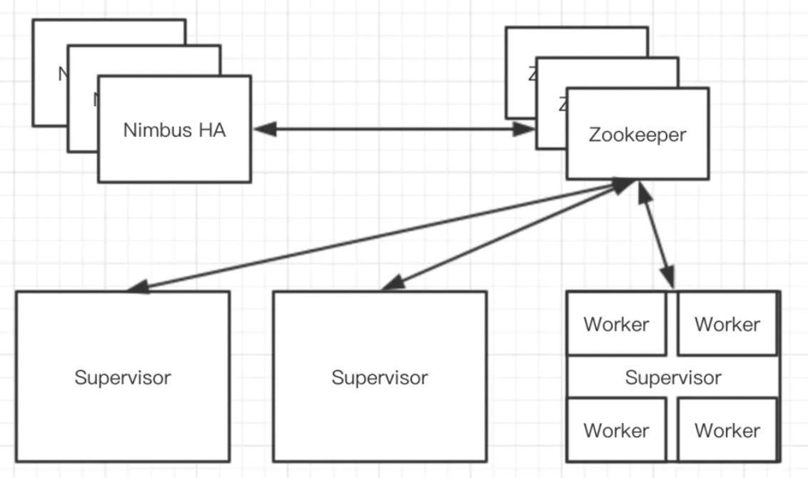

## 3.小型电商网站的商品详情页的页面静态化架构以及缺陷

小型电商

页面静态化

```javascript
<html>
    <title></title>
    <body>
    	商品名称：#{productName}
        商品价格：#{productPrice}
        商品描述：#{productDesc}
    </body>
</html>

--> 渲染

<html>
    <title>
    	<style>
    </title>
    <body>
    	商品名称：#{productName}
        商品价格：#{productPrice}
        商品描述：#{productDesc}
    </body>
</html>

从数据库中查出product表

如果模板改变了，模板对应的所有数据都需要重新渲染一遍，填充到模板中，生成最终的静态化html页面。小网站可以。

大电商不行。
```


## 4.大型电商网站的异步多级缓存构建+nginx数据本地化动态渲染的架构

 大型电商网站的商品详情页系统的核心架构思路


 ```text
多级缓存：nginx+redis+ehcache
优点：
1.如果html模板变了，不用全量重新渲染，直接将最新的html模板已送到nginx服务上
2.大量的情况下，数据是直接从nginx本地取的缓存，没有网络请求开销，没有业务逻辑。渲染到模板中。html页面返回。
 ```


## 5.能够支撑高并发+高可用+海量数据+备份恢复的redis的重要性

缓存架构：

```text
1.redis架构
高并发，高可用，海量数据，备份，随时可以恢复
redis架构，每秒钟几十万的访问量QPS，99.99%的高可用性，TB级的海量数据，备份和恢复 
```


```text
查看cpu核数
cat /proc/cpuinfo | grep "processor" | wc -l
```


## 7.redis cluster安装

京东机器`ssh`报：`ssh_exchange_identification: read: Connection reset by peer`

解决方案：

```text
登录京东服务器
在/etc/hosts.allow中添加：sshd: ALL 然后重启sshd:service sshd restart
```


安装`redis`

```shell
node1:47.105.215.14 node2:120.27.71.78 node3:114.67.67.5

$ cd /usr/local
$ wget http://download.redis.io/releases/redis-4.0.9.tar.gz
$ tar zxvf redis-4.0.9.tar.gz
$ cd redis-4.0.9
$ make && make test && make install

# 需要安装tcl
$ wget http://downloads.sourceforge.net/tcl/tcl8.6.1-src.tar.gz
$ tar -zxvf tcl8.6.1-src.tar.gz
$ cd /usr/local/tcl8.6.1/unix/
$ ./configure
$ make && make install

# 修改redis.conf
bind 0.0.0.0
port 7000
cluster-enabled yes
cluster-config-file nodes.conf
cluster-node-timeout 5000
appendonly yes
protected-mode no # 去掉密码保护

# 启动redis-server
nohup /usr/local/redis-4.0.9/src/redis-server /usr/local/redis-cluster/7001/redis.conf > redis_7001.log 2>&1 &
...


# 启动集群
/usr/local/redis-4.0.9/src/redis-trib.rb create --replicas 1 47.105.215.14:7001 47.105.215.14:7002 120.27.71.78:7003 120.27.71.78:7004 114.67.67.5:7005 114.67.67.5:7006

# 会报错找不到ruby
$ yum -y install ruby ruby-devel rubygems rpm-build
$ gem install redis # 安装redis

### 一直报
>>> Creating cluster
[ERR] Sorry, can't connect to node 47.105.215.14:7001
解决不了。。。
```


使用`docker-compose`安装

1.安装`docker`

```shell
# 更新到最新 yum 包
yum update -y

# 卸载旧版本（如果安装过旧版本的话）
yum remove docker docker-common docker-selinux docker-engine docer-io

# 安装需要的软件包
# yum-util 提供 yum-config-manager 功能， 另外两个是 devicemapper 驱动依赖
yum install -y yum-utils device-mapper-persistent-data lvm2

# 设置 yum 源
yum-config-manager --add-repo https://download.docker.com/linux/centos/docker-ce.repo

# 下载docker-ce 社区版
yum install -y docker-ce

# 启动docker
systemctl start docker

# 查看docker版本
$ docker -v
Docker version 19.03.8, build afacb8b
```


2.安装`docker-compose`

```shell
# 需要先安装企业版linux附加包（epel)
yum -y install epel-release

# 安装pip
yum -y install python-pip

# 更新pip
pip install --upgrade pip

# 安装docker-compose
pip install docker-compose

# 如果报：ImportError: 'module' object has no attribute 'check_specifier'
pip install --upgrade setuptools==30.1.0

## 循环创建文件夹
for port in `seq 8001 8006`; do \
  mkdir -p ./redis/${port}/data; \
done
```


3.`redis`的`yml`文件，使用`host`主机模式：

```yml
version: '3'

services:
 redis1:
  image: publicisworldwide/redis-cluster
  network_mode: host
  restart: always
  volumes:
   - /root/docker/redis/8001/data:/data
  environment:
   - REDIS_PORT=8001

 redis2:
  image: publicisworldwide/redis-cluster
  network_mode: host
  restart: always
  volumes:
   - /root/docker/redis/8002/data:/data
  environment:
   - REDIS_PORT=8002

 redis3:
  image: publicisworldwide/redis-cluster
  network_mode: host
  restart: always
  volumes:
   - /root/docker/redis/8003/data:/data
  environment:
   - REDIS_PORT=8003

 redis4:
  image: publicisworldwide/redis-cluster
  network_mode: host
  restart: always
  volumes:
   - /root/docker/redis/8004/data:/data
  environment:
   - REDIS_PORT=8004

 redis5:
  image: publicisworldwide/redis-cluster
  network_mode: host
  restart: always
  volumes:
   - /root/docker/redis/8005/data:/data
  environment:
   - REDIS_PORT=8005

 redis6:
  image: publicisworldwide/redis-cluster
  network_mode: host
  restart: always
  volumes:
   - /root/docker/redis/8006/data:/data
  environment:
   - REDIS_PORT=8006
```


4.启动

```shell
docker-compose -f docker_redis.yml up

[root@DHG ~]# docker ps
CONTAINER ID        IMAGE                             COMMAND                  CREATED             STATUS              PORTS               NAMES
bb565bafb90c        publicisworldwide/redis-cluster   "/usr/local/bin/entr…"   19 minutes ago      Up 19 minutes                           redis_redis4_1
d2e20b4a9f52        publicisworldwide/redis-cluster   "/usr/local/bin/entr…"   19 minutes ago      Up 19 minutes                           redis_redis6_1
5c8f8e4a83ee        publicisworldwide/redis-cluster   "/usr/local/bin/entr…"   19 minutes ago      Up 19 minutes                           redis_redis3_1
938d1f2a9d1f        publicisworldwide/redis-cluster   "/usr/local/bin/entr…"   19 minutes ago      Up 19 minutes                           redis_redis1_1
375066692d5b        publicisworldwide/redis-cluster   "/usr/local/bin/entr…"   19 minutes ago      Up 19 minutes                           redis_redis5_1
44f18da8c1c6        publicisworldwide/redis-cluster   "/usr/local/bin/entr…"   19 minutes ago      Up 19 minutes                           redis_redis2_1
```


5.将以上的6个容器用集群部署

```shell
# 下载inem0o的redis-trib镜像
docker run --rm -it inem0o/redis-trib create --replicas 1 172.17.0.1:8001 172.17.0.1:8002 172.17.0.1:8003 172.17.0.1:8004 172.17.0.1:8005 172.17.0.1:8006

# 现在redis-trib.rb基本不用了，用：
/redis-cli --cluster create 47.105.215.14:8001 47.105.215.14:8002 47.105.215.14:8003 47.105.215.14:8004 47.105.215.14:8005 47.105.215.14:8006 --cluster-replicas 1
```


6.测试集群

```shell
# 找一台master docker容器进入
docker exec -it 938d1f2a9d1f /bin/bash

# 建立客户端，这里的c是要配置的，表示集群模式
redis-cli -c -h 172.17.0.1 -p 8001

172.17.0.1:8001> set name tutu

# 返回
-> Redirected to slot [5798] located at 172.31.38.158:8002
OK

# 获取值
172.31.38.158:8002> get name
"tutu"
```


## 9.redis的RDB和AOF两种持久化机制的优劣对比

`RDB`对数据进行周期持久化

```text
save 900 1  # 在900s之后，至少有一个key发生变化
save 300 100 # 在300s之后，至少有10个key发生变化
save 60 10000 # 在60s之后，至少有10000个key发生变化
stop-writes-on-bgsave-error yes  
# 设置成yes，当备份进程出错时，主进程就停止进行接收新的写入操作，保证持久化数据的一致性问题。
```

启动命令

```text
SAVE
阻塞Redis服务器进程，服务器不能接收任何请求，直到RDB文件创建完毕

BGSAVE
创建一个子进程，由子进程负责创建RDB文件，服务器进程可以继续接收请求。
```


`AOF`对每条写入命令作为日志，以`append-only`的模式写入一个日志文件中，在`redis`重启的时候，可以通过回收`AOF`日志中的写入指令来重新构建整个数据集。

`AOF`写入步骤：

```text
1.命令追加
命令写入aof_buf缓冲区

2.文件写入
调用flushAppendOnlyFile函数，考虑是否要将aof_buf缓冲区写入AOF文件中

3.文件同步
考虑是否将内存缓冲区的数据真正写入到磁盘中
```

`flushAppendOnlyFile`函数的行为由服务器配置的appendfsync选项决定：

```text
appendfsync always     # 每次有数据修改发生时都会写入AOF文件。性能非常非常差，吞吐量很低。
appendfsync everysec   # 每秒钟同步一次，该策略为AOF的默认策略。QPS可以上万。
appendfsync no         # 从不同步。高效但是数据不会被持久化。
```

**RDB和AOF优缺点**

```text
RDB:
优点：
1.载入时恢复数据快、文件体积小；
2.适合做冷备，将完整的数据文件发送到一些远程的安全存储上；
3.对读写服务影响非常小，因为是fork一个子进程，让子进程执行磁盘IO操作来进行RDB持久化即可。
缺点：
1.默认5分钟或更久生成一次，会一定程度上丢失数据(在持久化之前出现宕机)
2.每次fork子进程来执行RDB快照文件生成时，如果数据文件特别大，可能会导致对客户端提供的服务暂停数毫秒或者数秒。


AOF:
优点：
1.丢失数据少(默认配置只丢失一秒的数据)
2.没有磁盘寻址开销
缺点：恢复数据相对较慢，文件体积大

如果同时开启了RDB和AOF持久化，服务器会有限使用AOF文件来还原数据(AOF更新频率快)
```


```text
redis-cli SHUTDOWN 安全退出，在退出时候会将内存中数据保存到快照中
```


**redis.conf配置**

```text
port 8001
cluster-enabled yes
cluster-config-file nodes.conf
cluster-node-timeout 5000
appendonly yes
# rdb
save 900 1  
save 300 100 
# save 60 10000 
save 60 1000
# aof
appendfsync everysec
auto-aof-rewrite-percentage 100
auto-aof-rewrite-min-size 64mb
```


## 12.AOF持久化深入讲解各种操作

1.rewrite

`redis`数据其实是有限的，很多数据可能会自动过期，可能会被用户删除，可能会被`redis`用缓存清除算法清零掉。但是这些被清理掉的数据对应的写日志还停留在`AOF`中，`AOF`文件就一个，会不断膨胀。

因此，`redis`会每隔一段时间就在后台做`rewrite`操作。

在`redis.conf`中配置`rewrite`策略：

```text
auto-aof-rewrite-percentage 100
auto-aof-rewrite-min-size 64mb

# 比如说：上一次AOF rewrite之后是128mb，然胡接着128mb继续写AOF的日志，如果发现增长比例超过了之前的100%，256mb，就可能会去触发一次rewrite。但是此时还是要去跟min-size 64mb去比较，256mb>64mb，才会触发rewrite
```

`rewrite`步骤：

```text
1.redis fork一个子进程
2.子进程基于当前内存中的数据，构建日志，开始往一个新的临时的AOF文件中写入日志
3.redis主进程，接收到client新的写操作之后，在内存中写入日志，同时新的日志也继续写入旧的AOF文件
4.子进程写完之后，主进程将内存中的新日志再次追加到新的AOF文件中
5.用新的日志文件替换掉旧的日志文件
```


2. AOF和RDB同时工作

```text
1.如果RDB在执行snapshot操作，那么redis不会执行AOF rewrite；如果redis在执行AOF rewrite，那么就不会执行RDB snapshot
2.如果RDB在执行snapshot操作，此时用户执行BGREWRITEAOF命令，那么等RDB快照生成之后，才会去执行AOF rewrite
3.同时有RDB snapshot文件和AOF日志文件，那么redis重启的时候，会优先使用AOF进行数据恢复，因为其中的日志更完整。
```


## 13.在项目中部署redis企业级数据备份方案与数据恢复的容灾演练

`RDB`数据备份（冷备）方案：

```text
1.写crontab定时调度脚本去做数据备份
2.每小时都copy一份rdb的备份，仅仅保留最近48小时的备份
3.每天都保留一份当日的rdb的备份，到一个目录中去，仅仅保留最近一个月的备份
4.每次copy备份的时候，都把太久的备份给删了
5.每天晚上将当前服务器上的所有数据备份，发送一份到远程的服务器上
```

```sh
# 步骤2 redis_rdb_copy_hourly.sh
#!/bin/bash
cur_date = `date +%Y%m%d%k`
rm -rf /usr/local/redis/snappshotting/$cur_date
mkdir -p /usr/local/redis/snappshotting/$cur_date
cp /var/redis/6379/dump.rdb /usr/local/redis/snappshotting/$cur_date

del_date = `date -d -48hours +%Y%m%d%k`
rm -rf /usr/local/redis/snappshotting/$del_date

# 步骤3 redis_rdb_copy_daily.sh
#!/bin/bash
cur_date = `date +%Y%m%d`
rm -rf /usr/local/redis/snappshotting/$cur_date
mkdir -p /usr/local/redis/snappshotting/$cur_date
cp /var/redis/6379/dump.rdb /usr/local/redis/snappshotting/$cur_date

del_date = `date -d -1month +%Y%m%d`
rm -rf /usr/local/redis/snappshotting/$del_date
```

数据恢复方案

```text
1.如果redis进程挂掉了，那么重启redis进程即可，直接基于AOF文件来恢复
2.如果redis进程所在的机器挂掉了，那么重启机器后，尝试重启redis进程，尝试直接基于AOF日志文件进行数据恢复
3.如果redis当前最新的AOF和RDB文件出现了丢失、损失，那么可以尝试基于该机器上当前的某个最新的RDB数据副本进行数据恢复
打开了aof持久化，redis就一定会有限基于aof去恢复，即使文件不在，也会创建一个新的空的aof文件
正确的处理方案：
1）停止aof，暂时在配置中关闭aof
2）然后copy一份rdb过来
3）直接在命令行热修改redis配置，打开aof: config set appendly yes
4.如果当前机器上的所有rdb文件全部损坏，那么从远程的云服务上拉取最新的rdb快照来恢复数据
5.如果发现有重大数据错误，比如某个小时上上线的程序一下子将数据全部污染，数据全错了，可以选择某个更早的时间点，对数据进行恢复。
```


## 14.redis如何通过读写分离来承载请求量QPS超过10万+?

 单机`redis`能承担的`QPS`大概就在上万到几万不等。 属于读多写少。

**读写分离**

```text
主从结构，一主多从，主负责写，并且将数据同步复制到其他的从节点，从节点负载读，所有的读请求全部走丛节点。
```

**水平扩容**

```text
提高读QPS，直接加从节点
```


## 15.redis replication以及master持久化对主从架构的安全意义

**redis replication核心机制**

```text
1.redis采用异步方式复制数据到slave节点，slave node会周期性地确认自己每次复制的数据量
2.一个master node是可以配置多个slave node的
3.slave node也可以连接其他的slave node
4.slave node做复制的时候，是不会block master node的正常工作的
5.slave node在做复制的时候，也不会block对自己的查询操作，会用旧数据集来提供服务；但是复制完成后，需要删除旧数据集，加载新数据集，这个时候就会暂停对外服务
6.slave node主要用来进行横向扩容，做读写分离，扩容的slave node可以提高读的吞吐量
```

**master必须要持久化**


## 16.redis主从复制、断点续传、无磁盘化复制、过期key处理

全量复制、增量复制


```text
1.第一次同步是全量同步
2.如果已经不是第一次复制，主节点将对那些对自己的状态产生修改性影响的指令记录在本地的内存buffer中，然后异步将buffer中的指令同步到从节点。
1）如果网络状态不好，从节点在短时间内无法和主节点进行同步，buffer是有限的，那么buffer中还没有同步的指令可能就会被覆盖，此时需要进行全量同步
2）如果网络正常，可以直接执行增量同步
```

在全量同步时，主节点的复制`buffer`还在往前移动，如果快照同步的时间过长或复制`buffer`太小，都会导致同步期间的增量指令在复制`buffer`中被覆盖，这样就会导致全量同步后无法进行增量同步，然后再次发起全量同步，极有可能造成全量同步的死循环。

所以，务必配置一个合适的复制`buffer`大小参数，避免全量同步的死循环。


**主从复制的断点续传**

主从复制过程中，网络连接断掉了，那么可能接着上次复制的地方继续复制下去，而不是从头复制一份。

主节点内存中有一个`backlog`，里面保存有主从节点的`offset`、还有主节点`id`。


**无磁盘化复制**

主节点在内存中直接创建`rdb`，然后发送给从节点，不会在自己本地落地磁盘了。

`repl-diskless-sync`

`repl-diskless-sync-delay` 等待一定时长再开始复制，因为要等更多从节点重新连接过来。


**过期key处理**

从节点不会过期key，只会等待主节点过期key。如果主节点过期了一个key或者通过LRU淘汰了一个key，那么会模拟一条del命令发送给从节点。


## 17.redis replication的完整运行流程和原理的深度剖析


**核心机制**

```text
1.master和slave都会维护一个offset
master会在自身不断累加offset，slave也会在自身不断累加offset
slave每秒都会上报自己的offset给master，同时master也会保存每个slave的offset
查看数据是否一致

2.backlog
master node有一个backlog 默认是1MB大小
master node给slave node复制数据时，也会将在backlog中同步写一份
backlog主要是用来做全量同步中断后的增量同步

3.master run id
slave根据不同的run id来区分，run id不同就做全量同步
info server命令可以看：run_id:0db373870f650797fa5f6f2c1daa2265a23082db
如果需要不更改run id重启redis，可以使用redis-cli debug reload命令

4.psync
slave node使用psync从master node进行复制，psync runid offset
master ndoe会根据自身的情况返回响应信息，可能是FULLRESYNC runid offset触发全量同步，也可能是CONTINUE触发增量同步
```

**全量同步**

发生场景：

```text
1.redis slave首启动或者重启后，连接到master时(slave node run id会丢失)
2.redis slave进程没重启，但是掉线了，重连后不满足部分复制条件(buffer中存在一些没有被同步的指令被覆盖掉了，存在数据丢失)
```


```text
1.master执行bgsave，在本地生成一份rdb快照文件

2.master node将rdb快照文件发送给slave node，如果rdb复制时间超过60s(repl-timeout)，那么slave node就会认为复制失败，可以适当调节大这个参数
对于千兆网卡的机器，一般每秒传输100MB, 6G文件，很可能超过60s

3.master node在生成rdb时，会将所有新的写命令缓存在内存中，在slave node 保存了rdb之后，再将新的写命令复制给salve node
client-output-buffer-limit slave 256MB 64MB 60，如果在复制期间，内存缓冲区持续消耗超过64MB，或者一次性超过256MB，那么停止复制，复制失败

4.slave node接受到rdb之后，清空自己的旧数据，然后重新加载rdb到自己的内存中，同时基于旧的数据版本堆外提供服务

5.如果slave node开启了AOF，那么会立即执行BGREWRUTEAOF，重写AOF
```

**增量同步**

发生场景：

```text
1.全量复制网络故障断点续传
redis slave掉线或用redis-cli debug reload重启redis（run id不变），master保存在内存的offset可用，被更改的指令都存在buffer中，此时可以用增量复制
说明：
1）master会直接从自己的backlog中获取部分丢失数据，发送给slave node，默认backlog就是1MB
2）master就是根据slave发送的psync中的offset来从backlog中获取数据的
```

**heartbeat**

主从节点互相都会发送`heartbeat`信息

`master`默认每隔10s发送一条`heartbeat`，`slave node`每隔1s发送一个`heartbeat`

**异步复制**

`master`每次接收到写命令之后，先在内部写入数据，然后异步发送给`slave node`

注意：

可以使用`wait`指令实现同步复制。

`wait 1 0` 

第一个参数是从节点的数量N，确保N个从节点同步没有滞后

第二个参数是时间t，以毫秒为单位，表示最多等待时间。如果设置成0，表示无线等待直到N个从节点同步完成。


## 19.对项目的主从redis架构进行QPS压测以及水平扩容支撑更高QPS

```shell
redis-benchmark -h 172.31.38.158 -p 8001 -c 50 -n 100000
 
# output
====== PING_INLINE ======
  100000 requests completed in 3.55 seconds
  50 parallel clients
  3 bytes payload
  keep alive: 1

89.50% <= 1 milliseconds
99.14% <= 2 milliseconds
99.95% <= 6 milliseconds
99.96% <= 7 milliseconds
99.99% <= 8 milliseconds
100.00% <= 8 milliseconds
28208.74 requests per second

====== PING_BULK ======
  100000 requests completed in 3.55 seconds
  50 parallel clients
  3 bytes payload
  keep alive: 1

91.32% <= 1 milliseconds
99.21% <= 2 milliseconds
99.99% <= 3 milliseconds
100.00% <= 3 milliseconds
28137.31 requests per second

====== SET ======
  100000 requests completed in 3.53 seconds
  50 parallel clients
  3 bytes payload
  keep alive: 1

88.96% <= 1 milliseconds
99.10% <= 2 milliseconds
100.00% <= 2 milliseconds
28312.57 requests per second

====== GET ======
  100000 requests completed in 3.52 seconds
  50 parallel clients
  3 bytes payload
  keep alive: 1

90.67% <= 1 milliseconds
99.15% <= 2 milliseconds
100.00% <= 3 milliseconds
28376.85 requests per second

====== INCR ======
  100000 requests completed in 3.48 seconds
  50 parallel clients
  3 bytes payload
  keep alive: 1

91.02% <= 1 milliseconds
99.28% <= 2 milliseconds
100.00% <= 2 milliseconds
28752.16 requests per second

====== LPUSH ======
  100000 requests completed in 3.65 seconds
  50 parallel clients
  3 bytes payload
  keep alive: 1

78.76% <= 1 milliseconds
98.57% <= 2 milliseconds
100.00% <= 3 milliseconds
100.00% <= 3 milliseconds
27412.28 requests per second

====== RPUSH ======
  100000 requests completed in 3.66 seconds
  50 parallel clients
  3 bytes payload
  keep alive: 1

74.70% <= 1 milliseconds
98.33% <= 2 milliseconds
100.00% <= 2 milliseconds
27344.82 requests per second

====== LPOP ======
  100000 requests completed in 3.64 seconds
  50 parallel clients
  3 bytes payload
  keep alive: 1

76.23% <= 1 milliseconds
98.28% <= 2 milliseconds
100.00% <= 2 milliseconds
27480.08 requests per second

====== RPOP ======
  100000 requests completed in 3.65 seconds
  50 parallel clients
  3 bytes payload
  keep alive: 1

76.45% <= 1 milliseconds
98.36% <= 2 milliseconds
100.00% <= 3 milliseconds
27427.32 requests per second

====== SADD ======
  100000 requests completed in 3.52 seconds
  50 parallel clients
  3 bytes payload
  keep alive: 1

89.01% <= 1 milliseconds
99.04% <= 2 milliseconds
99.93% <= 3 milliseconds
99.96% <= 4 milliseconds
100.00% <= 5 milliseconds
28433.32 requests per second

====== HSET ======
  100000 requests completed in 3.57 seconds
  50 parallel clients
  3 bytes payload
  keep alive: 1

89.46% <= 1 milliseconds
99.16% <= 2 milliseconds
100.00% <= 2 milliseconds
28026.90 requests per second

====== SPOP ======
  100000 requests completed in 3.57 seconds
  50 parallel clients
  3 bytes payload
  keep alive: 1

89.70% <= 1 milliseconds
99.11% <= 2 milliseconds
100.00% <= 2 milliseconds
28050.49 requests per second

====== LPUSH (needed to benchmark LRANGE) ======
  100000 requests completed in 3.67 seconds
  50 parallel clients
  3 bytes payload
  keep alive: 1

72.47% <= 1 milliseconds
98.04% <= 2 milliseconds
100.00% <= 3 milliseconds
27277.69 requests per second

====== LRANGE_100 (first 100 elements) ======
  100000 requests completed in 4.75 seconds
  50 parallel clients
  3 bytes payload
  keep alive: 1

3.91% <= 1 milliseconds
97.29% <= 2 milliseconds
99.61% <= 3 milliseconds
100.00% <= 3 milliseconds
21052.63 requests per second

====== LRANGE_300 (first 300 elements) ======
  100000 requests completed in 8.75 seconds
  50 parallel clients
  3 bytes payload
  keep alive: 1

0.17% <= 1 milliseconds
19.34% <= 2 milliseconds
93.65% <= 3 milliseconds
98.01% <= 4 milliseconds
99.40% <= 5 milliseconds
99.98% <= 6 milliseconds
100.00% <= 6 milliseconds
11433.80 requests per second

====== LRANGE_500 (first 450 elements) ======
  100000 requests completed in 11.01 seconds
  50 parallel clients
  3 bytes payload
  keep alive: 1

0.02% <= 1 milliseconds
3.50% <= 2 milliseconds
64.43% <= 3 milliseconds
93.86% <= 4 milliseconds
97.90% <= 5 milliseconds
99.18% <= 6 milliseconds
99.91% <= 7 milliseconds
100.00% <= 8 milliseconds
100.00% <= 8 milliseconds
9083.48 requests per second

====== LRANGE_600 (first 600 elements) ======
  100000 requests completed in 13.45 seconds
  50 parallel clients
  3 bytes payload
  keep alive: 1

0.00% <= 1 milliseconds
1.23% <= 2 milliseconds
13.43% <= 3 milliseconds
84.41% <= 4 milliseconds
94.87% <= 5 milliseconds
97.86% <= 6 milliseconds
99.16% <= 7 milliseconds
99.71% <= 8 milliseconds
99.98% <= 9 milliseconds
100.00% <= 9 milliseconds
7433.29 requests per second

====== MSET (10 keys) ======
  100000 requests completed in 3.60 seconds
  50 parallel clients
  3 bytes payload
  keep alive: 1

89.23% <= 1 milliseconds
98.73% <= 2 milliseconds
100.00% <= 3 milliseconds
100.00% <= 3 milliseconds
27770.06 requests per second
```


## 20.redis主从架构下如何才能做到99.99%的高可用性？

`99.99%` 系统可用时间/总的时间

```text
master node 挂掉，没法写数据，写缓存全部失效
slave node 挂掉，不会影响可用性，其他slave在提供相同数据下的相同的对外查询服务
```

**主备切换**

`master node`故障时，自动检测，并且将某个`slave node`自动切换成`master node`的过程，叫主备切换。这个过程实现了`redis`的主从架构下的高可用性。


## 26.redis如何在保持读写分离+高可用的架构下，还能横向扩容支撑1T+海量数据？

单`master`瓶颈：

`master`节点的数据和`slave`节点的数据是一模一样的，`master`最大能容纳多大的数据量，那么`slave`也就只能容纳多大的数据量。

注意内存一般不会超限：缓存清理算法，将旧的很少使用的数据给清除出内存，保证内存中只有固定大小的内存，不可能超过`master`内存的物理上限。

**横向扩容**

配置多个`master`和多个`slave`。

**redis cluster vs. replication+sentinel**

数据量很少，主要承载高并发性能的场景，比如你的缓存一般就几个G，单机就足够了。此时可以用一个`master`加多个`slave`，具体要几个`slave`跟吞吐量有关系。然后自己搭建一个`sentinel`集群，去保证`redis`主从架构的高可用。

海量数据+高并发+高可用的场景，使用`redis cluster`。


## 27.hash算法+一致性hash算法+redis cluster的hash slot算法

分布式数据存储的核心算法

```text
hash算法 --> 一致性hash算法(memcached)  --> redis cluster hash slot问题

1.hash算法 取模，比如说有3台master，如果某一个master宕机，新请求对剩下的2台master取模，此时这两台master的缓存全部失效。

2.一致性hash算法
key hash取值落在圆环上，顺时针去寻找距离自己最近的一个节点
任何一个master宕机，只有之前的那个master上的数据受到影响，1/3的流量会瞬间涌入数据库中，重新查询一次。
缓存热点问题 --> 虚拟节点

3.hash slot算法
16384个hash slot，对每个key计算CRC16值，然后对16384取模，可以获取key对应的hash slot
如果某台master宕机，会将它的hash slot移动到其他master上去。
移动hash slot的成本是非常低的，客户端的api，可以对指定的数据，让他们走同一个hash slot，通过hash tag来实现。
```

 `redis cluster`

```text
1) 自动将数据进行分片，每个master上放一部分数据
2）提供内置的高可用支持，部分master不可用时，还是可以继续工作的。 
3）每个redis需要放开两个端口，比如6379、16379，16379端口号是用来进行节点间通信的，也就是cluster bus的通信，用来进行故障检测，配置更新，故障转移授权。
```


## 28.搭建一套读写分离+高可用+多master的redis  cluster集群

集群最少`3master3slave`

```text
1.读写分离：每个master都有一个slave
(注意：一般都是主读主写！)
2.高可用：master宕机，slave自动被切换过去
3.多master：横向扩展支持更大数据量
```


## 29.对项目redis cluster实验多master写入、读写分离、高可用性

1.多`master`写入

数据通过`hash slot`分配到各个`master`节点，分布式存储


2.不同`master`各自的`slave`读取(读写分离)

`redis-cli -c`启动，就会自动进行各种高低层的重定向的操作。

例如：

```text
127.0.0.1:8004> get mykey2
-> Redirected to slot [14119] located at 172.31.38.158:8003
"v2"
```

`redis cluster`对读写分离支持不太好，`master`节点主读主写，可以扩容，也能提高吞吐量，跟读写分离达到的效果是一样的。


**阿里云不同账号之间机器ping接**

[参考](<https://help.aliyun.com/document_detail/65901.html?spm=a2c4g.11186623.6.559.5e4c2de0zLi3C0>)

困扰我一天的问题，阿里云机器上的端口号无法被外网访问，是需要设置[安全组](<https://help.aliyun.com/document_detail/25471.html>)

```text
docker run --rm -it inem0o/redis-trib add-node 172.31.27.225:8001 172.17.0.1:8001
```


## 32.redis cluster的核心原理分析：gossip通信、jedis smart定位、主备切换

**gossip协议**

小道流言

所有节点都持有一份元数据，不同节点如果出现了元数据的变更，就不断将元数据发送给其他节点，让其他数据也进行元数据的变更。

参考：

一个节点想要分享一些信息给网络中的其他的一些节点。于是，它**周期性**的**随机**选择一些节点，并把信息传递给这些节点。这些收到信息的节点接下来会做同样的事情，即把这些信息传递给其他一些随机选择的节点。一般而言，信息会周期性的传递给N个目标节点，而不只是一个。这个N被称为**fanout**（这个单词的本意是扇出）。


计算是2.16次即可扩散开，可能会要3-4次才能扩散到全部节点。

```text
1.可扩展性
因为它只需要O(logN) 个周期就能把消息传播给所有节点。某个节点在往固定数量节点传播消息过程中，并不需要等待确认（ack），并且，即使某条消息传播过程中丢失，它也不需要做任何补偿措施。
同时：在节点成倍扩大的情况下，循环次数并没有增加很多。

2.失败容错
Gossip也具备失败容错的能力，即使网络故障等一些问题，Gossip协议依然能很好的运行。因为一个节点会多次分享某个需要传播的信息，即使不能连通某个节点，其他被感染的节点也会尝试向这个节点传播信息。

3.健壮性
Gossip协议下，没有任何扮演特殊角色的节点（比如leader等）。任何一个节点无论什么时候下线或者加入，并不会破坏整个系统的服务质量。
可能存在拜占庭问题。即如果有一个恶意传播消息的节点，Gossip协议的分布式系统就会出问题。
```

**集中式 vs. gossip协议**

1.集中式

将集群元数据（节点信息、故障等）集中存储在某个节点上

优点：时效性非常好

缺点：所有的元数据的更新压力全部集中在一个地方，可能会导致元数据的存储有压力

2.gossip

互相之间不断通信，保持整个集群所有节点的数据是完整的

优点：元数据的更新比较分散，降低了压力

缺点：元数据更新有延时，可能导致集群的一些操作会有一些滞后

**gossip协议内容**

```text
meet:某个节点发送meet给新加入的节点，让新节点加入集群中，然后新节点就会开始与其他节点进行通信
ping:每个节点都会频繁给其他节点发送ping，其中包含自己的状态还有自己维护的集群元数据，互相通过ping交换元数据
pong:返回ping和meet，包好自己的状态和其他信息，也可以用于信息广播和更新
fail:某个节点判断另一个节点fail之后，就发送fail给其他节点，通知其他节点，指定的节点宕机
```


## 33.redis在实践中的一些常见问题以及优化思路

```text
1.fork耗时导致高并发强求延时
fork子进程是需要拷贝父进程的空间内存页表，会耗费一定的时间
1G数据 fork可能要需要20ms
fork耗时跟redis主进程的最大内存有关系，一般控制在10G以内吧

2.AOF的阻塞问题
redis将数据写入AOF缓存区，单独开一个现场做fsync操作，每秒一次
但是redis主线程会检查两次fsync的时间，如果距离上次fsync时间超过了2s，那么写请求就会阻塞。
此时 AOF策略是everysec，可能就会丢失2s数据
优化思路：采用SSD，不要用普通的机械硬盘

3.主从复制延迟问题
主从复制可能会超时严重，这个时候需要良好的监控和报警机制
在 info replication中，可以看到master和slave复制的offset，做一个差值就可以看到对应的延迟量，可设置报警

4.主从复制风暴问题
如果一下子让多个slave从master去执行全量复制，一份大的rdb同时发送到多个slave，会导致网络带宽被严重占用
如果一个master真的要挂载多个slave，尽量采用树型结构，不要用星型结构

5.vm.overcommit_memory
0：检查有没有足够内存，没有的话申请内存失败
1：允许使用内存知道用完为止
2：内存地址那个键不能超过swap+50%
如果设置为0，可能导致类似fork等操作执行失败，申请不到足够的内存空间

cat /proc/sys/vm/overcommit_memory
0

echo "vm.overcommit_memory=1" >> /etc/sysctl.conf
sysctl vm.overcommit_memory=1

6.swapiness
cat /proc/version 查看linux版本
如果linux内核版本<3.5 那么swapiness设置为0，系统宁愿swap也不会oom killer(杀掉进程)
如果linux内核版本>=3.5 那么swaponess设置为1，这样系统宁愿swap也不会oom killer
保证redis不会被杀掉

echo 1 > /proc/sys/vm/swappiness
echo vm.swappiness=0 >> /etc/sysctl.conf

7.最大句柄文件
ulimit -Sn 10032 10032

8.tcp backlog
cat /proc/sys/net/core/somaxconn
echo 511 > /proc/sys/net/core/somaxconn
```


## 34.总结：1T以上海量数据+10万以上QPS高并发+99.99%高可用

```text
1.讲解redis是为了什么？
商品详情页系统，支撑高并发、亿级流量的主要就是其中的大型的缓存架构
缓存架构中最重要的是redis
大量的离散请求，随机请求，各种你未知的用户过来，需要对其进行缓存。

2.讲解redis主要是为了什么？
redis:持久化、复制(主从架构)、哨兵(高可用、主备切换)、redis cluster(海量数据+横向扩容+高可用/主备切换)
持久化：高可用的一部分，在发生redis集群灾难的情况下(比如说部分master+slave全部死掉了)，如何快速进行数据恢复，快速实现服务可用，才能实现整个系统的高可用
复制：主从架构，maste-->slave 复制，读写分离架构，写master，读slave，横向扩容slave支撑更高的读吞吐，读高并发，横向扩容。
哨兵：高可用 主从架构，在master故障的时候，快速将slave切换成master，实现快速的灾难恢复，实现高可用
redis cluster：多master读写，数据分布式的存储，横向扩容，快速支撑更高的数据量+更高的qps，自动进行master->slave的主备切换，高可用

让底层的缓存系统，redis，实现能够任意水平扩容，支撑海量数据（几十T），支撑很高的读写QPS(单台几万QPS)，高可用性(每个实例都做好AOF+RDB的备份策略+容灾策略，slave->master主备切换)

3.redis第一套企业级的架构
1）如果数据量不大，单master就看可以容纳 10G以内
redis持久化+备份方案+容灾方案+replication(主从+读写分离)+sentinel(哨兵集群，3节点，高可用)
2）如果数据量很大，使用redis cluster
多master分布式存储数据，水平扩容
```


## 35.亿级流量商品详情页的多级缓存架构以及架构中每一层的意义

1.上亿流量的商品详情页系统的多级缓存架构

采用多级缓存：

`nginx`本地缓存+`redis`分布式缓存+`tomcat`堆缓存

```text
1.nginx本地缓存
热点数据保留在nginx本地缓存内

2.redis分布式缓存
离散访问，支持海量的数据，高并发访问，高可用服务

3.tomcat jvm堆缓存
redis如果出现大规模宕机，导致nginx大量流量直接涌入数据生产服务，此时用tomcat内存缓存抗一抗，不至于让数据库直接裸奔。
tomcat jvm堆内存缓存，也可以抗住redis没有cache住的部分数据。
```


## 36.Cache Aside Pattern缓存+数据库读写模式的分析

`Cache Aside Pattern`

```text
1.读的时候先读缓存，缓存没有就去读数据库
2.写的时候先删掉缓存，再更新数据库

为什么是删除缓存不是更新缓存？
lazy计算的思想，不要每次都重新做复杂的计算，不管它会不会用到，而是让它到需要被使用的时候再重新计算。
```


## 37.高并发场景下的缓存+数据库双写不一致问题分析与解决方案设计

读操作没问题

更新操作：更新缓存、删除缓存，一般都是删除缓存。

两种策略：

1.先更新数据库，再删除缓存。

```text
原子性被破坏：
1.更新数据库成功，删除缓存失败，数据不一致
2.更新数据库失败，直接返回错误(Exception)，不会出现数据不一致。
```

解决方案：

`Cache Aside Pattern`


高并发下可能出现不一致的场景：

```text
缓存刚好失效 --> 线程A查询数据库，得一个旧值 --> 线程B将新值写入数据库 --> 线程B删除缓存 --> 线程A将查到的旧值写入缓存。 
```

**删除缓存失败的解决思路**：

```text
1.将需要删除的key发送到消息队列中
2.自己消费消息，获取需要删除的key
3.不断重试删除操作，直到成功
```

2.先删除缓存，再更新数据库

```text
原子性被破坏：
1.删除缓存成功，更新数据库失败，数据一致
2.删除缓存失败，直接返回错误(Exception)，数据库和缓存的数据还是一致的。
```

高并发下可能出现不一致的场景：

```text
线程A删除了缓存 --> 线程B查询，发现缓存已不存在 --> 线程B去数据库查询得到旧值 --> 线程B将旧值写入缓存 --> 线程A将新值写入数据库
```

**解决思路**

将删除缓存、修改数据库、读取缓存等操作积压到队列里边，实现串行化。

多个更新缓存请求串在一起没有意义，可以做过滤，如果发现队列中已经有一个更新缓存的请求了，那么就不用再放个更新请求操作进去了，直接等待前面的更新操作请求完成即可。

**高并发请求时该解决方案存在问题**

```text
1.读请求阻塞
最大的风险在于：数据更新很频繁，导致队列中积压了大量更新操作在里面，然后读请求会发生大量的超时，最后导致大量的请求直接走数据库
务必模拟一些真实的测试，看看更新数据的频繁是怎样的。
大部分情况下，大量的读请求过来，都是直接走缓存取到数据，少量情况，可能遇到读跟数据更新冲突的情况，此时将更新操作先入队列，之后可能会瞬间来了对这个数据大量的读请求，因为做了去重的优化，也就一个更新缓存的操作在它后面。
等数据更新完了，读请求触发的缓存更新操作也完成，然后临时等待的读请求全部可以读到缓存中的数据。

2.读请求并发量过高
做好压力测试

3.多服务实例请求路由
执行数据更新操作，以及执行缓存更新操作的请求，都通过nginx服务器路由到相相同的服务实例

4.热点商品的路由问题，导致请求的倾斜
万一某个商品的读写请求特别高，全部打到相同的机器的相同的队列里面去，可能造成某台机器的压力过大
但是一般只有在商品数据更新的时候才会清空缓存，才会导致读写并发，这种场景不是太常见。
```


## 38

`kafka/zookeeper/kafka-manager`集群搭建

1.先创建网络

```shell
docker network create --driver bridge --subnet 172.23.0.0/25 --gateway 172.23.0.1  zookeeper_network
```

2.集群`yml`配置

```yml
version: '2'

services:
  zookeeper1:
    image: zookeeper # 镜像
    restart: always # 重启
    container_name: zookeeper1
    hostname: zookeeper1
    ports:
      - "2181:2181"
    volumes:
      - "/root/docker/zk/zoo.cfg:/conf/zoo.cfg"
      - "/root/docker/zookeeper1/data:/data"
      - "/root/docker/zookeeper1/datalog:/datalog"
    environment:
      ZOO_MY_ID: 1 # id
      ZOO_SERVERS: server.1=zookeeper1:2888:3888 server.2=zookeeper2:2888:3888 server.3=zookeeper3:2888:3888 # zk集群配置
    networks:
      default:
        ipv4_address: 172.23.0.11

  zookeeper2:
    image: zookeeper
    restart: always
    container_name: zookeeper2
    hostname: zookeeper2
    ports:
      - "2182:2181"
    volumes:
      - "/root/docker/zk/zoo.cfg:/conf/zoo.cfg"
      - "/root/docker/zookeeper2/data:/data"
      - "/root/docker/zookeeper2/datalog:/datalog"
    environment:
      ZOO_MY_ID: 2
      ZOO_SERVERS: server.1=zookeeper1:2888:3888 server.2=zookeeper2:2888:3888 server.3=zookeeper3:2888:3888
    networks:
      default:
        ipv4_address: 172.23.0.12

  zookeeper3:
    image: zookeeper
    restart: always
    container_name: zookeeper3
    hostname: zookeeper3
    ports:
      - "2183:2181"
    volumes:
      - "/root/docker/zk/zoo.cfg:/conf/zoo.cfg"
      - "/root/docker/zookeeper3/data:/data"
      - "/root/docker/zookeeper3/datalog:/datalog"
    environment:
      ZOO_MY_ID: 3
      ZOO_SERVERS: server.1=zookeeper1:2888:3888 server.2=zookeeper2:2888:3888 server.3=zookeeper3:2888:3888
    networks:
      default:
        ipv4_address: 172.23.0.13

  kafka1:
    image: wurstmeister/kafka # 镜像
    restart: always
    container_name: kafka1
    hostname: kafka1
    ports:
      - 9092:9092
      - 9999:9999
    environment:
      KAFKA_ADVERTISED_LISTENERS: PLAINTEXT://172.31.27.225:9092 # 暴露在外的地址
      KAFKA_ADVERTISED_HOST_NAME: kafka1 
      KAFKA_HOST_NAME: kafka1
      KAFKA_ZOOKEEPER_CONNECT: zookeeper1:2181,zookeeper2:2181,zookeeper3:2181
      KAFKA_ADVERTISED_PORT: 9092 # 暴露在外的端口
      KAFKA_BROKER_ID: 0 # 
      KAFKA_LISTENERS: PLAINTEXT://0.0.0.0:9092
      KAFKA_JMX_OPTS: "-Dcom.sun.management.jmxremote -Dcom.sun.management.jmxremote.authenticate=false -Dcom.sun.management.jmxremote.ssl=false -Djava.rmi.server.hostname=kafka1 -Dcom.sun.management.jmxremote.rmi.port=9999"
      JMX_PORT: 9999 # 这里得配置，不然启动kafka-manager会报：Failed to get broker metrics for BrokerIdentity
    volumes:
      - /etc/localtime:/etc/localtime
      - /root/docker/kafka1/logs:/kafka
    links:
      - zookeeper1
      - zookeeper2
      - zookeeper3
    networks:
      default:
        ipv4_address: 172.23.0.14

  kafka2:
    image: wurstmeister/kafka
    restart: always
    container_name: kafka2
    hostname: kafka2
    ports:
      - 9093:9092
      - 9998:9999
    environment:
      KAFKA_ADVERTISED_LISTENERS: PLAINTEXT://172.31.27.225:9093
      KAFKA_ADVERTISED_HOST_NAME: kafka2
      KAFKA_HOST_NAME: kafka2
      KAFKA_ZOOKEEPER_CONNECT: zookeeper1:2181,zookeeper2:2181,zookeeper3:2181
      KAFKA_ADVERTISED_PORT: 9093
      KAFKA_BROKER_ID: 1
      KAFKA_LISTENERS: PLAINTEXT://0.0.0.0:9092
      KAFKA_JMX_OPTS: "-Dcom.sun.management.jmxremote -Dcom.sun.management.jmxremote.authenticate=false -Dcom.sun.management.jmxremote.ssl=false -Djava.rmi.server.hostname=kafka2 -Dcom.sun.management.jmxremote.rmi.port=9999"
      JMX_PORT: 9999
    volumes:
      - /etc/localtime:/etc/localtime
      - /root/docker/kafka2/logs:/kafka
    links:
      - zookeeper1
      - zookeeper2
      - zookeeper3
    networks:
      default:
        ipv4_address: 172.23.0.15

  kafka3:
    image: wurstmeister/kafka
    restart: always
    container_name: kafka3
    hostname: kafka3
    ports:
      - 9094:9092
      - 9997:9999
    environment:
      KAFKA_ADVERTISED_LISTENERS: PLAINTEXT://172.31.27.225:9094
      KAFKA_ADVERTISED_HOST_NAME: kafka3
      KAFKA_HOST_NAME: kafka3
      KAFKA_ZOOKEEPER_CONNECT: zookeeper1:2181,zookeeper2:2181,zookeeper3:2181
      KAFKA_ADVERTISED_PORT: 9094
      KAFKA_BROKER_ID: 2
      KAFKA_LISTENERS: PLAINTEXT://0.0.0.0:9092
      KAFKA_JMX_OPTS: "-Dcom.sun.management.jmxremote -Dcom.sun.management.jmxremote.authenticate=false -Dcom.sun.management.jmxremote.ssl=false -Djava.rmi.server.hostname=kafka3 -Dcom.sun.management.jmxremote.rmi.port=9999"
      JMX_PORT: 9999
    volumes:
      - /etc/localtime:/etc/localtime
      - /root/docker/kafka3/logs:/kafka
    links:
      - zookeeper1
      - zookeeper2
      - zookeeper3
    networks:
      default:
        ipv4_address: 172.23.0.16

  kafka-manager:
    image: hlebalbau/kafka-manager:1.3.3.22
    restart: always
    container_name: kafka-manager
    hostname: kafka-manager
    ports:
      - 9000:9000
    links:
      - kafka1
      - kafka2
      - kafka3
      - zookeeper1
      - zookeeper2
      - zookeeper3
    environment:
      ZK_HOSTS: zookeeper1:2181,zookeeper2:2181,zookeeper3:2181
      KAFKA_BROKERS: kafka1:9092,kafka2:9093,kafka3:9094
      APPLICATION_SECRET: letmein
      KAFKA_MANAGER_AUTH_ENABLED: "true" # 开启验证
      KAFKA_MANAGER_USERNAME: "admin" # 用户名
      KAFKA_MANAGER_PASSWORD: "admin" # 密码
      KM_ARGS: -Djava.net.preferIPv4Stack=true
    networks:
      default:
        ipv4_address: 172.23.0.10

networks:
  default:
    external:
      name: zookeeper_network
```

注意：

```text
1.JMX_PORT、KAFKA_JMX_OPTS必须要配置
不然会报：Failed to get broker metrics for BrokerIdentity

2.但是配置之后进kafka容器内部创建topic会报：
Port already in use: 9999; nested exception is:
	java.net.BindException: Address in use (Bind failed)
	at sun.management.jmxremote.ConnectorBootstrap.exportMBeanServer(ConnectorBootstrap.java:800)
	at sun.management.jmxremote.ConnectorBootstrap.startRemoteConnectorServer(ConnectorBootstrap.java:468)
	at sun.management.Agent.startAgent(Agent.java:262)
	at sun.management.Agent.startAgent(Agent.java:452)
Caused by: java.rmi.server.ExportException: Port already in use: 9999; nested exception is:
	java.net.BindException: Address in use (Bind failed)

解决方案：
在执行命令前先加上：unset JMX_PORT
eg：
unset JMX_PORT
kafka-topics.sh --create --zookeeper zookeeper1:2181 --replication-factor 1 --partitions 3 --topic cache-message
```


## 40.在库存服务中实现缓存与数据库双写一致性保障方案

```text
1.线程池+内存队列初始化
java web应用，做系统的初始化，一般在ServletContextListener里面做，listener，会跟着整个web应用的启动就初始化，类似于线程池初始化的构建。

spring boot应用，Application搞一个listener的注册

2.两种请求对象封装

3.请求异步执行Service封装
4.两种请求Controller接口封装
5.读请求去重优化
6.空数据读请求过滤优化
空数据的情况：
1）数据库本来就没数据，缓存肯定没数据
2）数据库在执行数据更新操作，先删除了缓存
3）redis本身是有缓存，但是内存满了，执行了lru算法删掉了缓存
```

### 40.1.线程池+内存队列

```java
// 线程池
// RequestProcesserThreadPool.java
@Data
public class RequestProcessorThreadPool {

    private int nThread = 10;

    private int queueCapacity = 1000;
    // 线程池
    private ExecutorService threadPool = Executors.newFixedThreadPool(nThread);

    public RequestProcessorThreadPool() {
        RequestQueue requestQueue = RequestQueue.getInstance();
        // 将每个线程绑定一个队列
        for (int i = 0; i < nThread; i++) {
            ArrayBlockingQueue<Request> queue = new ArrayBlockingQueue<>(queueCapacity);
            requestQueue.addQueue(queue);
            threadPool.submit(new WorkThread(queue));
        }
    }

    /**
     * 初始化入口
     */
    public static void init() {
        getInstance();
    }

    /**
     * 利用jvm保证多线程并发安全
     *
     * @return
     */
    public static RequestProcessorThreadPool getInstance() {
        return Singleton.getInstance();
    }


    /**
     * 静态内部类只会被初始化一次
     */
    private static class Singleton {
        private static RequestProcessorThreadPool instance;

        static {
            // 执行RequestProcessorThreadPool的空参构造
            instance = new RequestProcessorThreadPool();
        }

        public static RequestProcessorThreadPool getInstance() {
            return instance;
        }
    }
}
// 线程池在application启动的时候完成初始化，可以有两种方式：
// 1.系统初始化监听器
@Slf4j
public class InitListener implements ServletContextListener {
    public void contextInitialized(ServletContextEvent sce) {
        log.info("===== 初始化系统监听器 =====\n===== 初始化线程池 + 内存队列 =====");
        // 初始化线程池 + 内存队列
        RequestProcessorThreadPool.init();
    }

    public void contextDestroyed(ServletContextEvent sce) {
    }
}
// 2.采用StartUpInitialization implements ApplicationRunner，重写run方法进行服务的初始化操作。
@Slf4j
@Component  // 元注解，可以注解其他注解
public class StartUpInitialization implements ApplicationRunner {
    @Override
    public void run(ApplicationArguments args) throws Exception {
        log.info("StartUpInitialization:===== 初始化系统监听器 =====");
        log.info("StartUpInitialization:===== 初始化线程池 + 内存队列 =====");
        RequestProcessorThreadPool.init();
    }
}
```


```java
// 内存队列，也处理成单例，一个线程对应一个内存队列
// RequestQueue.java
public class RequestQueue {

    /**
     * 内存队列
     */
    private List<ArrayBlockingQueue<Request>> queues = new ArrayList<ArrayBlockingQueue<Request>>();

    /**
     * 标识位map,必须承载线程安全。
     * 有三种值：
     * null： 前面没有该id对应的请求
     * true： 前面有个一个写请求
     * false：前面有一个写请求 +  一个读请求
     */
    private Map<Long, Boolean> flagMap = new ConcurrentHashMap();

    /**
     * 单例有很多种方式去实现：我采取绝对线程安全的一种方式
     * <p>
     * 静态内部类的方式，去初始化单例
     */
    private static class Singleton {

        private static RequestQueue instance;

        static {
            instance = new RequestQueue();
        }

        public static RequestQueue getInstance() {
            return instance;
        }

    }

    /**
     * jvm的机制去保证多线程并发安全
     * <p>
     * 内部类的初始化，一定只会发生一次，不管多少个线程并发去初始化
     *
     * @return
     */
    public static RequestQueue getInstance() {
        return Singleton.getInstance();
    }

    /**
     * 添加一个内存队列
     *
     * @param queue
     */
    public void addQueue(ArrayBlockingQueue<Request> queue) {
        this.queues.add(queue);
    }

    /**
     * 获取内存队列的数量
     *
     * @return
     */
    public int queueSize() {
        return queues.size();
    }

    /**
     * 获取内存队列
     *
     * @param index
     * @return
     */
    public ArrayBlockingQueue<Request> getQueue(int index) {
        return queues.get(index);
    }

    public Map<Long, Boolean> getFlagMap() {
        return flagMap;
    }

}

```


```java
// 工作线程
@Slf4j
public class WorkThread implements Callable<Boolean> {

    private ArrayBlockingQueue<Request> queue;

    public WorkThread(ArrayBlockingQueue<Request> queue) {
        this.queue = queue;
    }

    @Override
    public Boolean call() {
        // 循环从queue中获取请求进行处理
        try {
            while (true) {
                Request request = queue.take();

                if (!request.isForceRefresh()) {  // 如果不是强制刷新，才进行读请求去重
                    // 1、先做读请求的去重
                    RequestQueue requestQueue = RequestQueue.getInstance();
                    Map<Long, Boolean> flagMap = requestQueue.getFlagMap();

                    // 如果是写请求 ==> 将标志位置为：true
                    if (request instanceof InventoryCntDBUpdateRequest) {
                        log.info("=======写请求=======");
                        flagMap.put(request.getProductId(), true);
                    } else if (request instanceof InventoryCntCacheRefreshRequest) {
                        log.info("=======读请求=======");
                        Boolean flag = flagMap.get(request.getProductId());

                        // flag为null，表示之前没有写请求，数据库中没有该条记录。【通过别的程序导入的除外】
                        if (flag == null) {
                            // 设为false，后面的数据库中没有数据读请求也会被过滤掉，不写入内存队列
                            flagMap.put(request.getProductId(), false);
                        }

                        // 如果是读请求，并且标志位为：false，说明前面一个是写请求 + 一个读请求 ==> 直接return，controller层会循环查询redis的
                        if (flag != null && !flag) {
                            return true;
                        }

                        // 如果是读请求，并且标志位为：true，说明前面一个是写请求 ==> 将标志位置为：false
                        if (flag != null && flag) {
                            flagMap.put(request.getProductId(), false);
                        }
                    }
                }
                request.process();
                // 读请求执行完后，标志位一直是false，一旦redis的该数据被LRU了，后面的读请求都不会走request.process()了【无法查询数据更新缓存】
            }
        } catch (Exception ex) {
            ex.printStackTrace();
        }
        return true;
    }
}

```

### 40.2.两种请求对象的封装

数据更新请求`InventoryCntDBUpdateRequest`

```text
1.先删除缓存
2.再更新数据库
```

```java
@Slf4j
public class InventoryCntDBUpdateRequest implements Request {

    private Inventory inventory;

    private ProductInventoryService inventoryService;

    public InventoryCntDBUpdateRequest(Inventory inventory, ProductInventoryService inventoryService) {
        this.inventory = inventory;
        this.inventoryService = inventoryService;
    }

    /**
     * 处理request请求
     */
    @Override

    public void process() {
        log.info("InventoryCntCacheRefreshRequest, productId = {}", inventory.getProductId());
        inventoryService.removeProductInventoryCache(inventory);
        inventoryService.updateProductInventory(inventory);
        log.info("写请求：更新数据库成功");
    }

    @Override
    public Long getProductId() {
        return inventory.getProductId();
    }

    /**
     * 写请求永远不更新缓存
     *
     * @return
     */
    @Override
    public boolean isForceRefresh() {
        return false;
    }
}
// 其中removeProductInventoryCache方法
public void removeProductInventoryCache(Inventory inventory) {
    String key = RedisKeys.PRODUCT_INVENTORY + inventory.getProductId();
    redisDAO.del(key);
}
// 其中updateProductInventory方法
public void updateProductInventory(Inventory inventory) {
    InventoryExample example = new InventoryExample();
    InventoryExample.Criteria criteria = example.createCriteria();
    criteria.andProductIdEqualTo(inventory.getProductId());
    List<Inventory> inventories = inventoryMapper.selectByExample(example);
    if (inventories == null) {
        inventoryMapper.insert(inventory);
    } else {
        inventoryMapper.updateByExampleSelective(inventory, example);
    }
}
```

更新缓存请求`InventoryCntCacheRefreshRequest`

```java
@Slf4j
public class InventoryCntCacheRefreshRequest implements Request {

    private Long productId;

    private ProductInventoryService inventoryService;

    /**
     * 是否强制刷新缓存。
     * 每次从redis中没有查到，但是从mysql中查到了，都强制刷新缓存
     */
    private boolean forceRefresh;

    public InventoryCntCacheRefreshRequest(Long productId, ProductInventoryService inventoryService, boolean forceRefresh) {
        this.productId = productId;
        this.inventoryService = inventoryService;
        this.forceRefresh = forceRefresh;
    }

    /**
     * 查询redis缓存为空时，
     * 1、需要直接查询数据库
     * 2、将查询结果刷新到redis
     */
    @Override
    public void process() {
        log.info("InventoryCntCacheRefreshRequest, productId = {}", productId);
        Inventory inventoryFromDb = inventoryService.getProductInventoryById(productId);
        inventoryService.updateProductInventoryCache(inventoryFromDb);
    }

    @Override
    public Long getProductId() {
        return productId;
    }
    @Override
    public boolean isForceRefresh() {
        return forceRefresh;
    }
}
```

### 40.3.请求异步执行`Service`封装

作用：请求路由

```java
@Service
public class RequestAsyncProcessServiceImpl implements RequestAsyncProcessService {

    @Autowired
    private InventoryConfig inventoryConfig;

    @Override
    public void wrapper(Request request) {
        try {
            // 做请求的路由，根据每个商品的id，路由到对应的内存队列中去
            ArrayBlockingQueue<Request> queue = getRoutingQueue(request.getProductId());
            // 将请求放入对应的队列中，完成路由操作
            queue.put(request);
        } catch (InterruptedException e) {
            e.printStackTrace();
        }
    }

    /**
     * 根据productId 获取对应的内存队列
     *
     * @param productId
     * @return
     */
    private ArrayBlockingQueue<Request> getRoutingQueue(Long productId) {
        RequestQueue queues = RequestQueue.getInstance();
        String key = String.valueOf(productId);
        int h;
        // hashCode值的高位与低位做异或运算，用的就是HashMap中hash方案
        int hash = (key == null) ? 0 : (h = key.hashCode()) ^ (h >>> 16);
        // 对hash值进行取模，将hash值路由到指定的内存队列中，比如内存队列大小8
        // 用内存队列的数量对hash值取模之后，结果一定是在0-7之间
        // 所以任何一个商品id都会被固定路由到同样的一个内存队列中去
        int index = (queues.queueSize() - 1) & hash;
        return queues.getQueue(index);
    }
}
```


### 40.4.两种请求的`Controller`封装

读取商品缓存逻辑：

```text
1.尝试从redis中读取一次商品库存的缓存数据
2.如果读到直接返回，如果没有读到，那么就等待一段时间
```

```java
// 1.更新商品库存
@PostMapping("/updateProductInventory")
public Response updateProductInventory(@RequestBody Inventory inventory) {
    log.info("START: 产生一个写请求");
    Response response = null;
    try {
        Request dbUpdateRequest = new InventoryCntDBUpdateRequest(inventory, productInventoryService);
        requestAsyncProcessService.wrapper(dbUpdateRequest);
        response = new Response(Response.SUCCESS, Response.SUCCESS_CODE);
    } catch (Exception ex) {
        ex.printStackTrace();
        response = new Response(Response.FAILURE, 400);
    }
    return response;
}

// 2.获取商品库存
/**
 * 获取商品库存
 *
 * @param productId
 * @return
 */
@GetMapping("/getProductInventory/{productId}")
public Inventory getProductInventory(@PathVariable Long productId) {
    log.info("START: 产生一个读请求");
    Inventory inventory = null;
    inventory = productInventoryService.getProductInventoryCache(productId);

    // 从redis缓存能查到库存。直接返回
    if (inventory != null) {
        log.warn("get inventory from redis success.inventory = {}", inventory);
        return inventory;
    }
    //todo:如果缓存中没有，不一定直接请求数据库、更新缓存！！！考虑缓存穿透的问题   ---》 后面对读请求进行了过滤
    log.warn("can not get inventory from redis. try to update redis cache. productId = {}", productId);
    Request cacheRefreshRequest = new InventoryCntCacheRefreshRequest(productId, productInventoryService, false);
    try {
        // 查询数据库更新缓存
        requestAsyncProcessService.wrapper(cacheRefreshRequest);

        Long startTime = System.currentTimeMillis();
        Long waitTime = 0L;
        while (true) {
            // 请求超过一定时间，直接break
            //                if (waitTime > inventoryConfig.getQueryTimeout()) {
            if (waitTime > 10000) {
                log.warn("can not get inventory from redis. productId = {}，waitTime = {}", productId, waitTime);
                break;
            }
            inventory = productInventoryService.getProductInventoryCache(productId);
            // 从redis读取到结果，返回
            if (inventory != null) {
                log.warn("get inventory from redis success. inventory = {}", inventory);
                return inventory;
            } else {
                Thread.sleep(20);
                waitTime = System.currentTimeMillis() - startTime;
            }
        }
    } catch (Exception e) {
        e.printStackTrace();
    }
    // 到这：表示在规定时间内，没有查询到库存
    // 尝试从数据库读取一次
    inventory = productInventoryService.getProductInventoryById(productId);
    log.warn("读请求：从数据库读取库存。{}", inventory);
    if (inventory != null) {
        // 在controller层查数据库成功，也刷入缓存。
        // 因为后面做了读请求去重，redis数据被LRU了，flagMap标志位一直是false。导致后面的读请求从redis查不到，每次都去mysql查，但是查到后又没有更新到redis
        // productInventoryService.updateProductInventoryCache(inventory); 这个操作不是在线程队列中，还是有线程安全问题的。
        // 重新发送一个更新缓存的请求。(强制刷新)  代码一般很少走到这
        log.warn("get inventory from mysql success. inventory = {}", inventory);
        Request forceRefreshCacheRequest = new InventoryCntCacheRefreshRequest(productId, productInventoryService, true);
        requestAsyncProcessService.wrapper(forceRefreshCacheRequest);
        return inventory;
    }
    log.warn("can not get inventory from mysql. productId = {}", productId);
    // 从缓存和数据库都读不到，返回库存为： -1
    inventory = new Inventory();
    inventory.setProductId(productId);
    inventory.setInventoryCnt(-1L);
    return inventory;
}
```


### 40.5.读请求优化 & 空请求优化

如果一个读请求前面已经有一个写请求+一个读请求了，这个读请求不需要压入队列中了。

为了线程安全需要，将代码逻辑写在`WorkThread`里。

**读请求优化逻辑：**

```text
1.设置flagMap(ConcurrentHashMap)，建立productId,flag的键值对
2.如果是写请求，将标志位设置为true
3.如果是读请求，如果标志位不为空，且标志位为true，此时说明已经有写请求，这个读请求可以进来，将标志位设置为false，后续读请求进不来
4.如果是读请求，如果标志位不为空，且标志位为false，说明之前已经有写请求+读请求，此时直接返回，controller层会循环查询redis
```

**空请求优化逻辑：**

```text
1.读取出来flag为null，表明之前没有写请求，数据库没有这条记录
2.此时将标志位设置为false，后面的空请求也会被过滤掉，不写入内存队列
```

```java
// 如果是写请求 ==> 将标志位置为：true
if (request instanceof InventoryCntDBUpdateRequest) {
    log.info("=======写请求=======");
    flagMap.put(request.getProductId(), true);
} else if (request instanceof InventoryCntCacheRefreshRequest) {
    log.info("=======读请求=======");
    Boolean flag = flagMap.get(request.getProductId());

    // flag为null，表示之前没有写请求，数据库中没有该条记录。【通过别的程序导入的除外】
    if (flag == null) {
        // 设为false，后面的数据库中没有数据读请求也会被过滤掉，不写入内存队列
        flagMap.put(request.getProductId(), false);
    }

    // 如果是读请求，并且标志位为：false，说明前面一个是写请求 + 一个读请求 ==> 直接return，controller层会循环查询redis的
    if (flag != null && !flag) {
        return true;
    }

    // 如果是读请求，并且标志位为：true，说明前面一个是写请求 ==> 将标志位置为：false
    if (flag != null && flag) {
        flagMap.put(request.getProductId(), false);
    }
}
```


### 40.6.一些其他优化

1.读请求进来，将数据库数据刷新到缓存，此后将标志位置为`false`，但是后续`redis`内存满了，这条缓存数据刚好被`LRU`了，那后续这条数据在缓存里面会一直是`null`。

解决方案：

在`Controller`层，如果数据库查询到了，就刷新到缓存里去，以后的读请求就可以从缓存里面读了。

这里有3种情况：

```text
1.上一次也是读请求，数据进入缓存后，redis内存满了数据被LRU了，标志位是false，此时下一个读请求是从缓存中读不到数据的，此时应该将这个请求放入request队列，让数据刷新一下
2.可能在你等待的这段时间里(10000ms)，请求在队列中一直没有得到执行
3.数据库本身没有数据，这里会有缓存穿透。
```

```java
inventory = productInventoryService.getProductInventoryById(productId);
log.warn("读请求：从数据库读取库存。{}", inventory);

if (inventory != null) {
    // 在controller层查数据库成功，也刷入缓存。
    // 因为后面做了读请求去重，redis数据被LRU了，flagMap标志位一直是false。导致后面的读请求从redis查不到，每次都去mysql查，但是查到后又没有更新到redis
    // productInventoryService.updateProductInventoryCache(inventory); 这个操作不是在线程队列中，还是有线程安全问题的。
    // 重新发送一个更新缓存的请求。(强制刷新)  代码一般很少走到这
    log.warn("get inventory from mysql success. inventory = {}", inventory);
    Request forceRefreshCacheRequest = new InventoryCntCacheRefreshRequest(productId, productInventoryService, true);
    requestAsyncProcessService.wrapper(forceRefreshCacheRequest);
    return inventory;
}
```


## 44.模拟缓存一致性场景

模拟的场景：

```text
1.一个更新商品库存的请求过来，先删除redis缓存，然后模拟卡顿5秒钟
2.在这个卡顿的5秒内，我们发送一个商品缓存的读请求，因为此时redis中没有缓存，就会来请求数据库中最新的数据
3.此时读请求会路由到同一个内存队列中，阻塞住，不会执行
4.等5秒钟过后，写请求完成了数据库的更新之后，读请求才会执行
5.读请求执行的时候，会将最新的库存从数据库中查询出来，然后更新到缓存中

如果出现不一致的情况，可能会出现说redis中还是库存100，数据库库存已经更新成99了
如果做了一致性保障的方案，数据可以是一致的。

发送写请求：
http://localhost:8080/inventory/updateProductInventory
{
    "productId":1,
    "inventoryCnt":96
}

发送读请求：
http://localhost:8080/inventory/getProductInventory/1
10s后返回结果：
{
    "id": null,
    "productId": 1,
    "inventoryCnt": 96
}
```


## 45. 商品详情页结构分析、缓存全量更新问题及缓存维度化解决方案

```text
1.实时性比较高的数据，库存、销量之类的，采用的是实时的缓存+数据库双写的技术方案，双写一致性保障的方案

2.实时性要求不高的数据，比如说上平的基本信息等，一般采用的是三级缓存架构的技术方案。
由一个专门的数据生产的服务，去获取整个商品详情页需要的各种数据，经过处理后，将数据放入各级缓存中，每一级缓存都有自己的作用
```

**大型缓存全量更新问题**

```text
1）网络耗费的资源大
2) 每次对redis都存取大数据，对redis的压力也比较大
3）redis的性能和吞吐量能够支撑到多大，基本跟数据本身的大小有很大关系
```

**缓存维度化解决方案**

```text
维度：商品维度，商品分类维度，商品店铺维度
不同维度的数据，可能更新的频率都大不一样。

维度化：不同商品维度的缓存都单独保存一份，按维度去更新缓存
按需更新，大大地减少了网路资源的消耗，以及redis服务的压力。
```


## 46.缓存数据生产服务的工作流程分析

工作流程分析：

```text
1. 监听多个kafka topic，每个kafka topic对应一个服务(简化一下，监听一个kafka topic)
2. 如果一个服务发生了数据变更，那么就发送一个消息到kafka topic中
3. 缓存数据生产服务监听到了消息以后，就发送请求到对应的服务中调用接口以及拉取数据，此时是从mysql中查询的
4. 缓存数据生产服务拉取到了数据以后，会将数据在本地缓存中写入一份，就是ehcache中
5. 同时将数据在redis中写入一份
```

`ehcache`

```xml
<ehcache xmlns:xsi="http://www.w3.org/2001/XMLSchema-instance"
         xsi:noNamespaceSchemaLocation="http://ehcache.org/ehcache.xsd"
         updateCheck="false">

    <!--ehcache其实是支持：内存 + 磁盘 + 堆外内存，这么几个层级的-->
    <diskStore path="java.io.tmpdir/Tmp_EhCache" />

    <!--默认的缓存策略-->
    <!--如果没有找到用户指定的缓存策略，就用defaultCache-->
    <defaultCache
            eternal="false"
            maxElementsInMemory="1000"
            overflowToDisk="false"
            diskPersistent="false"
            timeToIdleSeconds="300"
            timeToLiveSeconds="0"
            memoryStoreEvictionPolicy="LRU" />

    <cache
            name="local"
            eternal="false"
            maxElementsInMemory="1000"
            overflowToDisk="false"
            diskPersistent="false"
            timeToIdleSeconds="300"
            timeToLiveSeconds="0"
            memoryStoreEvictionPolicy="LRU" />

    <!--eternal: 如果设置为true，那么timeout就没效果，缓存会一直存在，一般是false-->
    <!--maxElementsInMemory：内存中可以缓存多少个数据缓存。实际中需要自己计算：根据可以用作缓存的内存打下x兆，除以每个缓存对象的大小-->
    <!--overflowToDisk：如果内存不够，是否溢出到磁盘-->
    <!--diskPersistent：是否启用磁盘持久化机制，一般不用-->
    <!--timeToIdleSeconds:对象最大的闲置时间,超过闲置时间就过期-->
    <!--timeToLiveSeconds:对象最多存活的时间,超过就过期-->
    <!--memoryStoreEvictionPolicy:当缓存数量达到指定数量的时候,指定缓存清除算法.支持LRU、LFU、FIFO缓存淘汰算法-->

</ehcache>

```


## 48.redis的LRU缓存清除算法讲解以及相关配置使用

`LRU:Least Recently Used`，最近最少使用算法。

`redis.conf`配置

```text
maxmemory 3gb
maxmemory-policy allkeys-lru
```

清除策略：

```text
1) noeviction
如果内存使用达到了maxmemory，client还要继续写入数据，那么久直接报错给客户端
2）allkeys-lru
常说的LRU算法，移除掉最近最少使用的那些keys对应的数据
```

缓存清理流程：

```text
1.客户端执行数据写入操作
2.redis server接收到写入操作之后，检查maxmemory的限制，那么就根据对应的policy清理掉部分数据
3.写入操作完成执行
```

`redis LRU`算法，采样之后再做`LRU`清理的，跟真正、传统、全量的`LRU`算法是有差异的。

`maxmemory-samples: 5`，可以设置更大，但是也会耗费更多的`CPU`资源。


## 50.kafka+redis+ehcache多级缓存

流程：

```text
（1）创建一个kafka topic

（2）在命令行启动一个kafka producer

（3）启动系统，消费者开始监听kafka topic

（4）在producer中，分别发送两条消息，一个是商品信息服务的消息，一个是商品店铺信息服务的消息

（5）能否接收到两条消息，并模拟拉取到两条数据，同时将数据写入ehcache中，并写入redis缓存中

（6）ehcache通过打印日志方式来观察，redis通过手工连接上去来查询
```

**kafka基本操作**

```shell
# 创建topic
kafka-topics.sh --zookeeper localhost:2181 --create --topic demo --replication-factor 1 --partitions 3

# 展示主题信息
kafka-topics.sh --zookeeper localhost:2181 --describe --topic demo

# 生产消息
kafka-console-producer.sh --broker-list localhost:9092 --topic demo

# 消费消息
kafka-console-consumer.sh --bootstrap-server localhost:9092 --topic demo --from-beginning
```


## 51.基于分发层+应用层双层nginx架构提升缓存命中率方案分析

`nginx`层缓存

默认部署多个`nginx`，在里面都会放入一些缓存，在默认情况下，此时缓存命中率是比较低的。

分发层+应用层 双层`nginx`

分发层`nginx`负责流量分发的逻辑和策略，这个连可以根据自己定义的一些规则，比如根据`productId`进行`hash`，然后对后端的`nginx`数量取模。将某一个商品的访问的请求，就固定路由到一个`nginx`后端服务器上去，保证说只会从`redis`中获取一次缓存数据，后面全都是走`nginx`本地缓存了。


## 52.基于OpenResty部署应用层nginx以及nginx+lua开发hello world

```shell
# 提前安装库
yum install pcre-devel openssl-devel gcc curl

# OpenResty安装，去官网：https://openresty.org/cn/installation.html 下载openresty-1.15.8.3.tar.gz
tar -zxvf openresty-1.15.8.3.tar.gz
cd openresty-1.15.8.3/
./configure
make // make -j2 多core编译
sudo make install

## 可以直接使用resty命令
echo "export PATH=/usr/local/openresty/bin:$PATH" >> ~/.bashrc
source ~/.bashrc

resty -e 'print("hello, world")'
# 返回hello world

# nginx
echo "export /usr/local/openresty/nginx/sbin:$PATH" >> ~/.bashrc
source ~/.bashrc

# 配置nginx conf
worker_processes  1;
error_log logs/error.log;
events {
    worker_connections 1024;
}
http {
    server {
        listen 8080;
        location / {
            default_type text/html;
            content_by_lua_block {
                ngx.say("<p>hello, world</p>")
            }
        }
    }
}

# 启动
nginx -p `pwd`/ -c conf/nginx.conf

# 访问 http://localhost:8080 可以获得 hello world
```

基于`Openresty`的`nginx`部署：

```shell
# 提前安装库
yum install pcre-devel openssl-devel gcc curl

# OpenResty安装，去官网：https://openresty.org/cn/installation.html 下载openresty-1.15.8.3.tar.gz
tar -zxvf openresty-1.15.8.3.tar.gz

# 编译LuaJIT包
cd openresty-1.15.8.3/
cd bundle/LuaJIT-2.1-20190507
make clean && make && make install

# 获取 ngx_cache_purge包
cd bundle  
wget https://github.com/FRiCKLE/ngx_cache_purge/archive/2.3.tar.gz  
tar -xvf 2.3.tar.gz  

# 获取 nginx_upstream_check_module包
cd bundle  
wget https://github.com/yaoweibin/nginx_upstream_check_module/archive/v0.3.0.tar.gz  
tar -xvf v0.3.0.tar.gz 

# 编译openresty
cd /root/servers/openresty-1.15.8.3/

./configure --prefix=/root/servers --with-http_realip_module  --with-pcre  --with-luajit --add-module=./bundle/ngx_cache_purge-2.3/ --add-module=./bundle/nginx_upstream_check_module-0.3.0/ -j2

make && make install 

# 打开 /root/servers文件夹可以看到
ll

/root/servers/luajit
/root/servers/lualib
/root/servers/nginx
```

工程化的`nginx+lua`项目结构

项目工程结构

```text
hello
    hello.conf     
    lua              
      test.lua
    lualib            
      *.lua
      *.so
```

具体操作：

```shell
# 从lualib文件夹中copy *.lua/*.so文件
cp *.lua *.so /root/servers/nginx/hello/lualib

# nginx 启动配置文件
user  root;  # 这里必须设置成root 不然无法打开外部lua文件
worker_processes  2;

error_log  logs/error.log;

events {
    worker_connections  1024;
}

http {
    include       mime.types;
    default_type  text/html;

    lua_package_path "/root/servers/nginx/hello/lualib/?.lua;;";
    lua_package_cpath "/root/servers/nginx/hello/lualib/?.so;;";
    include /root/servers/nginx/hello/hello.conf;
}

# 编写hello.conf
server {
    listen       80;
    server_name  _;

    location /lua {
        default_type 'text/html';
        lua_code_cache off;
        content_by_lua_file /root/servers/nginx/hello/test.lua;
    }
}

# 编写test.lua
ngx.say("hello world, eshop-node2");

# 配置重新生效
 nginx -p `pwd` -c conf/nginx.conf -s reload
```


## 53.部署分发层nginx以及基于lua完成基于商品id的定向流量分发策略

分发策略：

```text
1、获取请求参数，比如productId
2、对productId进行hash
3、hash值对应用服务器数量取模，获取到一个应用服务器
4、利用http发送请求到应用层nginx
5、获取响应后返回
```

步骤：

基本操作按照上一节所示，其余补充如下：

```shell
# 引入lua http lib包
mkdir /root/servers/nginx/hello/lualib/resty
cd /root/servers/nginx/hello/lualib/resty

wget https://raw.githubusercontent.com/pintsized/lua-resty-http/master/lib/resty/http_headers.lua  
wget https://raw.githubusercontent.com/pintsized/lua-resty-http/master/lib/resty/http.lua 

# test.lua
local uri_args = ngx.req.get_uri_args()
local productId = uri_args["productId"]

local host = {"120.27.71.78", "47.105.215.14"} # node1 node2 ip
local hash = ngx.crc32_long(productId)
hash = (hash % 2) + 1
backend = "http://"..host[hash]

local method = uri_args["method"]
local requestBody = "/"..method.."?productId="..productId # 拼接

local http = require("resty.http")
local httpc = http.new()

local resp, err = httpc:request_uri(backend, {
    method = "GET",
    path = requestBody
})

if not resp then
    ngx.say("request error :", err)
    return
end

ngx.say(resp.body)

httpc:close()


# 本机ip 47.75.152.176
http://47.75.152.176/hello?method=hello&productId=1
output: hello,this is eshop-cache-node1

http://47.75.152.176/hello?method=hello&productId=4
output: hello,this is eshop-cache-node2
```


## 54.基于nginx+lua+java完成多级缓存架构

基本流程：

```text
1、应用nginx的lua脚本接收到请求

2、获取请求参数中的商品id，以及商品店铺id

3、根据商品id和商品店铺id，在nginx本地缓存中尝试获取数据

4、如果在nginx本地缓存中没有获取到数据，那么就到redis分布式缓存中获取数据，如果获取到了数据，还要设置到nginx本地缓存中

但是这里有个问题，建议不要用nginx+lua直接去获取redis数据

因为openresty没有太好的redis cluster的支持包，所以建议是发送http请求到缓存数据生产服务，由该服务提供一个http接口

缓存数生产服务可以基于redis cluster api从redis中直接获取数据，并返回给nginx

cd /usr/hello/lualib/resty/  
wget https://raw.githubusercontent.com/pintsized/lua-resty-http/master/lib/resty/http_headers.lua  
wget https://raw.githubusercontent.com/pintsized/lua-resty-http/master/lib/resty/http.lua 

5、如果缓存数据生产服务没有在redis分布式缓存中没有获取到数据，那么就在自己本地ehcache中获取数据，返回数据给nginx，也要设置到nginx本地缓存中

6、如果ehcache本地缓存都没有数据，那么就需要去原始的服务中拉去数据，该服务会从mysql中查询，拉取到数据之后，返回给nginx，并重新设置到ehcache和redis中

这里先不考虑，后面要专门讲解一套分布式缓存重建并发冲突的问题和解决方案

7、nginx最终利用获取到的数据，动态渲染网页模板

cd /usr/hello/lualib/resty/
wget https://raw.githubusercontent.com/bungle/lua-resty-template/master/lib/resty/template.lua
mkdir /usr/hello/lualib/resty/html
cd /usr/hello/lualib/resty/html
wget https://raw.githubusercontent.com/bungle/lua-resty-template/master/lib/resty/template/html.lua
```

其他配置：

```shell
# 更新nginx.conf
lua_shared_dict my_cache 128m;
# 更新hello.conf
set $template_location "/templates";  
set $template_root "/root/servers/nginx/hello/templates";

# templates文件夹中 product.html
product id: {* productId *}<br/>
product name: {* productName *}<br/>
product picture list: {* productPictureList *}<br/>
product specification: {* productSpecification *}<br/>
product service: {* productService *}<br/>
product color: {* productColor *}<br/>
product size: {* productSize *}<br/>
shop id: {* shopId *}<br/>
shop name: {* shopName *}<br/>
shop level: {* shopLevel *}<br/>
shop good cooment rate: {* shopGoodCommentRate *}<br/>

# hello.conf 增加product.lua
location /product {
        default_type 'text/html';
        content_by_lua_file /root/servers/nginx/hello/product.lua;
    }
    
# product.lua内容
local uri_args = ngx.req.get_uri_args()
local productId = uri_args["productId"]
local shopId = uri_args["shopId"]

local cache_ngx = ngx.shared.my_cache

local productCacheKey = "product_info_"..productId
local shopCacheKey = "shop_info_"..shopId

local productCache = cache_ngx:get(productCacheKey) # 先到nginx缓存中找
local shopCache = cache_ngx:get(shopCacheKey)

if productCache == "" or productCache == nil then # 如果没找到发送请求到缓存服务
	local http = require("resty.http")
	local httpc = http.new()

	local resp, err = httpc:request_uri("http://192.168.0.102:8081",{
  		method = "GET",
  		path = "/getProductInfo?productId="..productId
	})  # ip是缓存服务部署机器的ip

	productCache = resp.body
	cache_ngx:set(productCacheKey, productCache, 10 * 60)
end

if shopCache == "" or shopCache == nil then
	local http = require("resty.http")
	local httpc = http.new()

	local resp, err = httpc:request_uri("http://192.168.0.102:8081",{
  		method = "GET",
  		path = "/getShopInfo?shopId="..shopId
	})

	shopCache = resp.body
	cache_ngx:set(shopCacheKey, shopCache, 10 * 60)
end

local cjson = require("cjson")
local productCacheJSON = cjson.decode(productCache)
local shopCacheJSON = cjson.decode(shopCache) # json解码

local context = {
	productId = productCacheJSON.id,
	productName = productCacheJSON.name,
	productPrice = productCacheJSON.price,
	productPictureList = productCacheJSON.pictureList,
	productSpecification = productCacheJSON.specification,
	productService = productCacheJSON.service,
	productColor = productCacheJSON.color,
	productSize = productCacheJSON.size,
	shopId = shopCacheJSON.id,
	shopName = shopCacheJSON.name,
	shopLevel = shopCacheJSON.level,
	shopGoodCommentRate = shopCacheJSON.goodCommentRate
}

local template = require("resty.template")
template.render("product.html", context) # 渲染模板
```

**nginx+redis+java**

```text
1.第一次访问的时候，其实在nginx本地取不到，所以会发送http请求到后端的缓存服务里去，会从redis中获取
2.拿到数据以后，会放到nginx本地缓存里去，过期时间是10分钟
3.将所有数据渲染到模板，返回模板
4.以后再来访问时，就会直接从nginx本地缓存区中获取数据。
```

**总结**

```text
1.缓存数据生产 --> 有数据变更 --> 主动更新两级缓存(ehcache+redis) --> 缓存维度化拆分(kafka)

2.分发层nginx+应用层nginx --> 自定义流量分发策略提高缓存命中率
nginx shared dict缓存 --> 缓存服务 --> redis --> ehcache --> 渲染html模板 --> 返回页面
```


## 57.分布式缓存重建并发冲突问题以及zookeeper分布式锁解决方案

重建缓存：数据在所有的缓存中都不存在了（LRU算法弄掉了），就需要重新查询数据写入缓存，重建缓存。

分布式的重建缓存，在不同的机器上，不同的服务实例中，去做上面的事情，就会出现多个机器分布式重建去读取相同的数据，然后写入缓存中，可能会出现分布式缓存重建并发问题。

```text
1.流量均匀分布到所有缓存实例上

2.应用层nginx的hash，固定商品id，走固定的缓存服务实例
在应用层nginx里，发现自己本地lua shared dict缓存中没有数据的时候，就采取一样的方式，对product id取模，然后将请求固定分发到同一个缓存服务实例中去。这样的话，就不会出现说多个缓存服务实例分布式的去更新那个缓存了

3.源信息服务发送的变更消息，需要按照商品id去分区，固定的商品变更走固定的kafka分区，也就是固定的一个缓存服务实例获取到
一个缓存服务实例，作为一个kafka consumer，就消费topic中的一个partition
一般来说，你的源头信息服务，在发送消息到kafka topic的时候，都需要按照product id去分区。同一个product id变更的消息一定是到同一个kafka partition中去的，也就是说同一个product id的变更消息，一定是同一个缓存服务实例消费到的

4.自己写的简易的hash分发，与kafka的分区，可能并不一致
自己写的hash分发是crc32去取hash值，但是不知道kafka producer中的hash策略，分发到不同的缓存服务上。
高并发、极端情况下，可能就会出现冲突

5.分布式并发重建缓存冲突问题出现
```


```text
6.zookeeper分布式锁解决方案
（1）变更缓存重建以及空缓存请求重建，更新redis之前，都需要先获取对应商品id的分布式锁
（2）拿到分布式锁之后，需要根据时间版本去比较一下，如果自己的版本新于redis中的版本，那么就更新，否则就不更新
（3）如果拿不到分布式锁，那么就等待，不断轮询等待，直到自己获取到分布式的锁
```


## 58.缓存数据生产服务中的zk分布式锁解决方案的代码实现

**zk分布式锁实现**

```java
public class ZookeeperSession {

    private static final Logger log = LoggerFactory.getLogger(ZookeeperSession.class);

    private ZooKeeper zookeeper;

    public ZookeeperSession() {
//        ZookeeperConfig zookeeperConfig = new ZookeeperConfig();
        ZookeeperConfig zookeeperConfig = ZookeeperConfig.getInstance();
        this.zookeeper = zookeeperConfig.getZooKeeper();
        log.info("init zookeeper distributedLock success.");
    }

    public String getDataNode(String path) {
        try {
            return new String(zookeeper.getData(path, null, new Stat()));
        } catch (Exception e) {
            e.printStackTrace();
        }
        return "";
    }

    public void setDataNode(String path, String data) {
        try {
            log.info("BGN: write data to zk node. data = {}, path = {}", data, path);
            Stat exists = zookeeper.exists(path, false);
            if (exists == null) {
                zookeeper.create(path, data.getBytes(), ZooDefs.Ids.OPEN_ACL_UNSAFE, CreateMode.PERSISTENT);
            } else {
                zookeeper.setData(path, data.getBytes(), -1);
            }
            log.info("SUCCESS: write data to zk node. data = {}, path = {}", data, path);
        } catch (Exception e) {
            e.printStackTrace();
            log.info("FAILURE: write data to zk node. data = {}, path = {}", data, path);
        }
    }

    /**
     * 获取分布式锁
     */
    public void lock(String path) {
        try {
            zookeeper.create(path,
                    "".getBytes(),
                    ZooDefs.Ids.OPEN_ACL_UNSAFE,
                    CreateMode.EPHEMERAL);
            log.info("success to acquire lock for path ={}", path);
        } catch (Exception e) {
            // 如果那个商品对应的锁的node，已经存在了，就是已经被别人加锁了，那么就这里就会报错
            // NodeExistsException。循环尝试获取锁
            int count = 0;
            while (true) {
                try {
                    Thread.sleep(20);
                    zookeeper.create(path,
                            "".getBytes(),
                            ZooDefs.Ids.OPEN_ACL_UNSAFE,
                            CreateMode.EPHEMERAL);
                } catch (Exception e2) {
                    count++;
//                    log.info("try to {} times to acquire lock for path = {} ", count, path);
                    continue;
                }
                log.info("success to acquire lock for path = {} after {} times try......", path, count);
                break;
            }
        }
    }

    /**
     * 获取分布式锁
     * <p>
     * 如果失败，不再尝试重新获取。redis从zk获取热点数据的时候，如果获取锁失败，快速返回，因为其他线程正在进行缓存预热，
     */
    public boolean acquireOncelock(String path) {
        try {
            zookeeper.create(path,
                    "".getBytes(),
                    ZooDefs.Ids.OPEN_ACL_UNSAFE,
                    CreateMode.EPHEMERAL);
            log.info("success to acquire lock for path ={}", path);
            return true;
        } catch (Exception e) {
            log.info("failed to acquire lock for path ={}", path);
        }
        return false;
    }

    /**
     * 释放掉一个分布式锁
     */
    public void unlock(String path) {
        try {
            zookeeper.delete(path, -1);
            log.info("release distributed lock. path = {}", path);
        } catch (Exception e) {
            e.printStackTrace();
        }
    }
    
     public static ZookeeperSession getInstance() {
        return Singleton.getInstance();
    }

    private static class Singleton {
        private static ZookeeperSession instance = null;

        static {
            instance = new ZookeeperSession();
        }

        public static ZookeeperSession getInstance() {
            return instance;
        }
    }
}

# 使用方式
zkSession = ZookeeperSession.getInstance();
zkSession.lock(node);
...
zkSession.unlock(node);
```

**业务代码需要加锁的位置：**

```text
1.主动更新
监听kafka消息队列，获取一个商品变更消息之后，去哪个源服务中调用接口拉取数据，更新到ehcache和redis中。
先获取分布式锁，然后才能更新redis，更新时需要比较版本

2.被动重建
直接读取源头数据，直接返回给nginx，同时推送一条消息到一个队列，后台线程异步消费
后台线程先获取分布式锁，然后才能更新redis，更新时需要比较版本
```


## 61 大数据组件

```text
1.Storm：实时缓存热点数据统计->缓存预热->缓存热点数据自动降级

2.Hive：Hadoop生态栈里面，做数据仓库的一个系统，高并发访问下，海量请求日志的批量统计分析，日报周报月报，接口调用情况，业务使用情况，等等

我所知，在一些大公司里面，是有些人是将海量的请求日志打到hive里面，做离线的分析，然后反过来去优化自己的系统

3.Spark：离线批量数据处理，比如从DB中一次性批量处理几亿数据，清洗和处理后写入Redis中供后续的系统使用，大型互联网公司的用户相关数据

4.ZooKeeper：分布式系统的协调，分布式锁，分布式选举->高可用HA架构，轻量级元数据存储

用java开发了分布式的系统架构，你的整套系统拆分成了多个部分，每个部分都会负责一些功能，互相之间需要交互和协调

服务A说，我在处理某件事情的时候，服务B你就别处理了

服务A说，我一旦发生了某些状况，希望服务B你立即感知到，然后做出相应的对策

5.HBase：海量数据的在线存储和简单查询，替代MySQL分库分表，提供更好的伸缩性

java底层，对应的是海量数据，然后要做一些简单的存储和查询，同时数据增多的时候要快速扩容

mysql分库分表就不太合适了，mysql分库分表扩容，还是比较麻烦的

6.Elasticsearch：海量数据的复杂检索以及搜索引擎的构建，支撑有大量数据的各种企业信息化系统的搜索引擎，电商/新闻等网站的搜索引擎，等等

mysql的like "%xxxx%"，更加合适一些，性能更加好
```


## 62 Storm教程

`Storm`特点:

```text
（1）支撑各种实时类的项目场景：实时处理消息以及更新数据库，基于最基础的实时计算语义和API（实时数据处理领域）；对实时的数据流持续的进行查询或计算，同时将最新的计算结果持续的推送给客户端展示，同样基于最基础的实时计算语义和API（实时数据分析领域）；对耗时的查询进行并行化，基于DRPC，即分布式RPC调用，单表30天数据，并行化，每个进程查询一天数据，最后组装结果

storm做各种实时类的项目都ok

（2）高度的可伸缩性：如果要扩容，直接加机器，调整storm计算作业的并行度就可以了，storm会自动部署更多的进程和线程到其他的机器上去，无缝快速扩容

扩容起来，超方便

（3）数据不丢失的保证：storm的消息可靠机制开启后，可以保证一条数据都不丢

数据不丢失，也不重复计算

（4）超强的健壮性：从历史经验来看，storm比hadoop、spark等大数据类系统，健壮的多的多，因为元数据全部放zookeeper，不在内存中，随便挂都不要紧

特别的健壮，稳定性和可用性很高

（5）使用的便捷性：核心语义非常的简单，开发起来效率很高

用起来很简单，开发API还是很简单的
```

**组成架构**

```text
nimbus
storm集群架构中的主节点，负责元数据的维护，资源调度，提交实时计算作业的入口

supervisor
从节点，根据nimbus分配的任务启动相应的 worker，并监听 worker 的正常运行。当某些 worker down 并会尝试重启，如果连续的重启失败一定次数后，Supervisor 会将 worker 的情况告知 Nimbus 重新分配。

worker
真正运行storm topology的进程，实现业务逻辑

executor
线程

task
java对象，完成数据处理的实体单元

zookeeper
整个进群的协调者， Nimbus 和 Supervisor 之间的通信主要是通过 Zookeeper 完成的。 Zookeeper 存储着 Supervisor 以及 worker 的心跳信息，保证 Nimbus 能监控整个集群的运行状态。另外，其存储了 topology 的基础信息、状态信息以及任务调度信息，同时还保存的一些 error 信息
```



**核心概念**

```text
Topology
Storm中运行的一个实时应用程序的名称，涵盖了数据源获取、生产、数据处理的所有代码逻辑。

Spout
数据源的一个代码组件，就是我们实现一个spout接口，写一个java类，在这个spout代码中自己尝试去数据源获取数据，比如说从kafka中消费数据

Bolt
接受数据然后执行处理的组件,用户可以在其中执行自己想要的操作。
一堆spout+bolt就会组成一个topology。

Tuple
一次消息传递的基本单元，在多个spout和bolt之间传递

Stream
Tuple的集合。表示数据的流向。

Trident
```


**并行度与流分组**

```text
并行度 Task 
每个spout/bolt的代码副本都会运行在一个task中

流分组 Task与Task之间的数据流向关系
Shuffle Grouping：随机负载均衡(负载均衡打到下一个bolt中的task中)
Fields Grouping：根据某一个或者某些个字段
比如说一个tuple中有3个字段 name,age,salary
```


## 65.纯手敲WordCount程序

流程分析

```text
1.定义spout，获取数据
一般有的方法是：
open()初始化方法，比如说创建线程池，传进来SpoutOutputCollector
nextTuple()获取数据方法，无限发射，形成一个数据流，发送出去的是一个tuple
declareOutputFields()发送出去的tuple需要定义名称

2.创建bolt，继承BaseRichBolt基类
对于wordcount，需要有两个bolt，一个split，一个count
1）splitbolt
prepare()方法，初始化tuple发射器
execute()方法，具体处理数据的方法，这里就是简单split
declareOutputFields()方法，也是定义发送出去的tuple的名称

2）wordcountbolt
prepare()方法，初始化tuple发射器
execute()方法，这里构造一个hashmap，用来统计word的次数
declareOutputFields()方法，定义tuple的名称，注意这里字段组成了一个map，定义名称需要declarer.declare(new Fields("word", "count"))

3.在main方法中将spout、bolts串起来
```

```java
public static void main(String[] args) {
		// 在main方法中，会去将spout和bolts组合起来，构建成一个拓扑
		TopologyBuilder builder = new TopologyBuilder();
	
		// 这里的第一个参数的意思，就是给这个spout设置一个名字
		// 第二个参数的意思，就是创建一个spout的对象
		// 第三个参数的意思，就是设置spout的executor有几个
		builder.setSpout("RandomSentence", new RandomSentenceSpout(), 2);
		builder.setBolt("SplitSentence", new SplitSentence(), 5)
				.setNumTasks(10)
				.shuffleGrouping("RandomSentence");
		// 这个很重要，就是说，相同的单词，从SplitSentence发射出来时，一定会进入到下游的指定的同一个task中
		// 只有这样子，才能准确的统计出每个单词的数量
		// 比如你有个单词，hello，下游task1接收到3个hello，task2接收到2个hello
		// 5个hello，全都进入一个task
		builder.setBolt("WordCount", new WordCount(), 10)
				.setNumTasks(20)
				.fieldsGrouping("SplitSentence", new Fields("word"));  
		
		Config config = new Config();
	
		// 说明是在命令行执行，打算提交到storm集群上去
		if(args != null && args.length > 0) {
			config.setNumWorkers(3);   
			try {
				StormSubmitter.submitTopology(args[0], config, builder.createTopology());  
			} catch (Exception e) {
				e.printStackTrace();
			}
		} else {
			// 说明是在eclipse里面本地运行
			config.setMaxTaskParallelism(20);  
			
			LocalCluster cluster = new LocalCluster();
			cluster.submitTopology("WordCountTopology", config, builder.createTopology());  
			
			Utils.sleep(60000); 
			
			cluster.shutdown();
		}
	}
```

**详细代码**

```java
package com.roncoo.eshop.storm;

import java.util.HashMap;
import java.util.Map;
import java.util.Random;

import org.apache.storm.Config;
import org.apache.storm.LocalCluster;
import org.apache.storm.StormSubmitter;
import org.apache.storm.spout.SpoutOutputCollector;
import org.apache.storm.task.OutputCollector;
import org.apache.storm.task.TopologyContext;
import org.apache.storm.topology.OutputFieldsDeclarer;
import org.apache.storm.topology.TopologyBuilder;
import org.apache.storm.topology.base.BaseRichBolt;
import org.apache.storm.topology.base.BaseRichSpout;
import org.apache.storm.tuple.Fields;
import org.apache.storm.tuple.Tuple;
import org.apache.storm.tuple.Values;
import org.apache.storm.utils.Utils;
import org.slf4j.Logger;
import org.slf4j.LoggerFactory;

/**
 * 单词计数拓扑
 * 
 * 我认识很多java工程师，都是会一些大数据的技术的，不会太精通，没有那么多的时间去研究
 * storm的课程，我就只是讲到，最基本的开发，就够了，java开发广告计费系统，大量的流量的引入和接入，就是用storm做得
 * 用storm，主要是用它的成熟的稳定的易于扩容的分布式系统的特性
 * java工程师，来说，做一些简单的storm开发，掌握到这个程度差不多就够了
 * 
 * @author Administrator
 *
 */
public class WordCountTopology {
	
	/**
	 * spout
	 * 
	 * spout，继承一个基类，实现接口，这个里面主要是负责从数据源获取数据
	 * 
	 * 我们这里作为一个简化，就不从外部的数据源去获取数据了，只是自己内部不断发射一些句子
	 * 
	 * @author Administrator
	 *
	 */
	public static class RandomSentenceSpout extends BaseRichSpout {

		private static final long serialVersionUID = 3699352201538354417L;
		
		private static final Logger LOGGER = LoggerFactory.getLogger(RandomSentenceSpout.class);

		private SpoutOutputCollector collector;
		private Random random;
		
		/**
		 * open方法
		 * 
		 * open方法，是对spout进行初始化的
		 * 
		 * 比如说，创建一个线程池，或者创建一个数据库连接池，或者构造一个httpclient
		 * 
		 */
		@SuppressWarnings("rawtypes")
		public void open(Map conf, TopologyContext context,
				SpoutOutputCollector collector) {
			// 在open方法初始化的时候，会传入进来一个东西，叫做SpoutOutputCollector
			// 这个SpoutOutputCollector就是用来发射数据出去的
			this.collector = collector;
			// 构造一个随机数生产对象
			this.random = new Random();
		}
		
		/**
		 * nextTuple方法
		 * 
		 * 这个spout类，之前说过，最终会运行在task中，某个worker进程的某个executor线程内部的某个task中
		 * 那个task会负责去不断的无限循环调用nextTuple()方法
		 * 只要的话呢，无限循环调用，可以不断发射最新的数据出去，形成一个数据流
		 * 
		 */
		public void nextTuple() {
			Utils.sleep(100); 
			String[] sentences = new String[]{"the cow jumped over the moon", "an apple a day keeps the doctor away",
					"four score and seven years ago", "snow white and the seven dwarfs", "i am at two with nature"};
			String sentence = sentences[random.nextInt(sentences.length)];
			LOGGER.info("【发射句子】sentence=" + sentence);  
			// 这个values，你可以认为就是构建一个tuple
			// tuple是最小的数据单位，无限个tuple组成的流就是一个stream
			collector.emit(new Values(sentence)); 
		}

		/**
		 * declareOutputFielfs这个方法
		 * 
		 * 很重要，这个方法是定义一个你发射出去的每个tuple中的每个field的名称是什么
		 * 
		 */
		public void declareOutputFields(OutputFieldsDeclarer declarer) {
			declarer.declare(new Fields("sentence"));   
		}
		
	}

	/**
	 * 写一个bolt，直接继承一个BaseRichBolt基类
	 * 
	 * 实现里面的所有的方法即可，每个bolt代码，同样是发送到worker某个executor的task里面去运行
	 * 
	 * @author Administrator
	 *
	 */
	public static class SplitSentence extends BaseRichBolt {
		
		private static final long serialVersionUID = 6604009953652729483L;
		
		private OutputCollector collector;
		
		/**
		 * 对于bolt来说，第一个方法，就是prepare方法
		 * 
		 * OutputCollector，这个也是Bolt的这个tuple的发射器
		 * 
		 */
		@SuppressWarnings("rawtypes")
		public void prepare(Map conf, TopologyContext context, OutputCollector collector) {
			this.collector = collector;
		}
		
		/**
		 * execute方法
		 * 
		 * 就是说，每次接收到一条数据后，就会交给这个executor方法来执行
		 * 
		 */
		public void execute(Tuple tuple) {
			String sentence = tuple.getStringByField("sentence"); 
			String[] words = sentence.split(" "); 
			for(String word : words) {
				collector.emit(new Values(word)); 
			}
		}

		/**
		 * 定义发射出去的tuple，每个field的名称
		 */
		public void declareOutputFields(OutputFieldsDeclarer declarer) {
			declarer.declare(new Fields("word"));   
		}
		
	}
	
	public static class WordCount extends BaseRichBolt {

		private static final long serialVersionUID = 7208077706057284643L;
		
		private static final Logger LOGGER = LoggerFactory.getLogger(WordCount.class);

		private OutputCollector collector;
		private Map<String, Long> wordCounts = new HashMap<String, Long>();
		
		@SuppressWarnings("rawtypes")
		public void prepare(Map conf, TopologyContext context, OutputCollector collector) {
			this.collector = collector;
		}
		
		public void execute(Tuple tuple) {
			String word = tuple.getStringByField("word");
			
			Long count = wordCounts.get(word);
			if(count == null) {
				count = 0L;
			}
			count++;
			
			wordCounts.put(word, count);
			
			LOGGER.info("【单词计数】" + word + "出现的次数是" + count);  
			
			collector.emit(new Values(word, count));
		}

		public void declareOutputFields(OutputFieldsDeclarer declarer) {
			declarer.declare(new Fields("word", "count"));    
		}
		
	}
	
	public static void main(String[] args) {
		// 在main方法中，会去将spout和bolts组合起来，构建成一个拓扑
		TopologyBuilder builder = new TopologyBuilder();
	
		// 这里的第一个参数的意思，就是给这个spout设置一个名字
		// 第二个参数的意思，就是创建一个spout的对象
		// 第三个参数的意思，就是设置spout的executor有几个
		builder.setSpout("RandomSentence", new RandomSentenceSpout(), 2);
		builder.setBolt("SplitSentence", new SplitSentence(), 5)
				.setNumTasks(10)
				.shuffleGrouping("RandomSentence");
		// 这个很重要，就是说，相同的单词，从SplitSentence发射出来时，一定会进入到下游的指定的同一个task中
		// 只有这样子，才能准确的统计出每个单词的数量
		// 比如你有个单词，hello，下游task1接收到3个hello，task2接收到2个hello
		// 5个hello，全都进入一个task
		builder.setBolt("WordCount", new WordCount(), 10)
				.setNumTasks(20)
				.fieldsGrouping("SplitSentence", new Fields("word"));  
		
		Config config = new Config();
	
		// 说明是在命令行执行，打算提交到storm集群上去
		if(args != null && args.length > 0) {
			config.setNumWorkers(3);  
			try {
				StormSubmitter.submitTopology(args[0], config, builder.createTopology());  
			} catch (Exception e) {
				e.printStackTrace();
			}
		} else {
			// 说明是在eclipse里面本地运行
			config.setMaxTaskParallelism(20);  
			
			LocalCluster cluster = new LocalCluster();
			cluster.submitTopology("WordCountTopology", config, builder.createTopology());  
			
			Utils.sleep(60000); 
			
			cluster.shutdown();
		}
	}
	
}

```


## 68.缓存冷启动问题：新系统上线、redis彻底崩溃导致数据无法恢复

缓存冷启动问题：

```text
1.新系统第一次上线，此时缓存里可能是没有数据的

2.系统在线上稳定运行着，但是突然间重要的redis缓存全盘崩溃了，数据全部无法找回
```


## 69.缓存预热解决方案：基于storm实时热点统计的分布式并行缓存预热

缓存预热，预热热数据

解决方案:

```text
1.nginx+lua将访问流量上报到kafka中
要统计出来当前最新的实时的热数据有哪些，将商品详情页访问的请求对应的流量、日志实时上报到kafka中
2. storm从kafka中消费数据，实时统计出每个商品的访问次数，访问次数基于LRU内存数据结构的存储方案
优先用内存中的一个LRUMap去存放，性能高，而且没有外部依赖。
3.每个storm task启动的时候，基于zk分布式锁，将自己的id写入zk一个节点中
4.每个storm task负责完成自己这里的热数据统计，每隔一段是爱你，就遍历一下这个map，然后维护一个前3个商品的list，更新这个list
5.写一个后台线程，每隔一段时间，比如1分钟，都将排名前3的热数据list，同步到zk中去，存储到这个storm task对应的一个znode中去
6.需要一个服务，每次服务启动的时候，就会去拿到一个storm task列表，然后根据taskid，一个个的去尝试获取taskid对应的znode的zk分布式锁。如果能获取到分布式锁的话，那么就将那个storm task对应的热数据的list取出来。然后将数据从mysql中查询出来，写入缓存中，进行缓存的预热，多个服务实例，分布式的并行的去做，基于zl分布式锁做协调，分布式并行缓存的预热。
```


## 70.基于nginx+lua完成商品详情页访问流量实时上报kafka的开发

```text
# 下载lua-resty-kafka
wget https://github.com/doujiang24/lua-resty-kafka/archive/master.zip

yum install -y unzip

unzip lua-resty-kafka-master.zip

cp -rf /usr/local/lua-resty-kafka-master/lib/resty /usr/hello/lualib


# 在product.lua中增加如下配置
local cjson = require("cjson")
local producer = require("resty.kafka.producer")

local broker_list = {
    { host = "120.27.71.78", port = 9092 },
    { host = "120.27.71.78", port = 9093 },
    { host = "120.27.71.78", port = 9094 }
}

local log_json = {}
log_json["headers"] = ngx.req.get_headers()
log_json["uri_args"] = ngx.req.get_uri_args()
log_json["body"] = ngx.req.read_body()
log_json["http_version"] = ngx.req.http_version()
log_json["method"] =ngx.req.get_method()
log_json["raw_reader"] = ngx.req.raw_header()
log_json["body_data"] = ngx.req.get_body_data()

local message = cjson.encode(log_json);

local productId = ngx.req.get_uri_args()["productId"]

local async_producer = producer:new(broker_list, { producer_type = "async" })
local ok, err = async_producer:send("access-log", productId, message) 

if not ok then
    ngx.log(ngx.ERR, "kafka send err:", err)
    return
end

# 在kafka中创建access-log topic
kafka-topics.sh --create --zookeeper zookeeper1:2181 --replication-factor 1 --partitions 3 --topic access-log

# 注意需要在nignx/conf/nginx.conf中增加
resolver 8.8.8.8
```


## 71.基于storm+kafka完成商品访问次数实时统计拓扑的开发

基本流程：

```text
请求 --> nginx分发层 --> nginx执行层，将请求数据上报kafka --> 编写spout从kafka中获取message
--> 编写LogParseBolt获取message中的productid字段 --> 编写HotProductCountBolt 使用LRUMap统计热门productid。
```


## 72.基于storm+zookeeper完成缓存热数据的计算以及分段存储

```java
private class ProductCountThread implements Runnable {
        public void run() {
            List<Map.Entry<Long, Long>> topnProductList = new ArrayList<>();
            while (true) {
                try {
                    topnProductList.clear();
                    int topn = 3;
                    if (productCountMap.size() == 0) {
                        Utils.sleep(1000);
                        continue;
                    }
                    for (Map.Entry<Long, Long> productCountEntry : productCountMap.entrySet()) {
                        if (topnProductList.size() == 0) {
                            topnProductList.add(productCountEntry);
                        } else {
                            // 比较大小，生成最热topn的算法有很多种
                            // 但是我这里为了简化起见，不想引入过多的数据结构和算法的的东西
                            // 很有可能还是会有漏洞，但是我已经反复推演了一下了，而且也画图分析过这个算法的运行流程了
                            boolean bigger = false;

                            for (int i = 0; i < topnProductList.size(); i++) {
                                Map.Entry<Long, Long> topnProductCountEntry = topnProductList.get(i);
                                // 如果没有数据大于map中的值，直接放到最后即可

                                if (productCountEntry.getValue() > topnProductCountEntry.getValue()) {
                                    int lastIndex = topnProductList.size() < topn ? topnProductList.size() - 1 : topn - 2;
                                    for (int j = lastIndex; j >= i; j--) {
                                        if (j + 1 == topnProductList.size()) {
                                            topnProductList.add(null);
                                        }
                                        topnProductList.set(j + 1, topnProductList.get(j));
                                    }
                                    topnProductList.set(i, productCountEntry);
                                    bigger = true;
                                    break;
                                }
                            }
                            if (!bigger) {
                                if (topnProductList.size() < topn) {
                                    topnProductList.add(productCountEntry);
                                }
                            }
                        }
                    }

                    // 获取到topN后，需要写入zookeeper的taskid对应的节点
                    String topnProductListJson = JSONArray.toJSONString(topnProductList);

                    String path = ZkConst.HOT_PRODUCT_PREFIX + taskid;
                    zkSession.setDataNode(path, topnProductListJson);

                    // 每次更新完zk上的topnProductListJson，就将/taskid-status-data-[taskid]重置为false
                    log.info("Update hot product list, path = {} status = false", ZkConst.TASK_ID_STATUS_LOCK_PREFIX + taskid);
                    zkSession.lock(ZkConst.TASK_ID_STATUS_LOCK_PREFIX + taskid);
                    zkSession.setDataNode(ZkConst.TASK_ID_STATUS_DATA_PREFIX + taskid, "false");
                    zkSession.unlock(ZkConst.TASK_ID_STATUS_LOCK_PREFIX + taskid);

                    // 每分钟统计一次topN
                    Utils.sleep(60000);
                } catch (Exception e) {
                    e.printStackTrace();
                }
            }
        }
    }
```


## 73.基于storm+zookeeper完成热门商品列表的分段存储

```text
1、将自己的taskId写入一个zookeeper节点中，形成taskId列表
2、然后将自己的topN列表，写入自己taskId对应的zookeeper节点
3、并行的预热程序就能从第一步中知道有哪些taskId
4、并行预热程序根据每个taskId去获取一个锁，然后从对应的node中拿到热门商品数据
```


## 74.基于zookeeper分布式锁完成分布式并行缓存预热的代码开发

步骤:

```text
1.服务启动时，进行缓存预热
2.从zk中读取taskid列表
3.依次遍历每个taskid，尝试获取分布式锁，如果获取不到，快速报错，不要等待，因为说明已经有其他服务实例在预热了
4.直接尝试获取下一个taskid的分布式锁
5.即使获取了分布式锁，也要检查一下这个taskid的预热状态，如果已经预热过了，就不再预热了
6.执行预热操作，遍历productid列表，查询数据，然后写ehcache和redis
7.预热完成后，设置taskid对应的预热状态
```


## 75.将缓存预热解决方案的代码运行后观察效果以及调试和修复所有bug

缓存预热解决方案

```text
请求 --> nginx -->上报kafka --> storm HotCountTopology获取数据，做topn统计 --> 写入zookeeper中的 task-hot-product-list-2(taskid根据实际存在而变)
类似：[{"key":1,"value":26},{"key":5,"value":23},{"key":7,"value":22}]

--> 启动预热程序，从zookeeper中的task-hot-product-list-2中获取数据，提前预热。
```

关键部分代码：

```java
private class ProductCountThread implements Runnable {
        public void run() {
            List<Map.Entry<Long, Long>> topnProductList = new ArrayList<>();
            while (true) {
                try {
                    topnProductList.clear();
                    int topn = 3;
                    if (productCountMap.size() == 0) {
                        Utils.sleep(1000);
                        continue;
                    }
                    for (Map.Entry<Long, Long> productCountEntry : productCountMap.entrySet()) {
                        if (topnProductList.size() == 0) {
                            topnProductList.add(productCountEntry);
                        } else {
                            // 比较大小，生成最热topn的算法有很多种
                            // 但是我这里为了简化起见，不想引入过多的数据结构和算法的的东西
                            // 很有可能还是会有漏洞，但是我已经反复推演了一下了，而且也画图分析过这个算法的运行流程了
                            boolean bigger = false;

                            for (int i = 0; i < topnProductList.size(); i++) {
                                Map.Entry<Long, Long> topnProductCountEntry = topnProductList.get(i);

                                if (productCountEntry.getValue() > topnProductCountEntry.getValue()) {
                                    int lastIndex = topnProductList.size() < topn ? topnProductList.size() - 1 : topn - 2;
                                    for (int j = lastIndex; j >= i; j--) {
                                        if (j + 1 == topnProductList.size()) {
                                            topnProductList.add(null);
                                        }
                                        topnProductList.set(j + 1, topnProductList.get(j));
                                    }
                                    topnProductList.set(i, productCountEntry);
                                    bigger = true;
                                    break;
                                }
                            }
                            if (!bigger) {
                                if (topnProductList.size() < topn) {
                                    topnProductList.add(productCountEntry);
                                }
                            }
                        }
                    }

                    // 获取到topN后，需要写入zookeeper的taskid对应的节点
                    String topnProductListJson = JSONArray.toJSONString(topnProductList);
                    log.info("topnProductListJson:{}",topnProductListJson);

                    String path = ZkConst.HOT_PRODUCT_PREFIX + taskid;
                    zkSession.setDataNode(path, topnProductListJson);

                    // 每次更新完zk上的topnProductListJson，就将/taskid-status-data-[taskid]重置为false
                    log.info("Update hot product list, path = {} status = false", ZkConst.TASK_ID_STATUS_LOCK_PREFIX + taskid);
                    zkSession.lock(ZkConst.TASK_ID_STATUS_LOCK_PREFIX + taskid);
                    zkSession.setDataNode(ZkConst.TASK_ID_STATUS_DATA_PREFIX + taskid, "false");
                    zkSession.unlock(ZkConst.TASK_ID_STATUS_LOCK_PREFIX + taskid);

                    // 每分钟统计一次topN
                    Utils.sleep(60000);
                } catch (Exception e) {
                    e.printStackTrace();
                }
            }
        }
    }

// 预热部分
public class CachePrewarmThread implements Runnable {
    @Override
    public void run() {
        ZookeeperSession zkSession = (ZookeeperSession) SpringContext.getApplicationContext().getBean("zookeeperSession");
        CacheService cacheService = (CacheService) SpringContext.getApplicationContext().getBean("cacheServiceImpl");
        ProductInfoService productInfoService = (ProductInfoService) SpringContext.getApplicationContext().getBean("productInfoServiceImpl");

        log.info("************* Cache server is starting. begin to warm up *************");
        String taskidList = zkSession.getDataNode(LockPrefix.DATA_PATH);
        log.info("Get taskid list from zk. taskidList = {}", taskidList);

        if (taskidList != null && !"".equals(taskidList)) {
            String[] taskids = taskidList.split(",");
            for (String taskid : taskids) {
                // 基于双重zookeeper分布式锁完成分布式并行缓存预热
                boolean acquireOncelock = zkSession.acquireOncelock(LockPrefix.TASK_ID_LOCK_PREFIX + taskid);
                if (!acquireOncelock) {
                    log.warn("other thread is warming up.taskid = {}", taskid);
                    continue;
                } else {
                    // 一旦获取到锁，该线程负责缓存预热
                    // 检查该taskid缓存预热的状态
                    zkSession.lock(LockPrefix.TASK_ID_STATUS_LOCK_PREFIX + taskid);
                    String taskidStatus = zkSession.getDataNode(LockPrefix.TASK_ID_STATUS_DATA_PREFIX + taskid);
                    if (!"true".equals(taskidStatus)) {
                        log.info("begin to warm-up. taskid = {}", taskid);
                        // 该线程开始预热，从zk读取productId的list数据
                        String productidList = zkSession.getDataNode(LockPrefix.HOT_PRODUCT_PREFIX + taskid);
                        JSONArray productidArray = JSONArray.parseArray(productidList);
                        for (int i = 0; i < productidArray.size(); i++) {
                            JSONObject productidJson = (JSONObject) productidArray.get(0);
                            // 从数据库查询，写入ehcache和redis
                            ProductInfo productInfoById = productInfoService.getProductInfoById(productidJson.getLong("key"));
                            cacheService.saveProductInfo2LocalCache(productInfoById);
                            cacheService.saveProductInfo2ReidsCache(productInfoById);
                            // 修改taskid对应的预热状态：true
                            zkSession.setDataNode(LockPrefix.TASK_ID_STATUS_DATA_PREFIX + taskid, "true");
                        }
                    } else {
                        log.info("The status is true for {}. do not warm-up again", LockPrefix.TASK_ID_STATUS_LOCK_PREFIX + taskid);
                    }
                    zkSession.unlock(LockPrefix.TASK_ID_STATUS_LOCK_PREFIX + taskid);
                    zkSession.unlock(LockPrefix.TASK_ID_LOCK_PREFIX + taskid);
                }
            }
        }
    }
}
```


## 77.基于nginx+lua+storm的热点缓存的流量分发策略自动降级解决方案

```text
1.在storm中，实时计算出瞬间出现的热点
有很多种算法，比较简单的一种：
某个storm task，上面算出1w个商品的访问次数，LURMap
频率高一些，每隔5s，去遍历一次LRUMap，将其中的访问次数进行排序，统计处往后排的95%的商品访问次数的平均值
比如说是100，设定一个阈值，比如说超出95%平均值的n倍，5倍，就认为是瞬间出现的热点数据。如果发现一个商品的访问次数，小于平均值的5倍，就安全了，就break掉这个循环。

2.storm会将http请求到nginx上，nginx上用lua脚本去处理这个请求
storm会将热点本身对应的productid，发送到流量分发到nginx上面去，放在本地缓存中
storm会将热点对应的完整的缓存数据，发送到所有的应用nginx服务器上去，直接放在本地缓存中

3.流量分发nginx的分发策略降级
流量分发nginx，加一个逻辑，就是每次访问一个商品详情页的时候，如果发现它是一个热点，那么立即做流量分发策略的降级：
之前是hash策略，同一个productid的访问都到同一台nginx服务器上
降级成对这个热点商品，流量分发采取随机负载均衡发送到所有的后端应用nginx服务器上去。

4.storm还需要保存下来上次识别出来的热点list
下次去识别的时候，这次的热点list跟上次的热点list做一下diff，看看可能有的商品已经不是热点了
热点的取消逻辑，发送http请求到流分发的nginx上去，取消掉对应的热点数据，从nginx本地缓存中删除。 
```


## 78.在storm拓扑中加入热点缓存实时自动识别和感知的代码逻辑

 ```java
private class HotProductFindThread implements Runnable {
        public void run() {
            List<Map.Entry<Long, Long>> productCountList = new ArrayList<>();
            // 存储最近一段时间的热门商品
            List<Long> hotProductIdList = new ArrayList<>();
            List<Long> lastTimehotProductIdList = new ArrayList<>();

            while (true) {
                Utils.sleep(10000);
                // 1、将LRUMap中的数据按照访问次数，进行全局的排序
                // 2、计算95%的商品的访问次数的平均值
                // 3、遍历排序后的商品访问次数，从最大的开始
                // 4、如果某个商品比如它的访问量是平均值的10倍，就认为是缓存的热点
                log.info("******** get hot product from LRUMap ********");
                try {
                    productCountList.clear();
                    hotProductIdList.clear();

                    if (productCountMap.size() == 0) {
                        Utils.sleep(100);
                        continue;
                    }
                    // 1、先做全局的排序
                    for (Map.Entry<Long, Long> productCountEntry : productCountMap.entrySet()) {
                        if (productCountList.size() == 0) {
                            productCountList.add(productCountEntry);
                        } else {
                            boolean bigger = false;
                            for (int i = 0; i < productCountList.size(); i++) {
                                Map.Entry<Long, Long> topnProductCountEntry = productCountList.get(i);

                                if (productCountEntry.getValue() > topnProductCountEntry.getValue()) {
                                    int lastIndex = productCountList.size() < productCountMap.size() ? productCountList.size() - 1 : productCountMap.size() - 2;
                                    for (int j = lastIndex; j >= i; j--) {
                                        if (j + 1 == productCountList.size()) {
                                            productCountList.add(null);
                                        }
                                        productCountList.set(j + 1, productCountList.get(j));
                                    }
                                    productCountList.set(i, productCountEntry);
                                    bigger = true;
                                    break;
                                }
                            }

                            if (!bigger) {
                                if (productCountList.size() < productCountMap.size()) {
                                    productCountList.add(productCountEntry);
                                }
                            }
                        }
                    }

                    // 2、计算出95%的商品的访问次数的平均值
                    int calculateCount = (int) Math.floor(productCountList.size() * 0.95);
                    Long totalCount = 0L;
                    for (int i = productCountList.size() - 1; i >= productCountList.size() - calculateCount; i--) {
                        totalCount += productCountList.get(i).getValue();
                    }

                    if (calculateCount == 0) calculateCount = 1;
                    Long avgCount = totalCount / calculateCount;

                    // 3、从第一个元素开始遍历，判断是否是平均值得10倍
                    for (Map.Entry<Long, Long> productCountEntry : productCountList) {
                        if (productCountEntry.getValue() > 10 * avgCount) {
                            log.info("*** 产生热点数据, productId = {} ***", productCountEntry.getKey());
                            Long productId = productCountEntry.getKey();
                            hotProductIdList.add(productId);
                        }
                    }
                }
 ```


## 79.在storm拓扑中加入nginx反向推送缓存热点与缓存数据的代码逻辑

```java
// 4、将缓存的热点productid推送到分发层nginx
log.info("热点数据的发送到分发层nginx：, productId = {}", productId);
nginxClient.getDistributeNginxService().setHotProductId(productId).execute();
Response<ProductInfo> response = cacheClient.getCacheService().getProductInfo(productId).execute();
ProductInfo productInfo = response.body();
log.info("get productInfo from cacheClient: productInfo = {}", productInfo);
for (AppNginxService appNginxService : nginxClient.getAppNginxServiceList()) {
    appNginxService.setHotProductInfo(productInfo).execute();
    log.info("热点数据的发送到分发层nginx success");
}

// 其中nginxClient
this.nginxClient = new NginxClient(
                configMap.get("nginx_application_layer"),
                configMap.get("nginx_distributed_layer"));

public class NginxClient {
    private String appNginxUrl;
    private String distributeNginxUrl;
    private DistributeNginxService distributeNginxService;
    private List<AppNginxService> appNginxServiceList = new ArrayList<>();

    public NginxClient(String appNginxUrl, String distributeNginxUrl) {
        this.appNginxUrl = appNginxUrl;
        this.distributeNginxUrl = distributeNginxUrl;
		// Retrofit方式，链式编程创建一个对象
        this.distributeNginxService = new Retrofit.Builder()
                .baseUrl("http://" + distributeNginxUrl)
                .addConverterFactory(JacksonConverterFactory.create())
                .build()
                .create(DistributeNginxService.class);

        for (String uri : appNginxUrl.split(",")) {
            System.out.println("DEBUG: http://" + uri);
            AppNginxService appNginxService = new Retrofit.Builder()
                    .baseUrl("http://" + uri)
                    .addConverterFactory(JacksonConverterFactory.create())
                    .build().create(AppNginxService.class);
            appNginxServiceList.add(appNginxService);
        }
    }
}

```


## 80.在流量分发+后端应用双层nginx中加入接收热点缓存数据的接口

```shell
# 添加路由uri
location /hot {
        default_type 'text/html';
        content_by_lua_file /root/servers/nginx/hello/hot.lua;
    }
# 分发层nginx将productid放进nginx本地缓存中  hot.lua
local uri_args = ngx.req.get_uri_args()
local product_id = uri_args["productId"]
local cache_ngx = ngx.shared.my_cache
local hot_product_cache_key = "hot_product_"..product_id
cache_ngx:set(hot_product_cache_key, "true", 60 * 60)

# 应用层nginx将productinfo放进nginx本地缓存中 hot.lua
local uri_args = ngx.req.get_uri_args()
local product_id = uri_args["productId"]
local product_info = uri_args["productInfo"]
local product_cache_key = "product_info_"..product_id
local cache_ngx = ngx.shared.my_cache
cache_ngx:set(product_cache_key,product_info,60 * 60)
```


## 81.在nginx+lua中实现热点缓存自动降级为负载均衡流量分发策略的逻辑

```shell
# 之前是hash对productId取模，现在是查到热点数据，对其进行负载均衡。

# distribute.lua 中增加负载均衡部分
local hosts = {"120.27.71.78", "47.105.215.14"}

local backend = ""

local hot_product_key = "hot_product_"..productId

local cache_ngx = ngx.shared.my_cache
local hot_product_flag = cache_ngx:get(hot_product_key) # 查看本地缓存是否有hot_product_productId

if hot_product_flag == "true" then
  math.randomseed(tostring(os.time()):reverse():sub(1, 7))
  local index = math.random(1, 2)
  backend = "http://"..hosts[index]
else
  local hash = ngx.crc32_long(productId)
  local index = (hash % 2) + 1
  backend = "http://"..hosts[index]
end
```


## 82.在storm拓扑中加入热点缓存消失的实时自动识别和感知的代码逻辑

```java
// 存储最近一段时间的热门商品
List<Long> hotProductIdList = new ArrayList<>();
List<Long> lastTimehotProductIdList = new ArrayList<>();

// 5、取消已经不再是热点数据的商品
if (lastTimehotProductIdList.size() >= 0) {
    for (Long id : lastTimehotProductIdList) {
        if (!hotProductIdList.contains(id)) {
            log.info("*** 通知分发层nginx删除过期的热点数据, productId = {} ***", id);
            nginxClient.getDistributeNginxService().cancelHot(id);
        }
    }
}
lastTimehotProductIdList = hotProductIdList;
```

`cancelHot.lua`

```shell
local uri_args = ngx.req.get_uri_args()
local product_id = uri_args["productId"]

local cache_ngx = ngx.shared.my_cache

local hot_product_cache_key = "hot_product_"..product_id

cache_ngx:set(hot_product_cache_key, "false", 60) # true改成false
```


## 83.将热点缓存自动降级解决方案的代码运行后观察效果以及测试

```text
先发多个请求，找到一个热点请求，再不断发送这个请求，会发现分发策略由hash(固定node)换成了负载均衡(随机node)。
```


## 84.hystrix与高可用系统架构:资源隔离+限流+降级+运维监控

最理想的状况下，软件的故障，就不应该说导致整个系统的崩溃。

高可用系统架构：

```text
1.资源隔离，让你的系统里，某一块东西在故障的情况下，不会耗尽系统所有的资源，比如说线程资源
2.限流，高并发流量涌入进来，做一些限流工作
3.熔断，系统后端的一些依赖，出了一些故障，比如说mysql挂掉了，每次请求都是报错的，熔断了，后续的请求过来就直接不接收了，拒绝访问，10分钟之后再去尝试去看看mysql是否恢复
4.降级，mysql挂了，系统发现了，自动降级，从内存里存的少量数据中，去提取一些数据出来
```


## 85.hystrix要解决的分布式系统可用性问题以及其设计原则

`hystrix`设计原则：

```text
1.在依赖服务调用时出现的调用延迟和调用失败进行控制和容错保护
2.在复杂的分布式系统中，组织某一个依赖服务的故障在整个系统中蔓延
3.提供fail-fast快速失败和快速恢复的支持
4.提供fallback优雅降级的支持
5.支持近实时的监控、报警
```

更加细节的设计原则

```text
1.阻止任何一个依赖服务耗尽所有的资源，比如tomcat中的所有线程资源
2.避免请求排队和积压，采用限流和fail fast来控制故障
3.提供fallback降级机制来应对措施
4.使用资源隔离技术，比如bulkhead(舱壁隔离技术)、swimlane(泳道技术)、circuit breaker(短路技术)，来限制任何一个依赖服务的故障的影响
5.通过近实时的统计、监控、报警功能，来提高故障发现的速度
6.通过近实时的属性和配置热修改功能，来提高故障处理和恢复的速度
7.保护依赖服务调用的所有故障情况，而不仅仅只是网络故障情况
```

`Hystrix`是如何实现它的目标的？

```text
1.通过HystrixCommand或者HystrixObservableCommand来封装对外部依赖的访问请求，这个访问请求一般会运行在独立的线程中，资源隔离
2.对于超出我们设定阈值的服务调用，直接进行超时，不允许其耗时过长时间阻塞住，这个超时时间默认是99.5%的访问时间，但是一般我们可以自己设置一下
3.为每一个依赖服务维护一个独立的线程池，或者是semaphore，当线程池已满时，直接拒绝对这个服务的调用
4.对依赖服务的调用的成功次数、失败次数、拒绝次数、超时次数进行统计
5.如果对一个依赖服务的调用次数超过一定的阈值，自动进行熔断，在一定时间内对该服务的调用直接降级，一段时间后再自动尝试恢复
6.当一个服务调用出现失败，被拒绝，超时，短路等异常情况，自动调用fallback降级机制
7.对属性和配置的修改提供近实时的支持。
```


## 86 电商网站的商品详情页缓存服务业务背景以及框架结构说明

小型电商网站的页面展示架构的核心思路：全量静态化，页面的全量静态化。


大型电商网站的详情页架构


## 87.基于springboot快速构建缓存服务以及商品服务

手动安装jar包

```text
1. 在maven中央仓库搜索jar包，如果没有找到，就得手动在百度里面找，下载jar包下来

2.根据jar对应的group id，artifact id 找到自己本地的maven仓库，对应的目录，将jar包拷贝到那个目录里面去

3.手动执行mvn install:install-file命令，在本地仓库中安装这个依赖
mvn install:install-file -Dfile=xxx -DgroupId=xxx -DartifactId=xxx -Dversion=xxx -Dpackage=jar
```


## 89.商品服务接口故障导致的高并发访问耗尽缓存服务资源的场景分析

```text
请求 --> nginx本地缓存 --> redis分布式缓存 --> 缓存服务 --> 商品服务 --> 数据库

如果此时：商品服务的接口故障，调用出现延迟，卡顿几秒，直接报错
缓存服务部署在tomcat容器中，能够用到线程资源总共就100个。现在线程资源全部被这个调用商品服务给耗尽了，之后再调用其他服务的接口，比如说店铺服务的接口，此时缓存服务没有足够线程去调用了。
```


## 90.基于hystrix的线程池隔离技术进行商品服务接口的资源隔离

原理:

```text
hystrix进行资源隔离，其实是提供了一个抽象，叫做command。如果你要把对某一个依赖服务的所有调用请求，全部隔离在同一份资源池内，对这个依赖服务的所有调用请求，全部走这个资源池内的资源，不会去用其他资源了，这个就叫做资源隔离。

hystrix最基本的资源隔离技术，线程池隔离技术。

对某一个依赖服务，商品服务，所有的调用请求，全部隔离到一个线程池内，对商品服务的每次调用请求都封装在一个command里面，每个command(每个服务调用请求)都是使用线程池内的一个线程去执行。

1000个请求过来，如果线程池内只有10个线程，最多之后用这10个线程去执行。
```

1.`HystrixCommand`方法

获取一条数据

```java
public class GetProductInfoCommand extends HystrixCommand<ProductInfo> {

    private Long productId;

    public GetProductInfoCommand(Long productId) {
        super(HystrixCommandGroupKey.Factory.asKey("GetProductInfo"));
        this.productId = productId;
    }

    @Override
    protected ProductInfo run() throws Exception {
        System.out.println("productId:"+productId);
        String url = "http://localhost:8083/getProductInfo?productId=" + productId;
        String response = HttpClientUtils.sendGetRequest(url);
        System.out.println(response);

        return JSONObject.parseObject(response,ProductInfo.class);
    }
}

# controller中 port 8082
@Controller
public class CacheController {
	@RequestMapping("getProductInfo")
    @ResponseBody
    public String getProductInfo(Long productId) {
        HystrixCommand<ProductInfo> getProductInfoCommand = new GetProductInfoCommand(productId);

        ProductInfo productInfo = getProductInfoCommand.execute();

        System.out.println(productInfo.toString());

        return "success";
    }
}

# 请求 http://localhost:8082/getProductInfo?productInfo=1 可以转发到8083端口，进行访问
```


2.`HystrixObservableCommand`方法

获取多条数据

```java
public class GetProductInfosCommand extends HystrixObservableCommand<ProductInfo> {
    private String[] productIds;

    public GetProductInfosCommand(String[] productIds ) {
        super(HystrixCommandGroupKey.Factory.asKey("GetProductInfos"));
        this.productIds = productIds;
    }

    @Override
    protected Observable<ProductInfo> construct() {

        return Observable.create(new Observable.OnSubscribe<ProductInfo>() {
            @Override
            public void call(Subscriber<? super ProductInfo> observer) {
                System.out.println("调用接口...");
                try {
                    for (String productId: productIds
                         ) {
                        String url = "http://localhost:8083/getProductInfo?productId=" + productId;
                        String response = HttpClientUtils.sendGetRequest(url);
                        ProductInfo productInfo = JSONObject.parseObject(response,ProductInfo.class);
                        observer.onNext(productInfo);
                    }
                    observer.onCompleted();
                }catch (Exception e) {
                    observer.onError(e);
                }
            }
        });
    }

}

# controller
@RequestMapping("getProductInfos")
    @ResponseBody
    public String getProductInfos(String productIds) {
        HystrixObservableCommand<ProductInfo> getProductInfosCommand = new GetProductInfosCommand(productIds.split(","));
        Observable<ProductInfo> observable = getProductInfosCommand.observe();
        observable.subscribe(new Observer<ProductInfo>() {
            @Override
            public void onCompleted() {
                System.out.println("获取完了所有的商品数据");
            }

            @Override
            public void onError(Throwable throwable) {

            }

            @Override
            public void onNext(ProductInfo productInfo) {
                System.out.println(productInfo.toString());
            }
        });

        return "ok";
    }
```

`command`的四种调用方式

```text
同步 
new CommandHelloWorld("world").execute();
new ObservableCommandHelloWorld("world").toBlocking().toFuture().get()

异步
new CommandHelloWorld("world").queue()
new ObservableCommandHelloWorld("world").toBlocking().toFuture()
```


## 91.基于hystrix的信号量技术对地理位置获取逻辑进行资源隔离与限流

 1.线程池隔离技术与信号量隔离技术的区别

线程池隔离技术，不是去控制`tomcat`这种`web`容器的线程，而是控制`tomcat`线程的执行。线程池满后，确保`tomcat`的线程不会因为依赖服务的接口调用延迟或故障被`hang`住，执行`fallback`。

信号量隔离技术，只是一道关卡。

即:

线程池隔离技术，是用自己的线程去执行调用；信号量隔离技术，是直接让tomcat的线程去调用依赖服务的。

2.线程池隔离技术和信号量隔离技术，分别在什么样的场景下去使用

线程池：适合绝大多数场景，`99%`的

信号量：适合你的访问不是对外部依赖的访问，而是对内部的一些比较复杂的业务逻辑的访问。算法+数据结构的效率不是太高，并发量突然太高，这里稍微耗时一些，导致很多线程卡在这里，不太好。所以进行一个基本的资源隔离和访问，避免内部复杂的低效率代码，导致大量的线程被`hang`住。

信号量隔离代码示例:

```java
// GetCityNameCommand
public class GetCityNameCommand extends HystrixCommand<String> {
    private Long cityId;
    
    public GetCityNameCommand(Long cityId) {
       this.cityId = cityId;
       super(Setter.withGroupKey(HystrixCommandGroupKey.Factory.asKey("GetCityNameGroup"))
             .andCommandPropertiesDefaults(HystrixCommandProperties.Setter()
                                     .withExecutionIsolationStrategy(ExecutionIsolationStrategy.SEMAPHORE)));
    }
    
    @Override
    protected String run() throws Exception {
        return LocationCache.getCityName(cityId);
    }
}

// LocaltionCache类
public class LocationCache {
    private static Map<Long, String> cityMap = new HashMap<>();

    static {
        cityMap.put(1L,"北京");
    }

    public String getCityName(Long cityId) {
        return cityMap.get(cityId);
    }
}
```

## 92.hystrix的线程池+服务+接口划分以及资源池的容量大小控制

 


## 99.基于hystrix的高可用分布式系统架构项目实战课程的总结

`hystrix`工作流程：

```text
1.资源隔离
如果有很多个依赖服务，高可用性，先做资源隔离，任何一个依赖服务的故障不会导致你的服务的资源耗尽，不会崩溃

2.请求缓存
对于一个request context内多个相同command，使用request cache提升性能

3.熔断
基于短路器，采集各种异常事件，报错，超时，reject，短路，熔断，一定时间范围内就不允许访问，直接降级、自动回复的机制

4.降级
报错、超时、reject、熔断、降级、服务提供容错的机制

5.限流
服务里，通过线程池或者信号量限制对某个后端的服务或资源的访问量，避免从你的服务这里过去太多的流量，打死某个资源

6.超时
避免某个依赖服务性能过差，导致大量的线程hang住去调用那个服务，会导致服务本身性能也比较差
```

