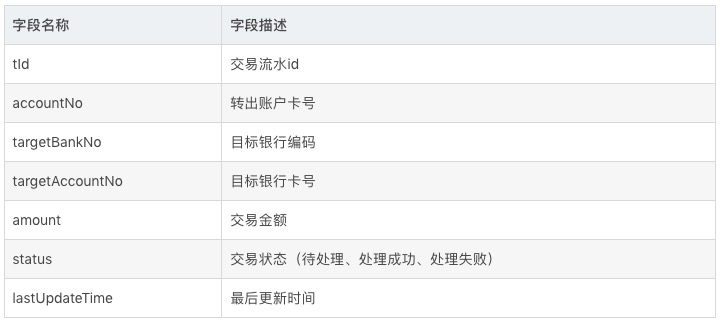
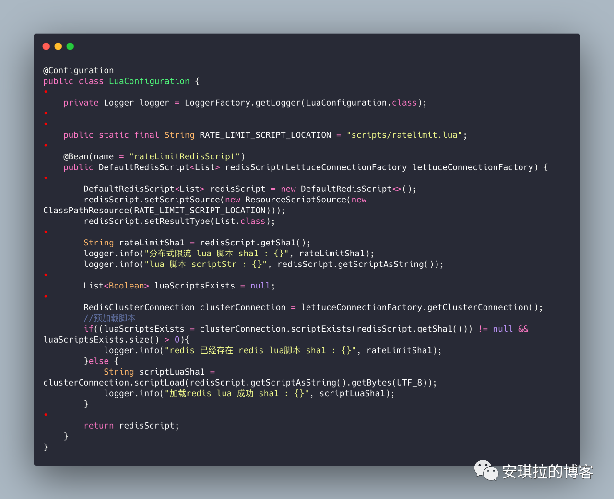

# 分布式

## 1.CAP理论

- C (一致性)：每次读取要么获得最近写入的数据，要么获得一个错误。

- A (可用性)：每次请求都能获得一个（非错误）响应，但不保证返回的是最新写入的数据。

- P (分区容错性)：尽管任意数量的消息被节点间的网络丢失（或延迟），系统仍继续运行。


  一般三者不能共有，出现CP和AP的框架：

  ```text
  1.CP
  放弃可用性，追求一致性和分区容错性，zookeeper,分布式事务2PC。
  原因：获取数据要一致，但是不同分区数据要同步需要时间，这可能会违背A要求的尽可能短时间拿到想要的数据
  
  2.AP
  放弃强一致性，追求分区容错性和可用性，很多分布式系统设计时都会做这种选择。eureka，kafka，rocketmq,redis,mysql等
  原因：满足A就需要尽可能快的返回数据，如果有网络延迟，不同节点数据可能不一致，但是此时还是可以返回数据，只不过数据可能是不一致的
  ```


  **BASE**:

  BASE 是 Basically Available(基本可用)、Soft state(软状态)和 Eventually consistent (最终一致性)三个短语的缩写。是对CAP中AP的一个扩展

  1. 基本可用:分布式系统在出现故障时，允许损失部分可用功能，保证核心功能可用。
  2. 软状态:允许系统中存在中间状态，这个状态不影响系统可用性，这里指的是CAP中的不一致。
  3. 最终一致:最终一致是指经过一段时间后，所有节点数据都将会达到一致。

  关键在于：没有网络延迟，数据能达到最终一致。


- Lease 机制: Lease 机制牺牲了部分异常情况下的A，从而获得了完全的C 与很好的P。
- Quorum 机制: Quorum 机制，在CAP 三大因素中都各做了折中，有一定的C，有较好 的A，也有较好的P，是一种较为平衡的分布式协议。
- 两阶段提交协议: 两阶段提交系统具有完全的C，很糟糕的A，很糟糕的P。
- Paxos 协议：同样是强一致性协议，Paxos 在CAP 三方面较之两阶段提交协议要优秀得多。Paxos 协议具有 完全的C，较好的A，较好的P。Paxos 的A 与P 的属性与Quorum 机制类似，因为Paxos 的协议本 身就具有Quorum 机制的因素。


**分布式三态**

成功、失败、超时


**副本**

分布式系统中为数据或服务提供的冗余。对于数据副本指在不同的节点上持久化同一份数据，当出现某一个节点的存储的数据丢失时，可以从副本上读到数据。

分布式系统解决数据丢失异常的唯一手段。


**副本一致性**

* 1.强一致性：任何时刻任何用户或节点都可以读到最近一次成功更新的副本数据。
* 2.单调一致性
* 3.会话一致性
* 4.最终一致性：一旦更新成功，各个副本上的数据最终达到完全一致的状态。

**衡量指标**

性能、可用性、可扩展性、一致性


## 2.分布式系统原理

多台计算机协同解决单台计算机所不能解决的计算、存储等问题。

1.如何将问题拆解为可以使用多机分布式解决，使得分布式系统中的每台机器负责原问题的一个子集。

```text
1.哈希方式、取模
可扩展性不高，集群规模扩展，数据得重新迁移
存在数据倾斜
2.按数据范围分布
3.按数据分布
4.一致性哈希
使哈希函数的输出值域为一个封闭的环，节点随机分布到这个环上，每个节点负责处理从自己开始顺时针至下一个节点的全部哈希值域上的数。
```

**一致性哈希**

```text
1.一致性哈希是对2^32取模
2.对各台服务器使用hash进行一个hash，将机器确定在哈希环上
3.数据经同样的哈希定位到顺时针下的第一台机器上
```

**一致性哈希容错**

Node宕机，相关对象定位到宕机Node的下一个Node上

**一致性哈希可扩展性**

加一个Node，只会影响这个Node和逆时针的前一个Node之间的对象

**一致性哈希数据倾斜**

服务Node太少，容易产生数据倾斜。

解决方案：引入虚拟节点，即对每一个服务节点计算多个哈希，每个计算结果位置都放置一个此服务节点，称为虚拟节点。具体做法可以在服务器IP或主机名的后面增加编号来实现。


**分布式系统容错、提高可用性的基本手段就是使用副本**


## 3.副本控制协议

### 3.1 中心化副本控制协议

由一个中心节点协调副本数据的更新、维护副本之间的一致性。


`primary-secondary`协议（mysql、elasticsearch都是这种）

副本被分为两大类，parimary副本、secondary副本。


### 3.2 去中心化副本控制协议

去中心化副本控制协议没有中心节点，协议中所有的节点都是完全对等的。节点之前通过平等协商达到一致。


## 4.Lease机制

有效期 一般设置成10s


## 5.Quorum机制

在Quorum机制下，当某次更新操作wi一旦在所有N个副本中的W个副本上都成功，则成为成功提交的更新操作。


## 6.日志技术

在分布式系统的实践中，广泛使用了日志技术做宕机恢复。

### 6.1 Redo Log

```text
1.将更新操作的结果（例如Set K1=1，则记录K1=1）以追加写（append）的方式写入磁盘的 日志文件
2.按更新操作修改内存中的数据
3.返回更新成功

# kafka consumer / redis aof都是这种机制
```


### 6.2 Check point

check point 技术的过程即将内存中的数据以某种易于重新加载的数据组织方式完整的dump 到磁盘，从而减少宕机恢复时需要回放的日志数据。

```text
1.向日志文件中记录“Begin Check Point”
2.将内存中的数据以某种易于重新加载的数据组织方式dump到磁盘上
3.向日志文件中记录“End Check Point” 在check point 流程中，数据可以继续按照流程2.5.1 被更新，这段过程中新更新的数据可以dump 到磁盘也可以不dump 到磁盘，具体取决于实现。例如，check point 开始时k1=v1，check point 过程 中某次更新为k1 = v2，那么dump 到磁盘上的k1 的值可以是v1 也可以是v2。
```


## 7.分布式事务

### 7.1 分布式事务基础理论

分布式事务本质上是为了保证不同数据库的数据一致性。

事务4大特性：

```text
1.A:原子性(Atomicity)
要么成功要么失败

2.C:一致性(Consistency)
事务执行之前和执行之后数据库都必须处于一致性状态

3.I:隔离性(Isolation)
并发环境下，当不同事务同时操纵相同的数据时，每个事务都有各自的完整数据空间

4.D:持久性(Durability)
只要事务成功结束，它对数据库所做的更新就必须永久保存下来。
```

mysql中事务实现的原理：

```text
1.原子性和一致性是通过undo log来实现的
undo log主要有两个作用：回滚和多版本控制(MVCC)
undo log记录的是一条对应相反的记录，方便回滚。
MVCC实现的是读写不阻塞，读的时候只要返回前一个版本的数据就行了。

2.持久化是通过redo log(重做日志)来实现
redo log顺序IO，先写buffer再真正落盘
注意：binlog记载的是update/delete/insert这种的SQL语句，而redo log记载的是物理修改的内容
redo log不会存储历史所有数据的变更，buffer数据落盘redo log数据就无效了。

3.隔离性是通过数据库锁机制及MVCC来实现
```

mysql bin log主从复制:


`relay-log`：中继日志。


**mysql分布式事务**

用的两阶段提交方案：

- 阶段1：`Innodb redo log` 写盘，InnoDB 事务进入 `prepare` 状态
- 阶段2：`binlog` 写盘，InooDB 事务进入 `commit` 状态
- 每个事务`binlog`的末尾，会记录一个 `XID event`，标志着事务是否提交成功，也就是说，恢复过程中，`binlog` 最后一个 XID event 之后的内容都应该被 purge(清除)。


**分布式事务的基础**

**CAP**：

C (一致性):对某个指定的客户端来说，读操作能返回最新的写操作。对于数据分布在不同节点上的数据上来说，如果在某个节点更新了数据，那么在其他节点如果都能读取到这个最新的数据，那么就称为强一致，如果有某个节点没有读取到，那就是分布式不一致。

A (可用性)：非故障的节点在合理的时间内返回合理的响应(不是错误和超时的响应)。可用性的两个关键一个是合理的时间，一个是合理的响应。合理的时间指的是请求不能无限被阻塞，应该在合理的时间给出返回。合理的响应指的是系统应该明确返回结果并且结果是正确的，这里的正确指的是比如应该返回50，而不是返回40。

P (分区容错性):当出现网络分区后，系统能够继续工作。打个比方，这里个集群有多台机器，有台机器网络出现了问题，但是这个集群仍然可以正常工作。


一般三者不能共有，出现CP和AP的框架：

```text
1.CP
放弃可用性，追求一致性和分区容错性，zookeeper就是这样

2.AP
放弃强一致性，追求分区容错性和可用性，很多分布式系统设计时都会做这种选择。
```

CAP理论忽略网络延迟，复制总会有一些时间上的不一致。


**BASE**:

BASE 是 Basically Available(基本可用)、Soft state(软状态)和 Eventually consistent (最终一致性)三个短语的缩写。是对CAP中AP的一个扩展

1. 基本可用:分布式系统在出现故障时，允许损失部分可用功能，保证核心功能可用。
2. 软状态:允许系统中存在中间状态，这个状态不影响系统可用性，这里指的是CAP中的不一致。
3. 最终一致:最终一致是指经过一段时间后，所有节点数据都将会达到一致。

关键在于：没有网络延迟，数据能达到最终一致。


### 7.2 分布式事务的解决方案

1.是否真的要分布式事务？

有些微服务完全可以聚合成一个单机服务。


2.2PC


数据库中的`XA Transactions`：

```text
1.询问
事务管理器要求每个涉及到事务的数据库预提交(precommit)此操作，并反映是否可以提交；

2.执行
如果资源管理器都可以提交，那事务管理器就让资源管理器提交数据，否则就回滚数据。
```

`Spring+JTA`可以实现。

**优缺点**

优点：

* 尽量保证了数据的强一致，实现成本较低，在各大主流数据库都有自己实现，`MySQL5.5以后支持`。

* 适合跨多个库的分布式事务。但是一个系统内部跨多个库是不合规的，微服务规定：每个服务只能操作自己对应的数据库，如果操作别的服务对应的库，不能直连别的服务的库。

缺点:

- 单点问题:事务管理器在整个流程中扮演的角色很关键，如果其宕机，比如在第一阶段已经完成，在第二阶段正准备提交的时候事务管理器宕机，资源管理器就会一直阻塞，导致数据库无法使用。
- 同步阻塞:在准备就绪之后，资源管理器中的资源一直处于阻塞，直到提交完成，释放资源。
- 数据不一致:两阶段提交协议虽然为分布式数据强一致性所设计，但仍然存在数据不一致性的可能，比如在第二阶段中，假设协调者发出了事务commit的通知，但是因为网络问题该通知仅被一部分参与者所收到并执行了commit操作，其余的参与者则因为没有收到通知一直处于阻塞状态，这时候就产生了数据的不一致性。


**两阶段提交和三阶段提交**


```text
二阶段
try  --> cancel/commit

三阶段
canCommit --> prepareCommit --> doCommit

都是先要试探一下，二阶段commit，三阶段doCommit失效，只能不停的重试
```


3.TCC(Try-Confirm-Cancel)

**用到了补偿的概念**

对于TCC的解释:

- Try阶段：尝试执行,完成所有业务检查（一致性）,预留必须的业务资源（准隔离性）
- Confirm阶段：确认执行真正执行业务，不作任何业务检查，只使用Try阶段预留的业务资源，Confirm操作满足幂等性。要求具备幂等设计，Confirm失败后需要进行重试。
- Cancel阶段：取消执行，释放Try阶段预留的业务资源，Cancel操作满足幂等性，Cancel阶段的异常和Confirm阶段异常处理方案基本上一致。


举例：

```text
1.如果你用100元买了一瓶水， Try阶段:你需要向你的钱包检查是否够100元并锁住这100元，水也是一样的。
2.如果有一个失败，则进行cancel(释放这100元和这一瓶水)，如果cancel失败，不论什么失败都进行重试cancel，所以需要保持幂等。
3.如果都成功，则进行confirm,确认这100元扣，和这一瓶水被卖，如果confirm失败无论什么失败则重试(会依靠活动日志进行重试)。
```

场景：

跟钱打交道的，严格保证分布式事务要么成功，要么全部自动回滚。

**优点**

针对XA，解决了其几个缺点: 

- 1.解决了协调者单点，由主业务方发起并完成这个业务活动。业务活动管理器也变成多点，引入集群。
- 2.同步阻塞:引入超时，超时后进行补偿，并且不会锁定整个资源，将资源转换为业务逻辑形式，粒度变小。
- 3.数据一致性，有了补偿机制之后，由业务活动管理器控制一致性。

**缺点**

需要自己手写回滚或补偿逻辑，比较恶心。


4.AT模式

这里引入`Seata`来介绍`AT`模式


分为两步：

* 一阶段加载


解析`sql`语句，在业务更新前保存快照`before image`、执行`sql`、在业务更新后保存快照`after image`，生成行锁。

* 二阶段提交或回滚


如果顺利提交，删除`before image`、`after image`、行锁。

如果失败，需要还原，还原前需要校验是否出现脏写，对比“数据库当前业务数据”和 `after image`，如果一致可以用`before image`实现还原，如果出现脏写需要人工介入。

**缺点**

需要有全局行锁，性能差。

**seata实现细节**

```text
1.启动seata server，根据需求修改事务组名称
2.需要保存事务需求的3张表到mysql中，global_table、branch_table、lock_table
3.服务注册在注册中心(nacos)
4.对于具体服务表均需要创建undo_log表用于回滚
5.在具体业务逻辑上加上@GlobalTranstional注解
```


5.可靠消息最终一致性方案（常用）

使用了`MQ`的协调特性


**要点：**

```text
1.系统A发送prepared消息
2.执行本地事务，如果系统A成功向MQ发送confirm消息，如果失败发送prepared消息，不断轮询这个操作
3.一旦系统A发送confirm消息，系统B就可以消费这条消息，如果消费超时，可一直重试，如果消费失败，可让zk通知系统A让系统A重发confirm消息，系统B需要保证幂等性。或者需要人工介入。
```

**可靠**

```text
1.确保系统A能发出confirm消息
2.MQ持久化，可以保证接收到的消息不丢失
```


[银行转账和分布式事务](https://blog.csdn.net/zhuxianxin0118/article/details/94393070)

采用的就是这种MQ事务方案。

不过对于跨行转账的场景，一般会借助一个转账日志表，或者转账流水表，简单设计如下：



**A银行**

扣款的同时往转账流水表中写入一条操作流水，状态变为待处理。

需要本地事务保证这俩操作要么同时成功要么同时失败。

```text
1.如果扣款失败，自然转账失败，没有后续操作，系统回滚
2.如果更新流水表状态为待处理成功后系统宕机，数据已经持久化，有后台线程进行补偿
```

**B银行**

也需要添加一张流水表，避免重复消费，可以利用转账id在流水表中做判断，判断该转账是否已经处理过。


6.最大努力通知方案(用的少)


```text
最大努力通知方案：
1.系统A处理成功后，直接将消息发送到MQ，有另外一个服务拉取消息并通知系统B去处理。
2.重试几次失败就算了。

一般用于对分布式事务要求不严格，可以允许少数的失败。比如记录日志或者状态。
```

**总结**

```text
1.严格资金不能错 --> TCC
2.库存服务 --> 可靠消息最终一致性方案
```


## 8.分布式限流

[参考](https://mp.weixin.qq.com/s/dfI9h8bdYgZ60UeByphhYQ)

### 8.1 线上系统流量暴增，如何做系统优化？

- 限流：对应用入口流量做控制，瞬时流量向后迁移，对下游请求流量做自适应限流，根据接口响应时间动态调整流量。
- 延迟排队：如果请求量大，按业务线优先级排队，优先保障线上渠道实时的请求。
- 路由：这个是因为业务的特殊性，所有的请求都依赖下游第三方的服务，可以将多家下游服务供应商做个动态路由表，将请求优先路由给接口成功率高、耗时低的服务供应商；
- 备份：这基本是所有分布式组件都会做的，能做多机的不做单机，例如：Redis 做三主三备(集群)、MySQL分库分表、MQ 与 Redis 互为备份（安琪拉遇到过MQ事故）等等；
- 降级：这个是最后的迫不得已的措施，如果遇到全线崩溃，使用降级手段保障系统核心功能可用，或让模块达到最小可用。
- 日志：完整的监控和链路日志，日志功能很多，也分很多种，一方面是方便排查问题，另一方面可用来做任务重试、任务回滚、数据恢复、状态持久化等。


### 8.2 限流

**基础概念**

限制流量，一般分为限制入口流量和限制出口流量

**设计思想**

1.漏桶算法


把请求比作水，在请求入口和响应请求的服务之间加一个漏桶，桶中的水以恒定的速度流出，这样保证了服务接收到的流量速度是稳定的，如果桶里的水满了，再进来的水就直接溢出（请求直接拒绝）。

> 漏桶是网络环境中流量整形（Traffic Shaping）或速率限制（Rate Limiting）时经常使用的一种算法，它的主要目的是控制数据进入到网络的速率，平滑网络上的突发流量。

2.令牌桶算法


令牌桶算法有点类似于生产者消费者模式，专门有一个生产者往令牌桶中以恒定速率放入令牌，而请求处理器(消费者)在处理请求时必须先从桶中获得令牌，如果没有拿到令牌，有二种策略：一种是直接返回拒绝请求，一种是等待一段时间，再次尝试获取令牌。

> 令牌桶算法用来控制发送到网络上的数据的数目，并允许突发数据的发送

相比于漏桶算法的优势：能够满足突发流量的请求。

**实现方法**

1.单机

①`Semphore`限制统一时间请求接口的量。


②`Google Guava` 包

`RateLimiter`类就是使用的令牌桶方法。


API 很简单，只需要指定限流的速度，例如：

第一个例子， 速度是每秒钟2个，如果是分钟级限流，你也可以设置为 0.2，代表1秒钟生成0.2 个令牌，1分钟限流为 12个。

第二个例子是每秒钟5000，这个例子演示了如何通过限流器限制网络处理流量为每秒钟 5kb。5000个byte。


2.分布式

本质就是把本地令牌桶放到一个所有主机都可以访问的地方。

**redis实现限流方法**

在令牌桶算法中，有一个单独的生产者以恒定的速率向令牌桶中放入令牌。

如果通过redis实现，一个生产者线程不断往redis添加令牌(写)，其他请求线程每次请求读redis获取令牌，这样会有很大的性能损耗，好的解决办法是延迟放令牌的操作，获取令牌的时候才放入令牌，将二个操作合并。

获取令牌应在桶中放入的令牌数：

```text
filledTokens = math.min(lastTokens+(delta*rate),capacity)
```

此刻应填充令牌数 =  min(（令牌桶剩余令牌数 + 当前时间与上一次令牌生成时间间隔 * 令牌生成速度）, 令牌总容量)

分布式限流的Redis脚本，redis提供lua支持，脚本如下：


测试：


也可以：

```shell
// 1. 在redis服务端load 脚本 拿到sha
redis-cli script load "$(cat ratelimit.lua)"
//sha1: ebbcd2ed99990afaca6d2ba61a0f2d5bdd907e59
// 2. 通过脚本 sha1 值运行脚本
redis-cli evalsha ebbcd2ed99990afaca6d2ba61a0f2d5bdd907e59 2 remain.${0}.tokens last_fill_time 0.2 12 `gdate +%s%3N` 1
```

`lua`脚本执行基本不会有性能上的损耗:

`redis` 使用`epoll` 实现`I/O`多路复用的事件驱动模型，对于每一个读取和写入操作都尽量要快速。使用`redis-benchmark`来压测。

```shell
redis-benchmark -n 100000 evalsha ebbcd2ed99990afaca6d2ba61a0f2d5bdd907e59 2 remain.${1}.tokens last_fill_time 0.2 12 `gdate +%s%3N` 1
```

**lua脚本工程化**

1.手写一个`lua` 脚本（上面的脚本直接拷贝），在`Spring`工程目录中放好，如下图：


2.程序启动时加载lua 脚本, 根据lua的 SHA1值判断脚本是否已经加载到redis( redis 不能存太多的script)，程序如下：



这里程序启动，加载脚本，检查脚本在redis中是否存在，脚本如果没有重新编辑更新，sha1是一致的，不会重复加载，另外注意一点，如果是集群模式，Jedis 3.*版本以前不支持lua脚本，建议使用Lettuce。

1. 关于Lettuce 和 Jedis 客户端的对比，大家可以网上看一下，Spring Boot最新默认客户端已经改成Lettuce了。

   > EvalSha is not supported in cluster environment

2. 配置限流器


注意：

这里有一点需要注意一下，key 都带了 {1} 的前缀，这个用于所有key 在集群模式都hash 命中同一个slot (槽)，因为lua 脚本不能跨集群节点执行。

效果：


## 9.分布式一致性算法-Paxos、Raft、ZAB、Gossip

**为什么需要一致性**

```text
1.数据不能存在单个节点(主机)上，否则可能出现单点故障
2.多个节点(主机)需要保证相同的数据
```

**一致性分类**

1.强一致性

保证系统改变提交以后立即改变集群的状态

```text
Paxos  google的Chubby分布式锁
Raft  etcd分布式键值数据库
ZAB   Zookeeper
```

2.弱一致性

最终一致性，系统不保证改变提交以后立即改变集群的状态，但是随着时间的推移最终状态是一致的。

```text
DNS系统
Gossip协议
```

**Paxos算法**

概念：

```text
Proposal 提案
Client 用户
Propser 议员
Acceptor 投票者
Learner 提案接受者
```

1.`Basic Paxos`算法

```text
1.Propser准备一个N号提案
2.Propser询问Acceptor中的多数派是否接收过N号的提案，如果都没有进入下一步，否则本提案不被考虑
3.Acceptor开始表决，Acceptor无条件同意从未接收过的N号提案，达到多数派同意后，进入下一步
4.Learner记录提案

# 节点故障
若Proposer故障，再从集群中选出Proposer即可
若Acceptor故障，表决时能达到多数派也没问题

# 潜在问题-活锁
假设系统有多个Proposer，他们不断向Acceptor发出提案，还没等到上一个提案达到多数派下一个提案又来了，就会导致Acceptor放弃当前提案转向处理下一个提案，于是所有提案都别想通过了。
```


2.`Mulit Paxos`算法

根据`Basic Paxos`的改进：整个系统只有一个`Proposer`，称之为`Leader`。

```text
1.若集群中没有Leader，则在集群中选出一个节点并声明它为第M任Leader。
2.集群的Acceptor只表决最新的Leader发出的最新的提案
3.其他步骤和Basic Paxos相同
```


**Raft算法**

是对`Paxos`算法的简化和改进

概念：

```text
Leader 总统节点，负责发出提案
Follower 追随者节点，负责同意Leader发出的提案
Candidate 候选人，负责争夺Leader
```

`Raft`算法将一致性问题分解为两个子问题，`Leader`选举和状态复制

* `Leadr`选举

1.每个`Follower`都持有一个定时器


2.当定时器时间到了且集群此时没有`Leader`，`Follower`会声明自己是`Candidate`并参与`Leader`选举，同时将消息发给其他节点来争取他们的投票，若其他节点长时间没有响应`Candidate`将重新发送选举信息。

3.集群中其他节点将给`Candidate`投票

4.获取多数派支持的`Candidate`将成为第`M`任`Leader`(`M`任是最新的任期)

5.在任期内的`Leader`会**不断发送心跳**给其他节点证明自己还活着，其他节点收到心跳以后就清空自己的计时器并回复`Leader`的心跳。这个机制保证其他节点不会在`Leader`任期内参加`Leader`选举。

6.当`Leader`节点出现故障而导致`Leader`失联，没有接收到心跳的`Follower`节点将准备成为`Candidate`进入下一轮`Leade`r选举。

7.若出现两个`Candidate`同时选举并获得了相同的票数，那么这两个`Candidate`将**随机推迟一段时间**后再向其他节点发出投票请求，这保证了再次发送投票请求以后不冲突。


* 状态复制

1.`Leader`负责接收来自`Client`的提案请求（红色提案表示未确认）


2.提案内容将包好在`Leader`发出的下一个心跳中。


3.`Follower`接收到心跳以后回复`Leader`的心跳


4.`Leader`接收到多数派`Follower`的回复以后确认提案并写入自己的存储空间中并回复`Client`。

5.`Leader`通知`Follower`节点确认提案并写入自己的存储空间，随后所有的节点都拥有相同的数据。

6.若集群中出现网络异常，导致集群被分割，将出现多个`Leader`。

7.被分割出的非多数派集群将无法达到共识，即脑裂，如图中`A、B`节点将无法确认提案。


8.当集群再次连通时，将只听从最新任期`Leader`的指挥，旧`Leader`将退化为`Follower`，如图中`B`节点的`Leader`（任期1）需要听从`D`节点的`Leader`（任期2）的指挥，此时集群重新达到一致性状态。


**ZAB算法**

`Zookeeper Atomic Broadcast:zookeeper原子广播协议`

`ZAB`也是对`Multi Paxos`算法的改进，大部分和`Raft`相同。

和`Raft`算法的主要区别：

```text
1.对于Leader的任期，Raft叫做term，而ZAB叫做epoch
2.在状态复制过程中，Raft的心跳从Leader向Follower发送，而ZAB刚好相反。
```

`ZAB`的状态同步：

```text
1.Leader服务器会为每一个Follower服务器都准备一个队列,并将那些没有被各Follower服务器同步的事务以Proposal以消息的形式逐个发送给Follower服务器，并在每一个Proposal消息后面紧接着再发送一个Commit消息，以表示该事务已经被提交。

2.等到Follower服务器将所有其尚未同步的事务Proposal都从Leader服务器上同步过来并成功应用到本地数据库中后，Leader服务器就会将该Follower服务器加入到真正的可用Follower列表中，并开始之后的其他流程。
```

[ZAB算法](<https://www.cnblogs.com/rickiyang/p/11074190.html>)


**Gossip算法**

说明：`Gossip`算法每个节点都是对等的，没有角色之分。`Gossip`算法中的每个节点都会将数据改动告诉其他节点。 

可能存在问题：

```text
可能存在拜占庭问题，即如果有一个恶意传播消息的节点，Gossip协议的分布式系统就会出问题。
```

**解决办法**

1.口头协议

将军-副官模型

前提：

```text
1.忠诚的副官遵守同一命令
2.若将军是忠诚的，所有忠诚的副官执行他的命令
```

m:恶意个数 n:总人数 当n>=3m时，可解。


## 10.服务架构演进

一百个并发到千万级并发服务端架构的演进过程

概念说明：

```text
1.分布式
系统中多个模块在不同服务器上部署
2.高可用
系统中部分节点失效时，其他节点能够接替它继续提供服务
3.集群
一个特定领域的软件部署在多台服务器上并作为一个整体提供一类服务，这个整体称为集群，例如Zookeeper
4.负载均衡
请求发送到系统时，通过某些方式把请求均匀发到多个节点上，使系统中每个节点能够均匀的处理请求负载，可认为系统是负载均衡的
5.正向代理和反向代理
正向代理：代理服务器代替系统内部来访问外部网络的过程
反向代理：外部请求访问系统时通过代理服务器转发到内部服务器的过程
```

1.单机架构


```text
Tomcat服务和数据库部署在同一台服务器上。

架构瓶颈：随着用户数增长，服务和数据库之间竞争资源，单机性能不足以支撑业务。
```

2.Tomcat与数据库分开部署


```text
Tomcat和数据库分别独占服务器资源，显著提高两者各自性能。

架构瓶颈：随着用户数增长，并发读写数据库称为瓶颈。
```

3.引入本地缓存和分布式缓存


```text
MySQL单机能抗2000左右QPS，为了避免高并发情况下让MySQL直接面对压力，引入缓存。
ehcache做本地缓存，redis做分布式缓存，但是这时候会设计缓存一致性、缓存穿透、雪崩、热点数据集中失效等问题。

架构瓶颈：缓存抗住了大部分的访问请求，但是单机Tomcat，响应会变慢。
```

4.引入反向代理实现负载均衡


```text
在多台服务器上分别部署Tomcat，引入反向代理Nginx把请求均匀转发到每个Tomcat中。
其中主要涉及的技术是Nginx/HAPoxy，都是网络第七层(HTTP)的反向代理软件，主要支持http协议、还会涉及session共享、文件上传下载的问题。

架构瓶颈：反向代理是应用服务器可支持的并发量大大增加，但并发量的增长也意味着更多请求穿透到数据库，单机的数据库最终成为瓶颈。
```

5.数据库读写分离


```text
把数据库划分为读库和写库，读库可以有多个，通过同步机制把写库的数据同步到读库(半同步复制)。
对于需要查询最新写入数据场景，可通过在缓存中多写一份，通过缓存获得最新数据。
其中涉及的技术包括：Mycat，数据库中间件，可通过它来组织数据库的读写分离和分库分表，可能会涉及数据同步，数据一致性问题。

架构瓶颈：业务逐渐变多，不同业务之间的访问量差距较大，不同业务直接竞争数据库，相互影响性能。
```

6.数据库按业务分库(垂直分库)


```text
把不同业务的数据保存到不同的数据库中，使业务之间的资源竞争降低，对于访问量大的业务，可以部署更多的服务器来支撑(水平分库)。
可能会导致跨业务的表无法直接做关联分析。

架构瓶颈：随着用户数的增长，单机的写库会追歼达到性能瓶颈。
```

7.把大表拆成小表


```text
一般是水平分表，多张表的字段信息是一样的。(垂直分表一般是热点字段跟非热点字段分开建表)
例如：针对评论数据，可按照商品ID进行hash，路由到对应的表中存储；针对支付记录，可按照小时创建表，每个小时表继续拆分成小表，使用用户ID或记录编号来路由数据。

架构瓶颈：数据库和Tomcat都能够水平扩展，可制成的并发大幅提高，随着用户数的增长，最终单机的Nginx会称为瓶颈。
```

8.使用LVS或F5来使多个Nginx负载均衡


```text
瓶颈在Nginx，无法通过两层的Nginx来实现多个Nginx的负载均衡。
LVS和F5是工作在网络第四层的负载均衡(TCP)。
LVS：软件负载均衡器，运行在操作系统内核态，可对TCP请求或更高层级的网络协议进行转发，因此支持的协议更丰富，并且性能远高于Nginx，单机LVS可支持几十万并发。
F5：硬件负载均衡器，性能比LVS更好。
避免单点故障，LVS/F5需要部署多个节点。

架构瓶颈：由于LVS也是单机的，随着并发数增长到几十万时，LVS服务器最终会达到瓶颈，此时用户数达到千万甚至上亿级别，用户分布在不同的地区，与服务器机房距离不同，导致了访问的延迟会明显不同。
```

9.通过DNS轮询实现机房间的负载均衡


```text
DNS服务器可配置一个域名对应多个IP地址，每个IP地址对应到不同的机房里的虚拟IP.
访问www.taobao.com时，DNS服务器会使用轮询策略或其他策略，来选择某个iP供用户访问，此方式能实现机房间的负载均衡。

架构瓶颈：随着数据的丰富程度和业务的发展，检索，分析等需求越来越丰富，单单依靠数据库无法解决如此丰富的需求。
```

10.引入NoSQL和搜索引擎等技术


```text
数据多到一定规模，数据库就不适合做复杂查询了。
海量文件存储：HDFS
key-value类型的数据：HBase或Redis
全文检索：搜索引擎Elasticsearch
多维分析场景：Kylin或Druid

架构瓶颈：引入更多组件解决了丰富的需求，业务维度能够极大扩充，随之而来的是一个应用中包含了太多的业务代码，业务的升级迭代变得困难。
```

11.大应用拆分为小应用


```text
按照业务板块来划分应用代码，使单个应用的职责更清晰，相互之间可以做到独立升级迭代。

架构瓶颈：不同应用之间存在共用的模块，由应用单独管理会导致相同代码存在多分，导致公共功能升级时全部应用代码都要跟着升级。
```

12.复用的功能抽离成微服务


```text
如用户管理、订单、支付、鉴权等功能在多个应用中都存在，那么可以把这些功能的代码单独抽取出来形成一个单独的服务来管理。
这样的服务就是所谓的微服务，应用和服务之间通过HTTP、TCP或RPC请求等多种方式来访问公共服务，每个单独的服务都可以由单独的团队来管理。
此外，可以通过Dubbo、SpringCloud等框架实现服务治理、限流、熔断、降级等功能，提高服务的稳定性和可用性

架构瓶颈：不同服务的接口访问方式不同，应用代码需要适配多种访问方式才能使用服务，此外，应用访问服务，服务之间也可能相互访问，调用链将会变得非常复杂，逻辑变得混乱。
```

13.引入企业服务总线ESB屏蔽掉服务接口的访问差异


```text
通过ESB统一进行访问协议转换，应用统一通过ESB来访问后端服务，服务与服务之间也通过ESB来相互调用，以此降低系统的耦合程度。

这种单个应用拆分为多个应用，公共服务单独抽取出来来管理，并使用企业消息总线来解除服务之间耦合问题的架构，就是所谓的SOA（面向服务）架构，这种架构与微服务架构容易混淆，因为表现形式十分相似。
微服务架构更多是指把系统里的公共服务抽取出来单独运维管理的思想，而SOA架构则是指一种拆分服务并使服务接口访问变得统一的架构思想，SOA架构中包含了微服务的思想。

架构瓶颈：业务不断发展，应用和服务都会不断变多，应用和服务的部署变得复杂，同一台服务器上部署多个服务还要解决运行环境冲突的问题
此外，对于如大促这类需要动态扩缩容的场景，需要水平扩展服务的性能，就需要在新增的服务上准备运行环境，部署服务等，运维将变得十分困难。
```

14.引入容器化技术来实现运行环境隔离与动态服务管理


```text
Docker容器，K8S容器服务
Docker镜像可以理解为一个运行你的应用/服务的最小的操作系统。
大促之前可以在现有的机器集群上划分出服务器来启动Docker镜像，增强服务的性能。大促过后可以关闭镜像。

架构瓶颈：使用容器化技术后服务动态扩缩容问题得以解决，但是机器还是需要公司自身来管理，在非大促的时候，还是需要闲置着大量的机器资源来应对大促，机器自身成本和运维成本都极高，资源利用率低。
```

15.以云平台承载系统


```text
系统部署在公有云上，利用公有云的海联该机器资源，解决动态硬件资源的问题。
在大促的时间段里，在云平台中临时申请更多的资源，结合Docker和K8S来快速部署服务，在大促结束后释放资源，真正做到按需付费，资源利用率大大提高，同时大大降低了运维成本。
所谓的云平台，就是把海量机器资源，通过统一的资源管理，抽象为一个资源整体

在云平台中会涉及如下几个概念：
IaaS：基础设施即服务。对应于上面所说的机器资源统一为资源整体，可动态申请硬件资源的层面；
PaaS：平台即服务。对应于上面所说的提供常用的技术组件方便系统的开发和维护；
SaaS：软件即服务。对应于上面所说的提供开发好的应用或服务，按功能或性能要求付费。
```

**架构设计原则**

```text
N+1设计：系统中的每个组件都应做到没有单点故障；

回滚设计：确保系统可以向前兼容，在系统升级时应能有办法回滚版本；

禁用设计：应该提供控制具体功能是否可用的配置，在系统出现故障时能够快速下线功能；

监控设计：在设计阶段就要考虑监控的手段；

多活数据中心设计：若系统需要极高的高可用，应考虑在多地实施数据中心进行多活，至少在一个机房断电的情况下系统依然可用；

采用成熟的技术：刚开发的或开源的技术往往存在很多隐藏的bug，出了问题没有商业支持可能会是一个灾难；

资源隔离设计：应避免单一业务占用全部资源；

架构应能水平扩展：系统只有做到能水平扩展，才能有效避免瓶颈问题；

非核心则购买：非核心功能若需要占用大量的研发资源才能解决，则考虑购买成熟的产品；

使用商用硬件：商用硬件能有效降低硬件故障的机率；

快速迭代：系统应该快速开发小功能模块，尽快上线进行验证，早日发现问题大大降低系统交付的风险；

无状态设计：服务接口应该做成无状态的，当前接口的访问不依赖于接口上次访问的状态。
```


## 11.服务注册中心

### 11.1 eureka

核心是服务注册表。

涉及到两级缓存：`ReadOnly`缓存、`ReadWrite`缓存


**服务注册**

```text
1.服务注册进服务表，立马同步到ReadWrite缓存
2.ReadWrite缓存定时同步到ReadOnly缓存，同时会有一个后台线程定时检查两个缓存的数据，如果不一致需要做一些处理。
3.服务每隔30s会去ReadOnly缓存中拉取一次服务信息
```

**服务挂掉之后的处理方式：**


```text
1.删除服务注册表的服务B的ip，然后立刻清空ReadWrite缓存
2.但此时ReadOnly缓存还没更新，服务消费者还是能拿到服务B的机器(已经挂了)，所以每次请求都失败了
3.当线程定时任务查看到ReadOnly缓存、ReadWrite缓存有差异，立马清空ReadOnly缓存
4.服务消费者拉取注册表，发现ReadOnly缓存和ReadWrite缓存都是空的，会将注册表信息(此时只有一个服务A存活)同步到两个缓存中。
```

**eureka集群服务**


```text
eureka，peer-to-peer部署一个集群，但是集群里的每个机器地位是对等的，各个服务可以向任何一个eureka实例服务注册和服务发现，集群里任何一个eureka实例接收到写请求之后，会自动同步给其他所有的eureka实例。
```

**eureka自我保护机制**

```text
自我保护机制的工作机制是：如果在15分钟内超过85%的客户端节点都没有正常的心跳，那么Eureka就认为客户端与注册中心出现了网络故障，Eureka Server自动进入自我保护机制，此时会出现以下几种情况：
1.Eureka Server不再从注册列表中移除因为长时间没收到心跳而应该过期的服务。
2.Eureka Server仍然能够接受新服务的注册和查询请求，但是不会被同步到其它节点上，保证当前节点依然可用。
3.当网络稳定时，当前Eureka Server新的注册信息会被同步到其它节点中。

因此Eureka Server可以很好的应对因网络故障导致部分节点失联的情况，而不会像ZK那样如果有一半不可用的情况会导致整个集群不可用而变成瘫痪。

通过配置eureka.server.enableSelfPreservation来配置
```


### 11.2 zookeeper

核心是监听器，监听服务列表


```text
1.服务B在leader节点注册，leader节点将相关信息同步给follower节点
2.follower节点提供一个监听器与服务绑定，一旦察觉服务列表有更新，会将通知发送给服务A
3.服务A可以发送请求调用服务B
```


### 11.3 eureka vs zookeeper

```text
1.集群模式
eureka peer-to-peer，集群里每台机器地位对等，每个服务可以向任何一个eureka实例服务注册和服务发现，集群里任何一个eureka实例接受到写请求之后，会自动同步到其他所有的eureka实例

zookeeper leader+follower，leader负责服务注册(写)，follower服务从leader同步信息，leader和follower都可以读服务注册信息

2.一致性 CP、AP
eureka AP
peer模式，新服务在eureka节点注册了，但是还没同步到其他eureka节点，eureka节点自己死了，此时还可以继续从别的机器上拉取数据，只是不是最新的，属于AP，保证最终一致性。

zookeeper CP
服务挂掉或增加，服务注册列表中数据不一致，此时不能对外服务，但是可以保证数据一致性，属于CP。

3.时效性
eureka 服务发现要几十秒，甚至分钟级别。
eg:新服务加入，极端情况：30s后台线程才能发现两个缓存不一致，之后30s服务才去ReadOnly缓存中拉取信息，这就60s了。

eg:服务故障60s才去检查心跳，发现这个服务上一次心跳是在60s前，隔60s去检查心跳，超过90s没有心跳，才会认为他死了，2min就过去了。

时效性很差！！！

zookeeper 秒级

4.容量
eureka 很难支撑大规模的服务实例，因为每个eureka实例都要接受所有的请求，实例多了压力太大，扛不住，很难到几千实例

zookeeper 不适合大规模的服务实例，因为服务上下线的时候，需要瞬间推送数据通知到所有其他实例，一旦规模太大，达到几千实例，会导致网络带宽被大量占用
```


### 11.4 eureka参数优化

1.常规参数设置

```text
1.服务注册者发送心跳的时间间隔
eureka.leaseRenewIntervalInSeconds = 3 (设置成3s)

2.服务消费者从ReadOnly缓存中拉取注册表的时间间隔
eureka.client.registryFetchIntervalSeconds = 3 (设置成3s)

3.注册中心将ReadWrite缓存同步到ReadOnly缓存的时间间隔
eureka.server.responseCacheUpdateIntervalMs = 3000 (设置成3s)

4.注册中心检查注册表内服务提供者心跳的时间间隔
eureka.server.evictionintervalTimerInMs = 6000 (设置成6s)

5.注册中心检测到服务提供者多久没有心跳后，删除该服务提供者的时间间隔
eureka.instance.leaseExpirationDurationInSeconds = 9 (设置成9s)
```

2.关闭自我保护机制参数：

```text
eureka.server.enableSelfPreservation = false
```


### 11.5 自研服务注册中心


```text
1、不采用zk那种事件监听的方式，采用eureka主动读、心跳监听的方式。
（避免了zk那样通知所有实例，避免惊群效应）
2、注册中心节点间不通信，只是master‐slave同步注册表。不要让单个节点保存所有注册表信息。
（避免了eureka的每个节点承载所有的注册表信息，承担不了高并发）
3、服务消费者只拉取自己调用的服务提供者的部分注册表。
（避免了zk那样通知所有实例）
4、保证强一致性。每次服务注册都必须master、slave都注册成功，才算注册成功。
（避免了eureka的只能保证最终一致性问题）
```

## 12.网关

网关不能停机。

解决方案：动态路由

可以基于`Mysql`数据库来做。建表语句：

```sql
CREATE TABLE `gateway_api_route` (
`id` varchar(50) NOT NULL,
`path` varchar(255) NOT NULL,
 `service_id` varchar(50) DEFAULT NULL,
 `url` varchar(255) DEFAULT NULL,
 `retryable` tinyint(1) NOT NULL,
 `enabled` tinyint(1) DEFAULT NULL,
 `strip_prefix` int(11) DEFAULT NULL,
 `api_name` varchar(255) DEFAULT NULL,
 PRIMARY KEY(`id`)
) ENGINE=InnoDB DEFAULT CHARSET=utf8

INSERT INTO gateway_api_route(id,route,service_id,retryable,strip_prefix,url,enabled) VALUES ('order-service','/order/**','order-service',0,1,NULL,1);
```

`spring mvc`+前端页面封装一个可视化的网关管理平台，新开发一个服务就在这个界面上配置一下。网关系统去`mysql`中拉取数据。


代码实现：

```yml
server:
  port: 9000
spring:
  application:
    name: zuul‐gateway
  datasource:
    url: jdbc:mysql://localhost:3306/test?autoReconnect=true&useUnicode=true&characterEncoding=utf‐8
    username: root
	password: root
	driver‐class‐name: com.mysql.cj.jdbc.Driver
eureka:
  instance:
	hostname: localhost
  client:
	serviceUrl:
	  defaultZone: http://localhost:8761/eureka/
	registryFetchIntervalSeconds: 3
	leaseRenewalIntervalInSeconds: 3
zuul:
  retryable: true
```


### 12.1 高并发

用户并不是直接请求网关，而是`LVS(F5) ‐‐> Nginx集群 ‐‐> 网关集群`。

`Zuul`网关如果部署在`8C16G`的机器上，每秒扛个几千是没问题的。

```text
1w请求/s  8core16G 5台就够了
```

**网关的特点和功能**

```text
1.动态路由：新开发某个服务，动态把请求路径和服务的映射关系热加载到网关里去，网关热感知
2.灰度发布：基于线程的开源插件来做
3.授权认证
4.限流认证

===重要===
5.性能监控：每个API接口的耗时，成功率，QPS
6.系统日志
7.数据缓存
```


### 12.2 灰度发布

流量分配给新旧版本。

实现原理与动态路由一样，需要在数据库中保存是否需要灰度发布的参数。

```text
1. 更新order-service新版本代码，在yaml配置中，设置 metadata-map.version = new。可以理解为新代码向
eureka注册时，增加了一个 metadata-map.version = new的标签。(key-value可以随便取)

2. 更新数据库，将order-service启动灰度发布

3. 网关读取服务定时加载配置。通过某种策略(随机数或者请求url)将部分流量分发。Ribbon选择服务提供者中带
有metadata-map.version = new标签的实例

4. 测试ok了，设置所有的metadata-map.version = current。
```


### 12.3 服务上线经历的过程

1.开发新服务

线上部署，配合网关动态路由的功能，在网关里配置一下路径和新服务的映射关系，此时请求过来直接可以走到新的服务


2.已有服务

对已有服务进行迭代和开发，新版本，灰度发布，新版本部署少数几台机器，通过一个界面，开启这个服务的灰度发布，此时`Zuul Filter`启用，按照设定的规则，将少量流量大儒道新版本部署的机器上去。

观察一下少量流量在新版本的机器上运行是否真诚刚。

版本改成`current`，全量机器部署，关闭灰度发布功能，网关就会把流量均匀分发给那个服务了。


## 13.微服务架构机器配置

5-6个服务，2core8G，2副本。

```text
1.注册中心
k8s kube-dns
k8s将Service的名称当做域名注册到kube-dns中，通过Service的名称就可以访问其提供的服务。

SpringCloud eureka

2.网关
k8s api-gateway (前面还要反向代理Nginx)

SpringCloud Zuul/Gateway

3.负载均衡
k8s SLB 

SpringCloud Feign
```


**机器配置说明：**

```text
1.服务注册中心
4core 8G机器，每秒轻松抗几百请求，上千请求也可以

2.服务
如果每秒钟的并发在1000以内的话，每个服务部署2台机器，每台机器4核8G，每台机器每秒抗几百个请求，一点问题灭有。

大部分的系统，高峰期每秒几百个请求，低峰期每秒几十个请求，甚至几个请求。

3.网关
4core8G，一台机器每秒几百个请求，部署3-4台机器，保证每台机器抗几百个请求。
前面需要Nginx做软负载，反向代理。

4.数据库
MySQL 16core32G物理机最佳。高峰期扛个每秒钟几千请求问题不大。此时可能会导致MySQL机器的负载很高，CPU使用率很高，磁盘IO负载很高，网络负载很高。

对于中小型公司，数据库根本不是瓶颈。
```


## 14.SpringCloud

### 14.1 基础架构


`SpringCloud`的核心技术：

```text
1.Eureka：注册中心
服务注册中心内部都有一个注册表:
服务注册 ‐> 服务启动的时候，都要想注册中心进行注册，写入注册表。
服务发现 ‐> 服务将注册表拉取到本地。

2.Feign：将请求转换成http请求，发现指定的机器的ip:port

3.Ribbon：负载均衡，默认是轮循。服务调用时，ribbon会根据注册表的信息，负载均衡选择一台机器，通过
Feign向其发送请求。

4.SpringCloud Gateway 或 Zuul：网关系统

5.Hystrix：线路熔断的框架。必须设计一整套的限流方案、熔断方案、资源隔离、降级机制来做。不然很影响性能

6.Stream：消息驱动，屏蔽底层消息中间件的差异，降低切换成本，统一消息的编程模型。

7.Seata：分布式事务

8.Config/Nacos：服务配置中心
```

### 14.2 服务优化

1.系统第一次启动的的时候，调用会经常出现`timeout`。

原因：初始化一个`Ribbon`组件，初始化这些组件需要耗费一定时间，所以很容易导致超时。

解决方案：让每个服务启动的时候就直接初始化`Ribbon`相关的组件，避免第一次请求的时候初始化。

```yml
# ribbon中加
ribbon:
  eager-load:
    enabled: true
  
    
# zuul中加
zuul:
  ribbon:
    eager-load:
      enabled: true
      
# 中小型服务hystrix可以丢弃，没有完整的一套系统限流方案、资源隔离、降级机制可以先关掉
feign:
  hystrix:
    enabled: true
```

2.线上服务，每个服务部署上线的时候，一般来说都需要配置相关的超时时间还有超时次数。

```yml
ribbon:
  ConnectTimeout: 1000
  ReadTimeout: 1000
  OKToRetryOnAllOperations: true
  MaxAutoRetries: 1
  MaxAutoRetriexNextServer: 1
```

3.`Eureka`中相关参数也可以进行优化。

4.`Zuul`开启重试

```yml
zuul:
  retryable: true
```


## 15.石杉面试突击第二季

### 15.1 接口幂等

方法：

```text
1.数据库索引
插入类操作 （create操作）

2.基于Redis实现一套幂等性防重框架
扣减库存、累加积分、更新，一般很难通过数据库唯一索引来保证。 （update操作）

spring mvc拦截器，拦截所有请求，对所有请求都会提取请求对应的参数，GET请求、POST请求、PUT请求，有些参数是跟URL地址里的，?xx=xx&xx=xx。或者POST、PUT请求体里面的。
把参数拼接在一起（参数+接口名称），作为key去redis中判断一下，是否存在这个key。

可能存在的问题：
第一次发起一个请求，请求失败了，阻塞了一段时间，第二次再去请求，就会把请求拦截下来。

仅对少数核心服务做接口幂等处理。
```


### 15.2 分布式架构存在问题

1.分布式事务

`TCC`、可靠消息最终一致性方案。

电商系统的业务逻辑：

```text
订单服务 --> 创建订单
--> 库存服务 --> 扣减库存
--> 积分服务 --> 增加积分
--> 仓储服务 --> 通知发货

可靠消息最终一致性方案：
发送一个请求给消息中间件，交给下游仓储服务消费以及通知发货，如果这个过程中有消息发送失败了，消息中间件应该保证不停的重试消息。

TCC方案：
Try-Comfirm-Cancel
每个服务对一个接口要提供3个接口，每个服务先走try，任何人try失败都会让大家走cancel，如果try都成功了，就会让大家comfirm。

一般小型公司，核心服务接口，比如说扣减库存，一般有两个接口：扣减库存接口(deductStock)、回滚库存接口(rollbackDeductStock)，由分布式事务框架调用回滚库存接口，能成功将之前修改的内容回滚掉。
```

**技术选型**

```text
1.开源框架
dubbo、SpringCloud上可以用阿里开源的Seata

2.可靠消息最终一致性方案
消息中间件用ActiveMQ、RabbitMQ的话得自己封装一个可靠消息服务，服务投递消息给MQ，失败则重试，成功则回调服务的接口，通知消息处理成功了。如果长时间消息没被处理成功，此时可以在数据库中存储消息，基于MQ做消息的异步投递和消费。

消息中间件用RocketMQ，提供了分布式事务的支持，把可靠服务需要实现的功能逻辑都做好了。
```

**seata**


```text
1.TM 开启分布式事务（TM 向 TC 注册全局事务记录）
2.按业务场景，编排数据库、服务等事务内资源（RM 向 TC 汇报资源准备状态 ）
3.TM 结束分布式事务，事务一阶段结束（TM 通知 TC 提交/回滚分布式事务）
4.TC 汇总事务信息，决定分布式事务是提交还是回滚
5.TC 通知所有 RM 提交/回滚 资源，事务二阶段结束

核心链路中的服务都需要跟TC这个角色进行频繁的网络通信，频繁的网络通信其实会带来性能的开销。100ms --> 200ms

网络请求挺耗时的，上报一些分支事务的状态给TC seata-server，选择基于哪种存储来放这些分布式事务日志或状态，file，磁盘文件，MySQL数据库来存放对应的一些状态。

高并发场景下，会不会有问题，seata-server，也需要扩容，需要部署多台机器，用一个数据库来存放分布式事务的日志和状态的话，假设并发量每秒上万，分表分库，对TC背后的数据库也会有同样的压力。需要对数据库进行分库分表。
```


### 15.3 Rocket对分布式事务支持

电商系统交易链路：


**步骤：**

```text
1.订单服务发送一个half message给RocketMQ
2.RokcetMQ返回一个message success，1、2两步是可以重试保证一定成功的
3.订单服务开始走交易核心链路
4.链路响应，如果成功接着往下走；如果失败了，链路失败退款，订单状态更新为已取消，同时发送请求给RocketMQ rollback message。
5.链路成功，订单服务commit message。如果4.3、5步骤出现网络抖动导致失败，此时可以走步骤6
6.RockerMQ启用接口回调判断到底是commit还是rollback
7.message commit成功，wms服务开始消费消息
8.创建发货单
9.如果消息消费失败或创建发货单失败，此时采用ack message机制，RocketMQ可以判断后续服务是否操作成功。
```


### 15.4 Redis Redission分布式锁原理

```text
1.比如说苹果这个商品的id是1
redisson.lock("product_1_stock")
key的业务语义，就是针对product_id=1的商品的库存，也就是苹果的库存进行加锁

在redis中存的内容大概是：
product_1_stock: {
    "xxxxx":1  # xxx redis客户端生成的id  1表示当前已经有人加过一次锁了
}
过期时间是30s

2.加锁成功，redis客户端会启动一个watchdog，每隔10s去检查一下这个锁是否还被当前客户端持有，如果是的话，重新刷新一下key的存活时间为30s

3.其他客户端尝试加锁，这个时候发现"product_1_lock"这个key已经存在，里面显示被别的客户端加锁了，此时他就会陷入一个无限循环，阻塞住自己，不能干任何事，必须在这里等待

4.第一个客户端加锁成功了，此时有两种情况：
1）这个客户端操作完毕之后，主动释放锁
2）如果这个客户端宕机了，那么这个客户端的redisson框架之前启动的后台watchdog线程就没了，此时最多30s，key-value消失，自动释放了宕机客户端之前持有的锁。

5.锁释放掉了，其他客户端可以继续尝试加锁，此时有一个客户端加锁成功
product_1_stock: {
    "yyyyy": 1 # id与之前的不同
}
```

存在问题：

```text
比如采用的单个master的redis，一个slave节点，配置了哨兵机制。由于redis同步数据是异步的，此时如果master挂了，而slave节点并没有该锁信息。所以：这种方案在redis的master节点挂了后，slave节点变成master节点，客户端发送请求过来此时也可以加锁成功，导致出现同一把锁被两个客户端同时持有。

解决方案：redis master slave都需要加锁成功才可以。需要源码级的修改。
```


### 15.5 zookeeper分布式加锁原理


```text
1.向zk发起请求，在一个目录(/locks/pd_1_stock)下，创建一个临时顺序节点，也是带有自己客户端的id。
2.如果目录是空的，自己创建出来的节点就是第一个节点，客户端尝试加锁时会查看一下子目录，查看到自己是第一个子节点，加锁成功。
3.第二个客户端请求锁时，也创建一个顺序节点，判断是否是第一个子节点，如果不是，那么向上一节点加一个watcher监听器。
4.如果上一个节点被删除立马会感知到，再去查看子目录，查到自己是第一个子节点，此时加锁成功。
如果客户端宕机，基于zk的心跳机制，临时节点也会被删除。

公平锁的实现！！！

如果采用的是创建临时节点(不带顺序)，锁释放后，会同时通知剩下所有的客户端，造成惊群效应，带来不必要的网络开销。
```

**redis 与zookeeper脑裂问题**

```text
1.redis
客户端A对master加锁成功，master与slave之间数据异步发送数据，此时master宕机，slave切换成master，但是它内部没有客户端A的加锁信息，此时如果客户端B尝试对master加锁，也可以加锁成功。此时会出现两个客户端同时持有锁。

2.zookeeper
客户端A加锁成功，此时A与zookeeper连接断开，zk监测不到心跳，认为客户端A宕机。删掉A的临时顺序节点。
此时客户端B的临时顺序节点称为子目录下的第一节点，可以加锁成功，此时出现两个客户端同时持有锁。
```


### 15.6 分布式锁优化

分段加锁+合并扣减。

```text
比如说你的苹果库存有10000个，此时可以在数据库中创建10个库存字段
一个表有10个库存字段，stock_01、stock_02 ... 每个库存字段里放1000个库存
此时这个库存的分布式锁，对应10个key，product_1_stock_01,product_1_stock_02 ...

请求过来之后，可以从10个key随机选择一个key去加锁就可以了，每秒过来10000个请求，此时他们会对10个库存分段key加锁，每个key就1000个请求，每台服务器就1000个请求而已。

如果库存分段剩余库存不够，合并扣减库存。
```


### 15.7 淘宝京东库存实现，能不能不用分布式锁来实现

放在非关系型数据库：`kv`存储的`redis`、`mongodb`。淘宝用的`tair`。

解决方案：

```text
1.实时库存数据放kv存储里，先查库存再扣减库存
2.操作库存直接扣减，如果发现扣减之后是负数，此时认为库存超卖，回滚刚才的扣减，返回提示给用户
3.对kv做的库存修改协程MQ，异步同步落数据库，相当于异步双写，用分布式kv抗高并发，做好一致性方案。
(微信抢红包应该也是这个思路)
```


