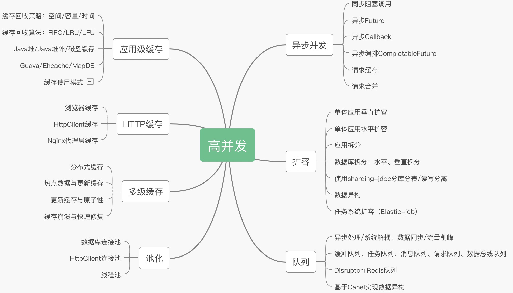
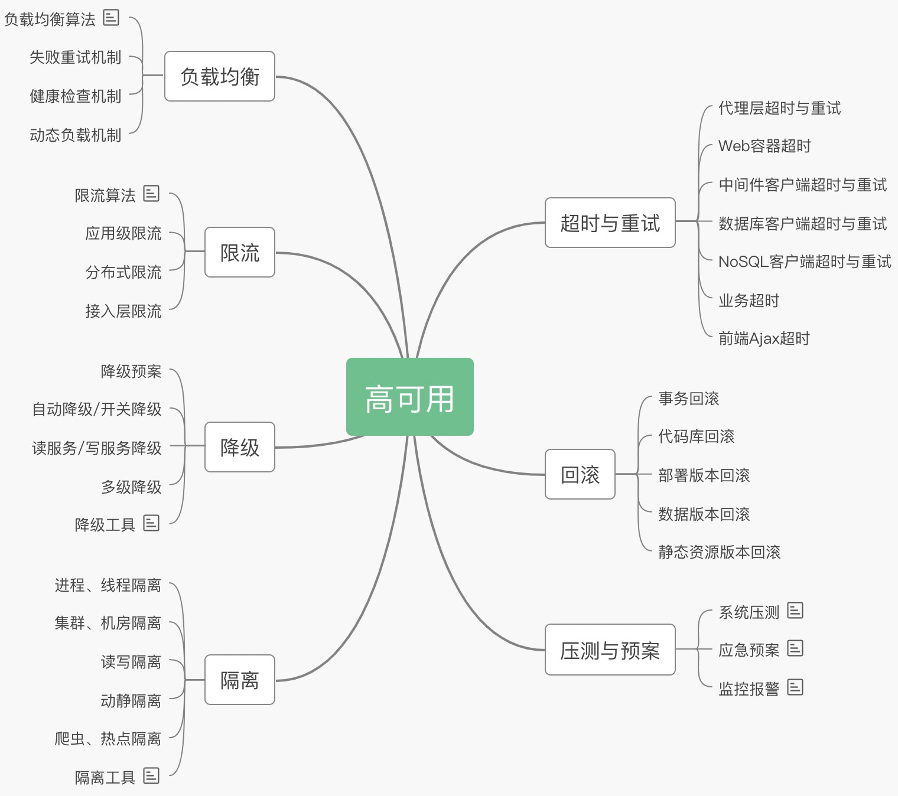
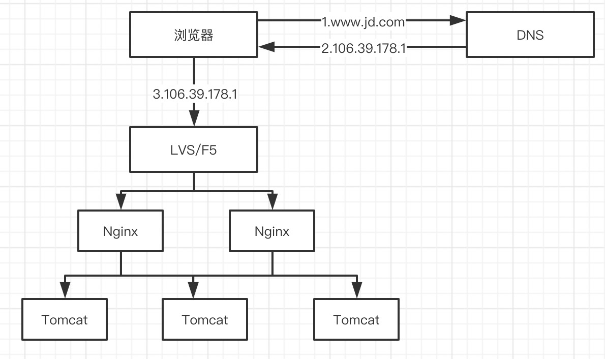
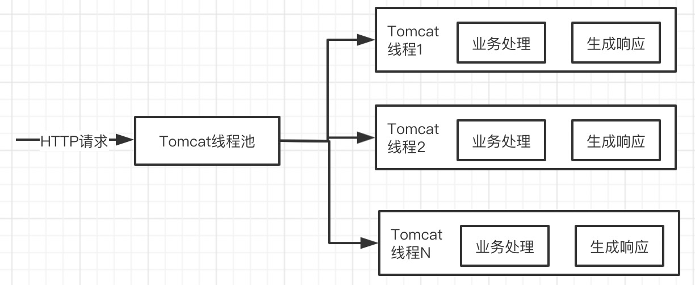
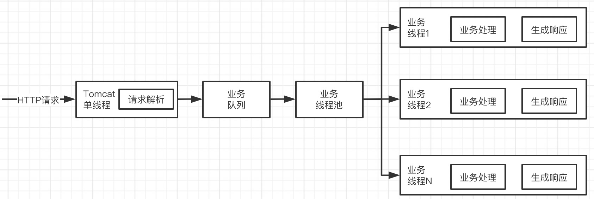

## 0.分布式

**CAP**：

C (一致性):对某个指定的客户端来说，读操作能返回最新的写操作。对于数据分布在不同节点上的数据上来说，如果在某个节点更新了数据，那么在其他节点如果都能读取到这个最新的数据，那么就称为强一致，如果有某个节点没有读取到，那就是分布式不一致。

A (可用性)：非故障的节点在合理的时间内返回合理的响应(不是错误和超时的响应)。可用性的两个关键一个是合理的时间，一个是合理的响应。合理的时间指的是请求不能无限被阻塞，应该在合理的时间给出返回。合理的响应指的是系统应该明确返回结果并且结果是正确的，这里的正确指的是比如应该返回50，而不是返回40。

P (分区容错性):当出现网络分区后，系统能够继续工作。打个比方，这里个集群有多台机器，有台机器网络出现了问题，但是这个集群仍然可以正常工作。


```text
C：每时每刻每个节点上的同一份数据都是一致的。
A：任何时刻系统都可以提供读写服务
P：依托AP来讨论的，当节点之间网络不通时(出现网络分区)，可用性和一致性仍然能够得到保障。
```

一般三者不能共有，出现CP和AP的框架：

```text
1.CP
放弃可用性，追求一致性和分区容错性，zookeeper就是这样

2.AP
放弃强一致性，追求分区容错性和可用性，很多分布式系统设计时都会做这种选择。
```

CAP理论忽略网络延迟，复制总会有一些时间上的不一致。


**BASE**:

BASE 是 Basically Available(基本可用)、Soft state(软状态)和 Eventually consistent (最终一致性)三个短语的缩写。是对CAP中AP的一个扩展

1. 基本可用:分布式系统在出现故障时，允许损失部分可用功能，保证核心功能可用。
2. 软状态:允许系统中存在中间状态，这个状态不影响系统可用性，这里指的是CAP中的不一致。
3. 最终一致:最终一致是指经过一段时间后，所有节点数据都将会达到一致。

关键在于：没有网络延迟，数据能达到最终一致。


## 1.系统设计原则

### 1.1 高并发原则

* 1.保证服务无状态便于水平扩展
* 2.对服务进行系统维度、功能维度、读写维度的拆分
* 3.消息队列，对非核心业务进行异步调用，实现服务解耦、异步处理等功能
* 4.使用缓存：Nginx+分布式Redis+Tomcat堆内cache
* 5.并发化




### 1.2 高可用原则

* 1.降级

方案有：开关集中化管理，可降级的多级读服务，开关前置化，业务降级（大促设计时优先处理高优先级数据，优先级低的数据采用异步调用）

* 2.限流

防止恶意请求流量、恶意攻击或者防止流量超出系统峰值。

```text
1.恶意请求流量只访问到cache
2.对于穿透到后端应用的流量可以考虑使用Nginx的limit模块处理
3.对于恶意IP可以使用nginx deny进行屏蔽
```

原则是限制流量穿透到后端薄弱的应用层。

* 3.切流量

某机房、机架、机器挂了需要切流量。

```text
1.DNS 切换机房入口
2.HttpDNS APP场景绕过LocalDNS
3.LVS/HaProxy 切换故障的Nginx接入层
4.Nginx 切故障的应用层
```

* 4.可回滚




## 2.高可用部分

### 2.1负载均衡与反向代理

浏览器访问域名，会通过`DNS`获取对应的`IP`，然后通过此`IP`访问对应的服务。

外网`DNS`采用`GSLB`（全局负载均衡）进行流量调度，分配到离用户最近的服务器上进行访问。


一般应用用`Nginx`即可，`Nginx`一般用于七层负载均衡，其吞吐量有一定限制，为了提升整体吞吐量，会在`DNS`和`Nginx`之间引入接入层，使用`LVS`（软件负载均衡器）、`F5`（硬件负载均衡器）可以做四层负载均衡。



**负载均衡算法**

* round-robin：轮询，以轮询的方式将请求转发到上游服务器，通过配合weight配置可以实现基于权重的轮询

* ip_hash：根据客户IP进行负载均衡，相同的IP将负载均衡到同一个`upstream server`上。

* hash key：对某一个key进行哈希或使用一致性哈希算法进行负载均衡。

  ```text
  使用hash存在的问题：添加、删除一台服务器时，将导致很多key被重新负载均衡到不同的服务器
  此时可以考虑使用一致性哈希：添加、删除一台服务器，只有少数key将被重新负载均衡到不同的服务器
  
  此时可以根据请求uri进行负载均衡。
  ```


### 2.2 隔离术

* 1.线程隔离（线程池隔离）
* 2.进程隔离（系统拆成多个子系统实现物理隔离）
* 3.集群隔离（服务分组）
* 4.机房隔离（一个机房出问题，通过DNS/负载均衡请求将其全部切刀另一个机房）
* 5.读写隔离（主从模式将读和谐集群分离）
* 6.动静隔离（静态资源放在CDN上）
* 7.爬虫隔离（将爬虫流量限流或切到单纯集群）
* 8.热点隔离（秒杀服务单独部署系统）
* 9.资源隔离（Docker容器不同容器挂载不同的磁盘）
* 10.Hystrix隔离

```text
线程池隔离
1.服务分组+线程池(粗粒度)
2.服务分组+服务+线程池(细粒度)
```

* 11.Servlet3请求隔离

基于NIO能处理更高的并发连接数。

`Servlet3之前的线程模型`



`Servlet3线程模型`



单线程多路复用。


### 2.3 限流

高并发系统保护系统的手段：

```text
1.缓存，提升系统访问速度和增大系统处理能力，是康高并发流量的银弹
2.降级，当前业务出问题或影响到核心流程的性能，需要这哪是屏蔽掉，待高峰过去或者问题解决再打开
3.限流，有些场景不能用缓存、降级，比如稀缺资源(秒杀、抢购)、写服务(评论、下单)、频繁的复杂查询(评论的最后几页)，这时候需要限流。通过对并发访问/请求进行限速或者一个时间窗口内的请求进行限速来保护系统。
```

**限速方式**

```text
1.限制总并发数：数据库连接池、线程池
2.限制瞬时并发数：Nginx的limit_conn模块，用来限制瞬时并发连接数
3.限制时间窗口内的平均速率：Guava的RateLimiter、Nginx的limit_req模块
4.限制远程接口调用速率
5.限制MQ的消费速率
```

**限流算法**

* 1.令牌桶算法

存放固定容量令牌的桶，按照固定速率往桶里添加令牌。

```text
1.假设限制2r/s，按照500ms的固定速率往桶中添加令牌
2.桶中最多存放b个令牌，当桶满时，新添加的令牌会被丢弃或拒绝
3.当一个n个字节大小的数据包到达，将从桶中删除n个令牌，接着数据包被发送到网络上
4.如果桶中的令牌不足n个，则不会删除令牌，且该数据包被限流，要么丢弃，要么在缓冲区等待
```

* 2.漏桶算法

```text
1.一个固定容量的漏桶，按照常量固定速率流出水滴
2.如果桶是空的，则不需流出水滴，可以以任意速率流入水滴到漏桶
3.如果流入水滴超出了桶的容量，则流入的水滴溢出了(被丢弃)，漏桶容量是不变的
```

区别：

```text
令牌桶限制的是平均流入速率(允许突发请求，只要有令牌就可以处理，支持一次拿3个或4个令牌)，允许一定的突发流量
漏桶限制的是常量流出速率，流出速率是一个固定值
```

**分布式限流**

将限流服务做成原子化，解决方案：`Redis+Lua、Nginx+Lua`


### 2.4 降级

当访问量剧增、服务出现问题（如响应时间长或不响应）或非核心服务影响到核心流程的性能时，仍然需要保证服务还是可用的，即使有损服务。系统可以根据一些关键数据进行自动降级，也可以配置开关实现人工降级。

**保证核心服务可用**

秒杀场景：

扣减`Redis`库存，异步队列扣减`DB`库存。


### 2.5 超时与重试机制

应用不设置超时，则可能会导致请求响应慢，满请求累计导致连锁反应，甚至造成应用雪崩。

读服务天然适合重试，但写服务大多不能重试（写服务如果可以幂等，则重试是允许的）

重试次数也要设置合理，如果次数太多，会类似模拟了`DDoS`攻击，后果可能是灾难。


### 2.6 回滚机制

**事务回滚**

单库事务回滚直接使用相关SQL即可。

分布式事务可以考虑用事务表、消息队列、补偿机制（执行/回滚）、TCC模式（预占/确认/取消）、Sagas模式（拆分事务+补偿机制）等。


## 3.高并发

### 3.1 缓存

让数据更接近于使用者，目的是让访问速度更快。工作机制是先从缓存中读取数据，如果没有，再从慢设备上读取实际数据并同步到缓存。

可以缓存的数据：

```text
经常读取的数据、频繁访问的数据、热点数据、I/O瓶颈数据、计算昂贵的数据、符合5分钟法则和局部性法则原理的数据

CPU -> L1/L2/L3 -> 内存 -> 磁盘
maven -> 本机仓库找 -> 本地服务器找 -> 远程仓库服务器找
```

**缓存回收策略**

1.基于空间

2.基于容量

3.基于时间

`TTL(Time To Live)`存活期，从创建到到期都没有被访问

`TTI(Time To Idle)`空闲期，缓存数据多久没被访问后移除缓存。

4.基于`Java`对象引用

软引用（`JVM`内存不够会被回收）、虚引用（垃圾回收即会被回收）

5.回收算法

```text
FIFO 先进先出，先放入缓存的先被移除
LRU 最近最少使用算法，使用时间距离现在醉酒的那个被移除
LFU Least Frequently Used 最不常用算法，一定时间段内使用次数(频率)最少的那个被移除
```


