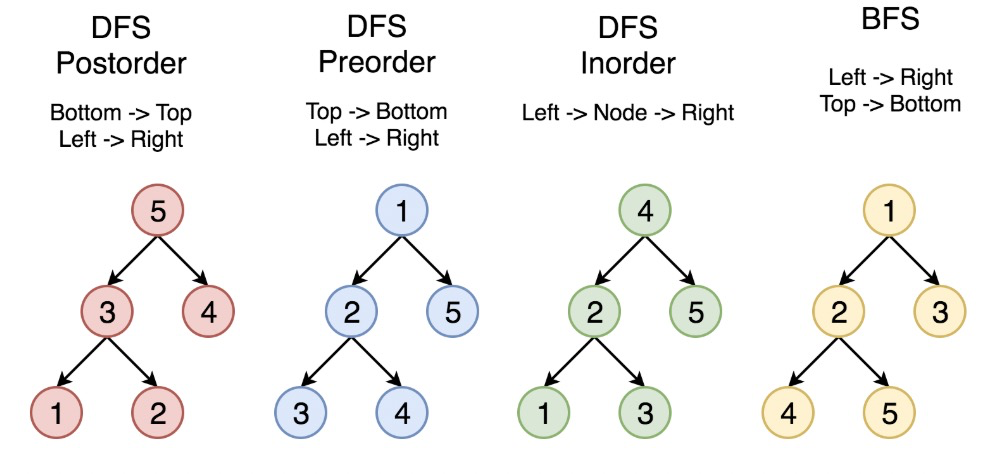

# 树

## 1.基本概念

```text
树：
由结点或顶点和边组成的且不存在任何环的一种数据结构。

二叉树：
每个结点最多拥有两颗子树(即二叉树中不存在度大于2的结点)
子树有左右之分，其次序不能任意颠倒。
性质：
1.第i层至多2^i个结点
2.高度为k的二叉树最多有2^(k+1) - 1个结点
3.对任何一棵二叉树，如果其叶子结点数为m，度为2的结点数为n，则m=n+1
```

二叉树分为：完美二叉树、完全二叉树、完满二叉树。

```text
完美二叉树：除了叶子结点之外的每一个结点都有两个孩子，每层都被完全填充。
完全二叉树：除了最后一层之外的每一层都被完全填充，并且所有结点都保持向左对其。
完满二叉树，除了叶子结点之外的每个结点都有两个孩子结点。
```


## 2.二叉树的遍历方法

```text
中序遍历：左-根-右
先序遍历：根-左-右
后序遍历：左-右-根
```

 


## 3.二叉查找树

```text
二叉查找树性质：
1.任意节点左子树不为空，则左子树的值均小于根节点的值。
2.任意节点右子树不为空，则右子树的值均大于根节点的值。
3.任意节点的左右子树也分别是二叉查找树。
```

二叉树有退化成线性表的风险。


## 4.AVL树


