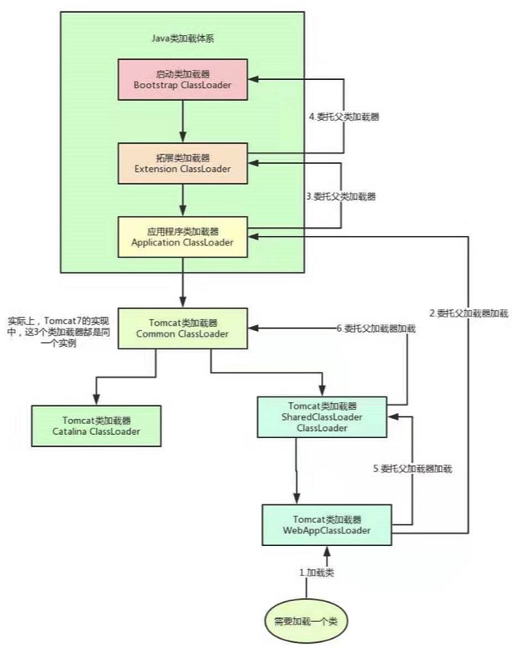
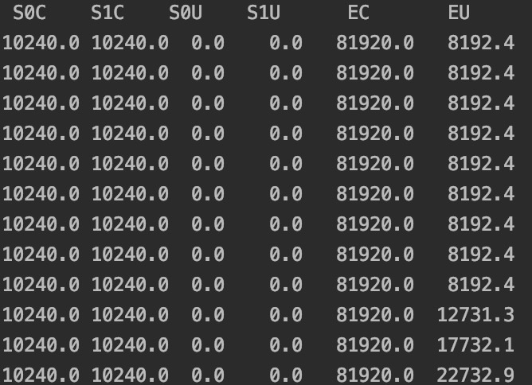
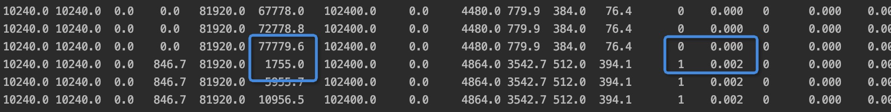

# JVM专栏
<!-- TOC -->

- [JVM专栏](#jvm专栏)
    - [1.JVM理解](#1jvm理解)
    - [2.Java代码是如何运行起来的？](#2java代码是如何运行起来的)
    - [3.JVM类加载机制](#3jvm类加载机制)
    - [4.JVM中有哪些内存区域？分别用来干嘛？](#4jvm中有哪些内存区域分别用来干嘛)
    - [5.JVM的垃圾回收机制是用来干嘛的？为什么要垃圾回收？](#5jvm的垃圾回收机制是用来干嘛的为什么要垃圾回收)
    - [8.JVM分代模型：年轻代、老年代、永久代](#8jvm分代模型年轻代老年代永久代)
    - [9.你的对象在JVM内存中如何分配?如何流转的？](#9你的对象在jvm内存中如何分配如何流转的)
    - [10.亲自感受一下线上系统部署时如何设置JVM内存大小？](#10亲自感受一下线上系统部署时如何设置jvm内存大小)
    - [11.每日百万交易的支付系统，如何设置JVM堆内存大小？](#11每日百万交易的支付系统如何设置jvm堆内存大小)
    - [12.每日百万交易的支付系统，JVM占内存与永久代大小又该如何设置？](#12每日百万交易的支付系统jvm占内存与永久代大小又该如何设置)
    - [15.什么情况下JVM内存中的一个对象会被垃圾回收？](#15什么情况下jvm内存中的一个对象会被垃圾回收)
    - [17.年轻代和老年代分别适合什么样的垃圾回收算法？](#17年轻代和老年代分别适合什么样的垃圾回收算法)
    - [19.Stop the World问题分析：JVM最让人无奈的痛点](#19stop-the-world问题分析jvm最让人无奈的痛点)
    - [20.之前的整理](#20之前的整理)
    - [22.深入揭秘JVM的年轻代垃圾回收器ParNew是如何工作的？](#22深入揭秘jvm的年轻代垃圾回收器parnew是如何工作的)
    - [23.那JVM老年代垃圾回收器CMS工作时，内部又干了啥？](#23那jvm老年代垃圾回收器cms工作时内部又干了啥)
    - [24.线上部署系统时，如何设置垃圾回收相关参数？](#24线上部署系统时如何设置垃圾回收相关参数)
    - [25.每日上亿请求量的电商系统，年轻代垃圾回收参数如何优化？](#25每日上亿请求量的电商系统年轻代垃圾回收参数如何优化)
    - [26.每日请求上亿的电商系统，老年代的垃圾回收参数又该如何优化呢？](#26每日请求上亿的电商系统老年代的垃圾回收参数又该如何优化呢)
    - [29.最新的G1垃圾回收器的工作原理，你能聊聊吗？](#29最新的g1垃圾回收器的工作原理你能聊聊吗)
    - [30.G1分代回收原理深度图解：为什么回收性能比传统GC更好？](#30g1分代回收原理深度图解为什么回收性能比传统gc更好)
    - [31.线上系统部署如果采用G1垃圾回收器，应该如何设置参数？](#31线上系统部署如果采用g1垃圾回收器应该如何设置参数)
    - [33.如何基于G1垃圾回收器优化性能？](#33如何基于g1垃圾回收器优化性能)
    - [39.每秒10万并发的BI系统是如何频繁发生Young GC的？](#39每秒10万并发的bi系统是如何频繁发生young-gc的)
    - [40.每日百亿数据量的实时分析引擎，为啥频繁发生Full GC?](#40每日百亿数据量的实时分析引擎为啥频繁发生full-gc)
    - [43.自己动手模拟出频繁Young GC的场景体验一下！](#43自己动手模拟出频繁young-gc的场景体验一下)
    - [45.自己动手模拟出对象进入老年代的场景体验一下](#45自己动手模拟出对象进入老年代的场景体验一下)
    - [47.JVM的Full GC日志应该怎么看？](#47jvm的full-gc日志应该怎么看)
    - [50.使用jstat摸清线上系统的JVM运行情况](#50使用jstat摸清线上系统的jvm运行情况)
    - [51.每秒10万并发的BI系统，如何定位和解决频繁Young GC问题？](#51每秒10万并发的bi系统如何定位和解决频繁young-gc问题)
    - [54.每日百亿数据量的实时分析引擎，如何定位和解决频繁Full GC问题？](#54每日百亿数据量的实时分析引擎如何定位和解决频繁full-gc问题)
    - [57.每秒十万QPS的社交APP 如何优化GC性能提升3倍？](#57每秒十万qps的社交app-如何优化gc性能提升3倍)
    - [58.垂直电商APP后台系统，如何对Full GC进行深度优化？](#58垂直电商app后台系统如何对full-gc进行深度优化)
    - [59.新手工程师不合理设置JVM参数，是如何导致频繁Full GC的？](#59新手工程师不合理设置jvm参数是如何导致频繁full-gc的)
    - [64.一次线上大促营销活动导致的内存泄漏和Full GC优化](#64一次线上大促营销活动导致的内存泄漏和full-gc优化)
    - [66.JVM运行原理和GC原理你真的搞懂了吗？](#66jvm运行原理和gc原理你真的搞懂了吗)
    - [59.新手工程师不合理设置JVM参数，是如何导致频繁Full GC的？](#59新手工程师不合理设置jvm参数是如何导致频繁full-gc的-1)
    - [64.一次线上大促营销活动导致的内存泄漏和Full GC优化](#64一次线上大促营销活动导致的内存泄漏和full-gc优化-1)
    - [66.JVM运行原理和GC原理你真的搞懂了吗？](#66jvm运行原理和gc原理你真的搞懂了吗-1)
    - [59.新手工程师不合理设置JVM参数，是如何导致频繁Full GC的？](#59新手工程师不合理设置jvm参数是如何导致频繁full-gc的-2)
    - [64.一次线上大促营销活动导致的内存泄漏和Full GC优化](#64一次线上大促营销活动导致的内存泄漏和full-gc优化-2)
    - [66.JVM运行原理和GC原理你真的搞懂了吗？](#66jvm运行原理和gc原理你真的搞懂了吗-2)
    - [67.JVM性能优化到底该怎么做？](#67jvm性能优化到底该怎么做)
    - [71.什么是内存溢出？在哪些区域会发生内存溢出？](#71什么是内存溢出在哪些区域会发生内存溢出)
    - [73.Metaspace区域是如何因为类太多而发生内存溢出的？](#73metaspace区域是如何因为类太多而发生内存溢出的)
    - [74.无限制的调用方法是如何让线程的栈内存溢出的？](#74无限制的调用方法是如何让线程的栈内存溢出的)
    - [75.对象太多了！堆内存实在是放不下，只能内存溢出！](#75对象太多了堆内存实在是放不下只能内存溢出)
    - [76.自己模拟出JVM Metaspace内存溢出的场景体验一下](#76自己模拟出jvm-metaspace内存溢出的场景体验一下)
    - [77.自己模拟出JVM占内存的场景体验一下！](#77自己模拟出jvm占内存的场景体验一下)
    - [78.自己模拟出JVM堆内存溢出的场景体验一下](#78自己模拟出jvm堆内存溢出的场景体验一下)
    - [79.一个超大数据量处理系统是如何不堪重负OOM的？](#79一个超大数据量处理系统是如何不堪重负oom的)
    - [80.两个新手工程师误写代码是如何导致OOM的？](#80两个新手工程师误写代码是如何导致oom的)
    - [82.如何在JVM内存溢出的时候自动dump内存快照？](#82如何在jvm内存溢出的时候自动dump内存快照)
    - [83.Metaspace区域内存溢出的时候，应该如何解决？](#83metaspace区域内存溢出的时候应该如何解决)
    - [85.JVM堆内存溢出的时候，应该如何解决?](#85jvm堆内存溢出的时候应该如何解决)
    - [86.每秒仅仅上百请求的系统为什么会因为OOM而崩溃？](#86每秒仅仅上百请求的系统为什么会因为oom而崩溃)
    - [87.Jetty服务器的NIO机制是如何导致堆外内存溢出的？](#87jetty服务器的nio机制是如何导致堆外内存溢出的)
    - [88.一次微服务架构下的RPC调用引发的OOM故障排查实践](#88一次微服务架构下的rpc调用引发的oom故障排查实践)
    - [93.一次服务类加载器过多引发的OOM问题排查实践](#93一次服务类加载器过多引发的oom问题排查实践)
    - [94.一个数据同步系统频繁OOM内存溢出的排查实践](#94一个数据同步系统频繁oom内存溢出的排查实践)
    - [总结](#总结)

<!-- /TOC -->
## 1.JVM理解

线程隔离：栈、程序计数器、`MetaSpace`

线程共享：堆

## 2.Java代码是如何运行起来的？


```text
1..java代码打包编译成.class文件
2..class文件需要通过java -jar 文件名运行起来，使用java命令会启动一个JVM进程
3.JVM需要运行这些.class字节码文件，首先需要将这些.class文件中包含的各种类给加载进来，这就是类加载器的概念
4.JVM可以基于自己的字节码执行引擎，来执行加载到内存里的我们写好的这些类了。
```


## 3.JVM类加载机制

类从加载到使用，一般会经历下面的过程：

```text
加载 -> 验证 -> 准备 -> 解析 -> 初始化 -> 使用 -> 卸载
```

1.加载

包含main()方法的主类一定还在JVM进程启动之后被加载到内存，开始执行你的main()方法中的代码，接着遇到你使用了别的类，此时就会从对应的`.class`字节码文件加载对应的类到内存里来。

```java
public class kafka {
    public static void main() {
        ReplicaManager replicaManager = new ReplicaManager();
    }
}
```


2.验证、准备、解析

验证：校验加载进来的`.class`文件中的内容，是否符合指定的规范。

准备：写好的类中会存在一些类变量（`static`修饰的），需要给这些变量分配内存空间，来一个默认的初始值。

解析：把符号引用替换为直接引用


3.初始化

```java
public class ReplicaManager {
    public static int flushInterval = Configuration.getInt("replica.flush.interval");
    
    public static Map<String,Replica> replicas;
    
    static {
        loadReplicaFromDish();
    }
    
    public static void loadReplicaFromDish() {
        this.replicas = new HashMap<String,Replica>();
    }
}

// 对于flushInterval这个类变量在准备阶段会给他开辟一个内存空间，然后给个初始值0
// 真正完成配置项读取的是在初始化阶段，static静态代码块也会在初始化阶段执行。
```

初始化一个类的时机：

```text
1.new ReplicaManager()来实例化类的对象
2.包含main()方法的主类
```


**类加载器**

```text
根据一个类的全限定名来读取此类的二进制字节流到JVM内部，并存储在运行时内存区的方法区，然后将其转换为一个与目标类型对应的java.lang.Class对象实例。
```

类加载器种类：

```text
1.启动类加载器
Bootstrap ClassLoader 负载加载我们机器上安装的Java目录下的核心类，lib文件下

2.扩展类加载器
Extension ClassLoader 

3.应用程序类加载器
Application ClassLoader 这类加载器就负责去加载ClassPath环境变量所指定的路径中的类

4.自定义类加载器
根据自己需求去加载类。
```

**为什么会有这些加载器？**

```text
因为他们代表三种不同的信任级别。最可信的级别是java核心API类。然后是安装的拓展类，最后才是在类路径中的类（属于你本机的类）。
```

**类加载器双亲委派模型**

```text
一个类加载器收到了类加载的请求，它首先不会自己去尝试加载这个类，而是把这个请求委派给父类加载器去完成，每一个层侧的类加载器都是如此，因此所有的加载请求最终都应该传送到启动类加载器中，只有当父加载器反馈自己无法完成这个加载请求，子加载类才会尝试自己去加载。

好处：尽可能少的出现多个只是classpath不同的类，避免造成应用程序混乱。
```


## 4.JVM中有哪些内存区域？分别用来干嘛？


JVM内存模型一般分为：

```text
1.存放类、静态变量、静态方法等的MetaSpace(JDK1.8之前叫方法区)
2.记录当前执行的字节码指令位置的程序计数器
3.存放每个方法内的局部变量、操作数栈、方法出口等东西的虚拟机栈
4.存放在代码中创建的各种对象的堆内存。
```

线程隔离：栈、程序计数器、`MetaSpace`

线程共享：堆


**执行流程**

```text
1.JVM进程启动，加载Kafka类到内存里，然后有一个main线程，开始执行你的Kafka中的main()方法。
2.main线程关联一个程序计数器，执行到哪一行指令，就会记录在这里。
3.main线程执行main()方法时，会在main线程关联的Java虚拟机栈，压入一个main()方法的栈帧。
4.接着会发现需要创建一个ReplicaManager类的实例对象，此时会加载ReplicaManager类到内存来。
5.接着会创建一个ReplicaManager的对象实例分配在Java堆内存里，并且在main()方法的栈帧里的局部变量表引入一个replicaManager变量，让他引用ReplicaManager对象在Java堆内存中的地址。
6.main线程开始执行ReplicaManager对象中的方法，会一次把自己执行到的方法对应的栈帧压入自己的Java虚拟机栈执行完之后再把方法对应的栈帧从Java虚拟机栈里出栈。
```

**注**

```text
1.public native int hashCode(); 在调用这种native方法的时候，就会有线程对应的本地方法栈，存放native方法的局部变量表之类的信息。
2.通过NIO中的allocateDirect这种API，可以在Java堆外分配内存空间，然后，通过Java虚拟机里的DirectByteBuffer来引用和操作堆外内存空间。
```

**Tomcat类加载器**


```text
Tomcat自定义了Common、Catalina、Shared等类加载器，其实就是用来加载Tomcat自己的一些核心基础类库。

Tomcat为每个部署在里面的Web应用都有一个对应的WebApp类加载器，负责加载部署的这个Web应用的类。

Jsp类加载器，则是给每个Jspd都准备了一个Jsp类加载器。

Tomcat 打破了双亲委派机制

每个WebApp负责加载自己队形的那个Web应用的class文件，也就是我们写好的某个系统打包好的war包的所有class文件，不会传到给上层类加载器去加载。
```

**Tomcat类加载流程**




## 5.JVM的垃圾回收机制是用来干嘛的？为什么要垃圾回收？

Java堆内存里创建的对象，都是占用内存资源的，而且内存资源有限。


对于不再需要的对象需要进行垃圾回收。

**创建的对象会在Java堆内存里占用多少内存**

* 一个是对象自己本身的一些信息
* 一个是对象的实例变量作为数据占用的空间


## 8.JVM分代模型：年轻代、老年代、永久代

```java
public class Kafka {
    public static void main(String[] args) {
        while(true) {
            loadReplicasFromDisk();
            Thread.sleep(1000);
        }
    }
    
    private static void loadReplicasFromDisk() {
        ReplicaManager replicaManager = new ReplicaManager();
        replicaManager.load();
    }
}
// ReplicaManager对象是短暂存活的对象，执行完load方法的栈帧就会出栈。


public class Kafka {
    private static ReplicaManager = new ReplicaManager();
    public static void main(String[] args) {
        while(true) {
            loadReplicasFromDisk();
            Thread.sleep(1000);
        }
    }
    
    private static void loadReplicasFromDisk() {
        replicaManager.load();
    }
}
// ReplicaManager对象一直被Kafka的静态变量引用，会一直驻留在Java堆内存里，是不会被来及回收掉的。
```

**永久代**

方法区，存放一些类信息。

方法区会不会进行垃圾回收？

* 首先该类的所有实例对象都已经从Java堆内存里被回收
* 其次加载这个类的ClassLoader已经被回收
* 最后，对该类的Class对象没有任何引用


## 9.你的对象在JVM内存中如何分配?如何流转的？

```java
public class Kafka {
    private static ReplicaFetcher fetcher = new ReplicaFetcher();
    
    public static void main(String[] args) {
        loadReplicasFromDisk();
        
        while(true) {
            fetchReplicasFromRemote();
            Thread.sleep(1000);
        }
    }
    
    private static void loadReplicasFromDisk() {
        ReplicaManager replicaManager = new ReplicaManager();
        replicaManager.load();
    }
    
    private static void fetchReplicasFromRemote() {
        fetcher.fetch();
    }
}
```


`ReplicaManager`实例对象可以在触发`Young GC`的时候被回收。

`fetcher`对象如果躲过了15次垃圾回收，就会被放入老年代中。老年代会发生`Full GC`。


## 10.亲自感受一下线上系统部署时如何设置JVM内存大小？

* 1.-Xms：Java堆内存的大小
* 2.-Xmx：Java堆内存的最大大小
* 3.-Xmn：Java堆内存中的新生代大小，扣除新生代剩下的就是老年代的内存大小了
* 4.-XX:PermSize：永久代大小
* 5.-XX:MaxPermSize：永久代最大大小
* 6.-Xss:每个线程的栈内存大小


## 11.每日百万交易的支付系统，如何设置JVM堆内存大小？


**支付系统的压力**

用户发送支付请求，在JVM内存里频繁的创建和销毁100万个支付订单。

估算：

```text
1.每秒每台机器30个请求
2.每个订单就按照20个变量来计算，大概就500bit
public class PayOrder {
    private Integer userId;
    private Long orderTime;
    privet Integer orderId;
    ......
}
3.30个支付订单，大概占据的内存空间30*500bit=15000bit，大概就15kb
4.请求时长可能就1s，1s后30个对象就没人引用了，就成了新生代里的垃圾，不停在新生代放入支付订单，新生代对象会持续的累加，新生代可能出现几十万个对象，此时占据了几百MB的空间，可能新生代空间就满了，此时就会触发Minor GC
5.完整的支付系统内存中每秒会创建大量其他的对象，需要将之前的计算结果扩大10-20倍
那每秒创建出来的对象的内存空间大概是几百KB-1MB之间。
6.4core 8G，分配：
-Xms -XMx 3G，给堆内存3G内存空间，-Xmn设置为2G，给新生代2G内存空间。
```

## 12.每日百万交易的支付系统，JVM占内存与永久代大小又该如何设置？

不合理案例：

```text
1.给新生代几百MB的内存空间
2.大促每秒交易量增加，例如每秒钟系统堆内存的占用增加到10MB以上
3.由于压力骤增，会导致你的系统性能下降，偶尔会几秒、几十秒的请求
4.新生代积压了数据，执行Minor GC还是可能会有几十MB的对象被人引用，活过了多次Minor GC进入老年代
5.老年代满了之后，触发老年代垃圾回收，老年代的垃圾回收速率很慢，这就极大的影响系统的性能。
```

**永久代大小**

```text
几百MB即可
```

**栈内存**

```text
每个线程 512KB-1MB
```


## 15.什么情况下JVM内存中的一个对象会被垃圾回收？

可达性分析

```text
该算法有一个GC Roots对象集合，仍然存活的对象会以一个GC Roots对象作为引用链的起始节点，而没有与GC
Roots对象建立引用关系则判断为可回收对象
```

能作为`GC Roots`的对象包括：

```text
局部变量、常量、静态属性
```

1.局部变量

```java
public class Kafka {
    public static void main(String[] args) {
        loadReplicasFromDisk();
    }
    public static void loadReplicasFromDisk() {
        ReplicaManager replicaManager = new ReplicaManager();
    }
}
```


`ReplicaManager`这个对象被局部变量`replicaManager`引用，所以不能回收。

2.静态变量

```java
public class Kafka {
    public static ReplicaManager replicaManager = new ReplicaManager();
}
```


`ReplicaManager`对象被`Kafka`类的一个静态变量`replicaManager`给引用了。

**没有GC Roots引用的对象避免被回收的方法**

可以用`finalize`方法来拯救。

```java
public class ReplicaManager {
    public static ReplicaManager instance;
    @Override
    protected void finalize() throws Throwable {
        ReplicaManager.instance = this;
    }
}

// 重写Object类的finialize()方法，将实例对象给了ReplciaManager类的静态变量
// 如果重新让某个GC Roots变量引用自己，就不会被垃圾回收。
```

## 17.年轻代和老年代分别适合什么样的垃圾回收算法？

**触发Minor GC**

```text
Eden区满了。

根据GC Roots进行可达性分析，将Eden +一个Survivor(他存放的是上一次Minor gc存活的对象)需要存活的对象放入另一个Survivor中。然后将Eden和原来的Survivor清空。
这样新生代90%的内存都被利用了。而且新生代的对象每次Minor GC存活的占比约为1%。
但是：如果Minor GC后存活的对象大于100M，一个Survivor放不下，
```

**对象如何进入老年代**

* 15次GC后，依旧存活的对象，会直接进入Old

* 动态对象年龄判断

```text
当前Survivor对象，按照年龄从小到大排序。如果年龄1 + 年龄2 + ... + 年龄n的总大小超过当前Survivor50%，那么年龄大于n的对象都会移到Old中。
```

* 大对象直接进入老年代

```text
因为一个大对象，在被Minor GC的时候，会被反复地在Eden ‐> Survivor <‐> Survivor之间移动。这种copy很耗费时间。
```

**Minor GC后的对象太多无法放入Survivor区怎么办？**


此时必须得把这些对象直接转移到老年代去。如果老年代里空间也不够放这些对象？这时候需要使用老年代空间分配担保原则。

**老年代空间分配担保要点**

在发生Minor GC之前，虚拟机会检查**老年代最大可用的连续空间**是否大于**新生代所有对象的总空间**，

- 如果大于，则此次**Minor GC是安全的**
- 如果小于，则虚拟机会查看**HandlePromotionFailure**设置值是否允许担保失败。
   如果HandlePromotionFailure=true，那么会继续检查老年代最大可用连续空间是否大于**历次晋升到老年代的对象的平均大小**，如果大于，则尝试进行一次Minor GC，但这次Minor GC依然是有风险的；如果小于或者HandlePromotionFailure=false，则改为进行一次Full GC。


**Full GC**

触发Full GC的情况有两种：

* 第一种：Minor GC后，存活对象太多，老年代放不下，触发Full GC。

* 第二种：Minor GC前会对老年代的空间大小做检查（老年代空间分配担保原则）。发现空间不足，会触发一次Full GC + Minor GC。


## 19.Stop the World问题分析：JVM最让人无奈的痛点

在GC期间，是否还可以继续在新生代的Eden区里创建新的对象。

一般不会让这种情况出现，所以需要`Stop the World`


## 20.之前的整理

1.parnew+cms的gc，如何保证只做ygc，jvm参数如何设置？

```text
a.避免Full GC
按照这四条来
1.老年代可用内存小于新生代全部对象的大小，如果没有开启空间担保参数，会直接触发Full GC
2.老年代可用内存小于历次新生代GC后进入老年代的平均对象大小，此时会提前Full GC
3.新生代Minor GC后的存活对象大于Survivor，那么就会进入老年代，此时老年代内存不足
4.设置了-XX:CMSInitiatingOccupancyFraction，设定值是92%，如果前面都没满足，刚好发现这个条件满足了，就是老年代使用超过了92%，此时就会自行触发Full GC。

b.避免年轻代对象进入老年代
保证Survivor区域大小、设置对象年龄避免15岁进入老年代、大对象创建一个可以设置-XX:PretenureSize Threshold 使其分配至年轻代。
```


2.机器JVM演算

```text
1.栈(stack_m)
QPS*1MB*20倍数 
2.新生代30min一次GC(young_m)
（30*60*QPS*一次请求对象估值）/ N ，N表示机器数量
3.方法区(method_m)
500M
4.堆内存(old_m)
old_m = JVM最大内存*N-stack_m-young_m-method_m*N
```

3.触发Minor GC之前会如何检查老年代大小，涉及哪几个步骤和条件？

```text
1.判断新生代存活是否大于老年代剩余，如果小于进行Minor GC
2.如果大于，查看-XX:HandlePromotionFailure是否设置
3.如果没设置，进行FullGC，如果设置，判断老年代空间是否大于之前Minor GC后进入老年代对象的平均值，如果大于，进行Minor GC。如果小于，进行Full GC。
```

4.什么时候在Minor GC之前就会提前触发一次Full GC？

新生代现有存活对象>老年代剩余内存情况下，未设置空间担保或空间担保失败。


## 22.深入揭秘JVM的年轻代垃圾回收器ParNew是如何工作的？


`-XX:+UseParNewGC`，`ParNew`垃圾回收线程数等于`CPU`核数。

**关于单线程垃圾回收和多线程垃圾回收的选择**

```text
1.单线程垃圾回收
客户端程序，有些：百度云网盘的Window客户端
2.多线程垃圾回收
服务端程序，可并行
```


## 23.那JVM老年代垃圾回收器CMS工作时，内部又干了啥？

1.初始标记：标记所有GC Roots直接引用的对象。Stop the World时间很短，仅仅标记GC Roots直接引用给的对象。


```java
public class Kafka {
    private static ReplicaManager replicaManager = new ReplicaManager();
}

public class ReplicaManager {
    private ReplicaFetcher replicaFetcher = new ReplicaFetcher();
}
// 会去标记直接引用的ReplicaManager对象，不会管replicaFetcher对象
// 方法的局部变量和类的静态变量是GC Roots。但是类的实例变量不是GC Roots
```


2.并发标记，这个阶段会让系统线程可以随意创建各种新对象，继续运行。主要标记，标记全部对象。（最耗时）

`ReplicaFetcher`对象是被`GC Roots`间接引用，此时不需要回收他。


3.重新标记，重新标记下在第二阶段里新创建的一些对象，还有一些已有对象可能失去引用变成垃圾的情况。

速度很快。只是对第二阶段中被系统程序运行变动过的少数对象进行标记，所以运行速度很快。


4.并发清理，让系统程序随意运行，然后他来清理之前标记为垃圾的对象即可。


## 24.线上部署系统时，如何设置垃圾回收相关参数？

**并发回收垃圾导致CPU资源紧张**

CMS默认启动的垃圾回收线程的数量是：（CPU核数+3）/ 4

**Concurrent Mode Failure问题**

CMS垃圾回收的触发时机：`-XX:CMSInitiationgOccupancyFraction`设置92%，老年代占用了92%空间，就自动进行CMS垃圾回收，预留8%的空间给并发回收期间，系统程序把一些新对象放入老年代中。

如果CMS垃圾回收期间，系统程序要放入老年代的对象大于可用内存空间，此时内存不够。

此时会发生`Concurrent Mode Failure`，并发垃圾回收失败。


此时自动用`Serial Old`垃圾回收器来替代`CMS`，直接强行把系统程序`Stop the World`，重新进行长时间的`GC Roots`追踪，标记出来全部垃圾对象，不允许新的对象产生。

**内存碎片问题**

标记-清理算法，导致大量的内存碎片产生。

太多的内存碎片实际上会导致更加频繁的Full GC。

参数：

```text
-XX:+UseCMSCompactAtFullCollection
碎片挪到一起
-XX:CMSFullGCsBeforeCompaction
每次Full GC之后都会进行一次内存整理
```

**为啥老年代的Full GC要比新生代的Minor GC慢很多倍，一般在10倍以上？**

```text
1.新生代
新生代执行速度很快，因为直接从GC Roots出发追踪哪些对象是活的，新生代存活对象是很少的，这个速度极快
不需要追踪多少对象
直接把存活对象放入Survivor中，就一次性直接回收Eden和之前使用的Survivor

2.老年代
并发标记：追踪所有存活对象，老年代存活对象很多，这个过程就会很慢。
并发清理：不是一次性回收一大片内存，而是找到零零散散在各个地方的垃圾对象，速度也很慢。
还得执行一次内存碎片整理，把大量的存活对象给挪在一起，空出来连续内存空间，这个过程得Stop the World。

万一剩余内存空间不足以存放要进入老年代的对象，引发Concurrent Mode Failure问题，立马用Serial Old垃圾回收器，Stop the World之后慢慢重新来一遍回收的过程，更耗时。
```

**触发老年代GC时机**

```text
1.老年代可用内存小于新生代全部对象的大小，如果没有开启空间担保参数，会直接触发Full GC
2.老年代可用内存小于历次新生代GC后进入老年代的平均对象大小，此时会提前Full GC
3.新生代Minor GC后的存活对象大于Survivor，那么就会进入老年代，此时老年代内存不足
4.设置了-XX:CMSInitiatingOccupancyFaction，设定值是92%，如果前面都没满足，刚好发现这个条件满足了，就是老年代使用超过了92%，此时就会自行触发Full GC。
```


## 25.每日上亿请求量的电商系统，年轻代垃圾回收参数如何优化？

```text
4core 8G 堆内存4G，新生代1.5G，老年代1.5G 
每个线程的Java虚拟机栈有1M，JVM里如果有几百个线程大概会有几百M
永久代256M，基本4G内存就差不多了。

设置参数：
-Xms3072M -Xmx3072M -Xmn1536M -Xss1M -XX:PerSize=256M -XX:MaxPermSize=256M
JDK1.6之前设置-XX:HandlePromotionFailure
之后废弃了，只要判断老年代可用空间>新生代对象总和 或者 老年代可用空间 > 历次Minor GC升入老年代对象的平均大小，只要两个条件满足一个，就可以直接进行Minor GC，不需要提前触发FullGC。

设置 -XX:SurvivorRatio=8 (Eden:S1:S2 8:1:1)
```


**新生代垃圾回收优化：Survivor空间**

`Minor GC`这一批同龄对象，直接超过了`Survivor`区空间的50%，此时可能会导致对象进入老年代。

此时调整新生代、老年代。


此时可以大大降低新生代对象进入老年代的概率。

```text
-Xms3072M -Xmx3072M -Xmn12048M -Xss1M -XX:PerSize=256M -XX:MaxPermSize=256M -XX:SurvivorRatio=8
```

**新生代对象躲过多少次垃圾回收进入老年代？**

这个参数必须结合系统的运行模型来说，如果躲过15次GC都几分钟了，一个对象几分钟都不能回收，说明是系统里类似`@Service、@Controller`之类的注解标注的那种需要长期存活的核心业务逻辑组件。

`-XX：MaxTenuringThreshold`次数，结合业务调整。

**多大对象直接进入老年代？**

大于`1MB`的对象（可能是提前分配了一个大数组、大List之类的）


最后需要指定垃圾回收器

```text
-Xms3072M -Xmx3072M -Xmn2048M -Xss1M -XX:PerSize=256M -XX:MaxPermSize=256M -XX:SurvivorRatio=8 -XX:MaxTenuringThreshold=15 -XX:PretenureSizeThreshold=1M -XX:+UseParNewGC -XX:+USeConcMarkSweepGC
```


## 26.每日请求上亿的电商系统，老年代的垃圾回收参数又该如何优化呢？

`Concurrent Mode Failure`概率很低，基本不用考虑。

CMS垃圾回收之后进行内存碎片整理的频率不高，只需要保持默认的配置，每次`Full GC`之后执行一次内存碎片整理就可以。

```text
-Xms3072M -Xmx3072M -Xmn2048M -Xss1M -XX:PerSize=256M -XX:MaxPermSize=256M -XX:SurvivorRatio=8 -XX:MaxTenuringThreshold=15 -XX:PretenureSizeThreshold=1M -XX:+UseParNewGC -XX:+UseConcMarkSweepGC -XX:CMSInitiatingOccupancyFaction=92 -XX:+UseCMSCompactAtFullCollection -XX:CMSFullGCsBeforeCompaction=0
```


## 29.最新的G1垃圾回收器的工作原理，你能聊聊吗？

`ParNew+CMS`:新生代和老年代垃圾回收器，痛点在于`Stop the World`

**G1**

```text
1.Java堆内存拆分为多个大小相等的Region
2.G1也会有新生代和老年代的概念，只不过是逻辑上的概念，新生代和老年代包含了某些Region
新生代和老年代各自的内存区域不停的变动，由G1自动控制。
```


```text
3.可以设置一个垃圾回收的预期停顿时间
```


G1通过把内存拆分为大量小`Region`，以及追踪每个`Region`可以回收的对象大小和预估时间，在垃圾回收时，尽量少时间回收更多垃圾。如上图中`200ms 20M`。


## 30.G1分代回收原理深度图解：为什么回收性能比传统GC更好？

**设置Region大小**

`Region`大小一般是MB的倍数，`1MB/2MB/4MB`等。用`-XX:G1HeapRegionSize`来设置。


新生代`Region`比例设置：

```text
-XX:G1NewSizePercent 5%
-XX:G1MaxNewSizePercent 不超过60%
```

**G1新生代垃圾回收**

`Eden、S1、S2`会按照比例占据`Region`，比如说：`Eden` 1000`Region`、`S1` 100`Region`、`S2`100`Region`。


这个时候会触发新生代的`GC`，`G1`就会用之前的复制算法来进行垃圾回收，进入一个`Stop the World`状态。

把`Eden`对应的`Region`中的存活对象放入`S1`对应的`Region`中，接着回收掉`Eden`对应的`Region`中的垃圾对象。

但是不同点：

通过`-XX:MaxGCPauseMills`设置，`G1`执行`GC`最多让系统停顿多长时间。默认是`200ms`。

**对象从新生代进入老年代的条件**

```text
跟之前的传统垃圾回收器相同的点：
1.对象在新生代躲过了很多次的垃圾回收
2.动态年龄判定规则
不同的是大对象不会直接进入老年代。
G1中有专门的Region来存放大对象。大对象可能会横跨多个Region来存放。是根据垃圾回收空出来的Region来动态调整的。
```


## 31.线上系统部署如果采用G1垃圾回收器，应该如何设置参数？

**什么时候触发新生代+老年代的混合垃圾回收？**

```text
-XX:InitiatingHeapOccupancyPercent 设置45%
如果老年代占据了堆内存45%的Region，此时会尝试触发一个新生代+老年代一起回收的垃圾回收阶段
```

**垃圾回收过程**

1.初始标记，仅标记一些`GC Roots`直接引用的对象。需要`Stop the World`。

2.并发标记，允许系统程序运行，同时进行`GC Roots`追踪，从`GC Roots`开始追踪所有的存活对象。

```java
public class Kafka {
    public static ReplicaManager replicaManager = new ReplicaManager();
}
public class ReplciaManager {
    public ReplicaFetcher replicaFetcher = new ReplciaFetcher();
}

// ReplicaManager --> ReplicaFetcher 也会保留下来
```

3.最终标记，会根据并发标记阶段的对象进行修改。需要`Stop the World`。

4.混合回收，会计算老年代中每个`Region`中存活的对象数量，存活对象占比，还有执行垃圾回收的预期性能和效率。需要`Stop the World`。

选择部分`Region`进行回收，因为必须让垃圾回收的停顿时间控制在我们的指定范围内。


关于需要回收哪些`Region`：会从新生代、老年代、大对象里各自挑选一些`Region`，保证用指定的时间（比如说200ms）回收尽可能多的垃圾，这就是混合回收。

**参数设置**

```text
-XX:G1MixedGCCountTarget  默认次数为8次，表示执行几次混合回收，在程序运行间隙回收。
-XX:G1HeapWastePercent 默认是5%，对Region回收时基于复制算法的，都是把要回收的Region里的存活对象放入其他Region，然后这个Region中的垃圾对象全部清理掉。设置5%，表示空闲的Region数量达到了堆内存的5%，此时就会立即停止混合回收，混合回收结束。
-XX:G1MixedGCLiveThresholdPercent 默认值是85%，确定要回收的Region，必须是存活对象低于85%的Region才可以进行回收，不然复制成本太高。
```

**回收失败时的Full GC**

进行Mixed回收（`-XX:InitiatingHeapOccupancyPercent`超过45%），年轻代、老年代都基于复制算法进行回收，都要把各个`Region`的存活对象拷贝到别的`Region`里去。

此时万一出现拷贝过程张没有空闲的`Region`可以承载自己的存活对象了，就会触发一次失败。

一旦失败，立马就会切换为停止系统程序，然后采用单线程进行标记、清理和压缩整理，可先出来一批`Region`，这个过程极慢。


## 33.如何基于G1垃圾回收器优化性能？

合理设置`-XX:MaxGCPauseMills`参数。在保证新生代`GC`别太频繁的同时，还得考虑每次`GC`过后的存活对象有多少，避免存活对象太多快速进入老年代，频繁触发`Mixed GC`。

**G1适合超大内存的机器**

因为内存太大，如果不用G1，会导致新生代每次GC回收垃圾太多，停顿时间太长，用G1可以指定每次GC停顿时间，他会每次回收一部分`Region`。


**parNew+CMS & G1选取**

```text
parNew+CMS 使用内存小，对象能够在新生代存活周期短、可以接受一定延迟的应用业务
G1 大堆、业务不能有太高延时、高并发场景。
```


**参数说明**

```text
1.Minor GC/Young GC  新生代GC
2.Old GC 老年代GC
3.Full GC 一般也认为是老年代GC，正确的定义新生代、老年代、永久代的全部内存空间的垃圾回收
4.Major GC 尽量不要提
5.Mixed GC G1中的概念，一旦老年代占据堆内存的45%，就会触发Mixed GC，会对新生代和老年代都进行回收。
```


## 39.每秒10万并发的BI系统是如何频繁发生Young GC的？


基于`MySQL、HBase、Elasticsearch`中存储的数据报表，基于Java开发出来一个`BI`系统，通过这个系统把各种存储好的数据暴露给前端，允许前端基于各种条件对存储好的数据进行复杂的筛选和分析。

```text
每秒500请求，每个请求100kb，加载50MB的数据到内存中，大概20s就会填满Eden区，然后触发一次YGC对新生代进行垃圾回收。但是YGC比较快，大概几十ms即可，对性能几乎没影响。
```

如果并发压力很大，每秒10w并发压力，此时需要全面提升到`16core32G`的高配置机器，每台机器可以扛个每秒几千请求，只要部署20-30台机器即可。

此时推荐使用`G1`垃圾回收器，对`G1`设置一个预期的`GC`停顿时间，比如100ms，让`G1`保证每次`Young GC`的时候最多停顿`100ms`，避免影响终端用户的使用。


## 40.每日百亿数据量的实时分析引擎，为啥频繁发生Full GC?

**一个日处理上亿数据的计算系统**

4core8G，JVM4G，新生代1.5G，老年代1.5G，Eden 1.2G，S1区 100M，S2区100M。

```text
1.假设每次计算完200M对象存活，不能进入100MB的Survivor区，直接进入老年代区。
2.每次Minor GC会将200M存活对象放入老年代，当老年代有1.1G小于Eden1.2G，此时需要去检查老年代是否设置了空间担保机制。
3.老年代默认设置了空间担保机制，会比较老年代可用空间是否大于历次Minor GC过后进入老年代的对象的平均大小。
大概经历7次Minor GC，老年代有1.4G对象，只剩下0.1G。
4.第8分钟老年代会触发一次Full GC。
```

**优化**

适当程度增加`Survivor`区，避免进入老年代，避免`Full GC`。

**长生命周期对象**

```text
Spring Bean、线程池的核心线程以及他们引用的对象、包括threadlocal引用的对象、tomcat各类组件：connector和container部分，比如filter/servlet/listener。
classloader、各类池化技术、线程池、连接池等。
```


## 43.自己动手模拟出频繁Young GC的场景体验一下！

```text
-XX:NewSize=5242880  # 5M  Eden 4M S1 0.5M S2 0.5M
-XX:MaxNewSize=5242880 # 5M
-XX:InitialHeapSize=10485760 # 10M
-XX:MaxHeapSize=10485760 # 10M
-XX:SurvivorRatio=8
-XX:PretenureSizeThreshold=10485760 # 10M
-XX:+UseParNewGC
-XX:+UseConcMarkSweepGC
-XX:+PrintGCDetails
-XX:+PrintGCTimeStamps
-Xloggc:gc.log
```

制造`GC`:

```java
public class Demo1 {
    public static void main(String[] args) {
        byte[] arr1 = new byte[1024*1024];
        arr1 = new byte[1024*1024];
        arr1 = new byte[1024*1024];
        arr1 = null; // 创建了3个arr对象 没有引用变成3个1M的垃圾

        byte[] arr2 = new byte[2*1024*1024]; // 2M Eden放不下，触发Young GC
        
    }
}
```

`gc.log`：

```text
ava HotSpot(TM) 64-Bit Server VM (25.192-b12) for bsd-amd64 JRE (1.8.0_192-b12), built on Oct  6 2018 09:36:52 by "java_re" with gcc 4.2.1 (Based on Apple Inc. build 5658) (LLVM build 2336.11.00)
Memory: 4k page, physical 8388608k(209732k free)

/proc/meminfo:

CommandLine flags: -XX:InitialHeapSize=10485760 -XX:MaxHeapSize=10485760 -XX:MaxNewSize=5242880 -XX:NewSize=5242880 -XX:OldPLABSize=16 -XX:PretenureSizeThreshold=10485760 -XX:+PrintGC -XX:+PrintGCDetails -XX:+PrintGCTimeStamps -XX:SurvivorRatio=8 -XX:+UseCompressedClassPointers -XX:+UseCompressedOops -XX:+UseConcMarkSweepGC -XX:+UseParNewGC 
0.145: [GC (Allocation Failure) 0.145: [ParNew: 3378K->383K(4608K), 0.0018860 secs] 3378K->1409K(9728K), 0.0019953 secs] [Times: user=0.00 sys=0.00, real=0.00 secs] 
Heap
 par new generation   total 4608K, used 3617K [0x00000007bf600000, 0x00000007bfb00000, 0x00000007bfb00000)
  eden space 4096K,  78% used [0x00000007bf600000, 0x00000007bf9288d8, 0x00000007bfa00000)
  from space 512K,  74% used [0x00000007bfa80000, 0x00000007bfadfef0, 0x00000007bfb00000)
  to   space 512K,   0% used [0x00000007bfa00000, 0x00000007bfa00000, 0x00000007bfa80000)
 concurrent mark-sweep generation total 5120K, used 1026K [0x00000007bfb00000, 0x00000007c0000000, 0x00000007c0000000)
 Metaspace       used 2901K, capacity 4496K, committed 4864K, reserved 1056768K
  class space    used 317K, capacity 388K, committed 512K, reserved 1048576K

```

核心部分：

```text
0.145: [GC (Allocation Failure) 0.145: [ParNew: 3378K->383K(4608K), 0.0018860 secs] 3378K->1409K(9728K), 0.0019953 secs] [Times: user=0.00 sys=0.00, real=0.00 secs] 
```

系统过了0.145s之后发生了`Young GC`，显示的是对象分配失败。

```text
[ParNew: 3378K->383K(4608K), 0.0018860 secs]
3个1M的数组再加一些其他信息，凑成3378k
接着使用ParNew执行垃圾回收，回收之后内存变成383k，说明有383k存活下来。从Eden区转移到Survivor1区
```


**GC过后的堆内存使用情况**

```text
 par new generation   total 4608K, used 3617K [0x00000007bf600000, 0x00000007bfb00000, 0x00000007bfb00000)
  eden space 4096K,  78% used [0x00000007bf600000, 0x00000007bf9288d8, 0x00000007bfa00000)
  from space 512K,  74% used [0x00000007bfa80000, 0x00000007bfadfef0, 0x00000007bfb00000)
  to   space 512K,   0% used [0x00000007bfa00000, 0x00000007bfa00000, 0x00000007bfa80000)
```

`ParNew`垃圾回收器负责的年轻代总共有4608k（4.5M，一个Eden+一个S区），目前使用了3617k（3.1M，数组2M+剩余383k+数组对象额外使用的内存空间1186k）。

`eden`区放了2M的数组还有些额外的对象，占据了78%.

`survivor from`区放了存活的对象383k，占总空间512k的74%.

`survivor to`区没有被使用.


## 45.自己动手模拟出对象进入老年代的场景体验一下

**对象进入老年代的4个常见时机**

```text
1.躲过15次gc
2.动态年龄判定规则，如果Survivor区域内年龄1+年龄2+年龄3+年龄n的对象总和大于Survivor区的50%，此时年龄n以上的对象会进入老年代，不一定达到15岁
3.如果一次Young GC存活对象太多无法放入Survivor区，此时直接进入老年代
4.大对象直接进入老年代
```

```text
-XX:NewSize=10485760  # 10M Eden 8M S1 1M S2 1M
-XX:MaxNewSize=10485760 # 10M
-XX:InitialHeapSize=20971520 # 20M
-XX:MaxHeapSize=20971520 # 20M
-XX:SurvivorRatio=8
-XX:MaxTenuringThreshold=15
-XX:PretenureSizeThreshold=10485760
-XX:+UseParNewGC
-XX:+UseConcMarkSweepGC
-XX:+PrintGCDetails
-XX:+PrintGCTimeStamps
-Xloggc:gc.log
```

模拟动态年龄`Young GC`

```java
public class Demo2 {
    public static void main(String[] args) {
        byte[] arr1 = new byte[2*1024*1024];
        arr1 = new byte[2*1024*1024];
        arr1 = new byte[2*1024*1024];
        arr1 = null;

        byte[] arr2 = new byte[128*1024];
        byte[] arr3 = new byte[2*1024*1024];  // 触发一次Young GC [ParNew: 7807K->513K(9216K), 0.0036955 secs]
        // 剩余513k存在Survivor From区
        //        增加代码
        arr3 = new byte[2*1024*1024];
        arr3 = new byte[2*1024*1024];
        arr3 = new byte[128*1024];
        arr3 = null;

        byte[] arr4 = new byte[2*1024*1024];
        // 触发第二次Young GC
    }
}
```

```text
0.183: [GC (Allocation Failure) 0.183: [ParNew: 7807K->549K(9216K), 0.0006800 secs] 7807K->549K(19456K), 0.0007602 secs] [Times: user=0.00 sys=0.00, real=0.01 secs] 
0.184: [GC (Allocation Failure) 0.184: [ParNew: 6852K->0K(9216K), 0.0019600 secs] 6852K->528K(19456K), 0.0020020 secs] [Times: user=0.01 sys=0.00, real=0.00 secs] 
Heap
 par new generation   total 9216K, used 2212K [0x00000007bec00000, 0x00000007bf600000, 0x00000007bf600000)
  eden space 8192K,  27% used [0x00000007bec00000, 0x00000007bee290e0, 0x00000007bf400000)
  from space 1024K,   0% used [0x00000007bf400000, 0x00000007bf400000, 0x00000007bf500000)
  to   space 1024K,   0% used [0x00000007bf500000, 0x00000007bf500000, 0x00000007bf600000)
 concurrent mark-sweep generation total 10240K, used 528K [0x00000007bf600000, 0x00000007c0000000, 0x00000007c0000000)
 Metaspace       used 3044K, capacity 4496K, committed 4864K, reserved 1056768K
  class space    used 336K, capacity 388K, committed 512K, reserved 1048576K
  
  # 分析
  第二次Young GC
  0.184: [GC (Allocation Failure) 0.184: [ParNew: 6852K->0K(9216K), 0.0019600 secs] 6852K->528K(19456K), 0.0020020 secs] [Times: user=0.01 sys=0.00, real=0.00 secs] 
  ParNew: 6852K->0K(9216K) 年轻代没有对象了，549k大于S区的1024k的一半，年龄n以上的对象进入老年代，这里的对象都是年龄1，所以直接全部进入老年代了。
  
  concurrent mark-sweep generation total 10240K, used 528K 这里也能看出都到了老年代。
  两个新生代都是空的。
```

模拟`Surviovor`区放不下对象`Young GC`：

```java
public class Demo1 {
    public static void main(String[] args) {
        byte[] arr1 = new byte[2*1024*1024];
        arr1 = new byte[2*1024*1024];
        arr1 = new byte[2*1024*1024];

        byte[] arr2 = new byte[128*1024];
        arr2 = null;

        byte[] arr3 = new byte[2*1024*1024]; // 触发Young GC 剩余390k
    }
}
```


一次`GC`会留下一个`2MB`的数组和1个位置的`390k`对象：


`2MB`数组`Survivor`区放不下，直接会进入老年代，`390k`会保存在`Survivor`区中。说明如果有对象放不下`Survivor`区，会有部分留在`Survivor`区，部分进入老年代！

依据：

```text
from space 1024K,  38% used [0x00000007bf500000, 0x00000007bf561b30, 0x00000007bf600000)
390k
concurrent mark-sweep generation total 10240K, used 2050K
2M
```


```text
0.157: [GC (Allocation Failure) 0.157: [ParNew: 7807K->390K(9216K), 0.0015494 secs] 7807K->2440K(19456K), 0.0016269 secs] [Times: user=0.00 sys=0.00, real=0.00 secs] 
Heap
 par new generation   total 9216K, used 2521K [0x00000007bec00000, 0x00000007bf600000, 0x00000007bf600000)
  eden space 8192K,  26% used [0x00000007bec00000, 0x00000007bee14930, 0x00000007bf400000)
  from space 1024K,  38% used [0x00000007bf500000, 0x00000007bf561b30, 0x00000007bf600000)
  to   space 1024K,   0% used [0x00000007bf400000, 0x00000007bf400000, 0x00000007bf500000)
 concurrent mark-sweep generation total 10240K, used 2050K [0x00000007bf600000, 0x00000007c0000000, 0x00000007c0000000)
 Metaspace       used 3026K, capacity 4496K, committed 4864K, reserved 1056768K
  class space    used 332K, capacity 388K, committed 512K, reserved 1048576K
```


## 47.JVM的Full GC日志应该怎么看？

```text
-XX:NewSize=10485760
-XX:MaxNewSize=10485760
-XX:InitialHeapSize=20971520
-XX:MaxHeapSize=20971520
-XX:SurvivorRatio=8
-XX:MaxTenuringThreshold=15
-XX:PretenureSizeThreshold=3145728 # 大对象阈值3M
-XX:+UseParNewGC
-XX:+UseConcMarkSweepGC
-XX:+PrintGCDetails
-XX:+PrintGCTimeStamps
-Xloggc:gc.log
```


```java
public class Demo3 {
    public static void main(String[] args) {
        byte[] arr1 = new byte[4*1024*1024]; // 4M直接超了3M的大对象阈值，直接进入老年代
        arr1 = null;

        byte[] arr2 = new byte[2*1024*1024];
        byte[] arr3 = new byte[2*1024*1024];
        byte[] arr4= new byte[2*1024*1024];
        byte[] arr5 = new byte[128*1024]; // 以上4个数组全部在Eden区域

        byte[] arr6 = new byte[2*1024*1024]; // 触发一次Young GC，Eden区7000多k的对象回收不掉，会直接进入老年代，老年代此时已经有了4M的对象，总内存10M也放不下，会触发Full GC。
        // CMS: 8194K->6674K(10240K) 4M对象没人引用会被回收，剩下6272k+一些其他对象存放在老年代中。
    }
}
```


```text
0.239: [GC (Allocation Failure) 0.239: [ParNew (promotion failed): 7807K->8351K(9216K), 0.0039966 secs]
0.243: [CMS: 8194K->6674K(10240K), 0.0027409 secs] 11903K->6674K(19456K), [Metaspace: 3036K->3036K(1056768K)], 0.0068547 secs] 
[Times: user=0.01 sys=0.01, real=0.01 secs] 
0.246: [GC (CMS Initial Mark) [1 CMS-initial-mark: 6674K(10240K)] 8722K(19456K), 0.0010040 secs] [Times: user=0.00 sys=0.00, real=0.00 secs] 
0.247: [CMS-concurrent-mark-start]
Heap
 par new generation   total 9216K, used 2130K [0x00000007bec00000, 0x00000007bf600000, 0x00000007bf600000)
  eden space 8192K,  26% used [0x00000007bec00000, 0x00000007bee14930, 0x00000007bf400000)
  from space 1024K,   0% used [0x00000007bf500000, 0x00000007bf500000, 0x00000007bf600000)
  to   space 1024K,   0% used [0x00000007bf400000, 0x00000007bf400000, 0x00000007bf500000)
 concurrent mark-sweep generation total 10240K, used 6674K [0x00000007bf600000, 0x00000007c0000000, 0x00000007c0000000)
 Metaspace       used 3043K, capacity 4496K, committed 4864K, reserved 1056768K
  class space    used 336K, capacity 388K, committed 512K, reserved 1048576K
```


## 50.使用jstat摸清线上系统的JVM运行情况


```text
jstat -gc PID 1000(ms) 10次 # 每隔1s输出一次
S0C:From Survivor区
S1C:To Survivor区
S0U:From Survivor区当前使用的内存大小
S1U:To SUrvivor区当前使用的内存大小
EC:Eden区的大小
EU:Eden区当前使用的内存大小
OC:老年代的大小
OU:老年代当前使用的内存大小
MC:方法区(永久代、元数据区)的大小
MU:方法区(永久代、元数据区)的当前使用的内存大小
YGC:系统运行迄今为止的Young GC次数
YGCT:Young GC耗时
FGC:系统运行迄今为止的Full GC次数
FGCT:Full GC的耗时
GCT:所有Full GC的总耗时

其他jstat命令
jstat -gccapacity PID 堆内存分析
jstat -gcnew PID 年轻代GC分析，这里的TT和MTT可以看到对象在年轻代存活的年龄和存活的臭年龄
jstat -gcnewcapacity PID 年轻代内存分析
jstat -gcold PID 老年代GC分析
jstat -gcoldcapacity PID 老年代内存分析
jstat -gcmetacapacity PID 元数据区内存分析
```


补充：mac查看

```text
-XX:NewSize=104857600  # Eden 80M S0 S1 10M
-XX:MaxNewSize=104857600
-XX:InitialHeapSize=209715200
-XX:MaxHeapSize=209715200  # Old 100M
-XX:SurvivorRatio=8
-XX:+UseParNewGC
-XX:+UseConcMarkSweepGC
-XX:+PrintGCDetails
-XX:+PrintGCTimeStamps
-XX:CMSInitiatingOccupancyFraction=92
-Xloggc:gc_3.log
```

```java
public class Demo4 {
    private static final Integer K = 1024;
    public static void main(String[] args) {
        int size = K*K;
        List<byte[]> list = new ArrayList<byte[]>();
        for (int i = 0; i < K; i++) {
            System.out.println("JVM 写入数据"+(i+1)+"M");
            try {
                TimeUnit.SECONDS.sleep(1);
            } catch (Exception e) {
                e.printStackTrace();
            }
            list.add(new byte[size]); // Eden区放不下触发一次
        }
    }
}

# output
JVM 写入数据2010M
Exception in thread "main" java.lang.OutOfMemoryError: Java heap space
	at cn.alibaba.jvm.Demo4.main(Demo4.java:19)
```

1.`jvisualvm`查看相应进程`JVM`情况。


2.分析：

```text
Eden 80M S0 S1 10M
1.Eden区满了触发Young GC，此后动态年龄大于S0区的50%，对象会被写入Old区。
[ParNew: 81108K->10135K(92160K), 0.0484421 secs]

2.Old区不断累积，-XX:CMSInitiatingOccupancyFraction，设定值是92%，如果前面都没满足，刚好发现这个条件满足了，就是老年代使用超过了92%，此时就会自行触发Full GC。

[Full GC (Allocation Failure) 188.260: [CMS: 101925K->101887K(102400K), 0.0145636 secs]

par new generation   total 92160K, used 91136K [0x00000007b3800000, 0x00000007b9c00000, 0x00000007b9c00000)
  eden space 81920K, 100% used [0x00000007b3800000, 0x00000007b8800000, 0x00000007b8800000)
  from space 10240K,  90% used [0x00000007b8800000, 0x00000007b91001d0, 0x00000007b9200000)
  to   space 10240K,   0% used [0x00000007b9200000, 0x00000007b9200000, 0x00000007b9c00000)
 concurrent mark-sweep generation total 102400K, used 101887K
 
同时Eden区在最后一次满了之后，会先去填满Survivor区，此时出现错误：
Exception in thread "main" java.lang.OutOfMemoryError: Java heap space
	at cn.alibaba.jvm.Demo4.main(Demo4.java:20)
```


## 51.每秒10万并发的BI系统，如何定位和解决频繁Young GC问题？

```java
public class Demo5 {
    public static void main(String[] args) throws InterruptedException {
        Thread.sleep(30000); // 先休眠30s，保证可以通过jstat找到pid再做监听
        while(true) {
            loadData();
        }
    }

    public static void loadData() throws InterruptedException {
        byte[] data = null;
        for (int i = 0; i < 50 ; i++) {
            data = new byte[100*1024];
        }
        data = null;

        Thread.sleep(1000);  // 每秒5M
    }
}
```

基础配置：

```text
-XX:NewSize=104857600  # Eden 80M S0 S1 10M Old 100M
-XX:MaxNewSize=104857600
-XX:InitialHeapSize=209715200
-XX:MaxHeapSize=209715200
-XX:SurvivorRatio=8
-XX:MaxTenuringThreshold=15
-XX:PretenureSizeThreshold=3145728  # 大于3M对象直接在old区分配内存
-XX:+UseParNewGC
-XX:+UseConcMarkSweepGC
-XX:+PrintGCDetails
-XX:+PrintGCTimeStamps
-Xloggc:demo5.log 
```




开始`EU` 8M左右，后续以5M左右累加。当`Eden`区达到`80M`左右时发生`Young GC`。`YGC`次数变成1，`S1U`大小变成`846.7K`。




## 54.每日百亿数据量的实时分析引擎，如何定位和解决频繁Full GC问题？

```text
-XX:NewSize=104857600  # Eden 80M S0 S1 10M Old 100M
-XX:MaxNewSize=104857600
-XX:InitialHeapSize=209715200
-XX:MaxHeapSize=209715200
-XX:SurvivorRatio=8
-XX:MaxTenuringThreshold=15
-XX:PretenureSizeThreshold=20971520
-XX:+UseParNewGC
-XX:+UseConcMarkSweepGC
-XX:+PrintGCDetails
-XX:+PrintGCTimeStamps
-Xloggc:demo6.log
```

```java
public class Demo6 {
    public static void main(String[] args) throws InterruptedException {
        Thread.sleep(30000);
        while(true) {
            loadData();
        }
    }
    private static void loadData() throws InterruptedException {
        byte[] data = null;
        for (int i = 0; i < 4 ; i++) {
            data = new byte[10*1024*1024];  
        }
        data = null;

        byte[] data1 = new byte[10*1024*1024];
        byte[] data2= new byte[10*1024*1024];

        byte[] data3 = new byte[10*1024*1024]; 
        data3 = new byte[10*1024*1024];  // 触发Young GC
        Thread.sleep(1000);
    }
}
```


```text
1.Young GC过后，S1U中多了759.5K的存活对象，这就是未知对象
2.Young GC过后，Old区增加了30M的对象，此时是因为Survivor区放不下，直接进入老年代了
3.老年代总共100M，已经占用了60M，此时如果发生一次Young GC，有30M的存活对象要进入老年代，明显老年代不够，此时必须会进行Full GC，回收掉之前那60M对象，然后再放入新的30M对象
4.每秒一次Young GC，每3秒一次Full GC，说明是Young GC太频繁，每次GC存活的对象太多，频繁进入老年代，频繁触发老年代的GC
5.9次Young GC耗时0.138s，每次耗时15ms，4次Full GC耗时0.010s，每次耗时2.5ms。因为Young GC过后存活对象太多要放入老年代，老年代内存不够了触发Full GC执行完毕之后，Young GC才能把存活对象放入老年代。
```


**优化：**

本质上还是增加`Survivor`区大小。

```text
-XX:NewSize=209715200  # 新生代 200M Eden区 100M S0 S1 50M
-XX:MaxNewSize=209715200
-XX:InitialHeapSize=31457280 # Old 100M
-XX:MaxHeapSize=314572800
-XX:SurvivorRatio=2
-XX:MaxTenuringThreshold=15
-XX:PretenureSizeThreshold=20971520
-XX:+UseParNewGC
-XX:+UseConcMarkSweepGC
-XX:+PrintGCDetails
-XX:+PrintGCTimeStamps
-Xloggc:demo6.log
```


没有触发`Full GC`。仅仅调整了内存分配比例，立马就大幅度提升了`JVM`的性能，几乎把`Full GC`给消灭掉了。


## 57.每秒十万QPS的社交APP 如何优化GC性能提升3倍？

高峰期流量：晚上查看感兴趣人的个人主页。

高并发查询导致对象快速进入老年代。导致老年代发生频繁的`Full GC`。


优化策略：

```text
1.增加年轻代和Survivor区的大小，但还是会慢慢有对象进入老年代里，毕竟系统负载很高，彻底让对象不进入老年代也很难做到
2.针对CMS内存碎片优化，让每次Full GC以后都整理下内存碎片。
-XX:+UseCMSCompactAtFullCollection -XX:CMSFullGCsBeforeCompaction=0
```


## 58.垂直电商APP后台系统，如何对Full GC进行深度优化？

**定制基本模板**：`4core8G`

```text
-Xms4096M -Xmx4096M -Xmn3072M -Xss1M -XX:PermSize=256M -XX:MaxPermSize=256M -XX:+UseParNewGC -XX:+UseConcMarkSweepGC -XX:CMSInitiatingOccupancyFraction=92 -XX:+UseCMSCompactFullCollection -XX:CMSFullGCsBeforeCompaction=0
```

分析逻辑

```text
1.8G机器给JVM堆分配4G差不多，毕竟还有一些其他进程会使用内存，一般别让JVM堆内存把机器内存给占满
2.年轻代给到3G，之所以给到3G的内存空间，尽可能让年轻代尽量大一些，进而让每个Survivor区域都达到300M左右
如果Survivor区只有几十MB的内存，垃圾回收后存货对象可能会有几十MB，这是因为在垃圾回收一瞬间可能有部分请求没处理完毕，这时会有几十MB对象是存活的，很容易触发动态年龄判定规则，让部分对象进入老年代。
```

**优化每次Full GC性能**

```text
-XX:+CMSParallelInitialMarkEnabled # 在CMS垃圾回收器的初始标记阶段开启多线程并发执行
-XX:+CMSScavengeBeforeRemark # 会在CMS的重新标记阶段之前，先执行一次Young GC。
原因：CMS的重新标记也是会Stop the World的，所以如果在重新标记之前，先执行一次Young GC，就会回收掉一些年轻代没有人引用的对象。
```


## 59.新手工程师不合理设置JVM参数，是如何导致频繁Full GC的？

`Full GC`日志：

```text
[Full GC (Metadata GC Thread)xxxx,xxxx]
```

这里频繁的`Full GC`实际上是`JDK 1.8`以后的`Metedata`元数据导致的，这个`Metedata`区域一般是放一些加载到`JVM`里去的类的。


监控`Metespace`区域的内存呈现一个波动的状态，他总是会先不断增加，达到一个顶点之后，就会把`Metespace`区域给占满，然后自然就会触发一次`Full GC`，`Full GC`会带着`Metespace`区域的垃圾回收。

需要知道是什么类不停的被加载？开启两个参数追踪类加载和类卸载的情况：

```text
-XX:TraceClassLoading -XX:TraceClassUnloading
```

加入参数可以在`Tomcat`中的`catalina.out`中显示如下内容：

```text
[Loaded sun.reflect.GenerateSerializationConstrucorAccesstor from __JVM_Defined_Class]
```

`GenerateSerializationConstrucorAccesstor`类被大量加载到`Metaspace`区域。

**频繁Full GC不光是老年代触发的，有时候也会因为Metaspace区域的类太多而触发。**

为什么会频繁加载奇怪的类？

一般都是由于反射引起的，反射代码如下：

```java
Method method = xxx.class.getDeclaredMethod(xx,xx);
method.invoke(target,params);
// 通过xxx.class获取到某个类，然后通过getDeclaredMethod获取那个类的方法。这方法就是一个Method对象，接着通过Method.invoke可以去调用那个类的某个对象的方法。
```

`JVM`为什么要不停的创建那些奇怪的类然后放入`Metaspace`中去？上面哪些类的`Class`对象都是`SoftReference`(软引用，内存不足的时候会回收。)软引用对象在`GC`的时候要不要回收，通过如下来判断：

```text
clock-timestamop <= freespace*SoftRefRUPolicyMSPerMB
# clock-timestamp代表了一个软引用对象多久没被访问
# freespace代表JVM中的空闲内存空间
# SoftRefRUPolicyMSPerMB代表每一MB空闲内存可以允许SoftReference对象存活多久
```

问题出在：

`SoftRefRUPolicyMSPerMB`这个参数被设置成0，导致所有软引用对象，刚一创建出来就可能被一次`Young GC`给呆着立马回收掉一些。但是`JVM`还会继续生成这种类，最终就会导致`Metasace`区域被放满了，一旦`Metaspace`区域被占满了，就会触发`Full GC`，然后挥手掉很多类，接着再次重复上述循环。

**解决方案**

```text
-XX:SoftRefLRUPolicyMSPerMB=1000(ms)
# 提高这个数值，就会让反射过程中JVM自动创建的软引用的一些类的Class对象不会被随便回收。
```

[参考](<https://www.sohu.com/a/124124072_494943>)


**一些思考**

```text
1.不要在代码中写入System.gc()
可以加上-XX:+DisableExplictGC参数，禁止显式执行GC，不允许你来通过代码触发GC。

2.jstat中第一次FGC=1不太靠谱，可以忽略

3.一般互联网个人主页的处理方式：图片放在阿里云的OSS上，数据库只保存一个地址

4.启动就多次GC 说明启动的时候系统内置对象太多了，只能考虑增加机器内存，分配更大内存空间

5.G1没有碎片问题。任何一个region回收的时候，都是复制算法，会把region里的存活对象拷贝到其他region区，然后直接清空这个region剩余的垃圾对象。G1存在的问题是你没法精准把控内存分配、使用、垃圾回收。

6.系统一般说QPS，TPS是数据库的概念

7.CMS扫描老年代，但是有时候年轻代和老年代之间的对象有引用关系，所以可能会扫描到年轻代

8.并发高且核心的系统，一般的套路：
预估系统的并发量-->选择合适的服务器配置-->根据JVM内存模型设定初始参数-->对系统进行压测-->观察高峰期对象的增长速率、GC速率、GC后的存活-->根据实际的情况来设定JVM参数 --> 最后做好JVM监控

9.为了防止并发预清理阶段等太久都不发生young gc，提供了CMSMaxAbortablePrecleanTime参数来设置等待多久没有等到young gc就强制remark，默认是5s。
一劳永逸的方法是设置CMSScavengeBeforeRemark，让remark之前强制Minor GC。
```


## 64.一次线上大促营销活动导致的内存泄漏和Full GC优化

**线上机器CPU负载过高的场景**

```
1.系统创建了大量的线程，线程并发运行，且工作负载很重，过多的线程同时并发就会导致CPU负载过高
2.机器上运行的JVM在执行频繁的FullGC，FullGC是非常消耗资源的，是一个非常重负载的过程
```

**如果有频繁Full GC，可能性：**

```
1.内存分配不合理，导致对象频繁进入老年代
2.存在内存泄露等问题，内存中驻留了大量的对象塞满了老年代，导致稍微有一些对象进入老年代就会引发Full GC
3.永久代的类太多，出发了Full GC
4.人为写代码：System.gc()
```


## 66.JVM运行原理和GC原理你真的搞懂了吗？

```
一般创建对象都是在各种方法里执行的，一旦方法运行完毕，方法局部变量引用的那些对象就会成为Eden区里的垃圾对象，就是可以被回收的状态。

# 导致对象进入老年代
1.一个对象在年轻代躲过15次垃圾回收
2.对象太大，超过一定阈值，直接进入老年代
3.一次Young GC过后存活对象太多了，导致Survivor区放不下了，这批对象会进入老年代
4.几次Young GC后，Survivor区域对象占用了超过50%的内存，此时会判断如果年龄1+年龄2+年龄N的对象总和超过了Survivor区域的50%，此时年龄N以及之上的对象都进入老年代，这是动态年龄判断规则

# 触发Full GC
1.老年代CMSInitiatingOccupancyFraction=92，触发Full GC
2.执行Young GC之前，如果判断发现老年代可用空间小于历次Young GC后升入老年代的平均对象大小的话，就会在Young GC之前触发Full GC，先会受到老年代一批对象，然后再执行Full GC。
3.如果Young GC过后的存活对象太多，Survivor区域放不下，就要放入老年代，此时要是老年代也放不下，就会触发Full GC，回收老年代一批对象，再把这些年轻代的存活对象放入老年代。

优化JVM的核心是减少Full GC的频率
```


## 67.JVM性能优化到底该怎么做？

压测用`jstat`去观察`JVM`的运行内存模型：

```text
1.Eden区对象增长速率
2.Young GC频率
3.一次Young GC多长耗时
4.Young GC过后多少对象存活
5.老年代的对象增长速率
6.Full GC频率
7.一次Full GC耗时
```

**线上频繁Full GC的表现**

```text
1.机器CPU负载过高
2.频繁Full GC报警
3.系统无法处理请求或处理过慢
```

**频繁Full GC的几种常见原因**

```text
1.系统承载高并发请求，或者处理数据量过大，导致Young GC很频繁，而且每次YoungGC过后存活对象太多，内存分配不合理，Survivor区域过小，导致对象频繁进入老年代，频繁触发Full GC
2.系统一次性加载过多数据进内存，搞出来很多大对象，导致频繁有大对象进入老年代，必然频繁触发Full GC
3.系统发生内存泄露，莫名其妙创建大量的对象，始终无法回收，一直占用在老年代里，必然频繁触发FullGC
4.Metaspace因为加载类过多触发Full GC
5.误调用System.gc()触发Full GC
```


**答疑**

```text
1.当多个服务需要竞争一个单体资源时，可以考虑加上分布式锁，如果并发量高的话，可以考虑拆分那个单体资源，50个拆成5个10个资源，从而缩小锁的力度，提高吞吐量。
2.zookeeper锁
一般采用curator来实现分布式锁，原理：
1）向zk发起请求，在一个目录(/locks/pd_1_stock)下，创建一个临时节点，也是带有自己客户端的id；
2）如果目录是空的，自己创建出来的节点就是第一个节点，那么加锁成功。如果成功则释放(节点删除)
3）如果宕机，基于zk的心跳机制，临时节点也会被删除。第二个客户端请求锁时，也创建一个节点，如果不是第一节点，那么想上一节点加一个watcher监听器。如果上一个节点被删除立马会感知到，然后在判断自己是不是第一节点，如果不是再监听上一级(公平锁实现)。完事后陷入等待，知道获取锁。
```


## 71.什么是内存溢出？在哪些区域会发生内存溢出？

```java
public class HellWorld {
    public static void main(String[] args) {
        String message = "Hello World";
        System.out.println(message);
    }
}
```


```text
.java源代码文件必须先编译成一个.class字节码文件，再使用java -jar xxx.jar命令执行这个字节码文件，此时相当于启动了一个JVM进程。JVM有类加载器和一套类加载机制，会负责把我们写好的类从编译好的.class字节码文件里加载到内存里来。
```


```text
JVM进程启动之后默认就会有一个main线程，这个main线程就是专门负责执行main()方法。
对于message这种局部变量，是放到线程自己的虚拟机栈中，就是所谓的栈内存。
```


```text
一些方法可能会频繁创建各种各样的对象，这些对象都是放在堆内存里的
```

**出现OOM情况区域**

```text
Metaspace、虚拟机栈、堆
```


## 73.Metaspace区域是如何因为类太多而发生内存溢出的？

`JVM`启动时可以设置的`Metaspace`区域的参数：

```text
-XX:MetaspaceSize=512m
-XX:MaxMetaspaceSize=512m
```


```text
Metaspcae区域满就会触发Full GC，Full GC会带着一块进行Old GC就是回收老年代，也会带着回收年轻代的Young GC。
触发Full GC，连带着回收Metaspace里的类，但是回收类有比较严苛的条件，导致即使一次Full GC未必能回收掉里面很多的类。
条件（必须同时满足）：
1.该类的所有对象实例，在堆内存中都被回收了
2.加载这个类的类加载器ClassLoader被回收了
3.对该类的class对象没有任何引用
```

**什么情况下会发生Metaspace内存溢出？**

```text
1.没设置合理的Metaspace区域大小
2.使用了无限制的动态生成类
```


## 74.无限制的调用方法是如何让线程的栈内存溢出的？

```java
public static void sayHello(String name) {
    sayHello(name);
}

// 不断调用同一个方法，每一次方法调用也会产生一个栈帧压入栈里，疯狂运行上述代码，就会不停的将sayHello()方法的栈帧压入栈里，最终一定会消耗线程的占内存，引发内存溢出。
```


## 75.对象太多了！堆内存实在是放不下，只能内存溢出！

**什么时候会发生堆内存的溢出？**

有限的内存中放了过多的对象，而且大多数都是存活的，此时即使GC过后还是大部分都存活，所以要继续放入更多对象已经不可能，此时只能引发内存溢出问题。

**场景**

```text
1.系统承载高并发请求，请求量过大，导致大量对象都是存活的，继续放入新对象放不下
2.系统有内存泄露问题，莫名其妙弄了很多的对象，结果对象都是存活的，没有及时取消对他们的引用，导致触发GC还是无法回收，此时只能引发内存溢出。
```


## 76.自己模拟出JVM Metaspace内存溢出的场景体验一下


`cglib`动态代理类

```java
import net.sf.cglib.proxy.Enhancer;
import net.sf.cglib.proxy.MethodInterceptor;
import net.sf.cglib.proxy.MethodProxy;

import java.lang.reflect.Method;

public class Demo1 {
    public static void main(String[] args) {
        long counter = 0;
        while(true) {
            System.out.println("目前创建了"+(++counter)+"个Car类的子类了......");
            Enhancer enhancer = new Enhancer();
            enhancer.setSuperclass(Car.class); // enhancer生成类是Car类的子类
            enhancer.setUseCache(false);
            enhancer.setCallback(
                    new MethodInterceptor() {
                        public Object intercept(Object o, Method method, Object[] objects, MethodProxy methodProxy) throws Throwable {
                            if(method.getName().equals("run")) { // 子类拦截run方法
                                System.out.println("启动汽车之前，先进行安全检查");
                                return methodProxy.invokeSuper(o,objects); // 调用父类Car的run()方法
                            } else {
                                return methodProxy.invokeSuper(o,objects);
                            }
                        }
                    }
            );
            Car car = (Car) enhancer.create();
            car.run();

        }
    }


    static class Car {
        public void run() {
            System.out.println("汽车启动，开始行使.......");
        }
    }
}

// 方法其实类似于如下方法，虽然如下方法需要提前写出代码
static class SafeCar extends Car {
    @Override
    public void run() {
        System.out.println("启动汽车之前，先进行安全检查");
        super.run();
    }
}
```

限制`Metaspace`大小

```text
-XX:MetaspaceSize=10m
-XX:MaxMetaspaceSize=10m
```

统计创建多少个类报异常：

```java
long counter = 0;
while(true) {
    System.out.println("目前创建了"+(++counter)+"个Car类的子类了......");
}

// output
目前创建了268个Car类的子类了......
启动汽车之前，先进行安全检查
Exception in thread "main" java.lang.IllegalStateException: Unable to load cache item
	at net.sf.cglib.core.internal.LoadingCache.createEntry(LoadingCache.java:79)
	at net.sf.cglib.core.internal.LoadingCache.get(LoadingCache.java:34)
	at net.sf.cglib.core.AbstractClassGenerator$ClassLoaderData.get(AbstractClassGenerator.java:119)
	at net.sf.cglib.core.AbstractClassGenerator.create(AbstractClassGenerator.java:294)
	at net.sf.cglib.reflect.FastClass$Generator.create(FastClass.java:65)
	at net.sf.cglib.proxy.MethodProxy.helper(MethodProxy.java:121)
	at net.sf.cglib.proxy.MethodProxy.init(MethodProxy.java:75)
	at net.sf.cglib.proxy.MethodProxy.invokeSuper(MethodProxy.java:226)
	at cn.alibaba.jvm.Demo1$1.intercept(Demo1.java:22)
	at cn.alibaba.jvm.Demo1$Car$$EnhancerByCGLIB$$308e5178_268.run(<generated>)
	at cn.alibaba.jvm.Demo1.main(Demo1.java:30)
Caused by: java.lang.OutOfMemoryError: Metaspace

// 经典的内存溢出问题：Metaspace这块区域内存溢出了。
```


## 77.自己模拟出JVM栈内存的场景体验一下！

每个线程的占内存是固定的，要是一个线程不停的无限制的调用方法，每次方法的调用都会有一个栈帧入栈，就会导致线程的占内存被消耗殆尽。


```java
public class Demo2 {
    public static long counter = 0;
    public static void main(String[] args) {
        work();
    }

    private static void work() {
        System.out.println("目前是第"+(++counter)+"次调用方法");
        work();
    }
}

// -XX:ThreadStackSize=1m
// output
目前是第5914次调用方法
*** java.lang.instrument ASSERTION FAILED ***: "!errorOutstanding" with message transform method call failed at JPLISAgent.c line: 844
Exception in thread "main" java.lang.StackOverflowError
	at java.io.PrintStream.write(PrintStream.java:480)
	at sun.nio.cs.StreamEncoder.writeBytes(StreamEncoder.java:221)
	at sun.nio.cs.StreamEncoder.implFlushBuffer(StreamEncoder.java:291)
	at sun.nio.cs.StreamEncoder.flushBuffer(StreamEncoder.java:104)
	at java.io.OutputStreamWriter.flushBuffer(OutputStreamWriter.java:185)
	at java.io.PrintStream.write(PrintStream.java:527)
	at java.io.PrintStream.print(PrintStream.java:669)
	at java.io.PrintStream.println(PrintStream.java:806)
   
StackOverflowError：线程栈内存溢出
```


## 78.自己模拟出JVM堆内存溢出的场景体验一下


老年代对象回收不掉，`YGC`后存活下来的对象哪怕在`Full GC`之后还是无法放入老年代，此时就直接报出堆内存溢出了。

```java
import java.util.ArrayList;
import java.util.List;

public class Demo3 {
    public static void main(String[] args) {
        long counter = 0;
        List<Object> list = new ArrayList<Object>();
        while(true) {
            list.add(new Object());
            System.out.println("当前创建了第"+(++counter)+"个对象");
        }
    }
}
// 配置：-Xms10m -Xmx10m
// output
当前创建了第360145个对象
Exception in thread "main" java.lang.OutOfMemoryError: Java heap space
	at java.util.Arrays.copyOf(Arrays.java:3210)
	at java.util.Arrays.copyOf(Arrays.java:3181)
	at java.util.ArrayList.grow(ArrayList.java:265)
	at java.util.ArrayList.ensureExplicitCapacity(ArrayList.java:239)
	at java.util.ArrayList.ensureCapacityInternal(ArrayList.java:231)
	at java.util.ArrayList.add(ArrayList.java:462)
	at cn.alibaba.jvm.Demo3.main(Demo3.java:11)
// 在10M的堆内存中，用最简单的Object对象搞到老年代被塞满大概需要36万个对象。然后堆内存实在放不下任何其他对象，此时就会OutOfMemory。
```


## 79.一个超大数据量处理系统是如何不堪重负OOM的？


如果`Kafka`出现故障会将数据都留存到内存里，无法释放，可能会导致内存溢出，系统权限崩溃。


## 80.两个新手工程师误写代码是如何导致OOM的？

```java
try {
    // 业务逻辑
    log();
} catch(Exception e) {
    log();
}

public void log() {
    try {
        // 将日志写入ES集群
    } catch(Exception e) {
        log();
    }
}
// 一旦ES宕机会循环调用log方法

```


```java
 while(true) {
     System.out.println("目前创建了"+(++counter)+"个Car类的子类了......");
     Enhancer enhancer = new Enhancer();
     enhancer.setSuperclass(Car.class);
     enhancer.setUseCache(false);
     enhancer.setCallback(
         new MethodInterceptor() {
             public Object intercept(Object o, Method method, Object[] objects, MethodProxy methodProxy) throws Throwable {
                 if(method.getName().equals("run")) {
                     System.out.println("启动汽车之前，先进行安全检查");
                     return methodProxy.invokeSuper(o,objects);
                 } else {
                     return methodProxy.invokeSuper(o,objects);
                 }
             }
         }
     );
     Car car = (Car) enhancer.create();
     car.run();

}

// 如果没有缓存这个动态生成类，就会每次调用方法都成一个类，如果此时线上系统负载很高，直接导致瞬间创建了一大堆类，塞满了Metaspace区域无法回收，进而导致Metaspace区域直接内存溢出。
// 解决方案：使用缓存
if(enhancer==null) {
    // 动态生成类
}
```


## 82.如何在JVM内存溢出的时候自动dump内存快照？

```text
-XX:+HeapDumpOnOutOfMemoryError
-XX:HeapDumpPath=/usr/local/app/oom
```

**完整的JVM参数模板**

```text
-Xms4096M -Xmx4096M -Xmn3072M -XX:MetaspaceSize=256M -XX:MaxMetaspaceSize=256M
-XX:+UseParNewGC -XX:+UseConcMarkSweepGC # ParNew+CMS垃圾回收器选择
-XX:CMSInitiaingOccupancyFraction=92 #老年代占用比例
-XX:+UseCMSCompactAtFullCollection #碎片挪到一起
-XX:CMSFullGCsBeforeCompaction=0 #每次Full GC之后都会进行一次内存整理
-XX:+CMSParallelInitialMarkEnabled #在CMS垃圾回收器的初始标记阶段开启多线程
-XX:+CMSScavengeBeforeRemark #会在CMS的重新标记阶段之前，先执行一次Young GC
-XX:+DisableExplicitGC #禁止显式执行GC，不允许代码执行GC
-XX:+PrintGCDetials -Xloggc:gc.log 
-XX:+HeapDumpOnOutOfMemoryError -XX:+HeapDumpPath=/usr/local/app/oom
```


## 83.Metaspace区域内存溢出的时候，应该如何解决？

```java
public class Demo1 {
    public static void main(String[] args) {
        long counter = 0;
        while(true) {
            System.out.println("目前创建了"+(++counter)+"个Car类的子类了......");
            Enhancer enhancer = new Enhancer();
            enhancer.setSuperclass(Car.class);
            enhancer.setUseCache(false);
            enhancer.setCallback(
                    new MethodInterceptor() {
                        public Object intercept(Object o, Method method, Object[] objects, MethodProxy methodProxy) throws Throwable {
                            if(method.getName().equals("run")) {
                                System.out.println("启动汽车之前，先进行安全检查");
                                return methodProxy.invokeSuper(o,objects);
                            } else {
                                return methodProxy.invokeSuper(o,objects);
                            }
                        }
                    }
            );
            Car car = (Car) enhancer.create();
            car.run();

        }
    }


    static class Car {
        public void run() {
            System.out.println("汽车启动，开始行使.......");
        }
    }
}

// configuration
-XX:+UseParNewGC
-XX:+UseConcMarkSweepGC
-XX:MetaspaceSize=10m
-XX:MaxMetaspaceSize=10m
-XX:+PrintGCDetails
-Xloggc:gc.log
-XX:+HeapDumpOnOutOfMemoryError
-XX:HeapDumpPath=./
```

`gc.log`

```text
0.751: [GC (Allocation Failure) 0.751: [ParNew: 34944K->1632K(39296K), 0.0039980 secs] 34944K->1632K(126720K), 0.0041247 secs] [Times: user=0.01 sys=0.00, real=0.00 secs] 
1.024: [GC (Allocation Failure) 1.024: [ParNew: 36576K->1807K(39296K), 0.0018507 secs] 36576K->1807K(126720K), 0.0019427 secs] [Times: user=0.01 sys=0.00, real=0.00 secs] 
1.305: [GC (Allocation Failure) 1.305: [ParNew: 36751K->2522K(39296K), 0.0038445 secs] 36751K->2522K(126720K), 0.0039650 secs] [Times: user=0.02 sys=0.00, real=0.00 secs] 
1.546: [GC (Allocation Failure) 1.546: [ParNew: 37466K->3275K(39296K), 0.0035969 secs] 37466K->3275K(126720K), 0.0036860 secs] [Times: user=0.01 sys=0.01, real=0.00 secs] 
1.560: [Full GC (Metadata GC Threshold) 1.560: [CMS: 0K->2495K(87424K), 0.0260567 secs] 5350K->2495K(126720K), [Metaspace: 9600K->9600K(1058816K)], 0.0261678 secs] [Times: user=0.03 sys=0.00, real=0.03 secs] 
1.586: [Full GC (Last ditch collection) 1.586: [CMS: 2495K->1507K(87424K), 0.0082135 secs] 2495K->1507K(126848K), [Metaspace: 9600K->9600K(1058816K)], 0.0082882 secs] [Times: user=0.00 sys=0.00, real=0.01 secs] 
1.601: [GC (CMS Initial Mark) [1 CMS-initial-mark: 1507K(87424K)] 1507K(126848K), 0.0004966 secs] [Times: user=0.00 sys=0.00, real=0.00 secs] 
1.601: [CMS-concurrent-mark-start]
1.646: [CMS-concurrent-mark: 0.018/0.045 secs] [Times: user=0.04 sys=0.00, real=0.04 secs] 
1.647: [CMS-concurrent-preclean-start]
1.648: [CMS-concurrent-preclean: 0.002/0.002 secs] [Times: user=0.00 sys=0.00, real=0.00 secs] 
1.649: [GC (CMS Final Remark) [YG occupancy: 694 K (39424 K)]1.649: [Rescan (parallel) , 0.0064208 secs]1.656: [weak refs processing, 0.0000910 secs]1.656: [class unloading, 0.0048370 secs]1.661: [scrub symbol table, 0.0013070 secs]1.662: [scrub string table, 0.0003625 secs][1 CMS-remark: 1507K(87424K)] 2201K(126848K), 0.0136077 secs] [Times: user=0.02 sys=0.01, real=0.02 secs] 
1.663: [CMS-concurrent-sweep-start]
1.664: [CMS-concurrent-sweep: 0.001/0.001 secs] [Times: user=0.00 sys=0.00, real=0.00 secs] 
1.664: [CMS-concurrent-reset-start]
1.666: [CMS-concurrent-reset: 0.002/0.002 secs] [Times: user=0.00 sys=0.00, real=0.00 secs] 
Heap
 par new generation   total 39424K, used 1045K [0x000000077fe00000, 0x00000007828c0000, 0x0000000794ac0000)
  eden space 35072K,   2% used [0x000000077fe00000, 0x000000077ff05530, 0x0000000782040000)
  from space 4352K,   0% used [0x0000000782040000, 0x0000000782040000, 0x0000000782480000)
  to   space 4352K,   0% used [0x0000000782480000, 0x0000000782480000, 0x00000007828c0000)
 concurrent mark-sweep generation total 87424K, used 1507K [0x0000000794ac0000, 0x000000079a020000, 0x00000007ffe00000)
 Metaspace       used 9629K, capacity 10186K, committed 10240K, reserved 1058816K
  class space    used 852K, capacity 881K, committed 896K, reserved 1048576K
  
# 重点说明：
1)0.751: [GC (Allocation Failure) 0.751: [ParNew: 34944K->1632K(39296K), 0.0039980 secs] 34944K->1632K(126720K), 0.0041247 secs]
Eden区不足，发生一次Young GC。while true会不停创建对象，会塞满Eden区。ParNew: 34944K->1632K(39296K)，默认的内存分配策略下，年轻代一共可用空间40M左右，包含5M左右的Survivor区。大概用到35M就会触发Allocation Failure，没Eden区的空间分配对象，此时会触发YGC.

2)1.560: [Full GC (Metadata GC Threshold) 1.560: [CMS: 0K->2495K(87424K), 0.0260567 secs] 5350K->2495K(126720K), [Metaspace: 9600K->9600K(1058816K)], 0.0261678 secs]
Metaspace区域满了，所以触发了Full GC。5350K->2495K(126720K)年轻代约125M左右，其中约5M左右的内存被使用了，这个必然是年轻代用的。
Full GC必然会带着一次Young GC，回收完对象剩2495K。根据CMS: 0K->2495K(87424K)，说明这个对象全部进入老年代

3)1.586: [Full GC (Last ditch collection) 1.586: [CMS: 2495K->1507K(87424K), 0.0082135 secs] 2495K->1507K(126848K), [Metaspace: 9600K->9600K(1058816K)], 0.0082882 secs]
Metaspace区域已经使用了差不多9M左右的内存，此时距离限制10M内存很接近，所以触发Full GC。但是对Metaspace GC后发现类全部存活了，因此还剩下9MB左右的类在Metaspace里。
Last ditch collection，表示最后的一次拯救机会，但是Metaspace没有减少，接着JVM会退出。

控制台打印：
Exception in thread "main" java.lang.OutOfMemoryError: Metaspace
	at java.lang.Class.forName0(Native Method)
	at java.lang.Class.forName(Class.java:348)
	at net.sf.cglib.core.ReflectUtils.defineClass(ReflectUtils.java:467)
	at net.sf.cglib.core.AbstractClassGenerator.generate(AbstractClassGenerator.java:339)
	at net.sf.cglib.proxy.Enhancer.generate(Enhancer.java:492)
	at net.sf.cglib.core.AbstractClassGenerator$ClassLoaderData.get(AbstractClassGenerator.java:117)
	at net.sf.cglib.core.AbstractClassGenerator.create(AbstractClassGenerator.java:294)
	at net.sf.cglib.proxy.Enhancer.createHelper(Enhancer.java:480)
	at net.sf.cglib.proxy.Enhancer.create(Enhancer.java:305)
	at cn.alibaba.jvm.Demo1.main(Demo1.java:29)
```

使用`MAT`分析：


由上面图知道动态生成`Car$EnhancerByCGLIB`类，填满了`Metaspace`区域。


## 85.JVM堆内存溢出的时候，应该如何解决?

```java
import java.util.ArrayList;
import java.util.List;

public class Demo3 {
    public static void main(String[] args) {
        long counter = 0;
        List<Object> list = new ArrayList<Object>();
        while(true) {
            list.add(new Object());
            System.out.println("当前创建了第"+(++counter)+"个对象...");
        }
    }
}

// configuration
-Xms10m
-Xmx10m
-XX:+PrintGCDetails
-Xloggc:demo4.log
-XX:+HeapDumpOnOutOfMemoryError
-XX:HeapDumpPath=./
-XX:+UseParNewGC
-XX:+UseConcMarkSweepGC
```


可以看到占用`7MB`内存的`java.lang.Object[]`，应该就是一大堆`Object`对象占用了7MB的内存导致了内存溢出。

`Set stacktrace`，看到`Demo.main`方法中一直在调用`ArrayList.add()`方法。


## 86.每秒仅仅上百请求的系统为什么会因为OOM而崩溃？

`Tomcat`基本工作原理:


```text
Tomcat有自己的工作线程，从8080端口上收到的请求都会均匀分配给这些工作线程去处理，而这些工作线程收到请求之后，就负责调用Spring MVC框架的代码。
Spring MVC框架又负责调用我们自己写好的代码，比如一些Controller类。
```

**故障说明**

系统每秒QPS才100左右，但是系统发生OOM。

Tomcat有400左右个线程，每个线程创建了2个byte[]数组，每个大约10M。

QPS100，Tomcat400说明请求耗时可能长于4s，导致4s内有400个请求同时被处理。至于byte[]数组10M限制，来自Tomcat的配置文件

```text
max-http-header-size:10000000
```

**优化说明**

下游系统故障，设置超时时间为1s，同时将`max-http-headers-size`值适当减小。


## 87.Jetty服务器的NIO机制是如何导致堆外内存溢出的？


系统内存分配不合理，年轻代一两百MB的空间，老年代反而七八百MB的空间，进而导致年轻代中的Survivor区域只有10MB左右的空间。

因此往往在`Young GC`过后，一些存活下来的对象（包括一些`DirectByteBuffer`在内）会超过10MB，无法放入`Survivor`区，就会直接进入老年代。但老年代`Full GC`一直没有，自然不会回收`DirectByteBufer`。导致堆外积压过多。

**Java NIO考虑过这个问题**，每次的发呢配新的堆外内存时，都会调用`System.gc()`去提醒`JVM`去主动执行一下gc去回收掉一些垃圾没人引用的`DirectByteBuffer`对象，释放堆外内存空间。

但是一般会在`JVM`中设置如下参数：

```text
-XX:+DisableExplicitGC # 导致System.gc()不生效
```

**优化**

```text
1.合理分配内存，给年轻代更多内存，让Survivor区域有更大空间
2.放开-XX:+DisableExplictGC这个限制，让System.gc()生效
```


## 88.一次微服务架构下的RPC调用引发的OOM故障排查实践


`RPC`框架，数据需要序列化、反序列化传输。采用`Google Protobuf`

```text
syntax="proto3";

message Request {
    string query=1;
    int32 page_number=2;
    int32 result_per_page=3;
}
```

如果服务A改了`Request`类的字段种类，序列化传输到服务B，B中的`Request`类与A中的不一致，那么就会出现反序列化失败。如果此时开辟大的`byte[]`数组存放数据，会直接导致`OOM`。

一般这个数组大小设置几M即可。


## 93.一次服务类加载器过多引发的OOM问题排查实践

服务出现无法调用接口假死的情况，考虑：

```text
1.服务使用大量的内存，内存始终无法释放，因此导致频繁GC问题
2.机器CPU负载过高，也许某个进程耗尽了CPU资源，导致你这个服务的线程始终无法得到CPU资源去执行，也就无法响应接口调用的请求。
```

**内存使用过高会发生什么**

```text
1.内存使用率居高不下，导致频繁的进行full gc，gc带来的stop the world问题影响了服务
2.内存使用率过高，导致JVM自己发生OOM
3.内存使用率过高，也许有的时候会导致这个进程因为申请内存不足，直接被操作系统把这个进程给杀掉了
```


## 94.一个数据同步系统频繁OOM内存溢出的排查实践


每次消费几百条数据都做成一个List，然后把这个List放入到队列中。如果下游消费太慢，可能在内存队列中积压几十万条数据，最终一定会导致内存溢出。

**解决方案**


使用阻塞队列。


## 总结

1.内存各个部分的划分


JVM内存模型一般分为：

```text
1.存放类、静态变量、静态方法、常量等的MetaSpace(JDK1.8之前叫方法区)
2.记录当前执行的字节码指令位置的程序计数器
3.存放每个方法内的局部变量、操作数栈、方法出口等东西的虚拟机栈
4.存放在代码中创建的各种对象的堆内存。
```

线程隔离：栈、程序计数器、`MetaSpace`

线程共享：堆


2.代码在执行过程中，各个内存区域是如何配合协调工作的

```java
public class Kafka {
    public static void main() {
        ReplicaManager replicaManager = new ReplicaManager();
        replicaManager.loadReplicasFromDisk();
    }
}

class ReplicaManager {
    private long replicaCount;
    public void loadReplicasFromDisk() {
        System.out.println("load replicas from disk...");
    }
}
```


```text
1.JVM进程启动，加载Kafka类到内存中(Metaspace)
2.有一个main线程，开始执行Kafka中的main()方法
3.main线程关联一个程序计数器，线程执行到哪一行指令，就会记录在这里
4.main线程在执行main方法时，会在main线程关联的Java虚拟机栈里，压入一个main()方法的栈帧
5.发现创建一个ReplicaManager对象，将其放入Metaspace中
6.创建一个ReplicaManager实例对象到Java堆内存中，并且在main()方法的栈帧里的局部变量中引入一个replicaManager变量，让他引用ReplicaManager对象在Java堆内存的地址
7.main线程开始执行ReplicaManager对象中的方法，会一次把自己执行到的方法对应的栈帧压入自己的Java虚拟机栈，执行完方法再将对应的栈帧从Java虚拟机栈中出栈。
```


3.对象如何分配

```text
1.对象优先分配到新生代
2.新生代如果对象满了(Eden区满)，会触发Young GC回收掉没人引用的垃圾对象
3.新生代对象晋升老年代：
a）15次GC后依旧存活的对象，会直接进入Old
b）动态对象年龄判断，年龄1+年龄2+...+年龄n的·总大小超过当前Survivor区的50%，那么年龄大于n的对象都会移到Old区
c）大对象直接进入老年代
d) Young GC后Survivor区放不下，直接进入老年代
4.老年代触发Full GC
a）Young GC之前触发Full GC：新生代所有对象大于老年代剩余内存，未设置空间担保或空间担保失败(老年代可用内存小于历次新生代GC后进入老年代的平均对象大小)
b）Young GC后的存活对象大于Survivor区可用内存，就会直接进入老年代，此时老年代内存不足
c）设置了-XX:CMSInitiatingOccupancyFraction=92，前面都没满足，刚好这个条件满足了，老年代内存使用率超过了92%，此时就会自行触发Full GC。
```

空间担保：

```text
1.判断新生代存活是否大于老年代剩余，如果小于进行Minor GC
2.如果大于，查看-XX:HandlePromotionFailure是否设置
3.如果没设置，进行FullGC，如果设置，判断老年代空间是否大于之前Minor GC后进入老年代对象的平均值，如果大于，进行Minor GC。如果小于，进行Full GC。
```


4.GC如何触发

参照3


5.GC执行的原理是什么

1.可达性分析

```text
该算法有一个GC Roots对象集合，仍然存活的对象会以一个GC Roots对象作为引用链的起始节点，而没有与GC
Roots对象建立引用关系则判断为可回收对象
```

能作为`GC Roots`的对象包括：

```text
局部变量、常量、静态属性
```

2.新生代垃圾回收器：`ParNew`

`-XX:+UseParNewGC`，`ParNew`垃圾回收线程数等于`CPU`核数。`Stop the World`。

老年代垃圾回收器：`CMS`或`G1`

**CMS**

1.初始标记：标记所有GC Roots直接引用的对象。Stop the World时间很短，仅仅标记GC Roots直接引用给的对象。


```java
public class Kafka {
    private static ReplicaManager replicaManager = new ReplicaManager();
}

public class ReplicaManager {
    private ReplicaFetcher replicaFetcher = new ReplicaFetcher();
}
// 会去标记直接引用的ReplicaManager对象，不会管replicaFetcher对象
// 方法的局部变量和类的静态变量是GC Roots。但是类的实例变量不是GC Roots
```


2.并发标记，这个阶段会让系统线程可以随意创建各种新对象，继续运行。主要标记，标记全部对象。（最耗时）

`ReplicaFetcher`对象是被`GC Roots`间接引用，此时不需要回收他。


3.重新标记，重新标记下在第二阶段里新创建的一些对象，还有一些已有对象可能失去引用变成垃圾的情况。

速度很快。只是对第二阶段中被系统程序运行变动过的少数对象进行标记，所以运行速度很快。


4.并发清理，让系统程序随意运行，然后他来清理之前标记为垃圾的对象即可。


**G1**

```text
1.Java堆内存拆分为多个大小相等的Region
2.G1也会有新生代和老年代的概念，只不过是逻辑上的概念，新生代和老年代包含了某些Region
新生代和老年代各自的内存区域不停的变动，由G1自动控制。
```


```text
3.可以设置一个垃圾回收的预期停顿时间
```


G1通过把内存拆分为大量小`Region`，以及追踪每个`Region`可以回收的对象大小和预估时间，在垃圾回收时，尽量少时间回收更多垃圾。如上图中`200ms 20M`。

**G1步骤说明**

1.初始标记，仅标记一些`GC Roots`直接引用的对象。需要`Stop the World`。

2.并发标记，允许系统程序运行，同时进行`GC Roots`追踪，从`GC Roots`开始追踪所有的存活对象。

```java
public class Kafka {
    public static ReplicaManager replicaManager = new ReplicaManager();
}
public class ReplciaManager {
    public ReplicaFetcher replicaFetcher = new ReplciaFetcher();
}

// ReplicaManager --> ReplicaFetcher 也会保留下来
```

3.最终标记，会根据并发标记阶段的对象进行修改。需要`Stop the World`。

4.混合回收，会计算老年代中每个`Region`中存活的对象数量，存活对象占比，还有执行垃圾回收的预期性能和效率。需要`Stop the World`。

选择部分`Region`进行回收，因为必须让垃圾回收的停顿时间控制在我们的指定范围内。


关于需要回收哪些`Region`：会从新生代、老年代、大对象里各自挑选一些`Region`，保证用指定的时间（比如说200ms）回收尽可能多的垃圾，这就是混合回收。


**CMS&G1**

* 1.G1有整理内存过程的垃圾收集器，不会产生很多内存碎⽚(CMS也可以设置参数)
* 2.STW更可控，G1在停顿时间上添加了了预测机制，⽤用户可以指定期望停顿时间
* 3.G1用于大堆，平衡时间和内存大小


6.常见的用于控制JVM工作行为的一些核心参数都有哪些？

**完整的JVM参数模板**

```text
-Xms4096M # Java堆内存大小
-Xmx4096M # Java堆内存最大大小
-Xmn3072M # 新生代内存大小
-XX:MetaspaceSize=256M # 元数据区内存大小
-XX:MaxMetaspaceSize=256M # 元数据内存大小
-XX:+UseParNewGC -XX:+UseConcMarkSweepGC # ParNew+CMS垃圾回收器选择
-XX:CMSInitiaingOccupancyFraction=92 #老年代占用比例
-XX:+UseCMSCompactAtFullCollection #碎片挪到一起
-XX:CMSFullGCsBeforeCompaction=0 #每次Full GC之后都会进行一次内存整理
-XX:+CMSParallelInitialMarkEnabled #在CMS垃圾回收器的初始标记阶段开启多线程
-XX:+CMSScavengeBeforeRemark #会在CMS的重新标记阶段之前，先执行一次Young GC
-XX:+PrintGCDetials -Xloggc:gc.log  #打印GC细节到gc.log里
-XX:+HeapDumpOnOutOfMemoryError -XX:+HeapDumpPath=/usr/local/app/oom # 系统出现内存泄漏时，保存快照
-XX:+DisableExplictGC # 禁止显式执行GC，不允许你来通过代码触发GC
```

