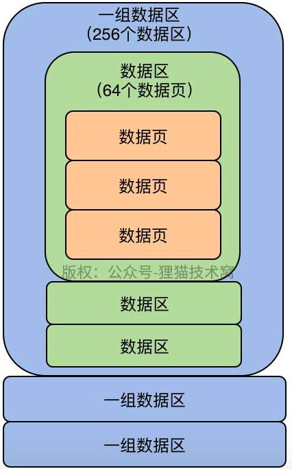
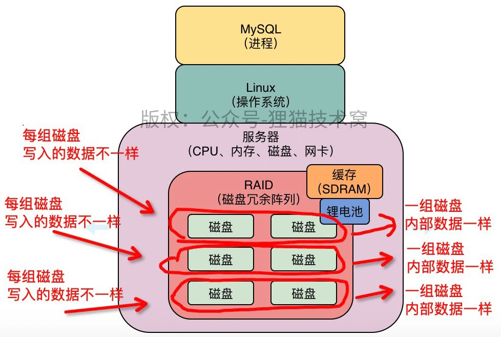
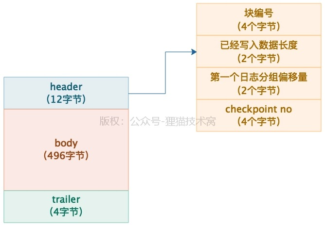

## 1.你知道你的系统是如何跟MySQL打交道的吗？


常用的连接池：`DBCP、C3P0、Druid`

用`Druid`操作数据库的操作步骤：

1.配置属性

```text
url:jdbc:mysql://localhost:3306/dragoon_v25_masterdb
driverClassName:com.mysql.jdbc.Driver
username:root
password:aaaaaaaa
```

2.`spring` 配置

```xml
<bean id="dataSource" class="com.alibaba.druid.pool.DruidDataSource"
		destroy-method="close">
		<property name="url" value="${url}" />
		<property name="username" value="${username}" />
		<property name="password" value="${password}" />
		<property name="driverClassName" value="${driverClassName}" />
</bean>

<bean id="SpringTableOperatorBean" class="com.whyun.druid.model.TableOperator"
		scope="prototype">
		<property name="dataSource">
			<ref bean="dataSource" />
		</property>
</bean>


```

3.构建类TableOperator

```java
public class TableOperator {
    private DataSource dataSource;
    public void setDataSource(DataSource dataSource) {
          this.dataSource = dataSource;
    }

    private static final int COUNT = 800;    

    public TableOperator() {

    }

    public void tearDown() throws Exception {
        try {
            dropTable();
        } catch (SQLException e) {
            e.printStackTrace();
        }       
    }

    public void insert() throws Exception {

        StringBuffer ddl = new StringBuffer();
        ddl.append("INSERT INTO t_big (");
        for (int i = 0; i < COUNT; ++i) {
            if (i != 0) {
                ddl.append(", ");
            }
            ddl.append("F" + i);
        }
        ddl.append(") VALUES (");
        for (int i = 0; i < COUNT; ++i) {
            if (i != 0) {
                ddl.append(", ");
            }
            ddl.append("?");
        }
        ddl.append(")");

        Connection conn = dataSource.getConnection();

    //        System.out.println(ddl.toString());

        PreparedStatement stmt = conn.prepareStatement(ddl.toString());

        for (int i = 0; i < COUNT; ++i) {
            stmt.setInt(i + 1, i);
        }
        stmt.execute();
        stmt.close();

        conn.close();
    }

}
```


用`C3P0`操作数据库步骤：

1.配置属性`db.properties`

```text
jdbc.user=root
jdbc.password=1111
jdbc.driverClass=com.mysql.jdbc.Driver
jdbc.jdbcUrl=jdbc:mysql:///sms

jdbc.initPoolSize=5
jdbc.maxPoolSize=10

# 可以配置的其他参数
initialPoolSize：初始化连接数量
minPoolSize：最小连接数量
maxPoolSize：最大连接数量
acquireIncrement: 当连接池用完之后一次性获取的连接数量
idleConnectionTestPeriod:根据一定的时间间隔检查连接池的连接数量 单位为秒
maxIdleTime：最大空闲时间 单位为秒
maxStatements:最大的maxStatements连接数量
maxStatementsPerConnection:最大语句缓存
```

2.配置`XML`

```xml
<?xml version="1.0" encoding="UTF-8"?>
<beans xmlns="http://www.springframework.org/schema/beans"
    xmlns:xsi="http://www.w3.org/2001/XMLSchema-instance"
    xmlns:context="http://www.springframework.org/schema/context"
    xsi:schemaLocation="http://www.springframework.org/schema/beans http://www.springframework.org/schema/beans/spring-beans-4.3.xsd
        http://www.springframework.org/schema/context http://www.springframework.org/schema/context/spring-context-4.3.xsd">

    <!-- 导入资源文件
        读取db.properties文件中的数据 -->
    <context:property-placeholder location="classpath:db.properties"/>

    <!-- 配置C3P0数据源 -->
    <bean id="dataSource"
        class="com.mchange.v2.c3p0.ComboPooledDataSource">
        <property name="user" value="${jdbc.user}"></property>
        <property name="password" value="${jdbc.password}"></property>
        <property name="jdbcUrl" value="${jdbc.jdbcUrl}"></property>
        <property name="driverClass" value="${jdbc.driverClass}"></property>

        <property name="initialPoolSize" value="${jdbc.initPoolSize}"></property>
        <property name="maxPoolSize" value="${jdbc.maxPoolSize}"></property>
    </bean>

    <!-- 配置Spring的jdbcTemplate 
        并注入一个dataSource数据源-->
    <bean id="jdbcTemplate"
        class="org.springframework.jdbc.core.JdbcTemplate">
        <property name="dataSource" ref="dataSource"></property>    
    </bean>
</beans>
```

3.测试代码

```java
public class testJDBC {
    private JdbcTemplate jdbcTemplate;
    private ApplicationContext context = null;

    //初始化连接池
    {
        context = new ClassPathXmlApplicationContext("applicationContext.xml");
        jdbcTemplate = (JdbcTemplate) context.getBean("jdbcTemplate");
    }

    //测试是否连接数据库
    @Test
    public void testIsConnect() throws SQLException {
        DataSource dataSource = context.getBean(DataSource.class);
        System.out.println("连接成功"+dataSource.getConnection());
    }
}
```


## 2.为了执行SQL语句，你知道MySQL用了什么样的架构设计吗？


网络连接必须让线程来处理

执行`SQL`的流程：

```text
1.SQL接口：负责处理接收到的SQL语句

2.查询解析器：让MySQL能看懂SQL语句
例如：select id,name,age from users where id = 1
查询解析器(Parser)对SQL语句进行解析，可以拆解成以下几个部分：
1）要从users表里查询数据
2）查询id字段的值等于1的那行数据
3）对查出来的那行数据要提取里面的id,name,age三个字段

3.查询优化器：选择最优的查询路径
上面的SQL语句就有两条路：
1）直接定位到users表中的id字段等于1的那行数据，然后查出来那行数据的id,name,age三个字段的值
2）先把users表中的每一行数据的id,name.age三个字段的值都查出来，然后从这批数据里过滤出id等于1的哪行数据的id,name,age三个字段
上述两条路，明显第一条更优

4.调用存储引擎接口，真正执行SQL语句
数据放在内存或磁盘中，此时需要存储引擎，去查询内存焕春数据，更新磁盘数据，查询磁盘数据等操作。

5.执行器：根据执行计划调用存储引擎的接口
执行器会根据优化器选择的执行方案，去调用存储引擎的接口按照一定的顺序和步骤，就把SQL语句的逻辑给执行了。

执行器根据优化器生成的一套执行计划，然后不停的调用存储引擎的各种接口去完成SQL语句的执行计划。
```

`MySQL`的架构设计中，`SQL`接口、`SQL`解析器、查询优化器都是通用的，是一套组件而已。

存储引擎的话，有各种各样的：`InnoDB、MyISAM、Memory`等。


## 3.用一次数据更新流程，初步了解InnoDB存储引擎的架构设计

1.`InnoDB`的重要内存结构：缓冲池，里面会缓存很多数据，后续查询，如果内存中有数据，就不用去查磁盘（`elasticsearch`中也是这种模式）。


2.`undo log`：回滚数据

`update users set name='xxx' where id=10`，将`id=10`这行数据的`name`从`zhangsan`更新为`xxx`，首先需要将更新前的值`name=zhangsan,id=10`，写入到`undo log`中去。

3.更新`buffer pool`中的缓存数据

更新表中内容步骤：

```text
1.将要更新的那行记录从磁盘文件加载到缓冲池，对他进行加锁
2.将更新前的旧值写入undo日志文件
3.正式更新，先更新缓存，此时这数据是脏数据(内存与磁盘数据不一致)
```


4.`Redo Log Buffer`：系统宕机，避免数据丢失

按照3说明，现在内存数据已经修改，但是磁盘数据还没修改，此时如果`MySQL`宕机，必然导致内存里修改过的数据丢失。

此时，可以将对内存所做的修改写入一个`Redo Log Buffer`里，这也是内存的一个缓冲区，，用来存放`redo`日志。

`redo log`记录对数据修改，比如对`id=10`这行记录修改了`name`字段的值为`xxx`，这就是一条日志。


5.`redo log`处理方式

如果还没提交事务，此时如果`MySQL`崩溃，必然导致内存里`Buffer Pool`中的修改过的数据都丢失，同时写入`Redo Log Buffer`中的`redo log`也会丢失。

此时需要考虑将`redo log`写入磁盘，策略是通过`innodb_flush_log_at_trx_commit`这个参数来设置的：

```text
1.设置成0
提交事务时，不会把redo log buffer里的数据刷入磁盘文件，mysql宕机会丢失数据
2.设置成1(推荐)
提交事务时，必须将redo log从内存刷入磁盘文件，只要事务提交成功，那么redo log就必须在磁盘
3.设置成2
提交事务时，把redo log写入磁盘文件对应的os cache缓存里去，可能1s后才会把os cache里的数据写入磁盘文件，机器宕机还是会丢数据。
```


## 4.借着更新语句在InnoDB存储引擎中的执行流程，聊聊binlog是什么？

`binlog vs redo log`

```text
1.binlog 归档日志，里面记录偏向于逻辑性的日志，类似于：对users表中的id=10的一行数据做了更新操作，更新以后的值是什么
redo log记录的是偏向物理性质的重做日志，类似于：对哪个数据页中的什么记录，做了个什么修改

2.binlog不是InnoDB存储引擎特有的日志文件，是属于mysql server自己的日志文件
redo log是属于InnoDB存储引擎特有的一个东西
```

提交事务时，同时会写入`binlog、redo log`。

这些都是由执行器来完成的，它负责跟`InnoDB`进行交互，包括从磁盘里加载数据到`Buffer Pool`中进行缓存，包括写入`undo log`，包括更新`Buffer Pool`里的数据，以及写入`redo log buffer`，`redo log`刷入磁盘，写`binlog`等。

**binlog的刷盘策略**

`sync_binlog`参数控制，默认值是0，`binlog`写在`os cache`内存缓存，不会直接进入磁盘文件。数据会丢失。

设置成1，则在提交事务时，会将`binlog`直接写入到磁盘文件里去，数据不会丢失。

**保证binlog与redo log一致性**


使用`commit`标记。

提交事务后，上图中的5、6、7步骤必须都执行完毕才算提交了事务。如果在完成步骤5，`redo log`刷盘成功，此时`MySQL`宕机的话，数据不会出现不一致问题：因为没有最终事务`commit`标记在`redo log`中，所以这次事务被判定不成功。

如果完成步骤6，`binlog`刷盘成功，此时`MySQL`宕机，同理，由于`redo log`中没有最终的`commit`标记，此时事务提交也是失败的。

**后台IO线程随机将内存更新后的脏数据刷回磁盘**


在你`IO`线程把脏数据刷回磁盘之前，哪怕`MySQL`宕机崩溃也没关系，因为重启之后，会根据`redo log`恢复之前提交事务做过的修改到内存中去，类似于`id=10`的数据的`name`修改为`xxx`，然后等待适当时机，`IO`线程还是会把这个修改后的数据刷到磁盘上的数据文件里去。


**InnoDB存储引擎的架构原理**

```text
1.执行更新时
每条SQL语句都会对应修改buffer pool里的缓存数据，写undo log，写redo log buffe几个步骤

2.提交事务时
一定会把redo log刷入磁盘，binlog输入磁盘，完成redo log中的事务commit标记
最后后台的IO线程会随机把buffer pool里的脏数据刷入磁盘里去。
```


## 5.真实生产环境下的数据库机器配置如何规划？

机器配置最低`8core16G`，正常在`16core32G`

`Java`应用一般部署在`2core4G或4core8G`的机器上。`4core8G`每秒能抗下500左右并发。至于多少请求，与请求耗时有关，从每秒一两百请求到每秒七八百请求都有可能。

`8core16G`机器部署的`MySQL`数据库，每秒抗下一两千并发请求没问题。

`16core32G`机器部署的`MySQL`数据库，每秒能抗两三千并发请求。

数据库最好采用`SSD`固态硬盘而不是普通的机械硬盘。因为数据库最大的复杂在于大量的磁盘`IO`，需要大量的读写磁盘文件。


## 6.互联网公司的生产环境数据库是如何进行性能测试的？

压测

`QPS`：`Query Per Second`，每秒请求数

`TPS`：`Transaction Per Second`，每秒可处理的事务量，一个事务可以包含多个`SQL`语句。事务提交或者回滚都算是事务执行了。

**IO相关的压测性能指标**

```text
1.IOPS 机器的随机IO并发能力，内存脏数据刷磁盘就需要用的随机IO
2.吞吐量 机器的磁盘存储每秒可以多些多少字节的数据量
redo log之类的日志写磁盘，顺序写入，吞吐量可以达到200M/s
3.latency 往磁盘里写入一条数据的延迟
对数据库的SQL语句执行性能都有影响
```

**压测需要关注的其他性能指标**

```text
1.CPU负载 
2.网络负载 主要看机器带宽，在压测到一定的QPS和TPS时，每秒钟机器的网卡会输入多少MB数据，会输出多少MB数据
3.内存负载
```


## 7.如何对生产环境中的数据库进行360度无死角压测？

`mysql docker`安装：

```shell
# 拉取镜像
docker pull mysql:latest

# 运行容器
docker run -itd --name mysql-test -p 3306:3306 -v /root/docker-mysql/conf.d:/etc/mysql/conf.d -e MYSQL_ROOT_PASSWORD=123456 mysql

# 进入容器内部
docker exec -it mysql-test /bin/bash

mysql -h localhost -u root -p
```

`sysbench`压测工具安装:

```shell
curl -s https://packagecloud.io/install/repositories/akopytov/sysbench/script.rpm.sh | sudo bash

sudo yum -y install sysbench

sysbench --version
```


```shell
# 构建测试表和测试数据
sysbench --db-driver=mysql --time=300 --threads=10 --report-interval=1 --mysql-host=127.0.0.1 --mysql-port=3306 --mysql-user=root --mysql-password=123456 --mysql-db=test_db --tables=20 --table_size=1000000 oltp_read_write --db-ps-mode=disable prepare

# 测试数据库的总和读写TPS，使用的是oltp_read_write模式
sysbench --db-driver=mysql --time=300 --threads=10 --report-interval=1 --mysql-host=127.0.0.1 --mysql-port=3306 --mysql-user=root --mysql-password=123456 --mysql-db=test_db --tables=20 --table_size=1000000 oltp_read_write --db-ps-mode=disable run

# 压测结果分析
[ 22s ] thds: 10 tps: 177.99 qps: 3512.87 (r/w/o: 2456.91/699.97/355.99) lat (ms,95%): 110.66 err/s: 0.00 reconn/s: 0.00
分析：
thds: 10，10个线程在压测
tps: 177.99，每秒执行了177.99个事务
qps: 3512.87，每秒可以执行3512.87个请求
r/w/o: 2456.91/699.97/355.99，2456.91是读请求，699.97是写请求，355.99对QPS进行了拆解
lat (ms,95%): 110.66： 95%的请求都在110.66ms以下
err/s: 0.00 reconn/s: 0.00：每秒有0个请求是失败的，发生了0次网络重连。

# 压测报告
SQL statistics:
    queries performed:
        read:                            749322  
        write:                           214092
        other:                           107046
        total:                           1070460
    transactions:                        53523  (178.39 per sec.) // 每秒178多个事务
    queries:                             1070460 (3567.81 per sec.) // 执行107万多次请求，每秒3500+请求
    ignored errors:                      0      (0.00 per sec.)
    reconnects:                          0      (0.00 per sec.)

// 一共执行了300s的压测，执行了5w3+的事务
General statistics:
    total time:                          300.0314s
    total number of events:              53523

Latency (ms):
         min:                                   11.51 // 最小延迟11.51ms
         avg:                                   56.05 // 所有请求平均延迟
         max:                                  396.48 // 延迟最大的请求
         95th percentile:                      125.52 // 95%的请求延迟都在125.52ms以下
         sum:                              2999963.28

Threads fairness:
    events (avg/stddev):           5352.3000/19.27
    execution time (avg/stddev):   299.9963/0.01
```


## 8.在数据库的压测过程中，如何360度无死角观察机器性能？

1.top

`top - 17:55:22 up 55 min,  4 users,  load average: 3.16, 3.52, 3.54`

当前机器有4个用户在使用，`load average 3.16,3.52,3.54`表示`CPU`在1分钟、5分钟、15分钟内的负载情况。

机器只有2核，这里都是3点几的负载，说明`CPU`负载高，此时不要再继续提高线程的数量和增加数据库的`QPS`。

`Mem :  8009172 total,   142704 free,   986396 used,  6880072 buff/cache`

总内存`8G`，使用了`0.14G`，有`6.56G`的内存用作`OS`内核的缓冲区。


2.磁盘IO

```shell
$ dstat -d
-dsk/total-
 read  writ
 480k   15M
   0    43M
4096B   41M

# 每秒读取480k，写入15M，一般普通的机械硬盘都可以做到每秒钟上百MB的读写数据量

$ dstat -r
--io/total-
 read  writ
14.3   358
7.00  2043
   0  2065
12.0  2023

# 读IOPS和写IOPS，随机磁盘读取每秒多少次，随机磁盘写入每秒多少次，一般来说，随机磁盘读写每秒在两三百次都是可以承受的。
```


3.观察网卡流量

```shell
$ dstat -n
-net/total-
 recv  send
   0     0
  16M 1068k
  15M 1017k
  14M 1003k 
  
# 每秒钟网卡接受到流量与发送出去的流量，通常来说，如果你的机器使用的是千兆网卡，那么每秒钟的总流量也就在100MB左右，甚至更低一些。 
```


## 9&10.如何为生产环境中的数据库部署监控系统？

`Prometheus`其实就是一个监控数据采集和存储系统，他可以利用监控数据采集组件（比如`mysql_exporter`）从你指定的MySQL数据库中采集他需要的监控数据，然后他自己有一个时序数据库，他会把采集到的监控数据放入自己的时序数据库中，其实本质就是存储在磁盘文件里。

`Grafana`就是一个可视化的监控数据展示系统，他可以把`Prometheus`采集到的大量的`MySQL`监控数据展示成各种精美的报表，让我们可以直观的看到`MySQL`的监控情况。


## 11.从数据的增删改查开始讲起，回顾一下Buffer Pool在数据库里的地位


`Buffer Pool`是数据库的一个内存组件，里面缓存了磁盘上的真实数据，然后我们的`Java`系统对数据库执行的增删改操作，其实主要就是对这个内存数据结构的缓存数据执行的。


## 12.Buffer Pool这个内存数据结构到底长个什么样子？

`Buffer Pool`本质其实就是数据库的一个内存组件，是一片内存数据结构。默认大小是`128MB`。

生产环境可进行调整，例如`16core32G`机器，可以给`Buffer Pool`分配个`2GB`的内存，使用如下配置：

```text
[server]
innodb_buffer_pool_size=2147483648
```

**数据页：MySQL中抽象出来的数据单位**，`MySQL`把很多行数据放在一个数据页中。

实际更新一行数据，此时数据库会找到这行数据所在的数据页，然后从磁盘文件里把这行数据所在的数据页直接给加载到`Buffer Pool`里去。

`Buffer Pool`中默认情况下，一个缓存页的大小和磁盘上的一个数据页的大小是意义对应起来的，都是`16KB`。


每个缓存也都会有一个描述信息，包括：这个数据页所属的表空间、数据页的编号、这个缓存页在`Buffer Pool`

中的地址以及别的一些杂七杂八的东西。


`Buffer Pool`中的描述数据大概相当于缓存页大小的`5%`左右，大概800字节左右的大小。因此如果`Buffer Pool`大小是`128MB`，实际上`Buffer Pool`真正的最终大小可能有个130多`MB`。


## 13.从磁盘读取数据页到Buffer Pool的时候，free链表有什么用？

从磁盘中读取数据页放入`Buffer Pool`中的缓存页，需要判断哪些缓存页是空闲的。

数据库为`Buffer Pool`设计了一个`free`链表，是一个双向数据结构，`free`链表中每个节点就是一个空闲的缓存页的描述数据块的地址。

刚开始数据库启动时，可能所有的缓存页都是空闲的，因为此时可能是一个空的数据库，一条数据都没有，所以此时所有缓存页的描述数据块，都会放入到这个`free`链表中。


`free`链表有一个基础节点，他会引用链表的头节点和尾节点，里面还存储了链表中有多少个描述数据块的节点，也就是有多少个空闲的缓存页。

**free链表占用了多少空间**

`free`链表本身就是由`Buffer Pool`里的描述数据块组成。有两个指针：`free_pre` 指向自己的上一个`free`链表的节点，`free_next` 指向自己的下一个`free`链表的节点。

只有一个基础节点不属于`Buffer Pool`，占用40字节左右。

**如何将磁盘上的页读取到Buffer Pool的缓存页中去？**

```text
1.从free链表里获取一个描述数据块，就可以获取到这个描述数据块对应的空闲缓存页
2.把磁盘上的数据页读取到对应的缓存页里去，同时将相关的一些描述数据写入缓存页的描述数据块里去，比如这个数据页所属的表空间之类的信息
3.把描述数据块从free链表里去除
```


描述数据块从`free`链表中移除，伪代码：

```java
// 描述数据块
DescriptionDataBlock {
    // 自己块block02
    block_id = block02;
    // 在free链表中的上一个节点block01
    free_pre= block01;
    // 在free链表汇总的下一个节点是block03
    free_next = block03;
}

# 将block03移除 将free_next改成null即可
DescriptionDataBlock {
    // 自己块block02
    block_id = block02;
    // 在free链表中的上一个节点block01
    free_pre= block01;
    // 在free链表汇总的下一个节点是block03
    free_next = null;
}
```

**如何知道数据页有没有被缓存？**

哈希表结构，用表空间号+数据页号，作为一个`key`，然后缓存的地址作为`value`。


## 14.当我们更新Buffer Pool中的数据时，flush链表有什么用？

`Buffer Pool`划分缓存页和描述数据块之后，还会剩一点点的内存，这部分内存放不下缓存页，只能放着不用，这就是内存碎片。

存在脏页，脏页指的是缓存页的数据和磁盘上的数据页里的数据不一致。


需要确定哪些缓存页是脏页，不可能所有的缓存页都刷回磁盘，因为有的仅仅是查询了，此时引入`flush`链表，这个`flush`链表本质上也是通过缓存页的描述数据块中的两个指针，让被修改过的缓存页的描述数据块，组成一个双向链表。

脏页都进入`flush`链表。


`flush`链表伪代码：

```java
// 描述数据块
DescriptionDataBlock {
    // 缓存页01的数据块
    block_id = block01;
    // 在free链表中的上一个节点和下一个节点
    // 因为这个缓存页已经被更新过了，肯定不在free链表里了，所以两个指针都是null
    free_pre = null;
    free_next = null;
    // 在flush链表中的上一个节点和下一个节点
    // 目前只有一个节点，所以上下节点也为空
    flush_pre = null;
    flush_next = null;
}

// flush链表的基础节点
FlushLinkedListBaseNode {
    // 基础节点指向链表起始节点和结束节点的指针
    // flush链表中目前就一个缓存页01，所以他指向他的描述数据块
    start = block01;
    end = block01;
    // flush链表中有几个节点
    count = 1;
}

# 缓存页02被更新了，也成为了脏页。
// 描述数据块
DescriptionDataBlock {
    // 缓存页01的数据块
    block_id = block01;
    // 在free链表中的上一个节点和下一个节点
    // 因为这个缓存页已经被更新过了，肯定不在free链表里了，所以两个指针都是null
    free_pre = null;
    free_next = null;
    // 在flush链表中的上一个节点和下一个节点，下一个节点是block02
    flush_pre = null;
    flush_next = block02;
}
// 描述数据快
DescriptionDataBlock {
    // 缓存页02的数据块
    block_id = block02;
    // 在free链表中的上一个节点和下一个节点
    // 因为这个缓存页已经被更新过了，肯定不在free链表里了，所以两个指针都是null
    free_pre = null;
    free_next = null;
    // 在flush链表中的上一个节点和下一个节点，上一个节点是block01
    flush_pre = block01;
    flush_next = null;
}

// flush链表的基础节点
FlushLinkedListBaseNode {
    // 基础节点指向链表起始节点和结束节点的指针
    // flush链表中目前有缓存页01和02
    start = block01;
    end = block02;
    // flush链表中有几个节点
    count = 2;
}
```


## 15.当Buffer Pool中的缓存页不够时，如何基于LRU算法淘汰部分缓存？

`LRU`： `Least Recently Used`最近最少使用。


工作原理：

```text
1.加载、查询、修改缓存页的数据，都会将这个缓存页挪动到LRU链表的头部去
2.当缓存页没有空闲时，要找最近最少被访问的缓存页刷入磁盘，此时直接在LRU链表的尾部取这个缓存页。
```

缓存命中率：缓存修改和查询的次数多少。比如说100次请求由30次是在操作A缓存页，只有1次在操作B缓存页。可以说A缓存页的缓存命中率高。


## 17.MySQL是如何基于冷热数据分离的方案，来优化LRU算法的？

`MySQL`预读机制：把相邻的一些数据页一次性读入到`Buffer Pool`缓存里去。目的是提升性能，如果在一个区内，你顺序读写了很多数据页，`MySQL`会判断，你可能接着会继续顺序读取后面的数据页。干脆就将后续的一大堆数据页都读取到`Buffer Pool`里去，后续可以直接从`Buffer Pool`里拿取数据。

如果采用的是简单的`LRU`链表，预读的一大堆数据页可能占据了`LRU`链表的前面部分，这些预读出来的数据页可能压根没人使用，这时候预读机制就有问题。

**基于冷热数据分离的思想设计LRU链表**

真正的`LRU`链表，会被拆分为两个部分，一部分热数据，一部分冷数据。这个冷热数据的比例是有`innodb_old_blocks_pct`来控制，默认是37，冷数据占比`37%`。

数据页加载到缓存中步骤：

```text
1.数据页第一次被加载到缓存的时候，这个时候缓存页会被放在冷数据区的链表头部
2.mysql设置了innodb_old_blocks_time参数，默认值是1000ms，表示一个数据页被加载到缓存页，在1s之后访问了这个缓存页，他才会被挪到热数据区域的链表头部去。
```


## 18.基于冷热数据分离方案优化后的LRU链表，是如何解决之前的问题的？

```text
1.刚加载数据的缓存页都是放冷数据区域的头部，1s后被访问才会放热数据区域的头部，热数据区域的缓存页被访问了，就会自动放到头部去。
2.淘汰缓存时，优先淘汰冷数据区域几乎不怎么被访问的缓存页。
```


## 19.MySQL是如何将LRU链表的使用性能优化到极致的？

问题思考：

```text
1.LRU链表的冷数据区域都是一些什么数据？
大部分应该都是预读加载进来的缓存页，加载进来1s之后都没人访问，包括：全表扫描或一些大的查询语句，加载一堆数据到缓存页，结果都是1s之内访问了一下，后续就不在访问这些表的数据了。

2.如果一个缓存页在冷数据区域的尾巴上，已经超过1s了，此时这个缓存页被访问了一下，此时会移动到哪？
热数据头部

3.Redis怎么优化缓存机制？
热数据缓存预加载：每天统计出来哪些商品被访问的次数最多，然后晚上启动一个定时作业，把这些热门商品的数据预加载到Redis里。第二天对热门商品的访问就自然会优先走Redis缓存。
```

**LRU链表的热数据区域是如何进行优化？**

正常来说，访问了热数据区域的缓存页应该将这个缓存页移动到热数据区域的链表头部去。但是如果热数据区域的缓存页经常被访问，频繁进行移动性能不太好。

因此：`LRU`链表的热数据区域的访问规则被优化了：即你只有在热数据区域的后3/4部分的缓存页被访问，才会给你移动到链表头部去。


## 20.对于LRU链表中尾部的缓存页，是如何淘汰他们刷入磁盘的？

**Buffer Pool的缓存页以及几个链表的使用回顾**

```text
1.Buffer Pool在运行中被使用的时候，实际上会频繁得从磁盘上加载数据页到他的缓存页里去，然后free链表、flush链表、lru链表都会在使用的时候同时被使用。
2.如果加载一个缓存页，free链表里会移除这个缓存页，然后lru链表的冷数据区域的头部会放入这个缓存页。
3.如果修改一个缓存页，flush链表会记录这个脏页，lru链表中还可能会把你从冷数据区域移动到热数据区域的头部
4.如果查询一个缓存页，此时会把这个缓存页在lru链表中移动到热数据区域去，或者在热数据区域中也有可能会移动到头部去。
```

淘汰策略：

1.定时把LRU尾部的部分缓存页刷入磁盘

后台线程运行一个定时任务，这个定时任务每隔一段时间就会把`LRU`链表的冷数据区域的尾部一些缓存页，刷入磁盘里去，清空这几个缓存页，把他们放回`free`链表中去。


2.把flush链表中的一些缓存页定时刷入磁盘

仅仅把`LRU`链表中的冷数据区域的缓存页刷入磁盘，显然不够，因为`LRU`链表中很多缓存页被频繁修改，他们也需要刷入磁盘。

`flush`链表中存储了脏页，后台线程在`MySQL`不怎么繁忙的时候，找个时间把`flush`链表中的缓存页都刷入磁盘中，这样被修改过的数据，迟早都会刷入磁盘。


3.如果没有空闲缓存页，从`LRU`链表的冷数据区域的尾部找到一个缓存页，把他刷入磁盘和清空，然后把数据页加载到这个腾出来的空闲缓存页中去。


## 21.如何通过多个Buffer Pool来优化数据库的并发性能？

`MySQL`默认规则：如果你给`Buffer Pool`分配的内存小于`1GB`，那么最多只会给你一个`Buffer Pool`。

多线程并发访问一个`Buffer Pool`，必然是要加锁的，然后让一个线程完成一些列操作，比如说加载数据页到缓存页，更新`free`链表，更新`LRU`链表，然后释放锁，接着让下一个线程再执行一系列的操作。

设置多个`Buffer Pool`在`MySQL`服务器端的配置：

```text
[server]
innodb_buffer_pool_size = 8589934592 # 8G
innodb_buffer_pool_instances = 4 # 4个Buffer Pool
```


设置多个`Buffer Pool`来优化高并发访问性能。


## 22.如何通过chunk来支持数据库运行期间的Buffer Pool动态调整？

```shell
show VARIABLES like "%innodb_buffer_pool_size%";

# output 128M
+-------------------------+-----------+
| Variable_name           | Value     |
+-------------------------+-----------+
| innodb_buffer_pool_size | 134217728 |
+-------------------------+-----------+

show VARIABLES like "%innodb_buffer_pool_instances%";

# output 1个
+------------------------------+-------+
| Variable_name                | Value |
+------------------------------+-------+
| innodb_buffer_pool_instances | 1     |
+------------------------------+-------+
```

每个`Buffer Pool`有多个`chunk`，每个`chunk`就是一系列的描述数据块和缓存页。`Buffer Pool`按照`chunk`为单位，拆分为了一系列的小数据块，但是每个`Buffer Pool`是共用一套`free/flush/lru`的链表的。


有了`chunk`就可以支持动态调整`Buffer Pool`大小。

比如说我们`Buffer Pool`总大小是`8GB`，现在动态加到`16GB`，此时只需要申请一些列的`128MB`大小的`chunk`即可。


## 23.在生产环境中，如何基于机器配置来合理设置Buffer Pool?

`Buffer Pool`总大小=（`chunk`大小 * `Buffer Pool`数量）的倍数

比如：32G内存，给`Buffer Pool` 20G，假设`Buffer Pool`数量是16个，此时`chunk`大小 * `Buffer Pool`数量= 16 * 128MB = 2048MB，此时`Buffer Pool`大小是`2048MB`的10倍。


**Buffer Pool的结构设计及工作原理**

```text
1.数据库生产环境运行时，必须根据机器的配置才能设置合理的Buffer Pool的大小，设置Buffer Pool的数量，尽可能保证数据库的高性能和高并发能力

2.线上运行时，Buffer Pool是有多个的，每个Buffer Pool里有多个chunk但是共用一套链表数据结构

3.执行CRUD的时候，Buffer Pool会不停的加载磁盘上的数据页到缓存页里来，然后会查询和更新缓存页的数据，同时维护一系列的链表结构：free、flush、lru链表

4.后台线程定时根据LRU链表和flush链表，去把一批缓存页刷入磁盘释放掉这些缓存页，同时更新free链表

5.如果CRUD的时候发现缓存页都满了，没法加载自己需要的数据页进缓存，此时就会把LRU链表冷数据区域的缓存页刷入磁盘，然后加载自己需要的数据页进来。
```


```shell
SHOW ENGINE INNIDB STATUS

# output Buffer Pool部分
Total large memory allocated 2197815296
Dictionary memory allocated 634708
Buffer pool size   131072
Free buffers       2048
Database pages     124539
Old database pages 45932
Modified db pages  0
Pending reads      0
Pending writes: LRU 0, flush list 0, single page 0
Pages made young 219327, not young 269060
0.00 youngs/s, 0.00 non-youngs/s
Pages read 168016, created 301478, written 737743
0.00 reads/s, 0.00 creates/s, 0.00 writes/s
No buffer pool page gets since the last printout
Pages read ahead 0.00/s, evicted without access 0.00/s, Random read ahead 0.00/s
LRU len: 124539, unzip_LRU len: 0
I/O sum[0]:cur[0], unzip sum[
0]:cur[0]

1.Total large memory allocated:Buffer Pool最终总大小
2.Buffer Pool Size:Buffer Pool一共容纳多少个缓存页
3.Free buffers:free链表中一共有多少个空闲的缓存页可用
4.Database pages和Old database pages: LRU链表中应该有多少个缓存页，以及冷数据区域里的缓存页数量
5.Modified db pages:这就是flush链表中的缓存页数量
6.Pending reads和Pending writes：等待从磁盘上加载进缓存页的数量，还有就是即将从LRU链表中刷入磁盘的数量、即将从flush链表中刷入磁盘的数量
7.Pages made young和not young：LRU冷数据区域里访问之后转移到热数据去的缓存页的数量，以及在LRU冷数据区域里1s内被访问了没进入热数据区域的缓存页的数量
8.young/s和not young/s，每秒从冷数据区域进入热数据区域的缓存页的数量。以及每秒在冷数据区域里被访问了但是不能进入热数据区域的缓存页的数量
9.Pages read xxx,created xxx,written xxx,xx reads/s,xx creates/s,xx writes/s
已经读取、创建和写入了多少个缓存页，以及每秒钟读取、创建和写入的缓存页的数量
10.No buffer pool page gets since the last printout:访问请求有多少次直接命中了Buffer pool，这里是0
11.LRU len: LRU链表里的缓存页的数量
12.I/Osum: 最近50s读取磁盘也的总数
13.I/Ocur: 现在正在读取磁盘页的数量s
```


## 24.我们写入数据库的一行数据，在磁盘上是怎么存储的？

**一些思考**

```text
1.为什么不直接更新磁盘上的数据，而是要设计一套复杂的数据存取机制？
随机写磁盘性能很差。
更新内存的性能是极高的，然后顺序写磁盘上的日志文件性能也是比较高的，因为顺序写磁盘文件，性能要远高于随机读写磁盘文件。

2.MySQL为什么要引入数据页这个概念？
一条一条的加载到内存效率低。
用数据页，16kb的空间能存不少条数据。
update xxx set xxx=xxx where id=1，可能接下来要更新的就是id=2,id=3等其他数据，用数据页就无须再次从磁盘中获取数据了。
```

**一行数据在磁盘上是如何存储的？**

涉及行格式。这里用`COMPACT`行存储格式。

```text
CREATE TABLE table_name(columns)ROW_FORMAT=COMPACT
ALTER TABLE table_name ROW_FORMAT=COMPACT
```

在这种格式下，每一行数据实际存储的时候，格式类似于下面这样：

```text
变长字段的长度列表，null值列表，数据头，column01的值，column02的值，column0n的值......
```


## 25.对于VARCHAR这种变长字段，在磁盘上到底是如何存储的？

```text
变长字段的长度列表，null值列表，数据头，column01的值，column02的值，column0n的值......
```

存储`hello a a（VARCHAR(10),CHAR(1),CHAR(1)）`这行数据，变长字段类型：

```text
0x05 null值列表 数据头 hello a a 
```

多个变长字段，如何存放他们的长度？

`VARCHAR(10) VARCHAR(5) VARCHAR(20) CHAR(1) CHAR(1)`，一共5个字段，其中三个是变长字段，此时假设一行数据是这样的：`hello hi hao a a`。

需要在开头的变长字段长度列表中存储几个变长字段的长度，注意这里是**逆序存储**。实际是：

```text
0x03 0x02 0x05 null值列表头字段 hello hi hao a a
```


## 26.一行数据中的多个NULL字段值在磁盘上怎么存储？

字段可以为`NULL`，说明什么值都没有，无需给他存一个`NULL`字符串，这样会在磁盘上浪费空间。

`NULL`值用二进制`bit`位来存储的。

```text
CREATE TABLE customer (
name VARCHAR(10) NOT NULL,
address VARCHAR(20),
gender CHAR(1),
job VARCHAR(30),
school VARCHAR(50)
)ROW_FORMAT=COMPACT;

# 4个变长字段，1个定长字段，除了name字段声明了NOT NULL，其他4个字段都可能是NULL。
```

按照之前的格式说明(`bit`位也是逆序)：

```text
0x09 0x04 00000101 头信息 column1=value1 column2=value2 ... columnN=valueN
```


## 27.磁盘文件中，40个bit位的数据头以及真实数据是如何存储的？

`40bit`


## 28.我们每一行的实际数据在磁盘上是如何存储的？

按照上面的表（`customer`）存储一行数据`jack NULL m NULL xx_school`,格式如下：

```text
0x09 0x04 00000101 0000000000000000000010000000000000011001 jack m xx_school
--> 字符串都对应着数据库指定的字符集编码
0x09 0x04 00000101 0000000000000000000010000000000000011001 616161 636320 6262626262
--> 加入一些隐藏字段
1.DB_ROW_ID 行唯一标识，数据库内部给你搞得一个标识，不是你的主键ID字段。如果没有指定主键和unique key唯一索引的时候，会自动加一个ROW_ID作为主键
2.DB_TRX_ID 事务ID
3.DB_ROLL_PTR 回滚指针
0x09 0x04 00000101 0000000000000000000010000000000000011001 00000000094C(DB_ROW_ID) 00000000032D(DB_TRX_ID) EA000010078E(DB_ROL_PTR) 616161 636320 6262626262
```


## 29.理解数据在磁盘上的物理存储之后，聊聊行溢出是什么东西？

数据页默认`16kb`，如果一行数据大于`16kb`，例如`VARCHAR(65532)`，有65532个字节，远大于`16kb`。此时就会有行溢出。

在数据页中存储了这行数据的部分数据，同时包含一个20字节的指针，指向其他的一些数据页，那些数据页用链表串联起来。


`TEXT、BLOB`这种类型的字段，都有可能出现溢出。


## 30.用于存放磁盘上的多行数据的数据页到底长个什么样子？

数据页拆分成很多部分：包含了文件头、数据页头、最小记录和最大记录、多个数据行、空闲空间、数据页目录、文件尾部。


其中文件头占据了38个字节，数据页头占据了56个字节，最大记录和最小记录占据了26个字节，数据行区域的大小是不固定的，空闲区域的大小也是不固定的，数据页目录的大小也是不固定的，然后文件尾部占据8个字节。

**数据插入数据页的过程**

1.刚开始数据页是空的，没有一行数据的。


2.插入一行数据，数据库里一行数据都没有，此时先从磁盘上加载一个空的数据页到缓存页里去。


3.往`Buffer Pool`中的一个空的缓存页插入一条数据，缓存页与数据页是一一对应的，插入缓存页，相当于在数据页插入这行数据，空闲区域的空间会减少一些。


4.不停插入数据到这个缓存页，直到他的空闲区域都耗尽了，这个页满了。此时数据行区域内可能有很多行数据。


5.在更新缓存页的同时，其实他在`LRU`链表里的位置会不停的变动，而且肯定会在`flush`链表里，最终会通过后台`IO`线程根据`LRU`链表和`flush`链表，把这个脏的缓存页刷到磁盘上去。


## 31.表空间以及划分多个数据页的数据区，又是什么概念？

平时创建表，会在磁盘上对应着"表名.ibd"这样的一个磁盘数据文件。

一个表空间的磁盘文件其实是有很多的数据页的。但是数据页太多不好管理，就在表空间里引入了一个数据区的概念。

一个数据区对应着连续的64个数据页，每个数据页都是16kb，所以一个数据区是1mb，然后256个数据区被划分为一组。

表空间第一组数据区的第一个数据区的前3个数据页都是固定的，里面存放了一些描述性的数据。

```text
1.FSR_HDR数据页，存放了表空间和这一组数据区的一些属性
2.IBUF_BITMAP数据页，存放了这一组数据页的所有insert buffer的一些信息
3.INODE数据页，存放了一些特殊信息
```

**平时创建的那些表都是有对应的表空间的，每个表空间就是对应了磁盘上的数据文件，在表空间里有很多组数据区，一组数据区是256个数据区，每个数据区包含了64个数据页，是1mb。**


## 32.一文总结初步了解到的MySQL存储模型以及数据读写机制

**MySQL存储模型**



磁盘文件存放的数据被拆分成一个一个的`extent`分组，每个`extent`分组中包含了256个`extent`，然后每个`extent`里包含64个数据页（`64*16kb=1mb`），每个数据页里都包含了一行一行的数据。

**数据读写机制**

1.在数据库中执行`CRUD`的时候，必须先把磁盘文件里的一个数据页加载到内存的`Buffer Pool`的一个缓存页里去，然后我们增删改查都是针对缓存页里的数据来执行的。

2.插入一条数据，先根据表找到表空间，再层层找到里面的数据页，把数据页从磁盘里完整加载出来，放入`Buffer Pool`的缓存页里去。

3.从磁盘文件读取一个数据页，采用的随机读写，伪代码：

```text
dataFile.setStartPosition(25347)
dataFile.setEndPosition(28890)
dataPage = dataFile.read()
```

通过上述方式把数据页放到内存的缓存页里。

4.对于被更新过的缓存页来说，都是由后台线程刷入磁盘的，刷磁盘的伪代码：

```text
dataFile.setStartPosition(25347)
dataFile.setEndPosition(28890)
dataFIle.write(cachePage)
```

选择好固定的一段位置的数据，直接把缓存页的数据写回去。


## 33.MySQL数据库的日志顺序读写以及数据文件随机读写的原理

`MySQL`数据读写机制：

```text
1.对redo log、bin log这种日志进行的磁盘顺序读写
2.对表空间的磁盘文件里的数据页进行的磁盘随机读写(读取的这个数据页可能在磁盘的任意位置)
```

磁盘（推荐使用`SSD`）随机读的性能指标：

```text
IOPS：底层的存储系统每秒可以执行多少次磁盘读写操作

响应延迟：磁盘随机读写操作的响应延迟
```


## 34.Linux操作系统的存储系统软件原理剖析以及IO调度优化原理

操作系统：管理`CPU`、内存、磁盘、网卡这些硬件设备的系统


说明：

```text
1.MySQL发起一次数据页的随机读写或者是一次redo log日志文件的顺序读写的时候，实际上会把磁盘IO请求交给Linux操作系统的VFS层
VFS层：根据你是对哪个目录中的文件执行的磁盘IO操作，把IO请求交给具体的文件系统

2.文件系统会先在Page Cache这个基于内存的缓存里找你要的数据在不在里面，如果有就基于内存缓存来执行读写，如果没有就继续往下一层走，此时这个请求会交给通用Block层，在这一层会把你对文件的IO请求转换为Block IO请求

3.IO请求转化为Block IO请求之后，会把这个Block IO请求交给IO调度层，在这一层默认用CFQ公平调度算法
eg:
SQL1: update xxx set xx1=xx2 where id=1 只需要更新磁盘上的一个block的数据
SQL2:select * from xx where xx1 like "%xx%" 可能需要IO读取磁盘上的大量数据
如果采用公平算法，会先执行SQL2，耗时很久，SQL会一致等待，得不到执行的机会

一般建议生产环境用deadline IO调度算法：任何一个IO操作都不能一直不停的等待，在指定的时间范围内，都必须让他执行。

4.IO请求被转交给IO调度层，IO完成调度之后，就会决定哪个IO请求限制性，哪个IO请求后执行，此时可以执行的IO请求就会交给Block设备驱动层，然后最后经过驱动把IO请求发送给真正的存储硬件，也就是Block设备层。

5.硬件设备完成IO读写操作，最后把响应经过上面的层级反向依次返回，最终MySQL可以得到本次IO读写操作的结果。
```


## 35.数据库服务器使用的RAID存储架构初步介绍

`MySQL`：用编程语言写的一套数据库管理软件，底层就是磁盘来存储数据，基于内存来提升数据读写性能，然后设计了复杂的数据模型，帮助我们高效的存储和管理数据。


很多数据库部署在机器上的时候，存储都是搭建的`RAID`存储架构。

`RAID`：磁盘冗余阵列（其实跟分布式架构一样的，都是节点扩容，副本备份）

```text
1.多磁盘阵列技术
一台服务器多块磁盘，扩大磁盘空间
2.数据冗余机制
数据写入时写在两块磁盘上，作为冗余备份，一块磁盘坏掉，可以从另外一块读取冗余数据出来
```


## 36.数据库服务器上的RAID存储架构的电池充放电原理

服务器使用多块磁盘组成的`RAID`阵列，一般会有一个`RAID`卡，这个`RAID`卡带有一个缓存，是一种跟内存类似的`SDRAM`。

这里的`RAID`缓存模式是`write back`，这样的话，所有写入到磁盘阵列的数据，先会缓存在`RAID`卡的缓存里。后续再慢慢写入到磁盘阵列里去，这种写缓存机制，可以大幅度提升我们的数据库磁盘写的性能。


突然断电或服务器自己故障关闭，这时候`RAID`卡缓存数据存在突然丢失的风险。

解决方案：`RAID`卡一般都配置有自己独立的锂电池或者是电容，如果服务器突然掉电，`RAID`卡自己是基于锂电池来供电运行，会赶紧把缓存里的数据写入到阵列中的磁盘上去。


**锂电池存在性能衰减问题**，因此锂电池都要配置定时充放电，每隔30-90天（不同的锂电池厂商是不一样的），就会自动对锂电池充放电一次，这可以延长锂电池的寿命和校准电池容量。

锂电池充放电的过程中，`RAID`缓存级别会换成`write through`，`IO`直接写磁盘，性能会退化10倍，这就导致数据库服务器的`RAID`存储定期的性能出现几十倍的抖动，间接导致你的数据库每隔一段时间就会出现性能十几倍的抖动。


## 37.RAID锂电池充放电导致的MySQL数据库性能抖动的优化

`RAID 10`阵列技术

`RAID 0+RAID 1`组合起来。6块磁盘，每2块磁盘组成一个`RAID 1`互为镜像的架构，存放的数据是冗余一样的，一共有3组`RAID 1`，然后对于每一组`RAID 1`写入数据的时候，使用`RAID 0`的思路，就是不同的磁盘的数据是不一样的，但是同一组内的两块磁盘的数据是冗余一致的。



**避免线上数据库每隔30天出现剧烈性能抖动的解决方案**

```text
1.给RAID卡把锂电池换成电容，电容不用频繁放电，但是电容比较容易老化
2.手动充放电，低峰执行脚本自动充放电
3.充放电的时候不要关闭write back(之前自动充放电时是write through)
```


## 38.数据库无法连接故障的定位，Too many connections


数据库、系统实例/服务实例都有连接池，系统每个连接`Socket`都会对应着数据库连接池的一个连接`Socket`，这就是`TCP`网络连接。

`Too many connections`表示连接池的连接已经满了。

`check`步骤

```text
1.检查MySQL配置文件 my.cnf，里面有关键参数 max_connections

2.登录MySQL查看MySQL真实最大连接数
show variables like 'max_connections'

3.上述两值不统一，去查看MySQL启动日志，可能是Linux操作系统把进程可以打开的句柄数做了一些限制。
```

解决方案：

```shell
ulimit -HSn 65535

# 检查最大文件句柄数是否被修改了
cat /etc/security/limits.conf

cat /etc/rc.local

# 看进程被限制使用的各种资源的量
ulimit -a

core file size          (blocks, -c) 0  # 进程崩溃时转储文件的大小限制
data seg size           (kbytes, -d) unlimited
scheduling priority             (-e) 0
file size               (blocks, -f) unlimited
pending signals                 (-i) 31204
max locked memory       (kbytes, -l) 64  # 最大锁定内存大小
max memory size         (kbytes, -m) unlimited
open files                      (-n) 65535 # 最大可以打开的文件句柄数量
pipe size            (512 bytes, -p) 8
POSIX message queues     (bytes, -q) 819200
real-time priority              (-r) 0
stack size              (kbytes, -s) 8192
cpu time               (seconds, -t) unlimited
max user processes              (-u) 31204 # 最多可以拥有的子进程数量
virtual memory          (kbytes, -v) unlimited
file locks                      (-x) unlimited
```

说明：

在生产环境部署一个系统，比如说数据库系统、消息中间件系统、存储系统、缓存系统等，都需要调整一下`Linux`的一些内核参数，句柄数量一定要调整，通常都得设置为65535

`Kafka`之类的消息中间件，在生产环境部署的时候，如果不优化一些`Linux`内核参数，会导致`Kafka`可能无法创建足够的线程，此时也是无法运行的。


## 40.重新回顾redo日志对于事务提交后，数据绝对不会丢失的意义

更新完`Buffer Pool`的缓存页之后，必须要写一条`redo log`，这样才能记录下来我们队数据库做的修改。

`redo log`本质是保证事务提交之后，修改的数据绝对不会丢失。


此时`MySQL`宕机也没关系：因为`MySQL`重启之后，把你之前事务更新过做的是修改根据`redo log`在`Buffer Pool`里重做一遍就可以了，就可以恢复出来当时你事务对缓存页做的修改，然后找时机再把缓存页刷入磁盘文件里去。

**缓存页和redo log都写入磁盘，为啥要用redo log写磁盘，差别在哪**

```text
缓存页刷盘：
1.缓存页一个就是16kb，数据比较大，刷盘比较耗时，可能就修改了缓存页里的几个字节的数据，将完整缓存页刷入磁盘不划算

2.缓存页刷盘是随机写磁盘，性能很差，因为他一个缓存页对应的位置可能在磁盘文件的一个随机位置，比如偏移量为45336这个地方

redo log刷盘
1.一行redo log可能就占据几十个字节，就包含表空间号、数据页号、磁盘文件偏移量、更新至=值，这个写入磁盘速度很快

2.redo log写日志，是顺序写入磁盘文件，每次都是追加到磁盘文件末尾去，速度很快。
```


## 41.在Buffer Pool执行完增删改之后，写入日志文件的redo log长什么样？

**表空间号+数据页号+偏移量+修改几个字节的值+具体的值**

```text
日志类型(类似于MLOG_1BYTE 修改1字节的值/MLOG_2BYTE 修改2字节的值/.../MLOG_WRITE_STRING修改了一大串值)，表空间ID，数据页号，数据页中的偏移量，具体修改的数据

对于MLOG_WRITE_STRING类型的日志，因为不知道具体修改了多少字节的数据，所以其实会多一个修改数据长度，告诉你这次修改了多少字节的数据：
日志类型(MLOG_WRITE_STRING修改了一大串值)，表空间ID，数据页号，数据页中的偏移量，修改数据长度，具体修改的数据
```


## 42.redo log是直接一条一条写入文件的吗？非也，揭秘redo log block!

`redo log`使用一个`redo log block`来存放多个单行日志。

`redo log block`是512字节，分为3部分：一个是12字节的`headers`块头，一个是496字节的`body`块体，一个是4字节的`trailer`块尾。


12字节的`header`头又分为4个部分：

```text
1.包含4个自己的block no，就是块唯一编号
2.2字节的data length，就是block里写入了多少字节数据
3.2个字节的first record group。每个事物都会有多个redo log，是一个redo log group，即一组redo log。那么在这个block里的第一组redo log的偏移量，就是这2个字节存储的
4.4个字节的checkpoint on
```



`redo log`写入文件里的一个`redo log block`中去，一个`block`最多放入496字节的`redo log`。


上图说明：

```text
1.写第一个redo log时，数据是一点点追加写入
2.先在内存里把redo log给弄到一个redo log block内
3.等redo log block 512字节都满了，再一次性把这个redo log block写入磁盘redo log文件中
```


```text
redo log磁盘文件中多了一个block。
```

这是中间件系统、数据库系统、底层依赖磁盘文件存储数据的一个共同原理。

依次在磁盘文件里的末尾追加不停的写字节数据，就是磁盘顺序写；

假设现在磁盘文件里已经有很多很多的redo log block了，此时要在磁盘里某个随机位置找到一个redo log block去修改他里面几个字节的数据，这就是磁盘随机写。


## 43.直接强行把redo log写入磁盘？非也，揭秘redo log buffer!

`redo log buffer` 申请一片连续内存，然后里面划分出N多个空的`redo log block`。


通过设置`MySQL`的`innodb_log_buffer_size`指定`redo log buffer`的大小，默认值是`16MB`。

```text
1.写一条redo log的时候，就会先从第一个redo log block开始写入
2.写满一个redo log block会继续写下一个，直到所有redo log block都写满
3.如果redo log buffer里所有的redo log block都写满了，此时必然强制把redo log block刷入磁盘

注意：
每个事务有多个增删改操作，就会有多个redo log，多个redo log就是一组redo log，其实每次一组redo log都是先在别的地方暂存，然后都执行完了，再把一组redo log给写入到redo log buffer的block里去。

如果一组redo log实在太多，可能会存放在两个redo log block中。
```


## 44.redo log buffer中的缓存日志，到底什么时候可以写入磁盘？

1.如果写入`redo log buffer`的日志已经占据了`redo log buffer`总容量的一半了，也就是超过了8M的`redo log`在缓冲里了，此时就会把他们刷入到磁盘文件里去。

大量高并发的`SQL`语句


2.一个事务提交的时候，必须把他的那些`redo log`所在的`redo log block`都刷入到磁盘文件里去，只有这样，当事务提交之后，他修改的数据绝对不会丢失，因为`redo log`里有重做日志，随时可以恢复事务做的修改

短事务

3.后台线程定时刷新，有一个后台线程每隔1s就会把`redo log buffer`里的`redo log block`刷到磁盘文件里去


4.`MySQL`关闭时，`redo log block`都会刷入到磁盘里去。


**redo log写入磁盘也是需要切分的**

`innodb_log_file_size: 48M`，通过`innodb_log_file_in_group`可以指定日志文件的数量，默认是2个：`ib_logfile0`和`ib_logfile1`，每个`48MB`。先写第一个，第一个写满就写第二个，第二个写满覆盖写第一个。`96MB`可以存储上百万条`redo log`（几个字节到几十个字节不等）。

可以调节`innodb_og_file_size`大小调整`redo log`大小。


## 45.如果事务执行到一半要回滚怎么办？再探undo log回滚日志原理！

`undo log` 记录与增删改操作相反的操作

```text
insert: undo log中记录主键和一个对应的delete操作
delete: insert删除的那条数据
update: 记录更新之前的那个值，回滚的时候重新update一下
select: 对buffer pool不执行任何修改，不需要undo log
```


## 46.一起来看看INSERT语句的undo log回滚日志长什么样？

包含如下内容：

```text
1.这条日志的开始位置

2.主键的各列长度和值
主键可以是单独id 也可以是联合主键
表示：插入的这条数据的主键的每个列、他的长度是多少、具体的值是多少。没有设置主键也会弄一个row_id作为隐藏字段，做你的主键

3.表id

4.undo log日志编号
事务中会有多个SQL语句，就会有多个undo log日志，在每个事务里的undo log日志的编号都是从0开始，然后依次递增

5.undo log日志类型
TRX_UNDO_INSERT_REC

6.undo log日志结束的位置。
```


## 48.多个事务并发更新以及查询数据，为什么会有脏写和脏读的问题？

无论是脏写还是脏读，都是因为一个事务去更新或者查询了另外一个还没提交的事务更新过的数据。

因为另外一个事务还没提交，所以他随时可能会反悔会回滚，那么必然导致你更新的数据就没了，或者你之前查询到的数据就没了。

**脏写**

```text
1.事务A和事务B同时更新一条数据，事务A先把他更新为A值，事务B紧接着把他更新为B值
2.事务A回滚，直接把那行数据的值更新回之前的NULL值
3.事务B发现自己更新的值没了，这就是脏写
```

**脏读**

```text
1.事务A更新一行数据的值为A值
2.事务B基于A值做了一些列业务处理
3.事务A突然回滚事务，导致他刚才更新的A值没了，此时那行数据的值回滚为NULL值
4.事务B再次查询那行数据的值，查到NULL值，这就是脏读
```


## 49&50.不可重复读&&幻读

**不可重复读**

```text
1.事务A开启，在事务A里会多次对同一条数据进行查询，设为A值
2.事务B对同一条数据进行更新
3.事务B未提交，事务A读不到，避免脏读的发生(事务A读到事务B修改过还没提交的数据，此时事务B一旦回滚，事务A再次读就读不到了)
4.事务B提交更新那行数据的值为B值，此时事务A再次查询读到数据是B值，改变了，事务A希望这行值是不可重复读，那这里就有问题了。
```

**幻读**

```text
1.事务A查询一批数据，开始查询比如说10条数据
2.事务B往表里插入了几条数据，事务B还提交了
3.事务A此时第三次查询，再次按照之前一模一样的条件查询，发现查出来12条数据，这里就出现幻读了。
```


## 51.SQL标准中对事务的4个隔离级别，都是如何规定的呢？

1.`read uncommitted(读未提交)`

不允许出现脏写，一般没人会设置这个级别

2.`read committed(读已提交)`

不会出现脏写和脏读。这个级别在别的事务已经提交之后读到他们修改过的值。

3.`repeatable read(可重复读)`

不会出现脏写、脏读和不可重复读。这个级别保证你不会读到别人已经提交的事务修改过的值

4.`serializable(串行化)`

根本不允许多个事务并发执行，只能串行起来执行。不会出现幻读，但是一般都不会设置这个级别，多事务串行性能极差。


## 52.MySQL是如何支持4种事务隔离级别的？Spring事务注解是如何设置的？

`MySQL`默认事务隔离级别都是`RR`级别。`RR`级别是可以避免幻读发生的。

`MySQL`中的`RR`级别的语义跟`SQL`标准的`RR`级别不同。

修改`MySQL`事务隔离级别的命令（一般都不会设置）：

```text
SET[GLOBAL|SESSION] TRANSACTION ISO:ATION LEVEL level;

# level值可以是REPEATABLE READ,READ COMMITED,READ UNCOMMITTED,SERIALIZABLE
```

`Spring`中用`@Transactional`注解来做事务，一般用默认：

```java
@Transactional(isolation=Isolation.DEFAULT)
// MySQL默认支持什么隔离级别就是什么隔离级别
```


## 53.理解MVCC机制的前奏：undo log版本链是什么东西？

每条数据有两个隐藏字段：

`trx_id` 和 `roll_pointer`

`trx_id`:最近一次更新这条数据的事务`id`

`roll_pointer`:指向你更新这个事务之前生成的`undo log`。


数据行里的值变成了值C，`trx_id`是事务C的id，也就是69，然后`roll_pointer`指向了本次修改之前生成的`undo log`，也就是记录了事务B修改的那个值，包括事务B的id，同时事务B修改的那个`undo log`还串联了最早事务A插入的那个`undo log`。


## 54.基于undo log多版本链条实现的ReadView机制，到底是什么？

`ReadView`

````text
1.m_ids：此时有哪些事务在MySQL里执行还没提交的
2.min_trx_id：m_ids里最小的值
3.max_trx_id：mysql下一个要生成的事务id，就是最大事务id
4.creator_trx_id：创建事务的id
````

例子:

1.原来数据库就有一行数据，很早以前就有事务插入过了，事务id是32，他的值就是初始值。


2.此时两个事务并发过来执行了，一个事务A(id=45)，一个事务B(id=59)，事务B要去更改这行数据，事务A要去读取这行数据。

3.事务A直接开启一个`ReadView`，这个`ReadView`的`m_ids`就包含了事务A和事务B的两个id，45和59。

`min_trx_id`为45，`max_trx_id`为60，`creator_trx_id`为45，就是事务A自己。

4.事务A第一次查询这行数据，会走一个判断，判断一下当前这行数据的`trx_id`是否小于`ReadView`中的`min_trx_id`，32<45，说明事务开启之前，修改这行数据的事务早就提交了，所以此时可以查到这行数据。


5.事务B开始动手，把这行数据的值修改为值B，然后这行数据的`trx_id`设置为自己的id，也就是59，同时`roll_pointer`指向了修改之前生成的一个`undo log`，接着这个事务B就提交了。


6.事务A再次查询，此时查询的时候，会发现此时数据行里的`trx_id=59(>min_trx_id45 ，<max_trx_id60)`。同时发现`trx_id=59`在`ReadView`的`m_ids`列表里面。说明修改数据的事务是跟自己同一时段并发执行然后提交的，所以对这行数据是不能查询的。


7.顺着这条数据的`roll_pointer`顺着`undo log`日志链条往下找，就会找到最近的一条`undo log`，`trx_id`是32，此时发现`trx_id=32`是小于`ReadView`里的`min_trx_id(45)`，说明这个`undo log`版本必然是在事务A开启之前就执行且提交的。查最近的`undo log`里的值就可以了。


8.假设事务A自己更新了这行数据的值，改成值A，`trx_id`修改为45，同时保存之前事务B修改的值的快照。


事务A查询这条数据的值，会发现这个`trx_id=45`，跟自己`ReadView`里的`creator_trx_id(45)`是一样的，

说明这行数据就是自己修改的，自己修改的值是可以看到的。

9.事务A执行的过程中，突然开启一个事务C，这个事务的id是78，然后他更新了那行数据的值为C，提交了事务

10.事务A再去查询，会发现当前数据的`trx_id=78`，大于自己的`ReadView`中的`max_trx_id(60)`，说明有别的事务更新了数据，此时就会顺着`undo log`多版本链条往下找，自然是找到自己之前修改过的那个版本。


一句话总结：别的事务提交的`trx_id<=min_trx_id`的都可以读到，自己提交的可以读到`trx_id=create_trx_id`。


## 55.Read Committed隔离级别是如何基于ReadView机制实现的？

事务设置他处于`RC`隔离级别的时候，他是每次发起查询，都重新生成一个`ReadView`。

1.假设数据库里有一行数据，是事务id=50的一个事务之前就插入的，现在活跃着两个事务，一个是事务A(id=60)，一个是事务B(id=70)，此时如下图所示：


2.事务B发起一次`update`操作，更新了这条数据，把这条数据的值修改为值B，所以此时数据的`trx_id`会变为事务B的id=70，同时生成一条`undo log`，由`roll_pointer`来指向：


3.事务A要发起一次查询操作，一发起查询操作，就会生成一个`ReadView`，此时`ReadView`里的

`min_trx_id=60,max_trx_id=71,creator_trx_id=60`，此时如下图所示：


事务A发起查询，发现当前这条数据的`trx_id`是70，也就是说，属于`ReadView`的事务id范围之间，说明是他生成`ReadView`之前就有这个活跃的事务，是这个事务修改了这条数据的值，此时这个事务B还没提交，所以`ReadView`的`m_ids`活跃事务列表里，是有[60,70]这两个id的，所以此时根据`ReadView`的机制，此时事务A是无法查询到事务B修改值B

顺着`undo log`版本链条往下找，就会找到一个原始值，发现他的`trx_id=50`，小于当前`ReadView`里的`min_trx_id`。可以查到这个值。


4.事务B提交，此时事务A下次发起查询，再次生成一个`ReadView`。此时再次生成`ReadView`，数据库中活跃的事务只有事务A，因此就让`min_trx_id=60,max_trx_id=71`。`m_ids`列表中只有一个60。

此时可以查到事务B修改过的这个值。


## 56.MySQL最牛的RR隔离级别，是如何基于ReadView机制实现的？

核心在于：不管别的事务如何修改数据，事务A的`ReadView`始终是不变的，他基于这个`ReadView`始终看到的值是一样的。

如何解决幻读？

1.事务A先用`select * from x where id>10`来查询，此时可能查到的就是一条数据，而且读到的是这条数据的原始值的那个版本。


2.现有一个事务C插入一条数据，然后提交了。


3.接着事务A再次查询，此时会发现符合条件的有2条数据，但是事务C插入的那条数据的`trx_id`是80，这个80是大于自己的`ReadView`的`max_trx_id`的，说明是自己发起查询之后，事务才启动，此时这条数据不能查询。


## 57.总结

```text
脏写： 解决--> RU
两个事务更新一个数据，结果有一个人回滚把另外一个人更新的数据页回滚没了

脏读： 解决--> RC
一个事务读到另外一个数据没提交的时候修改的数据，结果另外一个事务回滚了，下次读就读不到了

不可重复读：解决 --> RR
多次读一条数据，别的事务老是修改数据值还提交了，多次读到的值不一样。

幻读：解决 --> 串行化  MySQL的RR级别也可以
范围查询，每次查到的数据不同，有时候别的事务插入了新的值，就会读到更多的数据


# MVCC 机制
基于undo log多版本链条+ReadView机制来做的，默认的RR隔离级别，就是基于这套机制来实现的，依托这套机制避免了脏写、脏读、不可重复读、幻读等问题。
```


## 59.对MySQL锁机制再深入一步，共享锁和独占锁到底是什么？

多个事务同时更新一行数据，此时都会加锁，然后都会排队等待，必须一个事务执行完毕了，提交了，释放了锁，才能唤醒别的事务继续执行。这里加的是独占锁（X锁）

对同一行数据的读和写操作默认是不会加锁互斥的，因为`MySQL`设计`mvcc`机制就是为了解决这个问题，避免频繁加锁互斥。基于`mvcc`机制读到的是一个快照，不用关心其他事务是否加锁的问题。

执行查询操作加锁，共享锁：

```text
select * from table lock in share mode
```

注意：独占锁与共享锁互斥，不能共存，但是共享锁之间可以共存。

查询操作加互斥锁：

```text
select * from table for update

# 我查出来数据以后还要更新，此时我加独占锁，其他闲杂人等，都不要更新这个数据。
```


## 60.在数据库里，哪些操作会导致在表级别加锁呢？

读取别的事务在更新的数据，有两种可能：

```text
1.可能基于mvcc机制进行事务隔离，读取快照版本，比较常见的
2.可能是查询的同事基于特殊语法去加独占锁或者共享锁
```

不建议在数据库粒度去通过行锁实现复杂的业务锁机制，建议通过`redis、zookeeper`来用分布式锁实现复杂业务下的锁机制。

一般是：

多个事务并发运行更新一条数据，默认加独占锁互斥，同时其他事物读取基于`mvcc`机制进行快照版本读，实现事务隔离。

行锁：`lock in share mode/for update`

`DDL`语句：`alter table`之类的语句，会默认在表级别加表锁。因为在执行`DDL`的时候，会阻塞所有增删改操作，执行增删改的时候，会阻塞`DDL`操作。


## 61.表锁和行锁之间的关系以及互斥规则是什么呢？

表锁：

```text
LOCK TABLES xxx READ 加表级共享锁
LOCK TABLES xxx WRITE 加表级独占锁
```


更新数据自动加的表级意向独占锁，祸根`LOCK TABLES xxx WRITE`手动加的标记独占锁是互斥的。

用`LOCK TABLES xxx WRITE`手动加了标记共享锁，此时别人不能执行更新操作了，因为更新要加意向独占锁，此时跟你手动加的表级共享锁是互斥的。


## 62.线上数据库不确定性的性能抖动优化实践

性能抖动可能出现的场景及优化：

```text
1.在MySQL中执行的更新语句，实际上都是从磁盘上加载数据页到数据库内存的缓存页里来，接着就直接更新内存缓存页(Buffer Pool)。此时内存缓存页与磁盘数据页不一致，内存缓存页属于脏页。
脏页需要由后台线程刷入磁盘，触发时机一般是Buffer Pool没有空闲的缓存页了，此时需要将LRU链表中最近不常使用的部分缓存页刷入磁盘。
如果有一次查询语句查询到大量数据放到Buffer Pool，此时导致大量的脏页需要刷入磁盘中，出现性能抖动。

优化：
1）尽量减少缓存页刷新到磁盘的频率
比较难，缓存页迟早会被填满，可以分配更大空间的缓存页来降低频率
2）尽量提升缓存页刷新到磁盘的速率
可以使用SSD固态硬盘，随机IO性能非常高。
同时需要配合innodb_io_capacity(数据库采用多大的io速率把缓存页flush到磁盘)设置成SSD的IOPS，尽量发挥SSD盘的极致性能
还需要设置innodb_flush_neighbors=0，表示尽量别刷新周围缓存页，减少要刷缓存页的数量，这样就可以把缓存页的性能提高的最高

2.redo log buffer中的redo log本身也需要随着各种条件刷入磁盘，比如说redo log buffer里的数据超过一定比例、事务提交时，都会将redo log buffer中的redo log强制刷入磁盘。
磁盘中有多个日志文件，它会依次不停的写，如果写满了需要重新从第一个日志文件开始写，此时需要判断第一个日志文件中数据页是不是对应着一些尚未刷盘的缓存页，如果有的话，必须将这些缓存页马上刷入磁盘。此时会导致数据库hang死。
```


## 64.深入研究索引之前，先来看看磁盘数据页的存储结构


```text
数据页在磁盘中大致格式如下：包含两个指针，一个指针指向自己上一个数据页的物理地址；一个指针指向自己下一个数据页的物理地址。
DataPage:xx=xx,xx=xx,linked_list_pre_pointer=15367,linked_list_next_pointer=45674

数据行单项链表组成，根据主键从大到小排序
```


## 65 假设没有任何索引，数据库是如何根据查询语句搜索数据的？


```text
数据页中存在页目录，确定了数据行主键和槽位直接的映射关系。
```

主键查询：

```text
1.先在页目录里根据主键进行二分查找，迅速定位到主键所对应的数据在那个槽位
2.到槽位中去，遍历槽位中每一行数据，就能快速找到那个主键对应的数据
```

无主键查询：

```text
只能进入数据页，根据单项链表进行依次遍历查找。全表扫描。
```


## 66 不断在表中插入数据时，物理存储是如何进行页分裂的？

索引运作的核心就是要求一个数据页的主键都大于前一个数据页的主键。主键自增的话可以保证，如果不自增就会出现页分裂。

页分裂保证下一个数据页里的主键值都比上一个数据页的主键值大。


```text
数据页第一行行类型是2，就是最小一行；中间普通数据行类型都是0；最后一行行类型是3，表示最大一行。
```


```text
数据页A有1、5、6三条数据，数据页B有2、3、4三条数据
此时会出现页分裂，将5、6两条数据移到数据页B，3、4两条数据移到数据页A
```

用的原理：[MySQL索引](https://mp.weixin.qq.com/s/xo5JIEzp7kgh415KzCovrA)，`2-3树`，`2-3树`只允许向上融合，不允许向下分裂。


示例：

[42，37，12，18，6，11，5]

1.插入42、37


2.插入12

不会选择：


这样会有4个儿子

会选择：


3.插入18


4.插入6

不会选择（还是4儿子问题）：


会选择：


5.插入5


## 68.索引的页存储物理结构，是如何用B+树来实现的？

索引是一颗`B+`树，根据主键来查数据的时候，直接就是从`B+`树的顶层开始二分查找，一层一层往下定位，最终一直定位到一个数据页里，在数据页内部的目录里二分查找，找到那条数据。


## 69.更新数据的时候，自动维护的聚簇索引到底是什么？


```text
聚簇索引
叶子节点就是数据页本身。

Innodb存储引擎里，对数据增删改的时候，就是直接把你的数据页放在聚簇索引里。
数据页开始进行页分裂
1）会调整各个数据页内部的行数据，保证数据页内的主键值都是有顺序的，下一个数据页的所有主键值大于上一个数据页的所有主键值。
2）会维护上层索引数据结构，在上层索引里维护你的索引条目，不同的数据页和主键值
3）数据也越来越多，一个索引页放不下，此时就会拉出新的索引页，再搞一个上陈给的索引页，上层索引页里存放的索引条目就是下层索引页页号和最小主键值
4）亿级大表，大表里建的索引层级也就三四层而已。
```


## 70.针对主键之外的字段建立的二级索引，又是如何运作的？

```text
select * from table1 where name = 'tutu'
按照name建索引
索引过程：
1）先根据name字段值在name字段的索引B+树里找（name字段是排序的），找到叶子节点也仅仅可以找到对应的主键值，找不到这行数据完整的所有字段
2）接着需要进行回表，根据主键值，再在聚簇索引里从根节点开始，一路找到叶子节点的数据页，定位到主键对应的完整数据行

联合索引：name+age 索引原理也是一样的。
叶子节点的数据页存放的是id+name+age,name+age是排序的，走联合索引找到主键，再根据主键到聚簇索引里去搜索。
```


## 71.插入数据时到底是如何维护不同索引的B+树的？


```text
1.只有一个数据页就是根页
2.数据页满了会进行分页，此时根页变成了索引页，引用索引页地址和最小主键id

二级索引
1.插入数据，一方面在聚簇索引的唯一的数据页插入，一方面在name字段的索引B+树唯一的数据页插入
2.数据页越来越多，会导致name字段的索引B+树里唯一的数据页也会分裂
name字段的索引B+树里唯一的数据页中，存放页号、最小name字段值和最小name字段值对应的主键值(因为最小name字段值可能一样，需要根据主键去判断一下)
```


## 72.一个表里是不是索引搞得越多越好？

在`MySQL`中建立一些字段对应的索引，优缺点如下：

```text
优点：
可以根据某个字段的索引B+树来查找数据，不需要全表搜索，性能提升很高

缺点：
1）空间上，创建很多索引，必然有很多颗索引B+树，每一颗B+树都要占用很多的磁盘空间，很耗磁盘空间
2）时间上，进行增删改查的时候，每次都需要维护各个索引的数据有序性，维护这个有序性可能需要数据页不断分裂、增加新的索引页，过程是比较耗费时间的。
```


## 73.深入理解联合索引查询原理以及全值匹配规则


针对班级+学生姓名+科目名创建联合索引。

```text
select * from student_score where class_name = '1班' and student_name='张小强' and subject_name='数学'

查询过程：
先从索引页中去找，索引页里有多个数据页的最小值记录，直接在索引页中基于二分查找法来找
按1班这个值去找，找到几条数据，再按照张小强姓名去二分查找，载按照科目名称数学来二分查找。
```


## 74.几个最常见和最基本的索引使用规则

```text
1.等值匹配 where =
2.最左侧列匹配
KEY(class_name,student_name,subject_name)按照最左侧的部分字段来查
(A，B，C) A B 可以，A C C不可以，C 不可以
3.最左前缀匹配原则
like 'xiaohong%' 可以 like '%xiaohong'不行
4.范围查找
select * from studnet_score where class_name > '1班' and class_name < '5班' 可以用
但是后面再加student_name 没法用索引
5.等值匹配+范围匹配
select * from studnet_score where class_name='1班' and studnet_name > 'xxx' and subject_name < ''
studnet_name可以用索引 subject_name不能用
```


## 75.当我们在SQL里进行排序的时候，如何才能使用索引？

```text
select * from table where xxx=xxx order by xx1,xx2,xx3 limit 100
多个字段排序，会将数据先放到临时磁盘文件中，再排序用limit找到指定分页的数据，SQL速度很慢

所以一般建立一个INDEX(xx1,xx2,xx3)的联合索引，默认就是按照xx1,xx2,xx3排序，但是注意是升序排序，如果要改成降序的话，使用order by xx1 DESC,xx2 DESC,xx3 DESC
```

