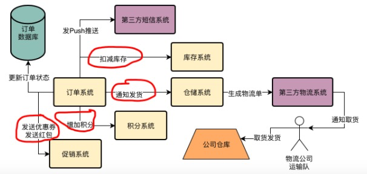

## 1.支付订单的流程


**订单系统核心架构**


日常高峰每秒2000请求，但是可能集中分布在某几个小时，系统压力不是按照平均值来算的。


## 2.订单系统细化


第8个步骤有许多事要做，可能这些步骤加起来就需要1-2s的时间。

而且对于高峰期负载压力很高的时候，如果数据库的负载较高，会导致数据库服务器的磁盘、IO、CPU的负载都很高，会导致数据库上执行的SQL语句性能有所下降。可能会导致需要几秒完成上述几个步骤。

这在用户体验上会很差。


## 5.解决系统的痛点

主要是第8步混杂的子步骤太多了。大概有以下几项：


如果要退款：


退款和支付是有同样的了流程，都是执行步骤太多，用户体验很差。

**退款的最大问题**

库存增加完了，订单状态更新了，积分收回了，优惠券收回了，仓储系统中断发货了，然后Push推送告诉你说已经退款了，结果第三方支付系统退款失败了。


用户如果提交订单未支付，库存被锁定了，需要启动一个后台线程，这个后台线程是专门扫描数据库里那些待付款的订单，如果超过一定时间，就会将订单状态改成已关闭，释放掉锁定的那些商品库存。

但是如果有几十万笔待支付的订单，如果都要去扫描，效率是很低的。


## 7.第三方客户系统的对接耦合性太高，经常出问题



上述画红圈的部分系统耦合度太高了。比如说促销系统，如果接口做了一点修改，都会牵扯你围着他转，去配合他。


有些还是跟第三方耦合的，通知发货、生成物流单。这部分性能差，不稳定。而且第三方是永远不能完全信任的。


## 9.大数据团队需要订单数据，怎么办？

比如说有100万用户来访问你的APP，积累下来的一些浏览行为、访问行为、交易行为都是各种数据，这个数据量很大，所以称为大数据。


大数据团队就是要讲搜集过来的大量数据，形成所谓的大数据，做一些用户行为报表、订单分析报表。这些都是给老板看的。


## 13.订单系统的技术痛点


## 15.消息中间件的作用

异步化提升性能、降低系统耦合、流量削峰。


## 16.技术选型

**Kafka、RabbitMQ、RocketMQ**

* Kafka 

优点：性能很高、发送消息基本都是毫秒级的性能、可用性也很高、支持集群部署，其中部分机器宕机是可以继续运行的。

缺点：1.数据丢失，kafka收到消息之后会写入一个磁盘缓冲区，并没有直接落地到物理磁盘，所以机器存在故障，可能会导致磁盘缓冲区的数据丢失。2.功能点比较单一。

一般kafka都会用在用户行为日志的采集和传输上。要求吞吐量高，但是丢失数据没关系的场景。不需要太多高级的功能。

* RabbitMQ

优点：保证数据不丢失，也能保证高可用。

缺点：吞吐量不高。每秒几万级别。

* RocketMQ

优点：综合了Kafka、RabbitMQ的优点

缺点：官方文档比较简单。


## 19.给团队分享RocketMQ的架构原理和使用方式

**RocketMQ存储海量数据：**

每台机器上部署的RocketMQ进程一般称之为Broker，每个broker都会收到不同的消息，然后就会把这批消息存储在自己本地的磁盘文件上。

本质上RocketMQ存储海量消息的机制就是分布式存储。

**高可用保障**

Broker主从架构以及多副本策略

`Master Broker`收到消息之后会同步到`Slave Broker`，如果`Master Broker`出现故障，还有一个`Slave Broker`上有一份数据副本，可以保证数据不丢失。

**数据路由**

消息发送给MQ或者从MQ里消费消息，怎么知道有哪些`Broker`？

`RocketMQ`为了解决这个问题，有一个`NameServer`的概念，也是独立部署在几台机器上的，然后所以的`Broker`都会把自己注册到`NameServer`上去。

架构原理图：


## 21.消息中间件路由中心的架构原理是什么？


每个`Broker`启动都得向所有的`NameServer`注册，避免宕机的时候`Broker`信息丢失。这种模式是`Peer-To-Peer`，跟`Eureka`类似。

**路由消息**：通过这些路由消息，每个系统就知道发送消息或获取消息去哪台`Broker`上去进行了，这起到了一个把消息路由到一个`Broker`上的效果。

注册中心是需要心跳机制的，`Broker`会每隔30s给所有的`NameServer`发送心跳，告诉每个`NameServer`自己目前还活着。

**注册中心的核心点**

```text
1.服务注册
2.服务心跳
```


## 23.Broker的主从架构原理是什么？


`Slave Broker`会从`Master Broker`中拉取消息。采用的是`Pull模式`。

**RocketMQ实现了读写分离**

选择`Master Broker`去写入，拉取消息时，可能从`Master Broker`获取，也可能从`Slave Broker`去获取。一切根据当时的情况来定。

**选举机制**

`Dledger`技术和`Raft`协议算法进行`leader`选举。

整个过程只要10秒或者几十秒完成。


## 24.Broker主从同步有没有数据不一致问题？

1.在RocketMQ4.5之前没有引入`Dledger`技术，仅仅靠之前的`Master-Slave`主从同步机制，那么在`Master`崩溃的时候可能会造成多长时间不可用？

30s`Broker`会跟`NameServer`汇报自己还活着，`NameServer`每隔10s会去检查是否有`Broker`超过120s没发送心跳。所以会最多造成`130s`不可用。


2.Kakfa如何在集群里维护多个副本？出现故障的时候能否实现自动切换？RocketMQ是如何在集群里维护多个数据副本的？出现故障的时候能否实现自动切换？RabbitMQ中怎么做的呢？

kafka中每个topic都可以有多个partition, partition的副本被称为replica，每个分区可以有多个副本，并且在副本集中会存在一个leader副本，所有的读写请求都会通过leader完成，follower复制只负责备份数据。副本会均匀分配到多台broker上，当leader节点挂掉之后，会从副本集中重新选出一个副本作为leader继续提供服务，而这种实现的是通过ZK调度完成。

**这里是选举出kafka controller，算法是：找到AR集合中第一个处于ISR集合内部的follower副本作为leader副本。**


RocketMQ通过`Dledger`技术在集群里维护多个数据副本。

rabbitmq是传统的消息队列，并未实现分布式存储，而是通过镜像模式显现真正的HA，原因是任何接受写入的broker都会将数据完全同步到其它的broker上，即每个broker上的数据完全一样，那么这个集群中只要有一个节点是alive的，那么就能继续提供服务。


3.既然有主从同步机制，那么有没有主从数据不一致的问题？Slave永远落后Master一些数据，这就是主从不一致。那么这种不一致有没有什么问题？有办法保证主从数据强制一致吗？这样做会有什么缺点？

有，如果master宕机，slave没来得及同步数据，就会造成数据丢失。

分享下Kafka、RocketMQ中对这种方案的处理：

保证数据强一致：

```text
Kafka中通过的是ack配合ISR来做的，ISR指的是所有与leader副本保持一定程度同步的副本。根据HW/LEO来决定。
生产者发送消息，将ack设置成-1，需要等ISR中的所有副本都成功写入消息之后才能够收到服务端的成功响应。属于同步复制。

RocketMQ其实也类似，也属于同步复制，要求master/slave都成功写入，master才会应答生产者success。
```

保证数据最终一致性：

```text
Kafka中设置ack=1，只要分区的leader副本成功写入消息，那么它就会收到来自服务端的成功响应。属于异步复制。

RocketMQ也属于异步复制。
```

**同步与异步的优缺点**

同步复制，可用性增加，但同时延迟增加，吞吐率下降。

异步复制，可用性降低，但低延迟、高吞吐。


## 25.设计一套高可用的消息中间件生产部署架构


**要点**：

```text
1.NameServer集群化部署，保证高可用性。采用的是Peer-to-Peer，任何一台机器都是独立运行，跟其他机器没有通信。(Kafka中使用的是Zookeeper，集群节点间是互相通信的)
2.基于Dleger的Broker主从架构部署
3.Broker跟NameServer使用TCP长连接通信。Broker每隔30s向NameServer发送心跳包，心跳包中包括BrokerId、Broker地址、Broker名称、Broker所属集群名称等。
存在多个Broker同时操作一张Broker表，为了防止并发修改Broker表导致不安全，路由注册操作引入了ReadWriteLock读写锁。允许并发读串行写。
4.MQ中的核心数据模型，topic，可以认为是一个数据集合的概念，在Broker采用的是分布式存储，其实就是分区。
5.生产者拉取路由信息将消息发送给Broker
6.消费者拉取路由消息从Broker消费消息。
```

**高可用、高并发、海量消息、可伸缩**

```text
1.注册中心、Producer、Consumer都是集群化部署，挂一台没关系
2.broker可以有选举机制实现slave到master自动切换，影响也不太大
3.数据集合topic可以分布式存储到多个partition，存储海量数据
4.broker可以伸缩，能抗更高的并发。
```

这里有两个问题需要思考：

1.`peer-to-peer`模式的优缺点

缺点就是需要每个节点保存的资源太多了，不适合形成大规模集群。

2.`Broker`与`NameServer`之间为什么使用`TCP`长连接通信？

`Broker`与`NameServer`每隔30s就要通信（心跳机制），构建长连接比较好。


## 26.中间件系统压测

```text
1.需要对部署的机器的OS内核参数进行一定的调整(linux操作系统的一些内核参数)
2.对于一些如RocketMQ、Mycat、Elasticsearch、Kafka之类的东西都是基于Java开发或者基于JVM的Scala开发(Kafka)，这里就有一个JVM进程的概念。需要关注JVM各种参数，比如内存区域的大小分配，垃圾回收器以及对应的行为参数，GC日志存放地址，OOM自动导出内存快照的配置等。
3.需要依据机器配置，合理地对中间件系统的核心参数进行调整。
```


```text
1.中间件系统要开启大量的线程
2.需要进行大量的网络通信和磁盘IO(ulimit) 
3.需要大量的使用内存

kafka里面相关的参数时：
1.num.network.threads 控制后台处理来自网络请求的线程数
num.io.threads 控制broker实际处理网络请求的线程数，默认是8，即kafka创建8个线程，采用轮询的方式监听发过来的网络请求并进行实时处理。

2.文件描述符限制：ulimit -n 100000 这种一般都设置成ulimit -mn 65535
```


## 35.梳理消息中间件集群生产部署架构规划


## 37.基于MQ实现订单系统的核心流程异步化改造，性能优化完成

完成一个订单后，都需要执行一系列的动作：

```text
更新订单状态
扣减库存
增加积分
发优惠券
发短信
通知发货
```

动作太多，其实实际只要的效果是：在用户支付完毕后，只要执行最核心的更新订单状态以及扣减库存就可以了，保证速度足够快。


积分、营销、仓储系统等都会自己从`RocketMQ`里去获取订单支付消息执行自己要处理的业务逻辑，不会再影响订单核心链路的性能。


## 39.基于MQ实现订单系统的第三方系统异步对接改造，解耦架构完成

MQ里面三种发送消息的方式

```java
// 同步方式
public class RocketMQProducer {
    // RocketMQ生产者类，用这个可以发送消息到RocketMQ
    private static DefaultMQProducer producer;
    
    static {
        // 构建一个Producer实例对象
        producer = new DefaultProducer("order_producer_group");
        // 设置NameServer地址，让他拉取路由信息
        producer.setNamesrvAddr("localhost:9876");
        // 启动一个Producer
        producer.start();
    }
 
    
    public static void send(String topic,String message) throws Exception {
        // 构建一条消息对象
        Message msg = new Message(topic,"",message.getBytes(RemotingHelper.DEFAULT_CHARSET));
        // 利用Producer发送消息
        SenderResult sendResult = producer.send(msg);
        System.out.println("%s%n",sendResult);
    }
}
    // 直接send方法是同步方式 对应kafka中的acks=1

    // 异步方式 对应kafka中的acks=-1
    // 设置异步发送失败的时候重试次数为0
    producer.setRetryTimesWhenSendAsyncFailed(0);

    // 发送消息代码需要改成：
    producer.send(message,new SendCallback()) {
        @override
        public void onSuccess(SendResult sendResult) {

        }

        @override
        public void onException(Throwable e) {

        }
};

// 发送单向消息，就是发送一个消息给MQ，代码就接着往下走了，根本不会去关注MQ有没有返回结果给你。
// 对应kafka中acks=0
```


## 41.基于MQ实现订单数据同步给大数据团队，应该如何设计？

订单信息都会去操作mysql，执行insert、update和delete语句。

可以使用canel将mysql中的binlog文件发给MQ，供大数据团队使用。


## 42.秒杀系统设计


**要点**

```text
1.页面数据静态化
提前从数据路把秒杀页面需要的数据都提取出来组装成一份静态数据放在别的地方，避免每次访问都要访问后端数据库。

2.多级缓存
CDN+Nginx+Redis
从距离用户最近的CDN拉取静态化数据，这是第一级缓存
如果CDN没有，用户就会发送请求到Nginx上请求加载商品数据，Nginx可以通过Lua脚本实现本地缓存，但是万一Nginx上的缓存数据过期之类的，导致没有我们需要的数据,此时可以通过Nginx的lua脚本直接把请求发送给Redis
如果Redis里面没有，需要从数据库中获取。
```


## 45.基于MQ实现秒杀订单系统的异步化架构以及精准扣减库存的技术方案


**要点**

```text
1.在前端/客户端设置秒杀答题，错开大量人下单的时间，组织作弊器刷单
2.独立出来一套秒杀系统，专门负责处理秒杀请求
3.优先基于Redis进行高并发的库存扣减，一旦库存扣完则秒杀结束
4.秒杀结束之后，Nginx层过滤掉无效的请求，大幅度削减转发到后端的流量
(可以在Zookeeper中写入一个秒杀完毕的标志位，然后ZK会反向通知Nginx中我们自己写的Lua脚本，通过Lua脚本后续在请求过来的时候直接过滤掉)
5.瞬间生产的大量下单请求直接进入RocketMQ进行削峰，订单系统慢慢拉取消息完成下单操作。
```


## 47.全面引入MQ的订单系统架构


## 49.深入研究一下生产者到底如何发送消息的？

`RocketMQ`中创建`Topic`的时候需要指定一个很关键的参数，就是`MesssageQueue`。

本质就是一个数据分片的机制。


`MQ`如果`Master Broker`挂了，此时正在等待的其他`Slave Broker`自动热切换为`Master Broker`。

但是如果还按照之前的策略将数据均匀写入到各个`Broker`上的`MessageQueue`，那么会导致在一段时间内这个挂掉的`Master Broker`都会访问失败。

此时可以设置一个`sendLatencyFaultEnable`，设置一定时间内不要访问这个`Broker`。

以上模式是普通集群模式，消息的本体只存在于一个`broker`上，元数据会存在每个`broker`上，这种情况有单点问题。另外一种模式：镜像集群模式，每条消息在每个`broker`上都有，即每个`broker`有全量消息，这种情况虽然没有单点问题，但是不能水平扩展（`queue`数据可能很多）。

**普通集群模式**


```text
优点：多个消费者可以连接不同的实例，提高吞吐量。
缺点：
1）rabbitMQ节点之间，存在大量的数据传输。
2）queue只在一个实例上，存在性能瓶颈，而且queue所在实例宕机的话，数据可能会丢。
如果开启了消息持久化（硬盘存储），需要等这个实例恢复了，才能继续消费
```

**镜像集群模式**


```text
优点：任意节点宕机，其他节点都可以提供服务。 ‐> 高可用
缺点：
1）性能开销太大，queue的消息需要同步到所有的机器
2）没法扩展。如果queue负载重，新加的机器也会包含这个queue的所有数据，没办法线性扩展queue。
```


针对`Kafka`中`Partition`的说明，`Partition`分为`leader`副本、`follower`副本。

```text
1.一般leader副本负责读写，follower副本负责同步消息(kafka中采用的是主读主写)
2.如果leader副本宕机，会从follower副本中选举一个，但是这样会导致集群的负载不均衡，从而影响整体的健壮性和稳定性。
3.为了有效地治理负载失衡的情况，kafka中引入了优先副本的概念(preferred replica)，优先副本指在AR集合列表中的第一个副本。
```

**总结**

```text
1.RocketMQ 创建topic时需要指定一个关键参数：MessageQueue(队列)
2.MessageQueue放在不同Broker上，实现分布式存储
3.生产者写消息，先从NameServer中获取一个topic有几个MessageQueue，那些MessageQUeue在哪台Broker上。
4.如果某台Broker出现故障，比如说Master Broker挂了，其他Slave Master自动热切换为Master Broker
5.Master Broker挂掉之后，Producer写入这台Broker失败，一直失败，可以在Producer中设置一个参数：
sendLatencyFaultEnable，自动容错机制。如果一个Broker故障，自动回避一段时间访问这个Broker，过段时间再访问。
```


## 51.深入研究一下Broker是如何持久化存储消息的？

**Broker数据存储实际上是一个MQ最核心的环节**

```text
1.决定了生产者消息写入的吞吐量
2.决定了消息不能丢失
3.决定了消费者获取消息的吞吐量
```

1.`CommitLog`消息顺序写入机制

将消息直接写入磁盘上的一个日志文件：`CommitLog`，直接顺序写入这个文件。


`CommitLog`有很多磁盘文件，每个文件限定最多`1GB`。

2.`MessageQueue`在数据存储中是体现在哪里？

`Broker`中，对`Topic`下的每个`MessageQueue`都会有一系列的`ConsumeQueue`文件。

即：在`Broker`磁盘上会有下面这种格式的一系列文件：

```text
$HOME/store/consumerqueue/{topic}/{queueId}/{fileName}
```

对存储在这台`Broker`机器上的`Topic`下的一个`MessageQueue`，有很多`ConsumerQueue`文件，这个`ConsumerQueue`文件里存储的是一条消息对应在`CommitLog`文件中的`offset`偏移量。

`ConsumerQueue`中存储的每条数据不只是消息在`CommitLog`中的`offset`偏移量，还包含了消息的长度，以及`tag hashcode`，一条数据是20个字节，每个`ConsumerQueue`文件保存30万条数据，大概每个文件是`5.72MB`。

`Topic`的每个`MessageQueue`都对应了`Broker`机器上的多个`ConsumerQueue`文件。


高吞吐写入：

基于`CommitLog`顺序写+`OS Cache`+异步刷盘的高吞吐消息写入机制。这个与`Kafka`其实是一致的。

**同步刷盘和异步刷盘**

同步刷盘就是要等成功写入磁盘才返回`ACK`消息。

异步刷盘是消息写入`OS PageCache`，就直接返回`ACK`给生产者。


## 53.基于DLedger技术的Broker主从同步原理到底是什么？


```text
1.producer写入消息到broker之后，broker会将消息写入本地CommitLog磁盘文件里去，然后还有一些ConsumerQueue会存储Topic下各个MessageQueue的消息的物理位置

2.要让broker实现高可用，必须有一个broker组，里面有一个lead broker可以写入数据，然后将数据同步给其他follower broker
```

1.基于Dledger技术替换Broker的CommitLog


需要使用`Dledger`技术来实现`Broker`高可用架构，实际上就是用`Dledger`先替换掉原来`Broker`自己管理的`CommitLog`，由`Dledger`来管理`CommitLog`。

2.基于Raft协议选举Leader Broker

```text
1.3台broker机器启动的时候，都会投票给自己作为leader，然后把这个投票发送给其他broker
2.第一轮失败，接着每台机器会进入一个随机事件的休眠，比如说broker01 3s，broker02 5s，broker03 4s
3.broker01先苏醒，直接投给自己然后发送自己的选票给别人
4.broker03苏醒，收到broker01投给自己的通知，由于他自己没投票也会直接把票投给broker01
5.broker02苏醒，得知broker01、broker03都将选票投给了broker01，他也会直接投给broker01
所以broker01当选为leader
只要：机器数/2+1投票给某个人，就会选举他当leader。大多数。
```

3.Dledger基于Raft协议进行多副本同步

`uncommitted`和`committed`阶段

```text
1.leader broker的Dledger收到一条数据之后，会标记为uncommitted状态
2.然后他会把自己的DledgerServer组件把这个uncommitted数据发送给follow broker的DledgerServer
3.follow broker的DledgerServer收到一个uncommitted消息之后，必须返回一个ack给Leader Broker的DledgerServer
4.leader broker收到超过半数的followe broker返回ack之后，就会将消息标记为committed状态
5.leader broker上的DledgerServer就会发送committed消息给follower broker机器的DledgerServer，让他们也把消息标记为committed状态。
```


如果`leader broker`崩溃，则基于`Dledger`和`Raft`协议重新选举`Leader`。


## 55.深入研究一下消费者是如何获取消息处理以及进行ACK的？

单播和广播

```text
单播
一般消费者组内只有一个消费者能消费这条消息
当然也可以设置：consumer.setMessageModel(MessageModel.BROADCASTING);使组内每台机器都可以获取这条消息

广播
一个topic可以被多个消费者组订阅
```

**MessageQueue、CommitLog、ConsumerQueue**

```text
MessageQueue: Topic的分区，类似于Kafka中的Partition
ConsumerQueue: 逻辑消息队列，主要存储commitlog offset，消息长度，tag的hashcode
CommitLog: 整个消息队列的存储核心
```


**consumerqueue消息结构**


**Push模式 vs Pull模式**

本质上都是消费者机器主动发送请求到`Broker`机器去拉取一批消息。

不过`Push`模式会让`Broker`尽可能实时的把新消息交给消费者机器来进行处理，消息实效性会更好一些。

使用`RocketMQ`一般都是基于`Push`模式来做的：

```text
           --拉取-->              
消费者      <--有消息立马返回一批--    broker
           --接着拉取下一批-->
```

`Push`有请求挂起和长轮询机制：

```text
请求挂起
没消息会把请求线程挂起，默认是挂起15秒
长轮询
在挂起期间会有后台线程每隔一会儿就去检查一下是否有新的消息给你
```

**消费者机器如何处理消息、进行ACK以及提交消费进度？**

消费者机器拉取到一批消息之后，就会将这批消息回调我们注册的一个函数，如下：

```java
consumer.registerMessageListener(new MessageListenerConcurrently(){
    @override
    public ConsumerConcurrentlyStatus consumerMessgae {
        List<MessageExt> msgs,ConsumerConcurrentlyContext context) {
            //处理消息 标记该消息已经被成功消费
            return ConsumerConcurrentlyStatus.CONSUMER_SUCCESS;
        }
    }
})
```

处理完这批消息之后，消费者机器就会提交我们目前的一个消费进度到`Broker`上去，然后`Broker`就会存储我们的消费进度。

