## 1.如何设计一个消息中间件

核心要点：高可用、高并发、海量消息、可伸缩

```text
1.注册中心
需要保存broker节点信息，方便请求路由到可用broker上

2.分布式，扩展性强
broker ‐> topic ‐> partition
每个partition存一部分数据。资源不足时增加broker或增加partition

3.数据不丢失
数据要落盘持久化，写入磁盘采用顺序写。（没有磁盘随机写的寻址开销）

4.高可用
master ‐> follower机制，follower从master拉取数据进行同步。master挂了，重新选举leader，继续对外服务。
follower存的都是master的副本数据，不会因为单点故障导致数据丢失。
ISR机制
```


对照`kafka`

```text
1.注册中心zookeeper，里面注册了kafka的broker节点信息
2.选举
1）控制器的选举，选举一个broker称为控制器(Kafka Controller)，它负责管理整个集群中所有分区和副本的状态等工作。选举leader副本、ISR集合发生变化，由控制器负责所有broker更新其元数据信息。
2）分区leader的选举，由控制器执行，按照AR集合中副本的顺序查找第一个存活的副本，并且这个副本在ISR集合中。
3）消费者相关的选举，组协调器GroupCoordinator需要为消费组内的消费者选举出一个消费组的leader，算法：
如果没有，就用第一个加入消费组的消费者作为leader，如果leader宕机，随机找一个
3.topic分成多个partition
这样可以横跨多个broker，提高并发能力。同时数据存储，用的是磁盘存储，但是用了页缓存和顺序读写。
4.broker可以伸缩
一般就是加机器，把broker信息注册进zookeeper中即可。
注意：zookeeper里面的broker信息只有主节点有。
```


## 2.如何设计一个搜索引擎

解决的痛点：

```text1.自动维护数据的分布到多个节点的索引的建立，还有搜索请求分不到多个节点执行。
1.自动维护数据的分布到多个节点的索引的建立，还有搜索请求分不到多个节点执行。
2.自动维护数据的冗余副本，保证说一些机器宕机，数据不丢失。
3.封装了更高级的功能，可以更快速的开发应用。
```

核心要点：高可用、海量存储、极致搜索性能、可伸缩

```text
1.高可用
多副本，master选举
2.海量存储
多shard，分配到多台机器
filecache disk 
3.极致搜索性能
分词倒排索引(以字段（term）为key，文档为value，由属性值来确定记录的位置的结构。)
快速找到term，可能需要借鉴B树这种的二分查找方案，term过多的话，需要引入包含同样前缀的term index。
尽量多使用内存，有些数据可以提前预热。
4.可伸缩
在同一集群加机器，数据迁移，shard重分配，会造成一段时间集群不可用，但是问题不大。
```


## 3.如何设计一个日志采集器

核心要点：日志位置、探测器、收割进程、文件offset

```text
1.日志位置
如果日志集中收集的话，可以使用单节点集中日志采集
如果日志没有集中收集的话，服务器上都得部署日志采集器
2.探测器(prospectors)
检测指定的日志目录或文件
3.收割进程(harvester)
每个收割进程读取一个日志文件的新内容，需要平衡这个进程的持续时间，如果日志太久没更新，释放掉这个进程
4.文件offset
扫描到的文件offset需要存盘，避免数据丢失，可以保证at lease once,下游再去做幂等。
```


## 4.设计一个分布式链路方案

提高故障定位速度、各个调用环节的性能分析、数据分析、生成服务调用拓扑图。

参考阿里的`EagleEye`系统

要点：全局唯一的`traceId`、不同服务之间的继承关系、数据的妥善保存、采样及日志优化、收集方案、怎么展示

```text
1.生成全局的traceId
要么前端来生成，要么后端在请求进入之前拦截生成，如果是自发式服务，在发请求之前也得生成
需要保证这个traceId的全局唯一，简单做法就是uuid，很多公司可能用雪花算法:
64bit: 1bit(不用)-41bit(时间戳)-10bit(工作机器id)-12bit(序列号)，生成的Id按时间趋势递增，整个分布式系统内不会产生重复id(因为有datacenterID和workerId)

2.不同服务之间的继承关系
上一级的spanId作为下一级的parentSpanId

3.数据保存在哪
Java保存在可继承的ThreadLocal里面，但是需要注意这个ThreadLocal可能无法被释放掉。
Python用的flask框架里的g变量，这个是放到appcontext对象里面的，对象会放到flask的local对象(其实类似Java的threadlocal)，请求返回给用户之前，将当前请求的两个对象清除。异步的时候主动将父请求的appcontext推给子请求。用的是装饰器。

4.采样
打日志收集会引入不必要的特性，带来更多的性能损耗。
一般会做日志异步写入。用python的celery自己做一个队列，让其异步写入。

目前这一块还没做。同时还需要控制每秒写日志的IO次数。
采样的话，调整采样率，用的比较简单random()与设置的采样率比大小。

5.收集
目前是用kafka+structured streaming+elasticsearch
阿里存的是hbase，项目升级的话要做这一块
6.展示
需要将分析后的dependencies用前端页面展示出来，目前还没做。
```


**Kafka与RocketMQ的异同点**

相同点：

```text
1.QPS能10万级别，时效性好，都是分布式架构
2.为了追求性能都做了一些优化：
1）顺序读写
2）引入操作系统页缓存
3）引入零拷贝技术，不过Kafka用的是sendfile，RocketMQ用的是mmap技术
3.单topic分区有序
```

不同点：

```text
1.存储方式
Kafka采用partition，每个topic的每个partition对应一个文件。顺序写入，定时刷盘。但一旦单个broker的partition过多，则顺序写将退化为随机写，Page Cache脏页过多，频繁触发缺页中断，性能大幅下降。

RocketMQ采用CommitLog+ConsumeQueue，单个broker所有topic在CommitLog中顺序写，Page Cache只需保持最新的页面即可。同时每个topic下的每个queue都有一个对应的ConsumeQueue文件作为索引。ConsumeQueue占用Page Cache极少，刷盘影响较小。

2.服务发现
Kafka依靠的是Zookeeper
RocketMQ有自己的NameServer

3.高可用
Kafka控制高可用的粒度是放在分区上。每个topic的leader分区和replica分区都可以在所有broker上负载均衡的存储
RocketMQ在高可用设计上粒度只控制在Broker。其保证高可用是通过master-slave主从复制来解决的。

Kafka的这种设计相比RocketMQ这种主从复制的设计有以下好处：
1）Kafka中不需要设置从broker，所有的broker都可以收发消息。负载均衡也做的更好。
2）Kafka的分区选举是自动做的，RocketMQ需要自己指定主从关系。
3）Kafka分区的复制份数指定为N，则可以容忍N-1个节点的故障。发生故障只需要分区leader选举下即可，效率很高。

4.延时队列 & 死信队列
RocketMQ 默认支持
Kafka需要第三方扩展开发
```


## 5.按照STAR模型分析自己的简历

STAR法是情境(situation)、任务(task)、行动(action)、结果(result)四项的缩写

 Situation: 事情是在什么情况下发生。
 Task: 你是如何明确你的任务的。
 Action: 针对这样的情况分析，你采用了什么行动方式。
 Result: 结果怎样，在这样的情况下你学习到了什么。


### 5.1 埋点系统

**埋点的价值**

BI和AI体系的重要一环，提升产品工程质量、实施AB test、个性化推荐服务重要的数据来源。

```text
当时做一些服务数据的转存，发现有些服务在自己mysql库下面建了相关的埋点数据表，数据累计很大，但是后续由于人员变动，没人处理，导致mysql数据库出现慢查询。

1.工程质量
算法错别字推荐
内部跟老司机平台合作，智能生成汽车文章，文章编辑器中算法会推荐一些错别字给编辑，编辑会根据逻辑、语句是否通顺、符号格式等指标选择是否采纳算法推荐的错别字信息，将这种用户事件采用埋点的形式收集起来，帮助算法迭代和优化。

2.AB test
目前还没有相关的场景，但是如果将流量切分，同时运行多个版本实验对比，可以指定一些统计指标判断一些逻辑架构、代码优化是否合适。 
```

**怎么明确任务？**

```text
1.结合公司情况：主要是内部开发服务较多，对外提供的服务较少，目前埋点需求比较强烈的是后端、算法服务。
因此主要场景是后端埋点。

2.定位是一个基础服务，应当尽量做到对需要埋点的服务代码侵入小

3.参与的人数可能会有：产品经理、数据工程师、前后端开发、算法工程师，如何沟通需求。

4.数据带来价值，怎么才能发挥数据最大的价值
```

**怎么做的**

```text
1.调研埋点类型，市面上比较主流的埋点产品是怎么做的？
埋点技术：代码埋点，前端埋点(可视化埋点)
比较主流的：国外的Mixpanel，国内的友盟，神策、growingIO
试用了相关的sdk
发现在埋点系统的设计上都是类似的，首先是全局唯一的Token，避免埋点数据互相污染(可以用不同namespace下的project名来处理)，再就是这次埋点事件的内容：Who/When/How/Where/What。

2.调研了主流的埋点系统，有没有自己做的价值。
其实埋点系统发送数据部分不是特别复杂的，主流的sdk，也基本是按照埋点规范去将数据发送给指定数据库进行存储。
这部分完全可以自己做。

后续的就是发送数据给谁，怎么实时收集、离线要不要存储。怎么分析数据才能发挥数据最大的价值。

3.因为一个埋点需求参与人数众多，怎么去沟通协调才能带来最大效率？直接用excel去做行不行？
怎么去规范埋点字段的field，怎么保证一个大型的服务中埋点事件不会重复，埋点需求信息怎么存档？

考虑到埋点设计规范、流程高效的话需要建立一个埋点数据管理平台，在平台上设计、审核相关埋点数据及需求。也要将相关信息存档，便于后续own相关埋点事件。
上述的需求都可以在这部分来做。同时这个平台结合内部需求还有的作用是内部开发了基于各种数据库数据查看平台，但创建mongodb collection需要在平台注册才能用相关的sql去查询，所以这一块注册的工作也要在评审通过后注册相关表格。

4.怎么对后端代码侵入最小？
需要开发一个相关的sdk，让用户在创建了针对本次服务全局唯一的埋点实例后，在需要的地方调用相关trace方法，将希望收集的数据发送出去。

5.数据发送给谁？怎么保证数据不丢失？
一开始的版本是数据直写mongodb，保证性能做了batch，如果batch在凌晨还没刷入数据的话，需要服务启动后台线程将batch数据强行刷入mongodb中。这种埋点数据只能保证近实时，对于一些没什么数据的服务，batch可能一直没满，导致数据准确度下降。而且服务一旦宕机，保存在内存中的数据就会丢失。还有就是后端服务和mongodb高度耦合，一旦mongdb出现问题，不好处理。

因此选在将数据异步发送给kafka。kafka在broker不宕机的情况下是能保证数据准确性的，需要权衡同步、异步写入对业务的影响，同步慢但是能保证数据一致性，异步快，但是数据一致性不能保证。这里还是选择异步。
为什么选择kafka不选择rocketmq?
公司kafka运维的比较成熟，相关监控也比较完善，rocketmq的话一般生产服务用的比较多。这里避免做一些干扰。

6.kafka数据怎么分发给下游？
采用kafka-connect方式将数据写入mongodb，为了保证数据准确性，在配置中设置了死信队列，保存一些达到重试次数或超时未写入或者本身就不是json的脏数据到死信队列里面，去监控该topic的offset lag，设置报警，达到阈值就需要去处理。
数据还t+1离线写入hive，存档，也便于后续查看。

7.数据存入数据库后，怎么去发挥最大价值？
现在的做法是让用户自己去调相关数据分析，如果用户做不了的话，我会去帮助做一些处理。
```

**kafka数据可靠性**

```text
Producer acks设置成acks=-1（all），分区leader副本、follower副本都成功写入消息即返回响应，如果消息无法写入则重试3次。之后再失效打印日志。

Kafka中防止数据丢失采用的是ISR，所有与leader副本保持一定程度同步的集合，是一种在完全同步复制和异步复制之间的权衡，也权衡了数据可靠性和性能。
ISR 配合HW/LEO机制可以有效避免数据丢失。
```

**保证数据不丢失&不重复**

```text
不丢失按照上面的操作+kafka中的死信队列应该可以避免

不重复：
sdk里面构造一个基于project_namespace_event-name_timestamp的uuid 字段，用户在获取数据的时候针对这个字段做唯一索引
db.users.ensureIndex({age:1})

```

**mongodb数据类型**

```text
Object ID:doc 自生成的_id
String:字符串
Boolean:布尔值
Integer:整数
Double:浮点数
Arrays:数组或列表
Object:字典
Null:空数据类型
Timestamp:时间戳
Date:存储当前日期或时间unix格式
```


**学到了什么东西？**

```text
1.规范大于编码，一开始就明确了规范，提供不同部门沟通协作的平台，相关文档也上传上去，减少沟通成本，规范设计，开发。
2.数据怎样发挥最大价值？
这一块其实处理的不够好，本身数据中台应该是能给其他部门提供数据服务的，减少他们处理数据的成本。所以需要一个通用平台让用户去查看，编写简单的sql获得自己想要的结果，这一块还处理的不够好。
```


### 5.2 日志采集系统

**项目价值**

用户快速查看日志方便debug、用户需要发掘日志更深层次的价值：请求日志监控、日志前端页面展示、日志信息梳理、分布式链路追踪的`trace_id`，让用户可以串起来全链路，便于debug。

**怎么明确任务**

```text
1.基础框架选型，用elk框架还是阿里云的sls。
1）性能：差不多
2）用户支持：考虑后端有的会调日志系统的接口，将日志回显给前端页面，这一块es可以直接吊api，阿里云sls更看重安全性，会给请求加上带时间戳的hmac-sha1加密字段，裸调api难度比较大。
3）明确一开始数据要双写：一份进es一份进hdfs。这里用logstash的output插件支持会比较好。
4）权限管理：es支持ldap接入，可以每人一个账号，方便管理。阿里云sls的话需要公用子账号。
5）价格：当时es采用的是3节点，价格大概是sls的2倍，但不算太贵。经过上面的考虑选用了elk。

选用elk之后也还有讲究，世面上比较多的做法是logstash即做收集又做解析。考虑后续logstash解析逻辑会比较复杂。而且发现了elastic公司推荐用filebeat做收集，这是一个go写的日志采集器，比jvm运行的logstash要轻不少，内存消耗小。

没有在中间加kafka，一开始我提供的架构是有kafka的，但是老大考虑当时的数据量，没有削峰的意义（es当时测得极限写入qps可以达到20000/s，当时数据平均qps大概在3000/s），这里其实有一个疏忽，后面服务大规模压测，把es打爆了好几次。
而且觉得我一个人负责这么多技术组件的话难度比较大。

2.需要有一套统计的日志格式规范，让大家按规范打日志，便于解析。

3.需要提供给用户一些可自定义的功能，比如说需要在日志里保存一些自己的字段。
```

**怎么做的**

```text
1.规范先行
先明确对于一般日志debug需要保留的字段有哪些，怎么对用户代码侵入较小。这时候就需要一个统一的sdk来做。

2.如何满足用户多样的需求？
日志产生之前的工作都需要在日志sdk来处理。
1.一开始python logging模块服务日志跟请求日志是混合在一起的，没办法区分开。所以第一步就是魔改了python部分代码，让服务日志、请求日志都能单独打印到nas上，用不同名存储，也方便后续解析。
2.支持用户自定义设置日志级别，不同环境下切换日志打印方式
3.支持用户自定义字段，要确定好放置位置
4.支持分布式链路，从headers中获取request-id，占位搜索。

3.服务部署上去，怎么解决可能存在的日志丢失、日志重复消费问题？
日志丢失：filebeat采用的是通配符匹配，不会出现日志文件未被检索的情况。
同时采用的是at least once架构，先发数据后将消费到的offset保存在磁盘注册文件中，一般不会出现日志没有被消费到。
logstash一开始没有将发送给的event持久化，日志是保存在内存中的，一旦服务重启，会导致日志丢失。这一块我针对日志做了一个持久化，将相关待发送给es的page保存在磁盘中。

日志重复消费：上面说到日志收集是at least once架构，这样的话可能会造成重复消费，我采用的是幂等
在logstash中用service名、offset、timestamp进行拼接，生成一个md5值，这个值作为这条日志文件的doc_id，es中要保证doc_id要全局唯一，用这种消费端幂等的方式解决重复消费的问题。

4.服务监控
除了filebeat logstash部署在k8s上有cpu、内存监控，es有控制面板监控之外。对于消息是否滞后、消息如果写入es失败，这部分怎么处理都是问题，所以对待写入es的queue做了持久化、对发送失败的queue也要保存下来，后续如果有需求可以消费这部分数据。
queue持久化，自己创建了一个服务监听相关文件夹，统计queue的个数，将数据上报给prometheus，最后是在grafana上设置监控。

5.服务回滚
如果es索引被删除了，如何快速回滚。一般索引是按天建的，单起一套服务针对某天数据进行筛选，可以实现快速回滚。

6.遇到的问题
除了上面filebeat logstash的问题，最主要的是问题都处在es这一块。
1.用户需要用请求日志做监控，一开始mapping字段类型不合适，需要重新创建mapping类型并reindex.
2.有些日志很大，这种document存入es会消耗大量cpu、内存。我做的首先是针对message字段禁用索引，然后会起一个服务统计每天出现大日志的服务，将报表提供给相关人员，如果没有必要打印就改代码。
3.shard分配的问题
一开始所有服务都按天建索引，很快es中shard就增加到很多，消耗大量资源，导致es写入变慢，出现日志延迟。除了机器扩容外，还要建立白名单机制，新建索引或者每月索引doc数量不大的服务都将其并到一个索引里面。这个白名单是每月去进行评估的

日志sdk出现的问题：
1.一开始用户每自定义增加一个字段都会去调用patch_log_field方法，而python logging模块只支持查找3层的堆栈信息，如果多次调用patch_log_field方法，就会找不到用户打印日志的module、lineno信息，导致用户查找相关信息比较困难。
基于python万物皆对象的理念，将需要patch的函数先统一放在一个数组里面，统一去执行相关的patch(即拼接操作)。

2.循环调用
某个服务引入了这个sdk，服务又引入了另外的工具包，工具包也引入了sdk，导致循环引用。解决方案是使用threadlocal 引入一个tag，支持仅一次调用。
```

**es出现的问题及优化方案**

1.SSD存储
SSD会比机械硬盘查询快5-10倍

2.给JVM配置一半内存，不超过16G
ES非常依赖文件系统缓存（Filesystem Cache），快速搜索。一般来说，应该至少确保物理上有一半的可用内存分配到文件系统缓存。

3.禁用不需要的功能

```text
聚合：doc_values: false 正排索引 
搜索：index: false 倒排索引
评分：norms: false
近似匹配：index_options(freqs)
```

4.控制分片和副本数在合理值。

一般单节点shard数控制在1000以内。
因为内部是日志系统是按服务建索引。后期给logstash设置白名单。日志量大的服务单独建索引，剩下的会放一起。

5.减少映射字段，精确匹配的采用keyword类型。
避免分词。

6.提高refresh间隔。
`index.refresh_interval: 30s`

7.提高translog.sync_interval时长
`"translog": { "sync_interval": "15s" }`
控制数据从内存到硬盘的操作频率，以减少硬盘IO。

8.定期关闭旧索引
`http://${ip}:9200/${index_name}/_close`

9.避免超大的document

超大的document 会消耗大量内存、cpu，可能是document的几倍。

我采取的策略：

```text
1.避免对message分词索引
2.统计es内部单条document的大小，做成报表，每天输出到后端开发群，催促整改。 
```

生产es出现类似的bug：

```text
算法爬取百度百科的相关介绍保存到es中，document太大，没做过滤筛选，导致es负载过高。
```

`elasticsearch`出现`Full GC`

```text
1.某天用es查询，发现无法响应，查看gc日志，发现确实存在Full GC
2.先看下这个search，看了下也没有复杂的处理逻辑，就是一个简单的term search应该没问题。
3.排查query/filter/aggs 觉得问题应该出现在aggs
4.通过es面板监控找到search rate前几名的index，去询问，发现可以的dsl
没有按时间分索引，有针对较大字段的聚合取top10，由于数据量较大，可能在某次查询时节点内存被大量使用，触发Full GC。

当时采取的措施：
1）推荐用户按照天区分索引，多次查询；
2）尽量避免出现Full GC，适当调大了Survivor区；
3）考虑内部16G堆内存，5G左右的老年代已经足够大了，不好调节-XX:CMSInitiatingOccupancyFraction的默认值；
4）为了防止后续可能出现的Full GC，对日志系统的大字段message禁止了doc_values，防止用户误操作出现大规模聚合。
5）其实对于大内存可以用G1来代替CMS，但是这个对系统改动比较大，老大未采纳。
```


### 5.3 如何设计百亿级日志系统

```text
1.日志接入格式统一
2.加kafka做缓冲，实现数据解耦、削峰
3.当流量突然增加，ES 会有 bulk request rejected 的日志重新写入 Kakfa，等待补偿。
4.冷热数据区分。
```


## 6.设计一个分布式微服务架构

**微服务架构的好处**

```text
1.简单、灵活独立部署
2.专注、专业高效、可靠小团队
3.松耦合、高内聚、易扩展
4.语言、工具无关
```

**微服务应用4个设计原则**

* AKF拆分原则

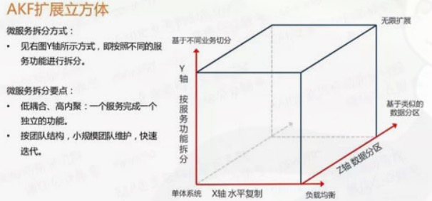

```text
1.X轴：水平复制，单体系统多运行几个实例，做个集群负载均衡的模式。
2.Z轴：数据分区，建多个CDN集群
3.Y轴：微服务拆分，基于不同业务拆分
```

* 前后端分离
* 无状态服务

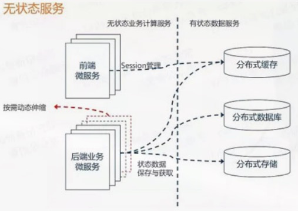

业务服务不要保存数据，让其变成一个无状态的计算节点。让缓存都迁移至分布式缓存中存储。

* Restful通信风格（无状态通信原则）

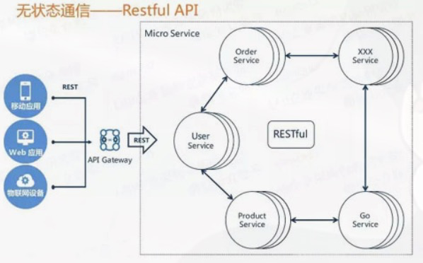

`Restful`通信风格优点：

```text
1.无状态协议HTTP，具备先天优势，扩展能力强
2.JSON报文序列化，轻量简单，人与机器可读，学习成本低，搜索引擎友好
3.语言无关
注：有些场景可能需要thrift/grpc等协议
```

**微服务存在的问题**

```text
1.依赖服务变更很难追踪，api文档变更过期怎么协调：文档管理、服务治理、服务模拟。
2.部分模块重复构建：统一认证、统一配置
3.放大了分布式架构的系列问题：分布式事务问题，依赖服务不稳定怎么办？
采用全局事务方案，采用异步模拟同步
4.运维复杂度陡增：搭建持续集成平台，统一监控平台。
```

**微服务平台的19个落地实践**

* 1.基础环境

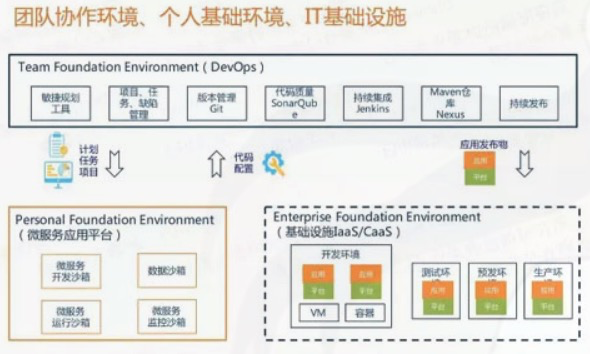

```text
1.团队协作环境
主要是Devops领域的范畴，负责从哪个需求到计划任务，再到质量管理，持续集成和发布
2.个人基础环境
微服务应用平台，目标是要支撑微服务应用的设计开发模式，运行期的业务数据处理和应用的管理监控
3.IT基础设施
各种运行环境支撑如IaaS(VM虚拟化)和Caas(容器虚拟化)等实现方式。
```

* 2.微服务应用平台总体架构

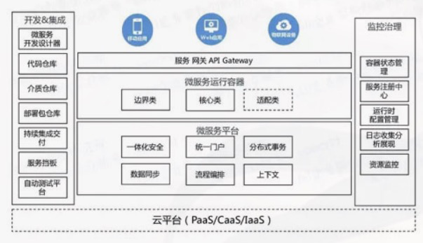

* 开发集成：工具、仓库
* 运行时：要有微服务平台来提供一些基础能力和分布式的支撑能力，我们的微服务运行容器则会运行在这个平台之上。
* 监控治理：服务监控、配置的能力
* 服务网关：负责与前端的WEB应用 移动APP等渠道继承==集成，对前端请求进行认真鉴权，然后路由转发。


* 3.微服务应用平台的运行视图

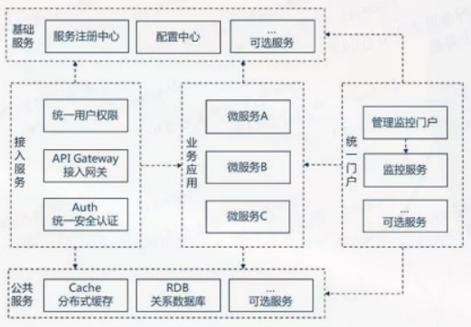

```text
1.基础服务
服务注册中心、配置中心等
2.接入服务
统一用户权限、API Gateway接入网关、Auth统一安全认证等
3.业务应用
4.统一门户
管理监控门户、监控服务
5.公共服务
缓存、数据库等
```


* 4.微服务平台的设计目标

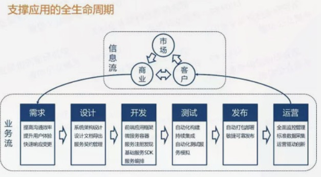


* 5.微服务开发：前端、后端、混合
* 6.服务契约与API管理

其实就是统一的`Restful`风格的`API`

* 7.服务契约与服务模拟
* 8.服务契约与服务编排

采用简单图形化的方式来对业务服务流程进行编排。

* 9.微服务容器

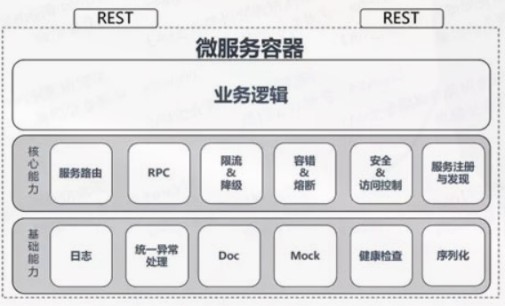

需要有统一的微服务容器（`SpringCloud`）和一些公共的基础服务。


* 10.三方能力集成说明

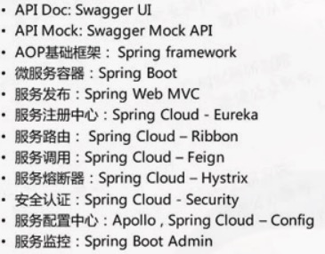

补充：

```text
1.服务注册中心
Eureka/Zookeeper/Consul/Nacos
2.服务调用
Ribbon/OpenFeign
3.服务降级
Hystrix/Sentinel
4.服务网关
Zuul/GateWay
5.服务配置
Config/Nacos
6.服务主线
Bus/Config
7.事务
Seata
```


* 11.服务注册发现路由

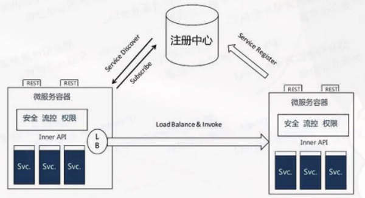

以`Eureka`为例，服务在启动的时候，会将自己要发布的服务注册到服务注册中心。调用接口从这里面来取。

拿到地址，通过微服务容器内部的简单负载均衡进行路由用。


* 12.统一认证鉴权

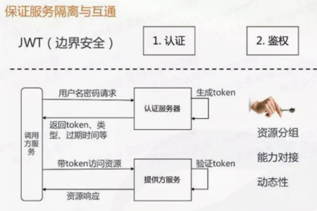

使用基于`Spring Security`结合`Auth2`再加上`JWT(Json Web token)`做安全令牌，实现统一的安全认证与鉴权。使得微服务之间能够按需隔离和安全互通。


* 13.日志与流水设计

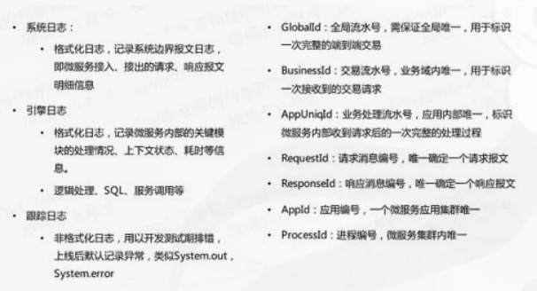

服务日志、请求日志和跟踪日志。在出问题的时候能帮助我们快速进行问题定位。

只有设计好日志内容、需要保存的信息，才能让`elk`日志系统发挥应有的价值。


* 14.集中配置管理

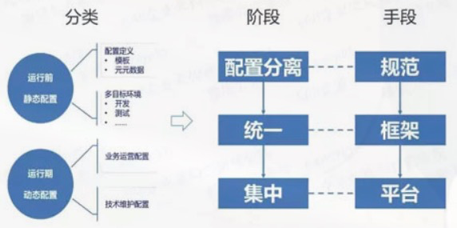

配置分为：

静态配置：编译部署包之前设置好

动态配置：系统运行中需要调整的系统变量或业务参数。需要注意以下几点：

```text
1.配置与介质分离，不要放在jar包里
2.配置的方式要统一，要采用统一的配置框架
3.需要运行时有个配置中心来统一管理业务系统中的配置信息
```


* 15.统一管理门户

微服务架构中，一个大得`EAR、WAR`应用被拆分为多个小的独立可行的微服务程序，不依赖应用服务器，不依赖传统应用服务器。所以微服务运行时管理需要有统一的管理门户来支撑。


* 16.分布式事务问题

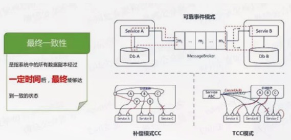

数据达到最终一致性，推荐的方式有：

* 可靠事件模式：事件的发送和接受保障高可靠性，来实现事务的一致性。
* 补偿模式：`Confirm Cancel`，如果确认失败，则全部逆序取消。
* TCC模式：`Try Confirm Cancel`，补偿模式的一种特殊实现，通常转账类交易会采用这种方式

```text
数据库一般采用的是两阶段提交：2PC的方式
Seata：一般会采用AT模式
```


* 17.分布式同步调用问题

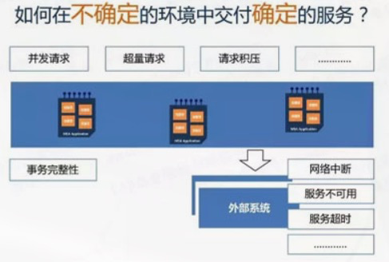

所依赖的服务的可靠性无法保证的情况下，如何保证自己能够正常的提供服务，不被我依赖的其他服务拖垮。

一般可以采用`SEDA（Staged event-drived architecture）`架构来解决问题。

本质上是采用分布式事件驱动的模式，用异步模拟来同步，无阻塞等待，再加上资源分配隔离结起来的一个解决方案。

其实这个事情本质上就是消息中间件的问题。


* 18.持续继承与持续交付设计

其实就是一个部署包，包括了配置+介质。

介质是源码编译后的产物，与环境无关，多环境下应该是可以共用的。如`jar、dockerfile`


* 19.微服务平台与容器云、DevOps的关系

微服务应用平台结合了`DevOps`和容器云之后，持续集成和交付变成一个非常简单快捷并且又可靠的过程。


## 7.秒杀系统设计

**架构原则**

```text
1.数据要尽量少：请求数据和返回数据少
2.请求数要尽量少：页面依赖的CSS/JavaScript、Ajax请求等额外请求要尽可能少
3.路径要尽量短
4.依赖要尽量少：对系统进行分级，防止重要的系统被不重要的系统拖垮
5.避免单点：机器配置动态化、应用无状态化
6.尽量将请求拦截在系统上游
7.读多写少的常用多使用缓存
```

**高性能**

```text
1.数据动静分离，秒杀页做成静态页面。需要做成动态内容：在web代理服务器上做动态内容请求
设置CDN+Nginx+Redis三级缓存

2.热点数据
1）热点识别：
静态热点数据(预热、大数据topN获取)
动态热点数据(不能被提前预测，突然增加的)
动态热点数据解决方案，可以设置一个异步系统，可以收集交易链路上各个环节的中间件产品的热点key。利用上下游的时间差，将上游获取的key提前传送给下游，做相关key保护。

2）热点隔离：
不要让 1% 影响到另外的 99%。
a）业务隔离。秒杀作为一种营销活动，卖家需要单独报名，从技术上来说，系统可以提前对已知热点做缓存预热
b）系统隔离。系统隔离是运行时隔离，通过分组部署和另外 99% 进行分离，另外秒杀也可以申请单独的域名，入口层就让请求落到不同的集群中
c）数据隔离。秒杀数据作为热点数据，可以启用单独的缓存集群或者DB服务组，从而更好的实现横向或纵向能力扩展

3）热点优化：
a）缓存热点数据，如果热点数据做了动静分离，可以长期缓存静态数据
b）限流：流量限制更多是一种保护机制。需要注意的是，各服务要时刻关注请求是否触发限流并及时进行review

3.流量削峰
防作弊答题器、消息中间件、分层过滤
分层过滤要点：
1）浏览器层：按键置灰，避免重复提交；
处理方案：token机制，第一次点击申请token存在redis中，设置过期时间；提交后后台校验token，同时删除token，生成新的token返回。

2）站点层：相同UUID，限制访问频率
3）服务层：写请求进消息队列，读请求做缓存，数据二次校验
（排队本质上是将服务层由一步操作转变成两步操作，从而起到缓冲的作用。）
4）数据层：强一致性

4.提升性能
这里仅供参考！
1）减少序列化：减少 Java 中的序列化操作可以很好的提升系统性能。
2）裁剪日志异常堆栈：无论是外部系统异常还是应用本身异常，都会有堆栈打出，超大流量下，频繁的输出完整堆栈，只会加剧系统当前负载。可以通过日志配置文件控制异常堆栈输出的深度
3）去组件框架：极致优化要求下，可以去掉一些组件框架，比如去掉传统的 MVC 框架，直接使用Servlet处理请求。这样可以绕过一大堆复杂且用处不大的处理逻辑，节省毫秒级的时间，当然，需要合理评估你对框架的依赖程度
```

**高可用**

```text
1.高可用建设
架构阶段：异地容灾
编码阶段：限流保护、超时处理、异步线程、错误捕获
测试阶段：beta测试、自动化对比测试
发布阶段：分批发布、多版本发布
运行阶段：数据对账、自动降级、过载保护、实时监控报警
故障发生：故障定位、快速恢复

2.plan B兜底
降级，限制或关闭非核心业务
限流，客户端、服务端、基于QPS和线程数限流
拒绝服务，CPU达到90%以上或者load负载达到2*cpu核数
```

**一致性**

主要涉及库存扣减问题。一般采用预扣库存。

避免超卖一般有的解决方案包括：

悲观锁、分布式锁、乐观锁、队列串行化、`Redis`原子操作等。

```text
主要是针对减库存(下单减库存，秒杀用这种方式最好、付款后减库存，可能出现超买、预扣库存)

高并发下减库存操作：
1）事务+悲观锁
select * from goods where ID=1 for update ，仅适用于InnoDB，并且必须开启事务。

2）直接设置数据库的字段数据为无符号整数，这样减后库存字段值小于零时会直接执行 SQL 语句来报错

3）乐观锁：先比较再更新
可以使用Mysql的CASE WHEN语句进行批量扣减：UPDATE item SET inventory = CASE WHEN inventory >= num THEN inventory-num ELSE inventory END

4）队列(实现起来可能不大现实)
应用层排队：按照商品维度设置队列顺序执行，能减少一台机器对数据库同一行记录进行操作的并发度，同时也减少热点商品占用太多的数据库连接 (单机)
数据库层排队：阿里 Mysql Innodb 补丁程序，实现数据库对单行记录做并发排队。

5）缓存+分布式锁
可以将库存放到redis缓存中，加上分布式锁，再从缓存中扣减库存，然后再通过MQ异步完成数据库处理。
我个人觉得这是最佳方案！
```

对系统来说，热点的实际影响就是 “高读” 和 “高写”，这是一个核心难题。

```text
1.高并发读
分层校验
读链路只做不影响性能的检查操作，如用户是否具有秒杀资格、商品状态是否正常、用户答题是否正确、秒杀是否已经结束、是否非法请求等，而不做一致性校验等容易引发瓶颈的检查操作。
可以使用redis缓存或本地缓存来抵抗高并发读，允许一定程度的数据不一致，到写数据的时候进行校验

2.高并发写
1）更换DB选型
如果减库存逻辑非常单一的话，比如没有复杂的 SKU 库存和总库存这种联动关系的话，可以将秒杀减库存直接放到缓存系统中实现(Redis)。
但如果有比较复杂的减库存逻辑，或者需要使用到事务，那就必须在数据库中完成减库存操作。

2）优化DB性能
库存数据落地到数据库实现其实是一行存储（MySQL），因此会有大量线程来竞争 InnoDB 行锁。
但并发越高，等待线程就会越多，TPS 下降，RT 上升，吞吐量会受到严重影响。
解决方案：
1）应用层排队。
通过缓存加入集群分布式锁，从而控制集群对数据库同一行记录进行操作的并发度，同时也能控制单个商品占用数据库连接的数量，防止热点商品占用过多的数据库连接

2）数据层排队。
应用层排队是有损性能的，数据层排队是最为理想的。业界中，阿里的数据库团队开发了针对InnoDB 层上的补丁程序（patch），可以基于DB层对单行记录做并发排队，从而实现秒杀场景下的定制优化。
```


## 8.分布式存储设计

负责把一个超大数据集拆分成多块，然后放到多台机器上来存储，接着统一管理这些分散在多台机器上存储的数据的一套系统。`Hadoop、Fastdfs`都是这种系统。

数据可靠性是第一要务。

要点：

**分布式、可靠性、可用性**

```text
1.分布式
把超大的数据集拆分成多偏，放在多台机器上
避免单点故障，可伸缩
2.可靠性、可用性
可靠性：副本，多副本之间的一致性问题：写时要求全部副本写完才返回，读则随意读取一份即可。
可用性：多副本冗余，节点异常重现选举
3.数据分布和重均衡
均衡分布、节点增减、容错能力
4.监测
心跳机制，让Master节点能感知数据副本是否消失。
```


## 9.抢红包设计

跟秒杀类似。

```text
发红包：秒杀商品上架
抢红包：秒杀查询库存
拆红包：秒杀动作
```

不过也有区别：

```text
1.更海量的并发请求
以用户群为单位，如果有10万个微信群，将产生海量的并发请求
2.更严格的安全级别
资金交易安全级别很高
```

对于秒杀事件，对`DB`操作有3步：

```text
1.锁库存
2.插入秒杀记录
3.更新库存
```

**解决高并发问题常用的方案**

1.内存操作代替实时的DB事务操作

2.使用乐观锁

抢红包不使用乐观锁：

```text
1.并发抢到相同版本号的拆红包请求，只有一个能拆红包成功，其他的请求将事务回滚并返回失败，给用户报错，用户体验不可接受。
2.第一时间同时拆红包的用户一部分直接返回失败，手慢的用户可能会因为并发减小后拆红包成功，这也有负面影响
3.如果采用乐观锁的方式，会地阿莱大数量的无效更新请求、事务回滚，给DB造成不必要的额外压力。
```

**微信红包的高并发解决方案**

1.系统垂直SET化，分而治之

根据红包`ID`，按一定的规则（如按ID尾号取模等），垂直上下切分。切分后，一个垂直链条是哪个的逻辑Server服务器、DB统称为一个SET。

各个SET之间相互独立，互相解耦。解决了同时存在海量事务级操作的问题，将海量化为小量。


2.逻辑Server层将请求排队，解决DB并发问题。

```text
1.将同一个红包ID的所有请求分配到同一台Server
2.设计单机请求排队方案
```


## 10.百亿数据毫秒响应级交易系统读写分离存储数据设计

1.分表分库

```text
1.实时数据和历史数据分离，实时数据日日切，每天凌晨采用离线任务批量将实时数据导入历史数据中

2.数据离散先垂直划分、再水平划分
1）垂直划分第一层：业务不同，使用表名X
2）垂直划分第二层：根据业务实体划分，某个大商户可能独占一个实体序号Y
3）水平划分：对于交易量大的实体根据流水号进行水平离散（离散序号Z）
表名A_X_Y_Z
```

2.扩容

离散表扩容，尽量以双倍比例扩容。


## 11.高并发下，如何能够保证数据的一致性？

1.高并发场景，设计写操作，不能直接操作数据库，用的缓存。

缓存操作加上分布式锁，`Redis`。

数据库操作引入乐观锁。

**解决redis缓存与数据库双写一致性**

```text
先删除缓存再更新数据库。
但是也有问题：A线程删除缓存后没来得及更新数据库，B线程查询没找到缓存，查询数据库将结果写入缓存，之后A线程更新数据库成功。造成缓存与数据库数据不一致。

解决方案：
预先创建多个内存队列queue
step1：更新数据，先删除了缓存，然后根据数据的唯一标识(id)，将请求路由到某个内存队列queue
step2：另一个查询请求，发现没缓存，也根据数据的唯一标识，将请求路由到某个内存队列queue
step3：另外一个线程，从queue中获取请求并执行
这样就保证了更新操作和查询操作的有序执行。
```


## 12.设计一个RPC框架

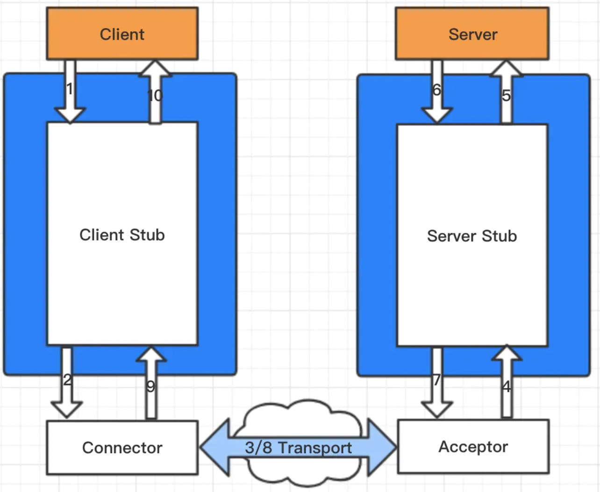

```text
要点：
1.Client以本地调用的方式调用服务
2.Client Stub接收到调用后，把服务调用相关信息组装成需要网络传输的消息体，并找到服务地址（host:port），对消息进行编码后交给Connector进行发送
3.Connector通过网络通道发送消息给Acceptor
4.Acceptor接收到消息后交给Server Stub
5.Server Stub对消息进行解码，并根据解码的结果通过反射调用本地服务
6.Server执行本地服务并返回结果给Server Stub
7.Server Stub对返回结果组装打包并编码后交给Acceptor进行发送
8.Acceptor通过网络通道发送消息给Connector
9.Connector接收到消息后交给Client Stub，Client Stub接收到消息并进行解码后转交给Client
10.Client获取到服务调用的最终结果
```

**设计要点**

```text
1.序列化、反序列化
2.通信技术：可以使用NIO，Netty
3.高并发，可以用JDK中的Executor
4.服务注册与发现，Zookeeper
5.负载均衡，Ribbon
6.非侵入式 Spring注解
```


石杉版：

```text
1.一个注册中心，服务需要去注册中心注册，保留各个服务的信息，可以用zookeeper来做
2.消费者需要从注册中心拿对应的服务信息，每个服务可能会存在于多台机器上
3.消费者发送请求。基于接口的动态代理，这个代理就是接口在本地的一个代理，然后找到对应的服务端地址
4.具体找哪台机器发送请求，需要有个负载均衡算法，比如简单的随机轮询之类的。
5.发送请求时，可以采用netty(NIO的方式)，采用什么样的数据格式(二进制/json)、协议、序列化方式
至于为啥选netty，说明一下：
1）使用JDK原生BIO(ServerSocket)，阻塞式IO法，无法支撑高并发
2）使用JDK原生NIO(Selector/SelectionKey那一套)。非阻塞时IO，可以支持高并发，但是自己实现复杂，需要处理各种网络问题
3）使用netty，天然支持高并发，封装好，API易用
6.服务端也都有个动态代理，监听某个端口，接收请求后调用本地服务，将结果返回。
```

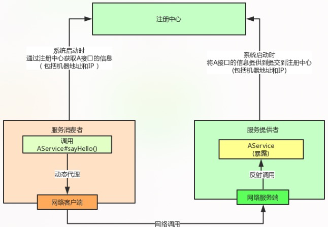


## 13.设计一个发号器

产生唯一流水号的服务系统叫发号器。

常用方案：

1.UUID

```text
能保证ID唯一，但是不能保证时间粗略有序、可反解和可制造性，UUID并不具有有序性，会导致B+树索引在写的时候有过多随机写操作
缺点：UUID占16个字节，128位，太长了。而且基于MAC地址生成UUID的算法可能会造成MAC地址泄露。

适用场景：对ID占用资源没要求，无需递增，分布式链路追踪全局ID。
```

2.基于数据库的实现方案

```text
数据库分表分库后，有一种方案是通过自增字段或者数据库sequence的步长来确保跨数据库的ID的唯一性。

自增id方案优缺点：
优点：方案简单
缺点：基于单库生成id，生成主键的库就是性能瓶颈，扛不住高并发。

适用场景：数据量很大，但是并发不高。可以采用单独的一个库和表来生成自增主键。
```


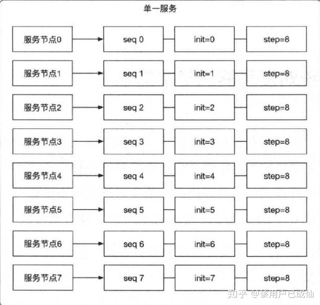

每个服务节点使用一个`sequence`功能来产生`ID`，每个`sequence`的其实`ID`是不同的，而且是一次在呢个价的，但步长都是8。

`sequence`方案存在问题：

```text
1.服务节点固定，sequence的步长也固定，将来如果增加了服务节点，则难以再进行水平扩展
2.仍然依赖于数据库，对数据库会造成压力，单点压力。
3.多个sequence是疏散管理，增加人员维护成本
```

3.雪花算法

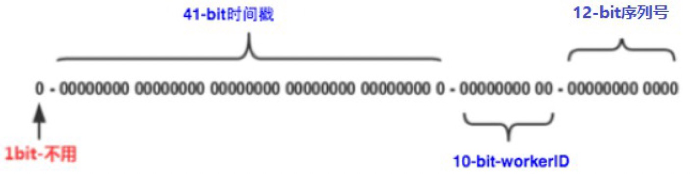

```text
64位的long类型的id。64位的long ‐> 二进制
第 1 位 ：0 （固定的，代表是正数）
第2‐42位 [共41位]：时间戳对应的二进制（处理过）。2^41‐1毫秒，69年的时间
第43‐47位[共5位] ：机房id(最多32个机房)
第48‐52位[共5位] ：机器id(最多32台机器)
第53‐64位[共12位]：序号位。记录同一ms内产生不同的id。12bit代表最大整数为：2^12‐1=4096。
1ms能生成4096个id。
同一ms，同一机房，同一机器，发送第二次请求时，后12的值就是1的二进制。

缺点：
1.强依赖机器的时钟，如果服务器时钟回拨，会导致重复ID生成。
2.在分布式环境上，每个服务器的时钟不可能完全同步，有时会出现不是全局递增的情况。
3.JS中都是double类型的浮点数，最大安全整数是前54位，后面表示指数。会导致前端显示不准确
4.有时ID是要支持分库分表的，Snowflake的默认实现对此支持不够。在并发量不大的情况下，序号位生成的基本都
是"0",转换成十进制就是偶数，然后hash(id)取模，分配不均。 可以借助ID的时间戳部分取模。
```

**解决时钟回拨的方案**

在内存中把过去1个小时之内生成的每一毫秒的每台机器生成的id都在内存里保存最大的那个id。

```text
12:00:00 500 28 20
12:00:00 300 28 8
如果发生时钟回拨，此时看看时钟回拨到之前的哪一毫秒里去，直接接着在那一毫秒的最大id继续自增就可以了，即：
12:00:00 500 28 21
```


**分布式系统对发号器的基本需求**

```text
1.全局唯一
可以使用锁，就会大大降低性能
一般采用时间的有序性，在时间的某个单元下采用自增序列，来达到全局唯一

2.粗略有序
秒级有序、毫秒级有序，不能保证全局有序

3.可反解
线上排查根据ID反解出信息

4.可制造
系统出问题可以手工处理，数据污染的话可以洗数据。需要保证ID可复制、客户服、可制造

5.高性能

6.高可用

7.可伸缩
```


## 14.设计一个分布式锁

分布式锁特点：

```text
1.互斥性：同一时刻只能有一个线程持有锁
2.可重入性：可以多次获取锁
3.锁超时：需要设置锁失效时间，避免一直阻塞
4.高性能和高可用：具备容错性，集群部署。
5.具备阻塞和非阻塞性：线程阻塞，等待唤醒；线程没拿到锁直接返回，等最先拿到锁的线程释放锁才能去竞争获取锁
```


1.redis分布式锁

```text
1.单机版
set lock_key random_value NX PX 5000
random_value: 客户端生成的唯一的字符串
NX：代表键不存在，才对键进行设置操作
PX 5000：设置键的过期时间为5000毫秒

# 解锁 保证解锁操作的原子性，使用LUA脚本实现：
if redis.call('get',KEYS[1]) == ARGV[1] then 
   return redis.call('del',KEYS[1]) 
else
   return 0 
end

但是单机版存在问题：
比如采用的单个master的redis，一个slave节点，配置了哨兵机制。由于redis同步数据是异步的，此时如果master挂了，而slave节点并没有该锁信息。所以：这种方案在redis的master节点挂了后，slave节点变成master节点，客户端发送请求过来此时也可以加锁成功，导致出现同一把锁被两个客户端同时持有。因此要采用集群锁

2.基于RedLock算法，集群中大多数节点加锁成功才算加锁成功。
// 需要多个redisson的实例
RLock lock1 = redissonInstance1.getLock("lock1");
RLock lock2 = redissonInstance2.getLock("lock1");
RLock lock3 = redissonInstance3.getLock("lock1");
RedissonRedLock lock = new RedissonRedLock(lock1, lock2, lock3);
// 同时加锁：lock1 lock2 lock3
// 红锁在大部分节点上加锁成功就算成功。
lock.lock();
...
lock.unlock();
```


2.zookeeper分布式

```text
一般采用curator来实现分布式锁，原理：
1）向zk发起请求，在一个目录(/locks/pd_1_stock)下，创建一个临时节点，也是带有自己客户端的id；
2）如果目录是空的，自己创建出来的节点就是第一个节点，那么加锁成功。如果成功则释放(节点删除)
3）如果宕机，基于zk的心跳机制，临时节点也会被删除。第二个客户端请求锁时，也创建一个节点，如果不是第一节点，那么向上一节点加一个watcher监听器。如果上一个节点被删除立马会感知到，然后在判断自己是不是第一节点，如果不是再监听上一级(公平锁实现)。完事后陷入等待，直到获取锁。
```


## 15.设计一个高并发系统

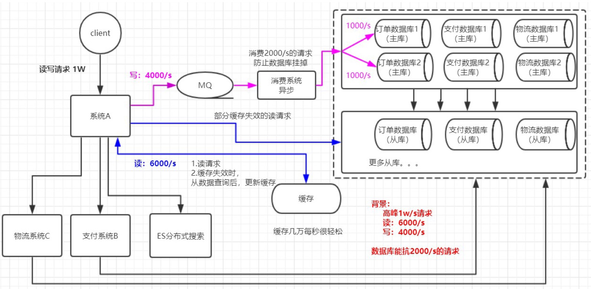

```text
1.系统拆分：
数据库抗2000QPS，有点压力，将系统A拆分成多个系统，每个系统对接自己的数据库，实现数据库分库操作，此时数据库可以抗几千QPS
2.缓存：
如果还扛不住，而且访问数据库主要是读请求，此时可以加缓存，可以轻松抗几万/s的并发
3.MQ:
写请求太多，频繁访问数据库，此时很危险，用MQ进行削峰
4.分库分表：
但是如果写请求太多了（4000 QPS），削峰不能太影响消费速率，此时可以执行分表分库
5.读写分离：
如果别的系统还会读数据库，请求QPS也很大，此时可以对数据库进行读写分离，主写从读
6.查询搜索用es:
小的支线，Java搜索一开始用lucene，单机放不下，直接用分布式搜索引擎，elasticsearch集群。每秒可以支撑几万个请求
```


## 16.如何设计一个百万级用户的抽奖系统？

抽奖、抢红包、秒杀，这类系统其实都有一些共同的特点，那就是在某个时间点会瞬间涌入大量的人来点击系统，给系统造成瞬间高于平时百倍、千倍甚至几十万倍的流量压力。

需求场景：

参与抽奖的用户可能有几十万，一瞬间可能几十万请求涌入过来，接着瞬间其中1万人中奖了，剩余的人都是没中奖的。然后中奖的1万人的请求会联动调用礼品服务，完成这1万中奖人的礼品发放。

1.负载均衡层限流

防止同一个用户写脚本刷奖，导致流量激增。

2.全部开奖后暴力拦截流量

请求没必要转发到`tomcat`服务中去，直接暴力拦截即可。抢红包、秒杀都是如此。

这里的技术细节是：必须让抽奖服务和负载均衡之间有一个状态共享机制，抽奖服务一旦全部开奖完毕，直接更新一个共享状态。负载均衡感知到之后，后续请求全部拦截掉返回一个抽奖结束的标志就可以了。可以用`Redis、Zookeeper`来做。

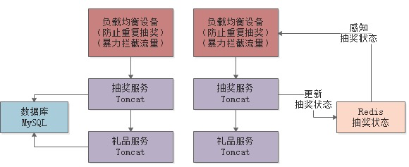

3.Tomcat线程优化

保证在`200-500`之间，具体多少要自己压测，看`CPU`负载以及线程执行请求的效率。

4.抽奖服务压力，可以临时扩充机器

5.使用Redis代替MySQL抗并发

6.抽奖完的发送礼品环节进行流量削峰，不需要立刻执行，使用MQ限流削峰，后台起服务慢慢执行。


## 16.如何设计一个电商平台积分兑换系统

需求场景：

```text
1.用户在电商平台里平时通过购买商品、晒单评论可以有不断的积累积分
2.积累到足够的积分后，就可以在电商平台的积分兑换页面中，选择使用自己的积分来兑换一些礼品
```

对业务流程的思考：

1.表设计：

```text
1.积分表
id(自增id主键)、user_id（用户id）、credit(积分)

2.积分兑换表
id(自增id主键)、user_id(用户id)、exchange_credit(用户兑换的积分)、product_id(兑换的商品id)

3.发货申请表
id(自增id主键)、type(发货类型，1：购买，2：积分兑换)、credit_excahnge_id(积分兑换表id)、product_id(要发货的商品id)、express_no(物流单号)
```

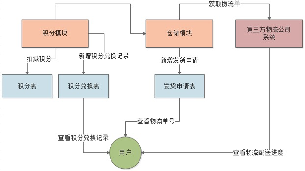

流程：

```text
扣减积分 --> 新增积分兑换记录 --> 调用仓储服务
```

2.上述流程需要加上分布式事务

3.仓储模块没必要同步调用积分模块，可以引入消息中间件

4.重试机制，引入消息中间件需要加上可靠消息服务，保证消息一定能发送成功

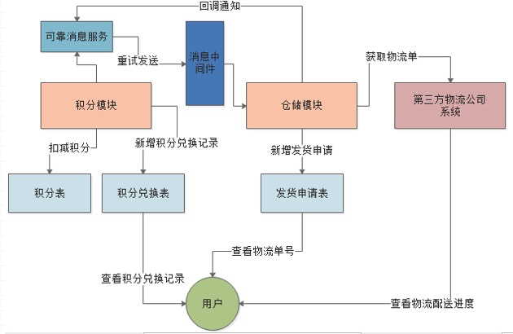

5.引入幂等性机制

如果重试，可能存在消息重复消费问题，此时做幂等处理。

```text
发货申请表
id(自增id主键)、type(发货类型，1：购买，2：积分兑换)、credit_excahnge_id(积分兑换表id)、product_id(要发货的商品id)、express_no(物流单号)
credit_exchange_id 建立唯一索引即可
```


## 17.设计一个自研服务注册中心


```text
1、不采用zk那种事件监听的方式，采用eureka主动读、心跳监听的方式。
（避免了zk那样通知所有实例，避免惊群效应）
2、注册中心节点间不通信，只是master‐slave同步注册表。不要让单个节点保存所有注册表信息。
（避免了eureka的每个节点承载所有的注册表信息，承担不了高并发）
3、服务消费者只拉取自己调用的服务提供者的部分注册表。不做全量拉取。
（避免了zk那样通知所有实例）
4、保证强一致性。每次服务注册都必须master、slave都注册成功，才算注册成功。
（避免了eureka的只能保证最终一致性问题）
```


## 18.设计实现一个通用的分布式事务框架

对于TCC的解释:

- Try阶段：尝试执行,完成所有业务检查（一致性）,预留必须的业务资源（准隔离性）
- Confirm阶段：确认执行真正执行业务，不作任何业务检查，只使用Try阶段预留的业务资源，Confirm操作满足幂等性。要求具备幂等设计，Confirm失败后需要进行重试。
- Cancel阶段：取消执行，释放Try阶段预留的业务资源，Cancel操作满足幂等性，Cancel阶段的异常和Confirm阶段异常处理方案基本上一致。


举例：

```text
1.如果你用100元买了一瓶水， Try阶段:你需要向你的钱包检查是否够100元并锁住这100元，水也是一样的。
2.如果有一个失败，则进行cancel(释放这100元和这一瓶水)，如果cancel失败，不论什么失败都进行重试cancel，所以需要保持幂等。
3.如果都成功，则进行confirm,确认这100元扣，和这一瓶水被卖，如果confirm失败无论什么失败则重试(会依靠活动日志进行重试)。
```

场景：

跟钱打交道的，严格保证分布式事务要么成功，要么全部自动回滚。

**优点**

针对XA，解决了其几个缺点: 

- 1.解决了协调者单点，由主业务方发起并完成这个业务活动。业务活动管理器也变成多点，引入集群。
- 2.同步阻塞:引入超时，超时后进行补偿，并且不会锁定整个资源，将资源转换为业务逻辑形式，粒度变小。
- 3.数据一致性，有了补偿机制之后，由业务活动管理器控制一致性。

**缺点**

需要自己手写回滚或补偿逻辑，比较恶心。


如果要自己实现`TCC`分布式事务：

```text
# 基于TCC来实现
1.设置合理的资源管理器(Resource Manager)，来存储数据
2.应具备故障恢复机制
记录相应的事务日志，根据事务日志继续执行之前未完成的提交、回滚操作
3.应提供幂等保障
TCC事务 Confirm、Cancel业务可能会被重复调用，需要保障其幂等性
4.Confirm/Cancel必须在Try操作之后进行
```


## 19.如何设计一个多级缓存解决方案？

```text
多级缓存：一个系统的不同架构层级进行数据缓存，以提升访问效率

多级缓存系统存在的问题：
1）缓存热点，多级缓存系统大多应用在高并发场景下，所以需要解决热点key问题，如何探测热点key?
两种策略：
1.静态热点，根据以往数据去预测热点key
2.动态热点，用storm去统计一个时间段内的请求量，从而判断热点key，将数据写入zookeeper节点中，应用系统监控znode节点，读取热点数据，去数据库中加载数据到缓存中并且做到负载均衡。

注意：热点key出现hash冲突解决方案：阿里的有序hash环

2）数据一致性，各层缓存之间的数据一致性问题
单层缓存系统，可以先删缓存再更新数据库再加内存队列来解决。也可以使用缓存双删来解决。
内存队列存在的优化点：
1.多个更新缓存请求，只保留第一个
2.多个读请求，如果跟更新缓存请求不冲突，可以直接让读请求访问缓存，如果冲突的话读请求做去重处理，跟在更新请求后面。

多级缓存系统，先删除缓存，需要逐层做删除操作，一系列的操作对系统带来的耗时比较大。
分布式架构来说，优先保证系统可用性，不将缓存加入事务会引起短时间内数据不一致，是可以接受的。

3）缓存过期
常用缓存淘汰方案：
1.FIFO：使用FIFO算法来淘汰过期缓存。先进先出
2.LFU：使用LFU算法来淘汰过期缓存。最不经常使用
缺点：最新加入的数据常常被剔除，因为起始次数太少。
3.LRU：使用LRU算法来淘汰过期缓存。最近最少使用
缺点：由于一次冷数据的批量查询而误导大量热点的数据
可以借鉴MySQL中的冷数据查询要判断1s后有没有使用，如果还会被使用才会被放置在热数据头部
```


**有赞解决方案**

```text
1.热点探测：如何快速且准确的发现热点访问key？
常见手段：
基于大数据领域的流式计算技术来进行实时数据访问次数的统计，比如storm、spark streaming、flink等，一旦在实时数据访问次数统计的过程中，比如发现一秒之内，某条数据突然访问次数超过1000，就直接立马把这条数据判定为热点数据，可以将这个发现出来的热点数据写入比如zookeeper中

zookeeper指定的热点缓存对应的znode进行监听，如果有变化他立马就可以感知到了。
系统层可以将相关的缓存数据从数据库加载出来，直接放在自己系统内部的本地缓存：ehcache、hashmap等
让热点请求数据直接请求到机器

可封装一个SDK来做这个事情：热点发现+本地缓存
有赞的做法是：rsyslog + kafka(时间滑窗)

2.数据一致性：数据库、应用层本地缓存与分布式系统的数据一致性？
数据库与分布式缓存系统的数据一致性：先删数据库，再删缓存+内存队列来解决
本地缓存与分布式缓存系统的数据一致性：本地缓存仅缓存热点key数据，绝大多数非热点key数据有缓存集群存储，
热点key变更导致value失效，同步失效本地缓存，保证本地花奴才能强一致，集群内用事件广播，异步失效业务应用集群中其他节点的本地缓存，保证集群最终一致。

3.效果验证：如何让应用层查看本地缓存命中率、热点key等数据，验证多级缓存效果？

4.透明接入：整体解决方案如何减少对应用系统的入侵，做到快速平滑接入？
SDK封装好
```


## 20. Java做过什么比较高级的项目？

```text
做过一个亿级流量电商缓存页项目。
多级缓存架构：nginx+redis+ehcache

基本流程大概是：
1、应用nginx的lua脚本接收到请求

2、获取请求参数中的商品id，以及商品店铺id

3、根据商品id和商品店铺id，在nginx本地缓存中尝试获取数据

4、如果在nginx本地缓存中没有获取到数据，那么就到redis分布式缓存中获取数据，如果获取到了数据，还要设置到nginx本地缓存中

但是这里有个问题，建议不要用nginx+lua直接去获取redis数据

因为openresty没有太好的redis cluster的支持包，所以建议是发送http请求到缓存数据生产服务，由该服务提供一个http接口

缓存数生产服务可以基于redis cluster api从redis中直接获取数据，并返回给nginx

cd /usr/hello/lualib/resty/  
wget https://raw.githubusercontent.com/pintsized/lua-resty-http/master/lib/resty/http_headers.lua  
wget https://raw.githubusercontent.com/pintsized/lua-resty-http/master/lib/resty/http.lua 

5、如果缓存数据生产服务没有在redis分布式缓存中没有获取到数据，那么就在自己本地ehcache中获取数据，返回数据给nginx，也要设置到nginx本地缓存中

6、如果ehcache本地缓存都没有数据，那么就需要去原始的服务中拉取数据，该服务会从mysql中查询，拉取到数据之后，返回给nginx，并重新设置到ehcache和redis中
```

**技术难点**

1.redis、mysql缓存一致性处理

```text
采用的是先删除缓存再删数据库+内存队列的方案。
内存做过一些优化：
1）多个更新缓存请求只保留一个更新缓存请求到内存队列中
2）多个读请求，如果不跟更新缓存请求冲突，可以直接访问缓存服务返回数据，如果冲突的话读请求入队列，但是做去重处理
3）空请求需要过滤
```

**读请求优化逻辑：**

```text
1.设置flagMap(ConcurrentHashMap)，建立productId,flag的键值对
2.如果是写请求，将标志位设置为true
3.如果是读请求，如果标志位不为空，且标志位为true，此时说明已经有写请求，这个读请求可以进来，将标志位设置为false，后续读请求进不来
4.如果是读请求，如果标志位不为空，且标志位为false，说明之前已经有写请求+读请求，此时直接返回，controller层会循环查询redis
```

**空请求优化逻辑：**

```text
1.读取出来flag为null，表明之前没有写请求，数据库没有这条记录
2.此时将标志位设置为false，后面的空请求也会被过滤掉，不写入内存队列
```


2.热点key发现

```text
1.服务启动时缓存预热，不能让mysql裸奔
1）提前给redis中灌入部分数据，再提供服务
2）肯定不可能将所有数据都写入redis，因为数据量太大了，第一耗费的时间太长了，第二根本redis容纳不下所有的数据
3）需要根据当天的具体访问情况，实时统计出访问频率较高的热数据
4）然后将访问频率较高的热数据写入redis中，肯定是热数据也比较多，我们也得多个服务并行读取数据去写，并行的分布式的缓存预热
5）然后将灌入了热数据的redis对外提供服务，这样就不至于冷启动，直接让数据库裸奔了


2.热点key发现
1）nginx+lua将访问流量上报到kafka中
要统计出来当前最新的实时的热数据是哪些，我们就得将商品详情页访问的请求对应的流量，日志，实时上报到kafka中

2）storm从kafka中消费数据，实时统计出每个商品的访问次数，访问次数基于LRU内存数据结构的存储方案
优先用内存中的一个LRUMap去存放，性能高，而且没有外部依赖。其实我们只要统计出最近一段时间访问最频繁的商品，然后对它们进行访问计数，同时维护出一个前N个访问最多的商品list即可

热数据，最近一段时间，可以拿到最近一段，比如最近1个小时，最近5分钟，1万个商品请求，统计出最近这段时间内每个商品的访问次数，排序，做出一个排名前N的list

计算好每个task大致要存放的商品访问次数的数量，计算出大小

然后构建一个LRUMap，apache commons collections有开源的实现，设定好map的最大大小，就会自动根据LRU算法去剔除多余的数据，保证内存使用限制

即使有部分数据被干掉了，然后下次来重新开始计数，也没关系，因为如果它被LRU算法干掉，那么它就不是热数据，说明最近一段时间都很少访问了

3）每个storm task启动的时候，基于zk分布式锁，将自己的id写入zk同一个节点中

4）每个storm task负责完成自己这里的热数据的统计，每隔一段时间，就遍历一下这个map，然后维护一个前3个商品的list，更新这个list

5）写一个后台线程，每隔一段时间，比如1分钟，都将排名前3的热数据list，同步到zk中去，存储到这个storm task对应的一个znode中去

6）我们需要一个服务，比如说，代码可以跟缓存数据生产服务放一起，但是也可以放单独的服务

服务可能部署了很多个实例

每次服务启动的时候，就会去拿到一个storm task的列表，然后根据taskid，一个一个的去尝试获取taskid对应的znode的zk分布式锁

如果能获取到分布式锁的话，那么就将那个storm task对应的热数据的list取出来
```


3.对高可用系统的理解

最理想的状况下，软件的故障，就不应该说导致整个系统的崩溃。

```text
微服务架构本身最最核心的保障高可用的措施，就是两点：
1）一个是基于Hystrix做资源隔离以及熔断；
2）另一个是做备用降级方案。
```

高可用系统架构：

```text
1.资源隔离，让你的系统里，某一块东西在故障的情况下，不会耗尽系统所有的资源，比如说线程资源
2.限流，高并发流量涌入进来，做一些限流工作
3.熔断，系统后端的一些依赖，出了一些故障，比如说mysql挂掉了，每次请求都是报错的，熔断了，后续的请求过来就直接不接收了，拒绝访问，10分钟之后再去尝试去看看mysql是否恢复
4.降级，mysql挂了，系统发现了，自动降级，从内存里存的少量数据中，去提取一些数据出来
```

使用的是`hystrix`。

`hystrix`设计原则：

```text
1.在依赖服务调用时出现的调用延迟和调用失败进行控制和容错保护
2.在复杂的分布式系统中，组织某一个依赖服务的故障在整个系统中蔓延
3.提供fail-fast快速失败和快速恢复的支持
4.提供fallback优雅降级的支持
5.支持近实时的监控、报警
```

更加细节的设计原则

```text
1.阻止任何一个依赖服务耗尽所有的资源，比如tomcat中的所有线程资源
2.避免请求排队和积压，采用限流和fail fast来控制故障
3.提供fallback降级机制来应对措施
4.使用资源隔离技术，比如bulkhead(舱壁隔离技术)、swimlane(泳道技术)、circuit breaker(短路技术)，来限制任何一个依赖服务的故障的影响
5.通过近实时的统计、监控、报警功能，来提高故障发现的速度
6.通过近实时的属性和配置热修改功能，来提高故障处理和恢复的速度
7.保护依赖服务调用的所有故障情况，而不仅仅只是网络故障情况
```

`Hystrix`是如何实现它的目标的？

```text
1.通过HystrixCommand或者HystrixObservableCommand来封装对外部依赖的访问请求，这个访问请求一般会运行在独立的线程中，资源隔离

2.对于超出我们设定阈值的服务调用，直接进行超时，不允许其耗时过长时间阻塞住，这个超时时间默认是99.5%的访问时间，但是一般我们可以自己设置一下

3.为每一个依赖服务维护一个独立的线程池，或者是semaphore，当线程池已满时，直接拒绝对这个服务的调用

4.对依赖服务的调用的成功次数、失败次数、拒绝次数、超时次数进行统计

5.如果对一个依赖服务的调用次数超过一定的阈值，自动进行熔断，在一定时间内对该服务的调用直接降级，一段时间后再自动尝试恢复。
熔断器的三个重要参数：快照时间窗、请求总数阈值、错误百分比阈值
1）快照时间窗：断路器确定是否打开需要统计一些请求和错误数据，而统计的时间范围就是快照时间窗，默认为最近的10秒
2）请求总数阈值：在快照时间内，必须满足请求总数阈值才有资格熔断。默认为20，意味着在10秒内，如果该hystrix命令的调用次数不足20次，即使所有的请求都超时或其他原因失败，断路器都不会打开
3）错误百分比阈值：当请求总数在快照时间窗内超过阈值，比如发生了30次调用，如果在这30次调用中，有15次发生了超时异常，也就是超过50%的错误百分比，在默认设定50%阈值情况下，这时候就会将断路器打开

6.当一个服务调用出现失败，被拒绝，超时，短路等异常情况，自动调用fallback降级机制

7.对属性和配置的修改提供近实时的支持。
```


## 21.最近看过什么书？

`MySQL技术内幕-InnoDB存储引擎`

1.对索引的认识提高了。

```text
1.判断走辅助索引还是聚簇索引，优化器根据访问的数据是否占据全表数据的20%，如果低于一般可以走辅助索引，如果高于一般走聚簇索引(表扫描)，因为顺序读要远远快于离散读

2.索引优化策略：使用Multi-Range Read(MRR)优化，减少磁盘的随机访问，并且将随机访问转化为较为顺序的数据访问。工作方式：
1）将查询得到的辅助索引键值存放于一个缓存中，这时缓存中的数据是根据辅助索引键值排序
2）将缓存中的键值根据RowID进行排序
3）根据RowID的排序顺序来访问实际的数据文件
```

2.对几种`log`认识提高了。

```text
redo log：记录物理修改内容，某数据页做了什么记录，什么修改，MySQL宕机用redo log恢复数据，InnoDB引擎持有
binlog：记录逻辑修改内容，对users表中id=10的数据做了更新操作，更新的值是多少，用于主从复制，是mysql-server自己的日志文件
undo log：逻辑概念，记录与数据库相反的增删改操作，用于回滚事务、记录与数据库相反的操作。
有版本链的概念：trx_id 最新一次更新这条数据的事务id，roll_pointer指向你更新这个事务之前生成的undo log
```

3.对`ReadView`机制有一定了解。

```text
组成：
m_ids:有哪些事务在MySQL中执行还没提交
min_trx_id:m_ids里最小的值
max_trx_id:mysql下一个要生成的事务id，就是最大事务id
creator_trx_id:创建事务id

1.Read Committed级别
1）每次发起查询都会重新生成一个ReadView
2) 事务A/B执行，两者的trx_id都在m_ids列表，事务B未提交时，属于ReadView的活跃事务id范围，事务A是无法查到事务B修改的值
3）事务B提交，事务A下次查询肯定能查到事务修改过的值，因为又产生了新的ReadView，事务B又提交了，肯定能读到

2.Repeatable Read级别
1）事务读一条数据，无论读多少次都是一个值，别的事务即使修改数据之后提交了，也看不到别人修改的值。
2）事务A/B执行，事务B提交，但是m_ids列表中的trx_id是不变的，此时事务A发现此时事务trx_id在m_ids列表中，说明是事务B更新了这条数据，此时事务A是不能查询到事务B更新的值的，会顺着undo log版本链找到小于min_trx_id的最大事务trx_id
3）幻读，select * from table1 where id > 10，比如说符合要求的是10条数据，之前事务C插入一条数据并提交，此后事务A再次查询，发现符合条件的数据有11条，但是事务C插入的数据trx_id大于自己的ReadView的max_trx_id的，说明是自己发起查询之后，这个事务才启动，所以这条数据是不能查询的。
```

4.对`MySQL`性能有了一点新的认识

```text
增删改操作首先是针对这个内存中的Buffer Pool里的数据执行的，配合后续redo log做脏页刷新、刷磁盘等操作。

这个设置缓存的机制其实在Kafka、ES中都是有的。Page Cache.

```


```text
聚簇索引：将数据存储与索引放到了一块，找到索引就找到了数据。B+树叶子节点上的data就是数据本身。(Innodb)

非聚簇索引：将数据存储于索引分开结构，B+树叶子节点存放的是数据存放的地址。(MyISAM)

辅助索引(Secondary Index)：叶子节点并不包含行记录的全部数据(其实也可以认为是非聚簇索引)，包含一个书签，该书签用来告诉Innodb引擎哪里可以找到与索引相对应的行数据。
先通过页级别的指针获得指向主键索引的主键，再通过主键索引找到一个完整的行记录。

注：判断用辅助索引还是聚簇索引(组合索引)，如果要求访问的数据量很小，优化器会优先选择辅助索引，如果访问的数据占整个表中蛮大一部分时(20%)，优先选择聚簇索引。

联合索引：对表上的多个列进行索引，键值数量大于等于2。
1)需要满足最左匹配原则。
(a,b)联合索引，where a = xxx可以，where b = xxx不行
2）对第二个键值进行了排序处理，做了一点优化
select * from buy_log where user_id = 1 order by buy_date desc limit 3;
查看执行计划，possible_keys有两个索引，Extra中显示Using index说明优化器优先使用了组合索引，否则会有Using filesort选项
注意(a,b,c)这种组合索引，不能跳过：select * from table1 where a = xxx order by c，这时候c还需要做一次filesort排序，因为索引(a,c)并未排序。

覆盖索引：从辅助索引中就可以查询到记录，不需要再做一次回表操作，可以减少大量的IO操作
一般select id(主键) from table1 where id = xx和select count(*) from table1都可以。
查看select count(*) from buy_log的执行计划，possible_keys列为null，但是Extra列使用了Using index就代表了优化器进行了覆盖索引操作

自适应哈希索引：对于字典类型的查找非常迅速。select * from table1 where index_col = xxx
这个是由Innodb存储引擎自己控制，可以使用innodb_adaptive_hash_index来禁用或启动特性。默认是开启。

全文检索：select * from table where content like 'xxx%'
使用倒排索引

不使用索引：范围查找，Join链路操作
```

为什么不用`B-Tree`，为什么不用`hash`?

```text
B树每个索引都有data域，每次节点数目非常多，层数很少，减少了磁盘IO次数。但是由于每个节点上都有数据，这样导致在非叶子节点中能保存的指针数量变少，指针少的情况下要保存大量数据，只能增加树的高度，导致IO操作变多，查询性能变低。

相比较而言B+树遍历直接遍历叶子节点，同时一般还会进行一个优化，将所有叶子节点用指针串起来，可以进行区间访问。

B+树的优点：
1）B+的内部节点并没有执行关键字具体信息的指针，因此其内部节点相对于B树更小。盘中能容纳的关键字数量也越多，一次性读入内存中的需要查找的关键字也越多，相对来说IO读写次数也就降低了
2）B+树的查询性能更稳定，任何关键字的查找都必须走一条从根节点到叶子节点的路，所有关键字查询的路径长度相同，导致每个数据的查询效率相当。

不用hash的原因：
1）不支持范围查询
2）hash索引存放的是经过hash计算之后的hash值，并不一定与hash运算前的键值一样，排序会存在问题
3）hash不能避免表扫描
4）hash索引遇到大量的hash值相等的情况性能比较差，存在hash冲突。
```

使用索引需要注意的地方：

```text
1.满足最左前缀原则，组合索引(A,B,C)，相当于创建了(A),(A,B),(A,B,C)三个索引
1）不能跳过索引中的列，例如：where A = '1' and C = '2'，只有A能使用索引，C不能使用索引
2）MySQL能在索引中做最左前缀匹配的like比较，但是如果开头是通配符的like比较，就不能使用索引
like 'name%'可以，like '%name'

2.如果查询中有某个列的范围查询，则其右边所有列都无法使用索引优化查找
where A='name' and B like 'name%' and C = 'name'，只有A、B能使用索引，C不能使用索引

3.where条件中包含表达式或函数的参数不能使用索引
while A='name' and 函数(B)='name'

4.创建索引的时候，需要考虑字段值distinct的占比，如果太低，建议不用这个字段作为索引。
比如：status = 0/1 这种，你用where status = 1去查找100行的数据，能查出50行，这已经类似全表扫描了
用select count(distinct(col)) / count(*)在创建索引之前进行检测

可以用：show index from table1查看Caedinality的值，接近1就比较合适用他做索引

5.前缀索引
某个字段是字符串，很长，如果你要建立索引，最好就对这个字符串的前缀来创建，比如前10个字符这样子，要用前多少位的字符串创建前缀索引，就对不同长度的前缀看看选择性就好了，一般前缀长度越长选择性的值越高。
```

